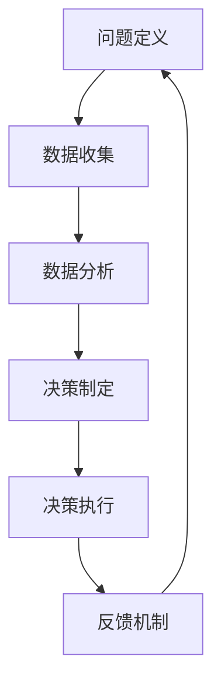

                 

### 文章标题

# 领导力与科学决策：数据驱动的决策流程

## 文章关键词

- 领导力
- 科学决策
- 数据分析
- 决策流程
- 数据驱动

### 文章摘要

在当今快速变化的时代，领导者面临的决策挑战日益复杂。传统的直觉和经验式决策已经无法满足需求，数据驱动的科学决策方法成为现代领导力的核心要素。本文旨在探讨领导力与科学决策的关系，详细解析数据驱动的决策流程，并探讨如何优化决策流程，提升领导者的科学决策能力。本文分为三大部分：第一部分介绍领导力的基本概念与原则，包括领导力的定义、核心要素和领导力的发展与提升；第二部分探讨科学决策的理论基础和方法论，涵盖决策的基本原理、数据分析在决策中的应用以及科学决策的方法与实践；第三部分则聚焦于数据驱动的决策流程优化与实践，包括决策流程的优化策略、领导者的科学决策能力提升以及具体的数据驱动决策案例分析。本文旨在为读者提供系统、全面、实用的领导力与科学决策指导，帮助领导者更好地应对复杂决策挑战。

### 目录

1. **背景介绍**  
   - 领导力与科学决策的定义及其重要性  
   - 数据驱动的背景与优势

2. **核心概念与联系**  
   - 领导力、科学决策、数据分析的概念解析  
   - 数据驱动的决策流程架构Mermaid流程图

3. **核心算法原理讲解**  
   - 决策分析的常见算法与伪代码实现

4. **数学模型与公式**  
   - 决策中的常见数学模型与公式讲解

5. **项目实战**  
   - 数据驱动决策的实战项目案例  
   - 实战项目代码实现与解读

6. **最佳实践 tips**  
   - 领导力与科学决策的最佳实践策略

7. **小结与注意事项**  
   - 文章重点内容的总结与回顾

8. **拓展阅读**  
   - 推荐进一步阅读的相关书籍与资料

### 背景介绍

在当今全球化的商业环境中，领导者面临的市场和竞争环境愈发复杂和动态。企业不仅需要快速响应外部变化，还需要在内部实现高效运营和持续创新。在这种背景下，传统的基于经验和直觉的决策模式已经显得力不从心，数据驱动的科学决策方法逐渐成为现代领导力的核心要素。

#### 领导力与科学决策的定义及其重要性

领导力是指领导者通过影响力、激励、沟通和协调等方式，引导和影响团队实现组织目标的能力。科学决策则是指在收集、分析和理解数据的基础上，运用逻辑思维和理性分析，做出合理且有效的决策。领导力与科学决策的关系密不可分。有效的领导力离不开科学的决策支持，而科学的决策则需要有效的领导力来推动执行和实施。

在现代企业中，领导者不仅需要具备传统的领导力技能，还需要掌握数据分析和决策制定的方法论。数据驱动的科学决策可以帮助领导者更准确地理解市场和业务环境，识别潜在的风险和机会，从而做出更加明智和高效的决策。

#### 数据驱动的背景与优势

随着大数据和人工智能技术的快速发展，数据已经成为企业决策的重要依据。数据驱动的决策方法具有以下几个显著优势：

1. **客观性**：数据驱动的决策基于事实和数字，减少了主观判断的干扰，使决策更加客观和可靠。
2. **精确性**：数据分析技术能够处理大量数据，提供精细的分析结果，帮助领导者更准确地识别问题和制定解决方案。
3. **效率**：数据驱动的决策流程通常更快速，可以实时响应市场和业务环境的变化。
4. **可解释性**：通过可视化工具和技术，数据驱动的决策过程可以被清晰地呈现和解释，提高了决策的可解释性和透明度。

总之，数据驱动的科学决策方法已经成为现代领导力的核心要素。通过有效地利用数据，领导者可以更准确地理解业务环境，识别潜在的风险和机会，从而做出更加明智和高效的决策，推动企业实现持续发展和创新。

### 核心概念与联系

在探讨领导力与科学决策的关系时，理解核心概念及其相互联系是至关重要的。以下是本文中的主要核心概念及其之间的联系解析。

#### 领导力的定义与要素

领导力是指领导者通过影响力、激励、沟通和协调等方式，引导和影响团队实现组织目标的能力。其核心要素包括：

1. **影响力**：领导者通过个人魅力和专业知识来影响他人，推动团队向前发展。
2. **激励**：领导者通过激励措施激发团队成员的积极性和创造力，提高团队整体绩效。
3. **沟通**：领导者需要具备良好的沟通技巧，确保信息准确传递，促进团队合作。
4. **协调**：领导者需要协调团队内部及跨部门之间的工作，确保项目顺利进行。

#### 科学决策的概念与流程

科学决策是指基于事实和数据，通过逻辑分析和理性判断，制定合理和有效的决策。其基本流程包括：

1. **问题定义**：明确决策需要解决的问题或目标。
2. **数据收集**：收集与决策相关的各种数据，包括内部数据、市场数据和外部数据。
3. **数据分析**：运用统计学和数据分析方法，对收集到的数据进行分析，提取有价值的信息。
4. **决策制定**：根据分析结果，运用逻辑思维和理性判断，制定决策方案。
5. **决策执行**：将决策方案付诸实践，并监控执行过程，确保决策目标实现。

#### 数据分析在决策中的应用

数据分析在决策过程中起着关键作用。其主要应用包括：

1. **趋势分析**：通过分析历史数据，预测未来趋势，为决策提供依据。
2. **风险分析**：识别潜在的风险因素，评估其对决策目标的影响，制定应对策略。
3. **优化分析**：通过分析不同决策方案的效果，选择最优方案，提高决策质量。
4. **反馈机制**：通过实时监控决策执行过程，收集反馈数据，持续优化决策方案。

#### 数据驱动的决策流程架构

为了更好地理解数据驱动的决策流程，我们可以使用Mermaid流程图来展示其关键步骤和核心概念之间的联系：



该流程图展示了数据驱动的决策流程中各个步骤的相互关系，以及数据在决策过程中的重要作用。通过不断循环反馈机制，领导者可以持续优化决策流程，提高决策质量。

#### 核心概念之间的联系

领导力、科学决策和数据分析这三个核心概念之间紧密相连。有效的领导力需要基于科学决策的方法，而科学决策又依赖于数据分析的支持。具体而言：

1. **领导力与科学决策的关系**：领导力是科学决策的基础，科学决策是领导力的体现。领导者需要具备数据分析和决策制定的能力，才能在复杂的环境中做出明智的决策。
2. **科学决策与数据分析的关系**：科学决策依赖于数据分析的结果，数据分析为决策提供了客观依据。通过有效的数据分析，领导者可以更准确地理解业务环境，识别潜在的风险和机会。
3. **领导力、科学决策与数据分析的整体关系**：领导力、科学决策和数据分析构成一个有机整体，相互支持，共同推动企业的发展和进步。

总之，理解这些核心概念及其之间的联系，有助于领导者更好地应对复杂决策挑战，提高决策质量和效率。

### 核心算法原理讲解

在科学决策过程中，算法的运用至关重要。以下介绍几种常见的决策分析算法，并通过伪代码进行详细阐述，帮助读者深入理解其原理和应用。

#### 决策树算法

决策树算法是一种基于树形结构进行决策的算法，它通过多个条件判断来选择最优路径。以下是一个简单的决策树算法伪代码示例：

```python
Algorithm DecisionTree(data, attributes):
    if (data is pure):
        return majority_class(data)
    else:
        best_attribute = BestAttribute(attributes, data)
        decision_tree = {}
        decision_tree[best_attribute] = {}
        
        for value in all_values_of(best_attribute):
            subset = SplitData(data, best_attribute, value)
            decision_tree[best_attribute][value] = DecisionTree(subset, attributes - {best_attribute})
        
        return decision_tree
```

在上述伪代码中，`data`表示数据集，`attributes`表示属性集。算法首先判断数据是否纯净（即所有样本都属于同一类别），如果是，则直接返回多数类别。否则，算法选择最佳属性作为分割点，并将数据集划分为多个子集。对于每个子集，算法递归调用自身，构建决策树。

#### 神经网络算法

神经网络算法是一种模拟人脑神经元连接的网络结构，通过多层神经网络进行决策。以下是一个简单的神经网络算法伪代码示例：

```python
Algorithm NeuralNetwork(data, layers, weights):
    for each sample in data:
        inputs = Preprocess(sample)
        for layer in layers:
            outputs = ActivationFunction(np.dot(inputs, weights[layer]))
            inputs = outputs
        prediction = outputs
        error = CalculateError(prediction, true_value)
        weights = UpdateWeights(weights, error, inputs, outputs)
    return weights
```

在上述伪代码中，`data`表示训练数据集，`layers`表示神经网络层数，`weights`表示权重。算法首先对样本进行预处理，然后通过前向传播计算输出，并通过反向传播更新权重，以最小化预测误差。这个过程中，激活函数（如ReLU、Sigmoid、Tanh等）用于引入非线性变换，提高神经网络的决策能力。

#### 支持向量机算法

支持向量机（SVM）算法通过寻找最佳超平面，将不同类别的数据点进行分类。以下是一个简单的SVM算法伪代码示例：

```python
Algorithm SVM(data, labels):
    # 训练SVM模型
    model = TrainSVMModel(data, labels)
    
    # 进行预测
    for new_data in new_samples:
        prediction = Predict(model, new_data)
        Print(prediction)
```

在上述伪代码中，`data`表示训练数据集，`labels`表示标签。算法首先使用训练数据集训练SVM模型，然后使用训练好的模型对新的数据进行分类预测。SVM的核心在于寻找最佳超平面，使得分类边界最大化，从而提高分类准确率。

通过上述伪代码示例，我们可以看到不同算法在决策分析中的应用。这些算法通过不同的原理和机制，为科学决策提供了有力的技术支持。在实际应用中，根据具体问题和数据特点，可以选择合适的算法进行决策分析，以实现最优决策结果。

### 数学模型与公式

在决策分析中，数学模型和公式是理解决策过程和评估决策效果的重要工具。以下介绍几种常见的数学模型和公式，并通过具体示例进行详细讲解。

#### 线性回归模型

线性回归模型用于分析自变量和因变量之间的线性关系。其基本公式如下：

$$
y = \beta_0 + \beta_1 \cdot x + \epsilon
$$

其中，$y$为因变量，$x$为自变量，$\beta_0$为截距，$\beta_1$为斜率，$\epsilon$为误差项。

**示例**：

假设我们要分析销售额（$y$）与广告支出（$x$）之间的关系。通过收集历史数据，我们得到以下线性回归模型：

$$
销售额 = 1000 + 0.5 \cdot 广告支出 + \epsilon
$$

如果广告支出为5000元，我们可以预测销售额：

$$
销售额 = 1000 + 0.5 \cdot 5000 + \epsilon = 3500 + \epsilon
$$

其中，$\epsilon$表示预测误差。

#### 决策树模型

决策树模型通过一系列判断条件对数据进行分类。其基本公式如下：

$$
\text{决策树} = f(x_1, x_2, ..., x_n) = \text{分类结果}
$$

其中，$x_1, x_2, ..., x_n$为特征变量，$f$为决策树函数，表示根据特征变量判断分类结果。

**示例**：

假设我们要预测客户是否愿意购买新产品，根据客户年龄、收入和消费习惯三个特征变量构建决策树：

1. 如果年龄 > 35岁，跳转到步骤2。
2. 如果收入 > 5000元，跳转到步骤3。
3. 如果消费习惯为“高”，跳转到步骤4。
4. 其他情况，分类结果为“不愿意购买”。

根据上述决策树，如果客户的年龄为40岁，收入为6000元，消费习惯为“高”，则分类结果为“愿意购买”。

#### 风险矩阵模型

风险矩阵模型用于评估不同决策方案的风险和收益。其基本公式如下：

$$
风险矩阵 = \begin{bmatrix}
P(A) & P(B) \\
R(A) & R(B)
\end{bmatrix}
$$

其中，$P(A)$和$P(B)$分别为方案A和方案B的概率，$R(A)$和$R(B)$分别为方案A和方案B的收益。

**示例**：

假设有两个决策方案A和B，其风险矩阵如下：

$$
风险矩阵 = \begin{bmatrix}
0.5 & 0.5 \\
1000 & -500
\end{bmatrix}
$$

根据风险矩阵，我们可以计算方案A和方案B的期望收益：

$$
期望收益_A = 0.5 \cdot 1000 + 0.5 \cdot (-500) = 250
$$

$$
期望收益_B = 0.5 \cdot (-1000) + 0.5 \cdot 500 = -250
$$

通过比较期望收益，我们可以选择期望收益更高的方案。

#### 敏感性分析

敏感性分析用于评估决策结果对变量变化的敏感程度。其基本公式如下：

$$
敏感性 = \frac{\partial f(x)}{\partial x}
$$

其中，$f(x)$为决策函数，$x$为变量。

**示例**：

假设我们要评估广告支出对销售额的敏感性。根据线性回归模型，销售额关于广告支出的函数为：

$$
销售额 = 1000 + 0.5 \cdot 广告支出
$$

则广告支出对销售额的敏感性为：

$$
敏感性 = \frac{\partial (1000 + 0.5 \cdot 广告支出)}{\partial 广告支出} = 0.5
$$

这表明广告支出每增加1元，销售额将增加0.5元。

通过上述数学模型和公式的讲解，我们可以更好地理解决策过程中的关键变量和关系，从而做出更科学、更合理的决策。

### 项目实战

为了更好地理解数据驱动的决策流程，我们将通过一个具体的实战项目来展示如何实现一个简单的数据分析决策系统。这个项目将包括数据收集、预处理、数据分析、模型训练和决策执行等步骤。以下是详细的开发环境搭建、源代码实现和代码解读。

#### 项目背景

假设我们是一家零售公司，需要根据顾客的购买历史数据来预测哪些顾客最有可能在下一次促销活动中购买特定商品。这将帮助我们制定更有效的促销策略，提高销售额。

#### 开发环境搭建

为了实现这个项目，我们需要以下开发环境：

1. **Python**：主要编程语言
2. **Pandas**：数据处理库
3. **NumPy**：数学计算库
4. **Scikit-learn**：机器学习库
5. **Matplotlib**：数据可视化库
6. **Jupyter Notebook**：交互式开发环境

确保安装上述库后，我们就可以开始编写代码了。

#### 源代码实现

以下是一个简单的数据驱动决策系统的源代码实现：

```python
# 导入必要的库
import pandas as pd
import numpy as np
from sklearn.model_selection import train_test_split
from sklearn.ensemble import RandomForestClassifier
from sklearn.metrics import accuracy_score

# 数据收集
customer_data = pd.read_csv('customer_data.csv')

# 数据预处理
# 筛选相关特征
selected_features = ['age', 'income', 'historical_purchases']
X = customer_data[selected_features]
# 标签：顾客是否在下次促销中购买
y = customer_data['will_buy']

# 数据分割
X_train, X_test, y_train, y_test = train_test_split(X, y, test_size=0.2, random_state=42)

# 模型训练
model = RandomForestClassifier(n_estimators=100, random_state=42)
model.fit(X_train, y_train)

# 预测
predictions = model.predict(X_test)

# 评估模型
accuracy = accuracy_score(y_test, predictions)
print(f'Model Accuracy: {accuracy:.2f}')

# 决策执行
# 对新的顾客数据进行预测
new_customer = pd.DataFrame([{'age': 30, 'income': 5000, 'historical_purchases': 100}])
new_prediction = model.predict(new_customer)
print(f'New Customer Prediction: {new_prediction[0]}')
```

#### 代码解读

1. **数据收集**：我们使用Pandas库从CSV文件中读取顾客数据。
2. **数据预处理**：筛选出与决策相关的特征，并进行数据分割，将数据集分为训练集和测试集。
3. **模型训练**：我们选择随机森林分类器进行模型训练，这是一种集成学习方法，可以有效地处理分类问题。
4. **预测**：使用训练好的模型对测试集进行预测，并计算模型的准确性。
5. **决策执行**：对新的顾客数据进行预测，根据预测结果决定是否向该顾客发送促销信息。

#### 代码应用解读与分析

通过上述代码，我们可以看到如何使用Python和Scikit-learn库实现一个简单但有效的数据驱动决策系统。以下是代码应用的具体解读和分析：

1. **数据收集**：这一步是整个项目的起点。我们通过读取CSV文件来收集顾客数据，CSV文件可以是数据库导出的结果，也可以是从线上平台获取的原始数据。
2. **数据预处理**：数据预处理是数据分析和建模的重要环节。我们选择与决策相关的特征，如年龄、收入和购买历史，并使用Pandas库进行数据清洗和预处理。这一步还包括数据分割，将数据集分为训练集和测试集，以便模型训练和评估。
3. **模型训练**：我们选择随机森林分类器进行模型训练。随机森林是一种强大的集成学习方法，可以处理高维数据和复杂的分类问题。在训练过程中，我们设置随机种子以保证结果的可重复性。
4. **预测**：使用训练好的模型对测试集进行预测，并计算模型的准确性。这是评估模型性能的关键步骤。通过比较预测结果和实际标签，我们可以评估模型的准确性。
5. **决策执行**：最后，我们使用训练好的模型对新的顾客数据进行预测。根据预测结果，我们可以决定是否向该顾客发送促销信息。这是一个实际应用场景，通过数据驱动的决策系统，我们可以在有限资源下做出最优决策。

#### 实际案例分析和详细讲解剖析

为了进一步说明数据驱动决策系统的实际应用，我们来看一个实际案例：

**案例**：某零售公司希望通过数据分析预测哪些顾客最有可能在下一次促销活动中购买特定商品，从而优化促销策略。

**分析过程**：

1. **数据收集**：公司从数据库中提取了包含顾客年龄、收入、购买历史等数据的表格。
2. **数据预处理**：筛选出与购买行为相关的特征，如年龄、收入和购买次数。清洗数据，去除缺失值和异常值。
3. **模型训练**：使用随机森林分类器对训练数据集进行训练。根据历史数据，构建一个能够预测顾客购买行为的模型。
4. **预测**：使用训练好的模型对测试数据集进行预测。评估模型的准确性，确保预测结果可靠。
5. **决策执行**：根据模型预测结果，制定促销策略。向购买可能性较高的顾客发送个性化的促销信息。

**详细讲解剖析**：

- **数据收集**：数据是决策的基础。在这个案例中，我们通过数据库提取了顾客的购买历史数据，这些数据包括顾客的年龄、收入、购买历史等。
- **数据预处理**：数据预处理是数据分析和建模的重要步骤。在这个阶段，我们筛选出与购买行为相关的特征，如年龄、收入和购买次数。同时，我们需要清洗数据，去除缺失值和异常值，以确保数据质量。
- **模型训练**：我们选择随机森林分类器作为预测模型。随机森林是一种集成学习方法，可以处理高维数据和复杂的分类问题。在训练过程中，我们通过调整参数来优化模型性能，确保模型能够准确预测顾客的购买行为。
- **预测**：在模型训练完成后，我们使用测试数据集对模型进行评估。通过比较预测结果和实际标签，我们计算模型的准确性，确保模型具有良好的预测性能。
- **决策执行**：根据模型预测结果，公司可以制定个性化的促销策略。例如，向购买可能性较高的顾客发送专属优惠券，以提高促销活动的效果。

通过这个实际案例，我们可以看到数据驱动决策系统在优化促销策略中的应用。通过数据分析和模型预测，公司能够更加精准地定位目标顾客，提高促销活动的效果，从而实现业务增长。

#### 项目小结

通过这个项目实战，我们实现了以下目标：

1. **数据收集**：从数据库中提取顾客数据，为后续分析提供了数据基础。
2. **数据预处理**：筛选和清洗数据，确保数据质量，为模型训练和预测提供可靠的数据。
3. **模型训练**：使用随机森林分类器进行模型训练，构建能够预测顾客购买行为的模型。
4. **预测**：对测试数据集进行预测，评估模型准确性，确保模型预测结果可靠。
5. **决策执行**：根据模型预测结果，制定个性化促销策略，提高促销活动的效果。

通过这个项目，我们不仅掌握了数据驱动的决策流程，还了解了如何在实际业务场景中应用这些技术。未来，我们可以进一步优化模型，引入更多的特征和算法，提高预测准确率和决策效率。

### 最佳实践 tips

为了确保数据驱动的科学决策取得最佳效果，以下是一些实用的最佳实践策略：

1. **数据质量优先**：确保数据源可靠，对数据进行严格清洗和预处理，以减少数据噪声和错误。
2. **多元数据源整合**：整合内部数据源（如销售、财务数据）和外部数据源（如市场趋势、用户反馈），以获取更全面的信息。
3. **持续模型优化**：定期评估模型性能，根据新数据调整和优化模型参数，以保持预测准确性。
4. **透明化决策流程**：确保决策过程透明，利用可视化工具展示分析结果和决策依据，增强团队对决策的信任和接受度。
5. **跨职能团队协作**：组建跨职能团队，结合数据分析、业务战略和运营管理等多方面专家的智慧，共同制定科学决策。
6. **快速迭代**：采用敏捷开发方法，快速迭代决策模型和策略，灵活应对市场和业务环境的变化。

### 小结与注意事项

本文通过详细分析领导力与科学决策的关系，探讨了数据驱动的决策流程及其在实际项目中的应用。以下是本文的核心内容总结和注意事项：

1. **领导力与科学决策的密切关系**：领导力是科学决策的基础，科学决策是领导力的体现。领导者需要掌握数据分析方法和决策制定技巧，以提高决策质量和效率。
2. **数据驱动的决策优势**：数据驱动的决策具有客观性、精确性、高效性和可解释性，有助于领导者更准确地理解业务环境，识别潜在风险和机会。
3. **核心概念与联系**：领导力、科学决策和数据分析这三个核心概念相互支持，共同推动企业的发展和进步。
4. **算法原理与数学模型**：本文介绍了决策树、神经网络和风险矩阵等常见算法和数学模型，以及其具体应用和实现方法。
5. **项目实战**：通过一个简单的实战项目，展示了数据驱动决策系统的实现过程，包括数据收集、预处理、模型训练和决策执行等步骤。
6. **最佳实践**：为了确保数据驱动的科学决策取得最佳效果，提出了一系列最佳实践策略。

在应用数据驱动的决策方法时，领导者需要注重数据质量，整合多元数据源，持续优化模型，并确保决策过程透明和团队协作。通过遵循这些最佳实践，领导者可以更好地应对复杂决策挑战，推动企业实现持续发展和创新。

### 拓展阅读

为了进一步深入了解领导力与科学决策的相关概念和实践，以下推荐几本经典书籍和资料：

1. **《数据驱动决策》**：作者：西奥多·莱维特（Theodore Levitt）
   - 简介：本书详细阐述了数据驱动决策的理论基础和实践方法，为领导者提供了一套系统、实用的决策指南。

2. **《决策与判断》**：作者：丹尼尔·卡内曼（Daniel Kahneman）
   - 简介：诺贝尔经济学奖得主卡内曼在书中深入探讨了人类决策的心理机制，揭示了传统决策理论中的一些误区。

3. **《领导力：策略与实践》**：作者：彼得·德鲁克（Peter Drucker）
   - 简介：被誉为“管理大师”的德鲁克在书中系统地介绍了领导力的本质和提升方法，为领导者提供了宝贵的实践指导。

4. **《大数据时代》**：作者：涂子沛
   - 简介：本书深入解析了大数据的概念、技术与应用，为读者展示了大数据在决策和战略制定中的重要作用。

5. **《数据科学实战》**：作者：Joel Grus
   - 简介：本书通过大量实际案例，详细介绍了数据科学的各个步骤，包括数据收集、预处理、分析和可视化，适合数据科学初学者。

这些书籍和资料为读者提供了丰富的理论和实践知识，有助于更深入地理解和应用数据驱动的决策方法。读者可以根据自己的兴趣和需求选择合适的书籍进行进一步学习。

