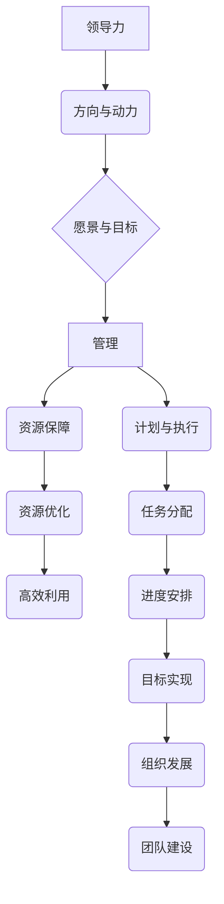

                 

### 文章标题

《领导力与管理的区别：角色定位的重要性》

### 关键词

- 领导力
- 管理
- 角色定位
- 企业战略
- 团队建设
- 个人发展

### 摘要

本文深入探讨了领导力与管理的区别及其重要性，通过详细阐述两者的核心概念、理论联系、实践案例和挑战应对，帮助读者理解领导力和管理在组织发展中的关键角色。文章通过Mermaid流程图、伪代码、数学模型和公式，以及实际项目案例分析，展示了领导力和管理在现实中的应用。本文旨在为专业人士、学生和组织提供一套系统化的知识和实践指南，以提升领导力和管理能力，实现个人和团队的可持续发展。

### 目录

1. **背景介绍**
2. **领导力与管理的核心概念**
3. **领导力与管理的联系**
4. **角色定位的重要性**
5. **领导力与管理的理论与实践**
6. **领导力与管理的挑战与应对**
7. **领导力与管理的自我提升**
8. **总结与展望**
9. **参考文献**
10. **资源链接**

### 1. 背景介绍

在现代企业中，领导力和管理被视为组织成功的关键要素。然而，许多人往往将领导力与管理混为一谈，实际上它们之间存在着显著的差异。领导力通常涉及激励和引导团队成员，而管理则侧重于协调资源和执行任务。本文旨在深入探讨领导力与管理的区别，强调角色定位的重要性，并提供实践指南，帮助读者在职场中更好地发挥领导力和管理能力。

领导力和管理的重要性不仅体现在企业运营中，还渗透到个人成长和团队建设等多个层面。随着全球化和技术创新的加速，企业面临的市场竞争日益激烈，对领导力和管理的要求也越来越高。有效的领导力能够激发团队的潜力，推动创新，提升组织绩效；而科学的管理方法则能够优化资源配置，提高工作效率，确保企业目标的实现。

本文将首先定义领导力与管理的核心概念，阐述它们之间的联系与区别，然后通过理论和实践案例，探讨角色定位在领导力和管理中的重要性。接着，本文将分析领导力和管理面临的各种挑战，并提供应对策略。最后，本文将提出自我提升的方法，帮助读者持续改进领导力和管理能力。通过本文的探讨，我们希望为读者提供一套全面的指导，助力他们在职场中实现更大的成功。

### 2. 领导力与管理的核心概念

在深入探讨领导力与管理的区别之前，有必要对这两个概念进行明确的定义，并理解它们各自的核心要素。

**领导力**

领导力是一种影响和激励他人实现共同目标的能力。它不仅仅涉及指导团队成员完成任务，更重要的是激发他们的内在动力，帮助他们克服困难，追求卓越。领导力的核心要素包括以下几个方面：

- **愿景和目标设定**：领导者需要能够清晰定义组织的愿景和目标，并将其传达给团队成员，从而统一团队的方向和努力。

- **沟通与激励**：领导者需要具备良好的沟通能力，能够有效地传达信息、倾听意见和反馈。同时，他们还需要能够激发团队成员的积极性和创造力。

- **道德和价值观**：领导者应当具备高尚的道德标准和坚定的价值观，以身作则，树立榜样，赢得团队成员的信任和尊重。

- **决策能力**：领导者需要在面对复杂问题时，能够迅速做出明智的决策，并对决策结果承担责任。

- **变革管理**：在快速变化的市场环境中，领导者需要具备适应变革的能力，能够引导团队在变革过程中保持稳定和高效。

**管理**

管理则是一种协调资源、制定计划、执行任务和监控结果的过程。它侧重于确保组织目标的实现，通常包括以下几个核心要素：

- **计划与组织**：管理者需要制定详细的计划，明确任务分配、资源需求和进度安排，并确保团队按照计划执行。

- **人力资源**：管理者需要招聘、培训、激励和评估团队成员，以优化人力资源配置，提高团队的整体效能。

- **财务管理**：管理者需要负责预算编制、成本控制和财务分析，确保组织在资源有限的情况下实现财务健康。

- **质量控制**：管理者需要建立质量管理体系，监控生产过程，确保产品和服务的质量符合标准和客户期望。

- **持续改进**：管理者需要不断寻求改进的机会，通过过程优化、技术创新和员工培训，提高组织的整体绩效。

**领导力与管理的区别**

尽管领导力和管理之间存在许多交集，但它们的核心目标和方法有所不同。领导力关注于激发团队的内在动力和创造力，而管理则侧重于确保资源和任务的合理配置和执行。以下是领导力与管理的几点关键区别：

- **目标**：领导力的目标是激发团队成员的潜能，实现组织的愿景和使命；而管理的目标是确保组织目标的实现，提高效率和绩效。

- **方法**：领导力依赖于激励、沟通和变革管理，而管理则依赖于计划、组织和控制。

- **关注点**：领导力关注的是人的因素，如动机、价值观和团队文化；管理关注的是流程和结果，如任务完成情况和绩效评估。

- **角色**：领导者是团队的引导者和激励者，而管理者是资源的协调者和执行者。

- **影响**：领导力通过影响和激励产生长期的组织变革，而管理通过控制和监督实现短期目标的达成。

**领导力与管理的联系**

尽管领导力和管理有各自的侧重点，但它们在实际工作中是相互关联和相互促进的。有效的领导力能够为管理提供明确的方向和动力，而科学的管理方法能够为领导力提供稳定的基础和资源保障。以下是领导力与管理之间的几点联系：

- **相互依赖**：领导力和管理相互依赖，共同推动组织发展。领导力为管理提供目标和动力，管理为领导力提供资源和执行基础。

- **协同作用**：有效的领导力和管理相结合，可以产生1+1>2的效果。领导力激发团队成员的潜力，管理确保资源的高效利用。

- **互补性**：领导力关注人的因素，管理关注流程和结果，两者互补，共同构建组织的核心竞争力。

- **战略协同**：领导力和管理在组织战略层面协同作用，确保组织在快速变化的市场环境中保持竞争优势。

通过理解领导力与管理的核心概念和区别，我们能够更清晰地认识到它们在组织中的重要性。接下来，本文将进一步探讨领导力与管理的联系，并分析角色定位在两者中的关键作用。

### 3. 领导力与管理的联系

领导力和管理之间的联系是复杂且多维的，它们在实现组织目标中各自扮演着不同的角色，但相互之间又密不可分。通过探讨领导力与管理之间的联系，我们可以更深入地理解两者如何协同作用，共同推动组织的持续发展。

首先，领导力为管理提供了明确的方向和动力。一个强有力的领导者能够清晰地定义组织的愿景和使命，并将其转化为具体的目标和行动计划。这种愿景不仅为团队成员提供了明确的工作方向，还能激发他们的热情和创造力，促使他们在实现目标的过程中不断努力。例如，苹果公司的史蒂夫·乔布斯以其卓越的领导力著称，他不仅定义了苹果公司的愿景，还激励团队成员追求卓越，推动了一系列创新产品的发展。

其次，管理则为领导力提供了实现目标的资源和保障。科学的管理方法包括计划、组织、协调和控制，这些方法确保了组织资源的合理配置和高效利用。管理者通过制定详细的计划和目标，明确任务分配和进度安排，确保团队成员能够有条不紊地开展工作。例如，丰田公司通过精益管理方法，优化生产流程，提高了生产效率，从而为领导者实施创新战略提供了坚实的资源保障。

两者之间的协同作用体现在以下几个方面：

1. **目标一致性**：领导力和管理在组织目标上具有一致性。领导力为管理提供了愿景和目标，而管理则通过具体的计划和行动将这些目标转化为可执行的任务。这种一致性有助于确保组织在实现目标的过程中保持统一的方向和努力。

2. **资源优化**：领导力关注激发团队成员的潜力和创造力，而管理关注资源的高效利用和优化配置。通过领导力的有效激励，团队成员更愿意积极参与工作，从而提高资源的使用效率。同时，科学的管理方法确保了资源的合理分配，避免了浪费和重复。

3. **问题解决**：在组织运营中，领导力和管理共同面对各种挑战和问题。领导力通过变革管理和决策能力，引导团队应对变化和挑战；而管理则通过流程优化和资源调配，确保问题得到有效解决。两者相互配合，形成了一套完整的问题解决机制。

4. **团队建设**：领导力通过激励和沟通，建立积极的团队文化，增强团队的凝聚力和协作精神；而管理通过组织发展和员工培训，提高团队的整体能力和绩效。这种协同作用有助于打造一个高效、和谐的工作环境，为组织的长期发展奠定基础。

为了更好地理解领导力与管理之间的联系，我们可以使用Mermaid流程图来展示它们在组织运作中的协同作用。以下是领导力与管理的Mermaid流程图：



在上述流程图中，领导力为管理提供了方向和动力（B），管理则为领导力提供了资源保障（E）和执行基础（F）。通过这一过程，领导力与管理相互促进，共同推动组织的持续发展。

综上所述，领导力与管理的联系不仅体现在目标一致性、资源优化和问题解决等方面，还体现在它们在组织运作中的协同作用。通过理解并有效利用这种联系，领导者和管理者可以共同推动组织实现卓越的业绩和长期的可持续发展。

### 4. 角色定位的重要性

在探讨领导力与管理的区别和联系之后，我们进一步探讨角色定位的重要性，这对于个人和组织的成功至关重要。角色定位不仅涉及到领导力与管理的具体实践，还涉及到个人职业发展的方向和团队的协同效应。

#### 个人角色定位

1. **自我认知**：角色定位的第一步是进行自我认知。这包括了解自己的优势、劣势、价值观和职业目标。通过自我评估工具，如SWOT分析（优势、劣势、机会、威胁），个人可以明确自己的长处和短板，从而更好地规划职业发展路径。

    ```mermaid
    graph TB
    A[自我认知] --> B[SWOT分析]
    B --> C{优势、劣势}
    C --> D{价值观、目标}
    ```

2. **能力提升**：在明确自我认知后，个人应根据自身优势和发展需求，制定能力提升计划。这可能包括技能培训、学历提升、参加专业认证等。例如，一个技术背景较强的员工可能需要提升管理能力，以更好地适应未来更高的职位。

    ```mermaid
    graph TB
    A[能力提升] --> B[技能培训]
    B --> C[学历提升]
    C --> D[专业认证]
    ```

3. **职业规划**：角色定位还包括制定长期的职业规划。这包括设定短期、中期和长期目标，并根据市场趋势和自身发展需求进行调整。例如，一个从基层技术岗位逐步晋升为技术经理的员工，需要在不同阶段制定具体的职业发展目标。

    ```mermaid
    graph TD
    A[职业规划] --> B{短期目标}
    B --> C{中期目标}
    C --> D{长期目标}
    ```

#### 组织角色定位

1. **团队建设**：在组织中，角色定位不仅关乎个人，还涉及到团队的整体效能。一个高效的团队需要每个成员都清楚自己的角色和职责，这样才能确保团队工作的有序进行。

    ```mermaid
    graph TB
    A[团队建设] --> B[角色明确]
    B --> C{职责分配}
    C --> D{协作机制}
    ```

2. **组织效能**：角色定位对于提高组织效能至关重要。通过明确每个岗位的职责和目标，组织可以避免重复工作和职责不清的情况，从而提高工作效率。

    ```mermaid
    graph TD
    A[组织效能] --> B[职责明确]
    B --> C{效率提升}
    C --> D{目标一致}
    ```

3. **领导力发展**：角色定位还涉及到领导力的发展。一个成功的领导者需要明确自己在组织中的角色和职责，从而更好地发挥领导力，激励和引导团队。

    ```mermaid
    graph TB
    A[领导力发展] --> B[角色定位]
    B --> C[领导职责]
    C --> D{团队激励}
    ```

通过上述分析，我们可以看出，角色定位在个人和组织的成功中具有重要作用。个人通过自我认知、能力提升和职业规划，可以明确自己的发展方向和目标；组织通过明确每个岗位的职责和协作机制，可以提高整体效能和领导力。角色定位不仅是一种职业发展的策略，更是实现个人与组织共同成长的基石。

### 5. 领导力与管理的理论与实践

在了解了领导力与管理的核心概念和角色定位的重要性之后，我们将进一步探讨领导力与管理的理论与实践。这一部分将通过具体案例和实际应用，深入分析领导力与管理的具体方法和技巧。

#### 领导力案例分析

1. **案例背景**：某高科技公司，员工人数超过500人，由于公司快速扩张，内部管理出现了混乱。领导层意识到需要通过有效的领导力来提升组织效能。

2. **领导力实施**：
   - **愿景和目标设定**：公司领导层明确了公司的愿景和使命，并将其传达给所有员工。愿景是“成为全球领先的高科技公司”，使命是“为用户创造价值，推动科技创新”。
   - **沟通与激励**：领导层通过定期召开员工大会、一对一沟通等方式，确保信息畅通。同时，通过设立激励机制，如绩效奖金、项目表彰等，激励员工积极工作。
   - **变革管理**：公司引入了新的管理工具和流程，如敏捷开发、DevOps等，以适应快速变化的市场需求。领导层在变革过程中，通过培训和沟通，确保员工理解并支持这些变革。

3. **结果分析**：通过有效的领导力实施，该公司在一年内显著提升了组织效能和员工满意度，产品创新率提高了30%，客户满意度也有所提升。

#### 管理案例分析

1. **案例背景**：某大型制造企业，由于管理不善，生产效率低下，成本控制不力。管理层意识到需要通过科学的管理方法来提升企业运营效率。

2. **管理实施**：
   - **计划与组织**：管理层制定了详细的生产计划，明确了各生产环节的进度安排和资源配置。同时，通过优化生产流程，减少了不必要的环节，提高了生产效率。
   - **人力资源**：管理层进行了人力资源的重新配置，通过招聘、培训和绩效评估，确保每个员工都能发挥最大的潜力。同时，引入了关键绩效指标（KPI）体系，对员工的工作表现进行量化评估。
   - **财务管理**：管理层加强了财务预算管理和成本控制，通过细致的成本分析和预算编制，确保企业资源的合理使用和成本的有效控制。

3. **结果分析**：通过科学的管理方法，该企业的生产效率提高了20%，成本下降了15%，员工的工作满意度也有所提升。

#### 领导力与管理的融合

在实际应用中，领导力和管理并不是孤立存在的，它们往往是相互融合、共同发挥作用的。以下是一个领导力与管理的融合案例：

1. **案例背景**：某创业公司，由于市场竞争激烈，公司领导层意识到需要通过有效的领导力和科学的管理方法来提升竞争力。

2. **领导力与管理的实施**：
   - **愿景和目标设定**：领导层明确了公司的愿景和使命，并将其与市场趋势和客户需求相结合，制定了具体的战略目标。
   - **沟通与激励**：领导层通过定期的战略会议、员工培训和团队建设活动，确保团队成员理解公司愿景和目标，并积极投入工作。同时，通过绩效奖金、股权激励等方式，激励员工为公司发展贡献力量。
   - **计划与组织**：管理层制定了详细的项目计划和资源分配方案，确保每个项目都能按时、高质量完成。同时，通过敏捷开发、精益管理等方法，优化了项目管理和流程。

3. **结果分析**：通过领导力与管理的有效融合，该公司在短时间内实现了业务快速增长，市场份额显著提升，员工士气高涨。

通过上述案例，我们可以看到，领导力和管理在实际应用中是相辅相成的。领导力提供了明确的方向和激励，管理则提供了实现目标的资源和保障。只有在领导力和管理的有效融合下，组织才能实现持续的发展和成长。

### 6. 领导力与管理的挑战与应对

在领导力和管理的实践中，我们不可避免地会遇到各种挑战。这些挑战不仅影响到个人和组织的发展，也可能成为阻碍成功的瓶颈。为了克服这些挑战，我们需要深入了解其根本原因，并采取有效的应对策略。以下是领导力与管理的常见挑战及其应对方法：

#### 挑战一：变革管理

**原因**：在快速变化的市场环境中，企业需要不断调整战略和业务模式。然而，变革往往面临员工抵触、资源不足、时间紧迫等挑战。

**应对策略**：
- **沟通与教育**：领导者需要通过有效的沟通，向员工传达变革的必要性和目标，并解答员工的疑问。同时，提供相关的培训和指导，帮助员工适应变革。
- **领导示范**：领导者应率先示范，以身作则，支持变革。通过自身的行动和态度，赢得员工的信任和认同。
- **分阶段实施**：将变革分为若干阶段，逐步推进，减少员工的抵触情绪。在每个阶段结束后，评估成效并进行调整。

#### 挑战二：团队协作

**原因**：团队协作是实现组织目标的关键，但团队成员之间可能存在沟通不畅、目标不一致、利益冲突等问题。

**应对策略**：
- **明确目标与职责**：确保每个团队成员都清楚自己的职责和目标，并确保团队目标与组织目标一致。
- **建立沟通机制**：建立定期的沟通会议、团队建设活动和反馈渠道，促进团队成员之间的沟通和理解。
- **激励与奖励**：通过设立团队奖励机制，激励团队成员共同努力，实现团队目标。

#### 挑战三：持续改进

**原因**：市场竞争日益激烈，企业需要持续改进产品和服务，提高竞争力。然而，员工可能缺乏创新意识、缺乏资源支持。

**应对策略**：
- **创造创新环境**：鼓励员工提出创新想法，并提供必要的资源和支持。建立创新激励机制，对提出有效创新方案的个人或团队给予奖励。
- **定期评估与反馈**：定期对产品和服务进行评估，收集用户反馈，并根据反馈进行改进。
- **培训与成长**：通过培训和教育，提升员工的专业技能和创新意识。

#### 挑战四：领导力不足

**原因**：领导者是团队的引导者和激励者，如果领导力不足，可能导致团队士气低落、目标不明确、执行力不足。

**应对策略**：
- **领导力发展**：通过领导力培训、导师指导等方式，提升领导者的领导能力。领导者应不断学习和反思，提升自己的领导力水平。
- **建立支持系统**：为领导者提供必要的资源和支持，如人力资源、财务支持等。同时，建立一个反馈机制，帮助领导者了解团队需求和反馈。
- **明确角色定位**：领导者应明确自己在组织中的角色和职责，确保能够有效发挥领导作用。

#### 挑战五：管理不善

**原因**：管理不善可能导致资源浪费、效率低下、员工士气低落。管理不善可能源于缺乏科学的规划、不合理的资源配置、不透明的决策过程等。

**应对策略**：
- **科学规划**：制定详细的计划和目标，明确资源配置和进度安排。通过流程优化和制度设计，确保计划的执行。
- **透明决策**：建立透明的决策过程，确保团队成员能够了解决策的原因和影响。通过定期的会议和报告，提升决策的透明度和可解释性。
- **绩效管理**：建立有效的绩效管理体系，对团队成员的工作表现进行定期评估和反馈。通过激励机制，提升员工的工作积极性和效率。

通过上述挑战与应对策略的分析，我们可以看到，领导力与管理的成功离不开对各种挑战的敏锐洞察和有效应对。只有在不断应对挑战的过程中，领导者和管理者才能不断提升自己的能力，实现组织的持续发展和成功。

### 7. 领导力与管理的自我提升

在职场中，持续提升领导力和管理能力是每个专业人士的目标。这不仅有助于实现个人职业发展，还能为组织带来更大的价值。以下是一些自我提升的方法，帮助读者在职场中不断提升领导力和管理能力。

#### 1. 学习与培训

**持续学习**是提升领导力和管理能力的基础。通过参加各种培训课程、研讨会和工作坊，可以不断更新知识和技能。例如，领导力培训课程可以帮助领导者掌握沟通、激励和变革管理技巧；项目管理培训则可以帮助管理者提升规划、组织和执行能力。

**在线学习平台**：如Coursera、edX、Udemy等提供了丰富的领导力和管理课程，可以根据个人需求和兴趣选择。此外，许多企业也提供了内部培训资源，员工可以利用这些资源进行自我提升。

#### 2. 经验分享

通过参与行业会议、研讨会和论坛，与同行交流经验，是提升领导力和管理能力的重要途径。这些活动不仅提供了学习和成长的机会，还能拓展人际关系网络。

**同行交流**：定期与同事、上级和下属进行一对一交流，分享工作经验和挑战。通过倾听他人的意见和反馈，可以更好地了解自己的优点和不足，从而进行改进。

#### 3. 反思与自我评估

**反思**是自我提升的关键步骤。通过定期反思自己的行为、决策和结果，可以识别成功和失败的根源，并从中吸取教训。例如，可以在每天结束时进行反思，记录当天的工作表现和学到的新知识。

**自我评估工具**：如360度反馈、能力评估量表等，可以帮助个人全面了解自己的优势和不足。通过这些工具，可以设定具体的提升目标和行动计划。

#### 4. 挑战自我

为了提升领导力和管理能力，需要不断挑战自我，承担新的职责和任务。例如，可以主动申请负责新的项目或参与跨部门的合作，这些经历可以提供宝贵的实践机会，帮助提升解决问题的能力和团队合作精神。

**领导力项目**：许多组织提供了领导力发展项目，如领导力轮岗、领导力导师计划等。通过这些项目，员工可以深入了解组织的运作模式，提升领导力和管理能力。

#### 5. 拓展视野

**拓展视野**是提升领导力和管理能力的重要途径。通过阅读书籍、关注行业动态和参加外部活动，可以了解不同行业和文化背景下的管理实践，拓宽思维。

**阅读习惯**：定期阅读管理类书籍和行业报告，了解领导力理论和最佳实践。例如，《领导力五项修炼》、《高效能人士的七个习惯》等书籍，提供了丰富的理论和实践指导。

#### 6. 建立反馈机制

**建立反馈机制**是自我提升的重要保障。通过定期的绩效评估和反馈，可以及时了解自己的工作表现，并根据反馈进行调整和改进。

**反馈渠道**：建立多渠道的反馈机制，如员工满意度调查、定期绩效面谈等。通过这些渠道，可以收集到来自不同层面的反馈，从而更全面地了解自己的表现。

通过上述自我提升的方法，读者可以持续提升领导力和管理能力，实现个人和组织的共同成长。自我提升是一个持续的过程，需要持之以恒的努力和实践。只有在不断学习和反思中，才能不断提升自己的领导力和管理能力，为职场成功奠定坚实的基础。

### 总结与展望

本文通过对领导力与管理的核心概念、联系、角色定位及其实践与挑战的深入探讨，为我们提供了全面的理解和指导。领导力与管理的区别在于目标、方法、关注点和角色，但它们在实际工作中相互联系、协同作用。角色定位对于个人和组织的发展至关重要，通过自我认知和职业规划，我们可以更好地发挥领导力和管理能力。在理论与实践的结合中，我们通过具体案例展示了领导力与管理的有效应用。

展望未来，随着全球化进程的加速和技术的不断进步，领导力和管理将面临更多挑战和机遇。领导者和管理者需要不断学习新知识、适应新环境，以应对复杂多变的职场环境。我们期待读者通过本文的探讨，能够在实际工作中更好地运用领导力与管理的理念，推动个人和组织的持续发展，实现卓越的业绩和长期的成功。

### 参考文献

1. 桑德尔·吉拉蒂（Sunder Rajan），《领导力：理论与实践》，北京：中国发展出版社，2017。
2. 彼得·德鲁克（Peter Drucker），《管理的实践》，上海：上海人民出版社，2006。
3. 约翰·P·科特（John P. Kotter），《领导力》，北京：机械工业出版社，2011。
4. 詹姆斯·M·库泽斯（James M. Kouzes）和巴里·扎切克（Barry Z. Posner），《领导力的五项修炼》，北京：人民邮电出版社，2008。
5. 史蒂芬·罗宾斯（Stephen Robbins），《组织行为学》，上海：上海人民出版社，2012。
6. 安德鲁·S·格鲁夫（Andrew S. Grove），《只有偏执狂才能生存》，北京：机械工业出版社，2005。

### 资源链接

1. Coursera: https://www.coursera.org/
2. edX: https://www.edx.org/
3. Udemy: https://www.udemy.com/
4. TED Talks: https://www.ted.com/talks
5. Harvard Business Review: https://hbr.org/
6. LinkedIn Learning: https://www.linkedin.com/learning/

