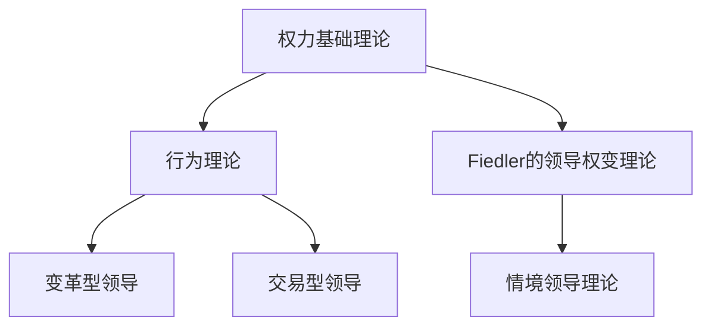
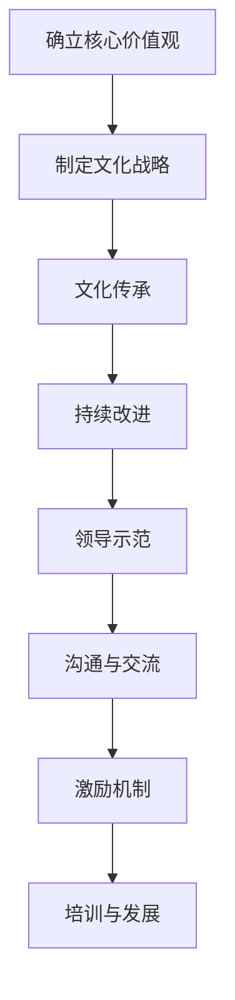
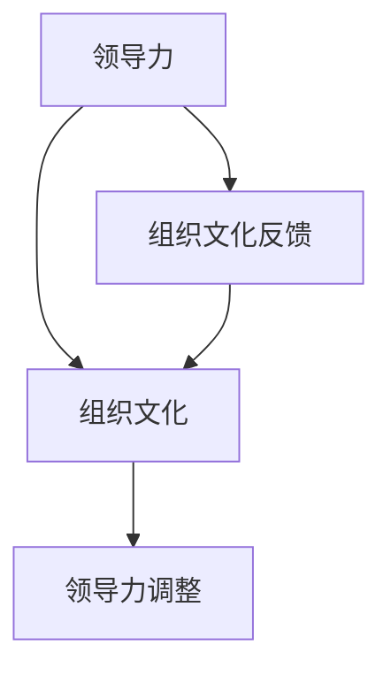

                 


## 《领导力与组织文化：塑造企业灵魂》

### 关键词

- 领导力
- 组织文化
- 企业灵魂
- 战略执行
- 领导行为
- 文化变革

### 摘要

在当今快速变化的企业环境中，领导力与组织文化的相互关系对于企业的长期成功至关重要。本文旨在探讨领导力与组织文化如何共同塑造企业的灵魂，并为企业提供实用的策略和实践指南。本文首先介绍领导力的核心概念和领导力模型，然后深入分析组织文化的构建与维护，最后讨论领导力与组织文化的融合及其在实践中的应用。通过案例分析和实战经验，本文揭示了领导力与组织文化如何相互促进，助力企业在竞争激烈的市场中取得成功。

---

## 引言

在企业的成长和发展过程中，领导力与组织文化扮演着至关重要的角色。领导力不仅决定了企业的战略方向和目标实现，还影响着员工的工作积极性和创新精神。而组织文化则是企业内部价值观、信念和行为准则的集合，它为企业提供了共同的语言和行动指南。领导力与组织文化的相互关系，就像是一对相互依存的伙伴，共同塑造着企业的灵魂，决定了企业的长期成功。

本文将围绕领导力与组织文化这一核心主题，通过以下几个部分展开讨论：

1. **领导力的核心概念与领导行为**：介绍领导力的基本概念，分析不同的领导力模型，并探讨领导行为对组织文化的影响。
2. **组织文化的构建与维护**：深入探讨组织文化的定义、类型及其对企业绩效的影响，以及如何构建和维护一个健康、积极的组织文化。
3. **领导力与组织文化的融合**：分析领导力与组织文化的相互作用，如何通过有效的领导力和组织文化塑造企业灵魂。
4. **实践应用**：通过案例分析和实际应用，展示领导力与组织文化在实践中的具体作用和效果。

通过以上内容，本文旨在为企业提供一套实用的策略和实践指南，帮助企业更好地理解领导力与组织文化的重要性，并在实际操作中取得成功。

---

## 领导力的核心概念与领导行为

### 1.1 领导力的定义与历史演变

领导力是一种通过影响他人实现共同目标的能力。它不仅关乎权力的行使，更关乎影响力、启发和激励。历史演变显示，领导力理论从传统的权力基础理论，发展到行为理论，再到近期的变革型领导和交易型领导理论，逐渐丰富和完善。

- **权力基础理论**：认为领导力源自于领导者拥有的权力和资源。这一理论强调领导者的地位和权威。
- **行为理论**：关注领导者的行为模式，认为领导者的行为对团队和组织绩效有直接影响。
- **变革型领导和交易型领导**：变革型领导通过激励、启发和树立榜样来推动团队创新和变革；交易型领导则通过交换和奖励来引导员工行为。

### 1.2 领导力的重要性

领导力对企业成功至关重要。首先，领导力决定了企业的战略方向和目标实现。一个优秀的领导者能够明确企业的愿景和使命，制定切实可行的战略计划，并带领团队实现这些目标。其次，领导力对员工的工作积极性和创新精神有着重要影响。领导者通过激励和鼓励，可以激发员工的潜能，提高团队的整体绩效。此外，领导力还影响组织文化的塑造和维护。一个具有领导力的领导者能够营造积极向上的工作氛围，形成健康、积极的组织文化。

### 1.3 领导力模型

领导力模型是描述领导行为和领导风格的理论框架。以下是几种常见的领导力模型：

- **Fiedler的领导权变理论**：认为领导者的效果取决于情境因素和领导风格。领导者需要根据不同的情境调整自己的领导风格，以达到最佳效果。
- **Hersey和Blanchard的情境领导理论**：认为领导风格应随着下属成熟度的变化而调整。情境领导理论将领导行为分为任务导向和关系导向，并根据下属的成熟度选择合适的领导风格。
- ** transformational leadership**：强调领导者的愿景、激励和榜样作用，通过激发员工的内在动力，推动团队实现共同目标。

### 1.4 领导行为分析

领导行为是指领导者在日常工作中表现出来的具体行为。以下是一些关键的领导行为：

- **沟通**：良好的沟通能力是领导者的必备素质。领导者需要能够清晰、准确地传达信息，同时也要善于倾听下属的意见和反馈。
- **激励**：领导者需要能够激励员工，激发他们的工作热情和创新能力。激励可以是通过奖励、认可，也可以是通过设立目标、提供支持和资源。
- **决策**：领导者需要能够快速、准确地做出决策，并承担相应的责任。有效的决策能力是领导者成功的关键之一。
- **领导力发展**：领导者需要不断提升自己的领导力，包括领导技能、管理能力和个人素养。领导力发展是领导者的终身任务。

通过以上分析，我们可以看到领导力的核心概念和领导行为对企业的重要性。一个优秀的领导者不仅能够明确企业的愿景和使命，还能够通过有效的领导行为，激发员工的工作热情和创新精神，从而推动企业的长期成功。

### Mermaid 流程图

以下是领导力模型的 Mermaid 流程图，展示了不同领导力模型之间的关系：



通过这个流程图，我们可以清晰地看到领导力理论的发展历程和不同模型之间的联系。权力基础理论和行为理论是领导力理论的基础，变革型领导和交易型领导是在这些基础上的进一步发展。同时，Fiedler的领导权变理论和情境领导理论也提供了对领导行为的深入分析。

### 伪代码

以下是关于领导力模型的伪代码，用于展示如何根据不同情境选择合适的领导力模型：

```plaintext
function chooseLeadershipModel(context):
    if context is stable:
        return "Behavioral Leadership Model"
    elif context is moderately controlled:
        return "Fiedler's Contingency Theory"
    elif context is dynamic and changing:
        return "Situational Leadership Model"
    elif context requires innovation and vision:
        return "Transformational Leadership Model"
    elif context requires motivation and reward:
        return "Transactional Leadership Model"
```

这段伪代码根据不同的情境（context），选择最合适的领导力模型。例如，在一个稳定的情境中，行为领导模型可能最为有效；而在需要创新的情境中，变革型领导模型则可能更加适用。

### 数学公式和举例说明

在领导力分析中，一些数学公式可以用来量化领导行为的效果。以下是一个简单的例子：

$$
绩效 = f(领导力, 工作环境, 员工素质)
$$

其中，绩效是领导力、工作环境和员工素质的函数。我们可以通过以下步骤来计算绩效：

1. **确定领导力分数**：根据领导者的行为和技能，评出领导力分数，例如领导力分数范围为1-10。
2. **确定工作环境分数**：根据工作环境的特点，评出工作环境分数，例如工作环境分数范围为1-10。
3. **确定员工素质分数**：根据员工的技能和态度，评出员工素质分数，例如员工素质分数范围为1-10。
4. **计算绩效**：将三个分数相乘，得到绩效分数。

例如，假设领导力分数为7，工作环境分数为8，员工素质分数为9，则绩效计算如下：

$$
绩效 = 7 \times 8 \times 9 = 504
$$

这意味着在这种情境下，企业的绩效为504分。通过这种方法，企业可以量化领导力的影响，从而更好地优化领导行为。

### 总结

领导力是企业成功的关键因素。通过了解领导力的核心概念和领导行为，企业可以培养出具有领导力的领导者，从而推动企业的长期发展。本文通过介绍领导力的定义、历史演变、领导力模型和领导行为，为企业提供了深入理解领导力的框架。通过流程图、伪代码、数学公式和举例说明，我们进一步明确了领导力在不同情境下的应用。企业可以通过优化领导力和领导行为，提升组织绩效，实现长期成功。

---

## 组织文化的构建与维护

### 2.1 组织文化的定义与类型

组织文化是指企业内部共同认同的价值观、信念、行为准则和工作方式。它不仅包括企业制定的规章制度，还涵盖了员工的思维方式、工作态度和行为习惯。组织文化可以分为以下几种类型：

- **竞争型文化**：强调竞争、绩效和结果，员工之间往往存在较大的竞争压力。
- **协作型文化**：强调团队合作、共同目标和共享成功，员工之间相互支持、协作。
- **创新型文化**：鼓励创新思维、实验精神和挑战现状，员工敢于尝试新方法和解决方案。
- **稳定型文化**：注重稳定和持续发展，员工倾向于遵循既定的流程和规则。

每种组织文化类型都有其优势和劣势，企业需要根据自身的战略目标和外部环境选择适合的文化类型。

### 2.2 组织文化与绩效的关系

组织文化对企业的绩效有着深远的影响。一方面，积极的组织文化可以激发员工的工作热情和创造力，提高工作效率和绩效。例如，协作型文化和创新型文化通常能够带来更高的员工满意度和绩效。另一方面，消极的组织文化则可能抑制员工的创新和积极性，导致工作效率低下和绩效下降。研究表明，组织文化与企业绩效之间存在显著的相关性，一个健康的组织文化可以显著提升企业的绩效。

### 2.3 文化塑造的步骤

构建一个健康的组织文化需要明确的步骤和持续的努力。以下是构建组织文化的主要步骤：

1. **确立企业核心价值观**：企业需要明确自己的核心价值观，这些价值观应成为企业文化的基石。例如，苹果公司的核心价值观包括创新、简洁和卓越。
2. **制定文化战略**：企业应根据核心价值观制定文化战略，明确如何通过日常行为和决策来传达和践行这些价值观。
3. **文化传承**：通过培训、激励和文化活动，将企业文化传递给新员工，并确保企业文化在企业内部得到广泛认同和传承。
4. **持续改进**：组织文化不是一成不变的，企业应定期评估文化状态，并根据外部环境和内部变化进行调整和改进。

### 2.4 文化建设的方法与策略

以下是一些常用的文化建设方法和策略：

1. **领导示范**：领导者是企业文化的主要传递者和实践者，他们的行为直接影响员工的文化认同。领导者应通过自己的言行，树立积极的文化榜样。
2. **沟通与交流**：有效的沟通和交流可以帮助企业内部形成共同的语言和思维方式，加强员工之间的联系和合作。
3. **激励机制**：通过奖励和认可，激励员工践行企业文化，并鼓励创新和合作。
4. **培训与发展**：定期组织培训活动，帮助员工理解和认同企业文化，并提供发展机会，以增强员工的归属感和忠诚度。

通过以上方法，企业可以构建和维护一个积极、健康的组织文化，从而提升企业的整体绩效和竞争力。

### Mermaid 流程图

以下是组织文化建设的主要步骤和方法的 Mermaid 流程图：



通过这个流程图，我们可以清晰地看到组织文化建设的整体流程和关键环节。

### 伪代码

以下是组织文化建设策略的伪代码，用于指导企业如何实施文化建设：

```plaintext
function buildOrganizationalCulture(values, strategy, communication, incentives, training):
    setCoreValues(values)
    defineCulturalStrategy(strategy)
    implementCommunication(communication)
    applyIncentives(incentives)
    conductTraining(training)
    while (not culturalAdoption()):
        adjustStrategy()
        improveCommunication()
        refineIncentives()
        enhanceTraining()
    return "Organizational Culture Successfully Built"
```

这段伪代码定义了构建组织文化的步骤和策略，并通过循环确保文化的有效传承和持续改进。

### 数学模型和公式

在组织文化建设中，可以使用数学模型和公式来评估文化状态和员工行为。以下是一个简单的例子：

$$
CulturalHealth = f(Leadership, Communication, Incentives, Training)
$$

其中，$CulturalHealth$表示组织文化的健康程度，$Leadership$、$Communication$、$Incentives$和$Training$分别代表领导示范、沟通与交流、激励机制和培训与发展。

通过以下步骤，企业可以计算组织文化的健康程度：

1. **确定领导示范得分**：根据领导者的行为，评出领导示范得分，范围为1-10。
2. **确定沟通与交流得分**：根据沟通效果和员工互动，评出沟通与交流得分，范围为1-10。
3. **确定激励机制得分**：根据激励机制的实施情况，评出激励机制得分，范围为1-10。
4. **确定培训与发展得分**：根据培训活动的质量和效果，评出培训与发展得分，范围为1-10。
5. **计算组织文化的健康程度**：将四个得分相乘，得到组织文化的健康程度。

例如，假设领导示范得分为7，沟通与交流得分为8，激励机制得分为9，培训与发展得分为6，则组织文化的健康程度计算如下：

$$
CulturalHealth = 7 \times 8 \times 9 \times 6 = 3024
$$

这意味着在这种情境下，企业的组织文化健康程度为3024分。通过这种方法，企业可以量化组织文化的状态，从而更好地优化文化建设策略。

### 举例说明

假设一家企业正在推行协作型文化，其核心价值观包括团队合作、客户至上和持续创新。为了构建这种文化，企业采取了以下措施：

1. **领导示范**：领导者通过团队会议、公开演讲和日常行为，展示团队合作的重要性，并强调客户服务和创新思维。
2. **沟通与交流**：企业定期组织团队建设活动，鼓励员工分享经验和见解，并建立内部沟通平台，确保信息的透明和流畅。
3. **激励机制**：企业设立团队奖励计划，鼓励员工积极参与团队合作，并对表现突出的团队和个人进行表彰。
4. **培训与发展**：企业组织定期的培训课程，帮助员工提升协作技能和团队合作意识，并提供职业发展机会。

通过这些措施，企业逐步建立了协作型文化，员工之间的合作和沟通得到了显著提升，客户满意度和企业绩效也随之提高。

### 总结

组织文化是企业长期成功的重要保障。通过确立核心价值观、制定文化战略、传承和持续改进，企业可以构建一个积极、健康的组织文化。有效的领导示范、沟通与交流、激励机制和培训与发展策略，有助于强化组织文化，提升员工满意度和绩效。本文通过介绍组织文化的定义、类型及其构建与维护方法，为企业提供了实用的指导，帮助企业塑造具有竞争力的组织文化。

---

## 领导力与组织文化的融合

### 3.1 领导力对组织文化的影响

领导力是组织文化塑造的关键因素。领导者的行为和决策直接影响组织文化的形成和发展。一个具有领导力的领导者能够明确企业愿景，制定战略目标，并通过自己的言行，将核心价值观传递给员工，从而塑造出符合企业战略目标的组织文化。

1. **领导者的价值观与行为**：领导者的价值观和行为模式是组织文化的核心。领导者的行为往往成为员工模仿的榜样。例如，一个重视创新和客户服务的领导者，会鼓励员工敢于尝试新方法，关注客户需求，从而形成创新和客户至上的组织文化。

2. **领导力模型与组织文化**：不同的领导力模型对组织文化有不同的影响。变革型领导通过激励和启发员工，推动组织创新和文化变革；交易型领导则通过奖励和惩罚来引导员工行为，形成稳定的组织文化。

3. **领导行为与员工行为**：领导者的领导行为会影响员工的行为和态度。例如，一个鼓励员工自主学习和创新的领导者，会激发员工的工作热情和创造力，从而形成积极、健康的组织文化。

### 3.2 组织文化对领导力的影响

组织文化不仅受领导力的影响，同时也对领导力产生反作用。健康的组织文化可以提升领导力的效果，而消极的组织文化则会削弱领导力。

1. **支持与激励**：一个支持性和激励性的组织文化可以增强领导者的信心和动力，使其更有效地执行领导职责。例如，一个注重团队合作和员工发展的组织文化，可以激励领导者更加关注团队建设和员工培训。

2. **约束与限制**：组织文化也会对领导力产生一定的约束和限制。在一个过于官僚和规范的组织中，领导者的决策和行动可能受到严格的限制，从而影响领导力的发挥。

3. **领导风格与组织文化匹配**：一个与组织文化相匹配的领导风格可以更有效地推动组织发展。例如，在一个创新型的组织文化中，变革型领导风格可能更为合适；而在一个稳定型的组织文化中，交易型领导风格可能更为有效。

### 3.3 领导力与组织文化的相互作用

领导力与组织文化之间的相互作用是一个动态的、相互影响的过程。领导者通过自身的领导力和组织文化的塑造，推动企业的发展；同时，组织文化也会对领导力产生影响，影响领导者的决策和行为。

1. **相互促进**：一个健康的组织文化可以提升领导者的领导效果，领导者则通过有效的领导行为，进一步巩固和提升组织文化。例如，一个注重创新和员工发展的组织文化，可以激发领导者的创新思维和领导能力，使其更有效地推动企业的发展。

2. **相互制约**：不健康的组织文化可能会削弱领导力，阻碍企业的发展。例如，一个官僚和僵化的组织文化，可能会限制领导者的决策空间和行动能力，影响其领导效果。

3. **动态调整**：领导者和组织文化需要根据外部环境和内部变化，进行动态调整。领导者需要根据组织文化的特点，选择合适的领导风格和策略；同时，组织文化也需要根据领导者的行为和决策，进行相应的调整和优化。

### Mermaid 流程图

以下是领导力与组织文化相互作用的 Mermaid 流程图，展示了领导力对组织文化的影响以及组织文化对领导力的反作用：



通过这个流程图，我们可以清晰地看到领导力与组织文化之间的相互作用和动态调整过程。

### 伪代码

以下是领导力与组织文化相互作用的伪代码，用于指导领导者如何根据组织文化调整领导行为：

```plaintext
function adaptLeadershipToCulture(leader, culture):
    if culture is supportive:
        leaderStyle = "Transformational Leadership"
        focus = ["Innovation", "Employee Development"]
    elif culture is restrictive:
        leaderStyle = "Transactional Leadership"
        focus = ["Compliance", "Performance Management"]
    else:
        leaderStyle = "Adaptive Leadership"
        focus = ["Adaptability", "Cultural Alignment"]

    leader.updateLeadershipStyle(leaderStyle)
    leader.focusOn(focus)
    culture Feedback = culture.evaluateLeadershipEffectiveness(leader)
    while (not optimalLeadershipEffect()):
        leaderStyle = leaderStyle.adjustStyle(culture Feedback)
        leaderStyle = leaderStyle.updateFocus(focus)
    return "Optimal Leadership and Cultural Alignment Achieved"
```

这段伪代码定义了领导者如何根据组织文化调整自己的领导风格和重点，并确保领导行为与组织文化相匹配。

### 数学模型和公式

在领导力与组织文化的研究中，可以使用以下数学模型和公式来描述领导力对组织文化的影响：

$$
CulturalImpact = f(LeadershipEffectiveness, CulturalHealth)
$$

其中，$CulturalImpact$表示领导力对组织文化的影响程度，$LeadershipEffectiveness$表示领导力的有效性，$CulturalHealth$表示组织文化的健康程度。

通过以下步骤，企业可以评估领导力对组织文化的影响：

1. **确定领导力有效性得分**：根据领导者的行为和效果，评出领导力有效性得分，范围为1-10。
2. **确定组织文化健康程度得分**：根据组织文化的状态，评出组织文化健康程度得分，范围为1-10。
3. **计算组织文化的影响程度**：将两个得分相乘，得到组织文化的影响程度。

例如，假设领导力有效性得分为8，组织文化健康程度得分为9，则组织文化的影响程度计算如下：

$$
CulturalImpact = 8 \times 9 = 72
$$

这意味着在这种情境下，领导力对组织文化的影响程度为72分。通过这种方法，企业可以量化领导力对组织文化的影响，从而更好地优化领导行为和组织文化建设策略。

### 举例说明

假设一家企业的领导者注重创新和员工发展，其领导力有效性得分为8，而企业的组织文化健康程度得分为9。根据上述数学模型，我们可以计算领导力对组织文化的影响程度：

$$
CulturalImpact = 8 \times 9 = 72
$$

这意味着在这种情境下，领导力对组织文化的影响程度为72分。这表明领导者的行为和决策对企业的组织文化具有显著的促进作用。

### 总结

领导力与组织文化之间的相互作用是企业管理中至关重要的一环。一个有效的领导者不仅能够通过自身的领导力塑造和推动组织文化的形成，同时也要根据组织文化的特点调整自己的领导行为。通过相互促进和动态调整，领导力与组织文化共同塑造企业的灵魂，推动企业的长期成功。本文通过介绍领导力对组织文化的影响、组织文化对领导力的反作用，以及领导力与组织文化的相互作用，为企业提供了实用的指导，帮助企业更好地理解和运用领导力与组织文化的关系。

---

## 塑造企业灵魂的策略

### 4.1 确定企业核心价值观

企业核心价值观是塑造企业灵魂的基础。这些核心价值观应该反映企业的使命、愿景和长期目标，同时体现企业的独特性。以下是确定企业核心价值观的步骤：

1. **分析企业历史和现状**：回顾企业的发展历程，分析企业的核心价值观是如何形成的。同时，了解企业当前的经营状况、市场定位和员工需求，为制定核心价值观提供依据。
2. **征求员工和客户的意见**：通过员工调研、客户反馈和市场调研，了解员工和客户对企业的期望和需求。这有助于确定企业核心价值观的适用性和可持续性。
3. **制定核心价值观草案**：结合企业历史、现状和外部反馈，初步制定核心价值观草案。这些核心价值观应该简洁、明确，易于员工理解和遵循。
4. **内部讨论和反馈**：组织内部讨论，征求员工的意见和建议，对核心价值观草案进行修改和完善。确保核心价值观得到广泛认同和支持。

### 4.2 塑造企业灵魂的实践案例

以下是几个塑造企业灵魂的实践案例：

**案例一：谷歌（Google）**

谷歌以其创新、开放和用户至上的核心价值观著称。谷歌通过以下措施塑造企业灵魂：

1. **开放式创新环境**：谷歌鼓励员工大胆尝试新项目，提供充足的资源和支持，确保创新项目的顺利实施。
2. **员工认可和奖励**：谷歌通过员工认可和奖励计划，激励员工积极参与企业目标和价值观的实践。
3. **员工培训和发展**：谷歌定期组织培训课程，帮助员工提升专业技能和创新能力，确保核心价值观在企业内部得到传承和发扬。

**案例二：苹果（Apple）**

苹果以其卓越、简洁和用户体验为核心价值观。苹果通过以下措施塑造企业灵魂：

1. **卓越的设计和产品**：苹果始终坚持高品质、简约的设计理念，为用户提供卓越的用户体验。
2. **品牌文化建设**：苹果通过品牌文化建设和市场宣传，将核心价值观传递给全球用户和合作伙伴。
3. **员工培养和激励**：苹果注重员工的职业发展和创新能力，通过内部培训和外部招聘，吸引和保留优秀的员工。

### 4.3 塑造企业灵魂的策略

以下是一些有效的策略，帮助企业塑造企业灵魂：

1. **明确企业愿景和使命**：企业需要明确自己的愿景和使命，并将其融入核心价值观，确保员工在日常工作中能够理解和践行这些价值观。
2. **领导者示范**：领导者需要通过自己的言行，树立积极的文化榜样，将核心价值观传递给员工。
3. **文化建设活动**：企业可以通过文化日活动、团队建设活动和内部培训，增强员工对核心价值观的认同和传承。
4. **激励机制**：通过奖励和认可，激励员工践行核心价值观，形成积极向上的工作氛围。
5. **透明和开放的沟通**：企业需要建立透明和开放的沟通渠道，确保员工能够及时了解企业目标和价值观，并积极参与企业的文化建设。

### 总结

塑造企业灵魂是企业长期成功的关键。通过明确企业核心价值观、实施有效的文化建设策略，企业可以塑造出积极、健康的组织文化，推动企业的持续发展和竞争优势。本文通过分析企业核心价值观的确定方法和实践案例，为企业提供了实用的策略和指导，帮助企业更好地塑造企业灵魂。

---

## 企业领导力案例分析

### 5.1 案例一：华为的领导力与组织文化

华为是一家全球领先的信息和通信技术（ICT）解决方案提供商，其领导力与组织文化对企业的成功起到了至关重要的作用。

**领导力特点：**

1. **变革型领导**：华为的领导者强调创新和持续改进，鼓励员工挑战现状，勇于尝试新方法。任正非作为华为的创始人，始终保持着对技术和市场的敏锐洞察力，通过变革型领导，推动企业不断进步。

2. **结果导向**：华为的领导力强调结果导向，领导者关注团队的绩效和目标实现，通过设定明确的目标和激励机制，确保团队高效运作。

3. **人才培养与激励**：华为重视员工的培养和激励，通过内部培训和晋升机制，确保员工能够不断成长和发挥潜力。同时，华为通过股权激励计划，将员工的利益与企业的发展紧密绑定，激发员工的积极性和创造力。

**组织文化特点：**

1. **以客户为中心**：华为的组织文化强调以客户为中心，关注客户需求，提供优质的服务和解决方案。这种文化使得华为能够在全球市场中保持竞争优势。

2. **创新导向**：华为鼓励创新思维，倡导“小步快跑，快速迭代”的开发模式，确保企业能够持续推出领先的产品和技术。

3. **团队合作**：华为倡导团队合作，强调内部协作和资源共享，通过跨部门合作，提高整体运营效率。

**案例分析：**

华为的领导力与组织文化使其在竞争激烈的市场中取得了显著的成功。例如，华为在全球5G技术领域的领先地位，得益于其持续的创新和以客户为中心的文化。同时，华为通过变革型领导，不断推动企业内部的改革和进步，保持了企业的活力和竞争力。

### 5.2 案例二：谷歌的企业文化塑造

谷歌是一家全球知名的互联网技术公司，其独特的企业文化对员工和企业的成功产生了深远的影响。

**领导力特点：**

1. **愿景领导**：谷歌的领导者通过明确的愿景和使命，激励员工追求卓越和创新。谷歌的创始人拉里·佩奇和谢尔盖·布林始终坚持“不作恶”的原则，将价值观融入企业愿景。

2. **开放文化**：谷歌倡导开放、透明和自由的工作环境，鼓励员工自由表达观点和分享想法。这种文化促进了创新和团队协作。

3. **员工福利与支持**：谷歌为员工提供丰富的福利和资源，包括弹性工作时间、健康保险、育儿支持等，确保员工能够平衡工作和生活，提高员工满意度和忠诚度。

**组织文化特点：**

1. **创新与探索**：谷歌鼓励员工勇于尝试新事物，探索未知的领域。公司内部设立了“20%时间”项目，允许员工使用20%的工作时间进行个人感兴趣的项目，这种文化激发了员工的创新潜力。

2. **多样性与包容性**：谷歌重视员工的多样性和包容性，鼓励不同背景的员工共同合作，创造多元化的工作环境。

3. **客户至上**：谷歌始终将客户需求放在首位，通过不断改进产品和服务，提升用户体验。

**案例分析：**

谷歌的企业文化塑造了其作为全球科技创新领导者的形象。通过愿景领导、开放文化和员工福利支持，谷歌吸引了全球最优秀的人才，创造了众多突破性的技术和产品。例如，谷歌的搜索引擎、Android操作系统和Google Maps等产品，都是企业文化与技术创新相结合的典范。

### 总结

华为和谷歌的领导力与组织文化案例，展示了不同企业在不同市场环境中的成功之道。华为通过变革型领导和以客户为中心的文化，在全球竞争中脱颖而出；而谷歌则通过愿景领导和开放文化，吸引了全球顶尖人才，推动了持续创新。这两个案例为企业提供了宝贵的经验，帮助企业在复杂多变的市场环境中塑造自己的灵魂，实现长期成功。

---

## 组织文化在战略执行中的作用

### 6.1 文化在战略规划中的定位

组织文化在战略规划中占据着重要地位。一个清晰、明确的组织文化可以为战略规划提供方向和依据。以下是文化在战略规划中的几个关键定位：

1. **明确企业愿景和使命**：组织文化应该与企业的愿景和使命相一致，确保在战略规划中，文化能够引导企业的长期目标和发展方向。

2. **塑造战略目标**：组织文化可以影响企业对战略目标的设定。一个以创新为导向的文化，可能会鼓励企业设定更具挑战性和创新性的目标。

3. **指导资源配置**：组织文化可以影响企业对资源（如资金、人力、技术等）的分配。一个注重客户满意度的文化，可能会在资源配置上倾向于优先满足客户需求。

4. **优化决策过程**：组织文化可以影响企业的决策过程。一个强调透明、开放和协作的文化，可以促进更有效的决策，减少信息不对称和决策延误。

### 6.2 文化在战略实施中的推动力

在战略实施过程中，组织文化起到了关键的推动作用。以下是文化在战略实施中的几个关键作用：

1. **凝聚团队**：组织文化可以增强团队成员之间的凝聚力和合作精神，促进团队协作，提高整体执行力。

2. **激励员工**：组织文化可以激发员工的工作热情和积极性，通过奖励和认可机制，激励员工为实现战略目标做出贡献。

3. **促进创新**：一个鼓励创新和实验的文化可以激发员工的创造力，推动企业在战略实施中不断寻求新的解决方案和方法。

4. **减少阻力**：组织文化可以减少战略实施过程中的阻力和摩擦。通过建立共同的语言和价值观，文化可以降低员工对变革的抵触情绪，提高变革的接受度。

### 6.3 文化在战略执行中的案例分析

以下是两个企业如何通过组织文化推动战略执行的案例分析：

**案例一：微软（Microsoft）**

微软在转型过程中，通过重塑组织文化来推动战略执行。以下是微软采取的具体措施：

1. **强调创新和客户体验**：微软在战略规划中，将创新和客户体验作为核心，通过组织文化传递这一理念，鼓励员工不断探索新的技术解决方案，提升用户体验。

2. **建立开放沟通机制**：微软通过内部沟通平台和定期会议，确保战略目标和文化理念能够有效传递到每个层级和员工，促进员工对战略的认同和支持。

3. **实施员工激励机制**：微软通过绩效评估和奖励计划，激励员工积极参与战略实施，确保员工个人目标和组织战略的一致性。

**案例二：亚马逊（Amazon）**

亚马逊以其独特的企业文化，成功推动了多次战略转型。以下是亚马逊采取的措施：

1. **倡导快速迭代和实验文化**：亚马逊鼓励员工快速尝试新项目，通过实验和迭代来不断优化产品和服务，这种文化推动了亚马逊在电商、云计算等领域的持续创新。

2. **强调客户至上**：亚马逊始终坚持将客户需求放在首位，通过组织文化的传递，确保员工在日常工作中始终关注客户体验和满意度。

3. **构建高效执行团队**：亚马逊通过扁平化管理结构和快速决策机制，确保战略能够在企业内部高效执行，从而实现快速响应市场变化。

### 总结

组织文化在战略执行中发挥着至关重要的作用。通过明确文化在战略规划中的定位，以及利用文化作为战略实施的推动力，企业可以确保战略的有效实施和目标达成。华为和亚马逊的案例，展示了不同企业在不同市场环境下的成功之道，通过有效的组织文化，推动了战略的顺利实施和企业的持续发展。

---

## 结论

通过本文的探讨，我们深入理解了领导力与组织文化的相互关系及其对企业长期成功的重要性。领导力不仅决定了企业的战略方向和目标实现，还直接影响员工的工作积极性和创新精神。而组织文化则是企业内部价值观、信念和行为准则的集合，为企业提供了共同的语言和行动指南。领导力与组织文化的融合，共同塑造了企业的灵魂，决定了企业的长期成功。

本文首先介绍了领导力的核心概念和领导行为，分析了不同的领导力模型和领导行为对组织文化的影响。接着，我们深入探讨了组织文化的定义、类型及其构建与维护方法，阐述了组织文化与绩效之间的关系。随后，我们讨论了领导力与组织文化的相互作用，以及如何通过有效的领导力和组织文化塑造企业灵魂。

在实践应用部分，我们通过华为和谷歌的案例分析，展示了不同企业在不同市场环境中的成功之道。华为通过变革型领导和以客户为中心的文化，在全球竞争中脱颖而出；而谷歌则通过愿景领导和开放文化，吸引了全球顶尖人才，推动了持续创新。这些案例为我们提供了宝贵的经验，帮助企业在复杂多变的市场环境中塑造自己的灵魂，实现长期成功。

总之，领导力与组织文化是企业管理中不可或缺的重要组成部分。通过优化领导力和组织文化，企业可以提升整体绩效，增强核心竞争力，实现可持续发展。本文为企业和领导者提供了实用的策略和实践指南，希望对企业的长期成功有所帮助。

---

## 附录

### 附录 A：领导力与组织文化研究方法

在研究领导力与组织文化的过程中，采用科学的研究方法是确保研究结果有效和可靠的关键。以下介绍几种常用的研究方法：

1. **定量研究方法**：
   - **问卷调查**：通过设计问卷，收集大量样本的数据，以便量化分析领导力与组织文化之间的关系。
   - **统计分析**：使用统计软件（如SPSS、R等）对问卷数据进行分析，如回归分析、因子分析等，以揭示变量之间的关联和影响。

2. **定性研究方法**：
   - **深度访谈**：通过与企业管理者、员工进行一对一访谈，深入了解他们对领导力与组织文化的看法和体验。
   - **案例研究**：通过对特定企业的领导力与组织文化进行深入分析，探讨其成功或失败的原因，以及可借鉴的经验。

### 附录 B：领导力与组织文化实践指南

为了在企业管理中有效应用领导力与组织文化的理论，以下是一些实践指南：

1. **领导力提升实践**：
   - **领导力培训**：定期组织领导力培训，帮助领导者提升领导技能和管理能力。
   - **导师制度**：建立导师制度，让有经验的领导者指导新晋领导者，传承领导力经验。

2. **组织文化建设实践**：
   - **明确核心价值观**：确保企业核心价值观明确、清晰，并传递给所有员工。
   - **文化活动**：定期组织文化日活动，加强员工对组织文化的认同和传承。

3. **员工激励机制**：
   - **绩效奖励**：通过设定明确的绩效目标和奖励机制，激励员工为实现企业目标做出贡献。
   - **员工参与**：鼓励员工参与企业决策，提高员工的归属感和参与度。

### 拓展阅读

- **书籍推荐**：
  - 《领导力五要素》（The Five Dysfunctions of a Team）- 帕特里克·莱西奥尼（Patrick Lencioni）
  - 《变革之舞》（The Dance of Change）- 詹姆斯·N. 格里恩（James N. Greiner）和弗雷德·莱文（Fred Levine）

- **在线资源**：
  - **领导力发展课程**：许多在线教育平台（如Coursera、edX等）提供了领导力相关的课程。
  - **组织文化研究论文**：通过学术数据库（如Google Scholar、Web of Science等）可以找到最新的研究成果和论文。

通过以上研究和实践指南，企业可以更好地理解和应用领导力与组织文化的理论，从而推动企业的长期成功。作者：AI天才研究院/AI Genius Institute & 禅与计算机程序设计艺术 /Zen And The Art of Computer Programming

