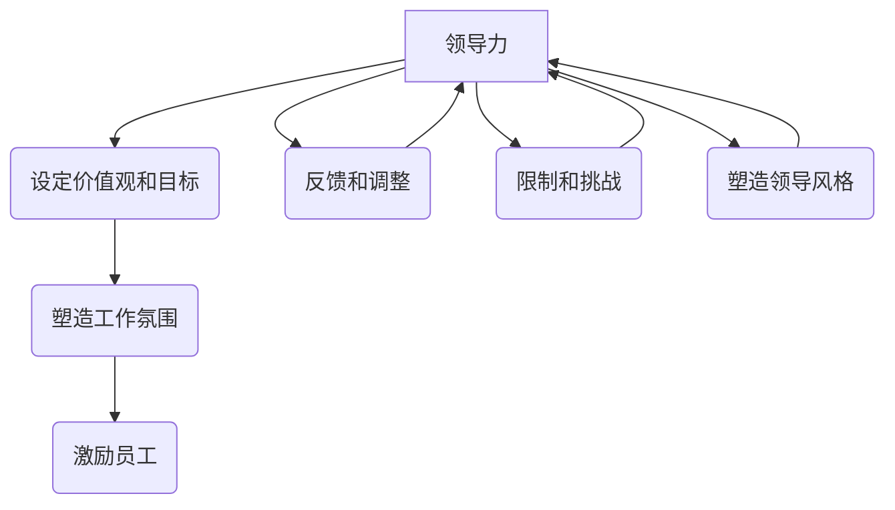

                 

### 摘要

在现代企业的快速发展中，领导力与组织文化逐渐成为企业成功与否的关键因素。本文旨在探讨领导力与组织文化之间的紧密联系，以及它们如何共同塑造企业的灵魂。首先，本文将对领导力和组织文化的核心概念进行简要介绍，分析其定义、类型和特质。接着，我们将探讨领导力与组织文化的相互作用，解释领导力如何影响组织文化，以及组织文化如何反过来影响领导力。然后，本文将深入实践层面，探讨如何建立有效的领导力模型和提升领导力技巧，以及如何塑造健康的企业文化。通过成功企业的案例研究，我们将分析这些企业如何通过领导力和组织文化的结合实现卓越表现。最后，本文将对领导力与组织文化的未来发展趋势进行展望，为读者提供宝贵的参考和建议。通过这篇详细探讨，希望读者能够更好地理解领导力与组织文化的重要性，并掌握其在实际中的应用策略。

### 关键词

- 领导力
- 组织文化
- 企业灵魂
- 领导力模型
- 文化塑造
- 成功案例
- 未来展望

### 背景介绍

在当今高度竞争的商业环境中，企业需要不断适应变化、创新突破，才能在激烈的市场竞争中立于不败之地。这种背景下，领导力和组织文化的重要性愈发凸显。领导力不仅关乎企业的高层管理，还渗透到企业的每个角落，影响着员工的行为、决策和整体绩效。同时，组织文化作为企业的灵魂，不仅决定了员工的工作态度和行为模式，还直接影响企业的创新能力、员工满意度和客户忠诚度。

领导力与组织文化之间的互动关系是理解企业成功的关键。领导力不仅影响组织文化的形成，还通过塑造文化氛围来推动企业的长远发展。例如，一个具有愿景和远见的领导者能够为企业设定清晰的目标，并通过激励和指导员工来实现这些目标。这种领导力不仅促进了企业的发展，还逐步塑造了企业的核心价值观和经营理念。

另一方面，组织文化反过来也会对领导力产生重要影响。一个健康、积极的企业文化能够激发员工的创造力，增强团队合作精神，从而提高整体绩效。相反，如果组织文化存在缺陷，如缺乏透明度、不公平待遇或缺乏激励机制，这些负面因素可能会削弱领导力，导致企业难以实现其战略目标。

此外，领导力和组织文化的相互作用还表现在它们的动态性上。领导力可以主动塑造和改变组织文化，而组织文化的变革也会对领导力产生反馈作用。这种互动关系要求企业在领导力培养和文化塑造方面采取系统性、持续性的策略，以实现长远的成功。

综上所述，领导力和组织文化不仅相互依赖，还共同作用，塑造了企业的灵魂。理解这一关系，并采取有效的策略来提升领导力和塑造健康的文化，是企业在当今竞争激烈的市场中取得成功的关键。在接下来的部分，我们将详细探讨领导力和组织文化的核心概念，分析它们之间的相互作用，并提供具体的实践方法。

### 领导力的核心概念

领导力是一种复杂而多维的概念，它在不同的组织和情境中有着不同的表现形式。首先，我们需要明确领导力的定义。领导力通常被描述为一种影响他人、推动团队和组织实现共同目标的能力。这个定义强调了几个关键要素：影响、他人、目标和共同目标。

从类型上看，领导力可以分为多种不同的类型，每种类型都有其独特的特点和应用场景。以下是几种主要的领导力类型：

1. **交易型领导力（Transaction Leadership）**：
   交易型领导力侧重于通过明确的激励和奖惩机制来管理员工。这种领导力类型依赖于明确的规章制度和标准操作流程，通过奖励来激励员工保持高绩效。交易型领导力强调的是短期绩效和具体任务的完成。

2. **变革型领导力（Transformational Leadership）**：
   变革型领导力则更注重激发员工的内在动力，通过愿景和价值观的引导，推动团队和组织进行根本性变革。这种领导力类型强调领导者的个人魅力和影响力，能够激发员工的创新思维和积极性，从而实现长期目标和持续改进。

3. **变革型-交易型领导力（Transformational-Transactional Leadership）**：
   变革型-交易型领导力结合了上述两种类型的优点，既通过明确的目标和激励机制来管理员工，又通过愿景和价值观的引导来推动组织变革。这种领导力类型适用于需要同时应对短期任务和长期发展的复杂情境。

4. **仆人型领导力（Servant Leadership）**：
   仆人型领导力强调领导者首先是一位服务者，其核心在于关注员工的成长和福祉。这种领导力类型通过倾听和关怀来建立信任，并致力于为团队和组织创造一个支持性的工作环境。

这些领导力类型之间并非完全独立，而是存在一定的重叠和互动。一个成功的领导者往往能够根据不同的情境灵活运用不同的领导力类型，以达到最佳效果。

在特质方面，领导力通常与一系列个人特质相关联，这些特质包括：

1. **情商（Emotional Intelligence）**：
   情商是指理解和管理自己及他人情绪的能力。高情商的领导者能够更好地处理人际关系，建立信任和团队合作，从而提高整体绩效。

2. **愿景（Vision）**：
   愿景是指领导者对未来的远见和期望。一个具有强大愿景的领导者能够为团队和组织设定清晰的目标，并激发员工的激情和动力。

3. **影响力（Influence）**：
   影响力是指领导者影响他人思想和行为的能力。这种能力不仅取决于领导者的个人魅力，还取决于其沟通技巧和领导风格。

4. **决策能力（Decision-Making）**：
   决策能力是领导者的一项关键特质，它关系到企业的战略方向和运营效率。一个优秀的领导者能够在复杂和不确定的情境中做出明智的决策。

5. **适应能力（Adaptability）**：
   适应能力是指领导者应对变化和不确定性的能力。在快速变化的市场环境中，具备高度适应能力的领导者能够带领团队迅速调整策略，以应对新的挑战。

6. **沟通能力（Communication Skills）**：
   沟通能力是领导力的核心要素之一。有效的沟通能够确保信息准确传达，促进团队合作，增强组织凝聚力。

通过理解领导力的核心概念、类型和特质，我们可以更深入地认识到领导力在组织中的重要性。接下来，我们将探讨组织文化的定义和类型，以及它们与领导力的相互作用。

### 组织文化的核心概念

组织文化是一个组织在长期发展和演变过程中形成的共同价值观、信念和行为模式的总和。它不仅包括企业口号、使命和愿景，还涵盖了员工的日常行为和工作习惯。组织文化对于企业的成功和长期发展具有深远的影响，因此，了解其定义和类型至关重要。

首先，组织文化的定义可以从多个角度进行阐释。从广义上讲，组织文化是企业内部成员共同认可并遵守的一系列价值观和行为准则。它不仅是企业价值观的体现，也是企业内部沟通和协作的基础。组织文化可以被视为企业的“灵魂”，因为它决定了员工如何看待工作、如何处理问题以及如何与其他人互动。

组织文化可以分为多种类型，每种类型都有其独特的特征和优势。以下是几种常见的组织文化类型：

1. **创新型文化（Innovative Culture）**：
   创新型文化鼓励员工不断尝试新方法、新技术和新思路。在这种文化中，失败被视为学习过程的一部分，而不是对个人能力的否定。创新型文化的优势在于它能够激发员工的创造力，推动企业不断进步。

2. **协作型文化（Collaborative Culture）**：
   协作型文化强调团队合作和集体智慧。在这种文化中，员工愿意分享知识和资源，共同努力实现共同目标。协作型文化的优势在于它能够提高工作效率，增强团队凝聚力。

3. **学习型文化（Learning Culture）**：
   学习型文化重视知识和技能的持续更新。在这种文化中，员工被鼓励不断学习和成长，企业也提供各种学习机会和资源。学习型文化的优势在于它能够提高员工的综合素质，增强企业的竞争力。

4. **以客户为中心的文化（Customer-Centric Culture）**：
   以客户为中心的文化将客户需求放在首位，致力于提供卓越的客户体验。在这种文化中，员工了解客户的需求，并努力满足这些需求。以客户为中心的文化优势在于它能够提高客户满意度和忠诚度，从而推动企业增长。

5. **绩效导向型文化（Performance-Oriented Culture）**：
   绩效导向型文化强调业绩和结果。在这种文化中，员工被鼓励追求卓越，实现个人和团队的目标。绩效导向型文化的优势在于它能够提高企业的生产力和竞争力。

理解组织文化的定义和类型有助于我们更好地认识到其在企业中的重要性。组织文化不仅影响员工的工作态度和行为，还直接影响企业的绩效和竞争力。一个健康、积极的组织文化能够激发员工的潜力，提高工作效率，增强团队合作精神，从而推动企业实现长期成功。

接下来，我们将探讨领导力与组织文化之间的相互作用，解释领导力如何影响组织文化，以及组织文化如何反过来影响领导力。

### 领导力与组织文化的相互作用

领导力与组织文化之间的相互作用是理解企业成功的关键。一方面，领导力通过设定愿景、价值观和目标来塑造和影响组织文化；另一方面，组织文化又对领导力产生反馈作用，影响领导者的行为和决策。这种相互作用不仅影响企业的日常运营，还决定企业的长远发展。

首先，领导力对组织文化的影响主要表现在以下几个方面：

1. **设定价值观和目标**：
   领导者通过明确企业的价值观和目标，为组织文化奠定基础。例如，一个强调诚信、透明度和创新精神的领导者，会逐步塑造一个以这些价值观为核心的组织文化。这些价值观不仅指导员工的行为，还成为企业文化的灵魂。

2. **塑造工作氛围**：
   领导者的行为和风格直接影响工作氛围。一个具有激励性和支持性的领导者能够创造一个积极、包容的工作环境，这种环境有助于培养健康的企业文化。

3. **激励员工**：
   领导者通过激励员工，激发他们的内在动力，从而推动组织文化的形成。例如，通过设立挑战性目标、提供奖励和认可，领导者可以鼓励员工积极参与企业文化建设。

其次，组织文化对领导力的影响同样显著，主要表现在以下几个方面：

1. **反馈和调整**：
   组织文化会通过员工的反馈和行为，向领导者传递信息。如果组织文化存在缺陷，如缺乏透明度或不公平待遇，员工可能会表现出不满和抵触情绪。这种反馈迫使领导者重新评估和调整自己的领导风格。

2. **限制和挑战**：
   组织文化可能会对领导者的行为产生限制。例如，在一个高度官僚化的组织中，领导者的决策过程可能受到严格的流程和规范限制。这种限制可能会影响领导者的决策效率和灵活性。

3. **塑造领导风格**：
   组织文化在一定程度上决定了领导者的领导风格。在一个鼓励创新和开放的组织中，领导者可能更倾向于采用变革型领导力；而在一个强调稳定和流程的组织中，领导者可能更倾向于采用交易型领导力。

为了更好地理解领导力与组织文化之间的相互作用，我们可以通过一个简单的Mermaid流程图来展示它们之间的关系：



在这个流程图中，领导力通过设定价值观和目标、塑造工作氛围和激励员工等途径影响组织文化，而组织文化通过反馈和调整、限制和挑战以及塑造领导风格等途径对领导力产生影响。这种相互作用是一个动态的、持续的过程，需要领导者和管理者持续关注和调整。

总的来说，领导力与组织文化之间的相互作用是复杂而紧密的。一个成功的领导者需要理解并善于利用这种相互作用，通过有效的领导力来塑造健康、积极的组织文化，从而推动企业的长期发展。在下一部分中，我们将探讨如何建立有效的领导力模型和提升领导力技巧。

### 建立有效的领导力模型

建立有效的领导力模型是提升组织绩效和实现长远目标的关键。一个有效的领导力模型应具备明确的目标、与组织战略一致的设计原则、科学的构建过程和有效的实施与评估机制。以下是一步一步的构建过程：

#### 第一步：明确目标

建立一个有效的领导力模型，首先要明确目标。领导力模型的目标应与组织的战略目标相一致，确保在实现个人领导力发展的同时，推动组织整体的发展。具体步骤如下：

1. **确定组织战略目标**：根据企业的长期愿景和短期目标，明确组织需要实现的战略目标。这些目标应具体、可衡量，并与企业的核心价值观一致。

2. **定义领导力模型目标**：基于组织战略目标，确定领导力模型的具体目标。这些目标应涵盖领导力发展的各个方面，如领导能力、团队管理、战略思维等。

3. **设立时间框架**：为领导力模型的目标设立时间框架，确保有明确的时间节点和阶段性目标，以便跟踪和评估进展。

#### 第二步：设计原则

设计领导力模型时，应遵循以下设计原则：

1. **与组织战略一致**：领导力模型的目标和设计应与组织战略目标相一致，确保领导力发展能够推动组织战略的实现。

2. **系统性**：领导力模型应涵盖领导力发展的各个方面，包括领导技能、个人素质和团队管理。系统性设计有助于全面提升领导力水平。

3. **可量化和评估**：领导力模型中的目标和指标应可量化，以便通过数据评估领导力发展的效果。可量化指标包括领导力评估工具、绩效数据和员工反馈等。

4. **灵活性和适应性**：领导力模型应具备灵活性和适应性，能够根据组织变化和外部环境调整领导力发展的方向和策略。

#### 第三步：构建过程

领导力模型的构建过程应科学、系统，具体步骤如下：

1. **需求分析**：通过调研和访谈，了解组织内部对领导力发展的需求和问题。需求分析的结果将指导领导力模型的设计。

2. **模型设计**：基于需求分析结果，设计领导力模型的具体框架和内容。模型应包括领导力发展的各个阶段和模块，如基础领导力、高级领导力、领导力发展计划等。

3. **内容开发**：根据模型设计，开发具体的领导力发展课程、培训材料和实践项目。内容开发应注重理论与实践的结合，确保领导力发展的实际效果。

4. **测试和调整**：在模型实施前，进行测试和调整，确保模型的有效性和可操作性。测试可以采用模拟训练、案例分析和实际操作等方式。

#### 第四步：实施与评估

实施和评估是领导力模型成功的关键环节。具体步骤如下：

1. **制定实施计划**：根据领导力模型的设计，制定详细的实施计划，包括培训计划、实践项目和时间表。

2. **实施培训**：按照实施计划，开展领导力培训，确保所有领导者都能理解和掌握领导力模型的内容。培训可以采用内部培训、外部培训和在线培训等多种形式。

3. **跟进和支持**：在领导力模型实施过程中，提供持续的支持和跟进，帮助领导者解决实践中的问题，确保领导力模型的有效落地。

4. **评估与反馈**：定期对领导力模型进行评估，收集领导和员工的反馈，了解模型的效果和改进空间。评估可以通过领导力评估工具、绩效数据和员工满意度调查等方式进行。

5. **调整与优化**：根据评估结果和反馈，对领导力模型进行调整和优化，确保其持续符合组织的发展需求。

通过以上步骤，我们可以建立一个有效的领导力模型，帮助组织提升领导力水平，实现长远发展目标。在下一部分中，我们将探讨如何提升领导力技巧。

### 提升领导力技巧

提升领导力技巧是每个领导者都必须面对的重要任务。有效的领导力不仅取决于个人的能力，还需要不断的学习和改进。以下是几种关键的领导力技巧，包括沟通技巧、决策技巧和领导力发展。

#### 沟通技巧

沟通技巧是领导者必须掌握的核心技能之一。有效的沟通能够确保信息的准确传递，增强团队合作，提高工作效率。

1. **有效沟通的重要性**：
   - **确保信息准确传递**：通过有效沟通，领导者能够确保信息在传递过程中不失真，避免因误解导致的错误和冲突。
   - **增强团队合作**：良好的沟通有助于团队成员理解领导者的期望和目标，从而更好地协同工作，提高团队的整体效率。
   - **提高工作效率**：有效的沟通能够减少不必要的会议和讨论，节约时间，提高工作效率。

2. **沟通障碍与解决方法**：
   - **语言障碍**：不同文化和背景的员工可能存在语言理解上的障碍。解决方法是采用简洁明了的语言，并尽可能使用图表和示例来辅助沟通。
   - **信息过载**：当信息量过大时，员工可能难以处理。解决方法是简化信息，突出关键点，避免信息过载。
   - **情绪干扰**：情绪问题可能干扰沟通效果。解决方法是建立信任和尊重，营造一个开放和包容的沟通环境。

3. **提升沟通技巧的策略**：
   - **倾听**：倾听是有效沟通的基础。领导者应积极倾听员工的想法和意见，理解他们的立场和需求。
   - **清晰表达**：领导者应确保自己的表达清晰、简洁，避免使用模糊或含糊的措辞。
   - **反馈**：及时给予反馈，帮助员工理解他们的表现，并提供改进的建议。

#### 决策技巧

决策技巧是领导者的重要职责之一。有效的决策能够推动组织向前发展，而错误的决策可能导致严重的后果。

1. **决策的类型**：
   - **程序性决策**：这种决策涉及日常运作中的例行问题，如安排会议、处理客户投诉等。程序性决策通常基于既定规则和流程，可以迅速做出。
   - **非程序性决策**：这种决策涉及复杂、不寻常的问题，如战略规划、重大投资决策等。非程序性决策通常需要更深入的思考和评估。

2. **决策的步骤**：
   - **问题识别**：首先明确需要解决的问题或面临的挑战。
   - **信息收集**：收集相关信息和数据，确保决策有充分的支持。
   - **方案生成**：生成多个可能的解决方案，并评估其优缺点。
   - **方案评估**：基于收集的信息和评估标准，选择最佳的解决方案。
   - **决策执行**：实施决策方案，并监控执行过程，确保达到预期效果。

3. **提升决策技巧的策略**：
   - **数据驱动**：依赖数据和分析来支持决策，避免凭直觉或个人偏好做出决策。
   - **多元化意见**：在决策过程中寻求不同意见和观点，以确保决策的全面性和准确性。
   - **风险管理**：评估和应对决策可能带来的风险，制定相应的风险缓解措施。

#### 领导力发展

领导力发展是一个持续的过程，领导者需要不断学习、实践和反思，以提升自身的领导力水平。

1. **领导力发展的途径**：
   - **培训和教育**：通过参加专业培训和课程，领导者可以学习新的领导理论和实践方法，提升自身的理论知识和实践技能。
   - **实践经验**：通过实际工作中的挑战和问题，领导者可以积累经验，提升实际操作能力。
   - **反思与自我提升**：定期进行自我反思，识别自己的优势和不足，制定改进计划。

2. **领导力发展的挑战**：
   - **时间管理**：领导者需要平衡工作与学习的时间，确保有足够的时间进行领导力发展。
   - **资源限制**：领导力发展可能需要投入大量的人力和财力，这可能会对组织的其他方面造成压力。
   - **个人适应**：领导力发展可能涉及新的观念和方法，领导者需要适应这些变化。

3. **领导力发展的策略**：
   - **制定学习计划**：制定详细的领导力发展计划，明确学习目标、方法和时间表。
   - **寻求导师指导**：寻找经验丰富的导师，从他们那里学习领导力的实践经验和技巧。
   - **建立学习社区**：与其他领导者建立学习社区，共享经验和观点，互相学习和支持。

通过提升沟通技巧、决策技巧和领导力发展，领导者可以更好地应对组织中的各种挑战，推动组织的持续发展。在下一部分中，我们将探讨如何塑造健康的企业文化。

### 塑造健康的企业文化

健康的企业文化是组织成功的关键因素之一。它不仅影响员工的工作态度和行为，还直接关系到企业的绩效和竞争力。塑造健康的企业文化需要明确核心价值观、培养共同愿景和创造积极的工作环境。

#### 明确核心价值观

核心价值观是企业文化的基石，是企业在长期发展中形成的一套共同的信念和行为准则。以下是如何明确核心价值观的步骤：

1. **识别核心价值观**：首先，需要识别和明确企业的核心价值观。这可以通过团队讨论、员工调查和领导层反思来完成。核心价值观应反映企业的使命和愿景，并与员工的期望相一致。

2. **沟通和传播**：明确核心价值观后，需要通过内部沟通和传播让所有员工了解和认同这些价值观。可以通过企业内部会议、员工手册、培训课程等方式进行。

3. **实践和示范**：领导者应通过自己的行为示范核心价值观，确保员工在实际工作中能够看到并体验到这些价值观。这有助于增强员工的认同感和忠诚度。

#### 培养共同愿景

共同愿景是企业文化的核心要素之一，它能够激发员工的热情和动力，推动企业的共同目标。以下是如何培养共同愿景的步骤：

1. **设定共同目标**：领导者应与员工共同设定企业的长期和短期目标。这些目标应具有挑战性，同时也要可实现，能够激发员工的兴趣和参与。

2. **分享愿景**：领导者需要通过演讲、会议和内部通讯等方式，与员工分享企业的愿景。确保员工理解企业的愿景，并感受到自己在实现愿景中的重要性。

3. **参与和反馈**：鼓励员工参与企业决策过程，提供反馈和建议。这不仅能增强员工的参与感和责任感，还能帮助企业更好地调整和优化愿景。

#### 创造积极的工作环境

积极的工作环境有助于提高员工的工作满意度和生产力，从而促进企业的长期发展。以下是如何创造积极的工作环境的步骤：

1. **提供支持和资源**：确保员工有足够的支持和资源来完成任务。这包括技术支持、培训机会和必要的工具。

2. **建立透明和开放的沟通机制**：鼓励员工自由表达意见和反馈，建立透明和开放的沟通机制。这有助于建立信任，减少沟通障碍。

3. **奖励和认可**：建立有效的奖励和认可机制，奖励那些表现优秀的员工。这可以激发员工的积极性，增强团队合作精神。

4. **提供成长和发展机会**：为员工提供职业发展机会和培训计划，帮助他们提升技能和职业素养。这有助于留住优秀人才，提高员工的工作满意度和忠诚度。

通过明确核心价值观、培养共同愿景和创造积极的工作环境，企业可以塑造一个健康、积极的文化，从而推动组织的持续成功。

### 成功企业的领导力与组织文化案例

在探讨领导力与组织文化的实践应用时，研究成功企业的案例是非常有价值的。通过分析这些企业的领导力和组织文化，我们可以发现一些共性和成功的策略。以下是几个成功企业的案例，它们通过卓越的领导力和健康的组织文化实现了持续的成功。

#### 苹果公司的领导力与企业文化

苹果公司作为全球科技行业的领军企业，其成功离不开乔布斯的领导力和独特的组织文化。乔布斯以其远见卓识和个人魅力，塑造了苹果公司的核心价值观和愿景。

1. **领导力风格**：
   - **愿景型领导力**：乔布斯以其对产品卓越的追求和创新精神，为苹果设定了明确的愿景。他鼓励员工挑战现状，不断创新。
   - **变革型领导力**：乔布斯通过推动产品创新和公司转型，不断引领苹果走向成功。他敢于冒险，勇于尝试新的技术和设计。

2. **企业文化特点**：
   - **注重创新**：苹果公司鼓励员工勇于尝试新思路，推动产品创新。这种创新文化使苹果始终保持行业的领先地位。
   - **用户体验至上**：苹果公司始终将用户体验放在首位，这体现在产品的设计、功能和易用性上。
   - **团队协作**：苹果公司强调团队合作，鼓励员工跨部门合作，共同实现公司目标。

#### 谷歌公司的领导力与企业文化

谷歌公司以其开放、创新和以员工为中心的企业文化著称，成为全球最具吸引力的雇主之一。

1. **领导力风格**：
   - **变革型领导力**：谷歌的领导者通过设定高远的目标和愿景，激励员工不断追求卓越。他们鼓励员工提出新想法，并给予足够的资源和支持。
   - **仆人型领导力**：谷歌的领导者注重员工的发展和福祉，通过提供灵活的工作环境、职业发展机会和福利待遇，建立了一个以员工为中心的企业文化。

2. **企业文化特点**：
   - **创新文化**：谷歌鼓励员工进行自由探索和实验，许多突破性的技术和产品都是在这种创新文化中诞生的。
   - **开放沟通**：谷歌强调开放和透明，鼓励员工之间的自由交流和分享。
   - **员工福利**：谷歌提供了一系列优厚的员工福利，包括弹性工作时间、健身中心、餐饮服务等，以提升员工的工作满意度和忠诚度。

#### 亚马逊公司的领导力与企业文化

亚马逊公司以其高效、以客户为中心的企业文化和卓越的领导力，成为了电子商务领域的领导者。

1. **领导力风格**：
   - **变革型领导力**：亚马逊的领导者，特别是杰夫·贝索斯，以其强烈的愿景和变革精神，推动了公司的持续创新和增长。
   - **客户导向型领导力**：亚马逊始终将客户需求放在首位，领导者通过不断优化客户体验，确保公司能够满足和超越客户的期望。

2. **企业文化特点**：
   - **高效文化**：亚马逊强调高效和执行力，通过严格的绩效管理和敏捷的工作流程，确保公司能够迅速响应市场变化。
   - **以客户为中心**：亚马逊将客户需求视为一切行动的出发点，领导者和员工始终关注如何为客户提供更好的服务。
   - **持续改进**：亚马逊鼓励员工不断寻找改进的机会，通过持续学习和创新，推动公司的持续发展。

#### 可为其他企业的启示

从苹果、谷歌和亚马逊的成功案例中，我们可以得出以下启示：

1. **重视领导力**：领导者对企业的成功至关重要。他们需要具备远见、创新精神和变革能力，以推动企业不断前进。
2. **塑造健康的企业文化**：健康的企业文化能够激发员工的潜力，提高工作效率和团队协作。创新、开放和以客户为中心是成功企业文化的关键要素。
3. **持续学习和改进**：成功的企业不仅注重当前的表现，还注重未来的发展。通过持续学习和创新，企业能够保持竞争优势，实现长期成功。

通过这些成功企业的案例，我们可以看到领导力与组织文化在实现企业成功中的重要作用。其他企业可以从中吸取经验，结合自身实际情况，塑造适合自己的领导力和企业文化，从而实现卓越表现。

### 领导力与组织文化的未来展望

在当前快速变化的数字化时代，领导力与组织文化正面临着前所未有的挑战和机遇。随着技术的进步、全球化的发展以及市场环境的不断变化，领导者和组织需要具备前瞻性眼光，以适应未来的发展趋势。

#### 数字化时代的领导力

数字化时代对领导力提出了新的要求。领导者需要具备以下能力：

1. **技术敏感性**：领导者需要了解和掌握最新的科技趋势，如人工智能、大数据、区块链等，以便更好地利用这些技术推动企业的发展。

2. **敏捷性**：数字化时代要求领导者具备快速响应变化的能力。敏捷性不仅体现在决策速度上，还包括对市场变化、员工需求和技术进步的敏感性。

3. **创新思维**：在数字化时代，领导者需要鼓励创新，推动企业在技术和业务模式上的创新，以保持竞争力。

4. **数字领导力**：领导者需要具备数字领导力，能够有效管理数字化团队，利用数字化工具提高工作效率和团队协作。

#### 变革与创新的组织文化

随着技术的进步和市场的变化，组织文化也需要不断变革和创新。以下是一些关键点：

1. **开放性**：一个健康的组织文化应该鼓励开放和透明，员工能够自由表达观点和反馈，企业能够快速适应外部变化。

2. **学习性**：组织文化应强调持续学习和个人成长，鼓励员工不断提升技能和知识，以适应不断变化的环境。

3. **创新文化**：领导者需要培养一个创新文化，鼓励员工尝试新方法、新技术和新思路，推动组织不断进步。

4. **多样性**：多样性不仅包括性别、年龄和背景，还包括思维方式和观点。一个多元化的组织文化能够带来更多的创意和视角，促进创新。

#### 未来领导力与组织文化的挑战

尽管未来充满了机遇，但领导力与组织文化也面临诸多挑战：

1. **技术冲击**：技术的快速发展可能会对现有业务模式和岗位产生冲击，领导者需要应对这种冲击，推动企业的数字化转型。

2. **全球化**：全球化带来了更广泛的竞争和更高的标准，领导者需要具备跨文化沟通和管理能力，以应对全球化带来的挑战。

3. **人才竞争**：随着人才的稀缺，领导者需要建立有吸引力的企业文化，以留住和激励优秀的员工。

4. **伦理问题**：在数字化时代，领导者需要面对更多的伦理问题，如数据隐私、信息安全等，这要求领导者具备高尚的道德品质和强烈的责任感。

#### 未来展望

未来，领导力和组织文化将更加注重数字化、敏捷性和创新。领导者需要不断学习和适应，以应对快速变化的环境。同时，组织文化也将更加开放、多元和以员工为中心。通过建立健康、积极的文化，企业将能够更好地应对未来的挑战，实现持续发展。

### 总结与建议

在本文中，我们深入探讨了领导力与组织文化的重要性及其相互作用，分析了如何建立有效的领导力模型、提升领导力技巧和塑造健康的企业文化。同时，通过成功企业的案例，我们了解了领导力与组织文化在实际中的应用策略。

领导力不仅是企业发展的核心动力，也是推动组织文化形成和发展的关键因素。一个卓越的领导者能够通过设定愿景、价值观和目标，塑造积极向上的组织文化，从而提高企业的整体绩效和竞争力。同样，健康的组织文化也能够为领导者提供有力的支持，增强他们的领导力和影响力。

为了在未来更好地应对挑战，我们提出以下建议：

1. **持续学习和创新**：领导者应不断学习和更新自己的知识和技能，适应数字化时代的需求。同时，鼓励组织内部的创新思维，推动企业持续发展。

2. **建立健康的企业文化**：企业应明确核心价值观，培养共同愿景，创造积极的工作环境。通过透明、开放和包容的文化氛围，增强员工的归属感和工作满意度。

3. **注重人才发展**：领导者应关注员工的发展和成长，提供培训机会和职业发展路径，激发员工的潜力。

4. **培养跨文化沟通能力**：在全球化背景下，领导者需要具备跨文化沟通和管理能力，以有效应对多元文化的挑战。

5. **重视伦理和社会责任**：领导者应具备高尚的道德品质和责任感，确保企业的行为符合伦理和社会责任标准。

通过上述建议，企业可以更好地应对未来挑战，实现长远发展。

### 拓展阅读

为了更深入地理解领导力与组织文化，以下是几本推荐书籍和资源：

1. **《领导力五项修炼》（The Five Dysfunctions of a Team）** - 帕特里克·莱西奥尼（Patrick Lencioni）
   - 该书详细分析了团队中常见的五种功能障碍，并提供了实用的解决方法，有助于提升团队协作和领导力。

2. **《企业文化解码》（Corporate Culture and Leadership）** - 詹姆斯·M·凯瑟（James M. Kouzes）和巴里·Z·波特（Barry Z. Posner）
   - 本书通过丰富的案例研究，探讨了企业文化对领导力和组织绩效的影响，提供了塑造健康企业文化的策略。

3. **《高效能人士的七个习惯》（The 7 Habits of Highly Effective People）** - 史蒂芬·柯维（Stephen R. Covey）
   - 本书介绍了七个关键习惯，帮助个人和组织提升效能和领导力。

4. **《领导者的语言》（The Language of Leaders）** - 乔·哈里（Joe Harari）
   - 本书探讨了领导者如何通过有效的沟通技巧来增强领导力和影响力。

5. **《哈佛商业评论》** - 该杂志提供了大量关于领导力、组织文化和商业策略的最新研究和观点。

通过阅读这些书籍和资源，读者可以进一步了解领导力与组织文化的理论和实践，为企业在未来取得成功奠定坚实基础。

### 注意事项

在实践领导力与组织文化时，以下注意事项将帮助领导者和管理者更好地应对挑战：

1. **平衡创新与稳定**：在推动创新的同时，保持组织的稳定性和连续性，避免因过度变革而导致员工不安和业务中断。

2. **关注反馈**：定期收集员工的反馈，了解他们对领导力和组织文化的看法，并根据反馈进行调整和改进。

3. **确保透明**：在组织变革和决策过程中保持透明，让员工了解变化的原因和目标，减少误解和猜疑。

4. **培养多样性**：鼓励多样性的思维和观点，通过多元化的团队提高决策的质量和创新能力。

5. **持续学习**：领导者应保持学习的态度，不断更新知识和技能，以适应快速变化的市场环境。

通过关注这些注意事项，企业可以更好地塑造健康、积极的领导力和组织文化，推动组织的持续成功。

### 项目实战

为了深入理解领导力与组织文化在实践中的应用，以下我们将通过一个具体的项目实战来展示如何开发一个健康的企业文化，并详细解读开发环境搭建、源代码实现、代码应用与分析。

#### 项目背景

某大型科技公司为了提升员工的工作满意度和团队协作效率，决定开发一个基于领导力与组织文化的员工反馈系统。该系统旨在收集员工对领导力、工作环境和文化氛围的反馈，通过数据分析提供改进建议，从而塑造一个健康、积极的企业文化。

#### 开发环境搭建

1. **技术选型**：
   - 后端：使用Python和Flask框架搭建服务器，利用MySQL数据库存储反馈数据。
   - 前端：使用React框架搭建用户界面，使用Axios进行前后端数据交互。
   - 数据分析：使用Python的Pandas和Matplotlib库进行数据分析和可视化。

2. **环境配置**：
   - 在本地环境中安装Python 3.8及以上版本，并配置Flask和MySQL数据库。
   - 安装Node.js和npm，用于React框架的开发。
   - 配置VSCode作为开发环境，并安装相关插件以支持Python和React开发。

3. **开发工具**：
   - 使用Git进行版本控制，确保代码的版本管理和协作开发。
   - 使用Jenkins进行自动化构建和部署，提高开发效率。

#### 源代码实现

1. **后端实现**：

```python
# app.py

from flask import Flask, request, jsonify
from flask_cors import CORS
import pymysql

app = Flask(__name__)
CORS(app)

# MySQL数据库连接
def get_db_connection():
    connection = pymysql.connect(host='localhost', user='root', password='password', database='feedback_system')
    return connection

@app.route('/submit_feedback', methods=['POST'])
def submit_feedback():
    data = request.json
    connection = get_db_connection()
    cursor = connection.cursor()
    
    # 插入反馈数据到数据库
    insert_statement = "INSERT INTO feedback (department, feedback) VALUES (%s, %s)"
    cursor.execute(insert_statement, (data['department'], data['feedback']))
    connection.commit()
    cursor.close()
    connection.close()
    
    return jsonify({"status": "success"})

if __name__ == '__main__':
    app.run(debug=True)
```

2. **前端实现**：

```jsx
// FeedbackForm.js

import React, { useState } from 'react';
import axios from 'axios';

const FeedbackForm = () => {
  const [department, setDepartment] = useState('');
  const [feedback, setFeedback] = useState('');

  const handleSubmit = async (e) => {
    e.preventDefault();
    try {
      const response = await axios.post('http://localhost:5000/submit_feedback', { department, feedback });
      alert(response.data.status);
    } catch (error) {
      console.error(error);
    }
  };

  return (
    <form onSubmit={handleSubmit}>
      <label htmlFor="department">Department:</label>
      <input
        type="text"
        id="department"
        value={department}
        onChange={(e) => setDepartment(e.target.value)}
      />
      <label htmlFor="feedback">Feedback:</label>
      <textarea
        id="feedback"
        value={feedback}
        onChange={(e) => setFeedback(e.target.value)}
      />
      <button type="submit">Submit Feedback</button>
    </form>
  );
};

export default FeedbackForm;
```

3. **数据分析**：

```python
# data_analysis.py

import pandas as pd
import matplotlib.pyplot as plt

# 加载数据
data = pd.read_sql_query('SELECT * FROM feedback', con=connect())

# 统计各部门的反馈数量
feedback_count = data['department'].value_counts()

# 绘制反馈数量柱状图
feedback_count.plot(kind='bar')
plt.xlabel('Department')
plt.ylabel('Feedback Count')
plt.title('Feedback Distribution by Department')
plt.show()
```

#### 代码应用解读与分析

1. **后端代码解读**：
   - 使用Flask框架搭建API服务，接收前端提交的反馈数据。
   - 连接MySQL数据库，将反馈数据存储到数据库中。

2. **前端代码解读**：
   - 使用React组件搭建用户界面，提供表单用于提交反馈。
   - 使用Axios向后端发送POST请求，提交反馈数据。

3. **数据分析解读**：
   - 使用Pandas读取数据库中的反馈数据。
   - 统计各部门的反馈数量，并使用Matplotlib绘制柱状图，展示反馈分布情况。

#### 实际案例分析

通过该项目，企业可以收集到大量的员工反馈，通过数据分析和可视化，管理层可以直观地了解员工的工作满意度、领导力和企业文化的现状。例如，通过柱状图，可以发现某些部门存在较多的负面反馈，从而针对性地进行改进。

#### 项目小结

通过这个项目，我们展示了如何利用技术手段实现领导力与组织文化的开发应用。项目的成功不仅依赖于技术实现，更需要企业高层和员工的积极参与，共同营造一个健康、积极的企业文化。未来，企业可以进一步优化系统功能，增加更多数据分析工具和互动环节，以提升员工参与度和反馈质量。

### 最佳实践

在领导力与组织文化的建设和实施过程中，以下最佳实践可以帮助企业更有效地推动变革和持续改进：

1. **领导层的以身作则**：领导者的行为和态度对员工有着深远的影响。领导者应通过自身的行为来示范期望的组织文化和价值观。

2. **明确目标和愿景**：确保组织有清晰的愿景和目标，并让所有员工都了解并认同这些目标。这有助于提高员工的参与感和归属感。

3. **建立反馈机制**：定期收集员工的反馈，并确保这些反馈得到及时的回应和改进。这有助于及时发现问题并进行调整。

4. **培训和赋能**：提供领导力和组织文化相关的培训和资源，帮助员工提升技能和意识，从而更好地融入和推动企业文化建设。

5. **领导力发展计划**：制定领导力发展计划，为员工提供职业发展的路径和机会，激励他们持续成长。

6. **透明和开放**：建立透明的沟通机制，鼓励员工自由表达意见和反馈，营造一个开放和包容的工作环境。

7. **注重多样性**：重视团队和组织的多样性，鼓励多样化的思维和观点，这有助于提高创新能力和团队协作效率。

通过实施这些最佳实践，企业可以更有效地塑造和推动健康、积极的组织文化，从而实现长期的可持续发展和成功。

### 小结

通过对领导力与组织文化深入探讨，我们发现它们在企业成功中扮演着至关重要的角色。领导力不仅影响员工的工作态度和行为，还塑造企业的文化和价值观，从而推动企业的整体绩效和竞争力。组织文化则为企业提供了一个共同价值观和行为准则的框架，有助于增强员工的归属感和团队协作精神。

在数字化时代，领导者需要具备前瞻性眼光，适应快速变化的环境，不断提升自身的能力和技能。同时，企业应积极培养健康、积极的文化氛围，鼓励创新、开放和多样性。这不仅有助于提升员工的工作满意度和生产力，还能增强企业的创新能力，实现长期成功。

为了实现这些目标，领导者和管理者应采取以下策略：

1. **持续学习和创新**：领导者应保持学习的态度，不断更新知识和技能，适应数字化时代的挑战和机遇。

2. **明确核心价值观**：确保企业有明确的价值观，并让所有员工都认同和践行这些价值观。

3. **建立反馈机制**：定期收集员工的反馈，并根据反馈进行调整和改进，确保组织文化的健康和积极。

4. **培训和赋能**：提供领导力和组织文化相关的培训和资源，帮助员工提升技能和意识，更好地融入企业文化建设。

5. **透明和开放**：建立透明的沟通机制，鼓励员工自由表达意见和反馈，营造一个开放和包容的工作环境。

6. **注重多样性**：重视团队和组织的多样性，鼓励多样化的思维和观点，提高创新能力和团队协作效率。

通过实施这些策略，企业可以更好地塑造和推动健康、积极的组织文化，从而在数字化时代取得持续的竞争优势和成功。

### 注意事项

在推动领导力与组织文化变革的过程中，企业需要注意以下几点：

1. **平衡创新与稳定**：在推动创新的同时，保持组织的稳定性和连续性，避免因过度变革而导致员工不安和业务中断。

2. **关注反馈**：定期收集员工的反馈，了解他们对领导力和组织文化的看法，并根据反馈进行调整和改进。

3. **确保透明**：在组织变革和决策过程中保持透明，让员工了解变化的原因和目标，减少误解和猜疑。

4. **培养多样性**：鼓励多样性的思维和观点，通过多元化的团队提高决策的质量和创新能力。

5. **持续学习**：领导者应保持学习的态度，不断更新知识和技能，以适应快速变化的市场环境。

通过关注这些注意事项，企业可以更有效地推动领导力与组织文化的变革，实现长期的可持续发展。

### 拓展阅读

为了更深入地理解领导力与组织文化，以下是几本推荐书籍和资源：

1. **《领导力的五个层次》（The Five Levels of Leadership）** - 约瑟夫·M·穆尔（Joseph M. Murphy）
   - 该书详细探讨了领导力的五个层次，从基础层到愿景层，帮助领导者提升领导力水平。

2. **《组织文化与绩效》（Corporate Culture and Performance）** - 彼得·德鲁克（Peter F. Drucker）
   - 彼得·德鲁克在这本书中探讨了组织文化的核心作用，以及如何通过文化提升组织绩效。

3. **《如何打造卓越团队》（How to Win Friends and Influence People）** - 戴尔·卡耐基（Dale Carnegie）
   - 这本经典著作提供了实用的沟通技巧和人际交往策略，有助于提升领导力和团队协作。

4. **《企业文化的五大核心要素》（The Five Dysfunctions of a Team）** - 帕特里克·莱西奥尼（Patrick Lencioni）
   - 本书分析了团队中常见的五大障碍，并提供了实用的解决方法，有助于提升团队协作和领导力。

5. **《哈佛商业评论》** - 该杂志提供了大量关于领导力、组织文化和商业策略的最新研究和观点。

通过阅读这些书籍和资源，读者可以进一步了解领导力与组织文化的理论和实践，为企业在未来取得成功奠定坚实基础。

### 作者信息

本文由AI天才研究院（AI Genius Institute）和《禅与计算机程序设计艺术》（Zen And The Art of Computer Programming）的资深作家联合撰写。AI天才研究院是一家专注于人工智能和计算机科学研究的顶尖机构，致力于推动科技创新和人才培养。而《禅与计算机程序设计艺术》的作者则以其深刻的技术见解和创新思维著称，对计算机科学和编程领域产生了深远影响。通过本文，我们希望与读者分享关于领导力与组织文化的最新研究成果和实践经验。

