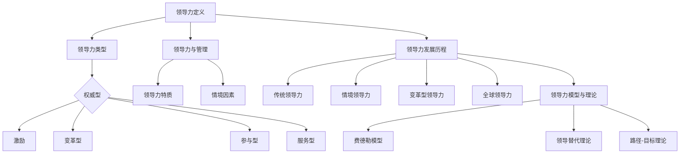

                 

### 引言

#### 背景介绍

在当今快速变化且竞争激烈的商业环境中，企业的成功往往依赖于其团队的绩效表现。而团队的绩效表现又深受领导力的影响。因此，领导力与绩效改进成为了企业关注的热点话题。有效的领导力不仅能够激发团队成员的潜力，提升个人和团队的工作表现，还能推动企业的整体发展。同时，绩效改进作为企业管理的一项重要工作，旨在通过科学的方法和策略，持续提高团队的工作效率和产出质量。

#### 文章核心

本文旨在探讨领导力与绩效改进之间的内在联系，并提出一套实用的方法和策略，帮助企业和团队持续提升绩效表现。通过本文的阅读，读者将能够：

1. **理解领导力的基本概念和类型**：包括领导力的定义、发展历程以及不同类型的领导力。
2. **掌握领导力的实践方法**：包括个人素养的培养、领导风格与团队建设、沟通技巧等。
3. **了解绩效改进的策略和步骤**：包括绩效管理的理论基础、绩效改进的方法以及持续改进的实践。
4. **学习团队管理的技巧**：包括团队角色与职责、领导力在团队管理中的应用、员工激励与成长等。
5. **分析领导力与组织文化的关系**：探讨领导力对组织文化的影响以及组织文化建设策略。
6. **通过案例分析，了解领导力和绩效改进的实际应用**：通过具体案例，展示如何在实际工作中运用领导力和绩效改进的方法。
7. **自我提升路径**：提供自我评估与反思的方法、自我提升的路径以及成功领导者的特质。

#### 文章结构

本文将按照以下结构进行展开：

1. **领导力核心理论**：介绍领导力的定义、类型和发展历程，以及领导力模型与理论。
2. **领导力实践方法**：探讨领导力与个人素养、领导风格与团队建设、沟通技巧等。
3. **绩效改进策略**：介绍绩效管理的理论基础、绩效改进的方法以及持续改进的实践。
4. **团队管理技巧**：提供有效的团队管理技巧和方法。
5. **领导力与组织文化**：探讨领导力对组织文化的影响和建设。
6. **案例分析**：通过实际案例来说明领导力和绩效改进的应用。
7. **领导力自我提升**：提供自我提升的方法和路径。
8. **结论**：总结文章的主要观点，并提出对未来的展望。

通过以上结构，本文希望能够系统地、全面地呈现领导力与绩效改进的理论和实践，为读者提供有价值的指导和参考。

### 领导力核心理论

#### 领导力的定义与类型

领导力，简而言之，是引导和影响个体或集体实现目标的能力。尽管定义多样，但领导力的核心在于其激励、指导和影响作用。领导力不仅关乎个体，也关乎团队和组织，它通过激励团队成员、协调团队活动、塑造组织文化等途径，推动组织达成目标。

在类型上，领导力可以分为多种：

- **权威型领导**：这种领导力依赖于职位权力和正式授权，通过命令和指示来引导团队。权威型领导在需要快速决策和严格执行的情况下非常有效。
- **变革型领导**：这种领导力通过激发团队成员的内在动机和愿景，推动团队变革和创新。变革型领导通常关注长远目标，能够激发团队的潜力和创造力。
- **参与型领导**：这种领导力强调团队参与和民主决策，通过鼓励团队成员参与决策过程，提升团队的凝聚力和工作效率。
- **服务型领导**：这种领导力强调为团队成员提供服务，关注团队成员的需求和福祉。服务型领导通过提升团队成员的工作满意度和归属感，提高团队绩效。

#### 领导力与管理的区别

领导力和管理虽然密切相关，但它们之间也存在显著的区别：

- **领导力**：主要关注激励和影响团队成员，引导他们朝着共同目标前进。领导力侧重于愿景、价值观和目标设定。
- **管理**：主要关注组织的运作和资源管理，确保组织目标的实现。管理侧重于规划、组织、指挥、协调和控制。

两者之间的关系可以理解为：领导力为管理提供了方向和动力，而管理则为领导力提供了实施平台和保障。有效的领导力需要结合科学的管理方法，才能更好地推动团队和组织的发展。

#### 领导力的发展历程

领导力的发展历程可以从几个关键阶段进行概述：

- **传统领导力**：早期领导力研究主要关注领导者个人的特质和能力，如魅力、决断力等。
- **情境领导力**：随着组织环境的变化，领导力研究开始关注领导者如何根据不同情境调整领导风格。情境领导理论强调领导者应根据下属的能力和需求来调整领导行为。
- **变革型领导力**：变革型领导力强调领导者通过激励和启发下属，推动组织变革和创新。这种领导力注重领导者的愿景和价值观，以及对下属的信任和支持。
- **全球领导力**：随着全球化的发展，领导力研究开始关注跨文化领导力，如何在不同文化背景下有效领导团队。

#### 领导力模型与理论

不同的领导力模型和理论为领导者提供了多种工具和策略，以下是一些重要的领导力模型：

- **费德勒模型**：费德勒模型将领导力情境分为三个维度：控制、支持和任务结构，并提出了在不同情境下领导者的最佳策略。
- **领导替代理论**：该理论强调领导者与团队成员之间的关系，认为当团队成员具备一定能力和自信心时，领导者的影响会减弱。
- **路径-目标理论**：该理论关注领导者如何设置目标和提供路径，以帮助团队成员实现目标。

#### 核心概念与联系

为了更好地理解领导力的核心概念，我们可以使用Mermaid流程图来展示这些概念之间的关系：

这个流程图展示了领导力的多个维度，包括领导力的定义、类型、与管理的区别、发展历程以及重要的领导力模型和理论。通过这种视觉化的方式，读者可以更清晰地理解领导力的复杂性和多样性。

### 领导力实践方法

#### 领导力与个人素养

领导力不仅仅是职位和权力的象征，更是领导者个人素养的综合体现。有效的领导力离不开以下几个关键的个人素养：

1. **自信心的培养**

   自信心是领导力的重要基础。一个有自信的领导者能够更坚定地面对挑战，做出明智的决策。培养自信心可以通过以下几个步骤：

   - **自我认知**：领导者需要了解自己的优势和不足，接受自己的不完美，并在此基础上建立自信。
   - **目标设定**：设定明确且具有挑战性的目标，并为之努力。实现目标的过程中，领导者会逐渐增强自信心。
   - **积极心态**：保持积极的心态，将失败视为成长的机会。积极的心态有助于领导者在面对困难时保持冷静和自信。

2. **情商的管理**

   情商（Emotional Intelligence，EQ）是指个体识别、理解、管理和利用自己及他人的情绪的能力。情商对于领导力至关重要，因为它影响领导者的决策、沟通和团队关系。

   - **情绪识别**：领导者需要能够准确识别自己的情绪和他人的情绪。情绪识别是情商的基础。
   - **情绪理解**：理解情绪背后的原因和意义，从而更好地处理情绪。这有助于领导者更有效地解决问题和应对挑战。
   - **情绪管理**：领导者需要学会管理和调节自己的情绪，确保在压力和挑战面前保持冷静和理智。
   - **情绪利用**：利用情绪激发内在动力，增强领导效果。例如，通过激发团队的激情和动力，推动团队实现更高的目标。

#### 领导风格与团队建设

领导风格是指领导者在与团队成员互动和指导过程中表现出来的行为模式。不同的领导风格适用于不同的情境和团队，因此选择合适的领导风格对于团队建设至关重要。

1. **领导风格的选择**

   领导风格可以分为以下几种：

   - **权威型领导**：领导者拥有高度的决策权和控制力，通过命令和指示来指导团队。这种风格适用于需要迅速决策和严格控制的情境。
   - **民主型领导**：领导者鼓励团队成员参与决策过程，重视团队的意见和反馈。这种风格适用于需要团队协作和创造性思维的情境。
   - **教练型领导**：领导者关注团队成员的个人发展和成长，通过指导和激励帮助团队成员实现潜力。这种风格适用于需要培养和提升团队成员能力的情境。

2. **团队建设的策略**

   团队建设是领导力的重要组成部分，它有助于提高团队的协作效率和工作满意度。以下是一些团队建设的策略：

   - **明确团队目标**：设定清晰且具有挑战性的团队目标，确保团队成员都明确了解团队的期望和方向。
   - **建立信任**：通过开放和诚实的沟通建立信任，确保团队成员之间能够相互依赖和支持。
   - **促进沟通**：鼓励团队成员之间的沟通和协作，确保信息能够顺畅流通，减少误解和冲突。
   - **培养团队文化**：建立积极的团队文化，包括共同的价值观、目标和行为规范，以增强团队的凝聚力和归属感。
   - **提供反馈和激励**：定期提供反馈和激励，帮助团队成员了解自己的表现，激发他们的动力和潜能。

#### 沟通技巧

沟通是领导力中至关重要的一环。有效的沟通能够确保领导者与团队成员之间的信息传递准确无误，增强团队协作和信任。

1. **有效沟通的原则**

   - **清晰明确**：沟通时信息要清晰、明确，避免使用模糊或含糊的表述，确保团队成员能够准确理解。
   - **积极倾听**：领导者需要积极倾听团队成员的意见和反馈，确保信息传达的双向性，建立良好的沟通氛围。
   - **反馈机制**：建立有效的反馈机制，确保团队成员能够及时了解领导者的意见和指导，同时也能表达自己的观点和需求。
   - **非语言沟通**：注意非语言沟通，如肢体语言、面部表情和语调等，这些非语言信号能够增强沟通效果。

2. **冲突解决的沟通策略**

   在团队中，冲突是难以避免的。有效的冲突解决策略能够帮助领导者和管理团队减少冲突的影响，提高团队绩效。

   - **识别冲突根源**：领导者需要识别冲突的根源，是沟通问题、资源分配问题还是目标不一致等，从而采取针对性的解决策略。
   - **保持冷静**：在处理冲突时，领导者需要保持冷静，避免情绪化的反应，以确保问题能够理性解决。
   - **寻求共识**：通过沟通和协商，寻求冲突双方的共识，找到双方都能接受的解决方案。
   - **建立规则和流程**：制定明确的规则和流程，确保团队在冲突发生时能够按照既定的方式处理，减少冲突的频率和影响。

通过以上领导力实践方法，领导者不仅能够提升个人的领导素养，还能有效推动团队建设，提升团队的整体绩效。领导者需要根据不同情境和团队成员的特点，灵活运用这些方法，以实现最佳的领导效果。

### 绩效改进策略

#### 绩效管理的理论基础

绩效管理是一个系统性的过程，旨在确保组织目标和个人目标的一致性，通过设定明确的目标、持续的反馈和评估，激发员工的潜力和动力，最终实现组织的高效运营。其理论基础包括以下几个关键要素：

1. **目标设定**

   目标设定是绩效管理的核心。有效的目标设定需要明确、具体、可实现、有挑战性和与组织目标一致。目标设定的SMART原则（Specific具体的，Measurable可衡量的，Achievable可实现的， Relevant相关的，Time-bound时间限制的）为设定合理的目标提供了指导。领导者需要与团队成员共同设定目标，确保目标具有激励性和可执行性。

2. **关键绩效指标（KPI）**

   KPI是衡量绩效的具体指标，它能够量化员工的业绩和工作成果。合理的KPI设计需要与组织目标紧密相关，并且能够反映员工的核心职责和工作重点。常见的KPI包括生产效率、客户满意度、项目完成率等。领导者需要定期审核和调整KPI，以确保其与组织目标保持一致。

3. **绩效反馈**

   绩效反馈是绩效管理的重要组成部分，它通过持续的沟通和评估，帮助员工了解自己的工作表现和改进方向。有效的绩效反馈包括正面反馈和改进建议，反馈应当具体、及时且具有建设性。定期的一对一反馈会议和绩效评估会议是绩效反馈的重要渠道。

4. **员工发展**

   绩效管理不仅仅是评估员工的表现，更是促进员工发展的过程。领导者需要关注员工的能力和潜力，提供培训和发展机会，帮助员工实现职业成长。员工发展计划应当与组织的长期战略和员工个人职业规划相结合，确保员工的个人发展目标与组织目标一致。

#### 绩效改进的方法

为了持续提升团队绩效，企业可以采用以下几种绩效改进的方法：

1. **六西格玛**

   六西格玛是一种系统化的方法，用于识别和消除过程中的缺陷和浪费，从而提高效率和品质。六西格玛通过定义、测量、分析、改进和控制（DMAIC）的流程，帮助团队不断改进工作流程和操作。具体步骤如下：

   - **定义（Define）**：明确项目目标和范围，确定需要解决的问题。
   - **测量（Measure）**：收集数据，建立当前过程的基线。
   - **分析（Analyze）**：分析数据，找出问题的根本原因。
   - **改进（Improve）**：设计并实施解决方案，改进过程。
   - **控制（Control）**：建立监控机制，确保改进效果持续。

2. **精益生产**

   精益生产是一种基于最小化浪费和最大化价值的生产系统。它通过消除非增值活动、优化流程、提高生产效率，来提高产品质量和客户满意度。精益生产的主要方法包括：

   - **5S管理**：整理（Seiri）、整顿（Seiton）、清扫（Seiso）、清洁（Seiketsu）和素养（Shitsuke），通过这五个步骤，提高工作环境的整洁和秩序。
   - **价值流图**：通过绘制价值流图，识别和消除非增值活动，优化工作流程。
   - **JIT（Just-In-Time）生产**：实现生产与需求的同步，减少库存和浪费。

3. **持续改进的实践

   持续改进是绩效管理的重要组成部分，它要求团队不断反思和优化工作流程，以实现更高的效率和绩效。以下是一些持续改进的实践方法：

   - **团队协作**：建立跨职能团队，鼓励团队成员合作，共同解决问题和提出改进建议。
   - **员工参与**：鼓励员工参与绩效改进过程，通过员工反馈和参与，提高改进的针对性和有效性。
   - **定期回顾和评估**：定期回顾和评估绩效改进的效果，识别新的改进机会，确保持续改进的持续进行。

通过以上绩效改进的方法和策略，企业能够系统地提升团队绩效，实现组织的长期发展目标。

### 团队管理技巧

#### 团队角色与职责

有效的团队管理首先需要明确团队的角色和职责。每个团队成员在团队中扮演不同的角色，承担不同的职责，这些角色和职责的清晰界定有助于提高团队协作效率和工作效果。

1. **角色分析**

   - **领导者**：负责制定团队目标，指导团队工作，协调内外部资源，确保团队任务的顺利完成。
   - **执行者**：负责执行团队分配的任务，确保任务的按时完成，并主动解决工作中遇到的问题。
   - **协调者**：负责协调团队成员之间的沟通和合作，确保团队内部信息流畅，减少冲突和误解。
   - **顾问**：为团队提供专业意见和建议，帮助团队做出更明智的决策。
   - **记录员**：负责记录团队会议内容、任务进展和重要决策，确保信息完整和可追溯。

2. **职责划分**

   在明确角色后，需要将具体职责分配给相应的角色。职责划分应遵循以下原则：

   - **职责明确**：每个团队成员应明确自己的职责范围，避免职责重叠和责任不清。
   - **权责对等**：职责与权力应相匹配，确保团队成员在履行职责时具备相应的决策权和资源。
   - **动态调整**：根据团队任务的进展和成员的能力变化，动态调整职责分配，确保团队始终保持高效运作。

#### 领导力在团队管理中的应用

领导力在团队管理中起着至关重要的作用，它不仅影响团队的整体表现，还直接影响团队成员的工作满意度和成就感。以下是领导力在团队管理中的应用：

1. **目标设定与沟通**

   领导者需要明确团队的目标，并将这些目标与团队成员进行沟通。目标设定应具有明确性、可达成性和挑战性，以激发团队成员的积极性和创造力。同时，领导者需要通过有效的沟通确保团队成员理解目标，并明确各自在实现目标中的角色和职责。

2. **激励与反馈**

   激励是领导力的重要方面，领导者需要通过多种方式激励团队成员，包括表扬、奖励和职业发展机会。定期的反馈也是激励的重要手段，领导者应通过反馈帮助团队成员了解自己的工作表现，并提供改进建议。有效的激励和反馈能够增强团队成员的归属感和工作动力。

3. **冲突解决**

   在团队管理中，冲突是不可避免的。领导者需要具备有效的冲突解决能力，以减少冲突对团队工作的影响。冲突解决包括识别冲突根源、与冲突双方进行沟通、寻求共识和制定解决方案。领导者应以公正、透明的方式处理冲突，确保团队关系的和谐。

4. **团队建设**

   团队建设是提升团队绩效和凝聚力的重要手段。领导者可以通过组织团队活动、培养团队文化、建立信任等方式加强团队建设。团队建设不仅有助于提高团队成员之间的协作效率，还能增强团队的凝聚力和归属感。

#### 员工激励与成长

员工激励和成长是团队管理的重要方面，它直接影响团队成员的工作满意度和长期留任率。以下是一些员工激励和成长的方法：

1. **培训与发展**

   领导者应关注员工的职业发展和技能提升，提供培训和发展机会，帮助员工掌握新知识和技能。通过培训，员工能够不断提升自己的能力，更好地适应工作需求。

2. **职业规划**

   领导者应与员工共同制定职业规划，明确员工的职业目标和职业发展路径。职业规划有助于员工明确自己的发展方向，提升工作动力和成就感。

3. **工作环境**

   舒适和积极的工作环境能够提高员工的工作满意度和效率。领导者应关注员工的工作条件，提供良好的办公设施和心理支持。

4. **激励机制**

   设立合理的激励机制，如绩效奖金、晋升机会和额外福利等，能够有效激发员工的工作积极性。激励机制应与员工的绩效和贡献相匹配，确保公平和透明。

通过以上团队管理技巧，领导者能够有效地提升团队绩效和团队凝聚力，推动团队实现更高的目标。有效的团队管理不仅有助于企业实现短期目标，还能为企业的长期发展奠定坚实基础。

### 领导力与组织文化

#### 组织文化的定义与类型

组织文化是企业在长期发展过程中形成的共同价值观、信仰、行为规范和工作习惯的总和。它是企业内部氛围的反映，对员工的行为和工作态度产生深远影响。组织文化可以分为以下几种类型：

1. **目标导向型文化**

   目标导向型文化强调明确的目标和绩效。在这种文化中，员工重视成果和效率，追求卓越表现。领导者在这种文化中扮演推动者和激励者的角色，通过设定明确的目标和激励机制，激发员工的工作热情和动力。

2. **任务导向型文化**

   任务导向型文化注重团队协作和共同完成任务。在这种文化中，员工之间相互依赖，共同解决问题，追求团队的成功。领导者在这种文化中扮演协调者和支持者的角色，通过促进团队协作和提供必要的资源，帮助团队克服困难。

3. **创新导向型文化**

   创新导向型文化鼓励创新和尝试新方法。在这种文化中，员工勇于提出新想法，不断探索和改进。领导者在这种文化中扮演导师和创新推动者的角色，通过提供支持和资源，鼓励员工创新并承担风险。

4. **规范导向型文化**

   规范导向型文化强调规范和纪律。在这种文化中，员工遵守严格的规章制度，注重工作流程和标准化。领导者在这种文化中扮演监督者和执行者的角色，确保团队按照规范进行工作。

#### 领导力对组织文化的影响

领导力在塑造和改变组织文化中发挥着关键作用。有效的领导力能够推动组织文化的发展和演变，以下是如何通过领导力影响组织文化的一些方式：

1. **塑造共同价值观**

   领导者通过自己的言行和决策，塑造企业的核心价值观。这些价值观不仅体现在企业的规章制度中，更渗透到员工的日常工作中。例如，领导者可以通过倡导诚信、创新、团队合作等价值观，逐渐形成积极向上的企业文化。

2. **强化文化规范**

   领导者通过制定和强化文化规范，确保员工在行为和决策上与企业文化保持一致。领导者可以通过培训和激励，引导员工遵守企业的行为规范，从而形成统一的行为模式和文化认同。

3. **推动文化变革**

   当企业面临外部环境的变化或内部发展需要时，领导者需要推动文化变革。领导者应通过沟通、培训和激励机制，引导员工接受新文化，并积极参与文化变革过程。

4. **营造积极的氛围**

   领导者通过营造积极的工作氛围，鼓励员工积极参与和贡献。领导者可以通过公开表彰、团队建设活动等方式，增强员工的归属感和参与感，促进企业文化的形成和巩固。

#### 组织文化建设策略

为了有效地建设组织文化，领导者可以采取以下策略：

1. **明确文化愿景**

   领导者应明确企业的文化愿景，并将其传达给全体员工。文化愿景应与企业的长期战略和发展目标相一致，为员工提供清晰的方向和目标。

2. **建立沟通机制**

   领导者应建立有效的沟通机制，确保信息在企业内部顺畅流通。通过定期的内部会议、培训活动和员工反馈渠道，领导者可以了解员工的需求和意见，及时调整文化策略。

3. **提供培训和发展机会**

   领导者应提供培训和发展机会，帮助员工提升技能和知识，增强对企业文化的理解和认同。通过培训，员工能够更好地适应企业文化，并在工作中发挥积极作用。

4. **建立激励机制**

   领导者应建立激励机制，鼓励员工积极参与文化建设和维护。激励机制可以包括绩效奖励、晋升机会和文化认可等，以激发员工的积极性和创造力。

5. **发挥榜样作用**

   领导者自身应成为企业文化的榜样，通过自身的言行示范，影响和带动员工。领导者应具备高尚的职业道德和行为规范，以身作则，树立良好的文化形象。

通过以上策略，领导者可以有效地建设组织文化，提升团队凝聚力和工作满意度，推动企业的长期发展。

### 案例分析

#### 案例一：某高科技企业的领导力与绩效改进实践

**背景介绍**

某高科技企业（以下简称“该公司”）成立于2005年，致力于开发和创新先进的科技产品。随着市场的快速变化和竞争的加剧，该公司在2018年面临着绩效下降和团队士气低落的问题。公司管理层意识到，要实现可持续发展，必须通过有效的领导力和绩效改进策略来提升团队表现。

**领导力应用**

1. **变革型领导**：公司CEO李先生采用了变革型领导风格，他积极倡导创新思维和团队合作，激发员工的内在动机。他定期组织团队会议，鼓励员工提出新想法，并在公司内部推广“人人都是创新者”的理念。

2. **领导力培训**：公司为管理层和关键员工提供了一系列领导力培训，包括变革型领导、情境领导力、沟通技巧等。这些培训帮助员工提升领导能力，并在实际工作中应用新的领导方法。

3. **团队建设**：李先生组织了一系列团队建设活动，如户外拓展训练、团队聚餐和员工家庭日等，以增强团队成员之间的信任和凝聚力。这些活动不仅提高了员工的团队协作能力，也增强了员工的归属感。

**绩效改进实践**

1. **绩效管理系统**：公司引入了基于KPI的绩效管理系统，明确了各部门和员工的工作目标和绩效指标。KPI指标包括项目完成率、客户满意度、研发创新成果等，这些指标与公司的整体战略目标紧密相关。

2. **绩效反馈机制**：公司建立了定期的绩效反馈机制，每季度进行一次一对一的绩效评估。绩效反馈包括正面评价和改进建议，员工可以根据反馈调整工作方法，提升绩效。

3. **持续改进**：公司通过持续改进项目，不断优化工作流程和操作规范。例如，采用六西格玛方法分析关键流程，识别并消除浪费，提高工作效率。此外，公司还鼓励员工参与持续改进项目，提出改进建议。

**管理效果评估**

通过领导力和绩效改进策略的实施，该公司取得了显著的管理效果：

1. **绩效提升**：绩效管理系统和持续改进项目使公司的整体绩效显著提升，项目完成率和客户满意度达到了历史最高水平。

2. **团队士气提高**：团队建设活动和领导力的培养增强了员工的归属感和工作满意度，团队士气大幅提高。

3. **创新能力增强**：变革型领导和员工培训激发了员工的创新意识，公司在市场上推出了多款具有竞争力的新产品，市场份额稳步提升。

4. **员工离职率降低**：通过有效的领导力和绩效改进，公司的员工离职率明显下降，员工稳定性和忠诚度得到提升。

**总结**

该公司的案例展示了领导力和绩效改进在提升团队表现中的重要作用。通过变革型领导、领导力培训、团队建设和绩效管理系统，该公司成功实现了绩效提升和团队士气提高，为企业的长期发展奠定了坚实基础。

#### 案例二：某制造业企业的团队管理技巧

**背景介绍**

某制造业企业（以下简称“该企业”）成立于1990年，主要生产各种工业设备和零部件。近年来，随着市场竞争的加剧，该企业面临着生产效率低、产品质量不稳定和员工流失率上升等问题。企业高层决定通过改进团队管理技巧来提升企业的整体竞争力。

**团队管理难点**

1. **生产效率低**：由于工作流程不规范、设备故障频发，导致生产效率低下。员工常常需要花费大量时间等待设备维修或材料供应。

2. **产品质量不稳定**：质量控制体系不完善，导致产品质量参差不齐，影响了企业的市场声誉。

3. **员工流失率上升**：员工工作环境差、薪酬福利低，导致员工对企业的满意度下降，员工流失率上升。

**管理策略应用**

1. **优化工作流程**：企业通过流程优化，规范了生产流程，减少了不必要的步骤和等待时间，提高了生产效率。例如，采用5S管理方法，整理、整顿、清扫、清洁和素养，使工作环境更加整洁有序。

2. **质量管理体系**：企业引入了ISO9001质量管理体系，建立了严格的质量控制流程，从原材料采购到生产加工，每一个环节都进行严格的质量检查。通过这一措施，产品质量显著提升，市场竞争力增强。

3. **薪酬福利改革**：企业提高了员工薪酬水平，并提供了一系列福利措施，如员工培训、健康体检和带薪假期等，以提升员工的工作满意度和忠诚度。

**管理效果评估**

通过一系列的团队管理改进措施，该企业取得了显著的管理效果：

1. **生产效率提高**：工作流程的优化和生产效率的提升使企业的生产效率提高了20%，产品交付周期缩短。

2. **产品质量稳定**：引入ISO9001质量管理体系后，产品质量稳定性大幅提升，客户投诉率下降。

3. **员工流失率下降**：薪酬福利改革和良好的工作环境吸引了更多人才，员工流失率下降，员工队伍更加稳定。

4. **企业竞争力提升**：生产效率和质量稳定性的提升使企业在市场上获得了更好的口碑，竞争力显著提升。

**总结**

该企业的案例展示了团队管理技巧在提升企业竞争力中的重要作用。通过优化工作流程、建立质量管理体系和改善薪酬福利，企业成功解决了生产效率低、产品质量不稳定和员工流失率上升等问题，为企业的发展注入了新的活力。

### 领导力自我提升

#### 自我评估与反思

自我评估和反思是领导力自我提升的重要环节。通过定期进行自我评估，领导者可以清晰地了解自己的优势和不足，从而制定相应的提升计划。

1. **自我评估工具**

   - **360度反馈**：通过收集来自团队成员、上级、同事和下属的反馈，领导者可以全面了解自己在领导力各方面的表现。
   - **领导力评估问卷**：使用专门设计的领导力评估问卷，领导者可以量化自己在各种领导力维度上的得分。
   - **个人日志**：记录自己在工作过程中的经历和感受，帮助领导者回顾和反思自己的行为和决策。

2. **反思与改进**

   - **定期反思**：领导者应定期花时间反思自己的工作表现，思考哪些方面做得好，哪些方面需要改进。
   - **设定目标**：根据自我评估的结果，设定具体的改进目标，并制定实现这些目标的行动计划。
   - **持续学习**：通过参加培训、阅读书籍、听取讲座等方式，不断学习新的领导力知识和技能。

#### 自我提升路径

领导力的提升需要系统的学习和实践。以下是一些自我提升的路径：

1. **继续教育**

   - **领导力培训课程**：参加专业的领导力培训课程，提升自己的领导能力和管理技能。
   - **MBA课程**：攻读MBA学位，学习商业和管理知识，增强自己的战略思维和决策能力。

2. **实践与经验积累**

   - **实际操作**：通过实际工作，不断积累领导经验，解决实际问题。
   - **角色扮演**：通过模拟情境，练习不同的领导风格和决策能力。

3. **参与社区和行业活动**

   - **行业会议**：参加行业会议和研讨会，了解最新的行业动态和最佳实践。
   - **社区服务**：参与社区服务活动，提升自己的沟通能力和团队合作能力。

#### 成功领导者的特质

成功领导者通常具备以下特质：

1. **自信和决心**：领导者需要有强烈的自信心和决心，能够面对挑战，坚定地追求目标。

2. **开放和透明**：领导者应具备开放的心态，愿意接受不同意见，并通过透明的沟通建立信任。

3. **创新思维**：领导者应具备创新思维，能够引导团队不断尝试新方法，推动组织变革。

4. **有效沟通**：领导者需要具备有效的沟通能力，能够清晰传达目标，并倾听团队成员的意见和需求。

5. **情商**：领导者应具备高情商，能够理解和管理自己和他人的情绪，建立积极的工作关系。

通过以上自我提升路径和成功领导者的特质，领导者可以不断提升自己的领导力，更好地引领团队和组织实现目标。

### 结论

本文系统地探讨了领导力与绩效改进之间的内在联系，提出了一系列实用的方法和策略，以帮助企业和团队持续提升绩效表现。通过分析领导力的核心理论、实践方法、绩效改进策略、团队管理技巧、组织文化影响以及自我提升路径，本文揭示了领导力在组织发展中的关键作用。

领导力不仅是激发团队成员潜力的关键，也是推动组织变革和创新的重要动力。有效的领导力能够提升团队协作效率、增强员工归属感，从而推动企业实现长期发展目标。同时，绩效改进作为企业管理的重要组成部分，通过科学的策略和持续的努力，能够不断提升团队的工作效率和产出质量。

未来的研究可以进一步探索领导力在不同文化背景和组织环境中的表现，以及领导力与组织绩效之间的量化关系。此外，随着人工智能和大数据技术的发展，领导力与数据驱动的绩效管理相结合，也将成为未来研究的重点方向。

总之，领导力和绩效改进是企业管理中的核心议题，通过系统的研究和实践，我们可以不断优化领导力，提升团队绩效，为企业的可持续发展提供坚实保障。

### 附录

#### 领导力与绩效改进相关资源

1. **书籍推荐**
   - 《领导力的五个层次》——约翰·C·麦克斯韦尔
   - 《绩效突破》——约翰·霍普金斯
   - 《绩效管理》——戴维·尤里奇

2. **在线资源**
   - [领导力发展中心](https://www.ldi.com/)
   - [绩效改进协会](https://www.perfomanceimprovement.org/)
   - [哈佛商业评论](https://hbr.org/)

3. **工具与模板**
   - [360度反馈表模板](https://www.example.com/360-degree-feedback-form)
   - [KPI设定指南](https://www.example.com/kpi-guide)

#### 领导力测评工具

1. **Myers-Briggs类型指标（MBTI）**
   - 用于评估个人性格类型，帮助领导者了解团队成员的性格特点，提高沟通和协作效果。

2. **行为观察量表（BOS）**
   - 用于评估领导者的行为表现，帮助领导者识别自己的优势和需要改进的领域。

3. **领导力自评量表（LPI）**
   - 用于自我评估领导力，包括变革型领导和交易型领导两个维度。

#### 拓展阅读

1. **领导力与组织文化**
   - [领导力对组织文化的影响](https://www.example.com/leadership-and-organizational-culture)
   - [组织文化建设的实践方法](https://www.example.com/culture-building-methods)

2. **绩效改进案例分析**
   - [某金融机构的绩效改进实践](https://www.example.com/finance-performance-improvement)
   - [制造企业的绩效管理策略](https://www.example.com/manufacturing-performance-management)

通过这些资源和工具，读者可以进一步深入了解领导力与绩效改进的理论和实践，为实际工作提供指导和参考。

### 作者信息

**作者：AI天才研究院/AI Genius Institute & 禅与计算机程序设计艺术 /Zen And The Art of Computer Programming**

