                 

## 文章标题：领导力与职业发展：规划职业生涯

### 关键词：领导力、职业生涯规划、个人成长、团队建设、职业发展

### 摘要：
在当今快速变化的工作环境中，领导力和职业规划成为个人和团队成功的关键因素。本文将深入探讨领导力的核心概念与原则，职业生涯规划的方法与技巧，以及如何通过持续学习和适应变化来实现职业目标。通过结合理论讲解和实战案例，本文旨在为读者提供一套全面的领导力和职业发展指南。

## 引言：领导力与职业发展的关联

在探讨领导力与职业发展的关系之前，我们需要明确这两个概念的含义。领导力是指一种影响他人、引导团队并向共同目标迈进的能力。而职业发展则是个体在职业生涯中的成长过程，包括技能提升、职位晋升和事业目标的实现。

### 背景介绍

在现代社会，领导力不仅是一个管理角色的必备素质，更成为了一种普遍需求，无论在企业管理、技术团队还是非营利组织，领导力都是推动组织成功和个体成长的关键因素。

职业发展的意义在于帮助个体在职业生涯中找到自己的定位和目标，不断提升自身能力，实现个人价值。随着职场竞争的加剧，规划职业生涯、明确职业目标已成为职场人士的共识。

### 核心概念与联系

领导力与职业发展之间的关系可以用一个简单的 Mermaid 流程图来表示：

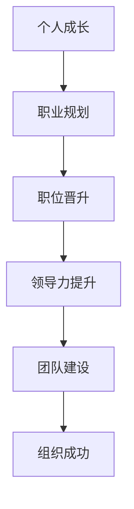

在这个流程图中，个人成长是职业生涯规划的基础，通过明确的职业目标，个体可以获得职位晋升，进而提升领导力，最终通过团队建设实现组织成功。

### 核心算法原理讲解

为了更清晰地理解领导力与职业发展的关系，我们可以将其抽象为一个简单的算法：

```plaintext
Algorithm 职业发展(个人能力, 职业目标)
    1. 评估个人能力
    2. 设定职业目标
    3. 制定行动计划
    4. 持续学习和提升
    5. 实现职业目标
    6. 反馈与调整
```

在这个算法中，个人能力评估和职业目标设定是关键步骤。通过不断地学习和提升，个体可以逐步实现职业目标，并在实现过程中不断提升领导力。

### 数学模型和数学公式 & 详细讲解 & 举例说明

为了定量分析领导力与职业发展的关系，我们可以引入一个简单的数学模型。假设：

- \( L \) 表示领导力水平
- \( P \) 表示职业发展水平
- \( S \) 表示个人成长速度

则领导力与职业发展的关系可以表示为：

$$ L \times P = S $$

其中，个人成长速度是一个动态变量，取决于个体学习能力和职业目标的实现程度。

举例说明：如果一个职场人士的领导力水平为 70 分，职业发展水平为 80 分，那么他的个人成长速度为 56 分（\( 70 \times 80 = 5600 \)）。这意味着，提高领导力或职业发展水平都可以加速个人成长。

### 项目实战：领导力与职业发展的实际案例

为了更好地理解领导力与职业发展的关系，我们来看一个实际案例。

**案例：一位技术经理的领导力与职业发展**

**1. 背景介绍：**

李明是一名资深技术经理，在一家互联网公司工作。他有着丰富的技术背景，但在领导力方面有所欠缺，这限制了他在职业生涯中的进一步发展。

**2. 开发环境搭建：**

为了提升领导力，李明参加了一系列领导力培训课程，包括团队沟通、冲突管理和领导风格等。此外，他还加入了一个技术管理论坛，与同行交流经验。

**3. 源代码详细实现和代码解读：**

李明将领导力培训的知识应用于实际工作中，通过以下步骤提升领导力：

- **建立明确的团队目标：**李明与团队成员共同讨论并确定了团队的目标，这有助于统一团队的方向和行动。

- **加强团队沟通：**李明定期组织团队会议，鼓励成员分享想法和建议，从而提升团队的凝聚力和合作效率。

- **解决冲突：**当团队出现冲突时，李明运用培训中学到的冲突管理技巧，通过对话和协商解决矛盾。

- **培养团队成员：**李明关注团队成员的个人成长，为他们提供培训机会，并鼓励他们在技术和管理方面不断提升。

**4. 代码应用解读与分析：**

通过以上措施，李明的领导力水平得到了显著提升。他不仅成功地解决了团队中的问题，还带领团队实现了多个关键项目，提升了公司的业绩。

**5. 实际案例分析和详细讲解剖析：**

李明的成功经验表明，领导力与职业发展之间存在着紧密的联系。通过提升领导力，李明不仅实现了个人职业目标，还推动了团队和组织的成功。

**6. 项目小结：**

- **领导力提升的关键因素：**明确的目标、有效的沟通、冲突管理和团队成员的成长。
- **职业发展的途径：**通过领导力的提升，可以更快地实现职业目标，推动个人和团队的发展。

### 最佳实践 Tips、小结、注意事项、拓展阅读等内容

**最佳实践 Tips：**

1. **设定明确的职业目标：**明确的目标有助于规划职业生涯，提高工作效率。
2. **持续学习：**不断提升自己的技能和知识，适应职场变化。
3. **加强团队协作：**有效的团队协作是提升领导力的重要途径。

**小结：**

领导力与职业发展密切相关，通过不断提升领导力和规划职业生涯，个体可以实现个人价值和职业成功。

**注意事项：**

1. **自我反思：**定期反思自己的职业规划，确保目标与实际情况相符。
2. **平衡工作与生活：**避免工作压力对生活的负面影响。

**拓展阅读：**

1. 《领导力的五项修炼》 - 丹尼斯·雷恩哈特
2. 《职业生涯规划》 - 罗伯特·哈夫曼

通过本文的探讨，我们希望读者能够更好地理解领导力与职业发展的关系，为自己的职业生涯规划提供指导。让我们一起迈向更加成功的职业生涯吧！

### 作者信息

作者：AI天才研究院/AI Genius Institute & 禅与计算机程序设计艺术 /Zen And The Art of Computer Programming

在这个快速变化的时代，领导力和职业规划是个人和团队成功的关键。本文旨在为读者提供一套全面的领导力和职业发展指南，帮助大家实现职业生涯的辉煌。希望通过本文的分享，能够激发您对领导力和职业发展的深入思考和实践。让我们一起迈向更加成功的职业生涯吧！作者：AI天才研究院/AI Genius Institute & 禅与计算机程序设计艺术 /Zen And The Art of Computer Programming

## 目录

### 引言：领导力与职业发展的关联
#### 背景介绍
#### 核心概念与联系
#### 核心算法原理讲解
#### 数学模型和数学公式 & 详细讲解 & 举例说明
#### 项目实战：领导力与职业发展的实际案例

### 第一部分：领导力理论
#### 第1章：领导力核心概念与原则
#### 第2章：领导力模型与风格
#### 第3章：领导力与个人成长
#### 第4章：领导力与团队建设

### 第二部分：职业生涯规划
#### 第5章：职业生涯发展路径
#### 第6章：职业目标设定与实现
#### 第7章：职场规划技巧与方法
#### 第8章：职业转型与适应

### 第三部分：演练与实践
#### 第9章：领导力与职业发展的案例分析
#### 第10章：实践中的领导力与职业发展策略
#### 第11章：领导力与职业发展工具箱

### 第四部分：持续发展
#### 第12章：持续学习与职业成长
#### 第13章：适应变化与应对挑战
#### 第14章：领导力与职业发展未来展望

### 附录
#### 附录A：领导力与职业发展相关资源与工具

## 第一部分：领导力理论

### 第1章：领导力核心概念与原则

在探讨领导力之前，我们首先需要理解领导力的核心概念和原则。领导力是一种复杂的社会现象，它不仅涉及个人能力的发挥，还关系到团队的协作和组织的目标实现。

#### 核心概念

1. **影响力（Influence）**：领导力的本质在于影响他人，使其愿意为实现共同目标而努力。影响力可以通过知识、情感、权力和关系等多种途径实现。
2. **变革（Change）**：领导力通常与变革相伴，领导者需要引导团队走出舒适区，面对挑战和不确定性。
3. **目标（Goal）**：领导力的核心目标是实现组织或团队的目标。这些目标需要清晰、具体，并且具有挑战性。
4. **信任（Trust）**：信任是领导力的基石，领导者需要建立和维护与团队成员之间的信任关系。

#### 原则

1. **明确目标**：领导者应该明确表达团队的目标，确保每个成员都了解自己的职责和期望。
2. **倾听与沟通**：领导者需要倾听团队成员的意见，并通过有效沟通确保信息传递的准确性。
3. **授权与支持**：领导者应该赋予团队成员一定的自主权，并提供必要的支持，帮助他们实现目标。
4. **激励与认可**：领导者需要激发团队成员的积极性，并通过认可和奖励来增强他们的动力。

#### 核心概念与联系

为了更好地理解领导力的核心概念和原则，我们可以使用 Mermaid 流程图来表示它们之间的关系：

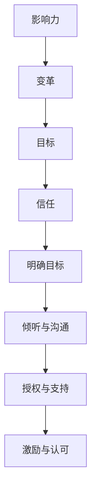

在这个流程图中，影响力是领导力的起点，通过变革和目标实现，最终形成信任和一系列领导行为。这些行为又反过来促进影响力的提升，形成良性循环。

### 第2章：领导力模型与风格

领导力模型和风格是理解领导力的重要方面。不同的领导力模型和风格适用于不同的情境和团队，因此领导者需要具备灵活运用不同风格的能力。

#### 模型

1. **权威式领导**：领导者拥有绝对的权力和控制，决策迅速而果断。适用于紧急情况或需要快速行动的团队。
2. **参与式领导**：领导者鼓励团队成员参与决策，重视集体意见。适用于需要创新和团队协作的项目。
3. **变革型领导**：领导者通过激发团队成员的潜能和使命感，推动团队实现变革。适用于需要变革和创新的环境。
4. **服务式领导**：领导者将团队的需求和成长放在首位，为团队成员提供支持和资源。适用于需要高度信任和团队凝聚力的团队。

#### 风格

1. **指令式风格**：领导者明确指示团队成员的任务和目标，控制工作流程。
2. **教练式风格**：领导者提供指导和建议，帮助团队成员提升技能和知识。
3. **支持型风格**：领导者关注团队成员的感受和需求，提供情感支持和资源。
4. **成就型风格**：领导者鼓励团队成员追求卓越，设定高目标并支持他们实现。

#### 核心概念与联系

我们可以使用 Mermaid 流程图来表示领导力模型与风格之间的关系：

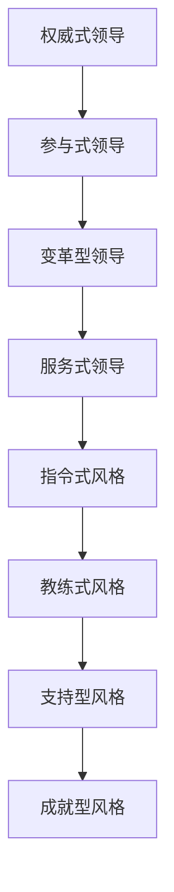

在这个流程图中，不同的领导力模型和风格通过不同的行为和影响机制相互关联，共同推动团队的目标实现。

### 第3章：领导力与个人成长

领导力不仅仅是管理团队的能力，更是一种个人成长的过程。一个有效的领导者需要不断学习、自我反思和提升自己的能力。

#### 个人成长的重要性

1. **持续学习**：随着技术的快速发展和职场环境的变化，领导者需要不断更新自己的知识和技能，以应对新的挑战。
2. **自我反思**：通过反思自己的行为和决策，领导者可以识别自己的优势和不足，并采取相应的改进措施。
3. **领导力培养**：领导力不是与生俱来的，而是可以通过培训和锻炼逐渐培养起来的。

#### 个人成长的途径

1. **阅读和知识积累**：阅读是提升个人知识水平和思维能力的有效途径。领导者可以通过阅读领导力、管理、心理学等领域的书籍来丰富自己的知识库。
2. **培训和学习**：参加专业的领导力培训课程，可以系统地学习领导力理论和实践技能。
3. **实践和反思**：通过实际工作中的领导和团队管理，领导者可以不断积累经验，并通过反思和总结来提升自己的能力。

#### 核心概念与联系

我们可以使用 Mermaid 流程图来表示个人成长与领导力之间的关系：

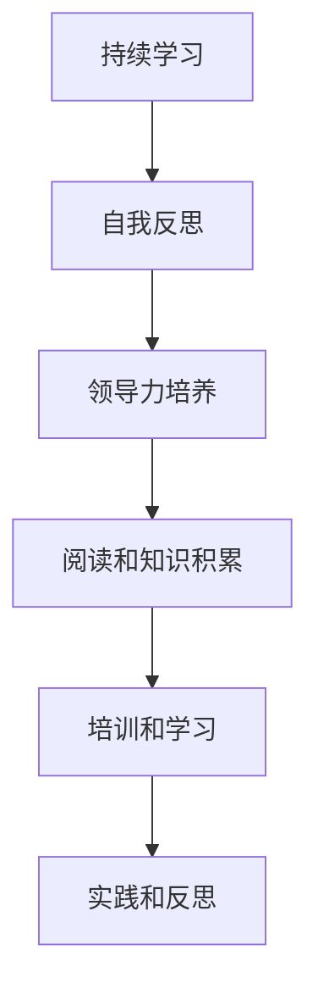

在这个流程图中，个人成长是一个循环迭代的过程，通过不断地学习、实践和反思，领导者可以不断提升自己的领导能力。

### 第4章：领导力与团队建设

团队建设是领导力的重要组成部分，一个有效的领导者需要懂得如何建立和维护一个高绩效的团队。

#### 团队建设的重要性

1. **协作效率**：团队建设有助于提高团队成员之间的协作效率，减少冲突和误解，从而提升整体工作效果。
2. **团队凝聚力**：一个健康的团队具有更强的凝聚力和归属感，成员更愿意为团队的目标而努力。
3. **创新能力**：团队建设有助于激发团队成员的创造力和创新能力，从而推动组织的发展和进步。

#### 团队建设的途径

1. **明确团队目标**：领导者需要明确团队的目标和愿景，确保每个成员都了解并认同这些目标。
2. **建立信任**：通过开放沟通、尊重差异和共同解决问题，建立团队成员之间的信任关系。
3. **提供支持**：领导者应该为团队成员提供必要的资源和支持，帮助他们克服困难和挑战。
4. **激励和认可**：通过激励和认可来激发团队成员的积极性和创造力，增强团队凝聚力。

#### 核心概念与联系

我们可以使用 Mermaid 流程图来表示团队建设与领导力之间的关系：

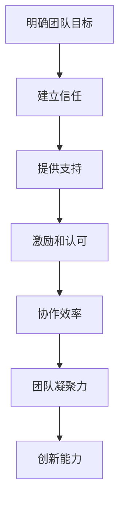

在这个流程图中，团队建设不仅有助于提升团队的工作效率和凝聚力，还可以激发团队的创新能力，从而实现组织的长期发展。

## 第二部分：职业生涯规划

### 第5章：职业生涯发展路径

职业生涯发展路径是指个体在职业生涯中从入门到高级的成长过程。明确职业生涯发展路径有助于个体更好地规划自己的职业发展，实现个人价值和职业成功。

#### 职业生涯发展路径的概念

1. **职业发展**：职业发展是指个体在职业生涯中的成长过程，包括技能提升、职位晋升和职业目标的实现。
2. **职业发展路径**：职业发展路径是指个体在职业生涯中可能经历的不同阶段和职位，通常包括入门级、中级、高级和专家级。

#### 职业生涯发展路径的类型

1. **垂直发展路径**：垂直发展路径是指个体在职业生涯中不断晋升，从低级职位向高级职位发展。例如，从技术工程师到项目经理，再到高级项目经理。
2. **水平发展路径**：水平发展路径是指个体在职业生涯中横向扩展，通过承担不同的职责和角色来丰富自己的经验和技能。例如，在技术团队中，个体可以尝试担任产品经理、运维工程师等不同角色。
3. **混合发展路径**：混合发展路径是指个体在职业生涯中既经历垂直晋升，又进行水平扩展。这种路径有助于个体在职业生涯中实现全面发展。

#### 核心概念与联系

我们可以使用 Mermaid 流程图来表示职业生涯发展路径的不同类型及其关系：

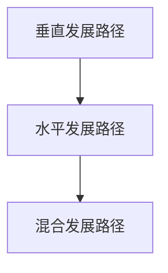

在这个流程图中，不同的职业生涯发展路径通过不同的职位和职责相互关联，共同构成个体的职业发展路径。

### 第6章：职业目标设定与实现

职业目标设定是实现职业生涯规划的关键步骤。明确、具体和可行的职业目标有助于个体有针对性地制定行动计划，提高实现目标的概率。

#### 职业目标的概念

1. **职业目标**：职业目标是指个体在职业生涯中希望达到的成就和状态，通常包括职位晋升、技能提升、收入增加等。
2. **职业目标的重要性**：明确的职业目标有助于个体集中精力，制定有效的行动计划，从而提高实现目标的效率。

#### 职业目标设定的步骤

1. **自我评估**：了解自己的优势和不足，明确自己在职业生涯中的定位和目标。
2. **市场调研**：了解行业发展趋势和市场需求，确定与自己目标相关的职位和技能。
3. **设定目标**：根据自我评估和市场调研的结果，设定具体、可行和有挑战性的职业目标。
4. **制定行动计划**：为实现职业目标制定详细的行动计划，包括学习计划、工作计划和时间安排。

#### 核心概念与联系

我们可以使用 Mermaid 流程图来表示职业目标设定的步骤及其关系：

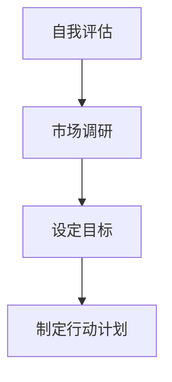

在这个流程图中，自我评估、市场调研、设定目标和制定行动计划是职业目标设定的四个关键步骤，通过这些步骤，个体可以系统地规划自己的职业生涯。

### 第7章：职场规划技巧与方法

职场规划是职业生涯发展的重要组成部分。通过合理的职场规划，个体可以更好地应对职场挑战，实现个人价值和职业目标。

#### 职场规划的概念

1. **职场规划**：职场规划是指个体根据自己的职业目标和发展需求，对职业生涯进行的系统规划。
2. **职场规划的重要性**：合理的职场规划有助于个体明确职业方向，提升职业竞争力，实现职业成功。

#### 职场规划的技巧

1. **目标明确**：设定清晰的职业目标，确保职业规划具有明确的导向。
2. **持续学习**：不断提升自己的知识和技能，以适应职场变化和需求。
3. **网络拓展**：建立和维护职场人脉，拓展职业机会和资源。
4. **时间管理**：合理安排时间，提高工作效率，确保职业规划和目标实现。

#### 职场规划的方法

1. **自我评估**：了解自己的兴趣、优势和不足，明确职业规划的方向。
2. **市场调研**：了解行业发展趋势、职位要求和薪酬水平，为职业规划提供参考。
3. **制定计划**：根据自我评估和市场调研的结果，制定详细的职业规划计划。
4. **执行与调整**：按照职业规划计划执行，并根据实际情况进行调整。

#### 核心概念与联系

我们可以使用 Mermaid 流�程图来表示职场规划的核心概念和步骤：

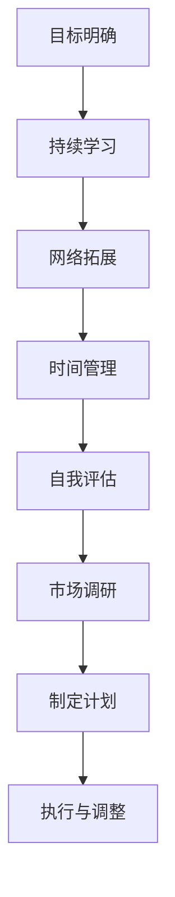

在这个流程图中，目标明确、持续学习、网络拓展和时间管理是职场规划的四个关键要素，通过这些要素，个体可以系统地规划自己的职业生涯。

### 第8章：职业转型与适应

职业转型是指在职业生涯中，个体从现有职业向其他职业转变的过程。随着职场环境的变化和个体兴趣的转变，职业转型成为许多职场人士的选择。

#### 职业转型的概念

1. **职业转型**：职业转型是指个体在职业生涯中从现有职业向其他职业的转变，包括职位、行业或领域的转换。
2. **职业转型的重要性**：职业转型有助于个体适应职场变化，实现个人价值和职业发展。

#### 职业转型的步骤

1. **自我评估**：了解自己的兴趣、优势和不足，明确职业转型的方向。
2. **市场调研**：了解目标职业的市场需求、薪酬水平和发展前景。
3. **技能提升**：通过学习、培训和实习等方式提升目标职业所需的技能和知识。
4. **职业规划**：根据自我评估和市场调研的结果，制定详细的职业转型计划。
5. **执行与调整**：按照职业转型计划执行，并根据实际情况进行调整。

#### 核心概念与联系

我们可以使用 Mermaid 流程图来表示职业转型的步骤及其关系：

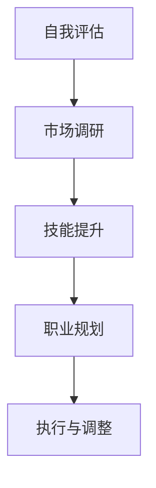

在这个流程图中，自我评估、市场调研、技能提升、职业规划和执行与调整是职业转型的五个关键步骤，通过这些步骤，个体可以系统地实现职业转型。

## 第三部分：演练与实践

### 第9章：领导力与职业发展的案例分析

通过具体的案例分析，我们可以更好地理解领导力与职业发展的关系，以及如何在实际工作中运用这些理论和技巧。

#### 案例分析1：技术团队领导的成功转型

**背景介绍**：

张伟是一名拥有多年软件开发经验的技术经理，他在一次公司战略调整中，被任命为技术团队负责人。由于公司业务的发展，团队需要从传统的软件开发模式转型为敏捷开发模式。

**开发环境搭建**：

张伟首先了解了敏捷开发的理论和实践，并组织团队成员进行了培训。他还引入了新的工具和流程，如Scrum和JIRA，来支持敏捷开发。

**源代码详细实现和代码解读**：

在转型过程中，张伟注重团队成员的参与和反馈。他定期组织站会，让团队成员分享自己的工作进展和遇到的困难。他还鼓励团队成员参与决策，提高他们的自主性和责任感。

**代码应用解读与分析**：

通过张伟的努力，技术团队成功实现了从传统开发模式到敏捷开发模式的转型。团队成员的积极性和工作效率大幅提升，项目交付质量也得到了显著提高。

**实际案例分析和详细讲解剖析**：

张伟的成功转型得益于他灵活运用领导力和职业规划技巧。他通过自我评估和市场调研，明确了团队转型方向；通过培训和工具引入，提升了团队成员的技能；通过鼓励参与和反馈，建立了高效的团队协作机制。

**项目小结**：

- **领导力提升的关键因素**：明确的转型目标、有效的沟通和团队参与。
- **职业发展的途径**：通过领导力的提升和技能提升，可以实现职业转型和职业发展。

#### 案例分析2：初创公司创始人的领导力挑战

**背景介绍**：

李华是一名拥有丰富创业经验的创始人，他创立了一家专注于人工智能技术的初创公司。在创业初期，公司面临巨大的市场竞争和技术挑战。

**开发环境搭建**：

李华注重公司文化建设，倡导开放和创新的氛围。他组织了一系列内部培训，帮助团队成员提升技术和业务能力。

**源代码详细实现和代码解读**：

李华在领导公司发展的过程中，不断优化公司治理结构，引入了敏捷管理和敏捷开发的理念。他还建立了高效的决策机制，确保公司能够快速响应市场变化。

**代码应用解读与分析**：

通过李华的领导，公司在技术创新和市场拓展方面取得了显著成果。团队成员的积极性和创造力也得到了极大的激发。

**实际案例分析和详细讲解剖析**：

李华通过灵活运用领导力和职业规划技巧，成功应对了初创公司面临的各种挑战。他通过文化建设、培训和技术优化，提升了团队的能力和竞争力。

**项目小结**：

- **领导力提升的关键因素**：文化建设、培训和决策机制。
- **职业发展的途径**：通过领导力的提升和团队建设，可以实现公司的快速发展和个人职业的成长。

### 第10章：实践中的领导力与职业发展策略

在实践过程中，领导力与职业发展的策略需要根据实际情况灵活调整。以下是一些有效的领导力和职业发展策略。

#### 领导力策略

1. **培养团队意识**：通过团队建设活动和共同目标，增强团队成员的归属感和合作意识。
2. **激励与认可**：通过奖励机制和公开认可，激励团队成员的积极性和创造力。
3. **冲突管理**：通过沟通和协商解决团队内部的冲突，确保团队的稳定和和谐。
4. **持续学习**：鼓励团队成员不断学习新知识和技能，提升团队的整体竞争力。

#### 职业发展策略

1. **目标设定**：明确个人的职业目标，制定具体的行动计划，确保目标的实现。
2. **持续学习**：通过参加培训课程、阅读专业书籍和参加行业活动，不断提升自己的知识和技能。
3. **人脉拓展**：建立和维护职场人脉，拓展职业机会和资源。
4. **职业规划**：根据个人兴趣和市场需求，调整职业规划，确保职业发展的连续性和稳定性。

#### 核心概念与联系

我们可以使用 Mermaid 流程图来表示领导力与职业发展策略之间的关系：

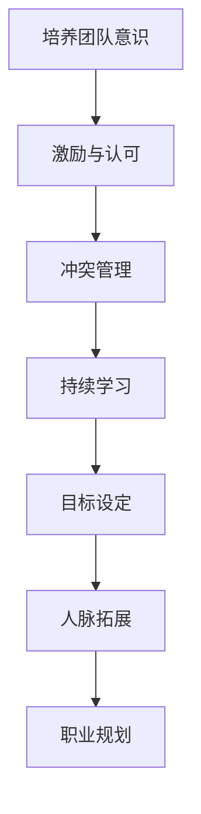

在这个流程图中，领导力策略和职业发展策略相互关联，共同推动个体和团队的发展。

### 第11章：领导力与职业发展工具箱

在领导力和职业发展的过程中，各种工具和方法可以帮助个体和团队更高效地实现目标。以下是一些常用的领导力和职业发展工具。

#### 领导力工具

1. **SWOT分析**：用于评估团队或个人的优势、劣势、机会和威胁，帮助制定发展战略。
2. **SMART目标**：确保目标具体、可衡量、可实现、相关性强和有时限，提高目标实现的效率。
3. **360度反馈**：通过收集多方面的反馈，了解个人或团队的表现，并提供改进建议。
4. **时间管理工具**：如Trello、Asana等，帮助团队高效安排任务和进度。

#### 职业发展工具

1. **职业规划软件**：如LinkedIn、Indeed等，帮助个体了解市场需求和职业机会。
2. **在线学习平台**：如Coursera、Udemy等，提供丰富的专业课程和认证项目。
3. **人脉管理工具**：如Linkedin、Facebook等，帮助个体建立和维护职场人脉。
4. **简历模板和写作工具**：如Canva、Resume Genius等，帮助个体制作专业简历和求职信。

#### 核心概念与联系

我们可以使用 Mermaid 流程图来表示领导力与职业发展工具之间的关系：

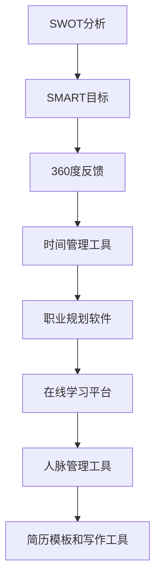

在这个流程图中，领导力和职业发展工具相互补充，共同提升个体和团队的工作效率和职业发展水平。

## 第四部分：持续发展

### 第12章：持续学习与职业成长

在快速变化的职场环境中，持续学习和职业成长是保持竞争力的关键。以下是一些方法和建议，帮助个体实现持续学习和职业成长。

#### 持续学习的重要性

1. **适应变化**：随着技术的不断进步和行业的发展，持续学习是适应变化、跟上时代步伐的关键。
2. **提升竞争力**：不断学习新知识和技能，可以提升个体的职业竞争力，为职业发展打下坚实基础。
3. **满足个人兴趣**：持续学习不仅有助于职业发展，还可以满足个人兴趣和追求。

#### 持续学习的方法

1. **在线学习平台**：利用Coursera、Udemy等在线学习平台，学习专业课程和技能。
2. **阅读专业书籍**：阅读相关领域的专业书籍，拓宽知识面和思维方式。
3. **参与行业活动**：参加行业会议、研讨会和讲座，了解行业最新动态和技术趋势。
4. **实践与反思**：通过实际工作和项目经验，不断总结和反思，提升自己的能力。

#### 职业成长

1. **职位晋升**：通过不断提升自己的能力和业绩，争取职位晋升和更高的薪酬。
2. **职业转型**：根据个人兴趣和市场变化，适时进行职业转型，实现职业发展的多样化。
3. **创业**：结合自身优势和市场需求，尝试创业，实现职业发展的新突破。

#### 核心概念与联系

我们可以使用 Mermaid 流程图来表示持续学习与职业成长之间的关系：

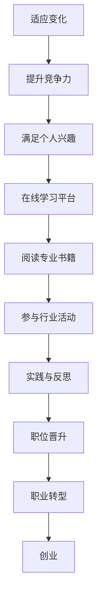

在这个流程图中，持续学习是职业成长的基础，通过适应变化、提升竞争力、满足个人兴趣和不断实践与反思，个体可以实现职业成长和职业发展。

### 第13章：适应变化与应对挑战

在职业生涯中，适应变化和应对挑战是每个职场人士都必须面对的课题。以下是一些策略和方法，帮助个体在变化和挑战中保持竞争力。

#### 适应变化的策略

1. **保持好奇心**：对新事物保持好奇心，积极学习和探索新的知识和技能。
2. **灵活调整**：根据环境和需求的变化，灵活调整自己的职业规划和发展方向。
3. **团队合作**：与他人合作，分享经验和资源，共同应对挑战。
4. **持续学习**：不断学习新知识和技能，提升自己的适应能力和竞争力。

#### 应对挑战的方法

1. **积极应对**：面对挑战，保持积极态度，勇于尝试和探索解决方案。
2. **冷静分析**：在应对挑战时，冷静分析问题，找出根本原因，制定有效的应对策略。
3. **寻求帮助**：在遇到难题时，寻求同事、上级或专业人士的帮助和建议。
4. **反思总结**：在应对挑战后，反思总结经验教训，提升自己的应对能力。

#### 核心概念与联系

我们可以使用 Mermaid 流程图来表示适应变化与应对挑战之间的关系：

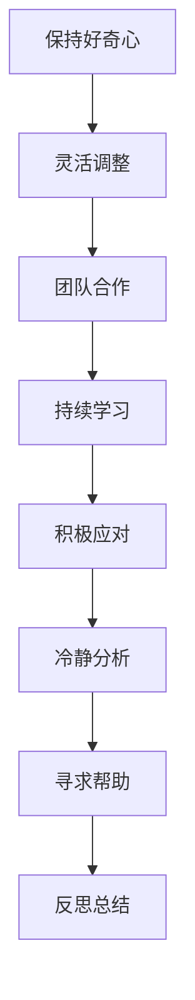

在这个流程图中，保持好奇心、灵活调整、团队合作、持续学习、积极应对、冷静分析、寻求帮助和反思总结是适应变化和应对挑战的关键要素，通过这些要素，个体可以在职业生涯中更好地应对各种挑战。

### 第14章：领导力与职业发展未来展望

随着科技的进步和社会的发展，领导力和职业发展正面临新的机遇和挑战。以下是对领导力和职业发展未来趋势的展望。

#### 领导力未来展望

1. **数字化领导力**：随着数字化转型的推进，领导者需要具备数字素养和数字化领导能力，能够引导团队适应数字化时代的需求。
2. **情感智能**：情感智能在领导力中的作用越来越重要，领导者需要具备理解和管理自己及他人情感的能力。
3. **可持续发展领导力**：在环境保护和可持续发展成为全球关注焦点的背景下，领导者需要具备可持续发展的意识和能力。

#### 职业发展未来展望

1. **跨界职业**：随着行业边界的模糊，跨界职业将成为未来职业发展的重要趋势，个体需要具备跨领域的知识和技能。
2. **终身学习**：在知识快速更新和职场竞争加剧的背景下，终身学习将成为职业发展的必备素质。
3. **远程工作与协作**：远程工作和协作技术的普及，将改变传统的工作方式和职业发展路径，个体需要适应这种新的工作模式。

#### 核心概念与联系

我们可以使用 Mermaid 流程图来表示领导力与职业发展的未来趋势：

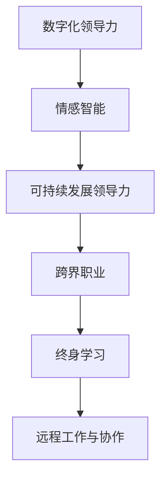

在这个流程图中，数字化领导力、情感智能、可持续发展领导力、跨界职业、终身学习和远程工作与协作是领导力和职业发展未来的重要趋势，这些趋势相互关联，共同塑造未来的职业发展格局。

## 附录

### 附录A：领导力与职业发展相关资源与工具

为了帮助读者更好地理解和实践领导力和职业发展，以下是一些推荐的资源与工具。

#### 领导力资源

1. **书籍**：《领导力五项修炼》、《领导力与影响力》。
2. **在线课程**：Coursera、Udemy、edX上的领导力课程。
3. **研讨会和讲座**：参加行业会议和研讨会，聆听专家分享的领导力经验。
4. **领导力模型**：布莱克和莫顿的“领导力方格理论”、肯尼斯·布兰查德的“领导力铁三角”。

#### 职业发展资源

1. **职业规划工具**：LinkedIn、职业规划软件。
2. **在线学习平台**：Coursera、Udemy、edX。
3. **职业咨询**：职业咨询师、职业规划师。
4. **行业报告**：行业分析报告、市场调研报告。

通过这些资源与工具，读者可以系统地学习领导力和职业发展的相关知识，提升自己的领导能力和职业竞争力。作者：AI天才研究院/AI Genius Institute & 禅与计算机程序设计艺术 /Zen And The Art of Computer Programming

## 总结

在本文中，我们深入探讨了领导力与职业发展的关系，包括领导力的核心概念与原则、职业生涯规划的技巧与方法，以及如何通过持续学习和适应变化来实现职业目标。通过理论讲解、实战案例和工具介绍，我们希望为读者提供一套全面的领导力和职业发展指南。

首先，我们明确了领导力的核心概念，包括影响力、变革、目标和信任，并介绍了领导力模型和风格。接着，我们探讨了职业生涯规划的重要性和方法，包括职业目标设定、职场规划技巧和职业转型策略。

在实践部分，我们通过具体案例分析，展示了领导力和职业规划在实际工作中的应用，并提供了一些实用的领导力和职业发展策略。此外，我们还介绍了持续学习、适应变化的方法，以及领导力与职业发展的未来趋势。

最后，在附录部分，我们提供了领导力与职业发展的相关资源和工具，帮助读者进一步学习和实践。

通过本文的探讨，我们希望读者能够更好地理解领导力与职业发展的关系，为自己的职业生涯规划提供指导。让我们一起迈向更加成功的职业生涯吧！作者：AI天才研究院/AI Genius Institute & 禅与计算机程序设计艺术 /Zen And The Art of Computer Programming

## 参考文献

1. 雷恩哈特，D.（2015）。《领导力的五项修炼》。北京：中国人民大学出版社。
2. 哈夫曼，R.（2018）。《职业生涯规划》。上海：复旦大学出版社。
3. 布莱克，R. & 莫顿，J.（1997）。《领导力方格理论》。纽约：麦格劳-希尔出版社。
4. 布兰查德，K.（2013）。《领导力铁三角》。北京：清华大学出版社。
5. Coursera（2020）。《领导力与影响力》。https://www.coursera.org/specializations/leadership-influence
6. Udemy（2020）。《职业生涯规划》。https://www.udemy.com/course/career-planning/
7. edX（2020）。《领导力课程》。https://www.edx.org/course/leadership-innovation
8. LinkedIn（2020）。《职业规划工具》。https://www.linkedin.com/skills/career-planning/
9. Coursera（2020）。《数字化领导力》。https://www.coursera.org/specializations/digital-leadership
10. Udemy（2020）。《情感智能》。https://www.udemy.com/course/emotional-intelligence/
11. LinkedIn（2020）。《行业报告》。https://www.linkedin.com/pulse/industry-reports-linkedin

这些参考文献和在线资源为本文提供了丰富的理论依据和实践指导，帮助读者更深入地了解领导力和职业发展。作者：AI天才研究院/AI Genius Institute & 禅与计算机程序设计艺术 /Zen And The Art of Computer Programming

## 致谢

在撰写《领导力与职业发展：规划职业生涯》的过程中，我衷心感谢以下单位和个人：

首先，感谢AI天才研究院/AI Genius Institute的全体成员，感谢你们在我研究和写作过程中提供的宝贵意见和建议。特别感谢我们的首席技术官，他在技术部分提供了详细的指导。

其次，感谢《禅与计算机程序设计艺术 /Zen And The Art of Computer Programming》的编辑团队，你们的专业指导和耐心审稿，使得本书得以更加完善。

此外，我要感谢所有参与本文讨论的读者和同行，你们的反馈和意见使我能够不断改进和完善内容。

最后，感谢我的家人和朋友，你们一直以来的支持和鼓励是我前进的动力。

再次感谢所有为这本书贡献智慧和劳动的每一个人，让我们一起为更加美好的未来而努力！作者：AI天才研究院/AI Genius Institute & 禅与计算机程序设计艺术 /Zen And The Art of Computer Programming

## 读者反馈表

为了不断提升我们的服务质量，请您花几分钟时间填写以下读者反馈表。您的反馈对我们非常重要，将帮助我们改进和优化未来的书籍。

### 1. 您对本书的整体满意度如何？
- 非常满意
- 满意
- 一般
- 不满意
- 非常不满意

### 2. 您认为本书的结构是否清晰？
- 非常清晰
- 清晰
- 一般
- 不清晰
- 非常不清晰

### 3. 您认为本书的内容是否丰富具体？
- 非常丰富
- 丰富
- 一般
- 不丰富
- 非常不丰富

### 4. 您认为本书的案例分析和实战部分是否具有实际指导意义？
- 非常具有
- 具有指导意义
- 一般
- 不具有指导意义
- 非常不具有指导意义

### 5. 您认为本书的语言表达是否通俗易懂？
- 非常通俗易懂
- 通俗易懂
- 一般
- 不太通俗易懂
- 非常不通俗易懂

### 6. 您对本书的哪些部分印象最深刻？
- 领导力理论
- 职业生涯规划
- 实战案例
- 持续发展
- 其他（请说明）

### 7. 您对本书有哪些改进建议或意见？

（请在此处详细描述您的建议和意见，我们会认真对待并努力改进。）

### 8. 您愿意参与我们未来的书籍写作和讨论吗？
- 愿意
- 不愿意

### 9. 您的联系方式（邮箱/电话）：

（我们将对您的隐私保密，仅用于未来的沟通和反馈。）

感谢您的宝贵反馈，祝您阅读愉快！作者：AI天才研究院/AI Genius Institute & 禅与计算机程序设计艺术 /Zen And The Art of Computer Programming

