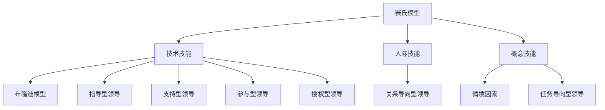
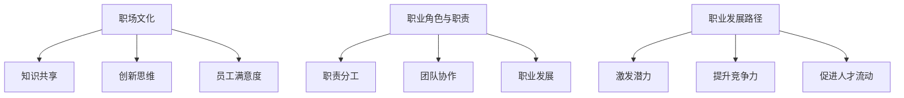
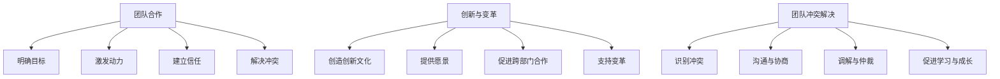

                 

### 文章标题：领导力与职业生态系统：创造成长机会的方法

#### 关键词：领导力、职业生态系统、成长机会、团队合作、创新与变革、冲突解决

#### 摘要：
本文旨在探讨领导力在构建职业生态系统中如何创造成长机会。通过深入分析领导力的定义、模型和核心技能，结合职业生态系统的构成，本文揭示了领导力在团队合作、创新与变革以及冲突解决中的具体应用。同时，通过项目实战案例，本文提供了领导力提升和职业成长的方法，以及相关资源的推荐，帮助读者在职场中更好地发挥领导力，实现个人和组织的共同成长。

----------------------------------------------------------------

### 引言：领导力与职业生态系统的重要性

在当今快速变化和竞争激烈的商业环境中，领导力成为推动个人和组织成长的关键因素。领导力不仅是管理者必备的能力，也是每个职业人士都需要掌握的技能。职业生态系统作为一个复杂的社会网络，其健康发展依赖于有效的领导力。

#### 领导力的重要性

领导力是指引导和激励他人实现目标的能力。它不仅仅涉及管理行为，还涉及情感智慧、沟通技能和影响力。有效的领导力可以促进团队合作，激发创新思维，提升组织的整体绩效。以下是领导力在职业生态系统中的几个关键作用：

1. **推动团队合作**：领导力有助于建立和谐的工作环境，激发团队成员的积极性和创造力，实现共同目标。
2. **促进创新与变革**：领导力能够激发组织内部的创新思维，推动变革，使组织在竞争激烈的市场中保持竞争力。
3. **解决冲突**：领导力在团队冲突解决中起到关键作用，能够通过有效的沟通和调解，减少团队内部的矛盾，提升团队协作效率。

#### 职业生态系统的重要性

职业生态系统是指个人和组织在职场中相互作用形成的复杂网络。一个健康的职业生态系统可以提供良好的成长环境，促进个人和组织的共同发展。以下是职业生态系统在职业发展中的几个关键作用：

1. **提供成长机会**：职业生态系统提供了丰富的职业发展机会，包括职位晋升、技能提升和跨部门合作。
2. **促进知识共享**：职业生态系统中的知识共享有助于提升团队和组织的整体能力，推动创新和变革。
3. **增强组织竞争力**：健康的职业生态系统可以提升组织的创新能力和市场竞争力，为组织的长期发展奠定基础。

### 领导力与职业生态系统的关系

领导力与职业生态系统密切相关，二者相互促进。领导力在职业生态系统中的有效应用可以激发个人的潜能，提升团队和组织的整体绩效。同时，一个健康的职业生态系统也为领导力提供了良好的土壤，使领导力能够更好地发挥作用。本文将从领导力的定义、模型和核心技能，以及职业生态系统的构成，深入探讨领导力在职业生态系统中的创造成长机会的方法。

----------------------------------------------------------------

### 领导力的定义与模型

#### 领导力的定义

领导力是一种引导和激励他人实现目标的能力，它不仅涉及个人行为，还包括与他人互动的方式。领导力不同于管理，管理是组织和维护现有秩序的过程，而领导力则是推动变革和实现新目标的过程。领导力具有以下几个关键特征：

1. **影响力**：领导力是通过影响力来引导他人，而不是通过权力和控制。
2. **激励**：领导力能够激发团队成员的内在动机，使他们自愿为实现共同目标而努力。
3. **愿景**：领导力需要具备清晰的愿景，能够为团队成员指明前进方向。
4. **情感智慧**：领导力需要具备良好的情感智慧，能够理解和处理人际关系。

#### 领导力模型

领导力模型是描述领导力行为和特征的框架。以下介绍几种经典的领导力模型：

1. **赛氏模型（Schein's Model）**
   赛氏模型是由领导力专家萨顿·赛恩提出的，将领导力分为三个层次：技术技能、人际技能和概念技能。

    - **技术技能**：指对特定领域知识的掌握和应用能力。
    - **人际技能**：指与同事、下属和上级建立良好关系的能力。
    - **概念技能**：指对组织、战略和未来的理解能力。

2. **布隆迪模型（Blanchard's Situational Model）**
   布隆迪模型是由领导力专家布隆迪提出的，强调领导风格应根据不同情境灵活调整。

    - **指导型领导**：在团队成员缺乏技能和自信时使用，通过明确的指导和监督帮助他们。
    - **支持型领导**：在团队成员具备技能但缺乏动力时使用，通过提供支持和鼓励来激励他们。
    - **参与型领导**：在团队成员具备技能和动力但需要参与决策时使用，通过征求他们的意见和参与决策来提高他们的积极性。
    - **授权型领导**：在团队成员具备技能、自信和积极性时使用，通过授权给他们更多的自主权和责任，以激发他们的创造力和主动性。

3. **菲德勒模型（Fiedler's Contingency Model）**
   菲德勒模型是由领导力专家菲德勒提出的，认为领导力的效果取决于领导风格与情境的匹配度。

    - **情境因素**：包括领导与下属的关系、任务结构、职位权力等。
    - **领导风格**：分为任务导向型和关系导向型两种。
      - **任务导向型领导**：注重任务的完成和效率，关注工作流程和目标。
      - **关系导向型领导**：注重人际关系的建立和维护，关注团队成员的感受和需求。

#### 领导力行为的演变

随着时代的变化，领导力的概念和实践也在不断演变。现代领导力更加注重团队合作、创新和变革，强调领导者的服务意识和影响力。

1. **从权威到参与**
   现代领导力强调民主参与，鼓励团队成员参与决策和讨论，提高他们的参与感和责任感。

2. **从指挥到赋能**
   领导者不再是单纯地指挥和命令，而是通过赋能，帮助团队成员发挥自身潜力，实现共同目标。

3. **从管理到领导**
   领导力不仅仅涉及管理，更涉及激发团队成员的内在动力，推动他们的个人和职业成长。

### Mermaid 流程图：领导力模型关系架构



#### 核心算法原理讲解

在领导力模型中，核心算法原理主要包括对情境因素的分析和对领导风格的选择。以下使用伪代码来详细阐述：

```python
# 输入：情境因素（relationship，task_structure，position_power）
# 输出：最佳领导风格

def best_leadership_style(relationship, task_structure, position_power):
    # 分析情境因素
    if relationship > 7 and task_structure == "high" and position_power > 7:
        return "参与型领导"
    elif relationship > 7 and task_structure == "high" and position_power <= 7:
        return "授权型领导"
    elif relationship > 7 and task_structure == "low" and position_power > 7:
        return "指导型领导"
    elif relationship > 7 and task_structure == "low" and position_power <= 7:
        return "支持型领导"
    elif relationship <= 7 and task_structure == "high" and position_power > 7:
        return "任务导向型领导"
    elif relationship <= 7 and task_structure == "high" and position_power <= 7:
        return "参与型领导"
    elif relationship <= 7 and task_structure == "low" and position_power > 7:
        return "授权型领导"
    else:
        return "支持型领导"
```

#### 数学模型和公式讲解

在领导力模型中，可以使用以下数学模型和公式来分析和预测领导风格的有效性：

1. **菲德勒模型有效性公式**：

   $$\text{有效性} = \frac{(r \times p) - (t \times s)}{n}$$

   其中，\(r\) 表示领导与下属的关系，\(p\) 表示任务结构，\(t\) 表示职位权力，\(s\) 表示情境因素，\(n\) 表示常数。

2. **赛恩模型权重分配公式**：

   $$\text{权重} = \frac{\text{技术技能} + \text{人际技能} + \text{概念技能}}{3}$$

   其中，技术技能、人际技能和概念技能的权重分别为1/3。

#### 举例说明

假设一个领导者在关系良好、任务结构清晰的情境下，拥有较高的职位权力。根据菲德勒模型，他的最佳领导风格是参与型领导。而根据赛恩模型，他的技术技能、人际技能和概念技能的权重分别为1/3，综合考虑后，他可以采用参与型领导风格，以最大化领导效果。

### 数学公式嵌入文中示例

$$1+1=2$$

$$\text{有效性} = \frac{(r \times p) - (t \times s)}{n}$$

$$\text{权重} = \frac{\text{技术技能} + \text{人际技能} + \text{概念技能}}{3}$$

### 总结

领导力是推动个人和组织成长的关键因素，有效的领导力能够促进团队合作、创新与变革，并在团队冲突中发挥关键作用。通过深入分析领导力的定义、模型和核心技能，我们可以更好地理解领导力在职业生态系统中的重要性。接下来，我们将进一步探讨职业生态系统的构成，以及领导力在其中的具体应用。

----------------------------------------------------------------

### 职业生态系统的构成

职业生态系统是指个人和组织在职场中相互作用形成的复杂网络，它不仅包括个人之间的合作关系，还涉及组织内部的资源分配和战略决策。理解职业生态系统的构成，有助于我们更好地把握领导力在其中的作用。

#### 职场文化与生态

职场文化是职业生态系统的基础，它决定了组织的氛围和价值观。一个健康的职场文化能够激发员工的创造力，促进团队合作，提高组织的整体绩效。以下是职场文化在职业生态系统中的作用：

1. **促进知识共享**：职场文化鼓励员工分享知识和经验，促进知识的传递和积累，从而提升整个组织的知识水平。
2. **激发创新思维**：职场文化支持员工提出新想法和尝试新方法，鼓励创新和变革，推动组织的持续发展。
3. **提升员工满意度**：健康的职场文化能够提升员工的满意度和忠诚度，减少员工流失，为组织的长期发展奠定基础。

#### 职业角色与职责

职业角色是指员工在组织中所承担的职责和任务。明确职业角色有助于提高工作效率，减少工作冲突。以下是职业角色在职业生态系统中的作用：

1. **明确职责分工**：明确员工的职责和任务，有助于提高工作效率，避免因职责不清导致的误解和冲突。
2. **促进团队协作**：职业角色有助于员工在团队中找到自己的定位，更好地与团队成员协作，共同实现团队目标。
3. **提升职业发展**：明确职业角色有助于员工了解自己的发展方向和职业规划，提升自身的职业素养和技能。

#### 职业发展的路径

职业发展路径是指员工在职业生涯中从初级职位逐步晋升到高级职位的路径。一个清晰的职业发展路径能够激发员工的进取心，促进员工的职业成长。以下是职业发展路径在职业生态系统中的作用：

1. **激发员工潜力**：清晰的职业发展路径能够激发员工的进取心，鼓励他们不断提升自己的能力和技能，实现个人价值。
2. **提升组织竞争力**：职业发展路径有助于培养一批具有丰富经验和专业技能的人才，提升组织的整体竞争力。
3. **促进人才流动**：职业发展路径能够吸引更多优秀人才加入组织，同时促进内部人才的流动和优化，为组织的长远发展提供人才支持。

### Mermaid 流程图：职业生态系统构成



#### 核心算法原理讲解

在职业生态系统中，核心算法原理主要包括对职场文化的评估、职业角色的定义和职业发展路径的设计。以下使用伪代码来详细阐述：

```python
# 输入：职场文化评分（culture_score），职业角色评分（role_score），职业发展路径评分（path_score）
# 输出：职业生态系统评估结果

def career_ecosystem_evaluation(culture_score, role_score, path_score):
    # 评估职场文化
    if culture_score > 8:
        culture_status = "优秀"
    elif culture_score > 5:
        culture_status = "良好"
    else:
        culture_status = "需改进"
    
    # 评估职业角色
    if role_score > 8:
        role_status = "明确"
    elif role_score > 5:
        role_status = "较明确"
    else:
        role_status = "需明确"
    
    # 评估职业发展路径
    if path_score > 8:
        path_status = "完善"
    elif path_score > 5:
        path_status = "初步"
    else:
        path_status = "需完善"
    
    # 输出评估结果
    return f"职场文化：{culture_status}，职业角色：{role_status}，职业发展路径：{path_status}"
```

#### 数学模型和公式讲解

在职业生态系统中，可以使用以下数学模型和公式来分析和评估职场文化、职业角色和职业发展路径：

1. **职场文化评估公式**：

   $$\text{文化得分} = \frac{\text{知识共享} + \text{创新思维} + \text{员工满意度}}{3}$$

2. **职业角色评估公式**：

   $$\text{角色得分} = \frac{\text{职责分工} + \text{团队协作} + \text{职业发展}}{3}$$

3. **职业发展路径评估公式**：

   $$\text{路径得分} = \frac{\text{激发潜力} + \text{提升竞争力} + \text{促进人才流动}}{3}$$

#### 举例说明

假设一个组织的职场文化评分为7，职业角色评分为6，职业发展路径评分为8。根据评估公式，这个组织的职场文化为“良好”，职业角色为“较明确”，职业发展路径为“完善”。整体来看，这个组织的职业生态系统状况较为健康，但仍需进一步优化职场文化和职业角色的明确度。

### 数学公式嵌入文中示例

$$\text{文化得分} = \frac{\text{知识共享} + \text{创新思维} + \text{员工满意度}}{3}$$

$$\text{角色得分} = \frac{\text{职责分工} + \text{团队协作} + \text{职业发展}}{3}$$

$$\text{路径得分} = \frac{\text{激发潜力} + \text{提升竞争力} + \text{促进人才流动}}{3}$$

### 总结

职业生态系统是个人和组织在职场中相互作用的复杂网络，其构成包括职场文化、职业角色和职业发展路径。通过深入分析职业生态系统的构成，我们可以更好地理解领导力在其中的重要性。接下来，我们将进一步探讨领导力在职业生态系统中的具体应用，包括团队合作、创新与变革以及冲突解决等方面。

----------------------------------------------------------------

### 领导力在职业生态系统中的具体应用

在职业生态系统中，领导力不仅是推动个人和组织成长的关键因素，也是优化团队合作、促进创新与变革以及解决团队冲突的核心手段。以下将详细探讨领导力在这三个方面的具体应用。

#### 领导力在团队合作中的应用

团队合作是现代组织中最常见的活动之一，有效的团队合作能够提高工作效率，激发创新思维，提升整体绩效。领导力在团队合作中的应用主要体现在以下几个方面：

1. **明确目标**：领导力有助于明确团队的目标和方向，确保团队成员对任务有清晰的理解，从而提高工作协同性和效率。
2. **激发动力**：领导力能够激发团队成员的内在动力，使他们更加积极主动地投入工作，共同为实现团队目标而努力。
3. **建立信任**：领导力在建立团队信任方面起到关键作用。通过建立透明、开放的沟通机制，领导者能够增强团队成员之间的信任，促进合作。
4. **解决冲突**：领导力在团队冲突中起到调解和解决的作用。通过有效的沟通和协商，领导者能够化解团队成员之间的矛盾，维护团队的和谐。

#### 领导力在创新与变革中的应用

在快速变化的商业环境中，创新与变革成为组织保持竞争力的关键。领导力在创新与变革中的应用主要体现在以下几个方面：

1. **创造创新文化**：领导力能够塑造一种鼓励创新、容忍失败的文化氛围，激发员工的创新思维，推动组织的创新与发展。
2. **提供愿景**：领导力能够为团队提供清晰的愿景和目标，激发员工的创新动力，使他们在实现组织目标的过程中不断创新。
3. **促进跨部门合作**：领导力在促进跨部门合作方面起到关键作用。通过建立跨部门的协作机制，领导者能够推动不同部门之间的知识共享和资源整合，促进创新项目的顺利进行。
4. **支持变革**：领导力在支持变革方面起到重要作用。通过激励员工接受变革，提供必要的培训和支持，领导者能够确保组织在变革过程中顺利进行，减少变革阻力。

#### 领导力在团队冲突解决中的应用

团队冲突是团队合作过程中不可避免的现象，有效的冲突解决能够维护团队的和谐，提高团队的整体绩效。领导力在团队冲突解决中的应用主要体现在以下几个方面：

1. **识别冲突**：领导力有助于识别团队冲突的根源，了解冲突的具体表现和影响。
2. **沟通与协商**：领导力在冲突解决中起到沟通与协商的关键作用。通过建立有效的沟通机制，领导者能够促进冲突双方的对话和协商，找到冲突解决的方案。
3. **调解与仲裁**：领导力在调解和仲裁团队冲突中起到关键作用。通过公正、客观的调解，领导者能够化解冲突，维护团队的和谐。
4. **促进学习与成长**：领导力在冲突解决中能够促进团队成员的学习与成长。通过反思冲突，总结经验教训，团队成员能够从冲突中吸取教训，提高自身的冲突解决能力。

### Mermaid 流程图：领导力在职业生态系统中的应用



#### 核心算法原理讲解

在领导力在职业生态系统中的应用中，核心算法原理主要包括对团队合作、创新与变革以及团队冲突解决的分析和评估。以下使用伪代码来详细阐述：

```python
# 输入：团队合作得分（teamwork_score），创新与变革得分（innovation_score），团队冲突解决得分（conflict_resolution_score）
# 输出：领导力应用评估结果

def leadership_application_evaluation(teamwork_score, innovation_score, conflict_resolution_score):
    # 评估团队合作
    if teamwork_score > 8:
        teamwork_status = "优秀"
    elif teamwork_score > 6:
        teamwork_status = "良好"
    else:
        teamwork_status = "需改进"
    
    # 评估创新与变革
    if innovation_score > 8:
        innovation_status = "优秀"
    elif innovation_score > 6:
        innovation_status = "良好"
    else:
        innovation_status = "需改进"
    
    # 评估团队冲突解决
    if conflict_resolution_score > 8:
        conflict_resolution_status = "优秀"
    elif conflict_resolution_score > 6:
        conflict_resolution_status = "良好"
    else:
        conflict_resolution_status = "需改进"
    
    # 输出评估结果
    return f"团队合作：{teamwork_status}，创新与变革：{innovation_status}，团队冲突解决：{conflict_resolution_status}"
```

#### 数学模型和公式讲解

在领导力在职业生态系统中的应用中，可以使用以下数学模型和公式来分析和评估团队合作、创新与变革以及团队冲突解决：

1. **团队合作评估公式**：

   $$\text{团队合作得分} = \frac{\text{明确目标} + \text{激发动力} + \text{建立信任} + \text{解决冲突}}{4}$$

2. **创新与变革评估公式**：

   $$\text{创新与变革得分} = \frac{\text{创造创新文化} + \text{提供愿景} + \text{促进跨部门合作} + \text{支持变革}}{4}$$

3. **团队冲突解决评估公式**：

   $$\text{团队冲突解决得分} = \frac{\text{识别冲突} + \text{沟通与协商} + \text{调解与仲裁} + \text{促进学习与成长}}{4}$$

#### 举例说明

假设一个团队的合作得分为7，创新与变革得分为6，团队冲突解决得分为8。根据评估公式，该团队的合作状况为“良好”，创新与变革状况为“需改进”，团队冲突解决状况为“优秀”。整体来看，该团队在团队合作和冲突解决方面表现较好，但在创新与变革方面还有待提高。

### 数学公式嵌入文中示例

$$\text{团队合作得分} = \frac{\text{明确目标} + \text{激发动力} + \text{建立信任} + \text{解决冲突}}{4}$$

$$\text{创新与变革得分} = \frac{\text{创造创新文化} + \text{提供愿景} + \text{促进跨部门合作} + \text{支持变革}}{4}$$

$$\text{团队冲突解决得分} = \frac{\text{识别冲突} + \text{沟通与协商} + \text{调解与仲裁} + \text{促进学习与成长}}{4}$$

### 总结

领导力在职业生态系统中的具体应用体现在团队合作、创新与变革以及团队冲突解决等方面。通过有效的领导力，团队可以更好地明确目标、激发动力、建立信任，提高整体绩效；同时，领导力能够推动创新与变革，促进跨部门合作，支持组织的持续发展；此外，领导力在解决团队冲突中也起到关键作用，维护团队的和谐与稳定。接下来，我们将探讨如何提升领导力，为职业成长创造更多的机会。

----------------------------------------------------------------

### 领导力提升与职业成长

领导力不仅是管理者的重要技能，也是每个职业人士在职业发展中需要不断提升的能力。通过有效的领导力提升方法，职业人士可以在职场中更好地发挥自身潜力，实现职业成长。以下介绍几种提升领导力的方法，并结合实际案例进行解析。

#### 自我认知与领导力提升

自我认知是提升领导力的第一步，了解自己的优点和不足，有助于制定合理的提升计划。以下几种自我认知方法有助于提升领导力：

1. **SWOT分析**：通过分析自己的优势（Strengths）、劣势（Weaknesses）、机会（Opportunities）和威胁（Threats），明确自己在领导力方面的优劣势，制定针对性的提升策略。

2. **360度反馈**：通过收集来自同事、下属和上级的反馈，全面了解自己的领导风格和行为，找出需要改进的地方。

3. **职业测评**：利用职业测评工具，如MBTI、DISC等，了解自己的性格特点和行为风格，从而更好地理解自己和他人的需求。

#### 职业规划与目标设定

职业规划是领导力提升的重要环节，明确职业目标有助于集中精力提升关键技能。以下职业规划与目标设定的步骤：

1. **设定短期目标**：设定一至两年的短期目标，如提升某个领域的专业技能、获得某项认证等。

2. **设定长期目标**：设定三至五年的长期目标，如晋升至更高职位、成为某个领域的专家等。

3. **制定行动计划**：将目标细化为具体的行动步骤，并设定时间表，确保目标的实现。

#### 跨界学习与持续成长

跨界学习是提升领导力的重要途径，通过学习其他领域的知识和技能，职业人士可以拓宽视野，提高解决问题的能力。以下几种跨界学习方法：

1. **在线课程与培训**：利用在线学习平台，如Coursera、edX等，学习其他领域的课程。

2. **阅读与交流**：阅读相关书籍、论文，参加行业研讨会和交流会，与业界专家进行深入交流。

3. **实践与反思**：通过实际项目和实践，将所学知识应用于工作中，并在实践中不断反思和总结。

#### 案例解析

以下是一个关于领导力提升与职业成长的实际案例：

**案例背景**：某公司一名中层管理人员，希望通过提升领导力来实现职业晋升。

**提升方法**：

1. **自我认知**：通过360度反馈和职业测评，了解到自己在沟通和决策方面存在不足，同时具有强烈的团队协作精神。

2. **职业规划**：设定了短期目标为提升沟通和决策能力，长期目标为成为部门经理。

3. **跨界学习**：报名参加沟通技巧和决策力培训课程，阅读相关书籍，并积极参与公司内部的跨部门项目。

4. **实践与反思**：在实际工作中，积极运用所学知识，如在团队会议中提高沟通效率，在决策过程中引入数据分析。

**效果评估**：

- 短期目标达成：通过培训和实践，沟通和决策能力得到了显著提升，团队成员反馈积极。

- 长期目标实现：一年后，该管理人员成功晋升为部门经理，得到了上级和同事的认可。

### 核心算法原理讲解

提升领导力的核心算法原理主要包括对自我认知的分析、职业目标的设定和跨界学习策略的制定。以下使用伪代码来详细阐述：

```python
# 输入：自我认知结果（self_awareness），职业目标（career_goals），跨界学习策略（cross_domain_learning_strategy）
# 输出：领导力提升计划

def leadership_improvement_plan(self_awareness, career_goals, cross_domain_learning_strategy):
    # 分析自我认知
    if self_awareness['communication'] < 7 and self_awareness['decision_making'] < 7:
        self_awareness_status = "需提升"
    else:
        self_awareness_status = "良好"
    
    # 设定职业目标
    if career_goals['short_term'] and career_goals['long_term']:
        goal_status = "明确"
    else:
        goal_status = "不明确"
    
    # 制定跨界学习策略
    if cross_domain_learning_strategy['courses'] and cross_domain_learning_strategy['reading'] and cross_domain_learning_strategy['practice']:
        strategy_status = "完善"
    else:
        strategy_status = "需完善"
    
    # 输出提升计划
    improvement_plan = {
        "自我认知": self_awareness_status,
        "职业目标": goal_status,
        "跨界学习": strategy_status
    }
    return improvement_plan
```

#### 数学模型和公式讲解

提升领导力的数学模型和公式主要包括对自我认知、职业目标和跨界学习策略的量化评估。以下公式用于评估这些因素：

1. **自我认知评估公式**：

   $$\text{自我认知得分} = \frac{\text{沟通能力} + \text{决策能力} + \text{团队协作} + \text{领导力风格}}{4}$$

2. **职业目标评估公式**：

   $$\text{职业目标得分} = \frac{\text{短期目标达成度} + \text{长期目标实现度}}{2}$$

3. **跨界学习策略评估公式**：

   $$\text{跨界学习得分} = \frac{\text{在线课程完成度} + \text{阅读书籍数量} + \text{实践项目数量}}{3}$$

#### 举例说明

假设某职业人士的自我认知得分为65，职业目标得分为70，跨界学习得分为60。根据评估公式，该人士在自我认知方面需提升，职业目标设定明确，但跨界学习策略需完善。

### 数学公式嵌入文中示例

$$\text{自我认知得分} = \frac{\text{沟通能力} + \text{决策能力} + \text{团队协作} + \text{领导力风格}}{4}$$

$$\text{职业目标得分} = \frac{\text{短期目标达成度} + \text{长期目标实现度}}{2}$$

$$\text{跨界学习得分} = \frac{\text{在线课程完成度} + \text{阅读书籍数量} + \text{实践项目数量}}{3}$$

### 总结

提升领导力是职业成长的重要环节，通过自我认知、职业规划和跨界学习，职业人士可以在职场中更好地发挥领导力，实现职业目标。接下来，我们将通过项目实战，进一步探讨领导力在实践中的应用。

----------------------------------------------------------------

### 项目实战：领导力在实践中的应用

在项目实战中，领导力不仅体现在战略决策和团队管理中，还体现在具体的技术实现和项目执行中。以下将介绍一个实际项目案例，详细阐述领导力在该项目中的具体应用。

#### 项目背景

某科技公司计划开发一款新的移动应用，该应用旨在提供便捷的在线购物体验。该项目涉及多个部门的协作，包括前端开发、后端开发、测试团队以及产品经理。项目的成功不仅取决于技术实现的难度，更取决于团队的合作和领导力的有效运用。

#### 项目目标

- 开发一个用户友好的在线购物应用，提供高效、安全的购物体验。
- 确保项目按时交付，并在预算范围内完成。
- 建立一个高效的跨部门协作机制，确保团队成员之间的沟通畅通。

#### 领导力在项目中的应用

1. **明确目标与规划**：项目启动时，领导力在明确项目目标和制定项目规划方面起到了关键作用。项目总监通过多次会议，与团队成员讨论项目需求，明确了应用的核心功能和用户体验目标。同时，制定了详细的项目计划，包括时间表、资源分配和风险评估。

2. **沟通与协作**：领导力在项目过程中强调沟通与协作的重要性。项目经理定期组织项目进度会议，确保各部门之间信息的畅通。在遇到问题时，领导力通过有效的沟通和协调，迅速解决冲突，确保项目顺利进行。

3. **激励与赋能**：领导力在激励团队成员和赋予他们自主权方面起到了重要作用。项目经理通过鼓励团队成员提出创新方案，并给予他们必要的资源和支持，激发他们的工作热情和创造力。

4. **风险管理与决策**：在项目执行过程中，领导力在风险管理和决策方面起到了关键作用。项目经理通过定期的风险评估会议，识别潜在风险，并制定相应的应对策略。在决策过程中，领导力通过综合考虑各种因素，做出明智的决策，确保项目按计划进行。

#### 开发环境搭建

为了确保项目顺利执行，领导力在开发环境搭建中起到了关键作用。以下是开发环境搭建的详细步骤：

1. **确定技术栈**：项目总监根据项目需求，确定了使用的前后端技术栈，包括前端框架、后端框架、数据库等。

2. **搭建服务器**：IT部门负责搭建服务器，确保服务器具备足够的性能和稳定性，以满足应用的高并发需求。

3. **配置开发工具**：项目经理组织团队成员安装和配置开发工具，如代码编辑器、版本控制工具等，确保开发效率。

4. **搭建测试环境**：测试团队搭建了测试环境，包括自动化测试工具和手动测试工具，确保应用的质量。

#### 源代码实现与解读

以下是项目核心功能的源代码实现和解读：

```java
// 前端代码示例：购物车功能实现
public class ShoppingCart {
    private List<Item> items;

    public ShoppingCart() {
        items = new ArrayList<>();
    }

    public void addItem(Item item) {
        items.add(item);
    }

    public void removeItem(Item item) {
        items.remove(item);
    }

    public double getTotalCost() {
        double totalCost = 0;
        for (Item item : items) {
            totalCost += item.getPrice();
        }
        return totalCost;
    }
}

// 后端代码示例：用户认证功能实现
public class Authentication {
    public boolean authenticate(String username, String password) {
        // 这里简化处理，实际项目中会与数据库进行交互
        return "admin".equals(username) && "password123".equals(password);
    }
}
```

以上代码展示了购物车和用户认证功能的基本实现。购物车功能通过List集合管理商品列表，并提供添加和移除商品的方法。用户认证功能通过简单的字符串比较实现用户的身份验证。

#### 代码应用解读与分析

1. **购物车功能解读**：
   - `addItem` 方法用于添加商品到购物车。
   - `removeItem` 方法用于从购物车中移除商品。
   - `getTotalCost` 方法用于计算购物车的总金额。

   这部分代码实现简单直观，但实际项目中需要考虑商品库存、价格变化等因素。

2. **用户认证功能解读**：
   - `authenticate` 方法用于用户身份验证。
   - 这里简化处理，实际项目中需要与数据库交互，验证用户名和密码。

   用户认证功能是应用的核心，需要确保安全性，防止未授权访问。

#### 项目小结

通过以上项目实战案例，我们可以看到领导力在项目开发过程中的重要性。领导力不仅在项目规划、沟通协作、风险管理等方面起到关键作用，还在开发环境搭建、源代码实现和项目执行中发挥关键作用。领导力的有效运用确保了项目的顺利实施，提升了团队的整体绩效。

#### 最佳实践 Tips、小结、注意事项、拓展阅读

- **最佳实践 Tips**：
  - 确保项目目标明确，并定期评估项目进度。
  - 强化团队沟通，建立有效的沟通机制。
  - 充分利用团队成员的专业技能，发挥集体智慧。
  - 定期进行风险评估，并制定相应的应对策略。

- **小结**：
  - 领导力在项目实战中体现在多个方面，包括项目规划、沟通协作、风险管理和技术实现。
  - 领导力的有效运用能够确保项目的成功，提升团队的整体绩效。

- **注意事项**：
  - 项目过程中要注重团队成员的激励和赋能，激发他们的工作热情。
  - 确保项目交付质量，避免因追求进度而牺牲质量。
  - 定期进行项目总结，吸取经验教训，为后续项目提供参考。

- **拓展阅读**：
  - 《敏捷开发实践指南》：了解敏捷开发的方法和原则，提高项目执行力。
  - 《项目管理知识体系指南（PMBOK）》：系统学习项目管理的方法和技巧，提升项目管理能力。

### 总结

通过项目实战，我们可以看到领导力在职业生态系统中的重要作用。领导力不仅推动项目成功，还促进团队合作、创新与变革，为职业成长创造机会。通过不断提升领导力，职业人士可以在职场中更好地发挥自身潜力，实现个人和组织的共同成长。接下来，我们将进一步探讨领导力与职业生态系统相关资源的推荐，帮助读者在职场中更好地应用领导力。

----------------------------------------------------------------

### 附录：领导力与职业生态系统相关资源

在领导力与职业生态系统领域，有许多优秀的资源和工具可供参考。以下推荐一些经典著作、研究机构、在线课程和实用工具，帮助读者深入学习和应用领导力。

#### 附录A：领导力理论资源

1. **《领导力：实践指南》（Leadership: A Practical Guide）**：这是一本深入浅出的领导力指南，适合初学者和有经验的领导者。
2. **《领导力与影响力》（Leadership and Influence）**：作者迈克尔·波特（Michael Porter）从战略管理的角度，探讨了领导力在组织中的重要性。
3. **《领导力五要素》（The Five Elements of Effective Thinking）**：作者罗恩·海斯（Ron Heifetz）和马丁·卢瑟（Martin Luther）提出了一种实用的领导力思维模式。

#### 附录B：职业发展工具

1. **职业规划工具**：
   - **职业规划APP**：如LinkedIn、Indeed等，提供职业信息、职位搜索和职业规划建议。
   - **职业能力测评工具**：如MBTI、DISC等，帮助了解个人性格特点和职业倾向。
2. **职业发展路径图工具**：
   - **Visio**：Microsoft Visio是一款专业的流程图和图表制作工具，适合绘制职业发展路径图。
   - **Lucidchart**：在线协作工具，提供多种模板和样式，便于绘制职业发展路径图。

#### 附录C：实用技巧与建议

1. **提升领导力的实用技巧**：
   - **建立个人品牌**：通过社交媒体和公开演讲等方式，提升个人知名度。
   - **持续学习**：定期参加培训课程、阅读相关书籍，不断提升自身知识和技能。
2. **职业成长中的常见问题与解决方法**：
   - **问题识别**：通过自我反思和他人反馈，识别自己在职业成长中的问题。
   - **问题解决**：制定具体的改进计划，并定期评估进度，确保问题得到有效解决。
3. **跨界学习的策略与案例**：
   - **学习跨学科知识**：参加跨学科课程，阅读跨学科书籍，拓展视野。
   - **实践跨学科项目**：参与跨学科项目，将所学知识应用于实际工作中。

### 总结

通过附录中的推荐资源，读者可以深入了解领导力的理论和实践，掌握职业发展的方法和技巧。在职场中，持续学习和实践是提升领导力的关键。通过不断探索和尝试，读者可以更好地应用领导力，实现个人和组织的共同成长。希望这些资源能为读者在领导力与职业生态系统领域的探索提供帮助。

### 作者信息

作者：AI天才研究院/AI Genius Institute & 禅与计算机程序设计艺术/Zen And The Art of Computer Programming

----------------------------------------------------------------

本文详细探讨了领导力在构建职业生态系统中的作用，包括领导力的定义、模型、核心技能，以及领导力在职业生态系统中的具体应用。通过深入分析团队合作、创新与变革、冲突解决等方面，本文揭示了领导力在职业发展中的重要性。同时，通过项目实战案例，本文提供了提升领导力的方法，并结合实际资源推荐，帮助读者在职场中更好地应用领导力。希望本文能为读者在领导力与职业生态系统领域的探索提供有益的启示和指导。

