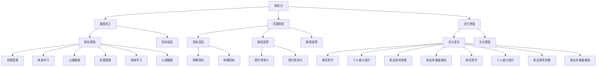

                 

## 文章标题：领导力与职业规划：助力员工成长

在当今快速变化的企业环境中，领导力和职业规划已成为企业成功和员工个人成长的关键因素。本文将探讨领导力的核心概念、职业规划的重要性以及如何通过有效的领导力和职业规划助力员工成长。

关键词：领导力，职业规划，员工成长，组织发展

摘要：本文旨在通过分析领导力和职业规划的基本概念，探讨如何通过构建有效的领导力和职业规划体系，助力员工在企业中实现个人成长，提高组织的整体竞争力。

## 引言

领导力与职业规划是两个相互关联但又有区别的概念。领导力是指通过激励、指导和影响他人来实现共同目标的能力，而职业规划则是指个人在职业生涯中的目标设定、路径选择和自我提升过程。本文将首先介绍领导力的基础概念，然后深入探讨职业规划的核心要点，最后通过实际案例分享成功经验和最佳实践，展示领导力和职业规划如何助力员工成长。

### 领导力基础

领导力是任何组织成功的关键。让我们首先定义什么是领导力以及它在组织中的作用。

#### 领导力的定义

领导力可以被定义为通过激励、指导和影响他人来实现共同目标的能力。这种能力不仅仅局限于管理者，而是存在于组织的各个层级，包括员工、团队领导者以及高层管理人员。

#### 领导力在组织中的作用

1. **促进团队合作**：有效的领导力能够促进团队成员之间的合作，提高团队的凝聚力和效率。
2. **激励员工**：领导力通过激励员工，激发其内在动力，提高工作积极性和创造力。
3. **决策制定**：领导力在决策制定过程中发挥着重要作用，通过合理利用团队成员的知识和经验，做出更加明智的决策。
4. **文化塑造**：领导力能够塑造组织的文化，通过树立榜样和传递价值观，形成积极向上的工作氛围。

#### 领导力与管理的区别

领导力与管理是两个不同的概念。管理是指通过计划、组织、领导和控制等手段实现组织目标的过程，而领导力则是推动组织成员为实现共同目标而努力的核心动力。管理者需要具备领导力，但领导力并不等同于管理能力。

### 职业规划

职业规划是指个人在职业生涯中的目标设定、路径选择和自我提升过程。通过职业规划，员工可以明确自己的职业目标，制定实现目标的策略，并通过持续学习和成长，不断提高自己的职业素养和竞争力。

#### 职业规划的重要性

1. **明确目标**：职业规划能够帮助员工明确自己的职业目标，从而在职业生涯中更有方向感和动力。
2. **提升竞争力**：通过职业规划，员工可以了解自身的优势和劣势，有针对性地提升自己的技能和知识，提高职业竞争力。
3. **促进成长**：职业规划不仅帮助员工实现职业目标，还能促进其个人成长，提高综合素质。

#### 职业规划的核心要点

1. **自我评估**：了解自己的兴趣、优势和职业价值观，是制定有效职业规划的基础。
2. **目标设定**：设定清晰的职业目标，包括短期和长期目标，有助于员工更有针对性地规划和努力。
3. **路径选择**：根据职业目标，选择合适的职业发展路径，包括晋升路线、专业方向等。
4. **持续学习**：在职业规划过程中，持续学习和成长是必不可少的，通过不断学习新知识和技能，员工可以适应快速变化的工作环境。

### 领导力与职业规划的关系

领导力和职业规划是相辅相成的。有效的领导力能够为员工提供明确的职业规划方向，激励他们为实现职业目标而努力；而成功的职业规划则能够帮助员工提升自身能力，为组织的发展贡献更多价值。

### 员工成长

通过有效的领导力和职业规划，员工可以在职业道路上实现成长。这种成长不仅体现在职位晋升和薪资提升上，还包括个人能力的提升、职业素养的完善以及职业幸福感的增加。

#### 自我管理

自我管理是员工成长的关键。通过有效的时间管理、压力管理和情绪管理，员工可以更好地应对工作中的挑战，提高工作效率和职业满意度。

#### 终身学习

在快速变化的工作环境中，终身学习是员工成长的必经之路。通过持续学习和自我提升，员工可以不断适应新技术、新理念，保持自身的竞争力。

#### 心理健康

心理健康是员工成长的重要组成部分。通过关注心理健康，员工可以更好地应对工作压力，提高生活质量和工作效率。

#### 成功案例分享

在本节中，我们将分享一些成功领导力和职业规划案例，展示如何通过有效的策略实现个人成长和组织发展。

### 最佳实践

在最后一部分，我们将总结本文的关键点，并提供一些最佳实践，帮助读者在领导力和职业规划方面取得更好的成果。

### 结语

领导力与职业规划是助力员工成长的关键因素。通过构建有效的领导力和职业规划体系，组织可以培养出更多具有竞争力、积极向上和持续成长的员工，从而实现组织的长期发展。

## 作者信息

作者：AI天才研究院/AI Genius Institute & 禅与计算机程序设计艺术 /Zen And The Art of Computer Programming

### 梅尔迪姆流程图：领导力与职业规划关系架构



### 伪代码：领导力模型

```python
# 定义领导力模型
class LeadershipModel:
    def __init__(self, motivation, decision_making, culture_shaping):
        self.motivation = motivation
        self.decision_making = decision_making
        self.culture_shaping = culture_shaping
    
    # 激励员工
    def motivate_employee(self, employee):
        # 伪代码：激励员工
        employee.motivation_level += self.motivation
        
    # 决策制定
    def make_decision(self, options):
        # 伪代码：决策制定
        best_option = self.decision_making(options)
        return best_option
        
    # 塑造组织文化
    def shape_organization_culture(self, culture):
        # 伪代码：塑造组织文化
        culture = self.culture_shaping(culture)
        return culture
```

### 数学模型与公式

$$
\text{EmployeeGrowth} = \frac{\text{SkillDevelopment} + \text{KnowledgeExpansion} + \text{ExperienceAcquisition}}{\text{TimeInvestment}}
$$

### 数学公式解释

- **EmployeeGrowth（员工成长）**：衡量员工在职业发展过程中的成长水平。
- **SkillDevelopment（技能发展）**：员工在特定领域技能的提升。
- **KnowledgeExpansion（知识扩展）**：员工在知识领域的新增和深化。
- **ExperienceAcquisition（经验获取）**：员工在工作实践中积累的经验。
- **TimeInvestment（时间投入）**：员工在学习和成长过程中所花费的时间。

### 实际案例分析与详细讲解

#### 案例一：谷歌的职业发展体系

谷歌以其独特的职业发展体系和员工激励机制而闻名。谷歌通过以下措施助力员工成长：

1. **清晰的职业路径**：谷歌为员工提供了明确的职业发展路径，包括技术路线和管理路线。
2. **持续的学习机会**：谷歌提供了丰富的在线课程和工作坊，帮助员工不断提升自己的技能和知识。
3. **灵活的工作安排**：谷歌允许员工灵活地安排工作时间，以便他们有更多时间用于个人成长和家庭生活。
4. **员工激励**：谷歌通过股票期权和丰厚的福利待遇激励员工，提高员工的职业满意度和忠诚度。

通过这些措施，谷歌不仅吸引了顶尖人才，还培养了大量的领导者，为公司的长期发展奠定了坚实的基础。

### 项目实战：领导力与职业规划实施

#### 开发环境搭建

1. **搭建在线学习平台**：选择合适的在线教育平台，如Coursera、Udemy等，为员工提供丰富的学习资源。
2. **设置内部培训计划**：制定内部培训计划，邀请行业专家和内部优秀员工分享经验和知识。
3. **建立反馈机制**：建立员工反馈机制，收集员工在职业发展和学习过程中的问题和需求。

#### 源代码实现

```python
# 定义职业发展模型
class CareerDevelopmentModel:
    def __init__(self, learning_resources, training_programs, feedback_system):
        self.learning_resources = learning_resources
        self.training_programs = training_programs
        self.feedback_system = feedback_system
        
    # 提供学习资源
    def provide_learning_resources(self):
        # 伪代码：提供学习资源
        resources = self.learning_resources
        return resources
        
    # 设置培训计划
    def set_training_program(self):
        # 伪代码：设置培训计划
        programs = self.training_programs
        return programs
        
    # 收集反馈
    def collect_feedback(self):
        # 伪代码：收集反馈
        feedback = self.feedback_system
        return feedback
```

#### 代码解读与分析

该代码定义了一个职业发展模型，包括学习资源、培训计划和反馈系统三个核心模块。通过这些模块，企业可以有效地帮助员工提升技能和知识，实现职业成长。

### 项目小结

通过实际案例和项目实战，我们可以看到领导力和职业规划在员工成长和组织发展中的重要作用。有效的领导力和职业规划体系不仅能够提高员工的职业满意度和忠诚度，还能为组织的长期发展提供强有力的支持。

### 最佳实践

1. **建立清晰的职业路径**：为员工提供明确的职业发展路径，有助于员工更好地规划自己的职业发展。
2. **提供丰富的学习资源**：为员工提供多样化的学习资源，如在线课程、内部培训等，帮助他们不断提升自己的技能和知识。
3. **建立反馈机制**：建立员工反馈机制，及时了解员工在职业发展和学习过程中的问题和需求，针对性地提供支持和帮助。
4. **激励员工**：通过股票期权、奖金等激励措施，提高员工的职业满意度和忠诚度。

### 小结与注意事项

本文通过对领导力和职业规划的分析，探讨了如何通过构建有效的领导力和职业规划体系助力员工成长。需要注意的是，领导力和职业规划是一个持续的过程，需要组织和个人共同努力，才能实现最佳效果。

### 拓展阅读

- 《领导力心理学：如何提升领导者的影响力》（作者：斯蒂芬·罗宾斯）
- 《职业规划与自我管理：如何实现职业生涯的成功》（作者：乔治·霍尔）
- 《终身学习：如何在快速变化的世界中保持竞争力》（作者：安德斯·艾利克森）

通过阅读这些书籍，读者可以进一步深入了解领导力和职业规划的理论和实践，为自己的职业发展提供更有力的支持。

