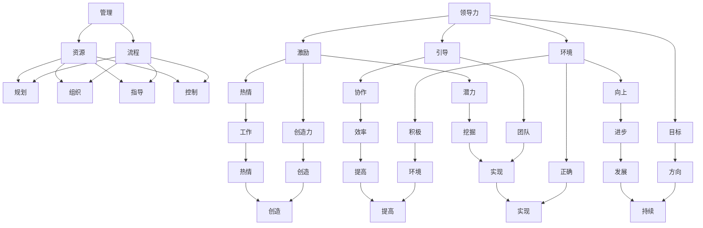

                 

### 文章标题：领导力与职业规划：助力员工成长的方法

> 关键词：领导力、职业规划、员工成长、激励、培训

> 摘要：本文将深入探讨领导力与职业规划在员工成长中的关键作用。我们将通过分析领导力的核心概念、技能和实践方法，揭示其在团队建设和员工激励中的重要性。同时，文章将阐述职业规划的理论基础、制定与实施策略，并探讨如何通过培训和职业发展路径分析助力员工实现职业目标。最终，本文将总结最佳实践，为企业和领导者提供有效的领导力与职业规划指导。

----------------------------------------------------------------

### 引言

在当今快速变化和竞争激烈的商业环境中，领导力和职业规划成为企业和个人成功的关键因素。领导力不仅关乎如何管理团队和达成目标，更关乎如何激励员工、培养团队精神，从而推动整体业绩的提升。职业规划则是员工个人发展的基石，通过科学的规划与实施，可以明确职业目标，提升自身能力，实现职业生涯的持续进步。

本文旨在通过系统地分析领导力与职业规划的核心概念、理论和实践方法，为企业和员工提供实用的指导。文章将从领导力的核心概念与联系、重要技能和实践方法入手，深入探讨领导力在团队建设和员工激励中的重要作用。随后，文章将转向职业规划，分析其理论基础、制定与实施策略，以及如何通过职业发展路径分析助力员工成长。最后，本文将总结最佳实践，为企业和领导者提供有效的领导力与职业规划指导。

### 领导力与职业规划的关系

领导力和职业规划在员工成长中具有紧密的联系。首先，领导力为职业规划提供了方向和支持。有效的领导力能够激发员工的潜力，帮助他们明确职业目标，规划职业生涯。领导者在团队中的作用不仅体现在管理和决策层面，更在于为员工提供指导和支持，帮助他们克服职业发展中的障碍。

职业规划则为领导力提供了具体的实践路径。通过科学的职业规划，员工能够明确自身的职业目标和发展方向，领导者可以据此制定相应的激励和培养策略，确保员工的成长与企业发展同步。此外，职业规划还包括对职业发展的评估和调整，这需要领导者的支持和指导，确保员工能够在正确的时间采取正确的行动。

综上所述，领导力和职业规划相互促进，共同助力员工成长。领导力为职业规划提供了方向和动力，而职业规划则为领导力提供了实践路径和目标。通过两者的有机结合，企业和员工可以实现共赢，推动企业持续发展。

### 第一部分：领导力

#### 第1章 领导力的核心概念与联系

在探讨领导力之前，我们需要了解其核心概念与联系。领导力并非简单的管理能力，而是一种能够激励和引导他人共同实现目标的综合能力。首先，我们来看一下领导力的定义与重要性。

#### 1.1 领导力的定义与重要性

领导力是一种影响力，它不仅关乎领导者的个人魅力，更关乎其能否有效地激励、引导和协调团队成员。在组织中，领导力的重要性体现在以下几个方面：

- **激发员工潜力**：有效的领导力能够挖掘员工的潜力，激发他们的工作热情和创造力。
- **推动团队协作**：领导力能够促进团队成员之间的协作，形成团队合力，提高整体效率。
- **实现组织目标**：领导力是组织目标实现的关键因素，它能够确保团队朝着正确的方向前进。

接下来，我们来看一下领导力与管理的区别。

#### 1.2 领导力与管理的区别

虽然领导力和管理经常被提到一起，但它们实际上是两个不同的概念。管理主要关注的是组织的运营和流程，而领导力则更注重激励和引导团队成员。具体来说：

- **管理**：管理侧重于规划、组织、指导和控制资源，以确保组织目标的实现。
- **领导力**：领导力则侧重于激励和引导团队成员，创造一个积极向上的工作环境。

为了更好地理解领导力的概念，我们引入一个Mermaid流程图，展示领导力与管理的联系和区别。

通过这个流程图，我们可以清晰地看到领导力与管理之间的关系和区别。领导力不仅是管理的一部分，更是一种激励和引导团队成员的能力。

#### 1.3 领导力模型概述

领导力模型是理解领导力的重要工具，它帮助我们分析领导行为、领导风格以及领导效果。以下是几种常见的领导力模型：

- **特质领导理论**：认为领导者具有独特的个性特质，如自信、正直和决断力。
- **行为领导理论**：关注领导者的行为和领导风格，如任务导向型领导、关系导向型领导。
- **情境领导理论**：认为领导行为应根据具体情境进行调整，如高任务-低关系领导、高任务-高关系领导。

每种领导力模型都有其独特的优势和适用场景，领导者可以根据实际情况选择合适的领导风格和策略。

#### 小结

在本章中，我们探讨了领导力的核心概念与联系。通过定义领导力的核心概念，我们理解了领导力在团队建设和员工激励中的重要性。接着，我们分析了领导力与管理的区别，并介绍了几种常见的领导力模型。这些理论为我们后续探讨领导力的具体实践提供了基础。

----------------------------------------------------------------

#### 第2章 领导力的重要技能

领导力不仅仅是一种抽象的概念，它需要通过具体的技能和行动来体现。在本章中，我们将探讨领导力的几个关键技能：沟通技能、决策技能和领导风格与团队建设。

#### 2.1 沟通技能

沟通是领导力的核心要素之一，它决定了领导者能否有效地传递信息、理解团队成员的需求和情感，并建立良好的关系。以下是几种有效的沟通技能：

##### 2.1.1 有效沟通的原则

- **倾听**：倾听是沟通的基础，领导者需要倾听团队成员的意见和需求，理解他们的情感和观点。
- **清晰表达**：领导者需要清晰、准确地表达自己的意图和期望，避免模糊和误解。
- **开放式提问**：开放式提问可以帮助领导者更深入地了解团队成员的想法和需求，促进双向沟通。
- **非语言沟通**：领导者需要注意自己的肢体语言、面部表情和声音语调，这些非语言沟通方式可以强化口头表达的效果。

##### 2.1.2 沟通障碍与解决方法

尽管我们遵循有效沟通的原则，但在实际沟通中仍然会遇到各种障碍。以下是几种常见的沟通障碍及其解决方法：

- **信息过载**：当信息量过大时，人们容易感到困惑和疲劳。解决方法是简化信息，突出关键点，避免冗余。
- **文化差异**：不同文化背景的人在沟通时可能会产生误解。解决方法是尊重文化差异，学习并适应不同的沟通方式。
- **情绪干扰**：情绪波动会影响沟通的效果。解决方法是管理自己的情绪，保持冷静和理性。

##### 2.1.3 案例分析

例如，在一次项目讨论会上，团队成员A提出了一个创新的想法，但其他成员对此表示怀疑。此时，领导者应该积极倾听A的意见，并使用开放式提问来深入了解其想法的细节。同时，领导者需要清晰表达自己的观点，解释为什么其他成员的担忧是合理的。通过这种方式，领导者可以缓解团队内部的紧张情绪，促进有效的沟通。

#### 2.2 决策技能

决策是领导者的一项重要职责，它决定了团队的方向和目标。以下是几种有效的决策技能：

##### 2.2.1 决策的类型与过程

决策可以分为两种类型：程序化决策和非程序化决策。

- **程序化决策**：针对重复出现的问题，领导者可以制定固定的决策流程和规则，快速作出决策。
- **非程序化决策**：针对新出现或复杂的问题，领导者需要进行分析和评估，制定合适的决策。

决策过程通常包括以下几个步骤：

1. **问题识别**：确定需要解决的问题或挑战。
2. **信息收集**：收集与问题相关的信息和数据。
3. **方案生成**：提出可能的解决方案。
4. **方案评估**：评估每个方案的优势和劣势。
5. **决策制定**：选择最佳的方案。
6. **实施和监控**：执行决策并监控实施效果。

##### 2.2.2 决策失误与预防

尽管决策过程是系统化的，但领导者仍然可能会犯错误。以下是一些常见的决策失误及其预防方法：

- **信息不足**：决策时缺乏充分的信息。解决方法是加强信息收集和分析，确保决策基于可靠的数据。
- **过度自信**：过于依赖自己的经验和直觉。解决方法是开展头脑风暴，邀请团队成员参与决策过程，多元化意见。
- **群体思维**：团队成员盲目跟随领导者或多数意见。解决方法是鼓励批判性思维，尊重不同意见，进行充分讨论。

##### 2.2.3 案例分析

在一个公司的扩张项目中，领导者需要决定是否在新的市场投入大量资源。通过分析市场趋势、竞争对手情况、公司资源和风险等因素，领导者可以制定一个全面的决策方案。在决策过程中，领导者应该避免依赖单一信息源，而是综合考虑各种因素，确保决策的全面性和准确性。

#### 2.3 领导风格与团队建设

领导风格是领导者行为和态度的体现，它对团队氛围和绩效有重要影响。以下是几种常见的领导风格：

- **权威型领导**：领导者集中决策权，对团队成员要求严格。适用于需要快速决策和执行的任务。
- **民主型领导**：领导者鼓励团队成员参与决策，尊重成员的意见和建议。适用于需要创新和协作的任务。
- **支持型领导**：领导者关注团队成员的需求和情感，提供支持和鼓励。适用于需要高度心理安全感的环境。

##### 2.3.1 领导风格的分类与特点

每种领导风格都有其独特的特点和适用场景。领导者可以根据团队的需求和任务类型选择合适的领导风格。

- **权威型领导**：优点是决策迅速，执行力强；缺点是可能导致团队成员依赖性强，缺乏自主性。
- **民主型领导**：优点是激发团队成员的创造力和主动性；缺点是决策过程较长，可能影响执行效率。
- **支持型领导**：优点是提升团队成员的满意度和工作积极性；缺点是可能导致团队决策效率下降。

##### 2.3.2 团队建设的方法与策略

团队建设是领导力的重要组成部分，它关乎团队的整体协作和绩效。以下是几种有效的团队建设方法：

- **共同目标**：确保团队成员有共同的目标和愿景，增强团队的凝聚力。
- **沟通与协作**：建立有效的沟通机制，鼓励团队成员之间的协作和互助。
- **培训与发展**：为团队成员提供培训和发展机会，提升团队整体能力。
- **激励与奖励**：设立合理的激励机制，奖励团队成员的成就和贡献。

##### 2.3.3 案例分析

在一个研发团队中，领导者采用民主型领导风格，鼓励团队成员参与项目决策，并根据团队成员的特长和兴趣分配任务。通过定期的团队会议和项目评审，领导者确保团队成员之间的沟通和协作，同时提供培训和发展机会，提升团队整体能力。这种领导风格和团队建设方法显著提高了项目的成功率和团队的满意度。

#### 小结

在本章中，我们探讨了领导力的几个关键技能：沟通技能、决策技能和领导风格与团队建设。通过分析有效沟通的原则、决策类型与过程，以及不同领导风格的特点和应用，领导者可以更好地应对团队管理和员工激励的挑战。这些技能和策略不仅有助于提升团队绩效，还能促进员工的个人成长和职业发展。

----------------------------------------------------------------

#### 第3章 职业规划的制定与实施

职业规划是员工个人发展的关键步骤，它有助于明确职业目标、提升专业技能，并实现职业生涯的持续进步。本节将详细介绍职业规划的重要性、个人职业兴趣与能力评估、以及职业目标设定与实施策略。

#### 3.1 职业规划的重要性

职业规划对于员工个人和组织的成功都至关重要。首先，对于员工个人而言，职业规划有助于明确职业目标，提高工作满意度，减少职业迷茫感。通过设定明确的职业目标，员工可以更有针对性地提升自身能力，规划学习和发展路径，从而实现职业成长和晋升。其次，对于组织而言，职业规划有助于提高员工的工作动力和忠诚度，降低员工流失率，同时确保组织拥有一个稳定和持续发展的专业人才队伍。

#### 3.2 个人职业兴趣与能力评估

个人职业兴趣与能力评估是制定科学职业规划的基础。以下是一些评估方法和工具：

- **职业兴趣测试**：通过职业兴趣测试，员工可以了解自己在哪些领域具有兴趣和潜力。常见的测试包括霍兰德职业兴趣测试（Holland Code）和Myers-Briggs职业性格测试（MBTI）。
- **技能评估**：通过技能评估，员工可以了解自己在特定领域的技能水平和能力。技能评估可以通过自我评估、同事评价和第三方评估工具进行。
- **360度反馈**：通过360度反馈，员工可以获得来自不同角度的评价，包括上司、同事和下属。这种评估方法可以帮助员工全面了解自己的职业形象和技能发展需求。

#### 3.3 职业目标设定与实施策略

在明确个人职业兴趣与能力评估结果后，员工可以开始设定具体的职业目标。以下是一些设定职业目标的步骤和实施策略：

##### 3.3.1 设定职业目标的步骤

1. **确定长期职业目标**：长期职业目标通常是3-5年甚至更长远的时间段。员工可以根据自己的职业兴趣和能力评估结果，设定一个符合自身发展的职业方向。例如，成为一名项目经理或高级分析师。
2. **分解目标**：将长期目标分解为短期目标和里程碑。短期目标通常是1-2年的时间段，而里程碑则是实现目标的关键节点。通过设定短期目标和里程碑，员工可以更有条理地规划职业发展路径。
3. **制定行动计划**：为每个短期目标和里程碑制定具体的行动计划，明确需要采取的行动、时间表和责任人。

##### 3.3.2 实施策略

1. **持续学习与培训**：为了实现职业目标，员工需要不断提升自己的技能和知识。参加相关培训课程、获取专业证书和参与行业交流都是有效的学习途径。
2. **寻求导师指导**：寻找一位经验丰富的导师，可以帮助员工在职业发展过程中提供指导和支持。导师可以分享自己的经验和见解，帮助员工避免职业发展中的常见误区。
3. **积极沟通与反馈**：与上司和同事保持积极沟通，定期获取工作反馈。这不仅有助于员工了解自己的职业发展状况，还能及时调整职业目标和行动计划。
4. **灵活调整**：职业发展是一个动态的过程，员工需要根据市场变化和个人情况灵活调整职业目标。当遇到职业发展的瓶颈或新的机会时，员工应适时调整职业规划，以实现最佳的职业发展效果。

##### 3.3.3 案例分析

假设一名软件工程师希望在未来5年内晋升为项目经理。首先，他可以通过职业兴趣测试和技能评估确定自己是否具备项目管理的能力和兴趣。接着，他将长期职业目标分解为短期目标和里程碑，如1年内完成PMP（项目管理专业认证）培训，2年内积累3个成功项目经验，3年内晋升为项目经理。为实现这些目标，他将制定具体的行动计划，包括参加PMP培训、参与项目管理和团队协作活动，并定期向上司和导师寻求反馈。

#### 小结

在本章中，我们探讨了职业规划的重要性、个人职业兴趣与能力评估、以及职业目标设定与实施策略。通过明确职业规划的意义、掌握职业兴趣与能力评估的方法，以及制定具体的职业目标并实施行动计划，员工可以更好地实现个人职业发展目标，提升工作满意度和职业成就感。

----------------------------------------------------------------

#### 第4章 职业发展路径分析

职业发展路径分析是职业规划的核心部分，它有助于员工明确职业发展方向，制定合理的职业目标，并找到实现这些目标的途径。在本章中，我们将探讨职业发展的类型与选择、职业规划中的机遇与挑战，以及跨界发展与职业转型的策略。

#### 4.1 职业发展的类型与选择

职业发展可以分为垂直发展和横向发展两种类型：

- **垂直发展**：垂直发展是指员工在组织中逐步晋升，从初级职位晋升到更高级别的职位。例如，从普通员工晋升为中层管理者，再晋升为高层管理者。垂直发展的优点是能够带来更高的薪酬和更大的责任，但也存在一定的局限性，如晋升空间有限，可能需要长期积累经验。
- **横向发展**：横向发展是指员工在组织内跨部门或跨职能工作，以拓宽技能和视野。例如，从技术岗位转到市场或管理岗位。横向发展的优点是能够学习新的技能和知识，丰富职业经验，但也可能面临薪酬和职位变动。

在选择职业发展路径时，员工需要考虑以下几个因素：

- **个人兴趣与优势**：选择与自己兴趣和优势相符的发展路径，能够提高工作满意度和成就感。
- **市场需求**：了解市场需求和行业趋势，选择具有发展潜力和高需求的职业路径。
- **组织需求**：考虑组织的发展需求和职业路径的兼容性，确保个人职业目标与组织目标一致。

#### 4.2 职业规划中的机遇与挑战

在职业规划过程中，员工可能会遇到各种机遇与挑战。以下是几个常见的机遇和挑战，以及应对策略：

##### 4.2.1 机遇

1. **技术进步**：技术的快速发展为员工提供了新的职业机会，如人工智能、大数据和云计算等新兴领域。员工可以通过学习新技术，抓住职业发展的机遇。
2. **行业转型**：随着全球经济和行业的变化，一些传统行业逐渐衰退，而新兴产业则快速发展。员工可以通过跨界转型，抓住行业转型带来的机遇。
3. **职场灵活化**：现代职场越来越注重灵活性和多样性，员工可以通过远程工作、兼职和自由职业等灵活就业形式，实现职业发展。

##### 4.2.2 挑战

1. **职业瓶颈**：在职业发展过程中，员工可能会遇到晋升空间有限或发展停滞的情况，这被称为职业瓶颈。应对策略是积极提升自己的技能和知识，寻找新的职业机会。
2. **工作与生活的平衡**：随着工作压力的增加，员工可能面临工作与生活的平衡问题。应对策略是合理安排工作时间，培养良好的生活习惯，确保身心健康。
3. **职业竞争**：随着市场竞争的加剧，员工需要不断提升自己的竞争力，以应对日益激烈的职场竞争。应对策略是持续学习，保持对行业的敏感度，提升自己的专业能力和人际交往能力。

#### 4.3 跨界发展与职业转型

跨界发展与职业转型是职业规划中的重要策略，它可以帮助员工拓宽职业发展路径，实现个人价值。以下是几种常见的跨界发展与职业转型的策略：

##### 4.3.1 策略

1. **跨行业转型**：通过了解不同行业的特点和发展趋势，员工可以选择具有发展潜力的行业进行转型。例如，从制造业转向信息技术行业。
2. **跨职能转型**：在组织中，员工可以选择跨部门或跨职能工作，以拓宽自己的技能和经验。例如，从技术岗位转向市场或管理岗位。
3. **自主创业**：对于有创业意愿的员工，可以通过创业实现职业转型。在创业过程中，员工需要具备市场洞察力、管理能力和创新能力。

##### 4.3.2 案例分析

某工程师在一家传统制造企业工作多年，但感到职业发展受限。他通过了解信息技术行业的发展趋势，决定转型为数据分析师。他参加了数据分析相关的培训课程，积累了丰富的项目经验，并成功转型为数据分析师。通过这次跨界转型，他不仅拓宽了自己的职业发展路径，还提高了自己的收入和职业成就感。

#### 小结

在本章中，我们探讨了职业发展路径分析的关键内容，包括职业发展的类型与选择、职业规划中的机遇与挑战，以及跨界发展与职业转型的策略。通过了解职业发展的不同类型，选择合适的职业发展路径，并积极应对职业规划中的机遇与挑战，员工可以更好地实现个人职业发展目标。

----------------------------------------------------------------

#### 第5章 员工激励与反馈

员工激励与反馈是领导力的重要组成部分，它关系到员工的工作积极性、满意度和职业发展。在本章中，我们将探讨员工激励的理论基础、常见的员工激励机制，以及员工反馈的方法与技巧。

#### 5.1 员工激励的理论基础

员工激励是基于心理学和行为学的理论，旨在通过满足员工的需求和激发其内在动机，提高工作绩效和满意度。以下是几种常见的员工激励理论：

- **马斯洛需求层次理论**：马斯洛需求层次理论将人类需求分为生理需求、安全需求、社交需求、尊重需求和自我实现需求。员工激励应根据不同层次的需求提供相应的激励措施，例如，通过薪酬和福利满足员工的生理和安全需求，通过认可和奖励满足员工的尊重需求，通过职业发展和晋升满足员工的自我实现需求。
- **双因素理论**：赫茨伯格的双因素理论将工作满意度的因素分为激励因素和保健因素。激励因素包括成就、认可、工作本身等，能够提高员工的工作满意度和积极性；而保健因素包括薪酬、工作条件、管理等，主要影响员工的工作不满意。因此，领导者需要关注激励因素的满足，以提高员工的工作动力。
- **目标设置理论**：目标设置理论认为，明确、具有挑战性的目标能够激发员工的工作动机，提高工作绩效。领导者应帮助员工设定具体、可衡量的目标，并提供必要的支持和资源，以实现目标。

#### 5.2 常见的员工激励机制

员工激励机制是指通过提供各种奖励和福利，激发员工的工作动力和积极性。以下是几种常见的员工激励机制：

- **薪酬激励**：薪酬激励是最直接的激励方式，包括基本工资、奖金、提成、股权激励等。通过设定有竞争力的薪酬水平，可以吸引和留住优秀员工，提高员工的工作满意度。
- **认可激励**：认可激励是通过表扬、奖励和荣誉等形式，表达对员工贡献的认可和赞赏。例如，颁发优秀员工奖、优秀团队奖等，可以增强员工的归属感和荣誉感。
- **职业发展激励**：职业发展激励是通过提供职业晋升机会、培训和学习机会，帮助员工实现职业目标。例如，设立职业发展路径，为员工提供晋升通道；定期组织培训课程，提升员工的专业能力和技能水平。
- **工作环境激励**：工作环境激励是通过营造良好的工作氛围，提高员工的工作满意度和积极性。例如，提供舒适的工作环境、良好的团队合作氛围、公平的竞争机制等。

#### 5.3 员工反馈的方法与技巧

员工反馈是员工激励的重要组成部分，它有助于员工了解自己的工作表现，识别问题和改进方向。以下是几种常见的员工反馈方法与技巧：

- **定期绩效评估**：定期绩效评估是员工反馈的重要方式，通过设定绩效指标，对员工的工作表现进行评估和反馈。领导者应确保绩效评估的公正性和透明性，及时给予员工反馈和指导。
- **一对一沟通**：一对一沟通是员工反馈的有效方式，领导者可以与员工进行面对面的沟通，了解员工的工作状况、需求和意见。通过一对一沟通，领导者可以提供个性化的反馈和建议，帮助员工改进工作。
- **开放式提问**：开放式提问是获取员工反馈的有效方法，领导者可以通过提问，引导员工表达自己的想法和感受。例如，“你觉得我们在哪些方面可以改进？”或“你对项目的执行有什么建议？”通过开放式提问，领导者可以了解员工的真实想法，发现潜在问题。
- **反馈与激励相结合**：在提供员工反馈时，领导者应将反馈与激励相结合。例如，在指出员工存在的问题时，可以给予具体的改进建议，并鼓励员工继续努力。同时，领导者可以结合员工的绩效和贡献，提供相应的奖励和认可，增强员工的工作动力。

#### 5.4 案例分析

在一个创业公司中，领导者通过多种激励措施提高员工的工作积极性。首先，领导者设定了有竞争力的薪酬和福利待遇，吸引了一批优秀的人才。其次，领导者通过设立职业发展路径，为员工提供晋升通道，并定期组织培训课程，提升员工的专业能力和技能水平。此外，领导者还通过定期绩效评估和一对一沟通，及时给予员工反馈和指导。通过这些措施，公司员工的工作满意度显著提高，团队凝聚力也不断增强。

#### 小结

在本章中，我们探讨了员工激励与反馈的理论基础和常见方法。通过了解员工激励的理论基础，领导者可以更好地制定激励策略；通过掌握员工反馈的方法与技巧，领导者可以及时了解员工的工作状况，提供有针对性的指导和支持，从而提高员工的工作动力和满意度。

----------------------------------------------------------------

#### 第6章 员工培训与发展

员工培训与发展是提升组织竞争力和员工个人职业成长的重要手段。在本章中，我们将详细探讨培训需求分析、培训策略与实施、以及培训效果评估，并提供实际案例和最佳实践。

#### 6.1 培训需求分析

培训需求分析是确保培训计划能够满足组织和个人需求的关键步骤。以下是几个关键的培训需求分析方法：

- **员工绩效评估**：通过评估员工的工作绩效，识别绩效不佳的原因，确定是否需要通过培训提升员工的技能。
- **员工问卷调查**：通过发放问卷，收集员工对培训的需求和建议，了解员工在哪些方面希望得到提升。
- **访谈与反馈**：与员工进行一对一访谈，获取他们对培训的真实看法和建议。此外，还可以听取管理层和同事的反馈，全面了解员工的培训需求。
- **行业趋势分析**：分析所在行业的发展趋势和技术更新，确保培训内容与行业需求保持同步。

#### 6.2 培训策略与实施

确定培训需求后，需要制定具体的培训策略并有效实施。以下是几个关键的培训策略和实施步骤：

- **定制化培训计划**：根据员工的岗位需求和个人发展目标，制定个性化的培训计划。例如，针对技术岗位的员工，可以安排技术培训；针对管理岗位的员工，可以提供领导力培训。
- **多样化的培训形式**：采用多样化的培训形式，如在线课程、工作坊、研讨会、模拟演练等，以满足不同员工的学习偏好。例如，对于时间紧张的员工，可以提供在线学习资源；对于需要实际操作经验的员工，可以安排现场培训或实地考察。
- **内部与外部培训资源**：充分利用内部培训资源，如内部导师、专家讲座等，同时也可以借助外部专业培训机构和课程，获取高质量的培训内容。
- **持续反馈与改进**：在培训过程中，持续收集员工的反馈，及时调整培训内容和形式，确保培训的针对性和有效性。

#### 6.3 培训效果评估

评估培训效果是确保培训计划有效性的重要环节。以下是几个常用的培训效果评估方法：

- **知识测试**：通过考试或测试，评估员工在培训后所掌握的知识和技能。例如，技术培训后可以安排编程测试或案例分析。
- **工作表现评估**：通过观察员工在培训后的工作表现，评估培训对实际工作的影响。例如，管理培训后可以观察员工在团队管理和决策方面的改进。
- **员工满意度调查**：通过问卷调查或访谈，了解员工对培训的满意度，包括培训内容、培训形式、培训师等各方面的评价。
- **绩效指标对比**：将培训前后员工的绩效指标进行对比，评估培训对绩效改进的贡献。例如，销售团队的销售额、客户满意度等指标。

#### 6.4 案例分析

某科技公司通过系统化的培训计划，提升了员工的整体能力。首先，公司进行了详细的培训需求分析，发现技术部门和销售部门的员工在技术更新和销售技巧方面有较大的提升需求。基于这一分析结果，公司制定了定制化的培训计划，包括技术培训课程、销售技巧培训和领导力培训。

在培训策略方面，公司采用了在线课程、工作坊和内部导师等多种形式，确保员工能够灵活选择适合自己的学习方式。同时，公司还与外部培训机构合作，引入高质量的培训资源。

在培训效果评估方面，公司通过知识测试、工作表现评估和员工满意度调查等多种方法，评估培训效果。例如，技术培训后，通过编程测试，发现员工的技术能力有了显著提升；销售培训后，通过对比销售数据，发现员工的销售额和客户满意度都有了提高。

通过这一系列的培训措施，公司不仅提升了员工的技能和知识，还增强了团队凝聚力和工作效率，实现了培训的目标。

#### 小结

在本章中，我们探讨了员工培训与发展的关键步骤，包括培训需求分析、培训策略与实施、以及培训效果评估。通过实际案例和最佳实践，我们展示了如何制定和实施有效的培训计划，提升员工能力和组织绩效。

----------------------------------------------------------------

#### 第7章 职场健康与幸福

职场健康与幸福是员工工作满意度和生产力的重要保障。在本章中，我们将探讨职场压力与管理、职场幸福指数与提升策略，以及员工关怀与心理健康，为企业和领导者提供有效的职场健康与幸福管理方法。

#### 7.1 职场压力与管理

职场压力是员工在职业生涯中普遍面临的问题。适度的压力可以激发员工的工作动力和创造力，但过度的压力则可能导致身心健康问题和工作效率下降。以下是几种常见的职场压力源及其管理方法：

##### 7.1.1 压力源

1. **工作负荷**：工作任务过多或工作负荷过重，导致员工感到压力。
2. **时间压力**：工作时间内无法完成所有任务，导致员工感到焦虑和压力。
3. **人际关系**：与同事、上级或下属的人际关系问题，如冲突、沟通不畅等，也会增加职场压力。
4. **职业发展**：对职业发展的担忧，如晋升机会有限、职业前景不明确等，也会给员工带来压力。

##### 7.1.2 管理方法

1. **工作分配**：合理安排工作任务，确保员工的工作负荷在可承受范围内。避免过度的加班和工作压力，保障员工的身心健康。
2. **时间管理**：教导员工有效管理时间，提高工作效率。例如，使用时间管理工具，设定优先级，合理安排工作任务。
3. **沟通与支持**：建立良好的沟通机制，鼓励员工表达自己的担忧和困惑，提供必要的支持和帮助。例如，定期组织团队建设活动，促进员工之间的沟通和协作。
4. **心理健康支持**：提供心理健康咨询和支持服务，帮助员工应对压力和情绪问题。例如，设立心理咨询室，提供在线心理咨询服务等。

#### 7.2 职场幸福指数与提升策略

职场幸福指数是衡量员工工作满意度和生活质量的重要指标。以下是几种提升职场幸福指数的策略：

##### 7.2.1 提升策略

1. **工作满意度**：通过改善工作环境和提高薪酬待遇，提高员工的工作满意度。例如，提供舒适的工作环境、合理的薪酬和福利待遇等。
2. **职业发展**：为员工提供明确的职业发展路径和晋升机会，增强员工对职业前景的信心。例如，设立职业发展计划、提供晋升通道等。
3. **团队合作**：营造良好的团队合作氛围，促进员工之间的信任和协作。例如，定期组织团队建设活动、设立团队合作目标等。
4. **工作与生活的平衡**：鼓励员工合理规划工作与生活，提高生活质量。例如，提供灵活的工作时间安排、设立带薪休假制度等。

#### 7.3 员工关怀与心理健康

员工关怀与心理健康是提高职场幸福指数的关键因素。以下是几种员工关怀与心理健康管理的方法：

##### 7.3.1 关怀方法

1. **员工关怀计划**：制定员工关怀计划，关注员工的身心健康和职业发展。例如，定期组织健康检查、提供心理咨询服务等。
2. **心理辅导**：为员工提供心理辅导，帮助他们应对压力和情绪问题。例如，设立心理咨询室、提供在线心理咨询服务等。
3. **健康活动**：组织健康活动，鼓励员工关注身心健康。例如，定期举办健身课程、提供健康饮食建议等。
4. **员工福利**：提供丰富的员工福利，提高员工的满意度和幸福感。例如，提供家庭关怀服务、子女教育补贴等。

##### 7.3.2 心理健康

1. **压力管理**：教导员工有效管理压力，采用放松技巧、时间管理和积极心态等方法，减轻压力。
2. **心理健康教育**：提供心理健康教育，帮助员工了解心理健康的知识，提高自我心理调适能力。
3. **心理支持网络**：建立心理支持网络，为员工提供倾诉和求助的机会，促进心理健康。

#### 案例分析

某企业通过实施全面的职场健康与幸福管理措施，显著提升了员工的满意度和幸福感。首先，企业定期组织员工健康检查，提供健康咨询和健身课程，关注员工的身心健康。其次，企业建立了心理咨询服务，为员工提供心理支持和辅导，帮助他们应对工作和生活中的压力。此外，企业还设立了员工关怀计划，关注员工的职业发展和生活需求，提供丰富的员工福利。

通过这些措施，企业的员工满意度显著提高，员工流失率大幅降低，整体工作效率和创造力也得到提升。这一案例展示了职场健康与幸福管理在提升员工满意度和组织绩效方面的重要作用。

#### 小结

在本章中，我们探讨了职场健康与幸福的重要性，包括职场压力管理、职场幸福指数提升策略和员工关怀与心理健康管理。通过实施有效的职场健康与幸福管理措施，企业和领导者可以提升员工的工作满意度和幸福感，从而实现组织绩效的持续提升。

### 总结与展望

在本文中，我们系统地探讨了领导力与职业规划在员工成长中的关键作用。首先，通过分析领导力的核心概念与联系，我们理解了领导力在团队建设和员工激励中的重要性。接着，我们深入探讨了领导力的重要技能，包括沟通技能、决策技能和领导风格与团队建设。然后，我们转向职业规划，分析了职业规划的重要性、个人职业兴趣与能力评估、职业目标设定与实施策略，以及职业发展路径分析。此外，我们还详细探讨了员工激励与反馈、员工培训与发展、职场健康与幸福等关键主题。通过这些探讨，我们旨在为企业和领导者提供实用的指导，助力员工成长，实现企业目标。

展望未来，随着技术进步和商业环境的变化，领导力和职业规划的重要性将愈发凸显。领导者需要不断更新自己的知识和技能，以应对不断变化的挑战。同时，员工也需要具备自我驱动力和持续学习的能力，以实现职业发展的目标。未来，企业和领导者可以更加关注员工的心理健康与幸福感，通过科学的管理和激励措施，提升员工的满意度和工作效率。

总之，领导力与职业规划不仅是企业和员工成功的关键因素，也是推动社会进步的重要力量。通过本文的探讨，我们期待能够为读者提供有益的启示，助力他们在职场中取得更大的成就。

### 作者信息

作者：AI天才研究院/AI Genius Institute & 禅与计算机程序设计艺术 /Zen And The Art of Computer Programming

感谢您的阅读！希望本文能对您在领导力与职业规划方面的思考和实践中提供帮助。如果您有任何问题或建议，欢迎在评论区留言，我们期待与您互动交流。祝您在职场中取得更大的成功！

