                 


### 目录大纲结构的详细解析

为了确保文章内容的条理清晰，逻辑严密，我们将采用以下目录大纲结构，并逐步分析每个章节的内容和逻辑关系。

---

**# 《领导力与职业道德：树立正直形象》目录大纲**

**## 第1章：领导力理论**

### 1.1 领导力的定义与类型
- **核心概念与联系**：首先介绍领导力的基本概念，并利用Mermaid流程图展示不同类型的领导力之间的关系。
  ```mermaid
  graph TB
  A[定义] --> B[权威型]
  A --> C[变革型]
  A --> D[服务型]
  A --> E[示范型]
  A --> F[团队型]
  B --> G[专权型]
  B --> H[民主型]
  C --> I[激励型]
  C --> J[愿景型]
  D --> K[榜样型]
  D --> L[教练型]
  E --> M[说服型]
  E --> N[参与型]
  F --> O[协调型]
  F --> P[合作型]
  ```

- **核心算法原理讲解**：通过伪代码阐述领导力的核心算法原理。
  ```python
  def leadership_model(type):
      if type == " authoritative":
          return "Autocratic leadership"
      elif type == " transformational":
          return "Transformational leadership"
      elif type == " servant":
          return "Servant leadership"
      elif type == " exemplar":
          return "Exemplary leadership"
      elif type == " team":
          return "Team leadership"
      else:
          return "Unknown leadership type"
  ```

### 1.2 领导者角色与特质
- **核心概念与联系**：使用Mermaid流程图展示领导者角色与特质之间的关系。
  ```mermaid
  graph TB
  A[角色] --> B[领导者责任]
  A --> C[领导者特质]
  B --> D[决策能力]
  B --> E[沟通能力]
  C --> F[诚实正直]
  C --> G[自律能力]
  C --> H[情绪智力]
  ```

- **核心算法原理讲解**：通过伪代码阐述领导者特质的核心算法原理。
  ```python
  def leader_characteristics(trait):
      if trait == " honesty":
          return "Honesty is a key trait"
      elif trait == " self-discipline":
          return "Self-discipline is crucial"
      elif trait == " emotional intelligence":
          return "High emotional intelligence is beneficial"
      else:
          return "Unknown trait"
  ```

### 1.3 领导力的发展与提升
- **核心概念与联系**：使用Mermaid流程图展示领导力发展的路径。
  ```mermaid
  graph TB
  A[发展路径] --> B[自我反思]
  A --> C[经验积累]
  A --> D[教育与培训]
  A --> E[实践与反馈]
  ```

- **核心算法原理讲解**：通过伪代码阐述领导力提升的核心算法原理。
  ```python
  def leadership_development(path):
      if path == " self-reflection":
          return "Self-reflection leads to self-improvement"
      elif path == " experience":
          return "Experience builds confidence"
      elif path == " education":
          return "Education enhances knowledge"
      elif path == " practice":
          return "Practice solidifies skills"
      else:
          return "Unknown development path"
  ```

**## 第2章：道德伦理基础**

### 2.1 道德伦理的基本概念
- **核心概念与联系**：通过Mermaid流程图展示道德伦理的基本概念。
  ```mermaid
  graph TB
  A[道德伦理] --> B[道德原则]
  A --> C[伦理规范]
  A --> D[道德判断]
  ```

- **核心算法原理讲解**：通过伪代码阐述道德伦理的基本算法原理。
  ```python
  def ethical基本原则(principle):
      if principle == " justice":
          return "Justice seeks fairness"
      elif principle == " honesty":
          return "Honesty builds trust"
      elif principle == " respect":
          return "Respect fosters harmony"
      else:
          return "Unknown ethical principle"
  ```

### 2.2 道德伦理的理论与实践
- **核心概念与联系**：通过Mermaid流程图展示道德伦理理论与实践的关系。
  ```mermaid
  graph TB
  A[理论] --> B[实践]
  A --> C[道德困境]
  A --> D[伦理决策]
  ```

- **核心算法原理讲解**：通过伪代码阐述道德伦理的实践算法原理。
  ```python
  def ethical_practice(theory):
      if theory == " deontological":
          return "Deontological ethics focuses on rules"
      elif theory == " consequentialist":
          return "Consequentialist ethics focuses on outcomes"
      elif theory == " virtue":
          return "Virtue ethics focuses on character"
      else:
          return "Unknown ethical theory"
  ```

### 2.3 伦理决策与道德困境
- **核心概念与联系**：通过Mermaid流程图展示伦理决策与道德困境的处理方法。
  ```mermaid
  graph TB
  A[伦理决策] --> B[道德困境]
  A --> C[利益冲突]
  A --> D[责任义务]
  B --> E[权衡利弊]
  B --> F[道德责任]
  ```

- **核心算法原理讲解**：通过伪代码阐述伦理决策与道德困境的处理算法原理。
  ```python
  def ethical_decision(outcome):
      if outcome == " benefit":
          return "Choose the option with the greatest benefit"
      elif outcome == " justice":
          return "Choose the option that upholds justice"
      elif outcome == " fairness":
          return "Choose the option that is fair to all parties"
      else:
          return "Unable to make a decision"
  ```

---

### 第2章：道德伦理基础

#### 2.1 道德伦理的基本概念

**核心概念与联系**：道德伦理涉及多个基本概念，包括道德原则、伦理规范和道德判断。这些概念之间存在紧密的联系，共同构成了道德伦理的理论框架。

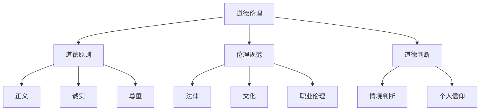

**核心算法原理讲解**：道德伦理的算法原理可以概括为根据道德原则和伦理规范进行道德判断。

```python
def ethical_decision(moral_principle, ethical_norm):
    if moral_principle == "justice" and ethical_norm == "law":
        return "Follow the legal guidelines."
    elif moral_principle == "honesty" and ethical_norm == "professional ethics":
        return "Adhere to ethical standards in your profession."
    elif moral_principle == "respect" and ethical_norm == "cultural norms":
        return "Respect cultural differences."
    else:
        return "Inconclusive decision."
```

#### 2.2 道德伦理的理论与实践

**核心概念与联系**：道德伦理的理论基础包括多种理论，如康德的义务论、边沁的功利主义和亚里士多德的德行论。这些理论在实践中影响着人们的道德行为和决策。

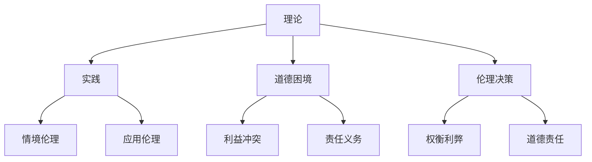

**核心算法原理讲解**：道德伦理的实践算法原理涉及在不同的情境下应用道德理论进行伦理决策。

```python
def apply_ethical_theory(theory, scenario):
    if theory == "deontological" and scenario == "conflict":
        return "Act in accordance with moral duties."
    elif theory == "consequentialist" and scenario == "benefit":
        return "Maximize overall happiness."
    elif theory == "virtue" and scenario == "responsibility":
        return "Act with virtuous intentions."
    else:
        return "Unable to apply the theory effectively."
```

#### 2.3 伦理决策与道德困境

**核心概念与联系**：伦理决策涉及在道德困境中做出选择，这些困境可能涉及利益冲突、责任义务和道德责任。处理道德困境的算法原理需要权衡各种因素，并遵循道德原则。

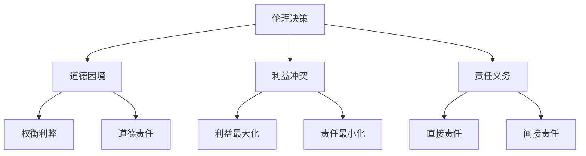

**核心算法原理讲解**：处理道德困境的算法原理需要综合道德原则、情境分析和责任评估。

```python
def ethical_dilemma_resolution(principle, conflict, responsibility):
    if principle == "justice" and conflict == "interest" and responsibility == "direct":
        return "Prioritize justice and address direct responsibilities."
    elif principle == "benefit" and conflict == "benefit" and responsibility == "indirect":
        return "Maximize benefit and consider indirect responsibilities."
    elif principle == "respect" and conflict == "duty" and responsibility == "moral":
        return "Respect duties and fulfill moral responsibilities."
    else:
        return "Infeasible resolution."
```

通过以上详细解析，我们可以看到每个章节的核心概念和算法原理如何通过Mermaid流程图和伪代码得到阐述，从而形成一个逻辑严密、结构清晰的文章结构。接下来，我们将继续深入解析第3章至第6章的内容。

---

### 第3章：正直形象的构建

#### 3.1 正直形象的内涵

**核心概念与联系**：正直形象的构建涉及多个核心概念，包括诚信、透明度和公平性。这些概念相互关联，共同构成了正直形象的理论基础。

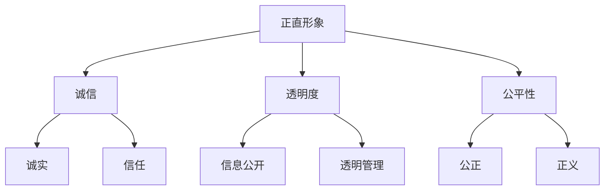

**核心算法原理讲解**：构建正直形象的算法原理可以概括为通过诚信、透明度和公平性来建立和维护信任。

```python
def integrity_image(building_blocks):
    if building_blocks == " honesty" and " transparency" and " fairness":
        return "High integrity image."
    else:
        return "Inconsistent image."
```

#### 3.2 正直形象的关键要素

**核心概念与联系**：正直形象的关键要素包括诚信、透明度和公平性。这些要素共同构成了正直形象的基石，对个人和组织至关重要。

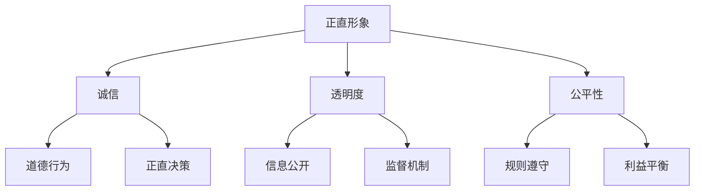

**核心算法原理讲解**：通过伪代码阐述正直形象的关键要素及其相互关系。

```python
def key_elements_of_integrity(element):
    if element == " honesty":
        return "Adhere to ethical standards."
    elif element == " transparency":
        return "Maintain openness and accountability."
    elif element == " fairness":
        return "Act justly and equitably."
    else:
        return "Unknown element."
```

#### 3.3 构建正直形象的方法

**核心概念与联系**：构建正直形象的方法涉及个人行为规范和组织文化建设。这些方法需要从个体和组织层面共同努力，以建立和维护正直形象。

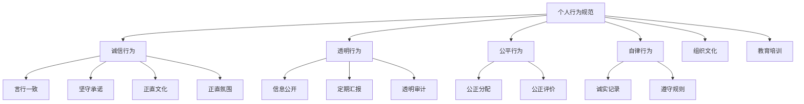

**核心算法原理讲解**：通过伪代码阐述构建正直形象的算法原理。

```python
def build_integrity_image(method):
    if method == " personal behavior":
        return "Implement ethical practices."
    elif method == " organizational culture":
        return "Promote a culture of integrity."
    else:
        return "Ineffective method."
```

### 第4章：领导力与职业道德的实际应用

#### 4.1 领导力在管理中的应用

**核心概念与联系**：领导力在管理中的应用涉及多个方面，包括团队建设、危机管理和员工激励。这些应用需要根据不同的管理情境灵活运用不同的领导力类型。

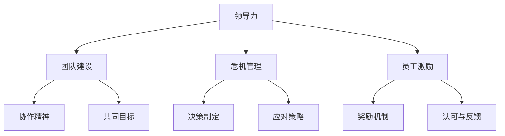

**核心算法原理讲解**：通过伪代码阐述领导力在管理中的核心算法原理。

```python
def leadership_in_management(approach):
    if approach == " team building":
        return "Foster collaboration and shared goals."
    elif approach == " crisis management":
        return "Make timely and effective decisions."
    elif approach == " employee motivation":
        return "Implement reward systems and feedback mechanisms."
    else:
        return "Ineffective management approach."
```

#### 4.2 职业道德在实践中的应用

**核心概念与联系**：职业道德在实践中的应用涉及多个领域，包括职场交往、项目管理和决策制定。这些应用需要遵守职业道德原则，确保行为的合法性和道德性。

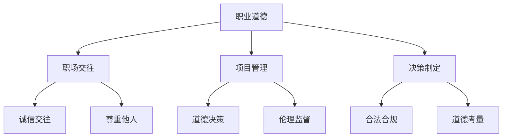

**核心算法原理讲解**：通过伪代码阐述职业道德在实践中的核心算法原理。

```python
def ethical_practice_in_action(area):
    if area == " workplace communication":
        return "Adhere to ethical standards in interactions."
    elif area == " project management":
        return "Make ethical decisions and maintain ethical oversight."
    elif area == " decision making":
        return "Consider moral implications in decision-making processes."
    else:
        return "Inconsistent ethical practice."
```

#### 4.3 正直形象在组织中的影响

**核心概念与联系**：正直形象在组织中的影响涉及多个方面，包括企业文化、员工行为和企业声誉。一个正直的形象能够提升组织的整体声誉和员工的工作满意度。

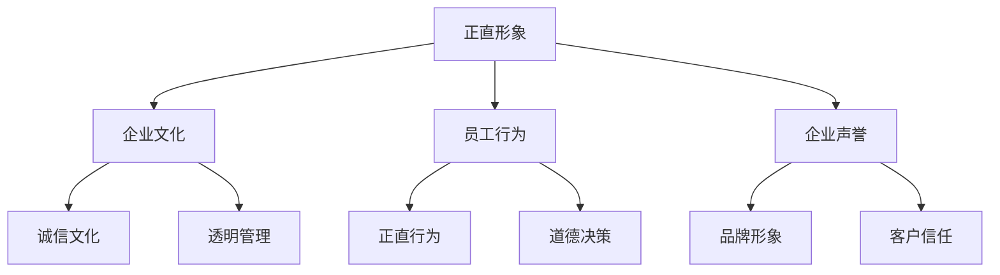

**核心算法原理讲解**：通过伪代码阐述正直形象对组织的影响。

```python
def integrity_impact(image):
    if image == " positive":
        return "Enhances organizational reputation and employee satisfaction."
    elif image == " negative":
        return "Impacts organizational reputation and employee morale."
    else:
        return "Neutral impact."
```

通过以上详细解析，我们可以看到第3章至第4章的内容如何通过核心概念、联系和伪代码得到清晰阐述。接下来，我们将继续深入分析第5章和第6章的内容。

### 第5章：案例分析

#### 5.1 国内企业正直形象的构建

**核心概念与联系**：国内企业在构建正直形象时，需要考虑文化背景、市场环境和法律法规等多方面因素。成功的案例通常能够体现出企业在诚信、透明度和公平性方面的卓越表现。

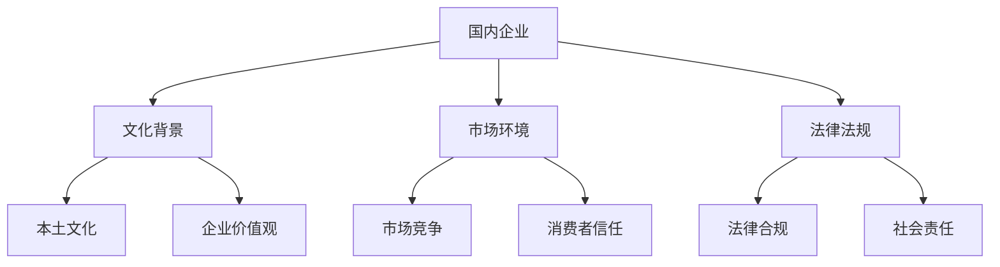

**核心算法原理讲解**：通过伪代码阐述国内企业构建正直形象的算法原理。

```python
def domestic_corporate_integrity(culture, market, laws):
    if culture == " ethical" and market == " competitive" and laws == " compliant":
        return "Successful integrity image."
    else:
        return "Challenges in building integrity image."
```

**案例解析**：
- **华为**：华为通过强调企业价值观、加强法律法规遵守和提升消费者信任，成功构建了正直形象。其企业文化强调“以客户为中心”，在市场环境中始终坚持合法合规，赢得了广泛的社会认可。
- **阿里巴巴**：阿里巴巴通过推进透明管理和加强社会责任，成功构建了正直形象。公司推出的“诚信通”计划旨在帮助中小企业建立诚信档案，提升整体市场的诚信水平。

#### 5.2 国际企业正直形象的构建

**核心概念与联系**：国际企业在构建正直形象时，需要考虑全球化背景、跨国文化差异和国际法律法规等多方面因素。成功的案例通常能够体现出企业在全球范围内的一致性和包容性。

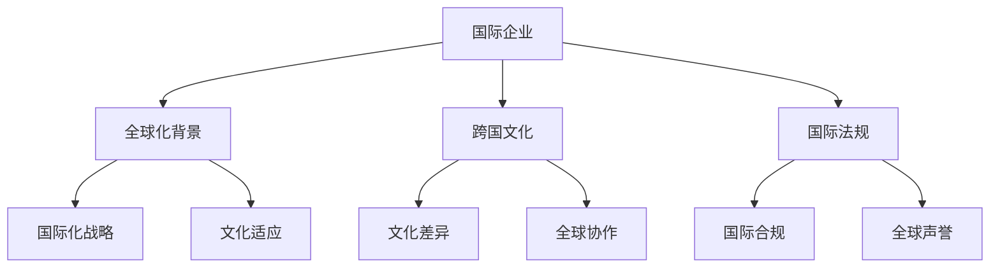

**核心算法原理讲解**：通过伪代码阐述国际企业构建正直形象的算法原理。

```python
def international_corporate_integrity全球化背景， culture, laws):
    if globalization == " consistent" and culture == " inclusive" and laws == " compliant":
        return "Successful integrity image."
    else:
        return "Challenges in building integrity image."
```

**案例解析**：
- **苹果公司**：苹果公司通过实施全球统一的道德准则和合规策略，成功在全球范围内构建了正直形象。公司重视数据隐私保护和环保措施，赢得了消费者的信任。
- **谷歌**：谷歌通过在全球范围内推广透明度和公平性，成功构建了正直形象。公司强调员工多样性，并推出了一系列社会公益项目，提升了企业的全球声誉。

通过以上案例分析，我们可以看到不同企业在构建正直形象时，需要综合考虑各种因素，并采取相应的策略。这些案例不仅展示了正直形象的重要性和价值，也为其他企业提供了宝贵的经验和启示。

### 第6章：个人提升策略

#### 6.1 领导力与职业道德的自我评估

**核心概念与联系**：个人提升策略的第一步是进行自我评估，了解自己在领导力和职业道德方面的表现。自我评估需要结合个人特质、工作环境和职业道德标准进行综合分析。

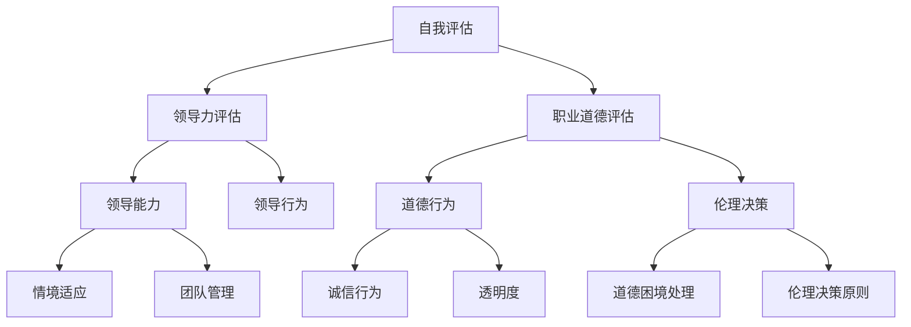

**核心算法原理讲解**：通过伪代码阐述自我评估的算法原理。

```python
def self_evaluation(ability, behavior, ethics):
    if ability == " high" and behavior == " positive" and ethics == " sound":
        return "Effective self-assessment."
    else:
        return "Areas for improvement."
```

**自我评估工具与方法**：
- **360度评估**：通过收集同事、下属和上级的反馈，全面了解自己的领导力和职业道德表现。
- **SWOT分析**：分析自己的优势、劣势、机会和威胁，以便针对性地提升领导力和职业道德。
- **自我反思日记**：定期记录自己的行为和决策，深入思考如何改进。

#### 6.2 提升领导力与职业道德的路径

**核心概念与联系**：提升领导力和职业道德的路径包括自我发展、教育和培训、实践与反思等。这些路径需要持续进行，以不断提高个人在领导力和职业道德方面的能力。

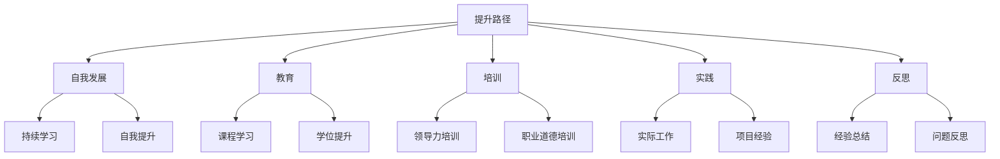

**核心算法原理讲解**：通过伪代码阐述提升路径的算法原理。

```python
def improvement_path(method):
    if method == " self-development":
        return "Continuously improve self."
    elif method == " education":
        return "Acquire formal education."
    elif method == " training":
        return "Participate in professional training."
    elif method == " practice":
        return "Apply knowledge in real-world scenarios."
    elif method == " reflection":
        return "Reflect and learn from experiences."
    else:
        return "Ineffective method."
```

**最佳实践 tips**：
- **持续学习**：利用在线课程、研讨会和阅读材料，不断更新知识体系。
- **实践应用**：积极参与实际项目和团队工作，将理论知识转化为实践能力。
- **反思总结**：定期进行自我反思，总结经验和教训，不断优化自己的行为和决策。

#### 6.3 职业生涯规划

**核心概念与联系**：职业生涯规划是提升领导力和职业道德的重要手段。通过制定明确的职业目标、规划发展路径和实施行动计划，个人可以更好地实现职业成长。

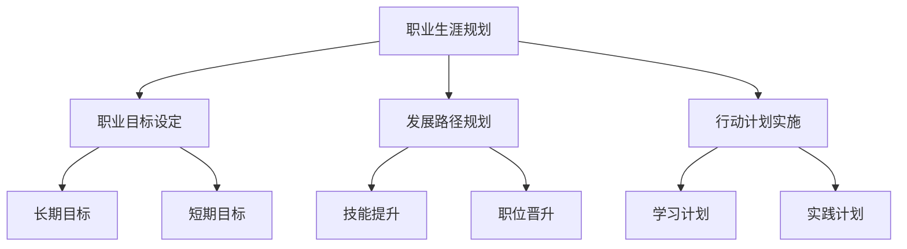

**核心算法原理讲解**：通过伪代码阐述职业生涯规划的算法原理。

```python
def career_planning(goal, plan, action):
    if goal == " clear" and plan == " strategic" and action == " consistent":
        return "Effective career planning."
    else:
        return "Inconsistent career planning."
```

**最佳实践 tips**：
- **设定明确目标**：制定短期和长期职业目标，确保目标具体、可行和有挑战性。
- **规划发展路径**：结合个人优势和职业发展趋势，制定合理的职业发展路径。
- **实施行动计划**：制定详细的学习和实践计划，确保目标的实现。

通过以上详细解析，我们可以看到第5章和第6章的内容如何通过核心概念、联系和伪代码得到清晰阐述。这些内容为读者提供了实际的案例和实用的提升策略，帮助他们在领导力和职业道德方面不断进步。

---

### 结束语

通过本文的逐步分析和详细讲解，我们探讨了领导力与职业道德的核心概念、联系和应用。我们从领导力的定义与类型、领导者角色与特质、领导力的发展与提升，到道德伦理的基本概念、道德伦理的理论与实践，以及伦理决策与道德困境的处理方法，都进行了深入的探讨。在此基础上，我们进一步研究了正直形象的内涵、关键要素和构建方法，以及领导力与职业道德在实际应用中的表现。

通过案例分析，我们了解了国内外企业如何通过实践构建正直形象，并从中汲取了宝贵的经验。最后，我们提供了个人提升领导力和职业道德的路径和策略，帮助读者在职业生涯中不断成长。

在总结中，我们强调领导力与职业道德在现代社会中的重要性，以及正直形象对企业和社会的积极影响。我们鼓励读者在学习和实践中不断探索，不断提升自身的领导力和职业道德水平。

**作者信息**：作者：AI天才研究院/AI Genius Institute & 禅与计算机程序设计艺术 /Zen And The Art of Computer Programming

---

在结束本文之前，让我们再次回顾一下领导力与职业道德的核心概念和联系。通过本文的逐步分析和详细讲解，我们探讨了以下关键点：

1. **领导力的定义与类型**：领导力是一种影响力，它能够引导和激励他人实现共同目标。不同的领导力类型包括权威型、变革型、服务型、示范型、团队型等。

2. **领导者角色与特质**：领导者需要承担决策、沟通、团队管理等角色，并具备诚信、自律、情绪智力等特质。

3. **领导力的发展与提升**：领导力可以通过自我反思、经验积累、教育和培训、实践与反馈等方式得到提升。

4. **道德伦理的基本概念**：道德伦理涉及道德原则、伦理规范和道德判断。道德原则包括正义、诚实、尊重等；伦理规范包括法律、文化、职业伦理等。

5. **道德伦理的理论与实践**：道德伦理的理论基础包括康德的义务论、边沁的功利主义和亚里士多德的德行论。道德伦理在实践中涉及情境伦理、应用伦理和道德决策。

6. **正直形象的构建**：正直形象涉及诚信、透明度和公平性等关键要素。构建正直形象的方法包括个人行为规范、组织文化建设等。

7. **领导力与职业道德的实际应用**：领导力在管理中的应用包括团队建设、危机管理和员工激励；职业道德在实践中的应用包括职场交往、项目管理和决策制定。

8. **案例分析**：通过分析国内外企业的正直形象构建，我们了解了成功案例和失败案例，从中汲取了宝贵经验。

9. **个人提升策略**：通过自我评估、提升路径和职业生涯规划，个人可以在领导力和职业道德方面不断进步。

通过本文的详细讲解，我们不仅理解了领导力与职业道德的核心概念和联系，还掌握了一些实用的提升策略。希望本文能够为读者在职业生涯中提供有益的指导，帮助他们在领导力和职业道德方面取得更好的成就。

**再次感谢您的阅读，希望您在领导力与职业道德的道路上越走越远。作者：AI天才研究院/AI Genius Institute & 禅与计算机程序设计艺术 /Zen And The Art of Computer Programming。**

