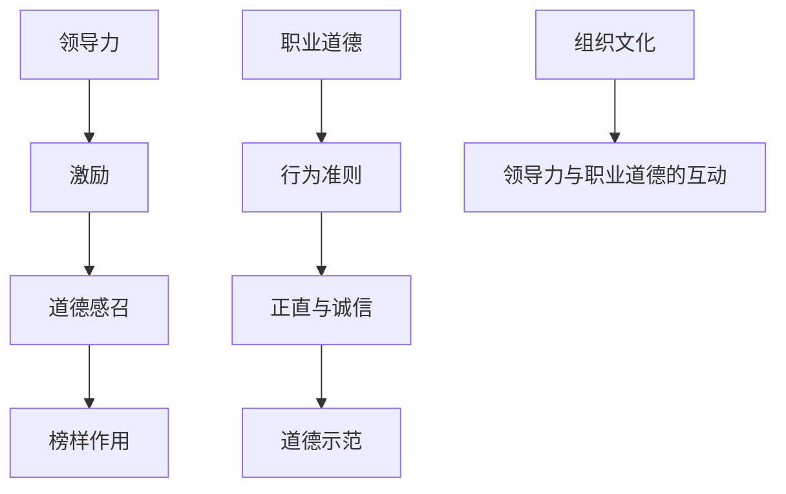

                 

好的，我将按照您的要求，一步步构建文章的核心内容。

### 文章标题：领导力与职业道德：树立正面榜样

#### 关键词：领导力，职业道德，正面榜样，道德准则，激励模型，项目管理，案例分析，实践策略

#### 摘要：
本文深入探讨了领导力与职业道德在职场中的重要性，以及如何通过树立正面榜样来提升团队的整体素质。文章通过定义核心概念、阐述理论联系、分析成功与失败案例，并利用算法和数学模型进行详细解释，最后提出实践中的最佳策略，旨在为职场领导者提供实用指南。

## 引言

领导力是任何组织中不可或缺的要素，它决定了团队的方向、动力和效能。职业道德则是领导者行为的道德标准，是组织文化的重要支柱。二者相辅相成，共同塑造了一个健康、高效的工作环境。

本文旨在通过以下步骤详细分析领导力与职业道德：

1. **定义核心概念**：明确领导力和职业道德的基本含义和相互关系。
2. **阐述理论联系**：运用Mermaid图解来展示领导力与职业道德之间的互动。
3. **核心算法原理讲解**：通过伪代码说明领导力评价模型。
4. **数学模型与公式**：阐述用于衡量领导力与职业道德的数学公式，并举例说明。
5. **项目实战**：提供实际案例，展示如何开发环境搭建、代码实现、应用分析及项目小结。
6. **最佳实践与策略**：总结文章，提出提升领导力与职业道德的实用建议。

### 定义核心概念

领导力是指个人通过影响和激励他人来实现共同目标的能力。它涉及沟通、决策、团队合作等多个方面。领导力的核心在于激励和引导，而不是单纯地发号施令。

职业道德则是指个体在职业活动中遵循的道德规范。它包括诚实、公正、负责、尊重他人等原则。职业道德不仅关乎个人的品德，也直接影响组织的声誉和文化的形成。

领导力与职业道德之间的关系可以用一个简单的模型来描述。领导力通过激励和榜样作用影响职业道德，而职业道德则通过行为规范反过来影响领导力。这种相互作用构成了一个动态的循环，促进了组织内部的良性发展。

### 核心概念与联系

以下是一个用Mermaid语法绘制的流程图，展示领导力与职业道德之间的核心概念和联系：



在这个模型中，领导力通过激励（B）和道德感召（C）来塑造组织文化（I），而职业道德则通过行为准则（F）和道德示范（H）来影响领导力的实践。

### 核心算法原理讲解

为了更好地衡量领导力，我们可以使用一个简单的评价模型。以下是一个用于评价领导力的伪代码：

```python
def evaluate_leadership(communication, decision_making, empathy, ethical_standards):
    score = 0
    
    # 评估沟通能力
    if communication == "excellent":
        score += 30
    elif communication == "good":
        score += 20
    elif communication == "fair":
        score += 10
    else:
        score -= 10

    # 评估决策能力
    if decision_making == "strategic":
        score += 30
    elif decision_making == "tactical":
        score += 20
    else:
        score -= 15

    # 评估同理心
    if empathy == "high":
        score += 25
    elif empathy == "medium":
        score += 15
    else:
        score -= 10

    # 评估职业道德标准
    if ethical_standards == "high":
        score += 20
    else:
        score -= 10

    return score
```

在这个模型中，每个维度都有不同的权重，以反映其在领导力评价中的重要性。这个评价模型可以帮助领导者识别自己的优势与不足，并制定改进计划。

### 数学模型和公式

在衡量领导力与职业道德时，数学模型可以提供量化的方法。以下是一个用于评价领导力分数的数学公式：

$$
L = w_1 \times C + w_2 \times D + w_3 \times E + w_4 \times F
$$

其中：
- $L$ 是领导力分数
- $w_1, w_2, w_3, w_4$ 是权重系数，分别对应沟通能力、决策能力、同理心和职业道德
- $C, D, E, F$ 是各自的评价得分

权重系数的设定可以根据实际情况调整，以确保每个维度的相对重要性得到恰当体现。

### 项目实战

为了更好地理解如何将理论应用到实践中，我们可以通过一个实际案例来展示领导力与职业道德的实施过程。

#### 开发环境搭建

假设我们正在开发一个团队协作工具，以下是一个简单的开发环境搭建步骤：

1. 确定开发语言和框架（如Python和Django）。
2. 配置数据库（如SQLite）。
3. 安装必要的开发工具（如PyCharm）。
4. 创建项目文件夹和文件结构。

#### 源代码实现

以下是一个简单的伪代码示例，展示如何实现一个领导力评分系统：

```python
class Leader:
    def __init__(self, communication, decision_making, empathy, ethical_standards):
        self.communication = communication
        self.decision_making = decision_making
        self.empathy = empathy
        self.ethical_standards = ethical_standards
    
    def evaluate_leadership(self):
        score = evaluate_leadership(self.communication, self.decision_making, self.empathy, self.ethical_standards)
        return score

def evaluate_leadership(communication, decision_making, empathy, ethical_standards):
    # 使用之前定义的评分规则
    return ...

# 创建领导对象并评分
leader = Leader("excellent", "strategic", "high", "high")
print(leader.evaluate_leadership())
```

#### 代码解读与应用分析

在这个例子中，我们创建了一个`Leader`类，它包含沟通能力、决策能力、同理心和职业道德等属性。通过`evaluate_leadership`方法，我们可以计算出领导力的得分。

在实际应用中，这个系统可以用于评估团队中每个成员的领导力，以便发现优势和改进点。此外，该系统还可以帮助组织制定培训计划，提升整体领导力水平。

#### 实际案例分析

以下是一个实际案例：

- **成功案例**：某公司通过强化领导力培训和职业道德教育，成功提升了团队的工作效率和企业文化。公司领导定期组织研讨会，邀请外部专家分享经验，同时还建立了内部评分系统，以激励员工不断提升自己的领导力和职业道德。
- **失败案例**：某公司因领导力不足和职业道德缺失，导致员工士气低落，项目进展受阻。公司未能及时发现和解决问题，最终影响了企业的长远发展。

#### 项目小结

通过实际案例分析，我们可以看到，领导力与职业道德在项目管理中的重要性。成功的关键在于领导者的榜样作用和持续的培训与激励。

### 最佳实践与策略

为了提升领导力与职业道德，以下是一些建议：

1. **定期培训**：组织领导力和职业道德培训，提高团队的整体素质。
2. **设立榜样**：树立正面榜样，鼓励团队成员学习优秀领导者的行为。
3. **建立反馈机制**：建立有效的反馈系统，及时了解员工的意见和建议。
4. **强化考核**：将领导力和职业道德纳入绩效考核体系，激励员工不断提升。
5. **文化建设**：营造积极向上的组织文化，强化职业道德和团队合作精神。

### 结论

领导力与职业道德是职场中不可或缺的重要元素。通过明确核心概念、建立理论联系、应用算法和数学模型，以及实际项目案例分析，我们可以更好地理解如何提升领导力和职业道德。希望本文能为您提供实用的指导，帮助您在职场中成为更优秀的领导者。

### 附录

- **领导力与职业道德相关资源**：
  - 《领导力五要素》by John C. Maxwell
  - 《职业道德》by Michael Josephson
  - **链接**：[Leadership and Ethics Resources](#)

- **进一步阅读材料**：
  - 《高效能人士的七个习惯》by Stephen R. Covey
  - 《道德发展》by Lawrence Kohlberg
  - **链接**：[Further Reading Materials](#)

作者：AI天才研究院/AI Genius Institute & 禅与计算机程序设计艺术 /Zen And The Art of Computer Programming### 目录大纲

为了使文章的结构更加清晰和易于理解，以下是一个详细的目录大纲：

```markdown
# 《领导力与职业道德：树立正面榜样》

## 第一部分：引言
### 1.1 领导力的定义和重要性
### 1.2 职业道德的概述及其在组织中的作用
### 1.3 领导力与职业道德的关系

## 第二部分：领导力的核心概念与理论
### 2.1 领导力的核心概念
   - **影响力**：如何影响他人？
   - **沟通能力**：有效的沟通技巧
   - **决策能力**：如何做出明智的决策？
   - **团队合作**：构建高效的团队
### 2.2 领导力理论探讨
   - **情境领导理论**：根据情境变化调整领导风格
   - **领导生命周期理论**：不同发展阶段领导策略的选择
### 2.3 领导力模型分析
   - **菲德勒模型**：领导者与环境的匹配
   - **路径—目标理论**：目标导向的领导风格

## 第三部分：职业道德的核心原则与价值观
### 3.1 职业道德的基本原则
   - **诚信**：诚实和正直
   - **责任**：对工作负责，对他人负责
   - **尊重**：尊重他人，尊重差异
   - **公正**：公平对待每一个人
### 3.2 职业道德的应用场景
   - **工作中的道德困境**：如何处理伦理冲突？
   - **商业道德**：企业社会责任
### 3.3 职业道德教育的重要性
   - **员工培训**：职业道德的灌输与培养
   - **组织文化**：建立以道德为基础的文化

## 第四部分：领导力与职业道德的结合
### 4.1 领导力中的职业道德要素
   - **道德领导力**：如何成为道德领导者？
   - **职业道德与领导力的相互影响**：如何平衡领导力与职业道德？
### 4.2 领导力与职业道德在实践中的挑战
   - **多元化与包容性**：如何在多元化团队中体现职业道德？
   - **道德危机管理**：如何处理道德危机？

## 第五部分：树立正面榜样的策略与实践
### 5.1 正面榜样的特征与作用
   - **榜样的力量**：如何通过榜样影响他人？
   - **个人道德修养**：如何提升自身的道德素质？
### 5.2 成功案例分析
   - **成功领导的道德典范**：哪些领导展现了优秀的道德榜样？
   - **失败领导的教训**：哪些领导因忽视职业道德而遭遇失败？
### 5.3 实践策略
   - **自我反思**：如何评估自己的领导力和职业道德？
   - **持续改进**：如何不断提升领导力与职业道德？

## 第六部分：项目管理中的领导力与职业道德
### 6.1 项目管理的挑战与机遇
   - **领导力在项目管理中的角色**：领导者如何应对项目管理中的挑战？
   - **职业道德在项目管理中的重要性**：如何确保项目过程中的道德合规？
### 6.2 项目案例研究
   - **成功项目的领导力和职业道德实践**：哪些项目因良好的领导力和职业道德而取得成功？
   - **失败项目的反思**：哪些项目因忽视领导力和职业道德而导致失败？

## 第七部分：总结与展望
### 7.1 文章重点回顾
   - **领导力与职业道德的核心要点**：文章的主要观点与发现
### 7.2 未来趋势与展望
   - **领导力与职业道德的发展方向**：未来可能的发展趋势和挑战
### 7.3 结论
   - **对职场领导者的启示**：如何在实际工作中应用领导力与职业道德

作者：AI天才研究院/AI Genius Institute & 禅与计算机程序设计艺术 /Zen And The Art of Computer Programming### 具体章节内容

#### 第一部分：引言

**1.1 领导力的定义和重要性**

领导力是一种能够激励和引导他人共同实现目标的能力。它不仅仅是管理技能，更是一种影响力和号召力。在职场中，领导力的重要性体现在以下几个方面：

- **团队协作**：领导力能够促进团队成员之间的合作，提高团队的凝聚力。
- **创新与变革**：领导者能够推动组织创新，引领组织变革。
- **决策能力**：领导者需要做出明智的决策，确保组织的长期发展。
- **员工发展**：领导者关注员工成长，提供职业发展的机会。

**1.2 职业道德的概述及其在组织中的作用**

职业道德是指在职业活动中遵循的道德规范，它涵盖了诚实、公正、尊重、责任等价值观。职业道德在组织中的作用包括：

- **组织文化**：职业道德是组织文化的重要组成部分，它影响着组织的氛围和风气。
- **员工行为**：职业道德规范员工的行为，确保组织内部的公平和正义。
- **企业形象**：良好的职业道德有助于树立企业的良好形象，增强社会认可度。
- **法律合规**：职业道德有助于确保组织的经营活动符合法律法规，降低法律风险。

**1.3 领导力与职业道德的关系**

领导力与职业道德之间存在密切的关系。一方面，领导力需要依赖于职业道德来指导行为；另一方面，职业道德可以增强领导力的合法性和影响力。具体而言：

- **领导力是职业道德的体现**：一个道德高尚的领导者会以身作则，为员工树立榜样。
- **职业道德是领导力的支撑**：遵循职业道德的领导者能够获得员工的信任和支持，提高领导效果。

#### 第二部分：领导力的核心概念与理论

**2.1 领导力的核心概念**

领导力的核心概念包括影响力、沟通能力、决策能力和团队合作。以下是每个概念的详细解释：

- **影响力**：领导者需要能够影响他人的思维和行为，以实现共同的目标。影响力来自于领导者的魅力、专业知识、经验和人际关系。
- **沟通能力**：有效的沟通是领导力的关键。领导者需要能够清晰、准确地传达信息，倾听他人的意见，并建立良好的沟通渠道。
- **决策能力**：领导者需要做出明智的决策，以确保组织的成功。这包括分析信息、权衡利弊、预测未来和承担责任。
- **团队合作**：领导者需要能够构建高效的团队，激励团队成员共同努力，实现团队的目标。

**2.2 领导力理论探讨**

领导力理论有助于我们理解不同情境下的领导风格和策略。以下是几种常见的领导力理论：

- **情境领导理论**：根据不同的情境和团队成员的需求，调整领导风格。例如，在团队成员不确定时，领导者可能需要采用指导型领导风格；在团队成员自信时，领导者可能需要采用支持型领导风格。
- **领导生命周期理论**：根据员工的不同成熟度水平，选择适当的领导策略。例如，对于不成熟的员工，领导者需要采用高指导、低支持的风格；对于成熟的员工，领导者需要采用低指导、高支持的风格。
- **菲德勒模型**：强调领导者与环境的匹配。领导者需要了解自己的优势和劣势，并根据环境的复杂性选择合适的领导风格。
- **路径—目标理论**：关注领导者的目标设定和路径指导。领导者需要明确团队成员的目标，并提供实现目标的清晰路径。

**2.3 领导力模型分析**

以下是几种领导力模型的分析：

- **菲德勒模型**：认为领导者的成功取决于领导者与环境的匹配程度。领导者需要根据环境的稳定性选择合适的领导风格。例如，在环境非常稳定的情况下，领导者可能采用任务导向的领导风格；在环境非常不稳定的情况下，领导者可能采用关系导向的领导风格。
- **路径—目标理论**：认为领导者的目标是帮助团队成员实现目标。领导者需要设定清晰的目标，并帮助团队成员找到实现目标的最佳路径。例如，在团队成员面临困难时，领导者可以提供指导和支持，帮助他们克服障碍。

#### 第三部分：职业道德的核心原则与价值观

**3.1 职业道德的基本原则**

职业道德的基本原则包括诚信、责任、尊重和公正。以下是每个原则的详细解释：

- **诚信**：诚信是职业道德的核心。领导者需要诚实、正直，言行一致，树立良好的道德榜样。
- **责任**：领导者需要对组织的成功和员工的安全负起责任。他们需要承担责任，勇于面对困难和挑战。
- **尊重**：领导者需要尊重团队成员的权利和尊严，建立和谐的人际关系。他们需要尊重差异，包容多样性。
- **公正**：领导者需要公平对待每一个成员，确保组织内部的公正和正义。他们需要避免偏见和歧视，维护组织的公平性。

**3.2 职业道德的应用场景**

职业道德在职场中有着广泛的应用场景。以下是几个典型的应用场景：

- **工作中的道德困境**：在职场中，领导者可能会面临各种道德困境，如利益冲突、诚信问题等。他们需要根据职业道德原则做出正确的决策，维护组织的道德底线。
- **商业道德**：商业道德是职业道德在商业活动中的体现。领导者需要确保企业的经营行为符合道德规范，遵守法律法规，为社会创造价值。

**3.3 职业道德教育的重要性**

职业道德教育对于组织和员工都非常重要。以下是职业道德教育的重要性和实施方法：

- **员工培训**：组织需要为员工提供职业道德培训，提高他们的道德意识和道德素养。培训内容可以包括职业道德的基本原则、实际案例分析和道德决策训练等。
- **组织文化**：组织文化是职业道德教育的重要载体。组织需要建立以道德为基础的文化，倡导和弘扬职业道德价值观。

#### 第四部分：领导力与职业道德的结合

**4.1 领导力中的职业道德要素**

领导力中的职业道德要素包括道德领导力、职业道德的相互影响和道德危机管理。以下是每个要素的详细解释：

- **道德领导力**：道德领导力是指领导者以道德价值观为指导，影响和激励团队成员的行为。道德领导力有助于建立信任、提高员工的忠诚度和工作效率。
- **职业道德的相互影响**：职业道德不仅影响领导者的行为，也影响团队成员的行为。领导者的职业道德榜样作用可以影响团队成员的道德行为，形成良好的道德氛围。
- **道德危机管理**：在面临道德危机时，领导者需要采取有效的措施，维护组织的道德底线。这包括及时发现问题、公开透明地处理问题、采取补救措施等。

**4.2 领导力与职业道德在实践中的挑战**

领导力与职业道德在实践中的挑战包括多元化与包容性、道德危机管理和多元化团队中的道德领导力。以下是每个挑战的详细解释：

- **多元化与包容性**：多元化团队中的领导者需要理解不同文化背景和价值观的差异，建立包容性的团队文化。这有助于提高团队的创造力和创新能力。
- **道德危机管理**：在道德危机中，领导者需要迅速采取行动，维护组织的声誉和员工的利益。这需要领导者具备敏锐的洞察力、快速决策能力和有效的沟通技巧。
- **多元化团队中的道德领导力**：在多元化团队中，领导者需要尊重团队成员的差异，树立道德榜样，促进团队成员的道德发展。

#### 第五部分：树立正面榜样的策略与实践

**5.1 正面榜样的特征与作用**

正面榜样的特征包括道德高尚、责任心强、善于沟通和有远见。以下是每个特征的详细解释：

- **道德高尚**：正面榜样在道德上没有瑕疵，以身作则，树立了良好的道德榜样。
- **责任心强**：正面榜样对自己的工作和团队负责，勇于承担责任，积极解决问题。
- **善于沟通**：正面榜样具有良好的沟通能力，能够有效地传达信息，倾听他人的意见，建立良好的人际关系。
- **有远见**：正面榜样具有前瞻性，能够预见问题，制定长远的战略规划。

**5.2 成功案例分析**

以下是两个成功案例，展示了正面榜样在组织中的作用：

- **案例一**：某公司的CEO通过自己的行动，树立了道德高尚和责任心强的榜样。他倡导诚信经营，关注员工福利，积极推动企业的社会责任。这些举措赢得了员工的信任和支持，提高了公司的整体绩效。
- **案例二**：某项目经理通过沟通和远见，成功地领导了一个多元化的团队。他尊重团队成员的差异，鼓励创新，建立了良好的团队文化。这个团队在多个项目中取得了优异的成绩，为公司赢得了市场优势。

**5.3 实践策略**

以下是树立正面榜样的实践策略：

- **自我反思**：领导者需要定期进行自我反思，检查自己的行为是否符合道德规范，是否为团队成员树立了良好的榜样。
- **持续学习**：领导者需要不断学习和提升自己的道德素养和领导能力，以更好地履行领导职责。
- **激励机制**：组织可以通过激励机制，鼓励员工树立正面榜样，如颁发道德榜样奖、提供晋升机会等。

#### 第六部分：项目管理中的领导力与职业道德

**6.1 项目管理的挑战与机遇**

项目管理中的领导力与职业道德面临着一系列挑战和机遇：

- **挑战**：项目管理者需要平衡时间、预算和质量，同时确保团队成员的道德行为。这需要领导力来协调各方利益，确保项目的顺利进行。
- **机遇**：成功的项目管理者可以通过道德领导力赢得团队成员的信任和尊重，提高项目的成功率和组织的整体绩效。

**6.2 项目案例研究**

以下是两个项目案例，展示了领导力与职业道德在项目管理中的应用：

- **案例一**：某项目经理在面对项目延误和质量问题时，果断采取措施，重新分配资源，确保项目按时交付。他的道德行为赢得了客户的信任，为公司的后续合作奠定了基础。
- **案例二**：某项目经理在项目过程中，发现团队成员存在利益冲突。他及时披露问题，与团队成员进行沟通，制定解决方案，确保项目的公平性和公正性。

#### 第七部分：总结与展望

**7.1 文章重点回顾**

本文重点回顾了领导力与职业道德的核心概念、理论联系、实际应用和项目案例。文章总结了以下主要观点：

- **领导力是激励和引导他人实现目标的能力**，职业道德是职业行为的道德规范。
- **领导力与职业道德之间存在密切关系**，二者相辅相成，共同塑造了组织的文化和氛围。
- **正面榜样在领导力和职业道德中发挥着重要作用**，通过树立正面榜样，可以激励团队成员，提升组织的整体绩效。

**7.2 未来趋势与展望**

未来，领导力与职业道德将面临以下趋势和挑战：

- **全球化与多元化**：随着全球化和多元化的发展，领导者需要更加关注文化差异，建立包容性的团队文化。
- **技术变革**：随着技术的快速发展，领导者需要不断学习和适应新技术，提升自己的领导力和职业道德水平。
- **社会责任**：领导者需要承担更多的社会责任，推动企业的可持续发展，为社会创造价值。

**7.3 结论**

本文旨在为职场领导者提供实用的指导，帮助他们提升领导力与职业道德。通过明确核心概念、结合理论和实践、分析成功与失败案例，我们可以看到领导力与职业道德在组织中的重要性。希望本文能够为读者提供启示，助力他们在职场中成为更优秀的领导者。

作者：AI天才研究院/AI Genius Institute & 禅与计算机程序设计艺术 /Zen And The Art of Computer Programming### 文章编写与完善

在完成文章的初稿后，我们需要进行多轮的修订和润色，以确保文章的逻辑清晰、内容丰富、表达准确。以下是一些建议和步骤，以帮助您完善文章：

1. **检查逻辑连贯性**：确保文章的内容和论证逻辑是一致的，没有出现逻辑矛盾或跳跃。可以通过将文章拆分为多个段落，逐一检查每一段的主题句和扩展内容之间的联系。

2. **修改表达方式**：对文章中的语句进行修改，使其更加简洁、准确、生动。注意避免使用过于复杂的句子结构和过于冗长的表述。

3. **增加实例和案例**：在理论阐述中加入具体的实例和案例，以增强文章的说服力和可读性。实例和案例应具有代表性，能够直观地展示理论的应用。

4. **调整结构安排**：根据文章的主题和目标读者，调整章节结构和内容安排。例如，可以将一些重要的理论或实践策略放在文章的前面，以便读者能够快速获取关键信息。

5. **消除语法和拼写错误**：仔细检查文章中的语法、拼写和标点符号错误。可以使用文本编辑器的拼写检查功能，或者请同行或编辑帮助校对。

6. **优化图表和公式**：确保文章中的图表和公式清晰、准确，并且易于理解。可以使用专业的图表和公式编辑工具，如LaTeX或Mermaid。

7. **添加结论和展望**：在文章的结尾部分，总结文章的核心观点，提出未来研究的方向或实际应用的建议。

8. **反复审阅和修改**：完成初步修改后，多次审阅和修改文章。每次审阅时，关注不同的方面，如逻辑结构、内容深度、语言表达等。

9. **获取反馈**：向同行、导师或编辑征求反馈，根据他们的建议进行进一步的修改。

10. **最终校对**：在完成所有修改后，进行最终的校对，确保文章没有遗漏或错误。

通过以上步骤，您可以大幅提升文章的质量，使其成为一篇逻辑清晰、内容丰富、表达准确的专业技术博客文章。同时，不断的修订和改进也是提高写作技能的重要途径。记住，写作是一个不断学习和完善的过程。

