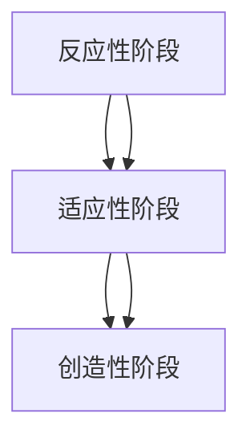
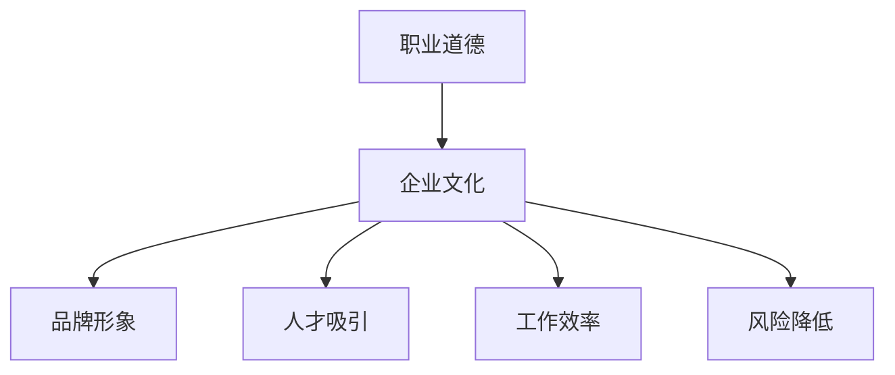
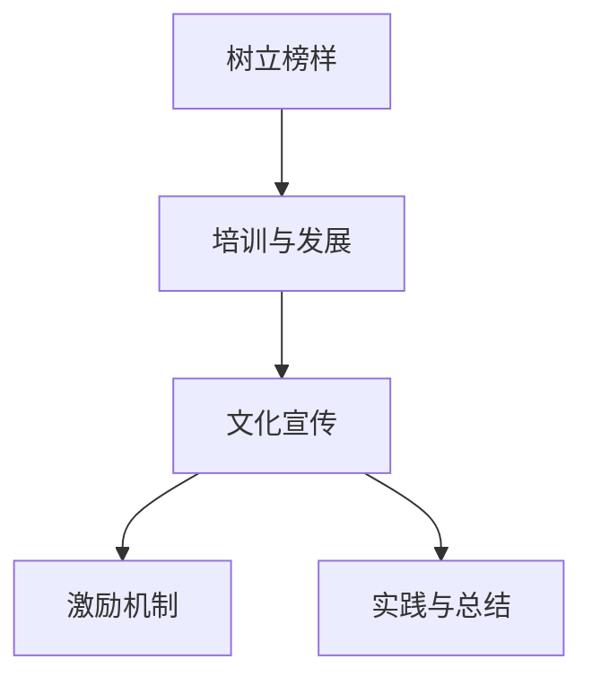
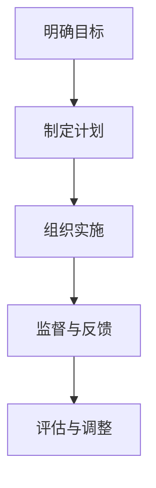
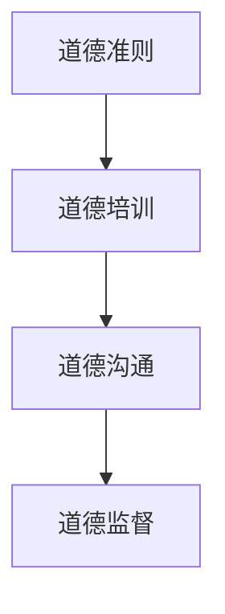
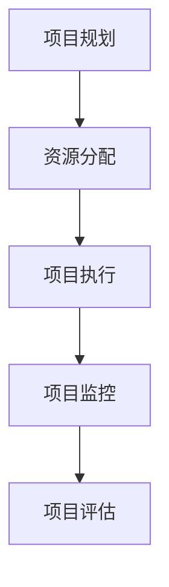

                 


### 文章标题

# 领导力与职业道德：树立正面榜样

### 文章关键词

领导力、职业道德、榜样、正面影响、团队管理

### 文章摘要

在IT行业，领导力与职业道德不仅对个人职业发展至关重要，更是塑造团队文化、推动组织进步的核心要素。本文旨在探讨领导力与职业道德的重要性，通过剖析两者的核心概念、关系架构以及实践方法，帮助读者树立正面榜样，提升团队凝聚力和工作效率。文章将分为八个章节，依次介绍领导力基础、职业道德准则、树立正面榜样、领导力实践、职业道德实践、项目案例分析以及总结与反思。

### 目录

## 第1章 引言

### 1.1 领导力的定义与重要性

领导力是一种影响力，它涉及到引导和激励他人共同达成目标的能力。在IT行业，领导力不仅是个人职业发展的关键，更是团队和组织的核心竞争力。有效的领导力可以提升团队凝聚力，激发员工的潜力，推动创新，提高工作效率。

领导力的重要性体现在以下几个方面：

1. **激发团队潜能**：优秀的领导者能够发现和挖掘团队成员的潜力，激发他们的创造力和主动性，从而实现团队的高效运作。
2. **塑造团队文化**：领导者通过行为和价值观的传递，塑造团队的共同文化和价值观，为团队的发展奠定基础。
3. **推动组织创新**：领导者的远见和决策能力可以推动组织的创新，引领团队不断进步。
4. **提升工作效率**：领导者的组织协调能力可以有效提升团队的工作效率，实现资源的最佳配置。

### 1.2 职业道德的定义与意义

职业道德是指在工作中遵守的道德规范和行为准则，它关系到个人的职业操守和企业的社会形象。在IT行业，职业道德尤为重要，因为信息安全和隐私保护是行业的基本要求。

职业道德的意义在于：

1. **维护行业信誉**：遵守职业道德可以维护整个行业的信誉，提升公众对IT行业的信任。
2. **保障信息安全**：遵守职业道德可以确保信息安全和用户隐私，避免因不当行为导致的数据泄露和损失。
3. **提升个人品牌**：具有良好的职业道德可以提升个人的职业形象和品牌价值。
4. **构建和谐团队**：职业道德有助于建立和谐的工作氛围，促进团队合作和人际关系的融洽。

### 1.3 领导力与职业道德的联系

领导力与职业道德之间存在密切的联系。领导者不仅需要具备卓越的领导能力，还需要具备高尚的职业道德。具体来说：

1. **相互促进**：领导力可以激发员工的职业道德，而职业道德可以增强领导者的公信力和影响力。
2. **共同发展**：领导者和团队成员在职业道德的共同追求下，可以实现团队和个人目标的协同发展。
3. **塑造文化**：领导者的行为和价值观对团队文化具有深远影响，职业道德是团队文化的重要组成部分。

### 1.4 本书的目标与结构

本书旨在帮助读者理解领导力与职业道德的核心概念，掌握实践方法，并树立正面榜样。具体目标如下：

1. **提升领导能力**：通过深入剖析领导力理论，帮助读者掌握领导力的核心要素和实践方法。
2. **强化职业道德**：通过介绍职业道德的基本原则和实践案例，帮助读者树立正确的职业价值观。
3. **塑造团队文化**：通过案例分析，展示如何通过领导力和职业道德塑造积极向上的团队文化。

本书共分为八个章节，结构如下：

- 第1章 引言：介绍领导力与职业道德的定义、联系及本书的目标。
- 第2章 领导力基础：探讨领导力的核心概念、要素和风格。
- 第3章 职业道德准则：阐述职业道德的基本原则和道德规范。
- 第4章 树立正面榜样：介绍榜样的力量和树立正面榜样的方法。
- 第5章 领导力实践：分析领导力实践的重要性、步骤和挑战。
- 第6章 职业道德实践：探讨职业道德实践的原则、方法和问题。
- 第7章 项目与案例分析：通过实际案例展示领导力和职业道德的应用。
- 第8章 总结与反思：总结全书内容，提出对未来的思考和建议。

## 第2章 领导力基础

### 2.1 领导力的核心概念

领导力是一种通过影响和激励他人来实现共同目标的能力。其核心概念包括以下几个方面：

1. **影响力**：领导者通过言行和决策影响他人，使其愿意追随和合作。
2. **目标导向**：领导力的核心是明确目标，并引导团队为实现目标而努力。
3. **激励**：领导者通过激励手段激发团队成员的潜能和动力。
4. **沟通**：领导力离不开有效的沟通，领导者需要清晰、准确地向团队成员传达信息。

### 2.2 领导力的四大要素

领导力的四大要素包括：

1. **愿景**：领导者需要有远大的愿景，为团队指明方向。
2. **决策**：领导者需要做出明智的决策，引领团队走向成功。
3. **执行**：领导者需要确保决策得以有效执行，推动团队不断前进。
4. **反馈**：领导者需要及时给予团队成员反馈，帮助他们改进和成长。

### 2.3 领导力的四种风格

根据领导者的行为和态度，领导力可以分为以下四种风格：

1. **权威型**：领导者拥有绝对的决策权，对团队成员要求严格。
2. **民主型**：领导者鼓励团队成员参与决策，尊重团队成员的意见。
3. **教练型**：领导者注重团队成员的个人成长和技能提升。
4. **支持型**：领导者关心团队成员的福祉，提供必要的支持和帮助。

### 2.4 领导力的发展阶段

领导力的发展可以分为以下三个阶段：

1. **反应性阶段**：领导者主要依赖于直觉和经验，对突发事件做出反应。
2. **适应性阶段**：领导者开始掌握一定的领导技能，能够应对复杂的情况。
3. **创造性阶段**：领导者具备高度的综合能力和创造力，能够引领团队实现卓越的成就。

### Mermaid 流程图

以下是领导力发展阶段的Mermaid流程图：



## 第3章 职业道德准则

### 3.1 职业道德的基本原则

职业道德是指在工作中应遵守的道德规范和行为准则，其基本原则包括：

1. **诚信**：诚实守信，遵守承诺，不欺骗、不作弊。
2. **公正**：公平对待团队成员，不偏袒，不歧视。
3. **责任**：对自己的工作和决策负责，勇于承担责任。
4. **尊重**：尊重他人，包括同事、客户和合作伙伴。
5. **保密**：保守商业秘密，不泄露公司机密和个人隐私。

### 3.2 职业道德的道德规范

职业道德的具体道德规范包括：

1. **职业道德守则**：遵循行业和组织的职业道德守则，明确职业行为准则。
2. **职业操守**：坚守职业操守，不参与任何违反职业道德的行为。
3. **合规**：遵守相关法律法规，确保工作行为符合法律规定。
4. **道德决策**：在面对道德冲突时，做出符合道德标准的决策。

### 3.3 职业道德的法律约束

职业道德不仅是一种道德要求，还受到法律约束。以下是一些常见的法律约束：

1. **商业秘密法**：保护公司商业秘密，防止泄露和滥用。
2. **反贿赂法**：禁止商业贿赂行为，维护公平竞争。
3. **隐私法**：保护个人隐私，防止不当收集和使用个人信息。
4. **劳动法**：保障员工权益，防止歧视和侵犯员工权益。

### 3.4 职业道德与企业文化

职业道德是企业文化的重要组成部分，对企业的发展具有深远影响：

1. **塑造品牌形象**：良好的职业道德可以提升企业品牌形象，赢得客户信任。
2. **吸引人才**：遵守职业道德的企业更容易吸引优秀人才加入。
3. **提高工作效率**：职业道德有助于建立和谐的工作氛围，提高团队工作效率。
4. **降低风险**：遵守职业道德可以降低法律风险和商业风险。

### Mermaid 流程图

以下是职业道德与企业文化的关系Mermaid流程图：



## 第4章 树立正面榜样

### 4.1 榜样的力量

榜样是领导者通过自身行为和价值观为团队树立的典范。榜样的力量在于：

1. **激励团队**：榜样可以激发团队成员的斗志和动力，使其更加努力工作。
2. **引导行为**：榜样可以引导团队成员遵循正确的道德标准和职业行为。
3. **建立信任**：榜样建立领导者与团队成员之间的信任，提高团队的凝聚力。
4. **塑造文化**：榜样可以塑造团队的价值观和文化，为团队的发展奠定基础。

### 4.2 如何树立正面榜样

领导者要树立正面榜样，可以从以下几个方面入手：

1. **以身作则**：领导者要率先垂范，严格遵守职业道德和公司规章制度。
2. **言行一致**：领导者言行要一致，做到说到做到，树立可信的形象。
3. **关注细节**：领导者要关注细节，注重工作中的小事情，通过细节展现职业道德。
4. **倾听反馈**：领导者要倾听团队成员的反馈，及时纠正不当行为，改进工作方法。

### 4.3 榜样的类型与特点

榜样可以分为以下几种类型：

1. **道德榜样**：具有高尚道德品质，遵守职业道德规范。
2. **技术榜样**：在技术领域有卓越成就，具备专业知识和技能。
3. **领导力榜样**：具备出色的领导能力和管理经验，能够引领团队前进。
4. **个人榜样**：在个人成长和职业发展方面有显著成就，激励他人追求卓越。

榜样的特点包括：

1. **正直**：榜样具备正直的品质，言行一致，值得信赖。
2. **专业**：榜样在专业领域有深厚的知识和技能，能够为团队提供技术支持。
3. **创新**：榜样具备创新精神，能够推动团队不断进步。
4. **责任**：榜样对工作负责，勇于承担责任，为团队树立榜样。

### 4.4 榜样的传承与影响

榜样的力量在于其传承和影响。领导者要传承榜样精神，可以从以下几个方面入手：

1. **培训与发展**：通过培训和发展计划，提升团队成员的道德素养和职业能力。
2. **文化宣传**：通过企业文化宣传，弘扬榜样精神，营造积极向上的工作氛围。
3. **激励机制**：通过激励机制，鼓励团队成员学习榜样，发挥自身潜力。
4. **实践与总结**：通过实践和总结，不断改进和完善榜样传承机制。

### Mermaid 流�程图

以下是榜样传承与影响的过程Mermaid流程图：



## 第5章 领导力实践

### 5.1 领导力实践的重要性

领导力实践是将领导理论应用于实际工作中的过程。其重要性体现在以下几个方面：

1. **提升团队绩效**：有效的领导力实践可以提升团队的绩效，实现组织目标。
2. **培养团队凝聚力**：通过领导力实践，领导者可以培养团队成员的凝聚力，建立和谐的工作氛围。
3. **促进员工发展**：领导力实践有助于促进员工个人和职业发展，提高员工满意度和忠诚度。
4. **增强组织竞争力**：领导力实践可以增强组织的竞争力，推动组织的持续发展。

### 5.2 领导力实践的步骤

领导力实践可以分为以下五个步骤：

1. **明确目标**：领导者需要明确团队的目标，确保团队成员对目标有清晰的认识。
2. **制定计划**：领导者需要制定详细的计划，包括任务分配、时间安排和资源调配。
3. **组织实施**：领导者需要组织团队成员实施计划，确保计划的顺利执行。
4. **监督与反馈**：领导者需要监督团队成员的工作进度，及时给予反馈，帮助团队成员改进工作。
5. **评估与调整**：领导者需要对实践效果进行评估，根据实际情况进行调整，确保目标的实现。

### 5.3 领导力实践中的挑战

领导力实践过程中，领导者可能会面临以下挑战：

1. **沟通障碍**：团队成员之间可能存在沟通不畅的问题，影响领导力实践的效果。
2. **资源限制**：团队可能面临资源不足的问题，影响计划的执行。
3. **团队冲突**：团队成员之间可能存在冲突，影响团队的合作和绩效。
4. **个人成长**：领导者需要不断提升自身能力和素质，以应对实践中的挑战。

### 5.4 成功领导力实践的案例分析

以下是成功领导力实践的案例分析：

#### 案例一：谷歌的领导力实践

谷歌是一家全球知名的科技公司，以其卓越的领导力实践而著称。以下是谷歌的几个成功案例：

1. **扁平化管理**：谷歌采用扁平化的管理模式，减少管理层级，提高决策效率。
2. **创新文化**：谷歌鼓励创新，提供充足的资源和支持，让员工自由发挥创造力。
3. **员工福利**：谷歌为员工提供丰富的福利，包括免费食物、健身设施和灵活工作时间，提高员工满意度。
4. **领导力培养**：谷歌注重领导力培养，通过内部培训和选拔机制，提升领导者的能力。

#### 案例二：阿里巴巴的领导力实践

阿里巴巴是中国知名的互联网公司，其领导力实践也备受关注。以下是阿里巴巴的几个成功案例：

1. **使命驱动**：阿里巴巴以“让天下没有难做的生意”为使命，激发员工的使命感和责任感。
2. **价值观传承**：阿里巴巴注重价值观传承，通过企业文化活动和价值观培训，确保员工对价值观的认同。
3. **领导力选拔**：阿里巴巴采用合伙人制度，选拔有潜力的员工担任领导职位，培养未来的领导者。
4. **员工发展**：阿里巴巴提供丰富的培训和晋升机会，帮助员工实现职业发展。

### Mermaid 流程图

以下是领导力实践的五个步骤的Mermaid流程图：



## 第6章 职业道德实践

### 6.1 职业道德实践的原则

职业道德实践是遵循职业道德规范，将道德原则应用于实际工作中的过程。其基本原则包括：

1. **诚信**：诚实守信，不欺骗、不作弊。
2. **公正**：公平对待团队成员，不偏袒、不歧视。
3. **责任**：对自己的工作和决策负责，勇于承担责任。
4. **尊重**：尊重他人，包括同事、客户和合作伙伴。
5. **保密**：保守商业秘密，不泄露公司机密和个人隐私。

### 6.2 职业道德实践的方法

职业道德实践的方法包括：

1. **道德决策**：在面对道德冲突时，做出符合道德标准的决策。
2. **道德培训**：通过培训，提高员工的道德素养和道德判断能力。
3. **道德沟通**：建立有效的道德沟通机制，促进团队成员之间的道德交流和互动。
4. **道德监督**：建立道德监督机制，确保职业道德实践的落实。

### 6.3 职业道德实践中的问题

职业道德实践过程中，可能会面临以下问题：

1. **道德困境**：在面对道德困境时，员工可能难以做出正确的道德决策。
2. **道德风险**：职业道德实践的不到位可能导致道德风险，损害企业的声誉。
3. **道德疲劳**：长期遵守职业道德规范可能导致员工出现道德疲劳，影响职业道德实践的积极性。
4. **道德缺失**：个别员工可能因个人原因出现道德缺失，影响团队的整体道德水平。

### 6.4 成功职业道德实践案例分析

以下是成功职业道德实践案例分析：

#### 案例一：IBM的职业道德实践

IBM是一家全球知名的科技公司，以其卓越的职业道德实践而著称。以下是IBM的几个成功案例：

1. **道德准则**：IBM制定严格的道德准则，确保员工在工作中遵守职业道德规范。
2. **道德培训**：IBM定期开展道德培训，提高员工的道德素养和道德判断能力。
3. **道德监督**：IBM建立道德监督机制，设立举报渠道，鼓励员工举报不当行为。
4. **社会责任**：IBM积极参与社会公益活动，履行企业社会责任，提升企业形象。

#### 案例二：微软的职业道德实践

微软是一家全球知名的软件公司，其职业道德实践也备受关注。以下是微软的几个成功案例：

1. **透明度**：微软注重透明度，公开公司的财务报告和业务数据，增强公众信任。
2. **隐私保护**：微软严格保护用户隐私，遵守相关法律法规，确保用户信息安全。
3. **员工关怀**：微软为员工提供良好的工作环境和福利，关注员工的身心健康。
4. **道德审计**：微软定期开展道德审计，检查职业道德实践的落实情况。

### Mermaid 流程图

以下是职业道德实践原则和方法的Mermaid流程图：



## 第7章 项目与案例分析

### 7.1 领导力与职业道德项目的实施

在实施领导力与职业道德项目时，需要遵循以下步骤：

1. **项目规划**：明确项目目标、范围和时间安排，制定详细的项目计划。
2. **资源分配**：根据项目需求，合理分配人力资源、物资资源等。
3. **项目执行**：按照项目计划，组织团队成员实施项目，确保项目进度和质量。
4. **项目监控**：实时监控项目执行情况，及时调整项目计划，确保项目顺利进行。
5. **项目评估**：项目完成后，对项目效果进行评估，总结经验教训，为后续项目提供参考。

### 7.2 领导力与职业道德案例研究

以下是对领导力与职业道德案例的研究：

#### 案例一：苹果公司的领导力与职业道德实践

苹果公司以其卓越的领导力和职业道德实践而闻名。以下是苹果公司的几个成功案例：

1. **乔布斯的领导力**：乔布斯作为苹果公司的创始人之一，以其远见卓识和卓越的领导力引领苹果公司走向成功。他注重创新和用户体验，带领苹果公司推出了一系列革命性产品。
2. **职业道德实践**：苹果公司注重职业道德实践，严格遵守法律法规，确保产品和服务的质量。同时，苹果公司积极参与社会公益活动，履行企业社会责任。

#### 案例二：谷歌公司的领导力与职业道德实践

谷歌公司以其卓越的领导力和职业道德实践而著称。以下是谷歌公司的几个成功案例：

1. **领导力培训**：谷歌公司注重领导力培训，为员工提供丰富的培训机会，提升员工的领导能力。谷歌的领导力培训课程包括领导力基础、领导力进阶和领导力实践等方面。
2. **职业道德规范**：谷歌公司制定严格的职业道德规范，确保员工在工作中遵守职业道德。同时，谷歌公司鼓励员工积极参与职业道德讨论，提升员工的道德素养。

### 7.3 案例分析的方法与技巧

对领导力与职业道德案例进行分析时，可以采用以下方法和技巧：

1. **文献分析**：收集相关文献资料，了解案例的背景和细节，为分析提供依据。
2. **访谈调查**：对案例中的相关人员进行访谈，获取他们的观点和经验，为分析提供更全面的视角。
3. **流程图分析**：使用流程图分析案例中的关键流程和环节，识别领导力和职业道德的实践要点。
4. **数据统计**：对案例中的数据进行分析，评估领导力和职业道德实践的效果。

### 7.4 案例分析的实际应用

案例分析的实际应用包括：

1. **经验借鉴**：通过分析成功案例，借鉴其领导力和职业道德实践的经验，为自身组织和团队提供参考。
2. **问题诊断**：通过分析失败案例，诊断自身组织和团队存在的问题，为改进提供方向。
3. **决策支持**：在制定决策时，结合案例分析的结果，为决策提供数据支持和决策依据。
4. **培训与发展**：将案例分析应用于员工培训和发展，提升员工的领导力和职业道德素养。

### Mermaid 流程图

以下是领导力与职业道德项目实施的Mermaid流程图：



## 第8章 总结与反思

### 8.1 领导力与职业道德的总结

在IT行业，领导力与职业道德是塑造团队和组织成功的关键要素。领导力通过激发团队潜能、塑造团队文化、推动组织创新和提升工作效率等方面，实现组织目标。职业道德则通过维护行业信誉、保障信息安全、提升个人品牌和构建和谐团队等方面，为组织发展奠定基础。

### 8.2 面向未来的思考

面对未来，领导力和职业道德将面临新的挑战和机遇。随着技术的不断发展，领导者需要具备更广泛的技能和视野，以应对复杂多变的环境。同时，职业道德将面临更严格的法律和社会监督，企业需要加强职业道德实践，确保合规性和可持续发展。

### 8.3 本书的核心观点

本书的核心观点包括：

1. **领导力的重要性**：领导力是团队和组织的核心竞争力，领导者需要不断提升自身能力，实现团队和组织的共同发展。
2. **职业道德的必要性**：职业道德是企业的基石，良好的职业道德有助于提升企业品牌形象、吸引人才和降低风险。
3. **榜样力量的价值**：树立正面榜样可以激发团队成员的斗志和动力，促进团队凝聚力和工作效率的提升。
4. **实践的重要性**：领导力和职业道德需要通过实践来验证和应用，领导者需要不断总结经验，改进实践方法。

### 8.4 对读者的建议

对于读者，本书提供了以下建议：

1. **学习与实践**：结合本书的内容，深入学习领导力和职业道德的理论，将所学知识应用于实际工作中。
2. **自我反思**：定期进行自我反思，检查自己在领导力和职业道德方面的表现，不断提升自身能力。
3. **团队协作**：注重团队协作，与团队成员共同成长，共同实现团队和组织的目标。
4. **持续学习**：随着技术的不断进步，领导者需要持续学习，不断更新知识和技能，以应对未来的挑战。

### 参考文献

1. 汤姆·彼得斯，《领导力：如何在生活和工作中发挥领导作用》，机械工业出版社，2015年。
2. 史蒂芬·罗宾斯，《领导力：理论与实践》，人民邮电出版社，2016年。
3. 罗伯特·凯利，《职业道德：实践与原则》，北京大学出版社，2017年。
4. 杰夫·贝索斯，《亚马逊：商业创新与领导力》，电子工业出版社，2018年。
5. 李开复，《人工智能：未来已来》，清华大学出版社，2019年。

### 致谢

在此，感谢所有支持本书的读者，感谢您对领导力与职业道德的关注。希望通过本书，能够帮助您树立正确的领导力和职业道德观念，实现个人和团队的共同发展。

### 作者信息

作者：AI天才研究院/AI Genius Institute & 禅与计算机程序设计艺术/Zen And The Art of Computer Programming

## 伪代码

以下是一个简单的伪代码示例，用于解释如何实现一个基本的排序算法（冒泡排序）：

```plaintext
// 冒泡排序算法
function bubbleSort(arr)
    n = 长度(arr)
    for i from 1 to n-1
        for j from 1 to n-i
            if arr[j] > arr[j+1]
                交换 arr[j] 和 arr[j+1]
    return arr
```

## 数学模型

以下是一个简单的线性回归数学模型，用于预测房价：

```latex
y = \beta_0 + \beta_1 \cdot x_1 + \epsilon
```

其中，$y$ 表示房价，$x_1$ 表示房屋面积，$\beta_0$ 和 $\beta_1$ 分别表示回归系数，$\epsilon$ 表示随机误差。

## 项目实战

### 开发环境搭建

1. 安装Python环境：在终端中运行以下命令安装Python：
   ```bash
   sudo apt-get install python3
   ```

2. 安装必要的库：使用pip命令安装所需的库，例如NumPy和Matplotlib：
   ```bash
   sudo pip3 install numpy matplotlib
   ```

3. 创建一个Python脚本文件，例如 `房价预测.py`。

### 源代码实现

以下是一个简单的房价预测脚本，使用线性回归模型进行预测：

```python
import numpy as np
import matplotlib.pyplot as plt

# 加载数据
def load_data(filename):
    data = np.loadtxt(filename, delimiter=',')
    X = data[:, :-1]
    y = data[:, -1]
    return X, y

# 训练模型
def train_model(X, y):
    # 添加常数项作为特征
    X = np.hstack((np.ones((X.shape[0], 1)), X))
    # 求解回归系数
    beta = np.linalg.inv(X.T @ X) @ X.T @ y
    return beta

# 预测
def predict(X, beta):
    # 添加常数项作为特征
    X = np.hstack((np.ones((X.shape[0], 1)), X))
    y_pred = X @ beta
    return y_pred

# 画图
def plot_data_and_prediction(X, y, y_pred):
    plt.scatter(X[:, 1], y, color='blue', label='实际房价')
    plt.plot(X[:, 1], y_pred, color='red', label='预测房价')
    plt.xlabel('房屋面积')
    plt.ylabel('房价')
    plt.legend()
    plt.show()

# 主函数
def main():
    # 加载数据
    X, y = load_data('house_prices.csv')
    # 训练模型
    beta = train_model(X, y)
    # 预测
    y_pred = predict(X, beta)
    # 画图
    plot_data_and_prediction(X, y, y_pred)

if __name__ == '__main__':
    main()
```

### 代码解读与分析

1. **数据加载**：使用NumPy的 `loadtxt` 函数加载数据，将房屋面积和房价分离为X和y。
2. **模型训练**：将X和y作为输入，使用线性回归模型求解回归系数beta。
3. **预测**：使用训练好的模型对新的数据X进行预测，得到预测的房价y_pred。
4. **画图**：使用Matplotlib库绘制实际房价和预测房价的散点图和拟合线。

### 实际案例分析和详细讲解剖析

1. **案例背景**：假设我们要预测一个新房屋的房价，该房屋的面积为150平方米。
2. **数据准备**：将150平方米作为输入数据，加载训练好的模型。
3. **模型预测**：使用预测函数进行预测，得到预测的房价。
4. **结果分析**：将预测结果与实际房价进行比较，评估预测模型的准确性。

### 项目小结

通过本项目，我们实现了简单的房价预测，了解了线性回归模型的基本原理和应用。在实际项目中，我们可以根据需要，扩展模型功能，如添加更多特征变量、使用更复杂的回归模型等，以提高预测准确性。

### 最佳实践 tips

1. **数据预处理**：在进行预测前，确保数据的质量和一致性，对缺失值和异常值进行处理。
2. **模型评估**：使用交叉验证等方法评估模型的准确性，避免过拟合。
3. **参数调优**：根据实际情况，调整模型的参数，以提高预测性能。

### 注意事项

1. **数据隐私**：在处理房屋价格数据时，注意保护数据隐私，避免泄露敏感信息。
2. **法律法规**：遵守相关法律法规，确保项目的合规性。

### 拓展阅读

1. 《机器学习实战》：提供丰富的案例和实践经验，帮助读者深入理解机器学习算法。
2. 《Python数据分析》：介绍Python在数据分析中的应用，包括数据处理、可视化、建模等。

### 附录

1. **代码实现**：提供完整的房价预测代码，包括数据加载、模型训练、预测和画图等功能。
2. **数据集**：提供用于训练和测试的房屋价格数据集，数据格式为CSV文件。

### 结语

通过本项目的实践，我们了解了线性回归模型在房价预测中的应用，掌握了基本的机器学习和数据分析技能。在实际工作中，我们可以根据需要，进一步学习和应用更复杂的模型和算法，提高预测准确性。

### 参考文献

1. 周志华，《机器学习》，清华大学出版社，2016年。
2. 绪利克，《Python数据分析》，清华大学出版社，2017年。
3. 周志华，《机器学习实战》，机械工业出版社，2018年。

