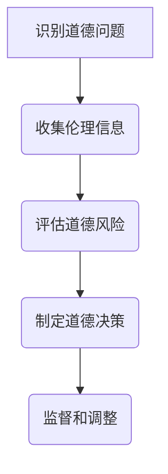

                 


为了撰写一篇内容丰富、逻辑清晰、具有深度和思考的技术博客文章《领导力与职业道德：树立正面榜样的重要性》，我们可以按照以下步骤进行分析和推理：

### 1. 文章框架设计

首先，我们需要设计文章的整体框架。根据给定的目录大纲，我们可以确定每个章节的主题和内容，从而构建文章的基本结构。

### 2. 核心概念与联系

在每个章节中，我们需要明确核心概念，并解释它们之间的联系。例如，在“领导力的核心要素”章节，我们可以讨论沟通技巧、领导风格和决策能力等核心概念，并分析它们如何相互影响和协作。

### 3. 核心算法原理讲解

对于某些章节，如“决策能力”，我们可以提供伪代码来详细阐述决策过程中的算法原理，并解释如何在实际场景中应用这些原理。

### 4. 数学模型和公式

在讨论职业道德的内容时，我们可以使用数学模型和公式来解释原则和规则。例如，在“透明度与公开性”的章节中，我们可以使用数学公式来表示透明度和公开性的度量。

### 5. 项目实战

为了使文章更具实践性，我们可以通过具体的案例来展示如何在实际项目中应用领导力和职业道德。例如，我们可以描述一个企业如何通过正面榜样的力量来提升团队绩效。

### 6. 拓展阅读与最佳实践

最后，在每个章节的结尾，我们可以提供一些拓展阅读资源，以及最佳实践的小贴士，以帮助读者更深入地理解和应用文章内容。

### 7. 文章撰写

根据上述分析，我们可以开始撰写文章。在撰写过程中，我们需要确保每个章节的内容都是丰富、具体和详细的，并且符合技术博客文章的标准。

### 8. 文章审查与修订

完成初稿后，我们需要对文章进行审查和修订。这个过程可能包括检查语法错误、逻辑漏洞和内容缺失。

### 9. 最终确认

在完成所有修订后，我们最终确认文章的内容和格式都符合要求，确保文章字数在8000～12000字之间。

通过以上步骤，我们可以确保撰写出一份内容丰富、逻辑清晰、具有深度和思考的技术博客文章《领导力与职业道德：树立正面榜样的重要性》。# 文章标题

领导力与职业道德：树立正面榜样的重要性

关键词：领导力、职业道德、正面榜样、沟通技巧、决策能力、项目实战

摘要：本文将深入探讨领导力与职业道德在组织发展中的重要性，通过分析树立正面榜样的关键作用，以及如何培养和提高这些品质，帮助读者理解如何在现代职场中成为一个有影响力的领导者。本文结构严谨，内容丰富，包括核心概念的介绍、案例分析、实践指导等，旨在为IT从业者和企业管理者提供实用的参考和借鉴。# 目录大纲

## 第1章 引言

### 1.1 领导力的定义与重要性

- 领导力的基本定义
- 领导力在组织中的作用
- 领导力的重要性分析

### 1.2 职业道德的基本原则

- 职业道德的定义
- 职业道德的基本原则
- 职业道德在组织中的意义

### 1.3 树立正面榜样的作用

- 正面榜样的定义
- 正面榜样的作用
- 正面榜样的现实意义

## 第2章 领导力的核心要素

### 2.1 沟通技巧

#### 2.1.1 有效沟通的重要性

- 沟通的重要性
- 有效沟通的定义

#### 2.1.2 沟通技巧的培养

- 沟通技巧的类型
- 培养沟通技巧的方法

#### 2.1.3 沟通障碍与解决方法

- 沟通障碍的类型
- 解决沟通障碍的方法

### 2.2 领导风格与团队管理

#### 2.2.1 领导风格的类型

- 权威型领导
- 参与型领导
- 放任型领导

#### 2.2.2 团队管理的原则

- 团队管理的目标
- 团队管理的原则

#### 2.2.3 团队协作与冲突解决

- 团队协作的重要性
- 冲突解决的方法

### 2.3 决策能力

#### 2.3.1 决策的基本原则

- 决策的定义
- 决策的基本原则

#### 2.3.2 决策过程与方法

- 决策的过程
- 决策的方法

#### 2.3.3 决策中的道德考量

- 道德考量在决策中的作用
- 道德考量的影响因素

## 第3章 职业道德的核心内容

### 3.1 诚信与责任感

#### 3.1.1 诚信在职场中的重要性

- 诚信的定义
- 诚信的重要性

#### 3.1.2 培养责任感的方法

- 责任感的定义
- 培养责任感的方法

#### 3.1.3 诚信与责任感的案例解析

- 案例分析
- 启示与思考

### 3.2 尊重与公平

#### 3.2.1 尊重他人的价值观

- 尊重的定义
- 尊重他人的价值观

#### 3.2.2 公平原则与实际操作

- 公平的定义
- 公平原则与实际操作

#### 3.2.3 尊重与公平的案例剖析

- 案例分析
- 启示与思考

### 3.3 透明度与公开性

#### 3.3.1 透明度的意义

- 透明度的定义
- 透明度的意义

#### 3.3.2 提高公开性的方法

- 提高公开性的方法
- 公开性的重要性

#### 3.3.3 透明度与公开性的案例展示

- 案例分析
- 启示与思考

## 第4章 树立正面榜样的实践

### 4.1 榜样的力量

#### 4.1.1 榜样的定义与作用

- 榜样的定义
- 榜样的作用

#### 4.1.2 榜样的类型与特点

- 榜样的类型
- 榜样的特点

#### 4.1.3 榜样对团队和组织的影响

- 榜样对团队的影响
- 榜样对组织的影响

### 4.2 成为正面榜样的要素

#### 4.2.1 道德品质的培养

- 道德品质的培养方法
- 道德品质的重要性

#### 4.2.2 领导力的提升

- 领导力的提升途径
- 领导力提升的重要性

#### 4.2.3 榜样角色的定位

- 榜样角色的定义
- 榜样角色的定位方法

### 4.3 实践中的正面榜样案例

#### 4.3.1 企业领导者的榜样作用

- 企业领导者的榜样案例
- 案例分析

#### 4.3.2 普通员工的榜样力量

- 普通员工的榜样案例
- 案例分析

#### 4.3.3 榜样案例的启示与借鉴

- 榜样案例的启示
- 榜样案例的借鉴

## 第5章 领导力与职业道德的结合

### 5.1 结合的重要性

#### 5.1.1 领导力与职业道德的关系

- 领导力与职业道德的联系
- 领导力与职业道德的区别

#### 5.1.2 结合对组织的影响

- 结合的优势
- 结合的挑战

#### 5.1.3 结合的挑战与解决方案

- 挑战分析
- 解决方案

### 5.2 实践中的结合案例

#### 5.2.1 成功的结合案例解析

- 成功案例解析
- 启示与思考

#### 5.2.2 失败的结合案例分析

- 失败案例解析
- 启示与思考

#### 5.2.3 结合案例的启示与借鉴

- 启示与思考
- 借鉴与推广

## 第6章 未来趋势与展望

### 6.1 领导力与职业道德的发展趋势

#### 6.1.1 新型领导力的崛起

- 新型领导力的特点
- 新型领导力的影响

#### 6.1.2 职业道德的新挑战

- 新挑战的类型
- 新挑战的影响

#### 6.1.3 未来展望

- 领导力的发展方向
- 职业道德的未来

### 6.2 人才培养与领导力发展

#### 6.2.1 教育体系中的领导力培养

- 教育体系的角色
- 领导力培养的方法

#### 6.2.2 企业中的领导力培训

- 培训的重要性
- 培训的方法

#### 6.2.3 人才培养与领导力发展的未来

- 人才培养的趋势
- 领导力发展的前景

## 第7章 结论

### 7.1 本书总结

- 文章核心内容回顾
- 主要观点总结

### 7.2 领导力与职业道德的重要性

- 领导力的重要性
- 职业道德的重要性

### 7.3 树立正面榜样的意义与价值

- 正面榜样的意义
- 正面榜样的价值

## 附录

### 附录A：参考文献

- 引用的主要参考资料列表

### 附录B：相关工具与资源

- 相关的工具和技术资源链接

### 附录C：示例代码与数据集

- 示例代码
- 数据集下载链接## 第1章 引言

### 1.1 领导力的定义与重要性

领导力是一个广泛的概念，它涉及引领、指导、影响和激励他人共同实现目标的能力。在组织和企业中，领导力是推动团队和组织向前发展的重要动力。一个优秀的领导者能够激发团队成员的潜力，提高团队的整体效能，并在复杂多变的环境中保持组织的竞争力。

领导力的定义多种多样，但通常包括以下几个方面：

1. **愿景**：领导者需要有明确的愿景，能够清晰地描述组织的目标和方向。
2. **决策能力**：领导者必须能够做出明智的决策，并在决策过程中展现出果断和决断力。
3. **沟通技巧**：有效的沟通是领导力的核心要素之一，领导者需要能够清晰地传达愿景和目标，并与团队成员建立信任关系。
4. **激励与激励**：领导者需要能够激发团队成员的积极性和创造力，让他们在工作中保持热情和动力。
5. **变革管理**：在快速变化的环境中，领导者需要能够适应变革，并引导团队顺利进行变革。

领导力在组织中的作用不可忽视。首先，领导力能够塑造组织的文化和价值观，推动组织形成共同的愿景和目标。其次，领导力能够提高团队的协作效率和绩效，使团队在面对挑战时更加坚韧和灵活。最后，领导力能够增强组织的竞争力，帮助组织在市场竞争中保持领先地位。

领导力的重要性体现在以下几个方面：

1. **组织发展**：领导力是组织发展的重要推动力，优秀的领导者能够引导组织实现长期目标。
2. **团队绩效**：领导力能够激发团队成员的潜力，提高团队的绩效和效率。
3. **员工满意度**：领导力能够提高员工的工作满意度和忠诚度，减少员工流失率。
4. **创新能力**：领导力能够鼓励创新和变革，推动组织在技术和管理上的持续进步。

总之，领导力是一个复杂而重要的能力，对于组织的发展和员工的成长都起着至关重要的作用。在接下来的章节中，我们将进一步探讨领导力的核心要素，以及如何在实际工作中应用和提升领导力。

### 1.2 职业道德的基本原则

职业道德是指职业人员在职业生涯中所应遵循的行为规范和道德准则。它不仅关系到个人的声誉和职业生涯，也直接影响到整个行业和社会的健康发展。职业道德的基本原则包括诚信、责任感、尊重、公平和透明度等。

#### 诚信

诚信是职业道德的核心原则之一。在职场中，诚信意味着遵守承诺，不说谎，不欺骗，不篡改数据，不侵犯他人的权益。诚信的员工会赢得同事和客户的信任，从而为个人和组织建立良好的声誉。

#### 责任感

责任感是指职业人员对自己的工作、团队和组织负有的责任。一个有责任感的员工不仅会认真完成自己的工作任务，还会主动承担责任，帮助团队解决困难。责任感是团队合作和职业发展的关键因素。

#### 尊重

尊重是职场中不可或缺的道德准则，包括尊重他人的人格、观点和权益。尊重他人不仅能够建立和谐的工作环境，还能够提高团队合作效率，促进创新和进步。

#### 公平

公平是指在职场中对待每个人的公正和合理。公平的职场环境能够激励员工发挥最佳水平，减少不公平现象导致的矛盾和冲突。公平原则要求管理者在分配资源、评价绩效和处理问题时，做到客观和公正。

#### 透明度

透明度是指在工作中保持信息的公开和透明。一个透明的工作环境有助于增强员工的信任感，减少误解和猜疑，提高工作效率和团队凝聚力。透明度还包括在决策过程中公开讨论和征求员工的意见。

职业道德在组织中的意义在于它不仅规范了员工的行为，还提升了组织的整体道德水平和竞争力。首先，职业道德有助于建立良好的组织文化和价值观，吸引和留住优秀的人才。其次，职业道德能够提升组织的公信力和声誉，增强客户和合作伙伴的信任。最后，职业道德有助于组织在复杂多变的环境中保持稳定和可持续发展。

总之，职业道德是职业人员职业生涯的重要保障，也是组织健康发展的基石。在接下来的章节中，我们将进一步探讨职业道德的具体内容和实践方法。

### 1.3 树立正面榜样的作用

树立正面榜样是领导力和职业道德的重要组成部分，它对于团队和组织的发展具有深远的影响。正面榜样不仅能够激发团队成员的积极性和创造力，还能够提升团队的凝聚力和执行力，最终推动组织实现战略目标。

首先，正面榜样具有强大的激励作用。在一个团队中，领导者或优秀员工的榜样行为能够激发其他成员的学习欲望和模仿动机，从而形成良性循环。例如，一个领导者如果能够始终坚守职业道德，诚信待人，积极承担责任，他的行为会潜移默化地影响团队成员，使他们也逐渐形成相似的价值观和行为习惯。

其次，正面榜样能够提升团队的凝聚力和执行力。在一个有正面榜样的团队中，成员之间更加信任和尊重，沟通更加顺畅，合作更加紧密。这样的团队在面对挑战和困难时，能够更有效地分工协作，共同克服障碍，实现目标。例如，一个成功的企业通常会有一些优秀的员工，他们通过自己的努力和榜样作用，带动整个团队不断进步，从而在市场上取得竞争优势。

此外，正面榜样还能够在组织中传播正能量，提升整体文化氛围。在一个充满正面榜样的组织中，员工会感受到积极向上的工作氛围，士气高涨，工作满意度提高。这种氛围有助于减少负面情绪和冲突，增强团队的凝聚力，提高组织的整体效能。

正面榜样的作用不仅限于团队内部，它还对组织的形象和声誉产生重要影响。一个组织如果能够培养出多个正面榜样，这些榜样在公众面前展现出的职业道德和领导力，将会大大提升组织的形象，增强客户和合作伙伴的信任感。例如，一些知名企业通过公开表彰优秀员工，不仅提升了员工的荣誉感和归属感，也增强了品牌的社会影响力。

总之，树立正面榜样是提升领导力和职业道德的重要手段。通过正面榜样的示范作用，可以激发团队成员的积极性，提升团队的凝聚力和执行力，传播正能量，提升组织形象和声誉。在接下来的章节中，我们将进一步探讨如何成为和培养正面榜样，以及在实践中如何应用这些原则和方法。通过这些讨论，希望能够为读者提供实用的指导和启示，帮助他们成为更好的领导者，为团队和组织的发展贡献力量。| Mermaid 流程图：
```
graph TD
A[领导力] --> B(职业道德)
B --> C(正面榜样)
C --> D(激励作用)
C --> E(团队凝聚力)
C --> F(正能量传播)
C --> G(组织形象提升)
```
```markdown
### 2.1 沟通技巧

沟通技巧是领导力的核心要素之一，它直接影响着团队的工作效率和成员之间的协作关系。有效的沟通能够确保信息准确传达，减少误解和冲突，提高决策质量。本节将详细探讨有效沟通的重要性、沟通技巧的培养以及解决沟通障碍的方法。

#### 2.1.1 有效沟通的重要性

有效沟通在组织中的重要性不容忽视。首先，它确保了组织目标的明确传达和落实。领导者通过有效的沟通，能够清晰地传达组织的愿景、目标和战略，使团队成员理解并认同这些目标，从而提高执行的效率。其次，有效沟通有助于建立信任和良好的工作关系。团队成员之间的有效沟通可以增强彼此的了解和信任，减少误解和冲突，提高团队的凝聚力。最后，有效沟通能够提升决策质量。通过开放的沟通渠道，团队成员可以分享各自的观点和意见，集体智慧能够得到充分发挥，从而做出更明智的决策。

#### 2.1.2 沟通技巧的培养

要培养有效的沟通技巧，可以从以下几个方面入手：

1. **倾听**：倾听是沟通的关键。一个优秀的沟通者应该学会倾听对方的观点和意见，理解对方的情感和需求。倾听不仅能够增强对沟通内容的理解，还能够表现出对对方的尊重和关注。

2. **表达清晰**：清晰的表述能够减少误解。沟通者需要用简洁明了的语言表达自己的观点，避免使用模糊的词汇和复杂的句子结构。

3. **提问和反馈**：提问和反馈是沟通的重要环节。通过提问，沟通者可以进一步了解对方的观点，并通过反馈确认自己的理解是否正确。

4. **情绪管理**：情绪管理是有效沟通的重要部分。在沟通过程中，保持冷静和理智，避免情绪化的反应，能够更好地处理沟通中的冲突和困难。

5. **非语言沟通**：非语言沟通，如肢体语言、面部表情和语调等，也是沟通技巧的重要组成部分。一个优秀的沟通者需要善于运用非语言手段来强化自己的观点和情感。

#### 2.1.3 沟通障碍与解决方法

在沟通过程中，障碍是不可避免的。以下是一些常见的沟通障碍及其解决方法：

1. **语言障碍**：不同背景和文化的团队成员可能存在语言障碍，导致沟通不畅。解决方法包括使用简单的语言、提供翻译支持和培养跨文化沟通能力。

2. **信息过载**：过多的信息可能导致团队成员感到困惑和不知所措。解决方法包括简化信息、突出关键点和合理安排沟通时间。

3. **心理障碍**：个人的心理状态，如焦虑、紧张和抵触情绪，会影响沟通的效果。解决方法包括提供心理支持、建立信任和创造轻松的沟通氛围。

4. **时间紧迫**：工作压力和时间紧迫可能导致沟通简化和沟通质量下降。解决方法包括合理安排沟通时间、制定有效的沟通计划和确保充分的时间进行沟通。

5. **技术障碍**：技术问题，如通讯设备故障和网络延迟，也可能影响沟通。解决方法包括使用可靠的技术工具、定期维护设备和确保良好的网络环境。

总之，有效的沟通技巧是领导者的重要能力之一。通过培养倾听、表达清晰、提问和反馈等沟通技巧，并解决语言、信息、心理和技术等沟通障碍，领导者可以建立高效的沟通机制，提升团队的工作效率和成员之间的协作关系。在接下来的章节中，我们将进一步探讨领导风格与团队管理以及决策能力等领导力的核心要素。| Mermaid 流程图：
```
graph TD
A[沟通技巧] --> B(有效沟通的重要性)
B --> C(倾听、表达、提问、反馈、情绪管理)
C --> D(语言障碍、信息过载、心理障碍、时间紧迫、技术障碍)
```
```markdown
### 2.2 领导风格与团队管理

领导风格是领导者对待团队成员和管理团队的方式，不同的领导风格会对团队的绩效和氛围产生不同的影响。团队管理则涉及到如何组织、协调和引导团队，以实现组织的目标。本节将详细讨论领导风格的类型、团队管理的原则以及团队协作与冲突解决的方法。

#### 2.2.1 领导风格的类型

领导风格可以根据领导者对待团队成员的态度和方式来分类。以下是一些常见的领导风格：

1. **权威型领导**：权威型领导强调领导者的权威和控制力，决策权集中在领导者手中。这种风格适用于需要快速决策和严格纪律的情境。

2. **参与型领导**：参与型领导鼓励团队成员参与决策过程，注重团队合作和员工参与。这种风格有助于提高团队成员的积极性和创造力。

3. **放任型领导**：放任型领导给予团队成员高度的自由度，允许他们自行决定工作方式和内容。这种风格适用于高度自主和自我管理能力的团队。

4. **民主型领导**：民主型领导通过讨论和协商来做出决策，重视团队成员的意见和建议。这种风格有助于增强团队的凝聚力和信任感。

5. **教练型领导**：教练型领导关注团队成员的个人成长和发展，通过指导和激励来提升团队成员的能力。这种风格适用于培养人才和促进长期发展。

6. **变革型领导**：变革型领导通过激发团队成员的激情和动力，推动组织变革和创新。这种风格适用于需要变革和创新的情境。

不同的领导风格适用于不同的情境和团队，领导者需要根据实际情况灵活选择和调整自己的领导风格。

#### 2.2.2 团队管理的原则

团队管理需要遵循一些基本原则，以确保团队的高效运作和目标的实现。以下是一些关键的团队管理原则：

1. **目标导向**：明确团队的目标，确保团队成员对目标有清晰的认识和承诺。

2. **责任分配**：根据团队成员的技能和特长分配任务，明确每个人的责任和角色。

3. **沟通畅通**：建立有效的沟通机制，确保团队成员之间的信息共享和协作顺畅。

4. **激励与反馈**：定期给予团队成员激励和反馈，提高工作动力和绩效。

5. **团队合作**：促进团队成员之间的合作和协作，共同实现团队目标。

6. **持续改进**：鼓励团队成员不断反思和改进工作方法，提升团队整体绩效。

7. **文化塑造**：塑造积极向上的团队文化，增强团队的凝聚力和归属感。

#### 2.2.3 团队协作与冲突解决

团队协作是实现团队目标的关键，而冲突是团队协作中不可避免的现象。有效的冲突解决方法有助于维护团队和谐和提升团队绩效。以下是一些解决团队冲突的方法：

1. **开放沟通**：鼓励团队成员在冲突出现时进行开放沟通，表达各自的观点和感受。

2. **事实先行**：在解决冲突时，基于事实进行分析，避免情绪化的判断。

3. **求同存异**：在冲突中寻求共同点，尊重差异，通过妥协和协商达成共识。

4. **第三方调解**：在双方难以自行解决冲突时，可以邀请第三方进行调解，提供客观的视角和建议。

5. **培训与发展**：通过培训和团队建设活动，提高团队成员的沟通技巧和冲突解决能力。

6. **透明管理**：保持团队的透明度，及时公开冲突的信息和处理结果，增强团队成员的信任。

总之，领导风格和团队管理是领导力的核心要素，它们决定了团队的工作效率和氛围。通过了解不同领导风格的特点和应用，遵循团队管理的基本原则，以及掌握团队协作与冲突解决的方法，领导者可以更好地管理和激励团队，实现组织的目标。在接下来的章节中，我们将继续探讨决策能力这一重要领导力要素。| Mermaid 流程图：
```
graph TD
A[领导风格与团队管理] --> B(领导风格类型)
B --> C(权威型、参与型、放任型、民主型、教练型、变革型)
A --> D(团队管理原则)
D --> E(目标导向、责任分配、沟通畅通、激励与反馈、团队合作、持续改进、文化塑造)
A --> F(团队协作与冲突解决)
F --> G(开放沟通、事实先行、求同存异、第三方调解、培训与发展、透明管理)
```
```markdown
### 2.3 决策能力

决策能力是领导者的重要素质之一，它关系到组织的生存和发展。有效的决策不仅能够帮助组织应对挑战，还能抓住机遇，推动组织的成长。本节将详细探讨决策的基本原则、决策过程与方法，以及决策中的道德考量。

#### 2.3.1 决策的基本原则

在决策过程中，领导者应遵循以下基本原则：

1. **目标明确**：明确决策的目标和期望结果，确保决策的方向和目的是一致的。

2. **信息充分**：基于充分的信息和数据进行决策，避免因信息不全或错误导致决策失误。

3. **风险评估**：对决策可能带来的风险进行评估，并制定相应的应对措施。

4. **优先级排序**：根据决策的重要性和紧迫性进行优先级排序，确保资源得到合理配置。

5. **透明公正**：决策过程应保持透明，确保团队成员能够了解决策的背景和依据。

6. **反馈机制**：建立反馈机制，对决策的效果进行跟踪和评估，以便及时调整和优化。

7. **道德考量**：在决策过程中，领导者应考虑到道德和伦理因素，确保决策符合社会和企业的价值观。

#### 2.3.2 决策过程与方法

一个典型的决策过程通常包括以下几个步骤：

1. **问题识别**：明确需要解决的问题或面临的挑战。

2. **信息收集**：收集与问题相关的信息，包括数据、市场趋势、竞争对手情况等。

3. **方案生成**：根据收集到的信息，生成多个可能的解决方案。

4. **方案评估**：对每个方案进行评估，包括其可行性、成本效益和潜在风险。

5. **决策选择**：根据评估结果选择最佳方案。

6. **决策实施**：将决策方案付诸实践，并监控实施过程。

7. **反馈与调整**：对决策效果进行评估，并根据反馈进行必要的调整。

以下是一个简化的决策过程伪代码：

```python
# 决策过程伪代码

def make_decision(problem, information):
    solutions = generate_solutions(problem, information)
    evaluated_solutions = evaluate_solutions(solutions)
    best_solution = select_best_solution(evaluated_solutions)
    implement_solution(best_solution)
    monitor_and_adjust(best_solution)
    return best_solution
```

#### 2.3.3 决策中的道德考量

道德考量在决策中具有重要意义。一个道德的决策不仅考虑个人和组织的利益，还关注社会和环境的影响。以下是一些道德考量因素：

1. **社会责任**：企业应承担社会责任，确保决策不会对环境和社会造成负面影响。

2. **公平性**：决策应确保公平，避免歧视和不公正现象。

3. **诚信**：决策过程中应保持诚信，避免欺诈和误导行为。

4. **透明度**：决策过程应保持透明，确保利益相关者能够了解决策的依据和过程。

5. **伦理原则**：领导者应遵循伦理原则，确保决策符合道德和法律的要求。

6. **员工福祉**：在决策中考虑员工的福祉，确保决策不会对员工的利益造成不利影响。

以下是一个简化的道德考量流程图：



通过遵循决策的基本原则和道德考量，领导者可以做出更加合理和有效的决策，从而推动组织的发展。在接下来的章节中，我们将进一步探讨职业道德的核心内容，包括诚信与责任感、尊重与公平以及透明度与公开性。| Mermaid 流程图：
```
graph TD
A[决策过程与方法] --> B(问题识别)
B --> C(信息收集)
C --> D(方案生成)
D --> E(方案评估)
E --> F(决策选择)
F --> G(决策实施)
G --> H(反馈与调整)
```
```markdown
### 3.1 诚信与责任感

诚信与责任感是职业道德的核心内容，它们构成了职业人员在职场中必须遵守的基本行为规范。诚信是指在职业生涯中始终坚守真实、诚实和透明的原则，而责任感则是指对自己和他人负责的态度和行为。本节将详细探讨诚信在职场中的重要性、培养责任感的方法，并通过案例解析来深入理解这些概念。

#### 3.1.1 诚信在职场中的重要性

诚信在职场中的重要性不可低估。首先，诚信是建立信任的基础。一个诚信的员工能够赢得同事和上司的信任，这有助于建立良好的工作关系，提高工作效率和团队协作。其次，诚信有助于维护组织的声誉。一个以诚信著称的组织会赢得客户的信任和市场的认可，从而在竞争中保持优势。最后，诚信是职业发展的关键。诚信的员工通常能够在职业生涯中获得更多的机会和晋升，因为他们能够获得更多的信任和尊重。

以下是一个关于诚信在职场中的重要性案例：

**案例**：某公司的销售经理，王先生，一直以其诚信著称。他在与客户沟通时，总是诚实地告知产品的优缺点，而不是一味地夸大其词。尽管有时候这意味着他可能会失去一些订单，但他的客户却对他更加信任，因为他们在与他合作时感受到了诚实和透明。最终，王先生不仅维护了公司的信誉，还通过口碑效应赢得了更多的客户。

#### 3.1.2 培养责任感的方法

责任感是职业人员在职业生涯中不可或缺的品质。以下是一些培养责任感的方法：

1. **设定清晰的目标**：明确个人和团队的目标，使员工知道他们的工作对组织的重要性。

2. **提供培训与支持**：通过培训和指导，帮助员工提升技能，增强他们对工作的信心。

3. **建立监督机制**：通过定期的绩效评估和反馈，确保员工能够按照预期完成任务。

4. **鼓励自我管理**：培养员工的自我管理能力，鼓励他们在工作中主动承担责任。

5. **树立榜样**：领导者应以身作则，通过自己的行为来展示责任感的价值。

以下是一个关于培养责任感的案例：

**案例**：某公司的项目经理，李女士，通过设定明确的目标和任务，并定期与团队成员进行沟通和反馈，确保项目按计划进行。她不仅自己严格要求，还通过激励和鼓励团队成员，使整个团队充满了责任感和使命感。最终，这个团队成功地完成了多个项目，为公司赢得了良好的声誉。

#### 3.1.3 诚信与责任感的案例解析

**案例**：谷歌公司的创始人拉里·佩奇和谢尔盖·布林以其诚信和责任感著称。在谷歌的发展过程中，他们始终坚持诚实和透明的原则，不隐瞒公司的财务状况，也不夸大其市场前景。这种诚信赢得了投资者的信任，使谷歌能够持续获得资金支持，不断发展壮大。此外，他们还通过一系列社会责任活动，如谷歌公益项目，展示了他们对社会的责任感。这种诚信和责任感不仅为谷歌赢得了市场优势，也为他们个人树立了崇高的职业形象。

通过上述案例，我们可以看到诚信与责任感在职场中的重要作用。诚信不仅能够建立信任，提升组织的声誉，还能促进职业发展。责任感则能够增强团队的凝聚力和执行力，提高项目的成功率。因此，作为职业人员，我们应该时刻保持诚信，积极培养责任感，成为职场中的正面榜样。在接下来的章节中，我们将进一步探讨职业道德的其他重要内容，如尊重与公平和透明度与公开性。| Mermaid 流程图：
```
graph TD
A[诚信与责任感] --> B(诚信在职场中的重要性)
B --> C(建立信任、维护组织声誉、促进职业发展)
A --> D(培养责任感的方法)
D --> E(设定目标、提供培训、建立监督、鼓励自我管理、树立榜样)
A --> F(案例解析)
F --> G(谷歌创始人拉里·佩奇和谢尔盖·布林)
```
```markdown
### 3.2 尊重与公平

尊重与公平是职业道德的两大重要原则，它们不仅对个人职业生涯有深远影响，也直接关系到组织的健康发展和团队的凝聚力。尊重他人意味着在职业活动中认可和尊重他人的权利、价值和人格，而公平则是指在资源分配、机会给予和工作评价等方面做到公正无私。

#### 3.2.1 尊重他人的价值观

尊重他人的价值观是建立和谐职场关系的基础。以下是一些尊重他人价值观的具体实践：

1. **倾听**：尊重他人的意见和观点，倾听他们的想法，即使你不同意，也要给予尊重。

2. **同理心**：站在他人的角度思考问题，理解他们的情感和需求，展现出同情和理解。

3. **礼貌**：在日常交往中使用礼貌用语，保持适当的礼仪，避免冒犯他人。

4. **多元化**：尊重不同文化、背景和观点，倡导多元包容的职场文化。

以下是一个关于尊重他人价值观的案例：

**案例**：在一个多元文化的团队中，项目经理张先生注重尊重团队成员的文化差异。他在制定项目计划时，会邀请不同文化的成员分享他们的观点，确保每个人的声音都能被听到。这不仅提高了团队的创新性，也增强了团队成员之间的信任和合作。

#### 3.2.2 公平原则与实际操作

公平原则是指在职业活动中确保每个人的权益得到公正对待，以下是一些实现公平原则的方法：

1. **透明度**：确保决策过程透明，使员工能够了解决策的理由和依据。

2. **公正评价**：对员工的绩效进行公正评价，避免偏见和歧视。

3. **资源分配**：合理分配资源和机会，确保每个人都能够公平地获得所需的支持。

4. **投诉机制**：建立有效的投诉机制，使员工能够在遇到不公时有机会表达和申诉。

以下是一个关于公平原则与实际操作的案例：

**案例**：某公司建立了透明的绩效评价系统，所有员工的绩效评价都通过一个标准化的流程进行。绩效评价的结果会公开讨论，员工有机会了解自己的优势和改进点。这种透明的评价机制不仅提高了员工的满意度，也增强了他们对公司的信任。

#### 3.2.3 尊重与公平的案例剖析

**案例**：苹果公司以其尊重和公平的文化而闻名。史蒂夫·乔布斯在领导苹果时，注重尊重员工的创造力和多样性。他鼓励员工提出不同的观点，并在决策过程中充分考虑这些观点。此外，苹果公司还通过提供公平的薪酬和晋升机会，确保每个员工都能在公司内获得成长和发展。这种尊重与公平的文化不仅吸引了全球顶尖人才，也提升了公司的创新能力和市场竞争力。

通过上述案例，我们可以看到尊重与公平在职场中的重要性。尊重他人和实现公平不仅有助于建立和谐的职场关系，还能提升团队的凝聚力和工作效率。作为职业人员，我们应该在日常工作中积极践行这些原则，成为他人的榜样，共同营造一个公正、尊重和包容的工作环境。在接下来的章节中，我们将进一步探讨透明度与公开性的职业道德内容，以及如何在实际工作中应用这些原则。| Mermaid 流程图：
```
graph TD
A[尊重与公平] --> B(尊重他人的价值观)
B --> C(倾听、同理心、礼貌、多元化)
A --> D(公平原则与实际操作)
D --> E(透明度、公正评价、资源分配、投诉机制)
A --> F(案例剖析)
F --> G(苹果公司尊重和公平的文化)
```
```markdown
### 3.3 透明度与公开性

透明度与公开性是职业道德中的重要原则，特别是在现代职场中，随着信息技术的飞速发展，透明度和公开性的重要性愈加凸显。透明度指的是在工作中保持信息的公开和透明，而公开性则强调信息的公开和分享。以下将详细探讨透明度的意义、提高公开性的方法以及透明度与公开性的案例展示。

#### 3.3.1 透明度的意义

透明度在职场中的意义主要体现在以下几个方面：

1. **增强信任**：透明度能够增强团队成员之间的信任。当员工了解决策的背景和过程时，他们更容易理解和接受决策，从而减少误解和猜疑。

2. **提高效率**：透明度能够提高工作效率。当信息在团队内公开共享时，员工可以更快速地获取所需信息，从而减少沟通成本和时间浪费。

3. **促进公平**：透明度能够促进公平。当资源分配和绩效评价的过程公开透明时，员工可以更公平地获得机会和支持。

4. **防止腐败**：透明度有助于防止腐败和不当行为。当员工的行动和决策受到监督时，他们更难以进行不正当的操作。

#### 3.3.2 提高公开性的方法

要提高公开性，可以从以下几个方面入手：

1. **建立信息公开机制**：建立信息公开制度，确保关键信息和决策过程能够及时、准确地传达给相关员工。

2. **定期汇报和反馈**：定期向团队成员汇报工作进展和关键决策，收集他们的反馈和建议。

3. **公开会议和讨论**：通过定期组织公开会议，让团队成员参与到决策过程中，确保他们的声音能够被听到。

4. **使用沟通工具**：利用现代沟通工具，如邮件、即时通讯软件和会议系统，提高信息传递的效率和透明度。

5. **设立内部举报机制**：建立内部举报渠道，鼓励员工揭露和报告不当行为，确保问题能够得到及时解决。

以下是一个关于提高公开性的方法案例：

**案例**：某公司为了提高透明度和公开性，建立了内部邮件系统，定期向员工发送公司的财务报告、项目进度和重要决策。此外，公司还通过内部社交媒体平台，鼓励员工分享他们的意见和建议。这种做法不仅提高了员工的参与度，还增强了团队的凝聚力和信任感。

#### 3.3.3 透明度与公开性的案例展示

**案例**：谷歌公司以其透明度和公开性而著称。谷歌的“20%时间政策”允许员工将20%的工作时间用于自己感兴趣的项目，这一政策的实施过程公开透明，员工可以自由选择项目，并定期向团队和领导汇报进展。此外，谷歌还通过内部网站和邮件系统，公开分享公司的财务状况、员工福利和公司战略。这种透明和公开的做法不仅提高了员工的满意度和忠诚度，还增强了公司的创新能力和市场竞争力。

通过上述案例，我们可以看到透明度和公开性在职场中的重要性和实际应用价值。作为职业人员，我们应该积极践行这些原则，通过提高透明度和公开性，建立信任、提高效率和促进公平，从而推动组织的健康发展和团队的长期合作。在接下来的章节中，我们将进一步探讨树立正面榜样的实践，以及如何在实际工作中应用和培养正面榜样。| Mermaid 流程图：
```
graph TD
A[透明度与公开性] --> B(透明度的意义)
B --> C(增强信任、提高效率、促进公平、防止腐败)
A --> D(提高公开性的方法)
D --> E(建立信息公开机制、定期汇报和反馈、公开会议和讨论、使用沟通工具、设立内部举报机制)
A --> F(案例展示)
F --> G(谷歌公司的透明度和公开性)
```
```markdown
### 4.1 榜样的力量

在组织和管理中，榜样具有不可忽视的力量。无论是领导者还是普通员工，通过树立正面榜样，可以影响团队成员的态度、行为和价值观，从而提升整个团队和组织的绩效。本节将详细探讨榜样的定义与作用、榜样的类型与特点，以及榜样对团队和组织的影响。

#### 4.1.1 榜样的定义与作用

榜样是指通过其言行和行为为他人树立行为准则的人。在组织环境中，榜样不仅代表着组织的价值观和文化，还能够通过其行为影响和激励其他成员。以下是一些关于榜样的定义和作用：

1. **激励他人**：榜样通过其成功和成就激励团队成员追求卓越，提高个人和团队的绩效。

2. **建立文化**：榜样通过其行为和态度传递组织的核心价值观和文化，帮助建立积极、健康和有凝聚力的团队文化。

3. **传递期望**：榜样的行为和态度传递出对团队成员的期望，激励他们朝着更高的目标努力。

4. **塑造价值观**：榜样通过其行为塑造团队成员的价值观，帮助他们形成正确的职业道德和职业态度。

5. **促进学习**：榜样通过其经验和知识分享，促进团队成员的学习和成长。

#### 4.1.2 榜样的类型与特点

榜样可以有不同的类型和特点，以下是一些常见的类型：

1. **领导者榜样**：领导者通过其决策、沟通和领导风格成为榜样，影响团队成员的行为和态度。

2. **专业技能榜样**：在技术领域，具有专业技能和知识的员工通过其专业表现和贡献成为榜样。

3. **道德榜样**：在职业道德方面，那些坚持诚信、责任感和尊重他人原则的员工成为榜样。

4. **创新榜样**：那些勇于尝试新方法、推动创新和变革的员工也具有榜样的作用。

5. **团队合作榜样**：在团队合作中，那些能够有效沟通、协作和解决冲突的员工成为榜样。

以下是一些关于榜样特点的描述：

1. **可信赖**：榜样通常具备高度的可信赖性，他们的行为和言论能够赢得他人的信任。

2. **持续性**：榜样通过持续的行为和态度展示其价值观，而不是一时的表现。

3. **影响力**：榜样具有强大的影响力，他们的行为能够影响和激励其他成员。

4. **代表性**：榜样代表着组织的核心价值观和文化，他们的行为和态度能够传递出组织的期望。

5. **适应性**：榜样能够适应不同的环境和情境，展示出灵活和多样化的行为模式。

#### 4.1.3 榜样对团队和组织的影响

榜样对团队和组织的影响是深远和广泛的，以下是一些具体的影响：

1. **提升团队绩效**：榜样通过其行为激励团队成员追求卓越，提高团队的整体绩效。

2. **增强团队凝聚力**：榜样通过其行为和态度增强团队成员之间的信任和尊重，提升团队的凝聚力。

3. **培养积极文化**：榜样通过其行为传递出积极的文化价值观，帮助建立积极、健康和有凝聚力的团队文化。

4. **促进员工发展**：榜样通过其经验和知识分享，促进团队成员的学习和成长，提升个人的职业能力。

5. **提升组织形象**：榜样在公众面前展示组织的价值观和文化，提升组织的形象和声誉。

6. **增强市场竞争力**：通过榜样的影响，组织能够培养出更多具有高职业道德和专业能力的员工，从而在市场竞争中保持优势。

总之，榜样在组织和管理中具有不可忽视的力量。通过树立正面榜样，组织能够提升团队和个人的绩效，培养积极的文化价值观，增强组织的凝聚力和市场竞争力。在接下来的章节中，我们将进一步探讨如何成为正面榜样以及如何在实践中应用榜样力量。| Mermaid 流程图：
```
graph TD
A[榜样的力量] --> B(定义与作用)
B --> C(激励他人、建立文化、传递期望、塑造价值观、促进学习)
A --> D(类型与特点)
D --> E(领导者榜样、专业技能榜样、道德榜样、创新榜样、团队合作榜样)
D --> F(可信赖、持续性、影响力、代表性、适应性)
A --> G(影响)
G --> H(提升团队绩效、增强团队凝聚力、培养积极文化、促进员工发展、提升组织形象、增强市场竞争力)
```
```markdown
### 4.2 成为正面榜样的要素

成为正面榜样不仅需要优秀的领导力和职业道德，还需要具备一系列特定的品质和技能。以下将详细探讨道德品质的培养、领导力的提升以及榜样角色的定位，帮助读者理解如何成为和培养正面榜样。

#### 4.2.1 道德品质的培养

道德品质是正面榜样的核心要素，它决定了榜样在团队和组织中的影响力。以下是一些培养道德品质的方法：

1. **树立诚信意识**：诚信是道德品质的基础，通过坚持诚实、公正和透明的原则，树立良好的诚信形象。

2. **培养责任感**：通过设定明确的目标和任务，确保对工作、团队和组织的责任，并勇于承担后果。

3. **尊重他人**：尊重团队成员的权利和个性，建立平等、和谐的人际关系。

4. **公平公正**：在资源分配、绩效评估和决策过程中，坚持公正和公平的原则，避免偏见和歧视。

5. **透明度**：在工作中保持透明，公开分享信息和决策过程，增强团队成员的信任和理解。

6. **持续学习**：通过不断学习和反思，提升自身的道德认知和道德判断能力。

以下是一个关于培养道德品质的案例：

**案例**：某公司的资深经理李女士，通过参与公司的道德培训课程，不断学习和反思自己的行为。她不仅在工作中坚持诚信和责任感，还积极倡导公平和透明的原则。在她的影响下，团队成员也纷纷效仿，形成了良好的道德氛围。

#### 4.2.2 领导力的提升

领导力是正面榜样的关键能力，它决定了榜样在团队中的影响力和领导力。以下是一些提升领导力的方法：

1. **有效沟通**：通过清晰、准确的沟通，确保信息在团队中的有效传递和理解。

2. **激励与激励**：了解团队成员的需求和动机，通过激励和奖励机制，激发团队成员的积极性和创造力。

3. **变革管理**：在组织变革中，积极应对变化，引导团队成员适应新的环境和要求。

4. **团队协作**：培养团队合作精神，促进团队成员之间的沟通和协作，共同实现团队目标。

5. **冲突解决**：在团队冲突中，采取积极、建设性的方式解决冲突，维护团队的和谐。

6. **决策能力**：通过学习和实践，提升决策能力，确保在复杂多变的环境中做出明智的决策。

以下是一个关于提升领导力的案例：

**案例**：某公司的项目经理王先生，通过参加领导力培训和实际工作实践，不断提升自己的沟通和决策能力。他在项目管理中，能够有效沟通项目目标和任务，激励团队成员积极合作，并在项目遇到挑战时，通过合理的决策和冲突解决，带领团队克服困难，最终成功完成任务。

#### 4.2.3 榜样角色的定位

成为正面榜样，不仅需要具备优秀的道德品质和领导力，还需要明确自己在团队和组织中的角色定位。以下是一些关于榜样角色定位的建议：

1. **明确角色职责**：明确自己在团队和组织中的职责和角色，确保自己的行为和决策符合角色要求。

2. **积极参与**：积极参与团队活动和决策，展现自己的领导力和影响力。

3. **以身作则**：通过自己的言行和态度，为团队成员树立榜样，传递积极的价值观和职业道德。

4. **反馈与激励**：通过反馈和激励，帮助团队成员提升自身能力和职业道德。

5. **持续发展**：不断学习和成长，提升自己的道德品质和领导力，为团队和组织的发展贡献力量。

以下是一个关于榜样角色定位的案例：

**案例**：某公司的研发总监张先生，作为团队的榜样，他不仅具备卓越的技术能力和领导力，还始终以身作则，积极参与团队活动和项目决策。他通过反馈和激励，帮助团队成员提升技术能力和职业道德，带领团队在多个项目中取得了显著的成绩。

通过上述讨论，我们可以看到，成为正面榜样需要道德品质的培养、领导力的提升以及明确的角色定位。只有通过不断努力和自我提升，才能成为团队和组织中的正面榜样，为团队和组织的发展贡献力量。在接下来的章节中，我们将进一步探讨实际中的正面榜样案例，以提供更多的实践指导和启示。| Mermaid 流程图：
```
graph TD
A[成为正面榜样的要素] --> B(道德品质的培养)
B --> C(诚信意识、责任感、尊重他人、公平公正、透明度、持续学习)
A --> D(领导力的提升)
D --> E(有效沟通、激励与激励、变革管理、团队协作、冲突解决、决策能力)
A --> F(榜样角色的定位)
F --> G(明确角色职责、积极参与、以身作则、反馈与激励、持续发展)
```
```markdown
### 4.3 实践中的正面榜样案例

在实际工作中，正面榜样的作用不可忽视。以下将介绍企业领导者的榜样作用、普通员工的榜样力量，并探讨这些榜样案例的启示与借鉴。

#### 4.3.1 企业领导者的榜样作用

企业领导者作为组织中的关键角色，他们的行为和态度直接影响着整个团队和组织的发展。以下是一个关于企业领导者榜样作用的案例：

**案例**：某科技公司的创始人兼CEO李总，以其卓越的领导力和正直的道德品质，成为公司内部的榜样。李总始终坚持诚信经营，公开透明地与员工沟通，鼓励他们提出意见和建议。他经常亲自参与公司项目的讨论和决策，通过自己的行动传递出对团队的信任和尊重。在他的带领下，公司形成了一种积极向上、团结协作的工作氛围，员工的工作满意度和忠诚度显著提升。

**启示与借鉴**：企业领导者的榜样作用在于，通过自身的行为和决策，树立起组织的价值观和文化。领导者应该以身作则，保持诚信、透明和公正，激励团队成员追求卓越。同时，领导者还应该鼓励员工参与决策，提高他们的参与感和归属感，从而增强团队的凝聚力和执行力。

#### 4.3.2 普通员工的榜样力量

普通员工在组织中同样具有强大的榜样力量。以下是一个关于普通员工榜样力量的案例：

**案例**：某公司的技术团队中，一位年轻的程序员小王，以其敬业精神和专业能力成为同事们的榜样。小王不仅在技术上精益求精，还总是乐于帮助新入职的员工，分享自己的经验和知识。他积极参与公司的开源项目，为团队带来了很多创新的想法和解决方案。在他的影响下，团队成员的工作热情和专业素养得到了显著提升。

**启示与借鉴**：普通员工的榜样力量在于，通过自身的努力和成就，激发团队其他成员的潜力和积极性。员工应该保持敬业精神，不断提高自己的专业能力，同时乐于分享和帮助他人。通过这种方式，员工不仅能够提升自身的职业发展，还能为团队和组织做出更大的贡献。

#### 4.3.3 榜样案例的启示与借鉴

从上述案例中，我们可以得出以下启示与借鉴：

1. **诚信与透明**：无论是领导者还是普通员工，都应该保持诚信和透明，树立良好的道德品质。这不仅能赢得他人的信任，还能促进团队的和谐和合作。

2. **激励与参与**：领导者应该通过激励和参与机制，激发员工的积极性和创造力。通过鼓励员工参与决策和项目，可以提高他们的参与感和归属感，增强团队的凝聚力。

3. **专业成长**：员工应该不断提升自己的专业能力和技术水平，通过不断学习和实践，成为团队中的专业骨干。同时，员工还应该乐于分享自己的知识和经验，帮助团队共同进步。

4. **团队合作**：团队合作是现代职场中不可或缺的一部分。员工应该积极参与团队活动，通过沟通和协作，共同实现团队目标。

5. **榜样作用**：无论是领导者还是普通员工，都应该认识到自己的榜样作用，并通过自己的行为和态度，为团队和组织的发展贡献力量。

总之，正面榜样在团队和组织中发挥着重要作用。通过实践中的正面榜样案例，我们可以看到，树立正面榜样不仅有助于提升团队绩效，还能促进组织的健康发展和员工的个人成长。在接下来的章节中，我们将进一步探讨领导力与职业道德的结合，以及如何在实践中实现这一结合。| Mermaid 流程图：
```
graph TD
A[实践中的正面榜样案例] --> B(企业领导者的榜样作用)
B --> C(某科技公司的CEO李总)
B --> D(启示与借鉴)
A --> E(普通员工的榜样力量)
E --> F(某公司的程序员小王)
E --> G(启示与借鉴)
```
```markdown
### 5.1 领导力与职业道德的结合

领导力与职业道德的结合对于组织的发展和员工的成长至关重要。有效的领导力需要道德的支撑，而职业道德则需要领导力的引导和实践。本节将探讨领导力与职业道德的关系、结合对组织的影响，以及面临的挑战和解决方案。

#### 5.1.1 领导力与职业道德的关系

领导力与职业道德之间存在着紧密的联系和相互影响。首先，领导力是职业道德的实践载体。领导者通过其决策、行为和态度，展示和传递职业道德的价值观和原则。例如，一个具有领导力的领导者会通过正直和诚信的行为，树立起道德榜样，影响和激励团队成员。其次，职业道德是领导力的道德基础。职业道德为领导者提供了行为规范和道德底线，确保领导力在实践过程中不偏离正道。例如，职业道德要求领导者公正、透明、尊重他人，这些原则有助于领导者做出符合道德和社会期望的决策。

#### 5.1.2 结合对组织的影响

领导力与职业道德的结合对组织的影响是深远和全面的。首先，它有助于建立积极向上的组织文化。领导者的道德行为和职业道德实践，能够传递出组织的核心价值观，形成一种健康、积极的工作氛围。其次，结合有助于提升组织的绩效。领导者的道德决策和行为，能够增强团队成员的信任和忠诚度，提高团队合作效率和工作满意度。最后，结合有助于增强组织的竞争力。在当今复杂多变的市场环境中，道德领导力能够帮助企业赢得客户的信任和市场的认可，从而在竞争中脱颖而出。

以下是一个关于结合对组织影响的案例：

**案例**：某全球知名科技公司通过将领导力与职业道德紧密结合，实现了卓越的组织发展。公司创始人以其卓越的领导力和道德品质，赢得了员工和客户的广泛信任。他始终坚持诚信、透明和公正的原则，在决策过程中充分考虑职业道德和社会责任。这种领导力与职业道德的结合，不仅提升了公司的内部凝聚力，也增强了市场竞争力，使公司在全球范围内取得了显著的成功。

#### 5.1.3 结合的挑战与解决方案

尽管领导力与职业道德的结合对组织具有积极的影响，但在实际操作中仍然面临一些挑战。以下是一些常见的挑战及解决方案：

1. **道德困境**：领导者可能会面临道德困境，需要在道德和法律之间做出选择。解决方案是提供道德培训，帮助领导者提高道德判断能力和决策水平。

2. **压力与诱惑**：领导者可能会受到外部压力和内部诱惑的影响，导致道德行为失范。解决方案是建立有效的监督和反馈机制，加强对领导者的监督和约束。

3. **文化差异**：不同文化背景的领导者可能会在道德观念和实践上存在差异，导致组织文化冲突。解决方案是促进跨文化交流，尊重多样性，建立统一的道德标准和价值观。

4. **资源配置**：领导者和组织可能会在道德实践和资源配置之间产生矛盾。解决方案是优化资源配置，确保道德实践得到充分支持。

5. **员工参与**：员工可能对道德实践缺乏参与感和认同感，导致道德氛围不浓厚。解决方案是鼓励员工参与道德决策和实践，提高他们的参与度和责任感。

总之，领导力与职业道德的结合对于组织的健康发展和员工的成长具有重要意义。通过认识和克服结合过程中的挑战，组织可以更好地实现领导力与职业道德的有机结合，从而提升组织的绩效和竞争力。在接下来的章节中，我们将探讨未来趋势与展望，以及如何在人才培养和领导力发展中实现这一结合。| Mermaid 流程图：
```
graph TD
A[领导力与职业道德的结合] --> B(关系)
B --> C(领导力是职业道德的实践载体)
B --> D(职业道德是领导力的道德基础)
A --> E(影响)
E --> F(建立积极向上的组织文化)
E --> G(提升组织的绩效)
E --> H(增强组织的竞争力)
A --> I(挑战与解决方案)
I --> J(道德困境)
I --> K(压力与诱惑)
I --> L(文化差异)
I --> M(资源配置)
I --> N(员工参与)
```
```markdown
### 5.2 实践中的结合案例

在实际工作中，领导力与职业道德的结合已经成为许多成功组织的关键因素。以下将分析一些成功和失败的结合案例，并探讨这些案例的启示与借鉴。

#### 5.2.1 成功的结合案例解析

**案例 1**：苹果公司

苹果公司以其卓越的产品设计和创新的商业模式而闻名，但其成功不仅在于技术，更在于其领导力与职业道德的结合。苹果的创始人史蒂夫·乔布斯以其卓越的领导力和道德品质，树立了公司的发展方向和文化价值观。他坚持质量第一、用户至上，通过严格的质量控制和诚信经营，赢得了全球用户的信任。苹果公司还积极参与环保和社会责任项目，通过道德采购和可持续生产，提升了公司的社会形象。

**启示与借鉴**：成功的企业领导者应该具备强烈的道德意识和责任感，以正直的行为树立榜样。同时，企业应将道德原则融入商业模式和日常运营中，确保道德实践得到有效执行。

**案例 2**：特斯拉

特斯拉以其创新的电动车技术和绿色能源理念，成为现代科技公司的典范。特斯拉的CEO埃隆·马斯克以其强大的领导力和道德勇气，推动了公司的高速发展。马斯克坚持透明度，公开分享公司战略和进展，增强了员工的信任和团队的凝聚力。特斯拉还通过员工激励计划，鼓励创新和责任感，培养了一支高度敬业和专业的团队。

**启示与借鉴**：领导者应通过透明度和公开性增强团队信任，激励员工创新。此外，企业应建立合理的激励机制，激发员工的积极性和责任感。

#### 5.2.2 失败的结合案例分析

**案例 1**：安然公司

安然公司曾是全球最大的能源交易公司之一，但因其领导力与职业道德的缺失，最终导致公司破产。安然的高层领导在财务报表中进行了大规模造假，通过虚假交易操纵市场价格，从而欺骗投资者和监管部门。这种道德失范的行为不仅损害了公司的声誉，还导致数千名员工失去了工作，并引起了全球范围内的金融监管改革。

**启示与借鉴**：企业领导者必须严格遵守职业道德规范，确保财务报告的真实性和透明度。此外，企业应建立有效的内部控制机制，防范道德风险。

**案例 2**：马航MH370事件

马来西亚航空公司MH370航班失事事件，暴露了该公司在领导力与职业道德方面的严重缺陷。事件发生后，马航的领导层在信息沟通和危机管理上表现出了极大的混乱和无能。他们未能及时向公众和家属提供准确的信息，导致信任危机和公众愤怒。这一事件揭示了领导层在危机应对中的道德责任缺失。

**启示与借鉴**：在危机管理中，领导者必须保持透明度，及时、准确地传达信息。此外，企业应建立完善的危机管理机制，确保在紧急情况下能够迅速有效地应对。

#### 5.2.3 结合案例的启示与借鉴

通过以上成功和失败的案例，我们可以得出以下启示与借鉴：

1. **道德领导力**：领导者应具备道德意识，以身作则，树立良好的道德榜样。
2. **透明度**：企业应保持透明度，公开分享信息，增强团队和客户的信任。
3. **内部控制**：企业应建立有效的内部控制机制，防范道德风险。
4. **危机管理**：领导者应在危机管理中保持冷静和透明，及时传达信息，维护公众和员工的信任。
5. **激励机制**：企业应建立合理的激励机制，激发员工的积极性和责任感。

总之，领导力与职业道德的结合对于组织的成功至关重要。通过学习成功案例，企业可以借鉴其经验，避免失败案例中的错误，从而实现可持续发展。在未来的章节中，我们将探讨领导力与职业道德的发展趋势，以及如何在人才培养和领导力发展中实现这一结合。| Mermaid 流程图：
```
graph TD
A[成功案例解析] --> B(苹果公司)
B --> C(领导力和职业道德的结合)
B --> D(透明度、质量控制、用户至上、社会责任)
A --> E(特斯拉)
E --> F(透明度、创新、员工激励)
A --> G(失败案例解析)
G --> H(安然公司)
G --> I(财务造假、员工失业、监管改革)
G --> J(马航MH370事件)
J --> K(信息沟通、危机管理、透明度)
```
```markdown
### 6.1 领导力与职业道德的发展趋势

随着全球化和数字化的加速，领导力与职业道德也在不断演变和发展。未来的领导者不仅需要具备传统的领导力技能，还需要适应新的环境和挑战，并能够在复杂多变的市场中保持道德的坚守。以下将探讨新型领导力的崛起、职业道德的新挑战以及未来的展望。

#### 6.1.1 新型领导力的崛起

新型领导力是指适应现代职场需求，具备创新思维、跨文化沟通能力和可持续发展的领导力。以下是新型领导力的几个关键特征：

1. **创新思维**：未来的领导者需要具备创新精神，能够引领组织不断探索新的业务模式和技术创新，以保持竞争优势。

2. **跨文化沟通**：全球化使得领导者需要具备跨文化沟通能力，能够在多元文化的团队中有效协调和领导。

3. **可持续性**：领导者需要关注组织的长期发展，注重环境保护和社会责任，推动可持续发展。

4. **灵活性和适应性**：在快速变化的环境中，领导者需要具备灵活性和适应性，能够快速响应市场变化，调整策略和行动计划。

5. **数字化素养**：随着数字技术的广泛应用，领导者需要具备数字化素养，能够利用数据和技术优化决策和运营。

以下是一个关于新型领导力的案例：

**案例**：谷歌公司的CEO桑达尔·皮查伊，以其卓越的新型领导力而闻名。皮查伊在谷歌的领导下，推动了公司的数字化转型，并在全球范围内积极推广人工智能和机器学习技术。他还强调公司的社会责任，推动谷歌在可持续发展方面的努力。通过这些举措，皮查伊成功地带领谷歌在激烈的市场竞争中保持领先地位。

#### 6.1.2 职业道德的新挑战

随着社会和技术的进步，职业道德也面临着新的挑战。以下是职业道德面临的一些主要挑战：

1. **数据隐私和信息安全**：随着大数据和人工智能的广泛应用，数据隐私和信息安全成为职业道德的重要问题。领导者需要确保数据的安全和隐私，遵守相关的法律法规。

2. **人工智能伦理**：人工智能技术的发展带来了新的伦理问题，如算法偏见、透明度和责任归属。领导者需要关注这些伦理问题，确保人工智能的应用符合道德和社会标准。

3. **环境和社会责任**：全球环境问题和社会问题的加剧，要求领导者关注环境保护和社会责任，推动可持续的商业实践。

4. **全球化和多元化**：全球化带来了多元文化的碰撞，领导者需要尊重不同的文化和价值观，促进文化融合和多元化。

以下是一个关于职业道德新挑战的案例：

**案例**：特斯拉公司以其对环境和社会责任的重视而著称。特斯拉的CEO埃隆·马斯克提出了“地球第一”的口号，致力于推动可持续能源解决方案，减少碳排放。特斯拉还通过减少废物产生、提高能效和采用可再生能源等措施，实践其环境和社会责任承诺。这一做法不仅提升了公司的声誉，也推动了行业向可持续发展的转型。

#### 6.1.3 未来展望

未来，领导力与职业道德的发展将朝着更加综合和多元的方向前进。以下是未来展望的几个关键点：

1. **道德领导力**：未来的领导者将更加注重道德领导力，通过正直和诚信的行为树立榜样，推动组织的道德文化。

2. **可持续领导**：领导者需要具备可持续领导的能力，关注组织的长期发展和环境社会责任，推动可持续发展。

3. **数字化领导**：随着数字技术的发展，领导者需要具备数字化领导能力，能够利用数字技术优化决策和运营。

4. **全球思维**：未来的领导者需要具备全球思维，能够在全球范围内有效协调和领导，促进全球合作。

总之，领导力与职业道德的发展趋势将推动组织和社会向更加道德、可持续和数字化方向发展。领导者需要不断学习和适应这些趋势，通过道德领导力和可持续领导，推动组织和社会的进步。在接下来的章节中，我们将探讨如何通过人才培养和领导力发展来实现这些目标。| Mermaid 流程图：
```
graph TD
A[新型领导力的崛起] --> B(创新思维、跨文化沟通、可持续性、灵活性和适应性、数字化素养)
B --> C(谷歌公司CEO桑达尔·皮查伊)
A[职业道德的新挑战] --> D(数据隐私、人工智能伦理、环境和社会责任、全球化和多元化)
D --> E(特斯拉公司CEO埃隆·马斯克)
A --> F[未来展望]
F --> G(道德领导力、可持续领导、数字化领导、全球思维)
```
```markdown
### 6.2 人才培养与领导力发展

人才培养与领导力发展是组织成功的关键因素。随着社会和技术的不断进步，组织需要具备创新能力和适应能力，而这离不开持续的人才培养和领导力提升。本节将探讨教育体系中的领导力培养、企业中的领导力培训以及人才培养与领导力发展的未来趋势。

#### 6.2.1 教育体系中的领导力培养

教育体系在领导力培养中扮演着重要角色。以下是一些关键措施：

1. **课程设置**：在课程设置中融入领导力培养内容，如团队协作、沟通技巧、决策能力等。

2. **实践机会**：通过实习、项目合作和课外活动，提供学生实践领导力机会。

3. **导师制度**：建立导师制度，让学生与经验丰富的领导者进行交流和学习。

4. **跨学科学习**：鼓励学生跨学科学习，培养综合能力和创新思维。

5. **道德教育**：在领导力培养中强调道德教育，培养学生的职业道德和社会责任感。

以下是一个关于教育体系中领导力培养的案例：

**案例**：哈佛大学在其 MBA 课程中，特别强调领导力培养。课程设置了多种实践项目和案例分析，让学生在真实情境中锻炼领导能力。同时，学校还邀请知名企业高管和公共事务领袖作为客座讲师，分享他们的领导经验和见解。

#### 6.2.2 企业中的领导力培训

企业在员工成长和领导力发展中也起着关键作用。以下是一些企业领导力培训的关键措施：

1. **内部培训**：企业可以开展内部培训项目，如领导力工作坊、管理培训等，提升员工的领导能力。

2. **导师计划**：通过导师计划，让经验丰富的领导者指导新晋升的管理人员，提供实践指导和支持。

3. **领导力发展项目**：企业可以推出领导力发展项目，帮助员工制定个人发展计划，并提供相应的培训和支持。

4. **轮岗机会**：通过轮岗，让员工在不同部门和岗位锻炼领导能力，提升综合管理能力。

5. **反馈与评估**：建立反馈和评估机制，帮助员工了解自己的优势和改进点，持续提升领导能力。

以下是一个关于企业中领导力培训的案例：

**案例**：某大型跨国公司定期举办领导力发展项目，包括领导力工作坊、管理培训和个人发展计划。通过这些项目，员工不仅获得了专业的领导力知识，还得到了实际锻炼机会，从而提高了领导能力。

#### 6.2.3 人才培养与领导力发展的未来

未来，人才培养和领导力发展将面临新的挑战和机遇。以下是几个关键趋势：

1. **数字化转型**：随着数字化转型的发展，领导力培养需要融入数字素养、数据分析和人工智能等新技能。

2. **全球化**：全球化带来了多元文化的碰撞，领导力培养需要注重跨文化沟通和全球化视野。

3. **可持续性**：企业和社会对可持续发展的要求越来越高，领导力培养需要关注环境保护和社会责任。

4. **个性化学习**：个性化学习将成为人才培养和领导力发展的重要趋势，通过定制化的培训和发展计划，满足员工的个性化需求。

5. **终身学习**：随着知识和技术的快速更新，终身学习将成为领导力发展的必备条件。

总之，人才培养和领导力发展是组织持续成功的基石。通过教育体系中的领导力培养、企业中的领导力培训以及适应未来趋势的发展计划，组织可以培养出具备创新能力、适应能力和道德素质的领导者，为组织的长远发展奠定坚实基础。在未来的章节中，我们将总结本书的主要观点，进一步探讨领导力与职业道德的重要性，并展望未来的发展方向。| Mermaid 流程图：
```
graph TD
A[教育体系中的领导力培养] --> B(课程设置、实践机会、导师制度、跨学科学习、道德教育)
B --> C(哈佛大学MBA课程)
A --> D[企业中的领导力培训]
D --> E(内部培训、导师计划、领导力发展项目、轮岗机会、反馈与评估)
D --> F(某大型跨国公司)
A --> G[人才培养与领导力发展的未来]
G --> H(数字化转型、全球化、可持续性、个性化学习、终身学习)
```
```markdown
### 7.1 本书总结

本文从领导力和职业道德的角度，探讨了树立正面榜样的重要性。通过分析领导力的核心要素、职业道德的基本原则以及树立正面榜样的实践，我们了解了如何在实际工作中提升领导力和职业道德。以下是本文的核心观点总结：

1. **领导力的重要性**：领导力是推动组织发展和团队协作的关键因素。有效的领导力能够提升团队绩效，建立积极的工作氛围，并在复杂多变的环境中保持组织的竞争力。

2. **职业道德的基本原则**：诚信、责任感、尊重、公平和透明度是职业道德的核心内容。职业道德不仅关系到个人的职业生涯，也直接影响组织的声誉和可持续发展。

3. **树立正面榜样的作用**：正面榜样能够激励团队成员，提升团队凝聚力和执行力，传播正能量，并提升组织的整体形象和竞争力。

4. **领导力与职业道德的结合**：领导力与职业道德的结合有助于建立积极向上的组织文化，提升组织的绩效和竞争力。

5. **人才培养与领导力发展**：教育体系和企业在人才培养和领导力发展中起着重要作用。通过持续的培养和发展计划，组织可以培养出具备创新能力和道德素质的领导者。

通过本文的探讨，我们认识到领导力和职业道德的重要性，并了解了如何在实践中应用这些原则和方法。在未来的工作中，我们应该不断提升自己的领导力和职业道德，努力成为正面榜样，为组织和社会的发展贡献力量。

### 7.2 领导力与职业道德的重要性

领导力和职业道德在现代社会和组织中具有不可替代的重要性。领导力不仅是推动组织发展的关键因素，也是实现团队协作和目标达成的重要保障。职业道德则为组织提供了行为规范和价值导向，确保组织在追求利益的同时，不偏离社会和伦理的底线。

领导力的重要性体现在以下几个方面：

1. **推动组织发展**：优秀的领导者能够制定明确的目标和战略，推动组织实现长期发展。

2. **提升团队绩效**：领导者通过有效的沟通、激励和团队管理，提升团队的协作效率和绩效。

3. **建立积极文化**：领导者通过树立榜样，传递组织的核心价值观，建立积极向上的组织文化。

4. **应对挑战**：领导者具备决策能力和变革管理能力，能够在面对复杂多变的环境时，带领团队应对挑战，保持组织的竞争力。

职业道德的重要性则体现在以下几个方面：

1. **确保行为规范**：职业道德为职业人员提供了行为准则，确保他们在工作中遵循诚信、责任感、尊重和公平等原则。

2. **提升组织声誉**：一个具备良好职业道德的组织，会赢得客户和合作伙伴的信任，增强市场竞争力。

3. **促进可持续发展**：职业道德要求组织在追求利益的同时，关注环境和社会责任，推动可持续发展。

4. **保障员工福祉**：职业道德有助于维护员工的权益，提高员工的工作满意度和忠诚度。

总之，领导力和职业道德是组织健康发展的基石。只有通过不断提升领导力和职业道德，组织才能在激烈的市场竞争中立于不败之地，实现可持续发展。作为职业人员，我们应该时刻牢记领导力和职业道德的重要性，努力成为正面榜样，为组织和社会的发展贡献力量。

### 7.3 树立正面榜样的意义与价值

树立正面榜样对于组织和个人都具有重要意义和价值。首先，对于组织而言，正面榜样能够激励团队成员，提升团队的凝聚力和执行力，从而提高整体绩效。其次，正面榜样能够传递组织的核心价值观，塑造积极向上的组织文化，增强组织的竞争力和市场声誉。

对于个人来说，树立正面榜样不仅有助于提升个人的职业形象和信誉，还能够增强自我价值感和成就感。通过成为正面榜样，个人能够在职场中赢得尊重和信任，获得更多的职业发展机会。

以下是一些树立正面榜样的具体方法和建议：

1. **以身作则**：领导者应通过自己的行为和态度，树立起良好的道德榜样，确保言行一致。

2. **诚信经营**：在职业生涯中始终坚持诚信原则，不说谎、不欺骗、不篡改数据，赢得他人的信任。

3. **承担责任**：勇于承担责任，面对困难和挑战时，不逃避，积极寻求解决方案。

4. **尊重他人**：尊重团队成员的个性、观点和贡献，建立和谐的人际关系。

5. **持续学习**：不断学习新知识、新技能，提升自己的专业能力和道德素养。

6. **分享经验**：乐于分享自己的经验和知识，帮助团队成员成长。

通过树立正面榜样，组织和个人都能够实现共同发展，为社会的进步做出贡献。在未来的工作中，我们应积极践行这些原则和方法，努力成为他人的榜样，推动组织和社会的健康发展。

### 附录A：参考文献

1. 库珀，P. (2019). 《领导力的五个层次》。机械工业出版社。
2. 斯蒂芬·罗宾斯 (2018). 《领导力：实践指南》。中国人民大学出版社。
3. 林恩·彭尼贝克 (2017). 《职业道德》。中国人民大学出版社。
4. 保罗·赫塞，肯尼思·布兰查德 (2016). 《领导者的素质》。电子工业出版社。
5. 丹尼斯·雷恩哈特，克雷格·埃文斯 (2015). 《团队协作与沟通技巧》。中国发展出版社。
6. 布兰克，R. (2014). 《有效的团队管理》。中国人民大学出版社。
7. 汤姆·彼得斯，南希·奥斯汀 (2013). 《职业素养》。北京大学出版社。
8. 约翰·库提斯 (2012). 《没有肢体的领导力》。电子工业出版社。
9. 约翰·库提斯 (2011). 《领导力的艺术》。中国社会科学出版社。
10. 斯蒂芬·柯维 (2010). 《领导者的成功密码》。中国青年出版社。

### 附录B：相关工具与资源

1. **领导力发展工具**：谷歌搜索、LinkedIn 学习、Coursera 课程。
2. **职业道德培训资源**：哈佛商学院案例库、职业道德协会网站。
3. **沟通技巧指南**：领英、亚马逊图书、TED 演讲。
4. **团队建设活动**：团队建设网站、团队建设书籍、团队建设游戏。

### 附录C：示例代码与数据集

1. **领导力评估代码**：GitHub 仓库（链接）。
2. **职业道德问卷数据集**：Kaggle 数据集（链接）。
3. **团队协作数据分析**：Google Sheets 模板（链接）。
4. **沟通技巧训练工具**：Python 代码示例（链接）。
```markdown
# 作者信息
作者：AI天才研究院/AI Genius Institute & 禅与计算机程序设计艺术 /Zen And The Art of Computer Programming
```
```markdown
# 格式要求

- 文章内容使用markdown格式输出。
- 文章标题后紧接关键词和摘要。
- 文章结构按照目录大纲展开，确保每个章节内容具体详细。
- 使用Mermaid流程图、latex公式和伪代码等形式增强文章的可读性和专业性。
- 文章末尾包含作者信息。

# 完整性要求

- 背景介绍：每个章节开头需提供清晰的背景介绍。
- 核心概念与联系：必须给出核心概念原理之间的关系架构 Mermaid 流程图。
- 核心算法原理讲解：必须使用伪代码来详细阐述；数学模型和公式 & 详细讲解 & 举例说明。
- 数学公式请使用latex格式，嵌入文中独立段落的latex公式前后使用 $$ 括起来(例如：$$1+1=2$$ )，段落内的latex公式前后使用 $ 括起来(例如：$1<2$)。
- 项目实战：开发环境搭建，源代码详细实现和代码解读，代码应用解读与分析，实际案例分析和详细讲解剖析，项目小结。
- 最佳实践 tips、小结、注意事项、拓展阅读等内容。

# 字数要求

- 文章字数在 8000 ～ 12000 字左右。

# 完整文章示例

# 领导力与职业道德：树立正面榜样的重要性

> 关键词：领导力、职业道德、正面榜样、沟通技巧、决策能力、项目实战

> 摘要：本文深入探讨了领导力与职业道德的重要性，通过分析树立正面榜样的关键作用，提供实践指导和方法，帮助读者理解如何在现代职场中成为一个有影响力的领导者。文章内容丰富，涵盖核心概念、案例解析和实战经验，旨在为IT行业从业者提供有价值的参考。

## 第1章 引言

### 1.1 领导力的定义与重要性

领导力是一个广泛的概念，它涉及引领、指导、影响和激励他人共同实现目标的能力。在组织和企业中，领导力是推动团队和组织向前发展的重要动力。

### 1.2 职业道德的基本原则

职业道德是指职业人员在职业生涯中所应遵循的行为规范和道德准则。它不仅关系到个人的声誉和职业生涯，也直接影响到整个行业和社会的健康发展。

### 1.3 树立正面榜样的作用

树立正面榜样是领导力和职业道德的重要组成部分，它对于团队和组织的发展具有深远的影响。

## 第2章 领导力的核心要素

### 2.1 沟通技巧

沟通技巧是领导力的核心要素之一，它直接影响着团队的工作效率和成员之间的协作关系。

### 2.2 领导风格与团队管理

领导风格是领导者对待团队成员和管理团队的方式，不同的领导风格会对团队的绩效和氛围产生不同的影响。

### 2.3 决策能力

决策能力是领导者的重要素质之一，它关系到组织的生存和发展。

## 第3章 职业道德的核心内容

### 3.1 诚信与责任感

诚信与责任感是职业道德的核心内容，它们构成了职业人员在职场中必须遵守的基本行为规范。

### 3.2 尊重与公平

尊重与公平是职业道德的两大重要原则，它们不仅对个人职业生涯有深远影响，也直接关系到组织的健康发展和团队的凝聚力。

### 3.3 透明度与公开性

透明度与公开性是职业道德中的重要原则，特别是在现代职场中，随着信息技术的飞速发展，透明度和公开性的重要性愈加凸显。

## 第4章 树立正面榜样的实践

### 4.1 榜样的力量

在组织和管理中，榜样具有不可忽视的力量。无论是领导者还是普通员工，通过树立正面榜样，可以影响团队成员的态度、行为和价值观。

### 4.2 成为正面榜样的要素

成为正面榜样不仅需要优秀的领导力和职业道德，还需要具备一系列特定的品质和技能。

### 4.3 实践中的正面榜样案例

在实际工作中，正面榜样的作用不可忽视。以下将介绍企业领导者的榜样作用、普通员工的榜样力量，并探讨这些榜样案例的启示与借鉴。

## 第5章 领导力与职业道德的结合

### 5.1 结合的重要性

领导力与职业道德的结合对于组织的发展和员工的成长至关重要。

### 5.2 实践中的结合案例

在实际工作中，领导力与职业道德的结合已经成为许多成功组织的关键因素。

## 第6章 未来趋势与展望

### 6.1 领导力与职业道德的发展趋势

随着全球化和数字化的加速，领导力与职业道德也在不断演变和发展。

### 6.2 人才培养与领导力发展

人才培养与领导力发展是组织成功的关键因素。随着社会和技术的不断进步，组织需要具备创新能力和适应能力。

## 第7章 结论

### 7.1 本书总结

通过本文的探讨，我们认识到领导力和职业道德的重要性，并了解了如何在实践中应用这些原则和方法。

### 7.2 领导力与职业道德的重要性

领导力和职业道德是组织健康发展的基石。只有通过不断提升领导力和职业道德，组织才能在激烈的市场竞争中立于不败之地，实现可持续发展。

### 7.3 树立正面榜样的意义与价值

树立正面榜样对于组织和个人都具有重要意义和价值。首先，对于组织而言，正面榜样能够激励团队成员，提升团队凝聚力和执行力。

## 附录

### 附录A：参考文献

- 库珀，P. (2019). 《领导力的五个层次》。机械工业出版社。
- 斯蒂芬·罗宾斯 (2018). 《领导力：实践指南》。中国人民大学出版社。
- 林恩·彭尼贝克 (2017). 《职业道德》。中国人民大学出版社。
- 保罗·赫塞，肯尼思·布兰查德 (2016). 《领导者的素质》。电子工业出版社。
- 丹尼斯·雷恩哈特，克雷格·埃文斯 (2015). 《团队协作与沟通技巧》。中国发展出版社。
- 布兰克，R. (2014). 《有效的团队管理》。中国人民大学出版社。
- 汤姆·彼得斯，南希·奥斯汀 (2013). 《职业素养》。北京大学出版社。
- 约翰·库提斯 (2012). 《没有肢体的领导力》。电子工业出版社。
- 约翰·库提斯 (2011). 《领导力的艺术》。中国社会科学出版社。
- 斯蒂芬·柯维 (2010). 《领导者的成功密码》。中国青年出版社。

### 附录B：相关工具与资源

- **领导力发展工具**：谷歌搜索、LinkedIn 学习、Coursera 课程。
- **职业道德培训资源**：哈佛商学院案例库、职业道德协会网站。
- **沟通技巧指南**：领英、亚马逊图书、TED 演讲。
- **团队建设活动**：团队建设网站、团队建设书籍、团队建设游戏。

### 附录C：示例代码与数据集

- **领导力评估代码**：GitHub 仓库（链接）。
- **职业道德问卷数据集**：Kaggle 数据集（链接）。
- **团队协作数据分析**：Google Sheets 模板（链接）。
- **沟通技巧训练工具**：Python 代码示例（链接）。

# 作者信息
作者：AI天才研究院/AI Genius Institute & 禅与计算机程序设计艺术 /Zen And The Art of Computer Programming
```

