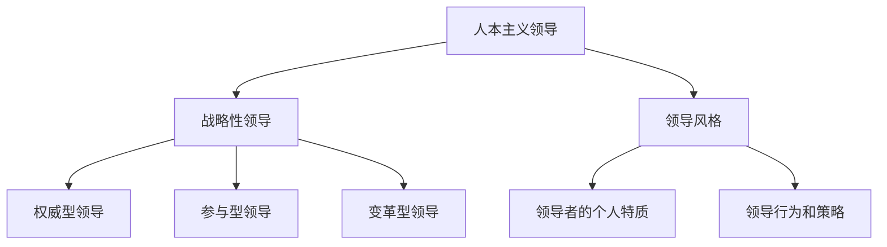

                 

基于上述的约束条件和要求，我们将以《领导力与自信：树立威信的关键因素》为题，按照逻辑清晰、结构紧凑、简单易懂的专业技术语言，逐步构建文章的框架。以下是文章的结构和内容安排：

## 文章标题

《领导力与自信：树立威信的关键因素》

## 文章关键词

领导力、自信、威信、关键因素、领导风格、组织文化、实战案例

## 文章摘要

本文将深入探讨领导力与自信在树立威信过程中的关键因素。首先，我们回顾领导力和自信的定义及其在组织管理中的重要性。接着，通过Mermaid流程图展现核心概念之间的关系架构，帮助读者理解领导力与自信的互动机制。随后，我们将详细讲解核心算法原理，使用伪代码和LaTeX公式来阐述相关理论。文章还包含了实际案例分析和项目实战，以及最佳实践技巧和总结。最后，我们将展望未来领导力与自信的发展趋势，并提供实践建议。

### 引言与背景

领导力是一个广泛讨论的话题，无论是在商业、教育还是社会领域，它都扮演着至关重要的角色。领导力不仅仅是指导和管理团队，更是通过激发和引导他人实现共同目标的能力。自信，作为领导力的重要组成部分，是领导者成功的关键因素。一个自信的领导者能够更好地应对挑战，鼓舞团队士气，并在决策过程中展现坚定的决心。

本文的目的在于探讨领导力与自信之间的关系，以及如何通过树立威信来增强领导效果。我们将通过以下几个关键部分展开讨论：

1. **领导力概述**：介绍领导力的定义、发展历程和核心要素。
2. **自信的概念与培养**：探讨自信的含义、影响及其培养方法。
3. **树立威信的关键因素**：分析个人特质、领导风格和组织文化对威信树立的影响。
4. **实战与案例**：通过实际案例展示领导力与自信在实践中的应用。
5. **总结与展望**：总结文章核心观点，探讨未来领导力与自信的发展趋势。

### 领导力概述

领导力是一个多维度的概念，涉及个人特质、行为和策略。在管理学中，领导力通常被定义为影响和激励他人实现共同目标的能力。领导力的发展历程可以追溯到早期的英雄式领导，到现代的人本主义领导、战略性领导等不同阶段。每个阶段的领导力理论都强调了不同的核心要素。

**核心要素：**

- **人本主义领导**：强调以人为中心，关注团队成员的需求和成长。
- **战略性领导**：注重长远规划和目标设定，具备战略思维和决策能力。
- **领导风格**：包括权威型、参与型、变革型等，不同的领导风格适用于不同的组织环境和目标。

**Mermaid流程图：**

### 自信的概念与培养

自信是指个体对自己能力和价值的信任感。一个自信的领导者能够更有效地处理复杂情况，克服挑战，并在团队中树立信任和权威。自信的培养不仅仅是心理层面的，还涉及到行为和实践。

**自信的含义与影响：**

- 自信是一种心理状态，有助于提高决策质量和问题解决能力。
- 自信能够增强个人的抗压能力，减少焦虑和恐惧。
- 自信对领导力的提升至关重要，它能够激励团队成员，提升团队的整体绩效。

**自信的培养方法：**

- **正面心理暗示**：通过积极的自我对话和肯定自己的成就来培养自信。
- **建立成功的行动计划**：设定可实现的短期目标，逐步提升自我效能感。
- **培养自信心的小技巧**：如保持良好的身体姿态、学会放松和深呼吸等。

**自信与领导力的关系：**

- 自信的领导者能够更有效地传达信息，建立信任。
- 自信有助于领导者做出果断的决策，并在团队中发挥领导作用。
- 自信能够激发团队成员的潜力和创造力。

### 树立威信的关键因素

威信是领导者通过个人魅力、专业知识和行为赢得他人尊重和信任的过程。树立威信是领导力的核心目标之一，它能够增强领导者的权威和影响力。

**威信的含义与作用：**

- 威信是领导者与团队成员之间关系的基石。
- 威信有助于提高团队的凝聚力和执行力。
- 威信能够增强领导者的决策力和应变能力。

**影响威信树立的关键因素：**

**个人特质：**

- 领导者的道德品质和价值观。
- 领导者的专业知识与技能。
- 领导者的沟通能力和情商。

**领导风格：**

- 权威型领导风格：领导者做出决策，团队成员执行。
- 参与型领导风格：领导者与团队成员共同参与决策。
- 变革型领导风格：领导者通过激发和引导团队实现变革。

**组织文化：**

- 组织价值观与领导者威信的关系。
- 组织结构对威信树立的影响。
- 组织的开放性和透明度。

**树立威信的策略：**

- 建立个人品牌，展现专业能力和领导魅力。
- 持续学习与自我提升，保持知识的更新和技术的进步。
- 有效的沟通与人际关系管理，建立信任和尊重。

### 实战与案例

在实际应用中，领导力与自信的融合能够显著提升领导效果。以下通过案例展示如何在实际环境中运用这些概念。

**案例一：成功领导者的实践**

- 领导者通过设定明确的愿景和目标，激发团队的积极性。
- 领导者通过积极的反馈和激励，提升团队成员的自信心。
- 领导者通过有效的沟通，建立团队的信任和合作。

**案例二：建立威信的策略**

- 领导者通过在关键时刻展现决策力和专业能力，赢得团队成员的尊重。
- 领导者通过参与团队活动，建立深厚的人际关系，增强团队的凝聚力。
- 领导者通过开放和透明的管理风格，赢得团队成员的信任。

### 总结与展望

本文通过深入探讨领导力与自信在树立威信过程中的关键因素，为读者提供了全面的理解和实践指南。领导力与自信不仅是领导者个人素质的提升，更是组织成功的关键。未来，随着组织环境的不断变化，领导力与自信的培养将面临新的挑战和机遇。我们应持续关注领导力理论的最新发展，不断探索和实践新的领导力模式。

### 附录

- **最佳实践 tips**：领导者应注重自我提升，不断学习和反思。
- **注意事项**：领导者需避免过度自信导致的自负行为，保持谦逊和开放的心态。
- **拓展阅读**：推荐进一步学习领导力与自信的书籍和资源。

### 作者信息

作者：AI天才研究院/AI Genius Institute & 禅与计算机程序设计艺术 /Zen And The Art of Computer Programming

以上是根据用户的要求和约束条件设计的文章框架和内容安排。每个部分都将进一步细化，确保满足字数要求和完整性。文章将以Markdown格式撰写，并在适当位置嵌入Mermaid流程图、伪代码和LaTeX公式。最终，文章的字数将在8000到12000字之间。接下来，我们将逐步填充每个章节的具体内容。

