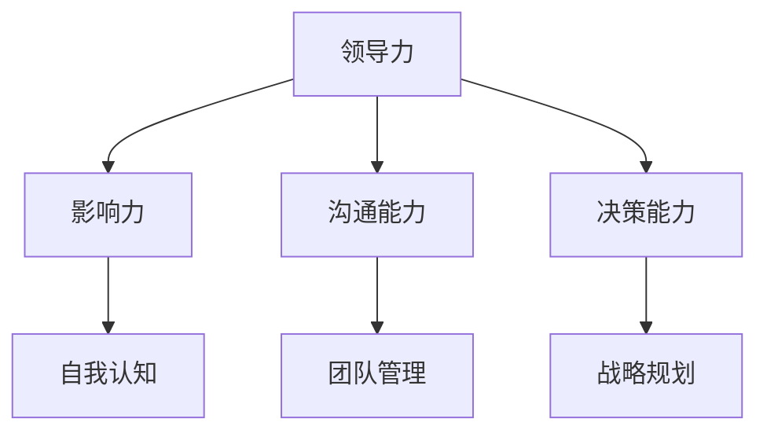
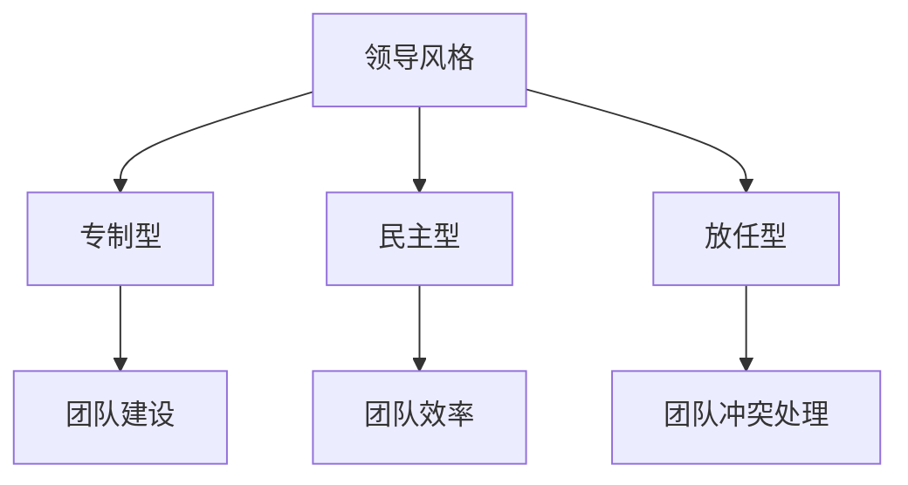

                 

### 《领导力与自我反思：持续成长的关键》

#### 关键词：领导力、自我反思、持续成长、团队管理、职业发展、创新能力、社会角色、领导力发展

#### 摘要：

本文旨在探讨领导力与自我反思对于个人和组织持续成长的重要性。首先，我们将深入分析领导力的定义、核心要素及其发展路径。随后，我们将讨论自我反思的概念、实践方法及其在持续成长中的应用。接着，文章将探讨领导力和自我反思在实际应用中的具体实践，包括企业中的领导力发展和个人职业规划。最后，我们将总结领导力与自我反思的相互关系及其对个人生活的意义，并提供相关资源和指南，以支持读者的学习和实践。通过本文的探讨，我们希望能够帮助读者理解和应用领导力和自我反思，实现个人的持续成长和成功。

## 第一部分：领导力的基础

### 第1章：领导力的定义与核心要素

#### 1.1 领导力的概念与历史演变

领导力是一个广泛研究的领域，涵盖了领导者如何影响、激励和指导团队成员以实现共同目标的能力。然而，领导力的概念并不是一成不变的，它在不同的文化和历史背景下经历了显著的演变。

在古代，领导力往往与权力和统治紧密相关。古希腊哲学家亚里士多德曾将领导力描述为“统治的艺术”，认为领导者应具备智慧、正义和远见。古罗马时期的政治家马可·奥勒留则强调了领导者的个人品德和道德修养。

进入中世纪，领导力开始与宗教和神圣授权相联系。在这个时期，领导者被视为神权的代表，他们的权力来自神明的赐予。这种观念在文艺复兴时期逐渐动摇，人们开始重视领导者的个人能力和技能。

在现代，领导力的研究逐渐脱离了神权和权威的框架，转向更为科学和实用的角度。20世纪初，管理学家弗雷德里克·泰勒提出了科学管理理论，强调通过标准化的流程和激励来提高生产效率。随后，行为学家道格拉斯·麦格雷戈提出了X理论和Y理论，探讨了领导者的激励方式和管理风格。

近年来，领导力研究逐渐关注领导者的个人特质、自我反思和创新能力。领导力不再仅仅是权力和地位的象征，而是个人成长和团队发展的关键因素。

#### 1.2 领导力的核心要素

领导力并非单一的能力，而是由多个核心要素组成的综合体系。以下是领导力的几个关键要素：

**影响力**：影响力是领导力的核心要素之一。领导者通过言行和决策影响团队成员，激发他们的积极性和创造力。影响力不仅来自于职位和权力，更来自于领导者的人格魅力和价值观。

**沟通能力**：沟通能力是领导者有效传达信息、建立信任和促进团队协作的关键。良好的沟通能力包括倾听、表达、非言语沟通和冲突解决等方面。

**决策能力**：决策能力是领导者面对复杂情况时能够做出明智、及时决策的能力。决策能力涉及到信息收集、风险评估、目标设定和执行策略等方面。

**自我认知**：自我认知是领导者了解自己的价值观、动机、优点和缺点的能力。通过自我认知，领导者能够更好地管理自己的情绪和行为，实现自我提升。

**团队管理**：团队管理是领导者协调、激励和培养团队成员，以实现团队目标的能力。团队管理涉及到团队建设、人员配备、绩效评估和冲突处理等方面。

**战略规划**：战略规划是领导者为组织设定长期目标和规划实现路径的能力。战略规划涉及到市场分析、资源分配、竞争策略和创新能力等方面。

#### 1.3 领导力的层次

领导力可以分为不同的层次，每个层次都有其独特的职责和挑战。

**初级领导力**：初级领导力主要关注团队的日常运作和任务完成。初级领导者需要具备执行力、沟通能力和团队合作精神，以确保团队的顺利运行。

**中级领导力**：中级领导力涉及更广泛的团队和项目。中级领导者需要具备战略思维、决策能力和团队管理能力，以推动项目进展和团队发展。

**高级领导力**：高级领导力关注组织整体的战略和长期发展。高级领导者需要具备领导力、战略规划能力、创新能力和影响力，以引领组织走向成功。

通过理解领导力的定义、核心要素和层次，我们可以更好地理解领导力在个人和组织发展中的重要性，并探索如何提升自己的领导力水平。

### 第2章：领导风格与团队管理

#### 2.1 领导风格的类型

领导风格是领导者管理团队和实现目标的方式。不同的领导风格适用于不同的情境和团队，了解这些风格有助于领导者更好地应对各种挑战。

**专制型领导**：专制型领导强调权威和控制，领导者做出大部分决策，团队成员的角色相对被动。这种风格在紧急情况下或需要快速决策时可能有效，但长期来看可能导致团队成员的创造力受限。

**民主型领导**：民主型领导鼓励团队成员参与决策过程，领导者更多扮演协调者和支持者的角色。这种风格有助于激发团队成员的积极性和创造力，但决策过程可能较长，适用于相对稳定的团队。

**放任型领导**：放任型领导给予团队成员高度的自由度和自主权，领导者很少干预团队的工作。这种风格适用于高度自我驱动的团队成员，但可能导致团队协作不足和目标不一致。

#### 2.2 团队建设的策略

**增强团队凝聚力**：团队凝聚力是团队成功的关键。以下策略有助于增强团队凝聚力：

- **共同目标**：明确团队的目标和愿景，确保团队成员都朝着相同的目标努力。
- **信任建设**：通过开放沟通、相互支持和共同解决问题来建立信任。
- **团队活动**：组织团队建设活动，如团队游戏、郊游和培训，以增强团队之间的联系。

**提升团队效率**：团队效率是团队实现目标的重要指标。以下策略有助于提升团队效率：

- **合理分工**：根据团队成员的特长和技能进行分工，确保每个人都能够发挥最大的作用。
- **明确责任**：明确每个团队成员的职责和责任，确保团队工作有序进行。
- **流程优化**：优化团队的工作流程，减少不必要的步骤和重复劳动。

#### 2.3 团队冲突的处理

团队冲突是团队运作中不可避免的一部分，但如何处理冲突决定了团队的健康和效率。

**冲突的类型**：团队冲突可以分为以下几种类型：

- **目标冲突**：团队成员对团队目标有不同的看法或期望。
- **资源冲突**：团队成员对资源分配和使用有不同的看法。
- **沟通冲突**：团队成员之间的沟通不畅或误解导致冲突。
- **个性冲突**：团队成员之间的性格或价值观差异导致的冲突。

**冲突管理的策略**：以下策略有助于有效管理团队冲突：

- **倾听和理解**：倾听团队成员的意见和感受，理解他们的立场和需求。
- **沟通与协商**：通过沟通和协商找到共同点和解决方案，避免冲突升级。
- **冲突解决**：针对不同类型的冲突采取不同的解决策略，如调整目标、重新分配资源或改善沟通。
- **建设性反馈**：给予团队成员积极的反馈，鼓励他们从冲突中学习和成长。

通过理解不同领导风格的优缺点，掌握团队建设的策略和冲突管理的技巧，领导者可以更有效地管理团队，推动团队的发展和成长。

### 第3章：领导力的发展路径

#### 3.1 自我认知与成长

自我认知是领导力发展的基础，它涉及到领导者对自己的价值观、动机、能力和优缺点的深入理解。通过自我认知，领导者能够更好地管理自己的情绪和行为，实现自我提升和成长。

**自我认知的重要性**：自我认知对于领导力的发展至关重要。它使领导者能够：

- **明确目标**：通过了解自己的价值观和动机，领导者能够设定更符合自己目标的发展路径。
- **优化决策**：了解自己的优缺点有助于领导者更准确地评估情况，做出更明智的决策。
- **情绪管理**：领导者能够更好地管理自己的情绪，保持冷静和理性，以应对各种挑战。
- **团队建设**：通过自我认知，领导者能够更好地理解团队成员的需求和期望，建立更和谐的团队关系。

**自我认知的方法**：以下是一些常见的自我认知方法：

- **反思日记**：通过定期记录自己的思考和感受，领导者可以更深入地了解自己的内心世界。
- **360度反馈**：通过收集来自同事、下属和上级的反馈，领导者可以更全面地了解自己的表现和影响。
- **心理咨询**：通过专业的心理咨询，领导者可以获得更深入的自我认知和成长指导。

**个人成长计划**：为了实现自我认知和成长，领导者可以制定以下个人成长计划：

- **设定目标**：明确个人和职业发展目标，制定具体的行动计划。
- **持续学习**：通过阅读、培训、课程和研讨会等途径，不断提升自己的知识和技能。
- **实践反思**：将所学知识应用于实际工作中，通过实践和反思不断改进。

通过自我认知和持续成长，领导者可以不断提升自己的能力和素质，更好地应对各种挑战和机遇，实现个人的职业发展和成功。

#### 3.2 职业规划与职业发展

职业规划是领导者实现长期职业发展的关键。通过制定明确的职业目标和路径，领导者可以更有针对性地提升自己的能力，实现职业上的成功。

**职业目标设定**：设定职业目标是职业规划的第一步。领导者应该：

- **长期目标**：明确自己的长期职业目标，如晋升到高级管理职位、成为行业专家等。
- **短期目标**：将长期目标分解为具体的短期目标，如提升某项技能、完成特定项目等。
- **评估和调整**：定期评估职业目标的进展，并根据实际情况进行调整。

**职业发展路径选择**：职业发展路径的选择取决于领导者的兴趣、能力和市场需求。以下是一些常见的职业发展路径：

- **管理路径**：通过提升管理能力和领导力，领导者可以在公司内部晋升到更高的管理职位。
- **技术路径**：对于技术背景的领导者，通过不断学习和提升技术能力，可以在技术领域获得更高的认可和职位。
- **跨部门路径**：通过跨部门的工作经历，领导者可以更全面地了解公司的运营和业务，为未来的职业发展提供更多机会。

**职业发展策略**：

- **持续学习**：通过参加培训、课程和研讨会，不断提升自己的知识和技能。
- **建立人脉**：积极参与行业活动和社交活动，建立广泛的人脉关系，为职业发展提供支持。
- **求助导师**：寻找经验丰富的导师，从他们那里获得指导和建议，加速职业发展。

通过职业规划和职业发展，领导者可以明确自己的职业目标，选择合适的路径，并通过持续学习和实践不断提升自己的能力和素质，实现职业上的成功和成就。

#### 3.3 领导力培训与提升

领导力是一种可以通过培训和实践不断提升的能力。以下是一些常见的领导力培训方法和自我提升途径，以及它们对领导力发展的作用。

**常见的领导力培训方法**：

- **研讨会和培训课程**：通过参加领导力研讨会和培训课程，领导者可以学习到最新的领导力理论和实践方法，提升自己的知识和技能。
- **模拟演练**：通过模拟演练，领导者可以在安全的环境中进行实际操作，提高决策能力和团队管理能力。
- **导师制度**：通过导师制度，领导者可以与经验丰富的导师进行交流和指导，获得宝贵的经验和建议。
- **在线学习平台**：利用在线学习平台，领导者可以随时随地学习领导力相关的知识，提升自己的综合素质。

**自我提升的途径**：

- **阅读和反思**：通过阅读领导力相关的书籍和文章，反思自己的领导实践，领导者可以不断学习和改进。
- **参加行业活动**：参加行业会议、研讨会和社交活动，与同行交流经验，了解最新的行业动态和趋势。
- **实践和反思**：在实际工作中，通过实践领导力原则和方法，反思自己的表现，领导者可以不断提升自己的领导能力。

**领导力提升的作用**：

- **增强自信**：通过培训和自我提升，领导者可以增强自信心，更好地应对各种挑战和困难。
- **提升团队效能**：通过提升领导力，领导者可以更好地管理团队，提高团队协作和效率。
- **促进个人发展**：领导力的提升不仅有助于职业发展，也有助于个人的全面发展，提升个人素质和影响力。

通过领导力培训和自我提升，领导者可以不断提升自己的领导能力，实现个人和组织的持续成长和发展。

## 第二部分：自我反思与持续成长

### 第4章：自我反思的重要性与实践

#### 4.1 自我反思的概念

自我反思是指个体对自身思想、行为和经历的深入思考和分析，旨在识别和改进自己的不足，提升自我意识和能力。自我反思不仅是一种认知过程，也是一种情感和行为的调节机制，对于个人的成长和发展具有重要意义。

**自我反思的定义**：自我反思可以定义为一种自我审视和评价的过程，通过回顾和评估自己的经历和行为，识别自己的优点和不足，并制定改进计划。这个过程通常涉及以下几个方面：

- **自我审视**：审视自己的思想、行为和决策，了解自己在不同情境下的反应和表现。
- **自我评价**：基于事实和标准，对自己进行评价，识别自己的优点和不足。
- **自我调整**：根据自我评价的结果，调整自己的行为和思维模式，以实现个人成长和改进。

**自我反思的价值**：自我反思在个人成长和职业发展中的价值体现在以下几个方面：

- **提升自我意识**：通过自我反思，个体可以更清晰地了解自己的价值观、动机、优点和不足，从而提升自我意识。
- **促进学习和成长**：自我反思可以帮助个体识别自己的知识和技能缺陷，明确学习目标，制定改进计划，从而促进个人成长。
- **增强决策能力**：通过反思过去的决策和行为，个体可以更好地理解决策的结果和影响，从而提高决策能力和判断力。
- **改善人际关系**：自我反思有助于个体更好地理解他人的需求和期望，改善人际关系，提升团队合作效果。

#### 4.2 自我反思的实践方法

自我反思不仅仅是理论上的概念，还需要通过具体的实践方法来实现。以下是一些常用的自我反思方法：

**日记写作**：日记写作是一种传统的自我反思方法，通过记录自己的日常经历、感受和思考，个体可以深入剖析自己的内心世界。以下是一些建议：

- **定期写作**：设定固定的写作时间，如每天晚上或每个周末，以保持持续的反思习惯。
- **详细记录**：尽可能详细地记录自己的经历和感受，包括具体的情境、情绪和行为反应。
- **开放式写作**：不拘泥于特定的格式，自由地表达自己的思考和感受，以激发更多的灵感。

**冥想**：冥想是一种通过集中注意力、放松身心来达到自我反思的方法。以下是一些建议：

- **选择安静的环境**：在安静、舒适的环境中冥想，有助于集中注意力。
- **设定时间**：每天设定一段固定的时间进行冥想，如早晨或晚上。
- **关注呼吸**：将注意力集中在呼吸上，感受每一次呼吸的起伏，帮助平静情绪和思绪。

**深度对话**：与信任的同事、朋友或导师进行深度对话，是一种有效的自我反思方法。以下是一些建议：

- **开放性提问**：提出开放性问题，如“你对我有什么看法？”或“我在哪些方面还有改进的空间？”以引导对方分享观点。
- **倾听和反馈**：认真倾听对方的反馈，并对反馈表示感谢，以建立良好的沟通和信任关系。
- **行动计划**：根据对方的反馈，制定具体的行动计划，以实现自我提升。

通过这些自我反思的实践方法，个体可以更深入地了解自己，识别自己的不足，并采取行动进行改进，从而实现个人的持续成长和发展。

#### 4.3 自我反思的工具与技术

为了有效地进行自我反思，个体可以使用各种工具和技术来辅助这个过程。以下是一些常用的自我反思工具和技术：

**反思日记模板**：反思日记模板可以帮助个体结构化地记录和反思自己的经历。以下是一个简单的反思日记模板：

```
日期：_______

今天发生了什么：
- 事件一：________
- 事件二：________
- 事件三：________

我的感受：
- 对事件一的感受：________
- 对事件二的感受：________
- 对事件三的感受：________

我的反应：
- 对事件一的反应：________
- 对事件二的反应：________
- 对事件三的反应：________

反思和结论：
- 我从这些事件中学到了什么？________
- 我需要改进的地方是什么？________
- 我的行动计划是什么？________
```

**冥想应用**：许多冥想应用提供指导性的冥想练习，帮助个体进行自我反思。以下是一些推荐的应用：

- **Headspace**：提供一系列冥想课程，包括放松、减压和自我反思等。
- **Insight Timer**：提供大量冥想练习，用户可以根据自己的需求和偏好进行选择。
- **Calm**：除了冥想，还提供放松和睡眠指导，有助于个体在冥想中更好地放松和反思。

**反思性对话技巧**：与信任的人进行反思性对话时，以下技巧可以帮助更好地进行自我反思：

- **积极倾听**：倾听对方的观点和感受，不打断对方，以建立良好的沟通和信任。
- **开放性问题**：提出开放性问题，如“你对这个情况有什么看法？”或“你有什么建议吗？”以引导对方分享观点。
- **反思性提问**：通过反思性问题，如“这个情况对你有什么影响？”或“你认为我们如何改进？”来深入探讨问题的本质。

通过这些工具和技术，个体可以更系统地记录、分析和反思自己的经历，从而实现自我成长和提升。

### 第5章：持续成长与学习策略

#### 5.1 持续成长的理念

持续成长是一种终身学习的理念，它强调不断学习新知识、提升技能和适应变化的重要性。在快速发展的时代，持续成长对于个人的职业发展和生活质量具有重要意义。

**成长心态**：成长心态是一种积极的心态，认为能力可以通过努力和经验不断改进。与固定心态相对，成长心态强调挑战、学习和成长的重要性。拥有成长心态的人更容易适应变化，抓住机遇，实现个人目标。

**学习动机**：学习动机是持续成长的动力源泉。以下是一些常见的学习动机：

- **内在动机**：对知识本身的兴趣和热爱，如对新技术的好奇心或对特定领域的热爱。
- **外在动机**：通过学习获得职业晋升、薪资增长或社会认可等外在奖励。
- **社会需求**：适应社会变化和发展的需求，如提高专业技能以满足工作需求。

**持续成长的重要性**：持续成长的重要性体现在以下几个方面：

- **提升竞争力**：在不断变化的市场中，持续成长可以提升个人的竞争力，适应新的职业挑战。
- **增强适应能力**：持续学习可以增强个人的适应能力，应对不确定性和变化。
- **提升生活质量**：持续成长可以提升个人的生活质量，带来更多的机会和满足感。

#### 5.2 学习策略与技巧

为了实现持续成长，个体需要掌握有效的学习策略和技巧。以下是一些常用的学习策略和技巧：

**高效学习方法**：

- **目标设定**：明确学习目标，设定具体、可衡量和可实现的目标，有助于提高学习效果。
- **时间管理**：合理安排学习时间，避免拖延和浪费时间，确保学习目标的实现。
- **主动学习**：积极参与学习过程，主动思考和探索，而不仅仅是被动接受知识。
- **多样化学习**：通过多种途径获取知识，如阅读、听课、实践和交流，提高学习的广度和深度。

**学习资源的筛选与利用**：

- **在线学习平台**：利用在线学习平台，如Coursera、Udemy和edX等，获取高质量的课程和资源。
- **专业书籍**：阅读专业书籍和资料，系统地学习相关领域的知识。
- **实践经验**：通过实际操作和项目实践，将理论知识应用到实际中，提高技能和经验。
- **社群学习**：加入专业社群和讨论组，与同行交流经验和观点，拓展视野。

**知识管理**：

- **笔记整理**：将学习过程中的重要知识点和思考记录下来，便于回顾和复习。
- **思维导图**：利用思维导图工具，将复杂的信息和知识点可视化，提高理解和记忆。
- **定期复习**：定期复习所学知识，巩固记忆，防止遗忘。
- **知识分享**：与他人分享所学知识，通过教学相长的方式加深理解和记忆。

通过掌握高效的学习方法和策略，个体可以更有效地进行学习，实现持续成长和提升。

#### 5.3 知识管理与知识共享

知识管理是一种系统化的方法，用于识别、组织和利用组织中的知识资源，以提高组织效率和创新能力。知识共享是知识管理的重要组成部分，通过共享知识，可以促进团队成员之间的协作和沟通，提高整体绩效。

**个人知识管理系统**：个人知识管理系统（PKM）是一种帮助个体有效管理和利用知识的方法。以下是一些PKM的实践：

- **知识记录**：记录学习过程中的重要知识点、经验教训和想法，形成个人知识库。
- **知识整理**：对知识进行分类和整理，以便于查找和复习。
- **知识应用**：将所学知识应用于实际工作中，通过实践和反思不断提升自己的能力和素质。

**知识共享平台**：知识共享平台是一种帮助团队成员共享知识和经验的工具。以下是一些知识共享平台的实践：

- **内部论坛和社区**：建立内部论坛和社区，鼓励团队成员分享经验和观点，促进知识和技能的传递。
- **知识库和文档管理系统**：建立知识库和文档管理系统，方便团队成员查找和共享文档和资料。
- **在线培训和研讨会**：组织在线培训和研讨会，分享专业知识和经验，提升团队整体能力。

通过个人知识管理系统的建立和知识共享平台的运用，组织可以更有效地管理知识资源，促进团队协作和持续成长。

### 第6章：适应变化与创新能力

#### 6.1 变化中的领导力

在快速变化的时代，领导力需要具备适应变化的能力。领导者在面对变化时，不仅要保持冷静和理性，还要具备前瞻性和创新能力，以引领团队走向成功。

**变管理化**：变管理化是一种管理理念，强调组织在应对变化时，需要将变化视为常态，并建立相应的机制来适应和管理变化。以下是一些变管理化的策略：

- **建立敏捷团队**：通过建立敏捷团队，提高组织的响应速度和灵活性，快速适应市场变化。
- **持续学习与培训**：鼓励团队成员持续学习和培训，提高他们的技能和知识，以适应新的工作要求。
- **灵活的决策机制**：建立灵活的决策机制，允许团队快速做出决策，并调整战略以应对变化。

**创新思维的培养**：创新思维是领导者应对变化和挑战的重要能力。以下是一些培养创新思维的方法：

- **头脑风暴**：通过头脑风暴，激发团队成员的创新思维，产生新的想法和解决方案。
- **跨学科合作**：鼓励跨学科合作，将不同领域的知识和经验结合起来，产生创新思维。
- **试错文化**：鼓励团队成员尝试新方法和想法，即使失败，也从中学习和成长。

通过变管理化和创新思维的培养，领导者可以更好地适应变化，推动组织的发展和创新。

#### 6.2 创新能力的提升

创新能力是组织持续发展和竞争优势的关键。以下是一些提升创新能力的策略：

**创新方法论**：创新方法论是一套系统化的方法，用于指导创新过程。以下是一些常见的创新方法论：

- **设计思维**：设计思维是一种以用户为中心的创新方法，通过深入了解用户需求，设计出更好的产品和服务。
- **TRIZ理论**：TRIZ（理论创新问题解决方法）是一种基于数学和逻辑的创新方法论，通过解决技术问题来推动创新。
- **开放式创新**：开放式创新是一种通过与外部合作伙伴合作，共同开发和分享创新成果的方法。

**创新实践案例分析**：以下是一些创新实践案例，展示了如何通过创新方法和策略实现成功：

- **谷歌的20%时间政策**：谷歌允许员工将20%的时间用于自己的项目，这种政策激发了员工的创新思维，产生了许多成功的产品，如Gmail和AdSense。
- **苹果公司的新产品开发**：苹果公司通过严密的设计思维和创新方法论，开发出一系列具有创新性和竞争力的产品，如iPhone和iPad。
- **3M的发明者时间政策**：3M公司允许员工在工作时间的一部分用于创新和实验，这种政策激发了员工的创新热情，产生了许多成功的创新产品，如Post-it便签。

通过创新方法论和实践案例的分析，领导者可以更好地理解和应用创新方法，提升组织的创新能力。

#### 6.3 组织创新机制建设

组织创新机制是组织实现持续创新和竞争优势的关键。以下是一些组织创新机制的建设策略：

**创新文化**：创新文化是一种鼓励创新和实验的氛围，以下是一些建设创新文化的策略：

- **鼓励失败**：建立容错文化，鼓励团队成员尝试新方法和想法，即使失败也给予支持和鼓励。
- **开放沟通**：鼓励团队成员开放沟通，分享想法和经验，促进知识和信息的流动。
- **激励创新**：建立激励机制，如奖金、晋升和认可，激励团队成员积极参与创新活动。

**创新流程**：创新流程是一套系统化的方法，用于指导创新过程。以下是一些创新流程的建设策略：

- **明确目标**：明确创新的目标和愿景，确保创新活动围绕组织的目标进行。
- **资源分配**：合理分配资源和人力，确保创新项目得到充分的支持和资源。
- **阶段管理**：将创新过程划分为不同的阶段，如构思、开发、测试和上市，确保创新项目的有序推进。

通过创新文化和创新流程的建设，组织可以构建一个支持创新的生态系统，推动组织的持续创新和竞争优势。

### 第7章：领导力与自我反思在企业中的实践

#### 7.1 企业领导力发展的挑战与对策

企业领导力发展是组织成功的关键因素。然而，企业在发展领导力时面临着一系列挑战。以下是一些常见的挑战及其对策：

**挑战一：领导力不足**：许多企业在领导力培养方面存在不足，缺乏具有领导潜力的员工。

**对策**：企业可以通过以下措施来应对领导力不足的挑战：

- **领导力培训**：为员工提供领导力培训，提高他们的领导能力和管理水平。
- **导师制度**：建立导师制度，让有经验的领导者指导新晋领导者，帮助他们快速成长。
- **职业发展计划**：为员工制定明确的职业发展计划，鼓励他们不断提升自己的领导能力。

**挑战二：领导风格单一**：许多企业在领导风格上过于单一，缺乏多样性和适应性。

**对策**：企业可以通过以下措施来应对领导风格单一的挑战：

- **领导风格评估**：定期对领导风格进行评估，识别不同领导风格的优势和不足，培养多样化的领导风格。
- **团队建设**：通过团队建设活动和培训，提高团队协作和领导力水平。
- **跨部门合作**：鼓励跨部门合作，促进领导者在不同环境下的适应性。

**挑战三：领导力传承不足**：企业在领导力传承方面存在不足，导致领导力的流失和组织发展受阻。

**对策**：企业可以通过以下措施来应对领导力传承不足的挑战：

- **接班人计划**：制定接班人计划，确保领导力的传承和连续性。
- **领导力发展项目**：实施领导力发展项目，培养下一代的领导者，确保组织领导力的稳定发展。
- **内部晋升机制**：建立内部晋升机制，鼓励员工积极参与领导岗位，提升领导力水平。

通过应对这些挑战，企业可以构建一个更加成熟和多元的领导力体系，推动组织的持续发展。

#### 7.2 自我反思在职业发展中的应用

自我反思是职业发展中不可或缺的一部分。通过自我反思，个人可以更好地了解自己的优势和不足，制定更有效的职业发展计划。以下是一些自我反思在职业发展中的应用：

**职业规划与自我反思**：自我反思在职业规划中发挥着重要作用。以下是一些关键步骤：

- **评估当前状况**：通过反思自己的工作表现、技能和兴趣，评估自己的当前职业状况，明确自己的优势和不足。
- **设定职业目标**：根据自我反思的结果，设定明确的职业目标，如晋升、职位变动或技能提升等。
- **制定行动计划**：制定具体的行动计划，如参加培训、学习新技能或开展新项目，以实现职业目标。

**自我评估**：自我评估是自我反思的重要组成部分。以下是一些自我评估的方法：

- **360度反馈**：通过收集来自同事、下属和上级的反馈，全面了解自己的工作表现和影响。
- **技能评估**：评估自己的专业技能和知识，识别自己的强项和弱项，制定提升计划。
- **职业价值观评估**：反思自己的职业价值观和兴趣，确保自己的职业选择与个人价值观相符合。

**持续改进**：通过自我反思和评估，个人可以持续改进自己的职业发展。以下是一些持续改进的方法：

- **定期反思**：定期对自己的工作表现和职业发展进行反思，识别需要改进的领域，并制定具体的改进计划。
- **学习和培训**：参加相关培训和学习活动，提升自己的技能和知识，以适应职业发展的需求。
- **实践和反思**：将所学知识应用于实际工作中，通过实践和反思不断提升自己的能力和素质。

通过自我反思和评估，个人可以更清晰地了解自己的职业发展路径，制定更有效的职业发展计划，实现个人和职业的成长。

#### 7.3 领导力与自我反思在工作场所的实践

领导力与自我反思在工作场所的实践对于个人和团队的发展具有重要意义。以下是一些具体的实践方法和案例：

**领导力的实践方法**：

- **明确目标和期望**：领导者应该明确团队的目标和期望，并与团队成员进行沟通，确保每个人对目标和期望有清晰的认识。
- **激励和认可**：领导者应通过激励和认可来激发团队成员的积极性和创造力，例如提供奖励、表扬和晋升机会。
- **有效沟通**：领导者应具备良好的沟通能力，包括倾听、表达和反馈，以确保信息的有效传递和团队协作。
- **决策能力**：领导者应在面对复杂情况时，具备快速决策和解决问题的能力，确保团队目标的实现。
- **培养团队精神**：领导者应通过组织团队活动、建立信任和共同目标，培养团队精神，提高团队协作效率。

**自我反思的实践方法**：

- **定期反思**：个人应定期对自己的工作表现和职业发展进行反思，识别自己的优势和不足，并制定改进计划。
- **日记写作**：通过日记写作，个人可以记录自己的思考和感受，深入剖析自己的内心世界，有助于自我认知和成长。
- **寻求反馈**：个人应主动寻求同事、上级和下属的反馈，了解自己的工作表现和影响，通过反馈进行改进。
- **设定目标**：个人应设定明确的职业目标，并制定具体的行动计划，通过持续的努力和反思，实现个人目标。

**实际案例分析**：

- **案例一：领导力的实践**：某公司的项目经理通过明确的任务分配、激励措施和有效沟通，成功带领团队完成了多个项目，提升了团队的工作效率和满意度。
- **案例二：自我反思的实践**：某技术专家通过定期反思、日记写作和寻求反馈，不断改进自己的工作方法和技能，最终在技术领域取得了显著的成就，得到了公司的认可和晋升。

通过领导力与自我反思在工作场所的实践，个人和团队可以不断提高自身的能力和素质，实现个人和职业的成功。

### 第8章：领导力与自我反思在社会角色中的实践

#### 8.1 领导力在社会管理中的角色

领导力在社会管理中扮演着至关重要的角色。有效的社会管理需要领导者具备强大的领导力，以应对复杂的社会问题和挑战。以下是领导力在社会管理中的几个关键角色：

**社会稳定与发展**：领导者在社会稳定和发展中起着核心作用。通过制定和实施有效的政策和策略，领导者可以促进社会的和谐与进步。领导者需要具备前瞻性和战略思维，以预见社会问题并制定相应的解决方案。

**公共事务管理**：领导者负责管理公共事务，包括教育、卫生、交通、环境保护等领域。他们需要协调各方利益，确保公共资源的合理分配和使用，提升公共服务质量，满足民众的需求。

**危机应对与决策**：在社会危机时期，领导者需要迅速做出决策，采取有效的应对措施，保护民众的安全和福祉。领导者应具备危机管理能力和决策能力，以确保社会稳定和秩序。

**社会治理与改革**：领导者在社会治理与改革中发挥着引领作用。他们需要推动社会制度和政策的改革，提升社会治理效率和公平性。通过创新治理模式和制度设计，领导者可以促进社会的可持续发展。

#### 8.2 自我反思在社会角色中的实践

自我反思在社会角色中同样具有重要意义。以下是一些自我反思在社会角色中的实践方法和应用：

**社会责任与自我反思**：社会角色往往伴随着特定的社会责任。通过自我反思，个人可以更好地理解自己的社会责任，并评估自己在履行社会责任方面的表现。以下是一些实践方法：

- **反思社会责任**：定期反思自己的社会责任，包括对家庭、社区、组织和国家的影响和贡献。
- **自我评估**：评估自己在履行社会责任方面的表现，识别自己的优势和不足，并制定改进计划。
- **反思性行动**：通过反思性行动，将自我反思转化为实际行动，如参与社区服务、捐赠慈善事业等。

**社会影响与自我反思**：个人的行为和决策往往会对社会产生影响。通过自我反思，个人可以更好地理解自己的社会影响，并评估自己的行为和决策对社会的影响。以下是一些实践方法：

- **反思社会影响**：定期反思自己的行为和决策对社会的影响，包括正面和负面影响。
- **社会反馈**：主动寻求社会反馈，了解自己的行为和决策在社会中的反应和影响。
- **自我调整**：根据社会反馈和反思结果，调整自己的行为和决策，以实现更好的社会影响。

**社会角色与自我认知**：通过自我反思，个人可以更好地理解自己的社会角色和自我认知，包括自己的价值观、动机和行为模式。以下是一些实践方法：

- **反思社会角色**：定期反思自己的社会角色，包括在工作、家庭、社区等不同领域中的角色和职责。
- **自我认知**：通过反思和评估，深入理解自己的价值观、动机和行为模式。
- **自我提升**：根据自我认知的结果，制定自我提升计划，提升自己的社会角色和自我认知水平。

通过自我反思在社会角色中的实践，个人可以更好地理解自己的社会责任和影响，提升自我认知和社会角色，实现个人的成长和社会的进步。

#### 8.3 领导力与自我反思在社区建设中的实践

在社区建设中，领导力和自我反思发挥着重要作用，能够促进社区成员的团结和社区的可持续发展。以下是一些具体的方法和实践：

**社区领导力的培养**：社区领导力是推动社区建设和发展的关键因素。以下是一些培养社区领导力的方法：

- **建立信任**：领导者需要通过与社区居民建立信任关系，确保社区成员愿意跟随和参与社区建设。
- **明确目标**：领导者应明确社区建设的目标和愿景，确保所有社区成员都朝着共同的目标努力。
- **鼓励参与**：领导者应鼓励社区成员积极参与社区事务，提升他们的参与感和责任感。
- **协作与协调**：领导者应促进社区成员之间的协作和协调，确保社区事务的顺利开展。

**自我反思在社区建设中的应用**：自我反思在社区建设中具有重要作用，以下是一些具体的应用方法：

- **社区评估**：社区成员应定期进行社区评估，反思社区建设的进展和存在的问题，制定改进计划。
- **个人责任**：社区成员应反思自己在社区建设中的责任和贡献，提升自我认知和责任感。
- **社区会议**：通过定期举行社区会议，社区成员可以共同反思社区事务，讨论问题和解决方案。
- **社区活动**：通过组织社区活动，社区成员可以在实践中反思和提升自己的社区参与能力。

**社区自我反思的实践**：以下是一些社区自我反思的具体实践方法：

- **反思日记**：社区成员可以记录自己的反思日记，定期回顾自己在社区建设中的表现和成长。
- **反思小组**：社区成员可以组成反思小组，相互分享反思和经验，促进共同成长。
- **反思活动**：社区可以定期举行反思活动，如反思会议、反思工作坊等，鼓励社区成员积极参与和反思。
- **反思培训**：社区可以提供反思培训，帮助社区成员掌握自我反思的方法和技巧。

通过领导力与自我反思在社区建设中的实践，社区成员可以提升自我认知和社区参与能力，促进社区的和谐发展和可持续发展。

## 结论

### 第9章：领导力与自我反思：持续成长的关键

#### 9.1 领导力与自我反思的相互关系

领导力与自我反思是相辅相成的，二者共同构成了持续成长的关键。领导力为个人和组织提供了方向和动力，而自我反思则为个人提供了自我提升和改进的机会。

**领导力与自我反思的互动**：领导力的发展需要自我反思的支持。通过自我反思，领导者可以识别自己的不足，调整行为和决策，提高领导能力。同时，自我反思也需要领导力的引导，以确保反思过程的有效性和目标性。

**领导力提升中的自我反思**：在领导力提升的过程中，自我反思是一种重要的工具。通过反思，领导者可以深入理解自己的行为和决策，识别自己的优势和不足，从而制定改进计划。自我反思不仅有助于领导者个人成长，还可以提升整个团队的效能。

#### 9.2 持续成长的重要性

持续成长是个人和组织发展的关键。在快速变化的时代，持续学习、提升技能和适应变化成为不可或缺的能力。

**成长对领导力的影响**：持续成长有助于领导者提升自己的能力和素质，增强适应变化的能力，从而更好地应对各种挑战和机遇。通过持续学习和自我提升，领导者可以不断提升自己的领导力水平，实现个人和组织的成功。

**成长对个人生活的意义**：持续成长不仅有助于职业发展，还可以提升个人生活的质量和幸福感。通过不断学习和成长，个人可以更好地理解自己和他人，建立更深厚的人际关系，提升自我价值和成就感。

**持续成长的重要性**：持续成长是实现个人和职业成功的关键。在个人生活中，持续成长可以提升个人的自信和满足感；在职业生涯中，持续成长可以提升个人的竞争力和职业发展机会。通过持续学习和自我提升，个人可以不断适应变化，实现个人和职业的目标。

通过理解领导力与自我反思的相互关系和持续成长的重要性，我们可以更好地应用这些原则和方法，实现个人的持续成长和成功。

## 附录

### 第10章：领导力与自我反思资源指南

#### 10.1 领导力学习资源

**常见领导力书籍推荐**：

1. 《领导力五项修炼》（作者：斯蒂芬·罗宾斯）
   - 本书系统地介绍了领导力的五个核心要素，包括变革型领导、情感智慧和团队协作等。
2. 《领导者的优势》（作者：本尼·迪克曼）
   - 本书通过大量案例研究，分析了成功领导者的共同特点，提供了实用的领导力提升策略。
3. 《领导力的真谛》（作者：詹姆斯·库泽斯和巴里·波斯纳）
   - 本书强调了领导者的道德责任和影响力，提出了基于道德的领导力原则。

**领导力培训课程推荐**：

1. **Coursera**：提供各种在线领导力培训课程，如“成功的领导力”、“变革型领导”等。
2. **Udemy**：提供丰富多样的领导力课程，涵盖从基础到高级的领导力技能，如沟通技巧、团队建设和决策能力等。
3. **edX**：由全球知名大学提供的高质量领导力课程，如哈佛大学的“领导力与变革管理”。

#### 10.2 自我反思工具与资源

**反思日记模板**：

```
日期：_______

今天发生了什么：
- 事件一：________
- 事件二：________
- 事件三：________

我的感受：
- 对事件一的感受：________
- 对事件二的感受：________
- 对事件三的感受：________

我的反应：
- 对事件一的反应：________
- 对事件二的反应：________
- 对事件三的反应：________

反思和结论：
- 我从这些事件中学到了什么？________
- 我需要改进的地方是什么？________
- 我的行动计划是什么？________
```

**冥想应用推荐**：

1. **Headspace**：提供一系列冥想课程，包括基础冥想、专注力训练和情绪管理。
2. **Insight Timer**：提供大量冥想练习，用户可以根据自己的需求和偏好进行选择。
3. **Calm**：除了冥想，还提供放松和睡眠指导，有助于个体在冥想中更好地放松和反思。

**自我反思书籍推荐**：

1. 《反思的力量》（作者：威廉·舒马赫）
   - 本书详细介绍了反思的概念和方法，探讨了反思在个人成长和职业发展中的应用。
2. 《反思的智慧》（作者：詹姆斯·帕特森）
   - 本书通过大量案例和实践，展示了反思在提升自我认知和领导力方面的作用。
3. 《反思日志》（作者：玛莎·坎贝尔）
   - 本书提供了实用的反思日记模板和反思练习，帮助读者建立反思习惯，提升自我认知。

通过这些资源和工具，读者可以更好地理解和应用领导力和自我反思的原则，实现个人的持续成长和发展。

## Mermaid 流程图

### 领导力的核心要素



### 领导风格与团队管理



### 自我反思的重要性与实践

```mermaid
graph TD
A[自我反思] --> B[概念]
A --> C[实践方法]
A --> D[工具与技术]
B --> E[价值]
C --> F[日记写作]
C --> G[冥想]
C --> H[深度对话]
D --> I[反思日记模板]
D --> J[冥想应用]
```作者：AI天才研究院/AI Genius Institute & 禅与计算机程序设计艺术 /Zen And The Art of Computer Programming

### 《领导力与自我反思：持续成长的关键》

本文系统地探讨了领导力与自我反思在个人和组织发展中的重要性。首先，我们分析了领导力的定义、核心要素及其发展路径，包括影响力、沟通能力、决策能力、自我认知和团队管理等。接着，我们讨论了自我反思的概念、实践方法和工具，以及持续成长与学习策略。此外，我们还探讨了适应变化与创新能力的重要性，以及领导力与自我反思在实际应用中的实践。

通过本文的探讨，我们认识到领导力和自我反思是相辅相成的，二者共同构成了持续成长的关键。领导力为个人和组织提供了方向和动力，而自我反思则为个人提供了自我提升和改进的机会。在快速变化的时代，持续学习和自我提升已成为不可或缺的能力，它们不仅有助于职业发展，还能提升个人生活的质量和幸福感。

为了更好地应用领导力和自我反思的原则，我们提供了一些资源和工具，包括领导力书籍、培训课程、反思日记模板和冥想应用等。这些资源将帮助读者深入理解和实践领导力和自我反思，实现个人的持续成长和成功。

在未来的职业生涯中，我们鼓励读者不断反思自己的行为和决策，提升自我认知和领导力水平。同时，也要保持开放的心态，积极适应变化，勇于创新。通过持续学习和实践，我们相信每个人都能在领导力和自我反思的道路上取得显著的进步，实现个人和组织的卓越发展。

最后，感谢您的阅读。希望本文能为您提供有益的启示，帮助您在领导力和自我反思的旅程中不断前行。愿您在持续成长的道路上收获成功和幸福！

