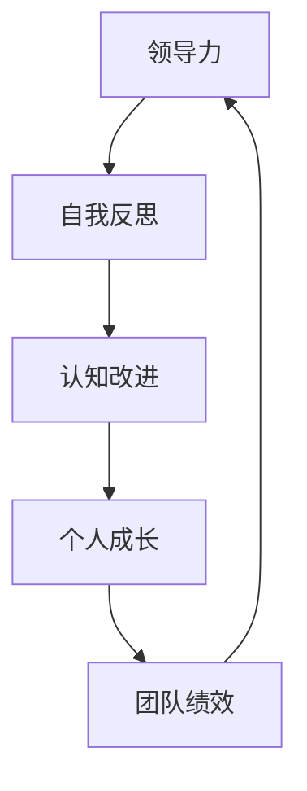

                 

### 确定文章结构和核心内容

为了撰写一篇结构清晰、内容详实的技术博客文章《领导力与自我反思：持续成长的关键》，我们首先需要明确文章的整体结构和每个章节的核心内容。以下是基于先前制定的目录大纲的详细步骤：

#### 引言

1. **背景介绍**：简要介绍领导力和自我反思在现代社会中的重要性，以及为什么它们对IT专业人士尤其关键。
2. **写作目的**：明确文章旨在帮助读者理解领导力与自我反思的关系，并掌握如何在实际工作中应用这些原则。
3. **全书结构**：概述每个章节的主要内容，为读者提供全文的概述。

#### 领导力与自我反思的重要性

1. **领导力的定义**：阐述领导力不仅仅是管理，而是一种能够影响和激励他人的能力。
2. **自我反思的概念**：解释自我反思作为一种认知过程，如何帮助我们识别并改进自己的行为。
3. **领导力与自我反思的联系**：讨论这两者之间的相互促进关系，以及它们如何共同推动个人和组织的成长。

#### 核心概念与联系

1. **定义核心概念**：明确领导力、自我反思等关键术语。
2. **绘制Mermaid流程图**：使用Mermaid语言绘制一个流程图，展示领导力与自我反思的概念和关系。

#### 领导力模型

1. **杰克逊领导模型**：介绍该模型的核心原则，并讨论其在IT行业的应用。
2. **领导力五要素模型**：详细解析该模型，包括每个要素的作用和重要性。
3. **服务型领导模型**：探讨服务型领导如何通过关注团队成员的需求来实现领导力。

#### 自我反思方法

1. **反思日记**：描述如何保持日常的反思日记，以及其对于个人成长的好处。
2. **反思会议**：解释反思会议的安排和方法，以及如何通过团队会议来实现集体反思。
3. **反思日志**：介绍反思日志的创建和使用，如何通过记录和回顾来提高自我意识。

#### 领导力实践

1. **团队管理中的应用**：讨论领导力在团队建设、冲突解决和目标设定中的实际应用。
2. **项目管理中的应用**：阐述领导力在项目管理中的关键角色，包括风险管理、沟通协调和进度控制。
3. **个人成长中的应用**：探讨领导力如何帮助IT专业人士在职业生涯中不断提升技能和素养。

#### 领导力成长

1. **持续学习**：强调终身学习的重要性，并介绍一些有效的学习策略。
2. **反馈机制**：讨论如何建立一个积极的反馈循环，以持续改进领导力和个人技能。
3. **个人发展计划**：解释如何制定个人发展计划，以及如何通过目标设定和评估来推动个人成长。

#### 案例分析

1. **成功领导力实践**：分析一个在IT行业中成功的领导力案例，讨论其成功因素。
2. **自我反思案例**：介绍一个通过自我反思实现个人成长的案例，展示反思过程及其效果。

#### 结论与展望

1. **总结全文**：回顾文章的主要观点，强调领导力与自我反思的重要性。
2. **展望未来**：探讨领导力与自我反思在未来技术发展和社会变革中的潜在影响。

### 总结

通过上述步骤，我们已经构建了一个详细的文章框架，包括各个章节的核心内容和结构。接下来，我们将逐步填充每个章节的具体内容，确保文章既有深度又有广度，能够满足8000-12000字的字数要求。

---

现在，我们可以开始撰写每个章节的具体内容了。首先是引言部分，我们将详细阐述领导力和自我反思的背景和重要性。接下来，将逐步展开每个章节，确保文章的逻辑清晰，结构紧凑，内容详实。请随时让我知道，如果有任何疑问或需要进一步的帮助。我们一步一步来，确保每一部分都经过仔细思考和分析。💡💻📝

