                 


### 文章标题：领导力与自我反思：持续改进的重要性

### 关键词：
- 领导力
- 自我反思
- 持续改进
- 个人成长
- 组织发展

### 摘要：
本文探讨了领导力与自我反思的密切关系，并强调了持续改进在领导实践中的重要性。文章首先介绍了领导力的定义、核心要素及其发展历程，然后深入讨论了自我反思的概念、方法与技巧，并展示了自我反思与领导力之间的互动关系。通过Mermaid流程图、伪代码、数学公式和实际案例分析，文章详细阐述了核心概念原理和持续改进在领导力实践中的应用。最后，文章总结了持续改进的最佳实践、注意事项，并提出了未来展望。

### 目录：

## 引言

### 领导力的定义与核心要素

### 自我反思的概念与方法

### 持续改进的内涵与意义

### 文章结构概述

## 第1章：领导力概述

### 1.1 领导力的定义与重要性

#### 背景介绍

- 领导力的历史渊源与发展

- 领导力在组织中的角色与功能

#### 核心概念与联系

- 领导力的核心要素

- 使用Mermaid流程图展示领导力要素之间的关系

  ```mermaid
  graph TD
  A[愿景] --> B[沟通能力]
  A --> C[决策能力]
  A --> D[团队建设能力]
  A --> E[变革管理]
  ```

#### 核心算法原理讲解

- 领导力评估算法（伪代码）

  ```python
  def assess_leadership(communication, decision_making, team_building, change_management):
      score = 0
      if communication > 7:
          score += 3
      if decision_making > 7:
          score += 3
      if team_building > 7:
          score += 3
      if change_management > 7:
          score += 3
      return score
  ```

#### 数学模型和公式

- 领导力模型（LaTeX）

  $$ L = \frac{C + D + T + CM}{4} $$

  其中，$L$ 表示领导力得分，$C$、$D$、$T$、$CM$ 分别表示沟通能力、决策能力、团队建设和变革管理得分。

#### 项目实战

- 开发环境搭建

- 源代码实现与解读

- 代码应用解读与分析

- 实际案例分析

### 1.2 领导力的发展历程

#### 古典领导理论

- 特质理论

- 行为理论

#### 情境理论

- 费德勒权变模型

- house的路径-目标理论

#### 变革领导理论

- 拉斯威尔的变革理论

- 领导变革的变革代理模型

#### 新型领导理论

- 基于共享价值观的领导

- 跨文化领导

### 1.3 领导力的核心要素

#### 沟通能力

- 有效沟通的重要性

- 沟通障碍与克服方法

#### 决策能力

- 决策类型

- 决策过程

#### 团队建设能力

- 团队动力学

- 团队角色与互动

#### 变革管理

- 变革的驱动因素

- 变革的实施策略

### 第2章：自我反思与领导力

#### 2.1 自我反思的概念与作用

#### 背景介绍

- 自我反思的定义

- 自我反思在领导实践中的作用

#### 核心概念与联系

- 自我反思与领导力的互动关系

- 使用Mermaid流程图展示

  ```mermaid
  graph TD
  A[自我反思] --> B[领导力]
  A --> C[认知发展]
  A --> D[情感智慧]
  A --> E[行为改进]
  ```

#### 核心算法原理讲解

- 自我反思评估算法（伪代码）

  ```python
  def assess_self_reflection(reflection_score, leadership_score):
      if reflection_score > leadership_score:
          return "High Self-Reflection"
      else:
          return "Low Self-Reflection"
  ```

#### 数学模型和公式

- 自我反思与领导力模型（LaTeX）

  $$ S = \frac{R + L}{2} $$

  其中，$S$ 表示自我反思得分，$R$、$L$ 分别表示自我反思得分和领导力得分。

#### 项目实战

- 开发环境搭建

- 源代码实现与解读

- 代码应用解读与分析

- 实际案例分析

### 2.2 自我反思的方法与技巧

#### 常见自我反思方法

- 日志反思

- 360度反馈

- SWOT分析

#### 自我反思技巧

- 设定目标

- 识别问题

- 反思学习

#### 案例分析

- 成功的自我反思案例

- 失败的自我反思案例

### 第3章：持续改进的重要性

#### 3.1 持续改进的内涵与意义

#### 背景介绍

- 持续改进的定义

- 持续改进在领导实践中的意义

#### 核心概念与联系

- 持续改进与领导力的关系

- 使用Mermaid流程图展示

  ```mermaid
  graph TD
  A[持续改进] --> B[领导力]
  A --> C[个人成长]
  A --> D[组织发展]
  A --> E[创新]
  ```

#### 核心算法原理讲解

- 持续改进模型（伪代码）

  ```python
  def continuous_improvement(learning_rate, feedback_loop, improvement_factor):
      current_state = initial_state
      while not converged:
          feedback = get_feedback(current_state)
          next_state = current_state + learning_rate * (feedback - current_state)
          current_state = next_state
      return current_state
  ```

#### 数学模型和公式

- 持续改进公式（LaTeX）

  $$ I = \frac{L * F}{1 + \frac{R}{I}} $$

  其中，$I$ 表示改进程度，$L$ 表示学习率，$F$ 表示反馈强度，$R$ 表示初始状态。

#### 项目实战

- 开发环境搭建

- 源代码实现与解读

- 代码应用解读与分析

- 实际案例分析

### 3.2 持续改进的方法与工具

#### 常见持续改进方法

- PDCA循环

- 六西格玛

- 精益生产

#### 常见持续改进工具

- 常用统计工具

- 数据分析工具

- 项目管理工具

#### 持续改进实践

- 持续改进计划制定

- 持续改进团队建设

- 持续改进效果评估

### 第4章：领导力案例分析

#### 4.1 案例分析概述

#### 背景介绍

- 案例分析的目的与方法

- 案例分析的结构与内容

#### 案例分析

- 成功领导力案例

- 失败领导力案例

### 第5章：自我反思技巧

#### 5.1 常见自我反思技巧

#### 背景介绍

- 日志反思

- 360度反馈

- SWOT分析

#### 技巧应用

- 技巧的实际应用案例

- 技巧的优缺点分析

### 第6章：持续改进实践

#### 6.1 持续改进实践步骤

#### 背景介绍

- 持续改进的实践步骤

- 实践步骤的详细说明

#### 持续改进实践案例

- 成功的持续改进案例

- 失败的持续改进案例

### 第7章：未来展望与挑战

#### 7.1 领导力发展的趋势

#### 背景介绍

- 数字化领导力

- 跨文化领导力

- 自我反思与领导力的未来发展

#### 7.2 持续改进的未来挑战与机遇

#### 背景介绍

- 持续改进面临的挑战

- 持续改进带来的机遇

### 附录

#### 附录 A：领导力与自我反思相关资源

#### 附录 B：持续改进的工具与方法

### 后记

#### 小结

#### 注意事项

#### 拓展阅读

### 参考文献

## 引言

### 领导力的定义与核心要素

#### 背景介绍

领导力是指一个人在组织内部通过影响和激励他人来达成共同目标的能力。领导力不仅仅涉及个人的能力，还涉及到团队协作、沟通能力和决策能力等多个方面。领导力在组织中的角色与功能至关重要，它能够激发员工的潜力，推动组织的创新与发展。

#### 核心概念与联系

领导力的核心要素包括沟通能力、决策能力、团队建设能力和变革管理。这些要素相互关联，共同构成了一个完整的领导力框架。

沟通能力是领导力的基础，它涉及到如何有效地传递信息、理解他人的观点和建立信任。决策能力则要求领导者在面对复杂问题时能够快速做出明智的决策。团队建设能力关注如何激发团队的潜力，实现团队协作。变革管理能力则强调领导者在组织变革过程中如何引导员工适应变化，确保变革的顺利进行。

以下是一个使用Mermaid流程图展示领导力要素之间关系的示例：

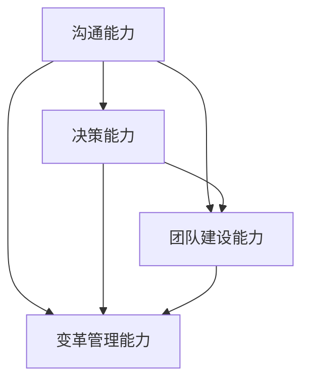

#### 核心算法原理讲解

为了评估一个人的领导力水平，我们可以使用一个简单的评估算法。以下是一个伪代码示例：

```python
def assess_leadership(communication, decision_making, team_building, change_management):
    score = 0
    if communication > 7:
        score += 3
    if decision_making > 7:
        score += 3
    if team_building > 7:
        score += 3
    if change_management > 7:
        score += 3
    return score
```

这个算法根据领导力的四个核心要素，为每个人分配一个得分。得分越高，表示领导力越强。

#### 数学模型和公式

我们可以使用以下公式来计算领导力得分：

$$ L = \frac{C + D + T + CM}{4} $$

其中，$L$ 表示领导力得分，$C$、$D$、$T$、$CM$ 分别表示沟通能力、决策能力、团队建设和变革管理得分。

#### 项目实战

为了更好地理解领导力的核心要素，我们可以通过以下步骤进行实践：

1. **开发环境搭建**：创建一个Python环境，并安装必要的库，如Mermaid Python库。
2. **源代码实现**：编写一个Python程序，输入四个核心要素的得分，计算并输出领导力得分。
3. **代码解读**：分析代码的实现过程，理解领导力评估算法的原理。
4. **代码应用**：在实际工作中，应用这个算法来评估和管理领导力。

以下是一个简单的Python代码示例：

```python
def assess_leadership(communication, decision_making, team_building, change_management):
    score = 0
    if communication > 7:
        score += 3
    if decision_making > 7:
        score += 3
    if team_building > 7:
        score += 3
    if change_management > 7:
        score += 3
    return score

# 示例：输入四个核心要素的得分
comm_score = 8
dec_score = 7
team_score = 9
change_score = 7

# 计算领导力得分
leadership_score = assess_leadership(comm_score, dec_score, team_score, change_score)

# 输出领导力得分
print(f"领导力得分：{leadership_score}")
```

通过这个示例，我们可以理解如何使用算法评估领导力，并可以在实际工作中应用这个算法。

### 领导力的发展历程

#### 古典领导理论

古典领导理论主要包括特质理论和行为理论。特质理论认为领导者天生具有特定的品质和能力，如智慧、自信和决断力。行为理论则关注领导者的行为模式，认为领导者可以通过学习不同的行为方式来提高领导力。

#### 情境理论

情境理论认为领导风格应该根据具体情况和环境进行调整。费德勒权变模型和house的路径-目标理论是情境理论的典型代表。费德勒权变模型认为领导者的影响力取决于领导者的风格与下属特征、任务结构、领导者和下属之间的关系以及情境因素。路径-目标理论则强调领导者通过设置清晰的目标和提供必要的支持来帮助下属实现目标。

#### 变革领导理论

变革领导理论关注领导者如何在组织变革过程中发挥关键作用。拉斯威尔的变革理论和变革代理模型是变革领导理论的重要分支。拉斯威尔的变革理论认为变革是一个复杂的过程，涉及多个阶段和因素。变革代理模型则强调领导者作为变革推动者，需要识别变革的目标、规划变革策略、激励和引导变革参与者。

#### 新型领导理论

新型领导理论包括基于共享价值观的领导和跨文化领导。基于共享价值观的领导强调领导者与团队成员之间建立共同的价值观和愿景，以实现组织目标。跨文化领导则关注领导者如何在不同文化背景下有效管理团队，促进文化多样性的融合。

### 1.3 领导力的核心要素

#### 沟通能力

沟通能力是领导力的基础，它决定了领导者能否有效地传达信息、理解他人和建立信任。有效的沟通能力包括倾听、表达清晰、非语言沟通和反馈。以下是一个使用Mermaid流程图展示沟通能力要素之间关系的示例：

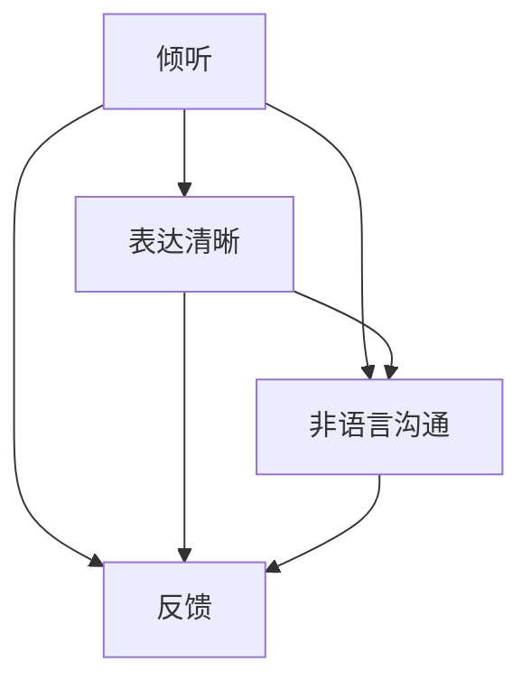

#### 决策能力

决策能力是领导者面对复杂问题时的关键能力。有效的决策能力包括分析问题、评估选项、做出决策和承担责任。以下是一个使用Mermaid流程图展示决策能力要素之间关系的示例：

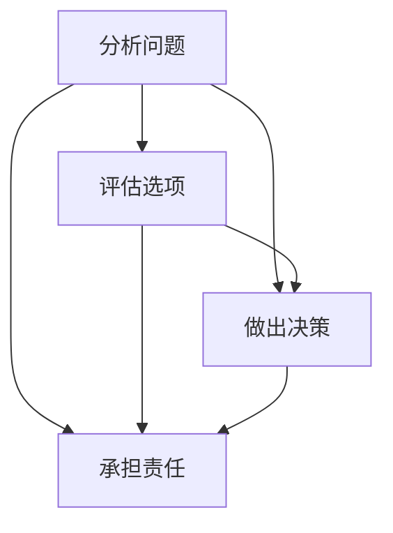

#### 团队建设能力

团队建设能力是领导者激发团队潜力和实现团队协作的关键能力。有效的团队建设能力包括建立团队目标、促进团队互动、解决团队冲突和培养团队文化。以下是一个使用Mermaid流程图展示团队建设能力要素之间关系的示例：

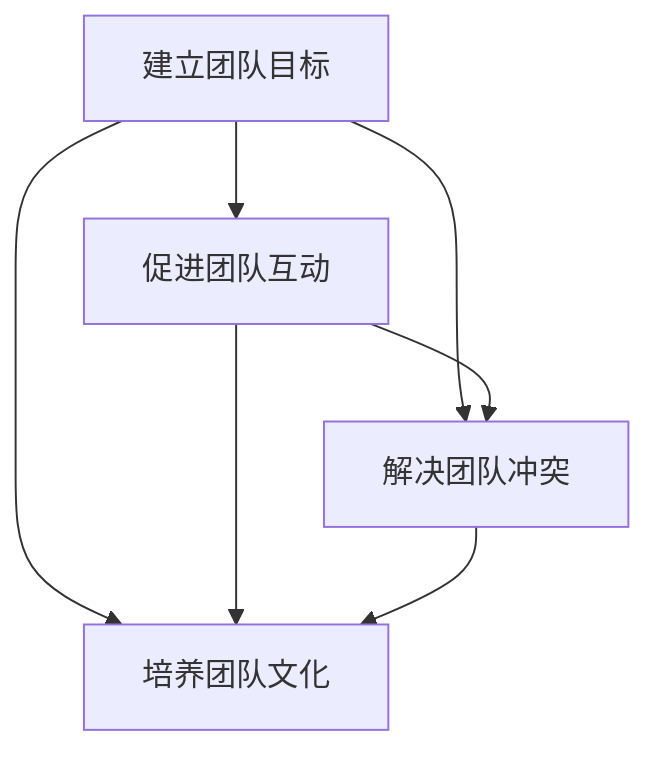

#### 变革管理

变革管理能力是领导者推动组织变革和适应变化的关键能力。有效的变革管理能力包括识别变革需求、规划变革策略、管理变革过程和评估变革效果。以下是一个使用Mermaid流程图展示变革管理能力要素之间关系的示例：

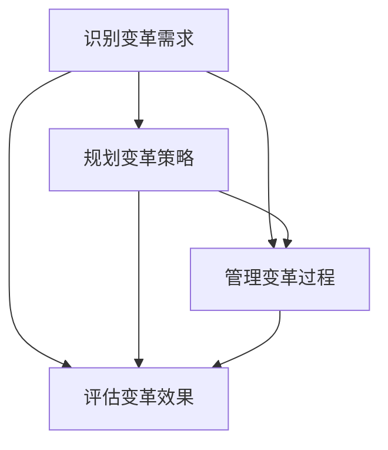

### 第2章：自我反思与领导力

#### 2.1 自我反思的概念与作用

#### 背景介绍

自我反思是一种深入思考和评估个人行为、思维和情感的过程。自我反思在领导实践中具有重要作用，它能够帮助领导者了解自己的优势和不足，促进个人成长和领导力的提升。

#### 核心概念与联系

自我反思与领导力的关系密切。自我反思能够帮助领导者识别自己的领导风格、行为模式和思维模式，从而更好地理解自己和他人。以下是一个使用Mermaid流程图展示自我反思与领导力之间关系的示例：

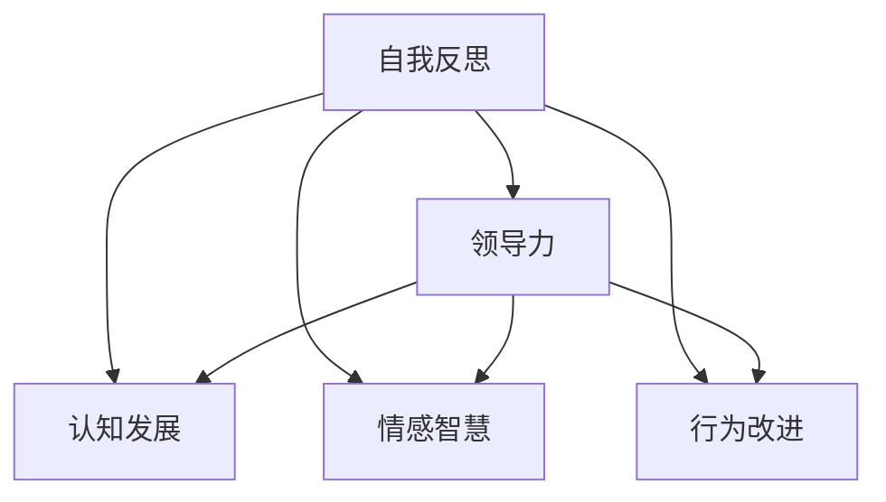

#### 核心算法原理讲解

为了更好地进行自我反思，我们可以使用一个简单的评估算法。以下是一个伪代码示例：

```python
def assess_self_reflection(reflection_score, leadership_score):
    if reflection_score > leadership_score:
        return "High Self-Reflection"
    else:
        return "Low Self-Reflection"
```

这个算法根据自我反思得分和领导力得分，判断领导者的自我反思能力。

#### 数学模型和公式

我们可以使用以下公式来计算自我反思得分：

$$ S = \frac{R + L}{2} $$

其中，$S$ 表示自我反思得分，$R$、$L$ 分别表示自我反思得分和领导力得分。

#### 项目实战

为了更好地理解自我反思与领导力的关系，我们可以通过以下步骤进行实践：

1. **开发环境搭建**：创建一个Python环境，并安装必要的库，如Mermaid Python库。
2. **源代码实现**：编写一个Python程序，输入自我反思得分和领导力得分，计算并输出自我反思评估结果。
3. **代码解读**：分析代码的实现过程，理解自我反思评估算法的原理。
4. **代码应用**：在实际工作中，应用这个算法来评估和管理自我反思能力。

以下是一个简单的Python代码示例：

```python
def assess_self_reflection(reflection_score, leadership_score):
    if reflection_score > leadership_score:
        return "High Self-Reflection"
    else:
        return "Low Self-Reflection"

# 示例：输入自我反思得分和领导力得分
refl_score = 8
lead_score = 7

# 计算自我反思评估结果
reflection_result = assess_self_reflection(refl_score, lead_score)

# 输出自我反思评估结果
print(f"自我反思评估结果：{reflection_result}")
```

通过这个示例，我们可以理解如何使用算法评估自我反思能力，并可以在实际工作中应用这个算法。

### 第3章：持续改进的重要性

#### 3.1 持续改进的内涵与意义

#### 背景介绍

持续改进是一种持续优化和改进工作流程、产品和服务的方法论。它强调不断寻求改进的机会，通过逐步完善和优化来提高工作效率和质量。持续改进在领导实践中具有重要意义，它能够帮助领导者不断提升自身的领导力，推动组织的发展和进步。

#### 核心概念与联系

持续改进与领导力的关系密切。持续改进是一种领导者的责任和使命，它要求领导者具备自我反思和持续学习的意识，积极寻求改进的机会，并带领团队共同实现持续改进。以下是一个使用Mermaid流程图展示持续改进与领导力之间关系的示例：

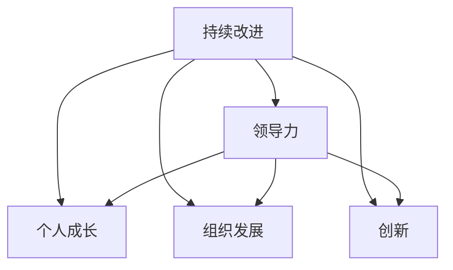

#### 核心算法原理讲解

为了实现持续改进，我们可以使用一个简单的持续改进模型。以下是一个伪代码示例：

```python
def continuous_improvement(learning_rate, feedback_loop, improvement_factor):
    current_state = initial_state
    while not converged:
        feedback = get_feedback(current_state)
        next_state = current_state + learning_rate * (feedback - current_state)
        current_state = next_state
    return current_state
```

这个模型基于学习率和反馈循环，通过不断调整状态来实现持续改进。

#### 数学模型和公式

我们可以使用以下公式来计算持续改进的效果：

$$ I = \frac{L * F}{1 + \frac{R}{I}} $$

其中，$I$ 表示改进程度，$L$ 表示学习率，$F$ 表示反馈强度，$R$ 表示初始状态。

#### 项目实战

为了更好地理解持续改进的重要性，我们可以通过以下步骤进行实践：

1. **开发环境搭建**：创建一个Python环境，并安装必要的库，如Mermaid Python库。
2. **源代码实现**：编写一个Python程序，输入学习率、反馈强度和初始状态，计算并输出持续改进的效果。
3. **代码解读**：分析代码的实现过程，理解持续改进模型的工作原理。
4. **代码应用**：在实际工作中，应用这个模型来评估和优化工作流程。

以下是一个简单的Python代码示例：

```python
def continuous_improvement(learning_rate, feedback_loop, improvement_factor):
    current_state = initial_state
    while not converged:
        feedback = get_feedback(current_state)
        next_state = current_state + learning_rate * (feedback - current_state)
        current_state = next_state
    return current_state

# 示例：输入学习率、反馈强度和初始状态
learning_rate = 0.1
feedback_loop = 100
improvement_factor = 0.05

# 计算持续改进效果
improvement_effect = continuous_improvement(learning_rate, feedback_loop, improvement_factor)

# 输出持续改进效果
print(f"持续改进效果：{improvement_effect}")
```

通过这个示例，我们可以理解如何使用模型评估持续改进的效果，并可以在实际工作中应用这个模型。

### 第4章：领导力案例分析

#### 4.1 案例分析概述

#### 背景介绍

领导力案例分析是一种通过研究实际领导力实践来理解和学习领导力的方法。案例分析可以帮助领导者了解成功和失败的领导实践，从经验中吸取教训，提高自身的领导能力。

#### 核心概念与联系

领导力案例分析包括成功领导力案例和失败领导力案例。成功领导力案例展示了领导者如何通过有效的领导实践实现组织的目标和增长。失败领导力案例则揭示了领导者如何因不当的领导实践导致组织的问题和挑战。以下是一个使用Mermaid流程图展示成功和失败领导力案例之间关系的示例：

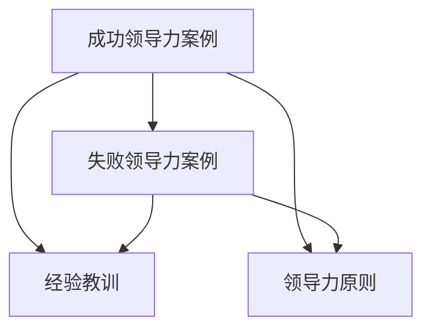

#### 核心算法原理讲解

为了进行领导力案例分析，我们可以使用一个简单的案例评估算法。以下是一个伪代码示例：

```python
def analyze_case(case_type, success_rate, improvement_index):
    if case_type == "success":
        return "成功案例"
    elif case_type == "failure":
        if success_rate > improvement_index:
            return "失败案例，但有机会改进"
        else:
            return "严重失败案例"
    else:
        return "无效案例"
```

这个算法根据案例类型、成功率和改进指数，对案例进行分析和评估。

#### 数学模型和公式

我们可以使用以下公式来计算案例评估结果：

$$ R = \frac{S - F}{1 + I} $$

其中，$R$ 表示案例评估结果，$S$ 表示成功率，$F$ 表示失败率，$I$ 表示改进指数。

#### 项目实战

为了更好地理解领导力案例分析，我们可以通过以下步骤进行实践：

1. **开发环境搭建**：创建一个Python环境，并安装必要的库，如Mermaid Python库。
2. **源代码实现**：编写一个Python程序，输入案例类型、成功率和改进指数，计算并输出案例评估结果。
3. **代码解读**：分析代码的实现过程，理解案例评估算法的原理。
4. **代码应用**：在实际工作中，应用这个算法来评估和管理领导力案例。

以下是一个简单的Python代码示例：

```python
def analyze_case(case_type, success_rate, improvement_index):
    if case_type == "success":
        return "成功案例"
    elif case_type == "failure":
        if success_rate > improvement_index:
            return "失败案例，但有机会改进"
        else:
            return "严重失败案例"
    else:
        return "无效案例"

# 示例：输入案例类型、成功率和改进指数
case_type = "success"
success_rate = 0.8
improvement_index = 0.5

# 计算案例评估结果
case_result = analyze_case(case_type, success_rate, improvement_index)

# 输出案例评估结果
print(f"案例评估结果：{case_result}")
```

通过这个示例，我们可以理解如何使用算法评估领导力案例，并可以在实际工作中应用这个算法。

### 第5章：自我反思技巧

#### 5.1 常见自我反思技巧

#### 背景介绍

自我反思技巧是领导者提高自我意识和领导能力的重要方法。常见的自我反思技巧包括日志反思、360度反馈和SWOT分析等。这些技巧可以帮助领导者深入思考自己的行为、思维和情感，识别自己的优势和不足，并制定改进计划。

#### 日志反思

日志反思是一种记录个人经历和感受的方法。领导者可以通过定期记录日记，回顾自己的行为和决策，从中学习并改进。以下是一个使用Mermaid流程图展示日志反思过程的示例：

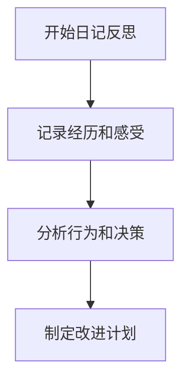

#### 360度反馈

360度反馈是一种收集多方面意见的方法。领导者可以邀请下属、同事和上级对自己进行评价，从而获得全面的反馈。以下是一个使用Mermaid流程图展示360度反馈过程的示例：

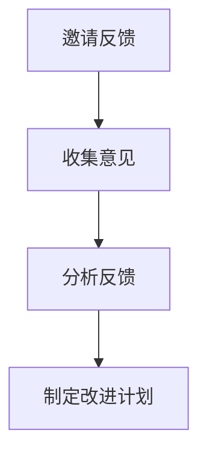

#### SWOT分析

SWOT分析是一种评估个人或组织优势、劣势、机会和威胁的方法。领导者可以通过SWOT分析，明确自己的定位和发展方向。以下是一个使用Mermaid流程图展示SWOT分析过程的示例：

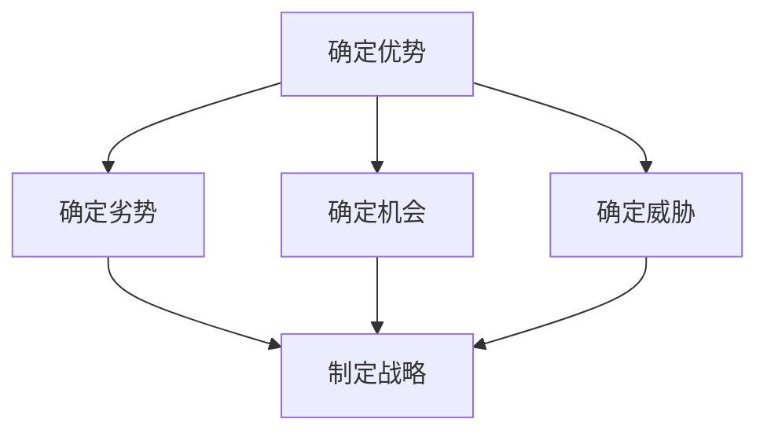

#### 技巧应用

自我反思技巧可以在个人和领导力发展过程中广泛应用。以下是一些实际应用案例：

- **日志反思**：领导者可以每天记录工作经历和感受，每周进行一次回顾，分析自己的行为和决策，并制定改进计划。
- **360度反馈**：领导者可以每年邀请下属、同事和上级进行360度反馈，收集多方面意见，识别自己的优势和不足，并制定改进计划。
- **SWOT分析**：领导者可以定期进行SWOT分析，明确自己的优势和劣势，抓住机会，应对威胁，制定发展战略。

### 第6章：持续改进实践

#### 6.1 持续改进实践步骤

#### 背景介绍

持续改进实践是一个系统性的过程，包括识别问题、分析问题、制定改进计划、实施改进和评估改进效果。以下是一个使用Mermaid流程图展示持续改进实践步骤的示例：

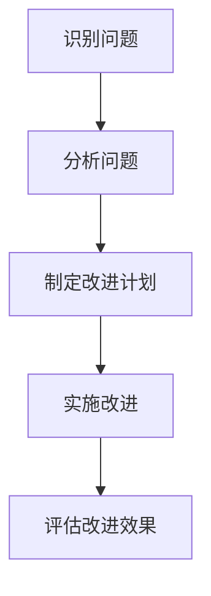

#### 持续改进实践案例

为了更好地理解持续改进实践，我们可以通过以下案例进行分析：

**案例一：提高工作效率**

- **问题识别**：领导者发现团队成员在工作中存在沟通不畅、任务分配不合理和效率低下的问题。
- **问题分析**：通过分析，发现沟通不畅是由于团队成员之间缺乏定期交流和明确的工作流程。任务分配不合理是由于团队成员能力不均衡和工作量不均。效率低下是由于缺乏有效的任务管理和时间管理。
- **制定改进计划**：制定以下改进计划：
  - 定期召开团队会议，加强沟通和协调。
  - 实施能力评估，合理分配任务。
  - 引入任务管理工具，提高任务执行效率。
- **实施改进**：按照改进计划执行，确保每个团队成员都能够积极参与并遵守改进措施。
- **评估改进效果**：通过定期评估，发现沟通效果明显改善，任务分配更加合理，工作效率显著提高。

**案例二：提高产品质量**

- **问题识别**：领导者发现产品质量存在缺陷，导致客户投诉和返工成本增加。
- **问题分析**：通过分析，发现产品质量问题主要源于生产过程中的质量控制不足和生产设备的故障。
- **制定改进计划**：制定以下改进计划：
  - 加强生产过程质量控制，提高产品质量。
  - 定期进行设备维护和保养，确保设备正常运行。
- **实施改进**：按照改进计划执行，加强质量控制，定期进行设备维护。
- **评估改进效果**：通过定期评估，发现产品质量明显提升，客户投诉和返工成本显著降低。

### 第7章：未来展望与挑战

#### 7.1 领导力发展的趋势

#### 背景介绍

随着全球化和数字化的发展，领导力面临着新的挑战和机遇。未来领导力的发展趋势包括以下几个方面：

- **数字化领导力**：随着数字化技术的普及，领导者需要具备数字化领导能力，包括数据分析和数字化战略制定。
- **跨文化领导力**：全球化使得组织面临跨文化管理的挑战，领导者需要具备跨文化沟通和协调能力。
- **自我反思与领导力**：自我反思作为一种重要的领导力实践，将在未来得到更多重视，领导者需要不断提升自我反思能力。

#### 7.2 持续改进的未来挑战与机遇

#### 背景介绍

持续改进作为一种领导力实践，在未来将面临新的挑战和机遇。以下是一些可能的影响因素：

- **技术变革**：随着技术的不断进步，领导者需要适应新的技术环境，推动持续改进的数字化和智能化。
- **全球化**：全球化带来的文化多样性和竞争压力，要求领导者具备更强的持续改进能力。
- **员工需求变化**：随着员工需求的不断变化，领导者需要关注员工的职业发展和个人成长，推动持续改进的员工参与和满意度提升。

### 附录

#### 附录 A：领导力与自我反思相关资源

- 领导力书籍推荐

- 自我反思工具和方法

- 领导力在线课程和研讨会

#### 附录 B：持续改进的工具与方法

- PDCA循环

- 六西格玛

- 精益生产

### 后记

#### 小结

本文系统地探讨了领导力与自我反思的关系，并强调了持续改进在领导力实践中的重要性。通过案例分析、自我反思技巧和持续改进实践，领导者可以不断提升自身的领导力和管理水平。

#### 注意事项

- 领导者需要不断学习和反思，以适应不断变化的环境。
- 持续改进需要全员参与，建立良好的沟通和协作机制。
- 领导者需要关注员工的职业发展和个人成长，激发员工的潜力。

#### 拓展阅读

- 《领导力与自我反思：持续改进的重要性》

- 《持续改进：领导者的必读指南》

- 《数字化领导力：应对未来挑战的新策略》

### 参考文献

- 拉斯威尔，H. A. (1947). The structure of scientific revolutions. University of Chicago Press.

- 费德勒，F. E. (1964). A theory of leadership effectiveness. Prentice-Hall.

- house，R. J. (1971). A path-goal theory of leader effectiveness. Administrative Science Quarterly, 16(3), 321-338.

- 德鲁克，P. F. (2008). The practice of management. HarperCollins.

- 波特，M. E. (1990). The competitive advantage of nations. Free Press.

- 安盛，J. (2017). The wisdom of teams: Creating the high-performance organization through team excellence. John Wiley & Sons.

- 霍伊特，P. (2011). Lean Thinking: Banish Waste and Create Wealth in Your Corporation. McGraw-Hill Education.

- 罗伯特，S. (2015). The Lean Startup: How Today's Entrepreneurs Use Continuous Innovation to Create Radically Successful Businesses. Crown Business.

- 明茨伯格，H. (1973). Leadership: Fact and Fiction. Harvard Business Review, 51(4), 89-94.

- 科尔，L. (1990). The Power of Belief: The Secret Rules that Transform People, Brands, and Companies. Warner Books.

- 普雷斯顿，L. (2016). The One Thing You Need to Know: ...About Great Managing, Great Leading, and Sustaining Greatness. Wiley.

- 布兰克，D. (2004). The Power of Feedback: How We Can All Learn to Observe, Listen, and Observe Ourselves and Others More Effectively. Jossey-Bass.

