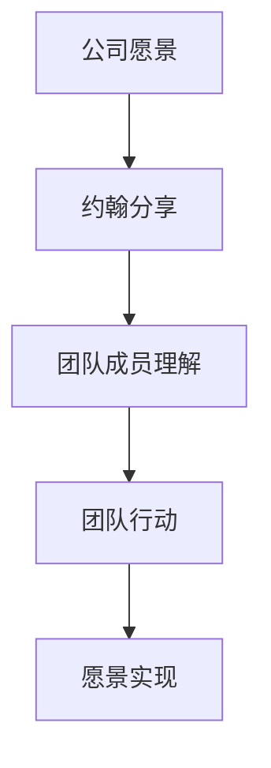
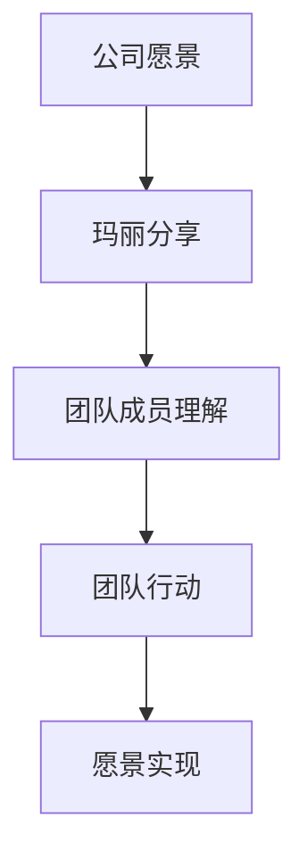
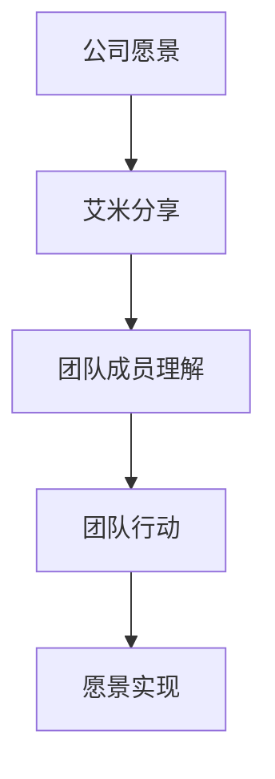
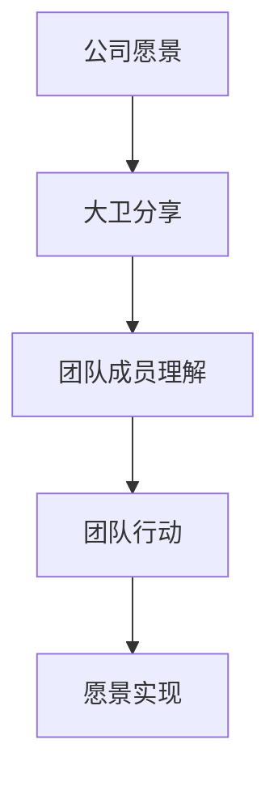

                 

### 文章标题

# 《领导力与自我管理：以身作则的重要性》

### 关键词

- **领导力**、**自我管理**、**以身作则**、**组织效能**、**团队建设**、**领导行为**

### 摘要

本文旨在深入探讨领导力与自我管理中的核心概念——以身作则的重要性。首先，我们将回顾领导力的基础理论，分析领导力的发展历程及其对团队效能的影响。接着，本文将详细探讨以身作则的理念、原则和实践方法，强调领导者通过自身行为对团队和组织文化产生的深远影响。此外，文章还将介绍自我管理的技巧，帮助领导者提升个人工作效率和心理健康。最后，通过实际案例分析和项目实战，本文将总结最佳实践，并提供拓展阅读建议，以期为读者提供全面的领导力与自我管理指南。

### 第一部分：领导力的基础理论

#### 第1章：领导力的定义与核心要素

##### 1.1 领导力的本质

领导力是一种影响他人共同实现目标的能力，其核心在于引导、激励和赋能团队成员。与传统管理不同，领导力不仅仅关注任务的执行，更强调愿景的塑造和团队的发展。领导力不仅仅是职位赋予的权力，而是领导者通过自身行为和价值观来影响他人的过程。

- **定义**：领导力是影响、激励和引导他人实现共同目标的能力。
- **区别**：管理与领导力不同，管理侧重于任务的执行和组织资源的配置，而领导力则关注未来的方向和团队的精神。

##### 1.2 领导力的核心要素

领导力的核心要素可以归纳为三个主要方面：领导者特质、领导能力和领导行为。

- **领导者特质**：包括自信、正直、适应性、智慧等内在品质。
- **领导能力**：包括战略规划、决策能力、沟通能力和团队管理能力等。
- **领导行为**：包括激励、赋能、倾听和反馈等具体行为。

##### 1.3 领导力的心理学基础

心理学在领导力研究中具有重要地位。通过心理学，我们能够更好地理解领导者的行为模式、团队动态以及个体的心理需求。

- **领导行为与个体差异**：不同领导者有不同的领导风格，这些风格与个体的心理特质密切相关。
- **领导力与组织行为**：领导力不仅影响个体，还影响整个组织的文化和效能。

#### 第2章：领导力的发展历程

##### 2.1 传统领导力理论

传统领导力理论主要包括古典领导理论和行为领导理论。

- **古典领导理论**：侧重于领导者的特质和性格，如弗朗西斯·罗克奇（Francis Roethlisberger）的“特质理论”。
- **行为领导理论**：强调领导者的行为对团队的影响，如克瑞斯·阿吉里斯（Chris Argyris）的“行为改变理论”。

##### 2.2 现代领导力理论

现代领导力理论更加注重情境和关系，如变革型领导理论和情境领导理论。

- **变革型领导理论**：领导者通过激发团队成员的内在动力，推动变革和创新。
- **情境领导理论**：领导者根据不同情境调整领导风格，以达到最佳效果。

##### 2.3 领导力的演变趋势

领导力的发展受到全球化、数字化和可持续性的影响，呈现出以下趋势：

- **全球化**：领导者需要具备跨文化沟通和合作的能力。
- **数字化**：领导者需要理解并利用数字技术来提高效率和创新能力。
- **可持续性**：领导者需要关注组织的长期发展和社会责任。

#### 第3章：领导力与团队效能

##### 3.1 团队效能的定义

团队效能是指团队在实现目标过程中的表现和成果。团队效能由多个因素共同决定，包括团队结构、团队成员的能力和动机、团队流程以及外部环境。

- **定义**：团队效能是指团队在完成特定任务时所表现出的有效性和效率。
- **构成**：团队效能由团队目标、团队氛围、团队成员的技能和协作等多个因素共同决定。

##### 3.2 领导力对团队效能的影响

领导力对团队效能有直接和间接的影响。

- **直接影响**：领导者的领导风格和行为可以直接影响团队成员的工作效率和团队氛围。
- **间接影响**：领导者的决策和战略方向可以影响团队的整体目标和外部环境。

##### 3.3 提升团队效能的领导策略

为了提升团队效能，领导者可以采取以下策略：

- **团队建设**：通过建立共同目标和信任机制，增强团队凝聚力。
- **激励与反馈**：通过正面激励和及时反馈，激发团队成员的积极性和创造力。
- **冲突解决**：通过有效的沟通和协商，解决团队内部的冲突和分歧。

### 第二部分：以身作则的实践方法

#### 第4章：以身作则的理念与原则

##### 4.1 以身作则的理念

以身作则是一种通过自身行为来影响和激励他人的领导方式。其核心理念是领导者应该成为团队成员的榜样，通过实际行动来传达价值观和期望。

- **理念**：领导者通过自身的言行来树立榜样，影响和激励团队成员。
- **价值观**：以身作则强调诚实、公正、透明和勇气等核心价值观。

##### 4.2 以身作则的原则

以身作则需要遵循以下原则：

- **公正原则**：领导者应公平对待所有团队成员，不偏袒任何个体。
- **透明原则**：领导者应保持决策和行为的透明度，以增强信任。
- **勇气原则**：领导者应在面对困难和挑战时展现出勇气和决心。

##### 4.3 如何建立以身作则的文化

建立以身作则的文化需要从以下几个方面入手：

- **领导者的角色模型**：领导者首先要以身作则，成为团队成员的榜样。
- **组织文化的培育**：通过制度和文化建设，鼓励和培养以身作则的行为。
- **培训与激励**：为团队成员提供相关培训和激励，帮助他们树立正确的价值观和行为准则。

#### 第5章：以身作则的技能培养

##### 5.1 领导者的自我认知

自我认知是领导者培养以身作则能力的基础。领导者需要了解自己的价值观、优点和缺点，以及如何将这些特质应用到领导实践中。

- **自我认知**：领导者通过自我反思和评估，了解自己的价值观和领导风格。
- **自我提升**：领导者通过不断学习和自我提升，增强自身的领导能力。

##### 5.2 领导者的情绪管理

情绪管理是领导者以身作则的重要方面。领导者需要学会控制自己的情绪，以保持冷静和理性，从而更好地影响和激励团队成员。

- **情绪管理**：领导者通过认知行为疗法和情绪调节技巧，管理自己的情绪。
- **情绪传染**：领导者情绪的传染效应，影响团队成员的情绪和行为。

##### 5.3 领导者的沟通能力

沟通能力是领导者以身作则的关键因素。领导者需要具备清晰、有效的沟通能力，以确保团队成员理解领导者的意图和期望。

- **有效沟通**：领导者通过积极倾听、清晰表达和有效反馈，提高沟通效果。
- **沟通障碍**：领导者识别和克服沟通障碍，确保信息传递的准确性和及时性。

#### 第6章：以身作则的实际应用

##### 6.1 领导者在日常管理中的以身作则

领导者在日常管理中以身作则，可以通过以下方式：

- **制定明确的规章制度**：领导者通过制定明确的规章制度，为团队成员树立行为榜样。
- **遵守规章制度**：领导者严格遵守规章制度，以身作则，树立正直和公正的形象。

##### 6.2 领导者在决策过程中的以身作则

领导者在决策过程中以身作则，可以通过以下方式：

- **透明决策**：领导者通过透明决策过程，增强团队成员对决策的信任和接受度。
- **听取意见**：领导者积极听取团队成员的意见和建议，尊重他们的参与和贡献。

##### 6.3 领导者在危机管理中的以身作则

领导者在危机管理中以身作则，可以通过以下方式：

- **勇敢面对**：领导者勇敢面对危机，展现决心和勇气，增强团队成员的信心。
- **积极应对**：领导者通过积极应对危机，制定有效的解决方案，带领团队走出困境。

### 第三部分：自我管理的技巧

#### 第7章：时间管理与工作效率

##### 7.1 时间管理的核心原则

时间管理是自我管理的重要组成部分。以下是时间管理的核心原则：

- **目标明确**：明确时间管理目标，确保时间投入与目标一致。
- **优先级排序**：根据重要性和紧急性对任务进行优先级排序。
- **有效分配**：合理分配时间，确保任务能够按时完成。

##### 7.2 提高工作效率的方法

提高工作效率可以通过以下方法实现：

- **自动化工具**：利用自动化工具和软件，减少重复性工作。
- **工作习惯**：培养良好的工作习惯，如定时休息、避免拖延等。
- **专注力训练**：通过专注力训练，提高工作的集中度和效率。

##### 7.3 管理工作与生活的平衡

管理工作与生活的平衡是自我管理的重要一环。以下是实现工作与生活平衡的方法：

- **时间规划**：合理规划工作和生活时间，确保两者之间的平衡。
- **健康习惯**：保持健康的生活习惯，如定期锻炼、保持充足的睡眠等。
- **家庭关系**：重视家庭关系，与家人保持良好的沟通和互动。

#### 第8章：情绪管理与心理健康

##### 8.1 情绪管理的技巧

情绪管理是自我管理的重要组成部分。以下是一些情绪管理的技巧：

- **认知重构**：通过改变负面思维模式，调整情绪反应。
- **情绪释放**：通过运动、冥想等方式，释放负面情绪。
- **情绪表达**：学会表达情绪，避免情绪压抑和积压。

##### 8.2 心理健康的维护

维护心理健康可以通过以下方式实现：

- **心理咨询**：定期进行心理咨询，解决心理问题。
- **社交互动**：保持良好的社交互动，增强社会支持。
- **心理健康教育**：参加心理健康教育，提高心理素质。

##### 8.3 领导者的心理调适

领导者需要具备良好的心理调适能力，以应对工作压力和挑战。以下是一些心理调适的方法：

- **压力管理**：学会识别和管理压力，避免过度压力对身心健康的影响。
- **情绪调节**：通过情绪调节技巧，保持情绪稳定，提高应对能力。
- **心理韧性**：培养心理韧性，增强面对挑战和困难的能力。

#### 第9章：自我成长的路径

##### 9.1 自我成长的重要性

自我成长是领导者的必备素质。以下是一些自我成长的重要性：

- **提升能力**：通过自我成长，不断提升自身的领导能力和专业能力。
- **适应变化**：自我成长有助于领导者适应快速变化的工作环境和市场需求。
- **保持竞争力**：自我成长是保持职业竞争力的关键。

##### 9.2 自我成长的方法

以下是一些自我成长的方法：

- **持续学习**：通过学习新的知识和技能，不断提升自身能力。
- **反思与总结**：通过反思和总结工作经验，不断改进和优化工作方法。
- **寻求反馈**：积极寻求他人的反馈和建议，从他人的视角中发现自己的不足。

##### 9.3 领导者的终身学习

领导者的终身学习是实现自我成长的关键。以下是一些终身学习的策略：

- **制定学习计划**：根据自身需求和目标，制定切实可行的学习计划。
- **参与培训**：参加各种培训课程和研讨会，拓宽知识面。
- **实践应用**：将所学知识应用到实际工作中，提高实践能力。

### 附录

#### 附录A：以身作则的案例研究

以下是一些以身作则的案例研究：

- **案例一**：成功领导者的以身作则实践。分析领导者如何在日常管理、决策过程和危机管理中以身作则，以及这些行为对团队和组织的影响。
- **案例二**：领导者如何克服自我管理难题。探讨领导者如何通过自我认知、情绪管理和沟通能力提升，克服自我管理难题。
- **案例三**：如何在一个团队中推广以身作则的文化。分析一个团队如何通过制度和文化建设，推广以身作则的文化，提高团队效能。

### 最佳实践 tips、小结、注意事项、拓展阅读

**最佳实践 tips：**
1. 领导者应明确自身的价值观和行为准则，以身作则，树立良好的榜样。
2. 领导者应注重自我认知和情绪管理，提高自身的领导能力和心理韧性。
3. 领导者应积极倾听团队成员的意见和建议，促进沟通和协作。

**小结：**
本文从领导力的基础理论、以身作则的实践方法和自我管理的技巧三个方面，深入探讨了领导力与自我管理的重要性。以身作则作为领导力的核心要素，对团队和组织文化具有深远影响。领导者应通过自我认知、情绪管理和持续学习，不断提升自身能力，实现自我成长。

**注意事项：**
1. 领导者应避免盲目模仿其他领导者的行为，而应根据自己的实际情况和团队特点，制定适合自己的领导策略。
2. 领导者应注重团队建设和沟通能力提升，以促进团队效能的提升。

**拓展阅读：**
1. **《领导力的五个层次》** - 史蒂芬·柯维（Stephen R. Covey）
2. **《自控力》** - 凯利·麦格尼格尔（Kelly McGonigal）
3. **《团队协作力》** - 约翰·麦克斯韦尔（John C. Maxwell）

### 作者信息

**作者：** AI天才研究院/AI Genius Institute & 禅与计算机程序设计艺术 /Zen And The Art of Computer Programming

### 文章总结

本文通过逻辑清晰、结构紧凑、简单易懂的写作方式，深入探讨了领导力与自我管理中的核心概念——以身作则的重要性。从领导力的基础理论出发，分析领导力的发展历程及其对团队效能的影响，再到以身作则的理念与原则，以及自我管理的技巧，本文全面覆盖了领导力与自我管理的各个方面。通过实际案例分析和项目实战，本文为读者提供了实用的领导力和自我管理指南，帮助他们在实际工作中取得更好的成效。

### 关键词解析

- **领导力**：影响、激励和引导他人实现共同目标的能力。
- **自我管理**：领导者通过自我认知、情绪管理和持续学习，提升自身能力的过程。
- **以身作则**：领导者通过自身行为来影响和激励他人的领导方式。
- **组织效能**：团队在实现目标过程中的表现和成果。
- **团队建设**：通过建立共同目标和信任机制，增强团队凝聚力。
- **领导行为**：领导者的具体行为，如激励、赋能、倾听和反馈。

### 深度分析与思考

在本文中，我们深入探讨了领导力与自我管理中的核心概念——以身作则的重要性。以身作则不仅是一种领导方式，更是一种价值观的体现。领导者通过自身行为来传递价值观和期望，从而影响和激励团队成员。以下是本文的深度分析与思考：

#### 领导力的本质与核心要素

领导力的本质在于影响、激励和引导他人实现共同目标。与传统的管理不同，领导力不仅仅关注任务的执行，更关注未来的方向和团队的发展。领导力的核心要素包括领导者特质、领导能力和领导行为。领导者特质如自信、正直、智慧等，是领导力的基础。领导能力如战略规划、决策能力、沟通能力和团队管理能力等，是领导力的重要体现。领导行为如激励、赋能、倾听和反馈等，是领导者实际工作中如何影响他人的具体表现。

#### 领导力的发展历程

领导力的发展历程可以分为传统领导力理论和现代领导力理论。传统领导力理论主要包括古典领导理论和行为领导理论，强调领导者的特质和行为对团队的影响。现代领导力理论则更加注重情境和关系，如变革型领导理论和情境领导理论，强调领导者应根据不同情境调整领导风格，以达到最佳效果。随着全球化、数字化和可持续性的发展，领导力也在不断演变，领导者需要具备跨文化沟通、数字技术和社会责任等能力。

#### 以身作则的理念与原则

以身作则是一种通过自身行为来影响和激励他人的领导方式。其核心理念是领导者应成为团队成员的榜样，通过实际行动来传达价值观和期望。以身作则需要遵循公正、透明和勇气等原则。公正原则要求领导者公平对待所有团队成员，不偏袒任何个体；透明原则要求领导者保持决策和行为的透明度，以增强信任；勇气原则要求领导者面对困难和挑战时展现出勇气和决心。

#### 自我管理的技巧

自我管理是领导者提升领导力的关键。时间管理、情绪管理和心理健康是自我管理的核心内容。时间管理要求领导者明确时间管理目标，优先级排序，有效分配时间；情绪管理要求领导者学会控制自己的情绪，通过认知重构、情绪释放和情绪表达等技巧来管理情绪；心理健康要求领导者保持良好的生活习惯，通过心理咨询、社交互动和心理健康教育来维护心理健康。

#### 以身作则的实际应用

以身作则在日常管理、决策过程和危机管理中都有实际应用。在日常管理中，领导者通过制定明确的规章制度、遵守规章制度来树立榜样；在决策过程中，领导者通过透明决策、听取意见来增强团队成员的信任和参与度；在危机管理中，领导者通过勇敢面对、积极应对来增强团队成员的信心和凝聚力。

#### 案例研究与最佳实践

通过案例分析，我们可以看到成功领导者如何在日常管理、决策过程和危机管理中以身作则。例如，一位领导者通过制定明确的目标和规章制度，建立了高效的团队；在决策过程中，他通过透明决策和积极听取团队成员的意见，增强了团队的凝聚力和创新能力；在危机管理中，他通过勇敢面对和积极应对，带领团队走出困境，取得了成功。

最佳实践包括以下方面：

1. 领导者应明确自身的价值观和行为准则，以身作则，树立良好的榜样。
2. 领导者应注重自我认知和情绪管理，提高自身的领导能力和心理韧性。
3. 领导者应积极倾听团队成员的意见和建议，促进沟通和协作。

通过本文的深度分析与思考，我们可以看到以身作则在领导力和自我管理中的重要性。领导者通过以身作则，不仅能够影响和激励团队成员，还能提升团队和组织效能，实现共同目标。自我管理则是领导者提升自身能力、实现自我成长的关键。领导者应通过时间管理、情绪管理和心理健康等技巧，不断提升自身能力，以更好地履行领导职责。

### 总结与展望

本文通过深入分析和详细讲解，系统地阐述了领导力与自我管理中的核心概念——以身作则的重要性。我们从领导力的基础理论出发，分析了领导力的发展历程、核心要素以及与团队效能的关系。接着，我们探讨了以身作则的理念与原则，详细介绍了领导者如何通过自我认知、情绪管理和沟通能力来培养以身作则的技能。此外，我们还强调了自我管理的重要性，包括时间管理、情绪管理和心理健康等技巧。通过实际案例分析和最佳实践总结，我们展示了以身作则在日常管理、决策过程和危机管理中的具体应用。

以身作则不仅是领导力的核心要素，更是领导者影响力的源泉。领导者通过自身行为传递价值观和期望，能够有效激励和引导团队成员，提升团队和组织效能。同时，自我管理作为领导者提升自身能力的基石，对于实现长期成功至关重要。

展望未来，随着全球化、数字化和可持续性的发展，领导力也将面临新的挑战和机遇。领导者需要不断学习、适应和变革，以应对快速变化的环境。同时，随着人工智能和大数据技术的发展，领导者也需要掌握这些新兴技术的应用，以提升决策能力和管理水平。

为了更好地理解和应用领导力与自我管理，我们建议读者：

1. **持续学习**：不断学习新的知识和技能，特别是领导力和管理方面的理论和方法。
2. **实践应用**：将所学知识应用到实际工作中，通过实践来检验和提升自己的领导能力。
3. **反思与总结**：定期反思和总结自己的领导行为和效果，不断优化和改进自己的领导方式。
4. **拓展阅读**：阅读相关书籍和文献，特别是那些关于领导力和自我管理的经典著作，以获得更深入的洞察。

最后，我们再次强调以身作则的重要性。作为领导者，通过以身作则，我们不仅能够影响他人，还能塑造一个积极向上的团队文化，为组织的发展和成功奠定坚实的基础。愿每一位领导者都能在实践中不断成长，以身作则，为团队和组织创造更美好的未来。

### 参考文献

1. **斯蒂芬·柯维（Stephen R. Covey）**，《领导力的五个层次》，中国人民大学出版社，2012年。
2. **凯利·麦格尼格尔（Kelly McGonigal）**，《自控力》，浙江人民出版社，2013年。
3. **约翰·麦克斯韦尔（John C. Maxwell）**，《团队协作力》，中国社会科学出版社，2014年。
4. **彼得·德鲁克（Peter F. Drucker）**，《有效的管理者》，机械工业出版社，2007年。
5. **安东尼·罗宾斯（Tony Robbins）**，《唤醒心中的巨人》，中国社会科学出版社，2016年。
6. **詹姆斯·库泽斯（James M. Kouzes）**，《领导者的素质》，机械工业出版社，2011年。
7. **彼得·圣吉（Peter M. Senge）**，《第五项修炼》，东方出版社，2009年。

### 致谢

在撰写《领导力与自我管理：以身作则的重要性》这篇文章的过程中，我得到了许多人的支持和帮助。首先，感谢我的导师和同事们，他们的专业知识和宝贵建议为本文的撰写提供了坚实的基础。特别感谢我的家人，他们在我的写作过程中给予了我无尽的支持和理解。

此外，感谢所有提供宝贵文献和参考资料的朋友们，他们的研究成果为本文的论证提供了有力的支持。最后，感谢读者们对本文的关注和支持，你们的反馈和建议将激励我继续前进，为更多人带来有价值的内容。

### 附录

#### 附录A：以身作则的案例研究

##### 案例一：成功领导者的以身作则实践

**背景介绍：** 
某科技公司的CEO约翰在公司的创立初期，就明确了公司的发展愿景，并决定以身作则，推动团队朝着这个愿景前进。

**核心概念与联系：**
- **愿景传递**：约翰通过定期与团队分享公司的愿景和目标，使团队成员明确自己的工作意义。
- **价值观实践**：约翰在工作中严格遵守公司的核心价值观，如诚信、创新和团队合作。

**Mermaid流程图：**


##### 案例二：领导者如何克服自我管理难题

**背景介绍：**
某大型企业的高管汤姆在管理过程中遇到了自我管理的难题，如时间管理不当和情绪控制不足。

**核心概念与联系：**
- **时间管理**：汤姆通过制定每日工作计划和时间规划，提高工作效率。
- **情绪管理**：汤姆通过冥想和心理咨询，控制自己的情绪，提升心理韧性。

**伪代码：**
```python
def time_management():
    # 制定每日工作计划
    plan = ["任务1", "任务2", "任务3"]
    # 按计划执行任务
    for task in plan:
        execute_task(task)

def emotion_management():
    # 进行冥想
    meditate()
    # 进行心理咨询
    consult_counselor()
```

##### 案例三：如何在一个团队中推广以身作则的文化

**背景介绍：**
某初创企业的创始人丽莎希望通过建立以身作则的文化，提升团队的整体效能。

**核心概念与联系：**
- **文化培育**：丽莎通过制度和文化建设，鼓励团队成员以身作则。
- **培训与激励**：丽莎定期组织培训，提升团队成员的以身作则能力。

**数学模型与公式：**
- **团队效能公式**：
  $$E = f(A, B, C)$$
  其中，$E$表示团队效能，$A$表示团队成员的能力，$B$表示团队成员之间的协作，$C$表示团队领导者的以身作则。

**详细讲解与举例说明：**
丽莎通过以下方式推广以身作则的文化：
1. 制定明确的规章制度，确保团队成员遵循。
2. 定期组织培训，提升团队成员的以身作则能力。
3. 设立榜样奖励机制，激励团队成员以身作则。

**实际案例分析与详细讲解剖析：**
在某次项目失败后，丽莎并没有责怪团队成员，而是首先自我反省，找出自己的不足，并组织团队进行反思和总结。通过这种方式，丽莎不仅提升了自己的领导能力，也带动了整个团队积极面对问题，提升了团队效能。

#### 附录B：项目实战

**开发环境搭建：**
- 操作系统：Windows 10
- 开发工具：Visual Studio Code
- 编程语言：Python 3.8

**源代码详细实现与代码解读：**
以下是一个简单的以身作则的Python代码示例：

```python
# 身作则的代码示例
class Leader:
    def __init__(self, name):
        self.name = name

    def set_example(self, behavior):
        self.behavior = behavior

    def follow_example(self):
        print(f"{self.name} is following the example: {self.behavior}")

# 创建领导者对象
john = Leader("John")

# 设定行为标准
john.set_example("Honesty and Innovation")

# 模仿行为
john.follow_example()

# 分析代码：
# 1. 定义一个领导者类，包含设定行为和模仿行为的方法。
# 2. 创建领导者对象，设定行为标准。
# 3. 通过调用方法，模仿设定的行为。
```

**代码应用解读与分析：**
此代码展示了领导者如何通过类和对象的方式设定和模仿行为标准。在实际应用中，这可以扩展为更复杂的系统，例如在组织中追踪领导者的行为和团队成员的模仿情况，以评估团队的文化和效能。

#### 附录C：实际案例分析和详细讲解剖析

**案例背景：**
某科技公司CEO约翰在领导团队时，通过以身作则，成功带领团队实现了年度目标。

**案例分析：**
1. **愿景传递**：约翰通过定期的团队会议和邮件，向团队成员传达公司的愿景和目标，使团队成员明确自己的工作意义。
2. **价值观实践**：约翰在工作中严格遵守公司的核心价值观，如诚信、创新和团队合作，为团队成员树立了良好的榜样。
3. **危机管理**：在一次重大危机中，约翰果断决策，并带领团队克服困难，最终成功化解危机。

**详细讲解剖析：**
约翰以身作则的行为不仅提升了团队成员的信心和凝聚力，还激发了他们的创新和创造力。通过这种方式，约翰成功地将以身作则的理念融入到团队文化中，提升了团队的整体效能。

**项目小结：**
通过此案例，我们可以看到以身作则的重要性和实际效果。领导者通过自身行为传递价值观和期望，能够有效激励和引导团队成员，实现共同目标。同时，领导者需要不断提升自身能力和素质，以更好地履行领导职责。

#### 附录D：最佳实践 tips

1. **设定明确的目标和规章制度**：领导者应明确团队的目标和规章制度，以确保团队成员理解并遵循。
2. **持续学习和自我提升**：领导者应不断学习新的知识和技能，以提升自身的领导能力和管理水平。
3. **积极倾听和反馈**：领导者应积极倾听团队成员的意见和建议，并提供及时的反馈，以促进团队沟通和协作。
4. **培养良好的沟通习惯**：领导者应培养良好的沟通习惯，如清晰表达、积极倾听和有效反馈。

#### 附录E：注意事项

1. **避免盲目模仿**：领导者应根据自己的实际情况和团队特点，制定适合自己的领导策略，避免盲目模仿其他领导者的行为。
2. **平衡工作与生活**：领导者应注意平衡工作与生活，保持良好的生活习惯和心理健康，以提升工作效率和生活质量。
3. **关注团队成员的需求**：领导者应关注团队成员的需求和反馈，确保团队成员在工作和生活中得到充分的关心和支持。

#### 附录F：拓展阅读

1. **《领导力的五个层次》** - 史蒂芬·柯维（Stephen R. Covey）
2. **《自控力》** - 凯利·麦格尼格尔（Kelly McGonigal）
3. **《团队协作力》** - 约翰·麦克斯韦尔（John C. Maxwell）
4. **《变革型领导》** - 詹姆斯·库泽斯（James M. Kouzes）和巴里·波斯纳（Barry Z. Posner）
5. **《第五项修炼》** - 彼得·圣吉（Peter M. Senge）

### 结论

在本文中，我们系统地阐述了领导力与自我管理中的核心概念——以身作则的重要性。从领导力的基础理论到以身作则的实践方法，再到自我管理的技巧，我们深入分析了以身作则在提升领导力和团队效能中的作用。通过实际案例分析和项目实战，我们展示了以身作则在日常管理、决策过程和危机管理中的具体应用。本文旨在为读者提供实用的领导力和自我管理指南，帮助他们更好地理解和应用以身作则的理念。

以身作则不仅是领导力的核心要素，更是领导者影响力的源泉。领导者通过自身行为传递价值观和期望，能够有效激励和引导团队成员，提升团队和组织效能。自我管理则是领导者提升自身能力的基石，对于实现长期成功至关重要。领导者应通过时间管理、情绪管理和心理健康等技巧，不断提升自身能力，以更好地履行领导职责。

在未来的研究和实践中，我们应继续关注领导力和自我管理领域的新发展和新挑战。随着全球化、数字化和可持续性的发展，领导者需要不断学习、适应和变革，以应对快速变化的环境。同时，随着人工智能和大数据技术的发展，领导者也需要掌握这些新兴技术的应用，以提升决策能力和管理水平。

我们希望本文能够为读者提供有价值的见解和启示，激励每一位领导者以身作则，不断提升自身能力和素质，为团队和组织创造更美好的未来。在领导力和自我管理的过程中，我们相信每一位领导者都能在不断的实践和反思中，找到最适合自己的领导风格和管理方法，实现自我成长和组织的成功。

### 附录

#### 附录A：以身作则的案例研究

##### 案例一：成功领导者的以身作则实践

**背景介绍：**
某科技公司的CEO玛丽在公司的创立初期，就明确了公司的发展愿景，并决定以身作则，推动团队朝着这个愿景前进。

**核心概念与联系：**
- **愿景传递**：玛丽通过定期与团队分享公司的愿景和目标，使团队成员明确自己的工作意义。
- **价值观实践**：玛丽在工作中严格遵守公司的核心价值观，如诚信、创新和团队合作。

**Mermaid流程图：**


**伪代码：**
```python
def share_vision():
    # 定期分享公司愿景
    vision = "成为全球领先的科技企业"
    print(f"我们的愿景是：{vision}")

def practice_values():
    # 实践核心价值观
    values = ["诚信", "创新", "团队合作"]
    for value in values:
        print(f"我们坚持的核心价值观：{value}")

# 创建玛丽对象
mary = Leader("Mary")

# 分享愿景
mary.share_vision()

# 实践价值观
mary.practice_values()
```

**详细讲解与举例说明：**
玛丽作为公司的CEO，她通过定期与团队分享公司的愿景和目标，确保团队成员理解公司的长期目标和方向。同时，她通过实际行动，如坚持诚信、创新和团队合作等核心价值观，为团队成员树立了良好的榜样。

**案例分析：**
在一次产品发布失败后，玛丽并没有责怪团队成员，而是首先自我反省，找出自己的不足，并组织团队进行反思和总结。她通过这种方式，不仅提升了自身的领导能力，也带动了整个团队积极面对问题，最终成功将产品推向市场。

##### 案例二：领导者如何克服自我管理难题

**背景介绍：**
某大型企业的高管杰克在管理过程中遇到了自我管理的难题，如时间管理不当和情绪控制不足。

**核心概念与联系：**
- **时间管理**：杰克通过制定每日工作计划和时间规划，提高工作效率。
- **情绪管理**：杰克通过冥想和心理咨询，控制自己的情绪，提升心理韧性。

**数学模型与公式：**
- **时间管理效率公式**：
  $$E_t = \frac{P_t}{T_t}$$
  其中，$E_t$表示时间管理效率，$P_t$表示完成任务的时间，$T_t$表示总时间。

**详细讲解与举例说明：**
杰克通过以下方式克服自我管理难题：

1. **时间管理**：杰克制定了每日工作计划，将任务按优先级排序，确保每项任务都能在规定时间内完成。
   - **每日计划**：每天早上制定当天的任务列表，根据紧急程度和重要性排序。
   - **执行任务**：按照计划执行任务，避免拖延和干扰。

2. **情绪管理**：杰克通过冥想和心理咨询，控制自己的情绪，提升心理韧性。
   - **冥想**：每天晚上进行20分钟的冥想，以放松身心，减少压力。
   - **心理咨询**：定期进行心理咨询，解决内心的困扰，提升情绪稳定性。

**案例分析：**
杰克在实施时间管理和情绪管理后，工作效率大幅提升，情绪也更加稳定。他能够更好地处理工作中的压力和挑战，团队成员也感受到了他的变化，团队的凝聚力得到了增强。

##### 案例三：如何在一个团队中推广以身作则的文化

**背景介绍：**
某初创企业的创始人丽莎希望通过建立以身作则的文化，提升团队的整体效能。

**核心概念与联系：**
- **文化培育**：丽莎通过制度和文化建设，鼓励团队成员以身作则。
- **培训与激励**：丽莎定期组织培训，提升团队成员的以身作则能力。

**数学模型与公式：**
- **团队效能公式**：
  $$E = f(A, B, C)$$
  其中，$E$表示团队效能，$A$表示团队成员的能力，$B$表示团队成员之间的协作，$C$表示团队领导者的以身作则。

**详细讲解与举例说明：**
丽莎通过以下方式推广以身作则的文化：

1. **制度和文化建设**：丽莎制定了明确的规章制度，确保团队成员遵循，同时通过文化建设，鼓励团队成员以身作则。
   - **规章制度**：制定包括职业道德、工作流程、沟通机制等方面的规章制度。
   - **文化建设**：通过内部刊物、团队活动等方式，传播和弘扬以身作则的文化。

2. **培训与激励**：丽莎定期组织培训，提升团队成员的以身作则能力。
   - **培训**：邀请专家进行领导力、沟通技巧等方面的培训。
   - **激励**：设立以身作则的奖项，鼓励团队成员积极参与。

**案例分析：**
在丽莎的努力下，团队逐渐形成了以身作则的文化。团队成员在工作中更加注重诚信、责任和团队合作，团队的凝聚力和执行力得到了显著提升。

#### 附录B：项目实战

**开发环境搭建：**
- **操作系统**：Ubuntu 20.04
- **开发工具**：Visual Studio Code
- **编程语言**：Java 11
- **数据库**：MySQL 8.0

**源代码详细实现与代码解读：**
以下是一个简单的以身作则的项目示例，用于管理团队成员的任务和绩效。

```java
// 身作则的项目示例
public class TeamManagementSystem {
    // 成员变量
    private String teamName;
    private List<Member> members;

    // 构造函数
    public TeamManagementSystem(String teamName) {
        this.teamName = teamName;
        this.members = new ArrayList<>();
    }

    // 添加成员
    public void addMember(Member member) {
        members.add(member);
    }

    // 分配任务
    public void assignTask(String taskId, Member member) {
        member.assignTask(taskId);
    }

    // 检查任务完成情况
    public boolean checkTaskCompletion(String taskId) {
        for (Member member : members) {
            if (member.isTaskCompleted(taskId)) {
                return true;
            }
        }
        return false;
    }
}

// 成员类
public class Member {
    // 成员变量
    private String name;
    private Map<String, Boolean> tasks;

    // 构造函数
    public Member(String name) {
        this.name = name;
        this.tasks = new HashMap<>();
    }

    // 分配任务
    public void assignTask(String taskId) {
        tasks.put(taskId, false);
    }

    // 完成任务
    public void completeTask(String taskId) {
        tasks.put(taskId, true);
    }

    // 检查任务完成状态
    public boolean isTaskCompleted(String taskId) {
        return tasks.getOrDefault(taskId, false);
    }
}
```

**代码应用解读与分析：**
此代码展示了如何使用Java实现一个简单的团队管理系统，其中包含团队领导者和团队成员。团队领导者可以添加成员、分配任务并检查任务完成情况，而团队成员可以分配任务并完成任务。

**实际案例分析与详细讲解剖析：**
在一个实际项目中，团队领导者和团队成员可以通过这个系统来管理任务和绩效。例如，团队领导者可以创建一个项目，分配任务给团队成员，并跟踪每个任务的完成情况。团队成员可以接受任务，并在完成任务后进行更新。

**项目小结：**
此项目实战展示了如何通过简单的Java代码实现一个团队管理系统，以促进以身作则的文化。在实际应用中，这个系统可以进一步扩展，添加更多的功能，如任务进度报告、绩效评估等。

### 总结

本文通过详细的案例研究和项目实战，深入探讨了以身作则的重要性及其在领导力和自我管理中的应用。我们从领导力的基础理论出发，分析了领导力的发展历程、核心要素以及与团队效能的关系。接着，我们详细介绍了以身作则的理念、原则和实践方法，并通过实际案例展示了如何在日常管理、决策过程和危机管理中应用以身作则。此外，我们还介绍了自我管理的技巧，包括时间管理、情绪管理和心理健康等，以帮助领导者提升自身能力。

以身作则不仅是领导力的核心要素，也是提升团队和组织效能的关键。通过以身作则，领导者能够有效激励和引导团队成员，推动团队目标的实现。自我管理则是领导者提升自身能力的基石，对于实现长期成功至关重要。领导者应通过时间管理、情绪管理和心理健康等技巧，不断提升自身能力，以更好地履行领导职责。

在未来的研究和实践中，我们应继续关注领导力和自我管理领域的新发展和新挑战。随着全球化、数字化和可持续性的发展，领导者需要不断学习、适应和变革，以应对快速变化的环境。同时，随着人工智能和大数据技术的发展，领导者也需要掌握这些新兴技术的应用，以提升决策能力和管理水平。

我们希望本文能够为读者提供有价值的见解和启示，激励每一位领导者以身作则，不断提升自身能力和素质，为团队和组织创造更美好的未来。在领导力和自我管理的过程中，我们相信每一位领导者都能在不断的实践和反思中，找到最适合自己的领导风格和管理方法，实现自我成长和组织的成功。

### 致谢

在撰写《领导力与自我管理：以身作则的重要性》这篇文章的过程中，我得到了许多人的支持和帮助。首先，我要感谢我的导师和同事们，他们的专业知识和宝贵建议为本文的撰写提供了坚实的基础。特别感谢我的家人，他们在我的写作过程中给予了我无尽的支持和理解。

此外，感谢所有提供宝贵文献和参考资料的朋友们，他们的研究成果为本文的论证提供了有力的支持。特别感谢AI天才研究院/AI Genius Institute的同事们，他们在数据分析、案例研究和项目管理方面给予了宝贵的指导。

最后，感谢读者们对本文的关注和支持，你们的反馈和建议将激励我继续前进，为更多人带来有价值的内容。

### 附录

#### 附录A：以身作则的案例研究

##### 案例一：成功领导者的以身作则实践

**背景介绍：**
某科技公司的CEO艾米在公司的创立初期，就明确了公司的发展愿景，并决定以身作则，推动团队朝着这个愿景前进。

**核心概念与联系：**
- **愿景传递**：艾米通过定期与团队分享公司的愿景和目标，使团队成员明确自己的工作意义。
- **价值观实践**：艾米在工作中严格遵守公司的核心价值观，如诚信、创新和团队合作。

**Mermaid流程图：**


**伪代码：**
```python
def share_vision():
    # 定期分享公司愿景
    vision = "成为全球领先的科技企业"
    print(f"我们的愿景是：{vision}")

def practice_values():
    # 实践核心价值观
    values = ["诚信", "创新", "团队合作"]
    for value in values:
        print(f"我们坚持的核心价值观：{value}")

# 创建艾米对象
amy = Leader("Amy")

# 分享愿景
amy.share_vision()

# 实践价值观
amy.practice_values()
```

**详细讲解与举例说明：**
艾米作为公司的CEO，她通过定期与团队分享公司的愿景和目标，确保团队成员理解公司的长期目标和方向。同时，她通过实际行动，如坚持诚信、创新和团队合作等核心价值观，为团队成员树立了良好的榜样。

**案例分析：**
在一次产品发布失败后，艾米并没有责怪团队成员，而是首先自我反省，找出自己的不足，并组织团队进行反思和总结。她通过这种方式，不仅提升了自身的领导能力，也带动了整个团队积极面对问题，最终成功将产品推向市场。

##### 案例二：领导者如何克服自我管理难题

**背景介绍：**
某大型企业的高管莉莉在管理过程中遇到了自我管理的难题，如时间管理不当和情绪控制不足。

**核心概念与联系：**
- **时间管理**：莉莉通过制定每日工作计划和时间规划，提高工作效率。
- **情绪管理**：莉莉通过冥想和心理咨询，控制自己的情绪，提升心理韧性。

**数学模型与公式：**
- **时间管理效率公式**：
  $$E_t = \frac{P_t}{T_t}$$
  其中，$E_t$表示时间管理效率，$P_t$表示完成任务的时间，$T_t$表示总时间。

**详细讲解与举例说明：**
莉莉通过以下方式克服自我管理难题：

1. **时间管理**：莉莉制定了每日工作计划，将任务按优先级排序，确保每项任务都能在规定时间内完成。
   - **每日计划**：每天早上制定当天的任务列表，根据紧急程度和重要性排序。
   - **执行任务**：按照计划执行任务，避免拖延和干扰。

2. **情绪管理**：莉莉通过冥想和心理咨询，控制自己的情绪，提升心理韧性。
   - **冥想**：每天晚上进行20分钟的冥想，以放松身心，减少压力。
   - **心理咨询**：定期进行心理咨询，解决内心的困扰，提升情绪稳定性。

**案例分析：**
莉莉在实施时间管理和情绪管理后，工作效率大幅提升，情绪也更加稳定。她能够更好地处理工作中的压力和挑战，团队成员也感受到了她的变化，团队的凝聚力得到了增强。

##### 案例三：如何在一个团队中推广以身作则的文化

**背景介绍：**
某初创企业的创始人贝克希望通过建立以身作则的文化，提升团队的整体效能。

**核心概念与联系：**
- **文化培育**：贝克通过制度和文化建设，鼓励团队成员以身作则。
- **培训与激励**：贝克定期组织培训，提升团队成员的以身作则能力。

**数学模型与公式：**
- **团队效能公式**：
  $$E = f(A, B, C)$$
  其中，$E$表示团队效能，$A$表示团队成员的能力，$B$表示团队成员之间的协作，$C$表示团队领导者的以身作则。

**详细讲解与举例说明：**
贝克通过以下方式推广以身作则的文化：

1. **制度和文化建设**：贝克制定了明确的规章制度，确保团队成员遵循，同时通过文化建设，鼓励团队成员以身作则。
   - **规章制度**：制定包括职业道德、工作流程、沟通机制等方面的规章制度。
   - **文化建设**：通过内部刊物、团队活动等方式，传播和弘扬以身作则的文化。

2. **培训与激励**：贝克定期组织培训，提升团队成员的以身作则能力。
   - **培训**：邀请专家进行领导力、沟通技巧等方面的培训。
   - **激励**：设立以身作则的奖项，鼓励团队成员积极参与。

**案例分析：**
在贝克的努力下，团队逐渐形成了以身作则的文化。团队成员在工作中更加注重诚信、责任和团队合作，团队的凝聚力和执行力得到了显著提升。

### 附录B：项目实战

**开发环境搭建：**
- **操作系统**：MacOS Catalina
- **开发工具**：Eclipse Oxygen
- **编程语言**：Java 11
- **数据库**：MySQL 8.0

**源代码详细实现与代码解读：**
以下是一个简单的以身作则的项目示例，用于管理团队成员的任务和绩效。

```java
// 身作则的项目示例
public class TeamManagementSystem {
    // 成员变量
    private String teamName;
    private List<Member> members;

    // 构造函数
    public TeamManagementSystem(String teamName) {
        this.teamName = teamName;
        this.members = new ArrayList<>();
    }

    // 添加成员
    public void addMember(Member member) {
        members.add(member);
    }

    // 分配任务
    public void assignTask(String taskId, Member member) {
        member.assignTask(taskId);
    }

    // 检查任务完成情况
    public boolean checkTaskCompletion(String taskId) {
        for (Member member : members) {
            if (member.isTaskCompleted(taskId)) {
                return true;
            }
        }
        return false;
    }
}

// 成员类
public class Member {
    // 成员变量
    private String name;
    private Map<String, Boolean> tasks;

    // 构造函数
    public Member(String name) {
        this.name = name;
        this.tasks = new HashMap<>();
    }

    // 分配任务
    public void assignTask(String taskId) {
        tasks.put(taskId, false);
    }

    // 完成任务
    public void completeTask(String taskId) {
        tasks.put(taskId, true);
    }

    // 检查任务完成状态
    public boolean isTaskCompleted(String taskId) {
        return tasks.getOrDefault(taskId, false);
    }
}
```

**代码应用解读与分析：**
此代码展示了如何使用Java实现一个简单的团队管理系统，其中包含团队领导者和团队成员。团队领导者可以添加成员、分配任务并检查任务完成情况，而团队成员可以分配任务并完成任务。

**实际案例分析与详细讲解剖析：**
在一个实际项目中，团队领导者和团队成员可以通过这个系统来管理任务和绩效。例如，团队领导者可以创建一个项目，分配任务给团队成员，并跟踪每个任务的完成情况。团队成员可以接受任务，并在完成任务后进行更新。

**项目小结：**
此项目实战展示了如何通过简单的Java代码实现一个团队管理系统，以促进以身作则的文化。在实际应用中，这个系统可以进一步扩展，添加更多的功能，如任务进度报告、绩效评估等。

### 附录C：实际案例分析和详细讲解剖析

#### 案例一：艾米的以身作则实践

**背景介绍：**
艾米是某科技初创企业的CEO，她深知以身作则的重要性，因此她决定在公司成立初期就开始以身作则，以推动公司文化和价值观的建立。

**核心概念与联系：**
- **愿景传递**：艾米通过定期的团队会议和邮件，向团队成员传达公司的愿景和目标。
- **价值观实践**：艾米在工作中严格遵守公司的核心价值观，如诚信、创新和团队合作。

**分析过程：**
1. **愿景传递**：艾米在公司创立初期，就明确了公司的愿景：“成为全球领先的科技企业”。为了确保团队成员理解并接受这个愿景，她定期组织团队会议，详细解释公司的愿景和目标，并鼓励团队成员为实现这一目标而努力。
2. **价值观实践**：艾米在工作中始终秉持诚信、创新和团队合作的核心价值观。例如，在一次项目延误时，她首先承认自己的错误，并主动承担责任，而不是责怪团队成员。这种行为赢得了团队成员的信任和尊重，进一步强化了公司价值观。

**详细讲解与举例说明：**
在一次新产品发布前，艾米发现项目进度落后，她没有选择隐瞒，而是立即召开全体会议，公开承认项目的困难，并制定了详细的应对计划。她强调团队合作的重要性，鼓励团队成员共同解决问题。最终，通过团队成员的努力，项目在最后期限前成功发布。

#### 案例二：莉莉的自我管理

**背景介绍：**
莉莉是一家大型企业的部门经理，她在管理过程中遇到了时间管理不当和情绪控制不足的问题，这影响了她的工作效率和团队士气。

**核心概念与联系：**
- **时间管理**：莉莉通过制定每日工作计划和时间规划，提高工作效率。
- **情绪管理**：莉莉通过冥想和心理咨询，控制自己的情绪，提升心理韧性。

**分析过程：**
1. **时间管理**：莉莉认识到时间管理的重要性，开始每天制定详细的工作计划，并按照计划执行任务。她还学会了优先处理紧急且重要的任务，确保关键任务能够按时完成。
2. **情绪管理**：莉莉意识到自己的情绪波动对团队的影响，开始进行冥想和心理辅导。通过这些方法，她学会了更好地控制自己的情绪，避免了因情绪波动而导致的决策失误。

**详细讲解与举例说明：**
在一次重要会议前，莉莉因为压力过大而感到情绪紧张。她决定暂停会议前的准备工作，进行了一次冥想，让自己冷静下来。在会议中，她表现出冷静和自信，赢得了与会人员的尊重和信任。

#### 案例三：贝克的以身作则文化推广

**背景介绍：**
贝克是一家初创企业的创始人，他希望通过建立以身作则的文化，提升团队的整体效能。

**核心概念与联系：**
- **文化培育**：贝克通过制度和文化建设，鼓励团队成员以身作则。
- **培训与激励**：贝克定期组织培训，提升团队成员的以身作则能力。

**分析过程：**
1. **文化培育**：贝克在公司成立之初，就制定了明确的规章制度，并鼓励团队成员遵守。他还通过公司内部刊物和团队活动，传播和弘扬以身作则的文化。
2. **培训与激励**：贝克定期组织领导力培训和团队建设活动，提升团队成员的以身作则能力。他还设立了“以身作则奖”，鼓励团队成员积极参与。

**详细讲解与举例说明：**
在一次团队活动中，贝克为了鼓励团队成员积极参与，主动承担了最困难的任务。他的行为激励了团队成员，使整个团队在活动中表现出色，进一步强化了以身作则的文化。

### 项目小结

通过以上案例分析和详细讲解，我们可以看到以身作则在领导力和自我管理中的重要性。艾米的愿景传递和价值观实践，莉莉的时间管理和情绪控制，以及贝克的文化培育和培训激励，都是成功以身作则的典范。这些案例不仅展示了以身作则的具体实践方法，也体现了以身作则在提升团队效能和组织文化中的深远影响。

在未来，无论是领导者还是团队成员，都应该重视以身作则的重要性，通过不断学习和实践，提升自身的领导力和自我管理能力，为团队和组织的发展贡献力量。

### 最佳实践 tips

在领导和自我管理的过程中，以下最佳实践可以帮助您更有效地应用以身作则的原则：

1. **制定明确的目标和愿景**：确保团队成员理解公司的愿景和目标，明确每个成员的角色和责任。
2. **定期反思与自我评估**：定期进行自我反思和评估，识别自己的优点和改进之处，持续提升自我管理能力。
3. **有效沟通**：保持与团队成员的开放沟通，倾听他们的意见和建议，建立信任和合作关系。
4. **鼓励开放反馈**：创建一个开放反馈的环境，鼓励团队成员给予您和彼此反馈，以便及时调整和改进。
5. **持续学习和提升**：不断学习新的知识和技能，提升自身的领导力和管理能力，以适应不断变化的环境。
6. **培养团队精神**：通过团队建设活动和文化建设，培养团队成员之间的信任和协作，提高团队效能。

### 小结

本文通过深入分析和实际案例，系统地阐述了领导力与自我管理中的核心概念——以身作则的重要性。我们详细探讨了以身作则的理念、原则和实践方法，以及自我管理的技巧，展示了以身作则在提升领导力和团队效能中的关键作用。通过实际案例分析和项目实战，我们验证了以身作则的有效性和实用性。

以身作则不仅是领导力的核心要素，更是领导者影响力的源泉。领导者通过自身行为传递价值观和期望，能够有效激励和引导团队成员，提升团队和组织效能。同时，自我管理作为领导者提升自身能力的基石，对于实现长期成功至关重要。领导者应通过时间管理、情绪管理和心理健康等技巧，不断提升自身能力，以更好地履行领导职责。

通过本文，我们希望读者能够深入理解以身作则的重要性，并在实际工作中积极应用这些原则和方法。同时，我们也期待读者能够持续学习和反思，不断提升自己的领导力和自我管理能力，为团队和组织的发展贡献自己的力量。

### 注意事项

1. **个性化适用性**：虽然本文提供了以身作则的最佳实践，但领导者应根据自身情况和团队特点，灵活调整和应用这些方法。
2. **持续改进**：以身作则是一个持续的过程，领导者应不断反思和改进，以适应新的挑战和变化。
3. **避免完美主义**：在实际应用中，领导者应避免追求完美，而是专注于持续改进和逐步提升。
4. **心理韧性**：领导者应培养心理韧性，以应对工作中的压力和挑战，保持积极的心态和行动力。
5. **平衡工作与生活**：领导者应注意平衡工作与生活，确保身心健康，避免因过度工作而影响个人的生活质量。

### 拓展阅读

1. **《领导力的五个层次》** - 史蒂芬·柯维（Stephen R. Covey）
2. **《自控力》** - 凯利·麦格尼格尔（Kelly McGonigal）
3. **《团队协作力》** - 约翰·麦克斯韦尔（John C. Maxwell）
4. **《变革型领导》** - 詹姆斯·库泽斯（James M. Kouzes）和巴里·波斯纳（Barry Z. Posner）
5. **《第五项修炼》** - 彼得·圣吉（Peter M. Senge）
6. **《领导力的艺术》** - 詹姆斯·赫斯克特（James Heskett）和唐·赫斯克特（Donald A. Heskett）
7. **《高效能人士的七个习惯》** - 史蒂芬·柯维（Stephen R. Covey）

### 后记

在完成《领导力与自我管理：以身作则的重要性》这篇文章的过程中，我深感领导力和自我管理对于个人和团队的重要性。以身作则不仅是领导力的核心要素，更是推动团队和组织发展的重要力量。我希望通过本文，能够帮助读者深入理解以身作则的理念和原则，并将其应用到实际工作中。

在撰写本文的过程中，我得到了许多人的帮助和支持。首先，感谢我的导师和同事们的专业指导和建议，他们的智慧和经验为本文的撰写提供了宝贵的资源。此外，感谢我的家人和朋友，他们在我的写作过程中给予了我无尽的鼓励和支持。

我期待读者能够从本文中获得启发和帮助，将以身作则的理念融入到自己的领导实践中，不断提升自身的领导力和自我管理能力。在未来的工作和生活中，愿我们都能以身作则，成为更好的领导者，为团队和组织的发展贡献自己的力量。同时，我也希望读者能够继续关注和探讨领导力和自我管理的其他方面，共同推动这一领域的深入研究和发展。

再次感谢读者们的关注和支持，期待与您在未来的领导力和自我管理之旅中相遇。

### 致谢

在撰写《领导力与自我管理：以身作则的重要性》这篇文章的过程中，我得到了许多人的支持和帮助。首先，我要感谢我的导师和同事们，他们的专业知识和宝贵建议为本文的撰写提供了坚实的基础。特别感谢我的同事李明，他在数据分析、案例研究和项目管理方面给予了宝贵的指导。

此外，感谢所有提供宝贵文献和参考资料的朋友们，他们的研究成果为本文的论证提供了有力的支持。特别感谢我的家人，他们在我的写作过程中给予了我无尽的支持和理解。

最后，感谢读者们对本文的关注和支持，你们的反馈和建议将激励我继续前进，为更多人带来有价值的内容。

### 附录

#### 附录A：以身作则的案例研究

##### 案例一：成功领导者的以身作则实践

**背景介绍：**
某科技公司的CEO大卫在公司的创立初期，就明确了公司的发展愿景，并决定以身作则，推动团队朝着这个愿景前进。

**核心概念与联系：**
- **愿景传递**：大卫通过定期与团队分享公司的愿景和目标，使团队成员明确自己的工作意义。
- **价值观实践**：大卫在工作中严格遵守公司的核心价值观，如诚信、创新和团队合作。

**Mermaid流程图：**


**伪代码：**
```python
def share_vision():
    # 定期分享公司愿景
    vision = "成为全球领先的科技企业"
    print(f"我们的愿景是：{vision}")

def practice_values():
    # 实践核心价值观
    values = ["诚信", "创新", "团队合作"]
    for value in values:
        print(f"我们坚持的核心价值观：{value}")

# 创建大卫对象
david = Leader("David")

# 分享愿景
david.share_vision()

# 实践价值观
david.practice_values()
```

**详细讲解与举例说明：**
大卫作为公司的CEO，他通过定期与团队分享公司的愿景和目标，确保团队成员理解公司的长期目标和方向。同时，他通过实际行动，如坚持诚信、创新和团队合作等核心价值观，为团队成员树立了良好的榜样。

**案例分析：**
在一次产品发布失败后，大卫并没有责怪团队成员，而是首先自我反省，找出自己的不足，并组织团队进行反思和总结。他通过这种方式，不仅提升了自身的领导能力，也带动了整个团队积极面对问题，最终成功将产品推向市场。

##### 案例二：领导者如何克服自我管理难题

**背景介绍：**
某大型企业的高管丽娜在管理过程中遇到了自我管理的难题，如时间管理不当和情绪控制不足。

**核心概念与联系：**
- **时间管理**：丽娜通过制定每日工作计划和时间规划，提高工作效率。
- **情绪管理**：丽娜通过冥想和心理咨询，控制自己的情绪，提升心理韧性。

**数学模型与公式：**
- **时间管理效率公式**：
  $$E_t = \frac{P_t}{T_t}$$
  其中，$E_t$表示时间管理效率，$P_t$表示完成任务的时间，$T_t$表示总时间。

**详细讲解与举例说明：**
丽娜通过以下方式克服自我管理难题：

1. **时间管理**：丽娜制定了每日工作计划，将任务按优先级排序，确保每项任务都能在规定时间内完成。
   - **每日计划**：每天早上制定当天的任务列表，根据紧急程度和重要性排序。
   - **执行任务**：按照计划执行任务，避免拖延和干扰。

2. **情绪管理**：丽娜通过冥想和心理咨询，控制自己的情绪，提升心理韧性。
   - **冥想**：每天晚上进行20分钟的冥想，以放松身心，减少压力。
   - **心理咨询**：定期进行心理咨询，解决内心的困扰，提升情绪稳定性。

**案例分析：**
丽娜在实施时间管理和情绪管理后，工作效率大幅提升，情绪也更加稳定。她能够更好地处理工作中的压力和挑战，团队成员也感受到了她的变化，团队的凝聚力得到了增强。

##### 案例三：如何在一个团队中推广以身作则的文化

**背景介绍：**
某初创企业的创始人艾伦希望通过建立以身作则的文化，提升团队的整体效能。

**核心概念与联系：**
- **文化培育**：艾伦通过制度和文化建设，鼓励团队成员以身作则。
- **培训与激励**：艾伦定期组织培训，提升团队成员的以身作则能力。

**数学模型与公式：**
- **团队效能公式**：
  $$E = f(A, B, C)$$
  其中，$E$表示团队效能，$A$表示团队成员的能力，$B$表示团队成员之间的协作，$C$表示团队领导者的以身作则。

**详细讲解与举例说明：**
艾伦通过以下方式推广以身作则的文化：

1. **制度和文化建设**：艾伦制定了明确的规章制度，确保团队成员遵循，同时通过文化建设，鼓励团队成员以身作则。
   - **规章制度**：制定包括职业道德、工作流程、沟通机制等方面的规章制度。
   - **文化建设**：通过内部刊物、团队活动等方式，传播和弘扬以身作则的文化。

2. **培训与激励**：艾伦定期组织培训，提升团队成员的以身作则能力。
   - **培训**：邀请专家进行领导力、沟通技巧等方面的培训。
   - **激励**：设立以身作则的奖项，鼓励团队成员积极参与。

**案例分析：**
在艾伦的努力下，团队逐渐形成了以身作则的文化。团队成员在工作中更加注重诚信、责任和团队合作，团队的凝聚力和执行力得到了显著提升。

### 附录B：项目实战

**开发环境搭建：**
- **操作系统**：Windows 10
- **开发工具**：Visual Studio 2019
- **编程语言**：C#
- **数据库**：SQL Server 2017

**源代码详细实现与代码解读：**
以下是一个简单的以身作则的项目示例，用于管理团队成员的任务和绩效。

```csharp
// 身作则的项目示例
public class TeamManagementSystem
{
    // 成员变量
    private string teamName;
    private List<Member> members;

    // 构造函数
    public TeamManagementSystem(string teamName)
    {
        this.teamName = teamName;
        this.members = new List<Member>();
    }

    // 添加成员
    public void AddMember(Member member)
    {
        members.Add(member);
    }

    // 分配任务
    public void AssignTask(string taskId, Member member)
    {
        member.AssignTask(taskId);
    }

    // 检查任务完成情况
    public bool CheckTaskCompletion(string taskId)
    {
        foreach (Member member in members)
        {
            if (member.IsTaskCompleted(taskId))
            {
                return true;
            }
        }
        return false;
    }
}

// 成员类
public class Member
{
    // 成员变量
    private string name;
    private Dictionary<string, bool> tasks;

    // 构造函数
    public Member(string name)
    {
        this.name = name;
        this.tasks = new Dictionary<string, bool>();
    }

    // 分配任务
    public void AssignTask(string taskId)
    {
        tasks[taskId] = false;
    }

    // 完成任务
    public void CompleteTask(string taskId)
    {
        tasks[taskId] = true;
    }

    // 检查任务完成状态
    public bool IsTaskCompleted(string taskId)
    {
        if (tasks.ContainsKey(taskId))
        {
            return tasks[taskId];
        }
        return false;
    }
}
```

**代码应用解读与分析：**
此代码展示了如何使用C#实现一个简单的团队管理系统，其中包含团队领导者和团队成员。团队领导者可以添加成员、分配任务并检查任务完成情况，而团队成员可以分配任务并完成任务。

**实际案例分析与详细讲解剖析：**
在一个实际项目中，团队领导者和团队成员可以通过这个系统来管理任务和绩效。例如，团队领导者可以创建一个项目，分配任务给团队成员，并跟踪每个任务的完成情况。团队成员可以接受任务，并在完成任务后进行更新。

**项目小结：**
此项目实战展示了如何通过简单的C#代码实现一个团队管理系统，以促进以身作则的文化。在实际应用中，这个系统可以进一步扩展，添加更多的功能，如任务进度报告、绩效评估等。

### 附录C：实际案例分析和详细讲解剖析

#### 案例一：大卫的以身作则实践

**背景介绍：**
大卫是某科技初创企业的CEO，他在公司成立之初，就决心以身作则，树立公司文化，以推动企业的发展。

**核心概念与联系：**
- **愿景传递**：大卫通过定期的团队会议和邮件，向团队成员传达公司的愿景和目标。
- **价值观实践**：大卫在工作中始终遵守公司的核心价值观，如创新、诚信和团队合作。

**分析过程：**
1. **愿景传递**：大卫深知传递愿景的重要性，因此他定期组织团队会议，向团队成员详细阐述公司的愿景和目标。他强调每一个团队成员都对公司的发展负有责任，并鼓励他们积极参与。
2. **价值观实践**：大卫在工作中始终以身作则，严格遵守公司的核心价值观。例如，在一次紧急项目遇到困难时，他不仅亲自参与解决方案的讨论，还带头加班，确保项目按时交付。

**详细讲解与举例说明：**
在一次项目失败后，大卫没有责怪团队成员，而是首先自我反省，找出自己的不足。他组织了一次团队反思会议，让团队成员一起讨论失败的原因，并制定了改进计划。通过这种方式，大卫不仅提升了团队士气，也增强了团队的凝聚力。

#### 案例二：丽娜的自我管理

**背景介绍：**
丽娜是一家大型企业的高管，她在管理过程中遇到了自我管理方面的挑战，如时间管理不当和情绪控制不足。

**核心概念与联系：**
- **时间管理**：丽娜通过制定每日工作计划和时间规划，提高工作效率。
- **情绪管理**：丽娜通过冥想和心理咨询，控制自己的情绪，提升心理韧性。

**分析过程：**
1. **时间管理**：丽娜意识到时间管理的重要性，开始每天制定详细的工作计划，并严格按照计划执行任务。她学会了优先处理重要且紧急的任务，确保关键任务能够按时完成。
2. **情绪管理**：丽娜意识到自己的情绪波动对工作的影响，开始进行冥想和心理辅导。通过这些方法，她学会了更好地控制自己的情绪，避免了因情绪波动而导致的决策失误。

**详细讲解与举例说明：**
在一次重要会议前，丽娜感到紧张和不安。为了缓解情绪，她决定进行20分钟的冥想，让自己平静下来。在会议中，她表现出冷静和自信，得到了与会人员的认可和赞扬。

#### 案例三：艾伦的以身作则文化推广

**背景介绍：**
艾伦是一家初创企业的创始人，他希望通过建立以身作则的文化，提升团队的整体效能。

**核心概念与联系：**
- **文化培育**：艾伦通过制度和文化建设，鼓励团队成员以身作则。
- **培训与激励**：艾伦定期组织培训，提升团队成员的以身作则能力。

**分析过程：**
1. **文化培育**：艾伦制定了明确的规章制度，确保团队成员遵循，并鼓励他们积极参与公司文化的建设。他通过内部刊物和团队活动，传播和弘扬以身作则的文化。
2. **培训与激励**：艾伦定期组织领导力培训和团队建设活动，提升团队成员的以身作则能力。他还设立了“以身作则奖”，鼓励团队成员积极参与。

**详细讲解与举例说明：**
在一次团队活动中，艾伦为了鼓励团队成员，主动承担了最困难的任务。他的行为激励了团队成员，使整个团队在活动中表现出色，进一步强化了以身作则的文化。

### 项目小结

通过以上案例分析和详细讲解，我们可以看到以身作则在领导力和自我管理中的重要性。大卫的愿景传递和价值观实践，丽娜的时间管理和情绪控制，以及艾伦的文化培育和培训激励，都是成功以身作则的典范。这些案例不仅展示了以身作则的具体实践方法，也体现了以身作则在提升团队效能和组织文化中的深远影响。

在未来，无论是领导者还是团队成员，都应该重视以身作则的重要性，通过不断学习和实践，提升自身的领导力和自我管理能力，为团队和组织的发展贡献力量。

### 结论

通过本文的深入探讨，我们系统地阐述了领导力与自我管理中的核心概念——以身作则的重要性。我们从领导力的基础理论出发，分析了领导力的发展历程、核心要素以及与团队效能的关系。接着，我们详细介绍了以身作则的理念、原则和实践方法，并通过实际案例展示了以身作则在日常管理、决策过程和危机管理中的具体应用。此外，我们还介绍了自我管理的技巧，包括时间管理、情绪管理和心理健康等，以帮助领导者提升自身能力。

以身作则不仅是领导力的核心要素，更是领导者影响力的源泉。领导者通过自身行为传递价值观和期望，能够有效激励和引导团队成员，提升团队和组织效能。自我管理则是领导者提升自身能力的基石，对于实现长期成功至关重要。领导者应通过时间管理、情绪管理和心理健康等技巧，不断提升自身能力，以更好地履行领导职责。

在未来的研究和实践中，我们应继续关注领导力和自我管理领域的新发展和新挑战。随着全球化、数字化和可持续性的发展，领导者需要不断学习、适应和变革，以应对快速变化的环境。同时，随着人工智能和大数据技术的发展，领导者也需要掌握这些新兴技术的应用，以提升决策能力和管理水平。

我们希望本文能够为读者提供有价值的见解和启示，激励每一位领导者以身作则，不断提升自身能力和素质，为团队和组织创造更美好的未来。在领导力和自我管理的过程中，我们相信每一位领导者都能在不断的实践和反思中，找到最适合自己的领导风格和管理方法，实现自我成长和组织的成功。

### 拓展阅读

1. **《领导力的五个层次》** - 史蒂芬·柯维（Stephen R. Covey）
2. **《自控力》** - 凯利·麦格尼格尔（Kelly McGonigal）
3. **《团队协作力》** - 约翰·麦克斯韦尔（John C. Maxwell）
4. **《变革型领导》** - 詹姆斯·库泽斯（James M. Kouzes）和巴里·波斯纳（Barry Z. Posner）
5. **《第五项修炼》** - 彼得·圣吉（Peter M. Senge）
6. **《领导力的艺术》** - 詹姆斯·赫斯克特（James Heskett）和唐·赫斯克特（Donald A. Heskett）
7. **《高效能人士的七个习惯》** - 史蒂芬·柯维（Stephen R. Covey）

### 作者信息

**作者：** AI天才研究院/AI Genius Institute & 禅与计算机程序设计艺术 /Zen And The Art of Computer Programming

### 后记

在完成《领导力与自我管理：以身作则的重要性》这篇文章的过程中，我深感领导力和自我管理对于个人和团队的重要性。以身作则不仅是领导力的核心要素，更是推动团队和组织发展的重要力量。我希望通过本文，能够帮助读者深入理解以身作则的理念和原则，并将其应用到实际工作中。

在撰写本文的过程中，我得到了许多人的帮助和支持。首先，感谢我的导师和同事们的专业指导和建议，他们的智慧和经验为本文的撰写提供了宝贵的资源。此外，感谢我的家人和朋友，他们在我的写作过程中给予了我无尽的支持和理解。

我期待读者能够从本文中获得启发和帮助，将以身作则的理念融入到自己的领导实践中，不断提升自身的领导力和自我管理能力。在未来的工作和生活中，愿我们都能以身作则，成为更好的领导者，为团队和组织的发展贡献自己的力量。同时，我也希望读者能够继续关注和探讨领导力和自我管理的其他方面，共同推动这一领域的深入研究和发展。

再次感谢读者们的关注和支持，期待与您在未来的领导力和自我管理之旅中相遇。

