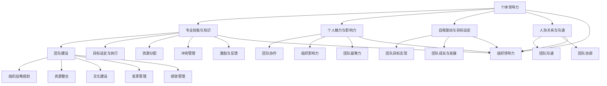

                 

### 引言

在信息技术飞速发展的时代，领导力和自我管理已成为组织和个人成功的关键要素。领导力不仅关乎如何指导他人，还涉及如何激发团队潜能、推动创新和实现组织目标。而自我管理则是个人成长和职业生涯发展的基石，它帮助我们更好地掌控情绪、设定目标、优化时间分配，从而提高工作效率和生活质量。

然而，在现实工作中，我们常常看到领导力和自我管理存在脱节的现象。许多领导者虽然在技术上具备一定的能力，但在管理团队时却显得力不从心；而一些个人虽然自我管理得当，但在面对复杂问题时缺乏决断力和创新思维。这揭示了领导力和自我管理之间的重要性以及彼此之间的紧密联系。

因此，本书旨在探讨领导力与自我管理的核心概念、实践方法及其相互关系。通过深入分析领导力的定义、类型、核心要素和领导力模型，我们将了解如何成为一个有效的领导者。同时，本书也将探讨自我管理的基本原理、技巧和实际应用，帮助读者在自我提升的同时，更好地支持团队和组织的发展。

此外，书中将结合实际案例，分析领导力与自我管理在不同情境下的应用，并提供最佳实践建议。通过这些内容，我们希望能够帮助读者理解领导力与自我管理的本质，掌握实践方法，从而在实际工作中取得更好的成果。

### 领导力的定义与类型

#### 1.1 领导力的核心概念

领导力是一个多维度的概念，涉及到个人影响力、决策能力、沟通技巧等多个方面。简单来说，领导力是指一个人或组织能够激励、引导和影响他人共同达成目标的能力。领导力不仅仅是一种技术或技能，更是一种态度和价值观的体现。

**领导力的定义**

领导力没有一个统一的定义，不同的学者和组织从不同的角度对其进行了阐释。例如，沃伦·班尼斯（Warren Bennis）认为，领导力是“通过激励、引导和鼓舞他人来实现目标的能力”。彼得·德鲁克（Peter Drucker）则将领导力定义为“做正确的事和正确地做事”。尽管表述不同，但大多数定义都强调领导力的核心在于影响和激励他人。

**领导力的重要性**

领导力对于组织和个人都至关重要。对于组织而言，有效的领导力能够推动创新、提升团队协作效率，并实现战略目标。对于个人而言，具备领导力能够提高职业竞争力，增加晋升机会，并提升个人影响力。以下是一些领导力的重要性体现：

1. **推动创新**：领导者能够激励团队成员提出新的想法和解决方案，从而推动组织创新。
2. **提升团队协作**：有效的领导力能够促进团队成员之间的沟通和协作，提高团队整体效能。
3. **实现目标**：领导者能够明确目标，并通过激励和引导，使团队成员共同实现这些目标。
4. **提升个人影响力**：具备领导力的人往往能在组织中发挥更大的影响力，提升职业地位。
5. **增强员工满意度**：领导者能够关心团队成员的需求和成长，提高员工满意度和忠诚度。

**领导力的类型**

领导力可以分为多种类型，每种类型都有其独特的特点和适用场景。以下是一些常见的领导力类型：

1. **变革型领导力**（Transformative Leadership）：这种领导力强调通过激励和鼓舞团队成员，推动组织变革和创新。变革型领导者通常具有远见卓识，能够清晰地描述未来的愿景，并激发团队成员为之努力。

2. **交易型领导力**（Transactional Leadership）：这种领导力强调通过奖励和惩罚来激励团队成员。交易型领导者依赖于明确的规则和标准，通过奖励积极行为和惩罚不良行为来维护团队秩序。

3. **情境领导力**（Situational Leadership）：这种领导力认为领导风格应根据不同情境进行调整。情境领导者能够根据团队成员的能力和需求，灵活选择最合适的领导风格。

4. **服务型领导力**（Servant Leadership）：这种领导力强调领导者应该以服务团队成员为中心，关注团队成员的需求和成长。服务型领导者相信通过帮助团队成员实现个人目标，可以更好地实现组织目标。

5. **民主型领导力**（Democratic Leadership）：这种领导力强调团队参与和民主决策。民主型领导者鼓励团队成员参与决策过程，并通过讨论和协商来达成共识。

6. **权威型领导力**（Authoritative Leadership）：这种领导力强调领导者的权威和决策能力。权威型领导者通常会明确表达自己的观点，并要求团队成员遵循。

7. **关怀型领导力**（Supportive Leadership）：这种领导力强调领导者应该关心团队成员的情感需求，提供支持和鼓励。

每种领导力类型都有其适用的场景和优点。在实际工作中，领导者需要根据具体情况灵活运用不同的领导力风格，以达到最佳效果。

#### 1.2 领导力的层次

领导力不仅存在于高层管理者中，它在组织的各个层次都起着至关重要的作用。根据领导者的职责和影响范围，领导力可以分为三个层次：个体领导力、团队领导力和组织领导力。

**个体领导力**（Individual Leadership）

个体领导力是指个人在特定情境下，通过自身的影响力、专业知识和行为来影响他人的能力。个体领导力通常体现在以下几个方面：

1. **专业技能和知识**：个体领导者具备专业的技能和知识，能够为团队提供指导和帮助。
2. **个人魅力和影响力**：个体领导者具有强大的个人魅力，能够影响他人的思想和行为。
3. **自我驱动和目标设定**：个体领导者具备强烈的自我驱动能力，能够设定明确的目标并努力实现。
4. **人际关系和沟通**：个体领导者擅长与他人沟通，能够建立良好的人际关系，为团队协作打下基础。

**团队领导力**（Team Leadership）

团队领导力是指领导者如何在团队层面上发挥作用，协调团队内部的合作，推动团队目标实现。团队领导力主要包括以下几个方面：

1. **团队建设**：团队领导者负责建立和维护团队的凝聚力，确保团队成员之间的协作。
2. **目标设定和执行**：团队领导者帮助团队设定明确的目标，并制定实施计划，确保团队目标的实现。
3. **资源分配**：团队领导者负责合理分配资源，确保团队在实现目标的过程中有足够的支持和保障。
4. **冲突管理**：团队领导者能够有效地解决团队内部的冲突，维护团队和谐。
5. **激励和反馈**：团队领导者通过激励和反馈机制，提升团队成员的工作积极性和能力。

**组织领导力**（Organizational Leadership）

组织领导力是指领导者如何在组织层面上发挥影响，推动组织战略的实施和目标的实现。组织领导力包括以下几个方面：

1. **战略规划**：组织领导者负责制定组织的长期战略规划，确保组织在正确的方向上发展。
2. **资源整合**：组织领导者负责整合组织内部的各种资源，包括人力、财务和技术资源，以支持组织战略的实施。
3. **文化建设**：组织领导者通过塑造组织文化，提高组织的凝聚力和创新能力。
4. **变革管理**：组织领导者能够有效地推动组织的变革，适应外部环境的变化。
5. **绩效管理**：组织领导者负责制定和实施组织的绩效管理机制，确保组织目标的实现。

#### 1.3 领导力的三个层次

为了更好地理解领导力的层次，我们可以使用Mermaid流程图来展示个体领导力、团队领导力和组织领导力之间的关系。

从图中我们可以看出，个体领导力是团队领导力和组织领导力的基础。个体领导力的各个方面如专业技能、个人魅力、自我驱动和沟通能力，都为团队和组织领导力提供了支持。团队领导力则侧重于团队内部的协作、目标实现和资源管理，而组织领导力则关注组织整体的战略规划、资源整合和文化建设。

### 自我管理的原理与技巧

自我管理（Self-Management）是个人成长和职业发展的重要基石。它不仅关乎如何高效地完成工作任务，还涉及如何平衡工作与生活、如何处理压力和如何持续自我提升。自我管理的有效实践能够帮助我们更好地掌控自己的生活和工作，提高工作效率和生活质量。以下将详细探讨自我管理的基本原理与技巧。

#### 2.1 自我管理的定义与意义

**自我管理的定义**

自我管理是指个人通过自我监控、自我调节和自我激励，以达到目标、完成任务、提高效率和实现自我发展的过程。自我管理不仅包括时间管理、情绪管理和目标设定等具体技能，还涉及到个人的自我认知、自我约束和自我激励等内在素质。

**自我管理的意义**

自我管理的意义在于，它能够帮助我们：

1. **提高工作效率**：通过有效的时间管理和任务规划，自我管理能够帮助个人更高效地完成任务。
2. **提升生活质量**：通过平衡工作与生活，自我管理有助于减轻压力，提高生活满意度。
3. **实现个人目标**：通过自我激励和目标设定，自我管理能够帮助个人实现长期和短期目标。
4. **增强适应能力**：自我管理能够提高个人应对各种挑战和变化的能力，增强适应能力。
5. **促进自我成长**：自我管理是个人自我提升和持续成长的重要手段，通过不断的反思和调整，个人能够不断提升自己的能力和素质。

#### 2.2 自我管理的基本原理

自我管理的基本原理包括以下几个方面：

1. **自我认知**

自我认知是自我管理的核心。它涉及到对自身性格、兴趣、优势和不足的认知。只有深入了解自己，才能更好地设定目标、制定计划和采取行动。以下是一些自我认知的方法：

   - **自我反思**：定期进行自我反思，分析自己的行为、思考和情绪，了解自己的优点和不足。
   - **心理测试**：通过心理测试和性格测评，了解自己的性格特点和行为模式。
   - **日记记录**：记录自己的日常活动和内心感受，通过长期的观察和分析，了解自己的行为规律和心理变化。

2. **情绪管理**

情绪管理是自我管理的重要组成部分。情绪管理包括识别和管理自己的情绪，避免情绪对工作和生活产生负面影响。以下是一些情绪管理的技巧：

   - **情绪识别**：了解自己的情绪变化，识别情绪的来源和触发因素。
   - **情绪调节**：学会调节情绪，采取深呼吸、冥想或运动等方法缓解压力和焦虑。
   - **情绪表达**：学会以健康的方式表达情绪，避免压抑或过度表达。

3. **目标设定**

目标设定是自我管理的另一核心。设定明确、具体和可衡量的目标是实现成功的关键。以下是一些目标设定的技巧：

   - **SMART目标**：设定具体（Specific）、可衡量（Measurable）、可实现（Achievable）、相关（Relevant）和有时限（Time-bound）的目标。
   - **目标分解**：将大目标分解为小目标，逐步实现，保持持续的动力和进度。
   - **定期评估**：定期评估目标的进展情况，根据实际情况进行调整和优化。

4. **时间管理**

时间管理是提高工作效率和生活质量的重要手段。以下是一些时间管理的技巧：

   - **优先级排序**：根据任务的紧急程度和重要性，对任务进行优先级排序，优先处理重要且紧急的任务。
   - **时间块管理**：将时间划分为不同的时间块，每个时间块专注于一项任务，避免分心。
   - **日程规划**：提前规划日程，为每项任务分配时间，确保时间的高效利用。

5. **持续学习**

持续学习是自我管理的重要组成部分。通过不断学习新知识和技能，个人能够不断提升自己的能力和竞争力。以下是一些持续学习的技巧：

   - **制定学习计划**：根据个人兴趣和职业发展需求，制定学习计划，确保持续学习。
   - **多渠道学习**：利用书籍、课程、讲座、网络资源等多种渠道进行学习。
   - **实践应用**：将所学知识应用到实际工作中，通过实践提升自己的能力和技能。

#### 2.3 自我管理技巧

**时间管理**

时间管理是自我管理的重要内容，以下是一些具体的时间管理技巧：

1. **优先级排序**：每天开始工作前，列出当天需要完成的任务清单，并根据任务的紧急程度和重要性进行排序。
2. **番茄工作法**：将工作时间分为25分钟的工作周期，每个周期后休息5分钟，这种方法有助于保持专注和提高工作效率。
3. **避免拖延**：制定明确的目标和时间表，避免拖延，及时完成任务。
4. **专注工作**：在工作时尽量避免干扰，关闭不必要的通知，将手机调至静音模式。

**决策管理**

有效的决策管理能够帮助个人在复杂情境中做出明智的决策。以下是一些决策管理的技巧：

1. **收集信息**：在做出决策前，充分收集相关信息，确保决策的全面性和准确性。
2. **分析选项**：对不同的决策选项进行详细分析，考虑各种可能的结果和影响。
3. **权衡利弊**：权衡决策的利弊，考虑风险和收益，选择最合适的选项。
4. **及时调整**：在决策实施过程中，根据实际情况及时调整决策，确保决策的有效性。

**压力管理**

压力管理是自我管理的重要内容，以下是一些压力管理的技巧：

1. **识别压力源**：了解自己压力的来源，如工作负荷、人际关系等，针对性地进行管理。
2. **放松技巧**：学习放松技巧，如深呼吸、冥想、瑜伽等，帮助缓解压力。
3. **时间管理**：合理安排时间，避免过度工作，确保有足够的休息时间。
4. **寻求支持**：在压力过大时，向家人、朋友或专业人士寻求支持和帮助。

**目标设定**

有效的目标设定是自我管理的关键，以下是一些目标设定的技巧：

1. **设定具体目标**：明确目标的具体内容，确保目标具有可操作性。
2. **设定合理期限**：为每个目标设定一个合理的完成期限，确保目标的可实现性。
3. **分解目标**：将大目标分解为小目标，逐步实现，保持持续的动力和进度。
4. **定期评估**：定期评估目标的进展情况，根据实际情况进行调整和优化。

#### 2.4 成功案例分享

以下是一些成功的自我管理案例，这些案例展示了如何通过自我管理实现个人和职业的发展：

1. **案例一：成功的时间管理**

   王先生是一家科技公司的项目经理。他通过采用番茄工作法和优先级排序技巧，显著提高了工作效率。每天早上，他会列出当天的任务清单，并根据任务的紧急程度和重要性进行排序。通过这种方法，他能够更有效地管理时间，按时完成项目任务，并获得了公司的认可和晋升。

2. **案例二：有效的压力管理**

   李小姐是一名金融分析师。她通过定期进行放松技巧，如冥想和瑜伽，有效缓解了工作压力。此外，她还学会了识别压力源，并采取了相应的管理措施，如与同事沟通合作，调整工作量等。这些措施帮助她保持了良好的工作状态和心理健康，提高了工作效率。

3. **案例三：持续学习的实践者**

   张先生是一名软件开发工程师。他通过制定学习计划，定期学习新技术和新知识，不断提升自己的技能。他不仅通过在线课程和书籍学习，还积极参与社区活动和开源项目，与他人交流经验和知识。通过持续学习，他成为公司技术领域的佼佼者，并获得了多个技术奖项。

通过这些案例，我们可以看到，自我管理不仅仅是技巧的运用，更是一种态度和习惯的养成。通过有效的自我管理，个人可以更好地应对工作和生活中的挑战，实现个人和职业的发展。

### 以身作则的实践方法

#### 3.1 以身作则的概念与意义

**以身作则的定义**

以身作则（Leading by Example）是一种领导力实践，指领导者通过自己的行为、态度和决策，为团队成员树立榜样，激励他们效仿和改进。以身作则不仅仅是口头上的号召，更是一种行动上的引领，通过自身的示范作用来推动团队成员的行为变革。

**以身作则的重要性**

以身作则对组织和个人都具有重要意义，主要体现在以下几个方面：

1. **提升组织文化**：领导者通过以身作则，能够塑造和提升组织的文化氛围。当领导者展现出正直、诚信、协作和责任等价值观时，这些价值观会渗透到整个组织中，形成良好的组织文化。

2. **增强团队凝聚力**：领导者通过自己的行动，能够增强团队成员之间的信任和协作，提升团队的凝聚力。当团队成员看到领导者不仅言出必行，而且能够在困难和挑战面前坚定不移时，他们会更加愿意跟随领导者，共同面对困难。

3. **提高员工绩效**：以身作则的领导者能够激励员工提高绩效。通过自身的榜样作用，领导者能够激发员工的积极性、主动性和创造力，使员工在工作中更加努力和专注。

4. **增强组织竞争力**：领导者通过以身作则，能够提升组织的整体竞争力。一个具备优秀领导力的组织，能够更好地应对市场变化和竞争压力，实现持续发展和创新。

**以身作则的原则**

为了有效实践以身作则，领导者需要遵循以下原则：

1. **一致性**：领导者的行为和言论必须一致，才能树立真正的榜样。领导者应该始终如一地展现出自己的价值观和行为标准。

2. **真诚性**：以身作则需要真诚，领导者应该真实地展现自己的行为，而不是为了取悦他人或制造假象。真诚的行为能够赢得团队成员的信任和尊重。

3. **可持续性**：以身作则应该是一个持续的过程，领导者需要在日常工作和生活中不断实践，形成一种习惯。只有持续的行动，才能真正影响团队成员。

4. **个性化**：领导者应该根据自己的特点和风格，选择合适的以身作则方式。不同的领导者有不同的个性，应该根据自身特点，选择最适合自己的示范行为。

#### 3.2 以身作则的实践方法

为了更具体地探讨如何以身作则，以下提供了一些实践方法：

1. **倡导正面价值观**

   领导者应该通过自己的行为，积极倡导并实践组织的核心价值观。这包括诚信、创新、团队合作、责任感等。例如，领导者可以通过公开表扬员工的优秀表现，鼓励团队成员在面对困难时保持积极态度，从而树立正面的价值观。

2. **展示职业操守**

   领导者应该展现出卓越的职业操守，包括遵守职业道德规范、诚实守信、公正无私等。例如，领导者不应该利用职权谋取私利，而应该以公正和透明的方式处理工作事务，树立良好的职业道德形象。

3. **提升个人素质**

   领导者应该不断提升自己的专业素质和个人能力，以成为团队成员的榜样。这包括不断学习新知识、提升领导力技能、参加培训课程等。例如，领导者可以通过参加领导力培训课程，提升自己的沟通技巧和管理能力，从而更好地指导团队成员。

4. **参与团队活动**

   领导者应该积极参与团队活动，与团队成员建立良好的关系。这包括参加团队会议、参与项目讨论、参与团队建设活动等。通过这些活动，领导者能够更好地了解团队成员的需求和想法，同时也能通过自己的参与，激励团队成员的积极性和创造力。

5. **提供及时反馈**

   领导者应该及时给予团队成员反馈，帮助他们在工作中不断改进。这包括对团队成员的优秀表现进行表扬，对存在的问题进行指出，并提出改进建议。通过及时反馈，领导者能够帮助团队成员提高工作效率和质量。

6. **承担个人责任**

   领导者应该勇于承担个人责任，特别是在面对失败和挑战时。这包括对团队失误承担责任，并寻找改进的方法。通过承担个人责任，领导者能够树立责任感，激励团队成员在面对困难时保持积极态度。

7. **鼓励自我发展**

   领导者应该鼓励团队成员自我发展，为他们提供成长的机会。这包括为团队成员制定个人发展计划，提供培训和学习资源，鼓励团队成员参加专业发展活动等。通过鼓励自我发展，领导者能够激发团队成员的潜力，提高团队的总体绩效。

#### 3.3 成功案例分享

以下是一些以身作则的成功案例，这些案例展示了如何通过以身作则实现团队和组织的发展：

**案例一：成功领导的实践方法**

李总是一家大型科技公司的首席执行官。他通过以下方式以身作则：

1. **倡导正面价值观**：李总经常在公开场合强调诚信和创新的重要性，并亲自践行这些价值观。例如，他拒绝接受贿赂，坚持透明公开的工作方式。

2. **展示职业操守**：李总以身作则，始终保持专业和诚信。他从不利用公司资源谋取个人私利，始终保持公正和无私。

3. **提升个人素质**：李总不断学习新知识，参加各种领导力培训课程，不断提升自己的管理能力。他的学习和进步激励了团队成员也积极提升自己的能力。

4. **参与团队活动**：李总积极参与公司组织的各类活动，与团队成员建立良好的关系。他经常与团队成员交流，了解他们的需求和想法。

5. **提供及时反馈**：李总对团队成员的工作表现给予及时反馈，既表扬优秀表现，也指出存在的问题，并提出改进建议。

通过以身作则，李总成功塑造了公司的积极文化，提升了团队的凝聚力，使公司在激烈的市场竞争中脱颖而出。

**案例二：自我管理的实践方法**

王经理是一家中型企业的项目经理。他通过以下方式以身作则：

1. **倡导正面价值观**：王经理强调团队合作和责任感，并亲自践行这些价值观。他在项目中始终强调团队协作，鼓励团队成员共同面对挑战。

2. **展示职业操守**：王经理始终保持专业和敬业，从不拖延任务，总是按时交付高质量的成果。

3. **提升个人素质**：王经理不断学习项目管理的新知识和技术，通过参加培训课程和阅读专业书籍，提升自己的专业能力。

4. **参与团队活动**：王经理积极参与团队的各种活动，与团队成员建立良好的关系。他在团队活动中总是积极发言，鼓励团队成员分享他们的想法。

5. **提供及时反馈**：王经理对团队成员的工作表现给予及时反馈，帮助他们提高工作效率和质量。

通过以身作则，王经理成功地激励了团队成员，提升了团队的整体绩效，使项目按时高质量地完成。

这些案例表明，以身作则不仅是领导者的重要职责，也是提升团队和组织绩效的有效方法。通过以身作则，领导者能够树立榜样，激励团队成员，推动组织发展。

### 案例分析

#### 4.1 领导力与自我管理在企业管理中的实践

在企业管理中，领导力和自我管理是两个不可或缺的核心要素。以下我们将通过两个具体案例，探讨领导力与自我管理在实际企业管理中的应用及其效果。

**案例一：高科技企业的创新管理**

某高科技企业，其CEO张先生深知领导力和自我管理在推动企业创新和持续发展中的关键作用。张先生通过以下方式将领导力与自我管理实践于企业管理中：

1. **领导力的运用**：
   - **变革型领导力**：张先生在企业发展过程中，不断推动组织变革。他通过定期的内部沟通会议和战略研讨会，鼓励员工提出创新想法，并采纳部分员工建议，使企业在市场上保持竞争力。
   - **服务型领导力**：张先生注重与员工的沟通，经常与基层员工交流，了解他们的需求和意见。他不仅提供了丰富的培训资源，还鼓励员工参与公司决策，使员工感受到自己的价值和重要性。

2. **自我管理的实践**：
   - **时间管理**：张先生通过制定详细的工作计划和优先级排序，确保自己能够高效地管理时间和任务。他经常使用番茄工作法，确保每次工作专注而高效。
   - **目标设定**：张先生定期设定个人和团队目标，并将其分解为可操作的小目标，确保目标的可实现性和持续性。他通过定期检查目标的完成情况，不断调整计划，以实现最终目标。

通过张先生的领导力和自我管理实践，公司成功推出了多个创新产品，市场份额稳步提升，员工满意度和忠诚度也显著提高。

**案例二：传统制造企业的转型管理**

另一家传统制造企业，在面临市场竞争压力和行业变革时，其CEO李女士通过领导力与自我管理的实践，成功实现了企业的转型和升级。

1. **领导力的运用**：
   - **情境领导力**：李女士根据不同阶段的市场需求和团队状态，灵活调整领导风格。在初期，她采用指令型领导力，迅速制定转型策略，确保团队在短时间内明确目标。在转型过程中，她逐步过渡到支持型领导力，鼓励员工创新和尝试新方法。
   - **民主型领导力**：李女士鼓励员工参与公司决策，建立开放的沟通渠道。她通过定期的团队会议和头脑风暴活动，收集员工意见，共同制定转型策略。

2. **自我管理的实践**：
   - **自我认知**：李女士通过自我反思和培训，不断提升自己的管理能力和决策水平。她意识到自己需要更深入地了解市场和客户需求，因此积极参加行业研讨会和市场调研。
   - **情绪管理**：在转型过程中，李女士面对巨大的压力和挑战。她通过冥想和瑜伽等方式，有效管理自己的情绪，保持冷静和理性，确保决策的科学性和合理性。

通过李女士的领导力和自我管理实践，企业成功地实现了从传统制造向智能化转型的目标。企业不仅提升了生产效率和产品质量，还在市场上获得了新的竞争优势。

#### 4.2 领导力与自我管理在团队建设中的应用

团队建设是企业管理中的重要环节，有效的领导力和自我管理能够显著提升团队协作和绩效。以下通过两个案例，分析领导力与自我管理在团队建设中的应用。

**案例一：初创团队的快速成长**

某初创企业，由年轻的创业团队组成。团队领导者小张通过以下方式运用领导力和自我管理，带领团队迅速成长：

1. **领导力的运用**：
   - **变革型领导力**：小张带领团队不断尝试新的商业模式和市场策略，通过鼓励创新和冒险精神，激发了团队成员的潜力。他经常组织团队讨论和头脑风暴，让每个成员都有发言和参与的机会。
   - **服务型领导力**：小张注重团队成员的个人成长和发展，为他们提供丰富的培训和指导。他鼓励团队成员设定个人目标，并帮助他们制定实现目标的计划和策略。

2. **自我管理的实践**：
   - **时间管理**：小张通过制定详细的工作计划和时间表，确保团队的工作有序进行。他采用敏捷开发方法，灵活调整工作进度，确保团队能够高效地完成任务。
   - **目标设定**：小张带领团队设定明确的短期和长期目标，并将其分解为可操作的小目标。他通过定期检查和反馈，确保团队成员始终聚焦于目标，并不断调整策略以实现目标。

通过小张的领导力和自我管理实践，初创团队在短时间内实现了产品的市场推广和用户增长，团队凝聚力也显著提升。

**案例二：大型团队的协同合作**

另一家大型企业，拥有多个跨部门团队。团队领导者王经理通过以下方式运用领导力和自我管理，促进团队协作：

1. **领导力的运用**：
   - **情境领导力**：王经理根据团队的具体情况和任务要求，灵活调整领导风格。在项目初期，他采用指令型领导力，确保团队迅速进入工作状态。在项目执行过程中，他采用支持型领导力，为团队成员提供必要的支持和资源。
   - **民主型领导力**：王经理鼓励团队成员参与决策过程，建立开放的沟通渠道。他定期组织团队会议，让每个成员都有机会分享自己的想法和意见。

2. **自我管理的实践**：
   - **自我认知**：王经理通过自我反思和培训，不断提升自己的管理能力和决策水平。他意识到自己需要更深入地了解团队成员的需求和想法，因此积极参与团队活动和互动。
   - **情绪管理**：王经理面对团队冲突和压力时，能够保持冷静和理性。他通过沟通和调解，有效解决团队内部的矛盾，确保团队的稳定和协作。

通过王经理的领导力和自我管理实践，大型团队在项目执行过程中表现出色，不仅按时完成了任务，还提升了团队的整体协作能力和创新能力。

这些案例表明，领导力与自我管理在企业管理与团队建设中具有重要作用。通过有效的领导力和自我管理实践，企业能够提升团队绩效，实现持续发展。

### 总结与展望

通过本书的探讨，我们深入理解了领导力与自我管理的核心概念、实践方法和相互关系。从领导力的定义、类型和层次，到自我管理的基本原理和技巧，再到以身作则的实践方法，我们系统地分析了这些要素在组织和个人发展中的重要作用。

**领导力的重要性**在于其能够推动创新、提升团队协作效率，并实现组织目标。有效的领导力不仅涉及技术能力，还包括情感智慧、沟通技巧和战略眼光。自我管理则是个体成长和职业发展的基石，通过时间管理、情绪管理和目标设定，我们能够更好地掌控自己的生活和工作，提高工作效率和生活质量。

**以身作则**是领导力与自我管理的关键实践方法。通过倡导正面价值观、展示职业操守、提升个人素质和参与团队活动，领导者能够为团队成员树立榜样，激励他们积极效仿，从而提升团队和组织文化。同时，通过自我认知、情绪管理和目标设定，个人能够不断提升自己的能力和素质，实现自我发展。

在未来的发展中，领导力与自我管理将继续发挥重要作用。随着全球化和数字化转型的加速，组织面临的市场环境和竞争压力日益增加，领导者需要具备更强的应变能力和创新思维。同时，个体在职业发展中也面临更多的挑战和机遇，自我管理成为提升竞争力的重要手段。

**展望未来，以下是一些趋势和挑战**：

1. **领导力的多元化**：随着社会多样性的增加，领导力将更加注重多元化和包容性。领导者需要具备跨文化沟通能力和全球视野，以适应不同文化背景的团队成员。

2. **技术的融合**：人工智能、大数据和区块链等技术的应用，将极大地改变领导力实践。领导者需要不断学习新技术，将其融入领导实践中，提高决策效率和团队协作能力。

3. **可持续发展的领导**：随着全球环境问题的日益严重，可持续发展成为领导力的重要议题。领导者需要将环境保护和社会责任融入企业战略，推动可持续发展。

4. **心理健康关注**：在高压工作环境中，员工的心理健康受到广泛关注。领导者需要关注团队成员的心理健康，提供支持和资源，以应对工作压力和心理健康问题。

5. **个性化和自我驱动**：未来的领导力实践将更加注重个性化和自我驱动。领导者需要关注每个团队成员的独特需求，提供个性化的成长和发展机会，激发他们的内在动力。

总之，领导力与自我管理将继续在组织和个人发展中发挥关键作用。通过不断学习和实践，领导者能够提升自身的领导能力，推动组织的持续发展；个人则能通过有效的自我管理，实现自我提升和职业发展。让我们共同关注领导力与自我管理的未来，积极探索和实践，为个人和组织的成功贡献力量。

### 附录

**附录A：领导力与自我管理工具与资源**

为了帮助读者更好地理解和实践领导力与自我管理，以下列举了一些实用的工具和资源：

1. **领导力评估工具**：
   - **Leadership Practices Inventory（LPI）**：一种常用的领导力评估工具，帮助个人了解自己的领导风格和优势。
   - **StrengthsFinder**：通过评估个人优势，帮助领导者发挥自身的长处，提升领导力。

2. **自我管理工具**：
   - **Trello**：一款任务管理工具，可以帮助个人和组织高效地管理任务和项目。
   - **Asana**：一款项目管理工具，适用于团队协作，提高工作效率。

3. **在线课程和书籍**：
   - **Coursera**：提供多种领导力和自我管理相关的在线课程，涵盖理论、实践和应用。
   - **《领导力五要素》**：作者约翰·梅耶和布莱恩·托马辛斯基，系统介绍了领导力的五个关键要素。
   - **《高效能人士的七个习惯》**：作者史蒂芬·柯维，提供了实用的自我管理和时间管理技巧。

4. **领导力发展资源**：
   - **Harvard Business Review**：提供丰富的领导力文章和案例分析，帮助领导者提升实践能力。
   - **LinkedIn Learning**：提供各种领导力课程和教程，涵盖不同领域和层次。

5. **领导力社区和论坛**：
   - **LinkedIn**：加入领导力相关的群组和论坛，与全球领导者交流经验。
   - **Reddit**：在r/Leadership子版块中，可以找到各种领导力讨论和资源。

通过这些工具和资源，读者可以进一步深入学习和实践领导力与自我管理，提升个人和组织的效能。

### 参考文献

1. Bennis, W. (2009). On Becoming a Leader. Basic Books.
2. Drucker, P. F. (2008). The Leader’s Work: Knowing Who You Are. Jossey-Bass.
3. Kouzes, J. M., & Posner, B. Z. (2007). The Truth About Leadership: The Leaders You Wish You Had, The Leaders You Want to Be. Jossey-Bass.
4. Sinek, S. (2014). Leaders Eat Last: Why Some Teams Pull Together and Others Don’t. Penguin.
5. Kouzes, J. M., & Posner, B. Z. (1995). The Leadership Challenge: How to Get Extraordinary Things Done in Organizations. Jossey-Bass.
6. Goleman, D. (1998). Working with Emotional Intelligence. Bantam Books.
7. Coutu, D. I., & Calá, C. M. (2009). The Antidote to Complexity: Letting Go of Better to Do Good. Harvard Business Review.
8. Level 5 Leadership: The Triumph of Humility and Fierce Resolve by James C. Collins and Jerry Porras
9. The Power of Now: A Guide to Spiritual Enlightenment by Echhart Tolle
10. "Transformative Leadership: A Framework for Developing Leadership that Produces Extraordinary Results" by Richard G. Hackman, Ruth W. Johnson, and Joyce L. Sweeney

