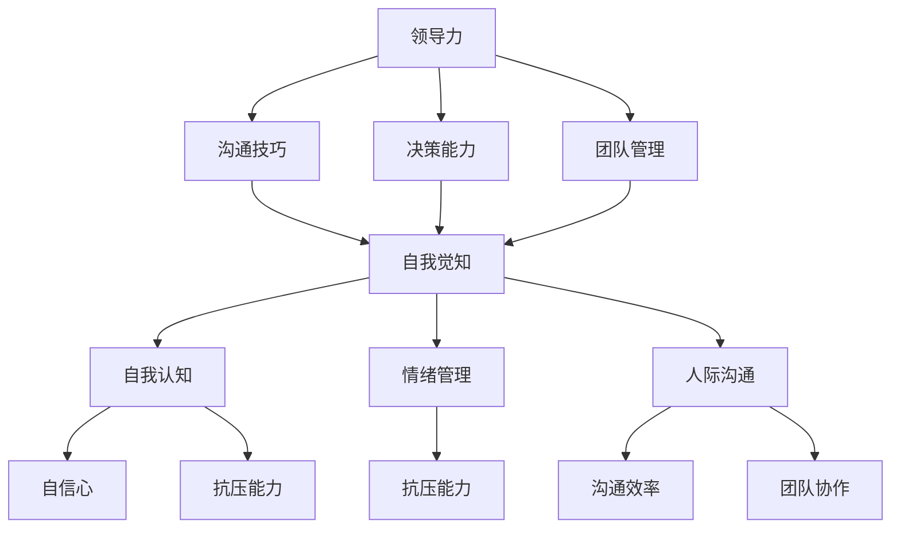

                 

### 文章标题：领导力与自我觉知：提升自我认知的方法

#### 关键词：领导力、自我觉知、自我认知、情绪管理、人际沟通、算法、数学模型、项目实战

> 摘要：本文将探讨领导力与自我觉知之间的关系，并介绍提升自我认知的方法。通过分析领导力的核心要素，我们将深入了解自我觉知在领导力中的重要性。文章将详细阐述情绪管理、自我认知和人际沟通等关键概念，并提供实际项目案例，帮助读者更好地理解并应用这些原理。

---

### 确定核心概念与联系

在探讨领导力与自我觉知之间的关系之前，我们需要明确这些核心概念及其相互之间的联系。以下是本文涉及的核心概念及其关系：

1. **领导力**：指引导和影响他人实现共同目标的能力。它包括沟通技巧、决策能力、团队管理等要素。
2. **自我觉知**：指个体对自己内在和外在世界的认知与理解。它是自我认知的基础，对情绪管理、人际沟通等方面有重要影响。
3. **自我认知**：指个体对自己的性格、能力、价值观等方面的认识。自我认知有助于提升自我觉知，进而增强领导力。
4. **情绪管理**：指个体对自己情绪的认知与调节能力。情绪管理对领导力和自我觉知有直接影响。
5. **人际沟通**：指个体与他人进行信息交换的过程。人际沟通有助于建立良好的人际关系，从而提高领导力。

为了更清晰地展示这些概念之间的联系，我们可以使用 Mermaid 流程图（如下所示）：

### 领导力的定义与重要性

领导力是指个体在团队中引导和影响他人实现共同目标的能力。它不仅仅关乎权力和地位，更是一种技能和素质。领导力包括以下几个方面：

1. **沟通技巧**：有效的沟通是领导力的核心要素之一。领导者需要具备清晰、简洁、富有感染力的沟通能力，以便传递信息、解决问题、激励团队。
2. **决策能力**：领导者需要能够在复杂的环境中做出明智、及时的决策。这要求领导者具备敏锐的洞察力、分析能力和判断力。
3. **团队管理**：领导者需要了解团队成员的能力、性格和需求，并制定相应的管理策略，以充分发挥团队的整体效能。

领导力的重要性体现在以下几个方面：

1. **推动团队发展**：有效的领导力能够激发团队成员的潜力，推动团队不断进步和成长。
2. **提升组织效能**：领导力对于组织的发展和成功至关重要。一个优秀的领导者能够带领团队实现组织的目标和战略。
3. **促进个人成长**：通过领导力实践，个体能够不断提升自己的能力、知识和经验，实现个人职业发展。

### 自我觉知与领导力的关系

自我觉知是指个体对自己内在和外在世界的认知与理解。它是自我认知的基础，对领导力有重要影响。自我觉知主要包括以下几个方面：

1. **自我认知**：自我认知是指个体对自己的性格、能力、价值观等方面的认识。自我认知有助于个体更好地理解自己，从而在领导过程中做出更明智的决策。
2. **情绪管理**：情绪管理是指个体对自己情绪的认知与调节能力。情绪管理对于领导力至关重要，因为领导者需要保持冷静、理智和自信，以便在压力和挑战面前保持稳定的情绪状态。
3. **人际沟通**：人际沟通是指个体与他人进行信息交换的过程。良好的人际沟通有助于建立良好的人际关系，从而提高领导力。

自我觉知与领导力之间的关系可以概括为以下几点：

1. **自我觉知是领导力发展的基础**：一个具备良好自我觉知的领导者能够更好地理解自己、管理自己，并在领导过程中做出更明智的决策。
2. **自我觉知有助于情绪管理**：自我觉知能够帮助领导者更好地理解自己的情绪，从而有效地调节情绪，保持冷静和自信。
3. **自我觉知促进人际沟通**：自我觉知有助于领导者更好地理解他人的需求和期望，从而提高人际沟通的效果。

### 自我觉知的评估方法

要提升自我觉知，首先需要了解自己的现状。以下是一些常用的自我觉知评估方法：

1. **自我反思**：通过定期记录自己的行为、思维和感受，深入反思自己的行为模式、价值观和动机。
2. **日记法**：写日记可以帮助个体更好地了解自己的内心世界，发现自己的问题并制定改进计划。
3. **心理测试**：心理测试（如MBTI、DISC等）可以提供关于个人性格、偏好和能力的客观评估，有助于个体了解自己的优势和劣势。
4. **求助专业人士**：心理咨询师或教练等专业人士可以帮助个体更深入地了解自己，并提供针对性的建议和指导。

### 情绪管理的重要性

情绪管理是指个体对自己情绪的认知与调节能力。情绪管理对于领导力和自我觉知具有重要影响。以下是情绪管理的重要性：

1. **提高领导力**：情绪稳定的领导者能够更好地应对压力和挑战，从而在团队中树立良好的榜样。
2. **增强自我觉知**：通过情绪管理，个体能够更好地理解自己的情绪，从而提高自我觉知水平。
3. **改善人际关系**：情绪管理有助于建立良好的人际关系，从而提高团队合作效率。

### 情绪管理的方法

以下是一些实用的情绪管理方法：

1. **认知行为疗法（CBT）**：CBT 帮助个体识别和挑战负面思维模式，从而减少负面情绪的影响。
2. **放松技巧**：如深呼吸、冥想、瑜伽等，有助于缓解压力和焦虑。
3. **积极心理暗示**：通过积极的自我暗示，个体可以改变消极情绪，提高情绪状态。
4. **寻求支持**：与家人、朋友或专业人士交流，分享自己的情绪和困惑，寻求帮助和支持。

### 自我认知的定义与重要性

自我认知是指个体对自己的性格、能力、价值观等方面的认识。它是自我觉知的基础，对于个人成长和领导力发展具有重要意义。以下是自我认知的重要性：

1. **促进个人成长**：自我认知帮助个体了解自己的优势和劣势，从而有针对性地提升自己的能力和素质。
2. **增强自信心**：通过自我认知，个体能够更好地认识自己的价值，从而提高自信心。
3. **提升领导力**：自我认知有助于个体在领导过程中更好地了解自己的角色和责任，从而更有效地发挥领导力。

### 提升自我认知的方法

以下是一些提升自我认知的方法：

1. **自我反思**：通过定期记录自己的行为、思维和感受，深入反思自己的行为模式、价值观和动机。
2. **学习与成长**：不断学习新知识和技能，扩展自己的视野和经验，从而提高自我认知。
3. **接受反馈**：倾听他人的意见和建议，了解自己的不足之处，从而更好地认识自己。
4. **心理测试**：通过心理测试（如MBTI、DISC等），了解自己的性格、偏好和优势，从而有针对性地提升自我认知。

### 人际沟通的重要性

人际沟通是指个体与他人进行信息交换的过程。良好的人际沟通对于个人成长、团队合作和领导力发展具有重要意义。以下是人际沟通的重要性：

1. **促进个人成长**：人际沟通有助于个体了解他人的观点、经验和需求，从而促进个人成长和进步。
2. **提升团队合作效率**：良好的人际沟通能够消除误解和冲突，提高团队合作效率。
3. **增强领导力**：有效的人际沟通有助于领导者建立良好的人际关系，从而提高领导力和影响力。

### 人际沟通的技巧

以下是一些人际沟通的技巧：

1. **倾听**：倾听是有效沟通的关键，通过倾听他人的观点和需求，能够更好地理解对方。
2. **表达清晰**：表达清晰、简洁、有条理，避免使用模糊、含糊的词语，以确保信息准确传达。
3. **非语言沟通**：注意肢体语言、面部表情和语调等非语言因素，以增强沟通效果。
4. **积极反馈**：给予对方积极、真诚的反馈，鼓励对方表达自己的观点，从而促进沟通。

### 自我觉知与领导力的综合应用

自我觉知在领导力中的应用主要体现在以下几个方面：

1. **自我认知**：通过自我认知，领导者能够更好地了解自己的能力和风格，从而在领导过程中发挥优势，弥补不足。
2. **情绪管理**：领导者需要具备良好的情绪管理能力，以保持冷静、理智和自信，应对各种挑战。
3. **人际沟通**：领导者需要具备良好的人际沟通技巧，以建立良好的人际关系，提高团队凝聚力。

自我觉知与领导力的综合应用有助于领导者：

1. **提高领导效果**：通过自我觉知，领导者能够更有效地激发团队潜力，实现组织目标。
2. **增强个人魅力**：自我觉知有助于领导者树立良好的个人形象，增强个人魅力和影响力。
3. **促进个人成长**：通过领导力实践，领导者能够不断提升自己的能力和素质，实现个人成长。

### 自我觉知与领导力的实际应用

为了更好地理解自我觉知与领导力的实际应用，我们可以通过以下案例进行探讨：

#### 案例1：情绪管理在领导力中的应用

某公司的CEO李先生，在面临市场挑战时，通过情绪管理保持冷静和理智，从而带领团队成功应对了危机。他采取了以下措施：

1. **自我反思**：李先生定期进行自我反思，了解自己的情绪状态，并调整自己的心态。
2. **积极沟通**：他主动与团队成员沟通，了解他们的观点和担忧，从而更好地理解团队的需求。
3. **情绪调节**：通过深呼吸、冥想等放松技巧，李先生有效地调节自己的情绪，保持冷静和理智。

#### 案例2：人际沟通在领导力中的应用

某公司的项目经理张女士，通过有效的人际沟通，成功协调了不同部门之间的合作，推动了项目进度。她采取了以下措施：

1. **倾听**：张女士注重倾听团队成员的观点，了解他们的需求和期望。
2. **表达清晰**：她清晰、简洁地传达项目目标和要求，确保团队成员明确了解任务。
3. **积极反馈**：她给予团队成员积极、真诚的反馈，鼓励他们表达自己的观点和想法。

### 自我觉知与领导力的未来发展趋势

随着科技的发展和人际关系的复杂性增加，自我觉知与领导力的结合将成为未来领导力发展的重要趋势。以下是几个可能的发展方向：

1. **人工智能辅助**：人工智能技术可以用于评估和分析个体的自我觉知水平，为领导者提供个性化的改进建议。
2. **跨文化领导力**：在全球化的背景下，领导者需要具备跨文化沟通和协调能力。自我觉知将成为跨文化领导力的重要基础。
3. **情感智能**：情感智能是指个体识别、理解和管理自己情绪的能力。未来领导者需要具备更高的情感智能，以更好地应对复杂的领导环境。

### 最佳实践与注意事项

为了更有效地提升自我觉知和领导力，以下是一些建议和注意事项：

1. **定期自我反思**：定期进行自我反思，了解自己的行为模式、情绪状态和价值观，有助于提升自我觉知。
2. **持续学习**：不断学习新知识和技能，扩展自己的视野和经验，有助于提高自我认知和领导力水平。
3. **注重情绪管理**：情绪管理是领导力的关键要素之一。领导者需要学会识别、理解和管理自己的情绪，以保持冷静、理智和自信。
4. **培养人际沟通技巧**：有效的人际沟通有助于建立良好的人际关系，提高团队合作效率。

### 拓展阅读

1. 《领导力与影响力：如何影响和激励他人》（作者：约翰·麦克斯韦尔）
2. 《自我认知：如何更好地了解自己》（作者：克里斯·巴里）
3. 《情绪智力：如何管理自己的情绪》（作者：丹尼尔·戈尔曼）
4. 《人际沟通的艺术：如何有效地与他人沟通》（作者：阿尔伯特·梅拉比安）
5. 《心理学与生活》（作者：理查德·吉尔伯特）

---

### 作者信息

作者：AI天才研究院/AI Genius Institute & 禅与计算机程序设计艺术 /Zen And The Art of Computer Programming

