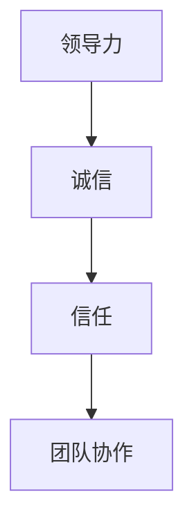
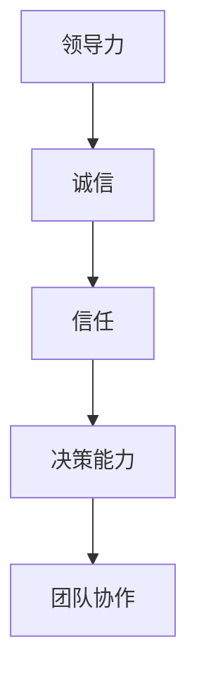

                 

### 1. 设计目录大纲的思路：

#### a. 确定书籍的主题和目的：
   - 书名：《领导力与诚信：建立可信赖的领导形象》
   - 目的是帮助读者了解领导力和诚信的重要性，以及如何在实际工作中应用这些原则。

#### b. 确定书籍的核心章节内容：
   - 核心概念与联系
   - 核心算法原理讲解
   - 数学模型和数学公式
   - 项目实战

#### c. 根据主题和内容，设计章节顺序：
   - 先介绍领导力和诚信的基本概念和重要性
   - 然后讲解领导力和诚信的原理和技巧
   - 接着介绍如何将领导力和诚信应用于实际工作
   - 最后通过实战案例展示应用效果

### 2. 确定章节标题：

#### a. 第1章：领导力与诚信概述
   - 介绍领导力和诚信的定义、重要性及其相互关系。

#### b. 第2章：领导力原则
   - 讲解领导力的核心原则，如领导风格、决策能力、沟通技巧等。

#### c. 第3章：诚信原则
   - 讲解诚信的原则，如诚实、透明、公正等。

#### d. 第4章：领导力与诚信的结合
   - 讨论如何将领导力和诚信原则结合起来，以建立可信赖的领导形象。

#### e. 第5章：建立信任的沟通技巧
   - 介绍建立信任的沟通技巧，如有效倾听、清晰表达、积极反馈等。

#### f. 第6章：领导力与诚信在团队建设中的应用
   - 讨论领导力和诚信在团队建设中的应用，如如何激励团队成员、建立团队文化等。

#### g. 第7章：领导力与诚信在组织管理中的应用
   - 讨论领导力和诚信在组织管理中的应用，如如何制定战略、进行绩效管理、处理冲突等。

#### h. 第8章：领导力与诚信的项目实践
   - 提供一个具体的领导力和诚信项目案例，详细描述项目的实施过程、遇到的挑战和解决方案。

### 3. 设计章节内容：

#### a. 第1章：领导力与诚信概述
   - 内容包括领导力和诚信的定义、重要性及其相互关系。

#### b. 第2章：领导力原则
   - 内容包括领导风格、决策能力、沟通技巧等。

#### c. 第3章：诚信原则
   - 内容包括诚实、透明、公正等。

#### d. 第4章：领导力与诚信的结合
   - 内容包括如何将领导力和诚信原则结合起来，以建立可信赖的领导形象。

#### e. 第5章：建立信任的沟通技巧
   - 内容包括有效倾听、清晰表达、积极反馈等。

#### f. 第6章：领导力与诚信在团队建设中的应用
   - 内容包括如何激励团队成员、建立团队文化等。

#### g. 第7章：领导力与诚信在组织管理中的应用
   - 内容包括如何制定战略、进行绩效管理、处理冲突等。

#### h. 第8章：领导力与诚信的项目实践
   - 内容包括一个具体的领导力和诚信项目案例，详细描述项目的实施过程、遇到的挑战和解决方案。

### 4. 确定核心概念与联系：
   - 领导力与诚信的关系
   - 领导风格与诚信的关系
   - 诚信与沟通的关系
   - 诚信与团队建设的关系
   - 诚信与组织管理的关系

### 5. 确定核心算法原理讲解：
   - 领导风格分析算法
   - 诚信度评估算法
   - 沟通效果分析算法
   - 团队文化建设算法
   - 组织管理效能评估算法

### 6. 确定数学模型和数学公式：
   - 领导力评估模型
   - 诚信度评估模型
   - 沟通效果评估模型
   - 团队建设评估模型
   - 组织管理效能评估模型

### 7. 确定项目实战：
   - 一个具体的领导力和诚信项目案例
   - 项目实施过程
   - 遇到的挑战和解决方案

### 8. 整体检查：
   - 确保目录大纲的逻辑清晰、内容完整、结构合理。
   - 确保每个章节的内容都有明确的重点和目标。
   - 确保核心概念与联系、核心算法原理讲解、数学模型和数学公式、项目实战等内容都得到充分涵盖。

### 完成设计目录大纲

基于以上思路，我们已经完成了《领导力与诚信：建立可信赖的领导形象》的目录大纲设计。接下来，我们将逐步填写每个章节的内容，确保文章的逻辑清晰、结构紧凑、简单易懂，并包含必要的专业术语和技术细节。让我们开始撰写每一章的具体内容吧！

---

# 文章标题：领导力与诚信：建立可信赖的领导形象

> 关键词：领导力，诚信，可信赖，领导风格，沟通技巧，团队建设，组织管理，项目实践

> 摘要：本文旨在探讨领导力和诚信在建立可信赖的领导形象中的重要性。通过对领导力和诚信的概述，深入分析其核心原则和结合方法，以及在实际工作中的应用，本文旨在为读者提供一个完整的框架，帮助他们理解并实践如何成为一位可信赖的领导者。

## 第1章 领导力与诚信概述

### 1.1 领导力的定义与重要性

#### 1.1.1 领导力的基本概念

领导力是指个体在团队中引导、激励和影响他人以实现共同目标的能力。它不仅仅是一种职位或角色的特征，更是一种个人素质和技能的体现。领导力不仅包括对下属的指导，还涉及对团队成员的信任、尊重和关怀。

#### 1.1.2 领导力在组织中的作用

领导力在组织中的作用至关重要。有效的领导力可以激发团队成员的潜力，提高团队效率，促进组织创新和增长。领导者通过设定明确的目标、提供资源支持、建立良好的沟通渠道，可以帮助团队成员克服困难，实现组织的战略目标。

#### 1.1.3 领导力的重要性

领导力的重要性体现在以下几个方面：

1. **团队凝聚力**：领导者通过建立信任和共同的目标，增强团队的凝聚力，使团队成员更愿意合作和共同努力。
2. **创新与成长**：领导者鼓励创新思维，支持团队成员不断学习和成长，从而推动组织的持续发展。
3. **冲突解决**：领导者具备解决冲突的能力，能够在团队中建立积极的氛围，减少不必要的摩擦和矛盾。
4. **决策能力**：领导者具备良好的决策能力，能够在复杂的环境中做出明智的选择，为组织带来长期利益。

### 1.2 诚信的定义与重要性

#### 1.2.1 诚信的基本概念

诚信是指一个人在行为和言论上的一致性和可靠性。它是一种道德品质，体现了个人对事实和价值的忠诚。诚信包括诚实、透明、公正和守诺等原则。

#### 1.2.2 诚信在组织中的作用

诚信在组织中的作用不可忽视。它能够建立组织的信誉和声誉，增强客户的信任和忠诚度。同时，诚信也是团队协作的基础，它能够减少误解和冲突，促进团队成员之间的互信和合作。

#### 1.2.3 诚信的重要性

诚信的重要性体现在以下几个方面：

1. **建立信任**：诚信是建立信任的关键，只有信任存在，团队和组织才能更加高效地运作。
2. **维护声誉**：诚信可以帮助组织在市场中树立良好的形象，赢得客户的信任和支持。
3. **提高工作效率**：诚信能够减少内耗和误解，提高团队成员之间的沟通效率，从而提高整体工作效率。
4. **促进创新**：诚信鼓励团队成员分享想法和知识，促进创新思维和团队协作。

### 1.3 领导力与诚信的关系

领导力与诚信之间存在着密切的联系。一位可信赖的领导者必须具备诚信的品质，因为诚信是领导力的核心要素之一。以下是一个简化的Mermaid流程图，展示了领导力与诚信之间的关系：

从流程图中可以看出，领导力通过诚信建立信任，进而促进团队协作。领导力和诚信相辅相成，共同塑造了可信赖的领导形象。

## 第2章 领导力原则

### 2.1 领导风格

领导风格是指领导者管理团队的方式和方法。不同的领导风格适用于不同的情境和团队成员。以下是几种常见的领导风格：

1. **权威式领导**：领导者具有高度的控制权和决策权，对团队成员的要求非常严格。
2. **民主式领导**：领导者鼓励团队成员参与决策，尊重团队成员的意见和建议。
3. **参与式领导**：领导者与团队成员共同参与决策，注重团队合作和共同成长。
4. **教练式领导**：领导者关注团队成员的成长和发展，提供必要的支持和指导。

每种领导风格都有其适用的场景和优势，领导者需要根据实际情况灵活调整。

### 2.2 决策能力

决策能力是领导者的重要素质之一。一个优秀的领导者需要具备以下决策能力：

1. **信息收集**：领导者需要准确、全面地收集与决策相关的信息，以便做出明智的选择。
2. **分析判断**：领导者需要对收集到的信息进行深入分析，识别关键因素，评估风险和收益。
3. **果断行动**：领导者需要根据分析结果做出决策，并果断采取行动，确保决策的有效实施。

### 2.3 沟通技巧

沟通技巧是领导者成功的关键。以下是一些有效的沟通技巧：

1. **有效倾听**：领导者需要倾听团队成员的意见和需求，理解他们的立场和观点。
2. **清晰表达**：领导者需要清晰地表达自己的想法和决策，避免产生误解和混淆。
3. **积极反馈**：领导者需要给予团队成员积极的反馈，鼓励他们的努力和进步。

## 第3章 诚信原则

### 3.1 诚实

诚实是诚信的核心原则之一。一个诚实的人会遵守承诺，不撒谎、不作假，对事实持真实的态度。诚实能够建立信任，增强团队的凝聚力。

### 3.2 透明

透明是指领导者公开地分享信息，让团队成员了解组织的目标、决策和问题。透明能够减少误解和猜疑，增强团队成员之间的互信。

### 3.3 公正

公正是指领导者对待团队成员一视同仁，不偏袒、不歧视。公正能够维护团队的公平性，增强团队成员的归属感。

### 3.4 守诺

守诺是指领导者遵守自己的承诺和约定，不轻易改变计划。守诺能够树立领导者的权威，增强团队成员对领导的信任。

## 第4章 领导力与诚信的结合

### 4.1 领导力与诚信的关系

领导力与诚信之间存在着密切的联系。领导力需要诚信作为基础，而诚信则需要领导力来践行。以下是一个简化的Mermaid流程图，展示了领导力与诚信之间的关系：

从流程图中可以看出，领导力通过诚信建立信任，进而提高决策能力和团队协作。

### 4.2 如何将领导力和诚信结合起来

要将领导力和诚信结合起来，领导者需要做到以下几点：

1. **以身作则**：领导者要以身作则，遵守诚信原则，树立良好的榜样。
2. **建立信任**：领导者需要通过诚实、透明和公正的行为，建立团队成员之间的信任。
3. **持续沟通**：领导者需要与团队成员保持积极的沟通，倾听他们的意见和建议。
4. **践行承诺**：领导者需要遵守自己的承诺，不轻易改变计划。

通过这些方法，领导者可以有效地将领导力和诚信结合起来，建立可信赖的领导形象。

## 第5章 建立信任的沟通技巧

### 5.1 有效倾听

有效倾听是建立信任的重要技巧之一。领导者需要做到以下几点：

1. **专注倾听**：领导者需要专注于对方的讲话，不打断、不干扰。
2. **理解立场**：领导者需要理解对方的立场和观点，尊重他们的感受。
3. **积极反馈**：领导者需要给予积极的反馈，表达对对方的理解和认可。

### 5.2 清晰表达

清晰表达是沟通的有效工具。领导者需要做到以下几点：

1. **简洁明了**：领导者需要用简洁明了的语言表达自己的观点和决策。
2. **逻辑清晰**：领导者需要确保自己的表达逻辑清晰，避免产生误解。
3. **避免歧义**：领导者需要避免使用可能产生歧义的词汇和表达方式。

### 5.3 积极反馈

积极反馈是建立信任的重要手段。领导者需要做到以下几点：

1. **及时反馈**：领导者需要及时给予反馈，不要拖延。
2. **具体明确**：领导者需要具体明确地指出对方的优点和不足，提供具体的改进建议。
3. **正面鼓励**：领导者需要给予积极的鼓励，肯定对方的努力和进步。

## 第6章 领导力与诚信在团队建设中的应用

### 6.1 激励团队成员

领导者需要了解团队成员的需求和动机，采用适当的激励方式，激发他们的工作热情和创造力。以下是一些常用的激励方法：

1. **目标激励**：设定明确、可行的目标，让团队成员明确自己的努力方向。
2. **成就激励**：认可团队成员的成就，给予奖励和表彰。
3. **情感激励**：关心团队成员的生活和工作，提供情感支持。

### 6.2 建立团队文化

团队文化是团队内部共同的价值观和行为准则。领导者需要建立积极向上的团队文化，以下是一些建立团队文化的建议：

1. **尊重差异**：尊重团队成员的个性差异，鼓励多元思维。
2. **共同目标**：明确团队的目标和愿景，让团队成员团结一致，共同奋斗。
3. **沟通畅通**：建立开放的沟通渠道，鼓励团队成员提出建议和反馈。

### 6.3 解决团队冲突

团队冲突是不可避免的现象。领导者需要掌握有效的冲突解决方法，以下是一些解决团队冲突的建议：

1. **倾听各方意见**：了解冲突的起因和各方的立场，给予公正的倾听。
2. **寻求共识**：通过讨论和协商，寻求各方的共识，达成解决方案。
3. **提供支持**：在冲突解决过程中，提供情感和心理支持，帮助团队成员缓解压力。

## 第7章 领导力与诚信在组织管理中的应用

### 7.1 制定战略

领导者需要制定明确的战略目标，确保组织的长期发展。以下是一些制定战略的建议：

1. **市场分析**：了解市场需求和竞争态势，为战略制定提供依据。
2. **资源分配**：合理分配资源，确保战略目标的实现。
3. **风险评估**：识别潜在风险，制定应对措施。

### 7.2 进行绩效管理

绩效管理是组织管理的重要环节。领导者需要掌握以下绩效管理技巧：

1. **设定目标**：明确团队成员的绩效目标，确保目标的可实现性和挑战性。
2. **定期评估**：定期对团队成员的绩效进行评估，提供反馈和建议。
3. **激励奖励**：根据绩效评估结果，给予适当的激励和奖励。

### 7.3 处理冲突

领导者需要具备处理冲突的能力，以下是一些处理冲突的建议：

1. **公正中立**：在处理冲突时，保持公正中立，不偏袒任何一方。
2. **积极沟通**：通过积极的沟通，了解冲突的起因和各方的需求。
3. **寻求共识**：通过讨论和协商，寻求各方的共识，达成解决方案。

## 第8章 领导力与诚信的项目实践

### 8.1 项目背景

在本案例中，我们以一家技术初创公司为例，探讨领导力和诚信在项目实践中的应用。该公司成立于2022年，专注于开发智能家居解决方案。在公司的发展过程中，领导力和诚信起到了关键作用。

### 8.2 项目实施过程

#### 8.2.1 制定战略

公司领导层首先制定了明确的战略目标，包括市场份额的拓展、产品品质的提升和团队规模的扩大。为了实现这些目标，公司制定了详细的实施计划，包括市场调研、产品开发、团队建设等。

#### 8.2.2 团队建设

在团队建设方面，公司领导层重视领导力和诚信的培养。他们通过内部培训和外部交流，提高团队成员的领导力素质，同时强调诚信原则，鼓励团队成员诚实、透明、公正地工作。

#### 8.2.3 沟通与协作

为了确保团队协作的顺利进行，公司领导层建立了高效的沟通机制。他们定期召开团队会议，分享项目进展和存在的问题，鼓励团队成员提出建议和反馈。在沟通过程中，领导层始终坚持以诚信为本，确保信息的真实性和透明度。

#### 8.2.4 决策与执行

在项目实施过程中，公司领导层充分发挥决策能力，根据实际情况做出明智的决策。同时，他们强调决策的透明度和公正性，确保团队成员对决策的理解和支持。

#### 8.2.5 持续改进

公司领导层注重持续改进，鼓励团队成员不断反思和总结项目经验，发现问题并提出改进措施。通过持续改进，公司不断提升项目质量和团队协作效率。

### 8.3 遇到的挑战和解决方案

在项目实施过程中，公司遇到了以下几个挑战：

1. **市场竞争激烈**：由于智能家居市场的竞争激烈，公司需要不断提升产品品质，才能在市场中脱颖而出。
2. **团队建设困难**：初创公司团队规模较小，团队成员的流动性和不稳定性较大，给团队建设带来一定困难。
3. **资源有限**：公司资源有限，需要在有限的资源下实现高效运作。

针对以上挑战，公司采取以下解决方案：

1. **市场调研**：通过深入的市场调研，了解市场需求和竞争对手，为产品开发提供指导。
2. **团队激励**：通过制定合理的激励机制，提高团队成员的积极性和稳定性。
3. **资源优化**：通过合理分配和利用资源，确保项目的高效运作。

### 8.4 项目成果

通过领导力和诚信的有效应用，公司在项目实施过程中取得了显著成果：

1. **市场份额提升**：公司产品在市场上得到了广泛认可，市场份额逐年提升。
2. **团队凝聚力增强**：团队成员之间的信任和协作能力得到提高，团队凝聚力显著增强。
3. **项目效率提升**：项目实施过程中，通过持续改进，项目效率得到显著提升。

### 8.5 项目小结

通过本案例，我们可以看到领导力和诚信在项目实践中的重要性。有效的领导力和诚信原则有助于团队凝聚力的增强、项目效率的提升和市场竞争力

