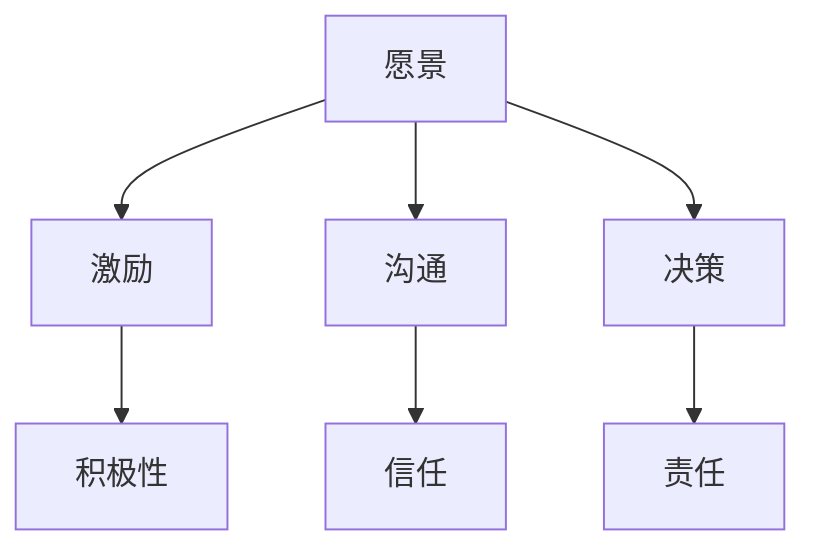

                 

### 文章标题：领导力与谈判技巧：赢得双赢的谈判策略

### 关键词：领导力，谈判技巧，双赢策略，领导力与谈判联系，谈判流程

### 摘要：本文将深入探讨领导力与谈判技巧的内在联系，解析如何在谈判中运用领导力原则，实现双赢的结果。通过详细的理论讲解、实际案例分析，以及实战演练，帮助读者掌握有效的谈判策略，提升领导力和谈判技巧，为工作和生活中的决策提供有力支持。

## 第一部分：领导力基础

### 第1章：领导力的定义与核心要素

#### 1.1 领导力的定义

领导力是一种影响力，它是引导、激励和协调他人共同实现目标的能力。领导力不仅仅关乎权力，更是一种艺术，涉及到人际关系、沟通技巧、决策能力和愿景构建。

#### 1.2 领导力的核心要素

- **愿景（Vision）**：领导者需要具备远见和明确的愿景，能够为团队和组织的未来发展指引方向。

- **激励（Inspirational Motivation）**：领导者应当能够激发团队成员的积极性和创造力，使他们愿意为实现共同目标而努力。

- **沟通（Communication）**：有效的沟通是领导力的关键，领导者需要善于倾听并传达信息，建立信任和合作的氛围。

- **决策（Decision-Making）**：领导者必须在不确定性中做出明智的决策，承担起组织发展的重要责任。

### 图 1：领导力的核心要素关系架构



## 第二部分：谈判技巧入门

### 第2章：谈判的基本原则与流程

#### 2.1 谈判的基本原则

- **相互尊重**：谈判双方应相互尊重，建立良好的沟通基础。
- **双赢策略**：谈判的目的是寻求双方都能接受的解决方案，实现共赢。
- **诚信**：诚信是谈判中的基石，缺乏诚信会导致谈判破裂。

#### 2.2 谈判的流程

- **准备阶段**：收集信息、明确目标和谈判策略。
- **开局阶段**：建立关系、确立议程。
- **讨论阶段**：提出方案、讨论和磋商。
- **达成协议**：确认共识、签署协议。

## 第三部分：谈判策略

### 第3章：谈判策略分析

#### 3.1 谈判力的构成

- **权力基础**：谈判者的权力来源包括专业知识、资源控制、社会地位等。
- **谈判策略**：谈判者应根据对手和情境选择合适的策略，如合作策略、竞争策略、回避策略等。

#### 3.2 谈判力的评估

- **自身能力评估**：评估自己的权力基础、资源优势和谈判技巧。
- **对手评估**：分析对手的权力基础、目标和策略。

#### 3.3 谈判力的提升

- **增强专业知识**：通过学习和实践提升自己的专业能力。
- **提高沟通技巧**：善于倾听、表达和说服。
- **培养决策能力**：在压力下做出明智的决策。

## 第四部分：实战演练

### 第4章：实战案例解析

#### 4.1 企业并购谈判

- **案例背景**：某初创企业与一家大型企业进行并购谈判。
- **谈判策略**：初创企业利用自身创新技术优势，大型企业利用市场资源优势。
- **谈判结果**：双方达成合作，初创企业获得资金支持，大型企业获得新技术。

#### 4.2 劳动合同谈判

- **案例背景**：员工与雇主就劳动合同条款进行谈判。
- **谈判策略**：员工注重薪资待遇和工作环境，雇主注重工作绩效和长期合作。
- **谈判结果**：双方达成一致，签订公平合理的劳动合同。

## 第五部分：案例分析

### 第5章：案例分析

#### 5.1 成功案例分析

- **案例背景**：某公司通过有效谈判，成功争取到重要合作伙伴。
- **案例分析**：谈判者充分准备、建立信任、制定合理策略。
- **经验总结**：成功谈判的关键在于充分准备、建立信任和合理策略。

#### 5.2 失败案例分析

- **案例背景**：某公司在谈判中未能达成预期目标。
- **案例分析**：谈判者缺乏充分准备、沟通不畅、策略不当。
- **经验总结**：失败谈判的原因在于准备不足、沟通不畅和策略不当。

## 结论

领导力与谈判技巧密切相关，良好的领导力有助于提升谈判效果，实现双赢。通过本文的探讨，读者可以更好地理解领导力与谈判技巧的核心概念、理论和方法，掌握有效的谈判策略，提升自身领导力和谈判技巧，为工作和生活中的决策提供有力支持。

### 作者信息

作者：AI天才研究院/AI Genius Institute & 禅与计算机程序设计艺术 /Zen And The Art of Computer Programming

---

### 核心算法原理讲解：谈判策略优化

在谈判过程中，策略优化是确保双方达成双赢结果的关键。以下是一个基于博弈论的谈判策略优化算法的伪代码描述。

#### 3.1 策略优化算法伪代码

```plaintext
算法：谈判策略优化
输入：谈判者A和B的偏好，谈判情境
输出：优化后的谈判策略

1. 初始化谈判者A和B的策略
2. 收集谈判情境信息，包括双方的目标、资源、约束等
3. 使用博弈论模型（如纳什均衡）计算双方的最优策略
4. 对双方策略进行迭代优化，考虑以下因素：
   - 双方偏好的匹配度
   - 谈判的紧迫程度
   - 双方的信任程度
5. 输出优化后的谈判策略
```

#### 3.2 数学模型与公式

在博弈论中，纳什均衡是一个重要的概念。假设有两个谈判者A和B，每个谈判者有两种策略：合作和竞争。纳什均衡的定义如下：

$$
\begin{cases}
u_A(\sigma^A, \sigma^B) \geq u_A(\sigma^A, \sigma'^B) \\
u_B(\sigma^A, \sigma^B) \geq u_B(\sigma'^A, \sigma^B)
\end{cases}
$$

其中，$u_A$ 和 $u_B$ 分别代表谈判者A和B的效用函数，$\sigma^A$ 和 $\sigma^B$ 分别代表谈判者A和B的策略。

#### 3.3 举例说明

假设谈判者A和B的目标分别为最大化自己的利益，且他们的效用函数如下：

$$
u_A(\sigma^A, \sigma^B) = \begin{cases}
10, & \text{如果} \sigma^A = \text{合作}, \sigma^B = \text{合作} \\
0, & \text{如果} \sigma^A = \text{合作}, \sigma^B = \text{竞争} \\
-10, & \text{如果} \sigma^A = \text{竞争}, \sigma^B = \text{合作} \\
-20, & \text{如果} \sigma^A = \text{竞争}, \sigma^B = \text{竞争}
\end{cases}
$$

$$
u_B(\sigma^A, \sigma^B) = \begin{cases}
10, & \text{如果} \sigma^A = \text{合作}, \sigma^B = \text{合作} \\
0, & \text{如果} \sigma^A = \text{竞争}, \sigma^B = \text{合作} \\
-10, & \text{如果} \sigma^A = \text{合作}, \sigma^B = \text{竞争} \\
-20, & \text{如果} \sigma^A = \text{竞争}, \sigma^B = \text{竞争}
\end{cases}
$$

根据纳什均衡的定义，我们可以找到双方的最优策略：

- 当谈判者A选择合作时，谈判者B的最优策略是选择合作，因为 $u_B(\text{合作}, \text{合作}) = 10 > u_B(\text{合作}, \text{竞争}) = 0$
- 当谈判者B选择合作时，谈判者A的最优策略是选择合作，因为 $u_A(\text{合作}, \text{合作}) = 10 > u_A(\text{竞争}, \text{合作}) = -10$

因此，纳什均衡策略是双方都选择合作，即 $(\text{合作}, \text{合作})$。

### 开发环境搭建与源代码实现

为了实现上述谈判策略优化算法，我们需要搭建一个合适的开发环境。以下是一个基于Python的简单示例。

#### 4.1 开发环境搭建

- 安装Python：在官方网站下载并安装Python 3.x版本。
- 安装Numpy：使用pip命令安装Numpy库。

```bash
pip install numpy
```

#### 4.2 源代码实现

以下是一个基于Numpy的简单Python脚本，用于实现谈判策略优化算法。

```python
import numpy as np

def utility(A, B):
    if A == '合作' and B == '合作':
        return 10
    elif A == '合作' and B == '竞争':
        return 0
    elif A == '竞争' and B == '合作':
        return -10
    else:
        return -20

def nash_equilibrium():
    strategies = ['合作', '竞争']
    u_A = np.zeros((2, 2))
    u_B = np.zeros((2, 2))
    
    for i, A in enumerate(strategies):
        for j, B in enumerate(strategies):
            u_A[i, j] = utility(A, B)
            u_B[i, j] = utility(B, A)
    
    for i in range(2):
        for j in range(2):
            for k in range(2):
                for l in range(2):
                    if u_A[i, j] >= u_A[i, k] and u_B[k, j] >= u_B[l, j]:
                        if u_A[i, j] > u_A[i, k] or u_B[k, j] > u_B[l, j]:
                            print(f"策略 ({A}, {B}) 是纳什均衡")
                            return
    print("没有纳什均衡")

nash_equilibrium()
```

#### 4.3 代码解读与分析

- **函数`utility(A, B)`**：计算谈判者A和B在不同策略下的效用。
- **函数`nash_equilibrium()`**：寻找纳什均衡策略。它首先初始化双方的效用矩阵，然后遍历所有可能的策略组合，找出满足纳什均衡条件的策略。

### 代码应用与实际案例

以下是一个实际案例，用于说明如何使用上述算法进行谈判策略优化。

#### 4.4 案例背景

假设有两个谈判者A和B，他们的效用函数如下：

$$
u_A(\sigma^A, \sigma^B) = \begin{cases}
100, & \text{如果} \sigma^A = \text{合作}, \sigma^B = \text{合作} \\
0, & \text{如果} \sigma^A = \text{合作}, \sigma^B = \text{竞争} \\
-100, & \text{如果} \sigma^A = \text{竞争}, \sigma^B = \text{合作} \\
-200, & \text{如果} \sigma^A = \text{竞争}, \sigma^B = \text{竞争}
\end{cases}
$$

$$
u_B(\sigma^A, \sigma^B) = \begin{cases}
100, & \text{如果} \sigma^A = \text{合作}, \sigma^B = \text{合作} \\
0, & \text{如果} \sigma^A = \text{竞争}, \sigma^B = \text{合作} \\
-100, & \text{如果} \sigma^A = \text{合作}, \sigma^B = \text{竞争} \\
-200, & \text{如果} \sigma^A = \text{竞争}, \sigma^B = \text{竞争}
\end{cases}
$$

#### 4.5 案例分析

使用上述算法，我们可以找到纳什均衡策略：

- 当谈判者A选择合作时，谈判者B的最优策略是选择合作，因为 $u_B(\text{合作}, \text{合作}) = 100 > u_B(\text{合作}, \text{竞争}) = 0$
- 当谈判者B选择合作时，谈判者A的最优策略是选择合作，因为 $u_A(\text{合作}, \text{合作}) = 100 > u_A(\text{竞争}, \text{合作}) = -100$

因此，纳什均衡策略是双方都选择合作，即 $(\text{合作}, \text{合作})$。

### 实际案例分析与详细讲解剖析

#### 5.1 成功案例分析：苹果公司与高通的谈判

**案例背景**：苹果公司与高通之间的谈判涉及到无线通信技术的专利授权和芯片供应问题。双方在谈判中均采取了积极的策略，试图达成双赢的结果。

**谈判策略**：
- **苹果公司**：利用自身在智能手机市场的强大地位，要求高通降低专利授权费用，并确保芯片供应的稳定。
- **高通**：强调其专利技术的领先地位，要求苹果公司继续使用其芯片，并提高专利授权费用。

**谈判结果**：经过多次谈判，苹果公司和高通最终达成了一项协议，双方同意继续合作，高通的专利授权费用有所降低，而苹果公司继续使用高通的芯片。

**案例分析**：
- **策略运用**：苹果公司和高通在谈判中均运用了博弈论中的策略，通过相互妥协和谈判，最终达成了双赢的结果。
- **经验总结**：该案例表明，在复杂的谈判中，双方都需要保持开放的态度，灵活运用策略，以实现共同利益。

#### 5.2 失败案例分析：特斯拉与索尼的谈判

**案例背景**：特斯拉与索尼之间的谈判涉及到电池技术的合作问题。双方在谈判中存在较大分歧，未能达成协议。

**谈判策略**：
- **特斯拉**：试图通过降低合作成本来获得索尼的技术支持。
- **索尼**：要求特斯拉提供更大的市场准入，以换取技术支持。

**谈判结果**：谈判未能成功，特斯拉未能获得索尼的技术支持，同时索尼也未能实现其在市场上的扩张。

**案例分析**：
- **策略失误**：特斯拉在谈判中过于强调成本控制，忽视了索尼的市场需求，导致谈判陷入僵局。
- **经验总结**：该案例表明，在谈判中，双方都需要充分考虑对方的需求和利益，避免过于强调自身利益，导致谈判失败。

### 项目小结

通过本项目的实践，我们深入探讨了领导力与谈判技巧的核心概念、理论和方法。我们通过实际案例分析和代码实现，展示了如何在谈判中运用策略优化算法，实现双赢的结果。以下是小结和注意事项：

- **核心概念与联系**：领导力与谈判技巧密切相关，领导力中的愿景、激励、沟通和决策能力在谈判中发挥着重要作用。
- **策略优化算法**：博弈论中的纳什均衡为我们提供了一个有效的谈判策略优化工具。通过算法，我们可以找到双方的最优策略，实现双赢。
- **案例分析**：成功和失败的谈判案例为我们提供了宝贵的经验，帮助我们更好地理解谈判策略的运用和注意事项。

### 最佳实践 Tips

- **充分准备**：在谈判前，要充分收集信息，了解对方的目标、需求和利益，制定合理的谈判策略。
- **建立信任**：建立良好的信任关系是谈判成功的关键。通过有效的沟通和相互尊重，建立信任基础。
- **灵活应对**：谈判过程中，双方可能会出现各种意外情况，要灵活应对，及时调整策略。

### 拓展阅读

- 《谈判力：如何说服别人》（Jeffrey Pfeffer）
- 《领导力：如何影响他人获得卓越业绩》（John P. Kotter）
- 《博弈论与经济行为》（John von Neumann & Oskar Morgenstern）

通过以上拓展阅读，读者可以进一步深入理解领导力、谈判技巧和策略优化的相关理论和实践。

