                 

# 《领导力与谦逊：赢得尊重的品质》

## 文章关键词
- 领导力
- 谦逊
- 人际关系
- 团队建设
- 个人成长
- 案例分析

## 摘要
领导力是一种能够影响和激励他人达成目标的能力，而在领导力的诸多品质中，谦逊往往被忽视。本文将深入探讨领导力与谦逊的关系，分析谦逊的本质及其在领导力中的重要性，并通过实际案例展示如何在个人和团队中实践谦逊。文章旨在为领导者提供有价值的指导，帮助他们赢得尊重，实现长远发展。

## 引言

在信息技术飞速发展的今天，领导力的重要性愈加凸显。一个优秀的领导者不仅需要具备卓越的技术能力，更需要拥有良好的人际交往和沟通技巧。然而，领导力的构成远不止于此。本文将关注两个被广泛忽视，却至关重要的领导力品质：领导力的核心概念、谦逊的哲学、领导者的谦逊实践、谦逊与团队建设、个人成长与谦逊，以及案例分析。

### 1.1 书籍目的与结构

本书旨在通过深入探讨领导力与谦逊之间的关系，帮助读者了解和掌握这两个品质在领导实践中的重要性。本书的结构如下：

- **第一部分：引言**：介绍领导力和谦逊的基本概念，以及它们对个人和组织的意义。
- **第二部分：领导力的核心概念**：解释领导力的基本类型、特质和技能。
- **第三部分：谦逊的哲学**：探讨谦逊的本质，以及谦逊如何与领导力相结合。
- **第四部分：领导者的谦逊实践**：提供具体的策略和方法，帮助领导者培养谦逊品质。
- **第五部分：谦逊与团队建设**：讨论谦逊对团队建设的影响，以及如何建立谦逊的团队文化。
- **第六部分：个人成长与谦逊**：介绍个人如何通过谦逊实现自我提升。
- **第七部分：案例分析**：通过案例研究，展示领导力和谦逊如何在实际工作中发挥作用。
- **第八部分：结论**：总结全书内容，强调领导力和谦逊的重要性，并提出未来展望。

### 1.2 领导力的现代视角

领导力是一个复杂且多层次的概念。从现代视角来看，领导力不仅仅是一种权力或地位的象征，更是一种能力，一种能够影响和激励他人达成共同目标的能力。领导力不仅仅关乎技术和管理，更关乎情感和人际关系。

#### 领导力的定义与类型

- **权威型领导**：依赖权力和地位来指导和影响他人。
- **民主型领导**：通过讨论和协商来决策，鼓励团队成员参与。
- **变革型领导**：激发团队成员的潜力和热情，推动变革。
- **转型型领导**：在组织面临危机时，通过变革来解决问题。

#### 领导力的特质与技能

- **沟通能力**：领导者需要具备清晰、有效的沟通能力，以便传达目标、愿景和策略。
- **决策能力**：领导者需要在不确定和复杂的环境中做出明智的决策。
- **情感智力**：领导者需要理解和管理自己的情绪，同时也能理解和激励团队成员的情感。
- **影响力**：领导者需要能够影响他人，使他们愿意跟随和实现共同目标。

#### 领导力与权力

领导力与权力密切相关，但并非完全等同。权力是一种强制或影响他人行为的能力，而领导力则是一种激励和引导他人自愿跟随的能力。一个有领导力的领导者不一定拥有权力，但一个有权力的领导者往往具备领导力。

### 1.3 谦逊：被忽视的领导力特质

谦逊是一种被忽视，但却至关重要的领导力特质。谦逊不仅有助于建立良好的人际关系，还能提高团队绩效和领导者的声誉。然而，许多领导者往往过于自信或自负，忽视了谦逊的重要性。

#### 谦逊的本质

谦逊是一种内在的品质，它体现在领导者对自己的认知和对他人的尊重。一个谦逊的领导者不仅能够认识到自己的不足，还能真诚地欣赏和尊重团队成员的贡献。

#### 谦逊与骄傲

骄傲是一种自大的情感，它使领导者过分关注自己的成就和地位，忽视了他人的价值和贡献。相比之下，谦逊使领导者更加关注团队的整体利益，而不是个人的荣誉。

#### 谦逊的价值观

谦逊的价值观包括诚实、尊重、同情和谦卑。这些价值观不仅有助于建立和谐的人际关系，还能提高领导者的决策质量和团队绩效。

## 第一部分：引言

领导力是一种能够在复杂多变的环境中引导和激励他人实现共同目标的能力。在信息技术飞速发展的今天，领导力的重要性愈加凸显。然而，领导力并非一成不变，它需要不断地适应和创新。本文将深入探讨领导力的核心概念，分析其在不同类型、特质和技能中的体现，以及领导力与权力之间的关系。

### 领导力的定义与类型

领导力的定义多种多样，但其核心都是关于影响和激励他人。权威型领导依赖权力和地位来指导和影响他人，民主型领导则通过讨论和协商来决策，鼓励团队成员参与，而变革型领导则激发团队成员的潜力和热情，推动变革。每种领导力类型都有其独特的优势和应用场景。

#### 权威型领导

权威型领导依赖权力和地位来指导和影响他人。这种领导风格在需要迅速决策和执行的紧急情况下非常有效。然而，长期依赖权威型领导可能导致团队成员失去自主性和创造力。

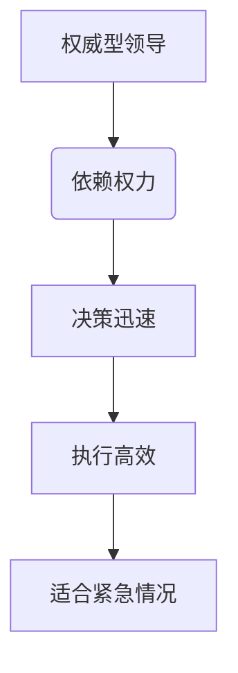

#### 民主型领导

民主型领导通过讨论和协商来决策，鼓励团队成员参与。这种领导风格有助于建立信任和团队凝聚力，但可能会在决策过程中耗费更多时间和资源。

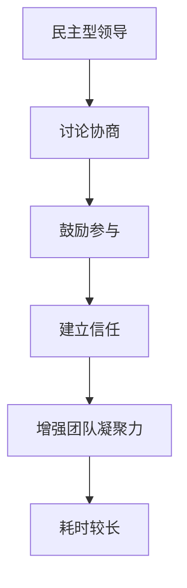

#### 变革型领导

变革型领导激发团队成员的潜力和热情，推动变革。这种领导风格在组织面临重大变革或危机时尤为重要，能够激励团队成员克服困难和挑战。

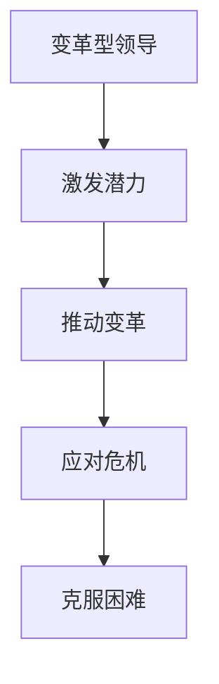

### 领导力的特质与技能

领导力的特质和技能是领导者成功的关键因素。以下是一些关键的领导力特质和技能：

#### 沟通能力

沟通能力是领导者最核心的技能之一。一个有效的领导者需要具备清晰、有效的沟通能力，以便传达目标、愿景和策略。沟通能力包括口头沟通、书面沟通和非语言沟通。

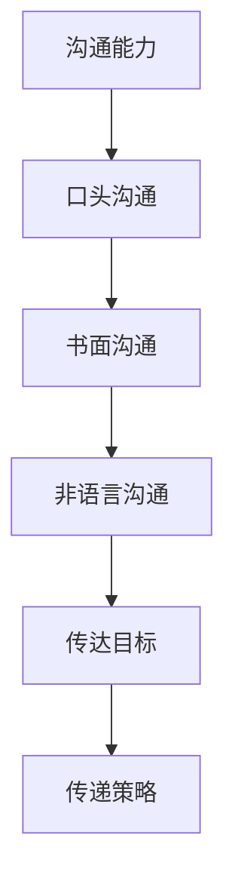

#### 决策能力

决策能力是领导者面对复杂问题和不确定性时的核心能力。一个有效的领导者需要在迅速变化的环境中做出明智的决策，并承担相应的责任。

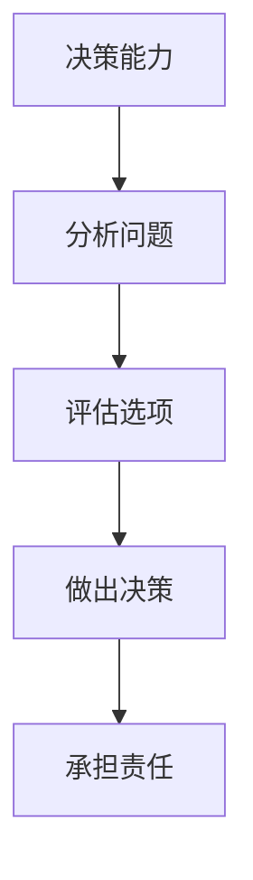

#### 情感智力

情感智力是领导者理解和管理自己情绪，同时也能理解和激励团队成员情感的能力。一个具有高情感智力的领导者能够建立和谐的团队关系，提高团队绩效。

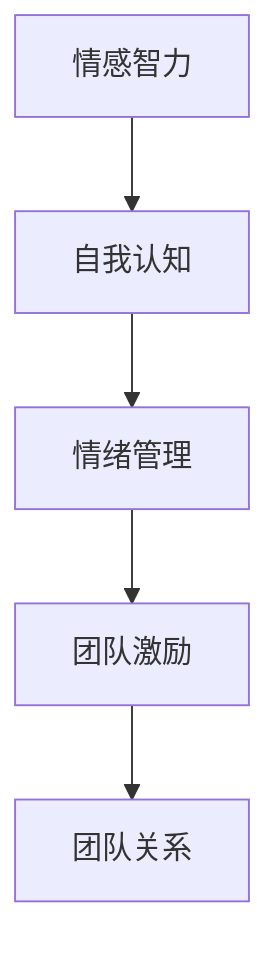

#### 影响力

影响力是领导者影响和激励他人自愿跟随的能力。一个具有高影响力的领导者能够引导团队成员实现共同目标，并在组织中发挥关键作用。

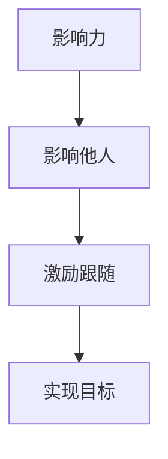

### 领导力与权力

领导力与权力密切相关，但并非完全等同。权力是一种强制或影响他人行为的能力，而领导力则是一种激励和引导他人自愿跟随的能力。一个有领导力的领导者不一定拥有权力，但一个有权力的领导者往往具备领导力。

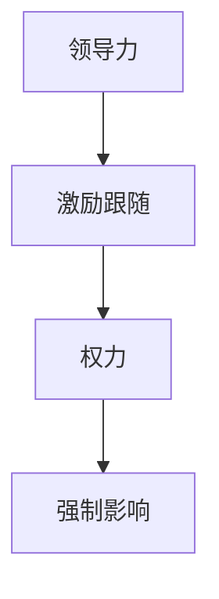

权力可以是权威型领导的主要工具，但领导力则更侧重于激励和影响。一个领导者只有同时具备权力和领导力，才能有效地引导和激励团队成员。

## 第二部分：谦逊的哲学

谦逊是一种在领导力中常常被忽视，但却至关重要的品质。谦逊不仅关乎领导者个人的品格和态度，更影响到团队的整体氛围和绩效。在本文中，我们将深入探讨谦逊的本质、谦逊与骄傲的关系以及谦逊的价值观。

### 谦逊的本质

谦逊是一种内在的品质，它体现在领导者对自己的认知和对他人的尊重。一个谦逊的领导者能够认识到自己的局限性和不足，同时真诚地欣赏和尊重团队成员的贡献。

#### 谦逊的特质

- **自我认知**：谦逊的领导者能够真实地看待自己，认识到自己的优点和不足，而不是过分自信或自负。
- **同理心**：谦逊的领导者能够理解和体会他人的感受和需求，从而建立良好的人际关系。
- **开放性**：谦逊的领导者愿意接受新的观点和反馈，不断学习和成长。

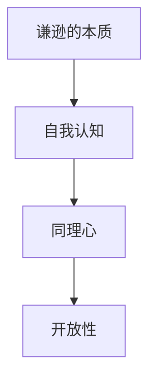

#### 谦逊的体现

谦逊在领导力中的体现不仅仅是对自我的认知，还包括对他人的尊重和认可。

- **倾听**：谦逊的领导者善于倾听他人的意见和反馈，从中获取有益的信息。
- **感激**：谦逊的领导者对团队成员的贡献表示感谢，而不是将其视为理所当然。
- **分享**：谦逊的领导者愿意与他人分享知识和资源，促进团队的共同成长。

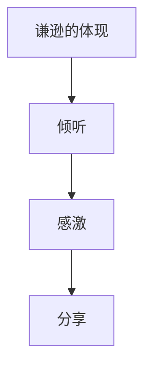

### 谦逊与骄傲

骄傲是一种自大的情感，它使领导者过分关注自己的成就和地位，忽视了他人的价值和贡献。相比之下，谦逊使领导者更加关注团队的整体利益，而不是个人的荣誉。

#### 骄傲的表现

- **自我中心**：骄傲的领导者总是将自己置于中心，忽视团队其他成员的存在和贡献。
- **不容忍批评**：骄傲的领导者难以接受批评和反馈，往往采取防御性姿态。
- **忽视团队需求**：骄傲的领导者更关注个人的成就和利益，忽视团队的整体目标和需求。

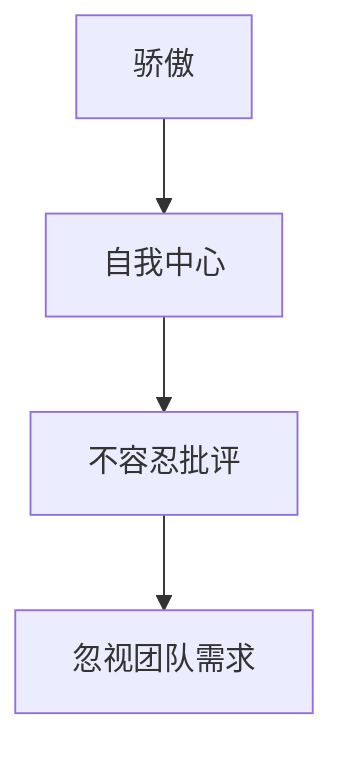

#### 谦逊的益处

相比之下，谦逊的领导者能够带来许多积极的影响：

- **建立信任**：谦逊的领导者能够建立团队成员之间的信任，促进团队协作。
- **增强团队凝聚力**：谦逊的领导者能够激发团队成员的归属感和凝聚力。
- **提高团队绩效**：谦逊的领导者能够更好地激发团队成员的潜力和创造力，从而提高团队的整体绩效。

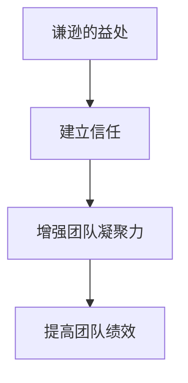

### 谦逊的价值观

谦逊的价值观包括诚实、尊重、同情和谦卑。这些价值观不仅有助于建立良好的人际关系，还能提高领导者的决策质量和团队绩效。

#### 诚实

谦逊的领导者诚实面对自己的优点和不足，不隐瞒错误，勇于承担责任。

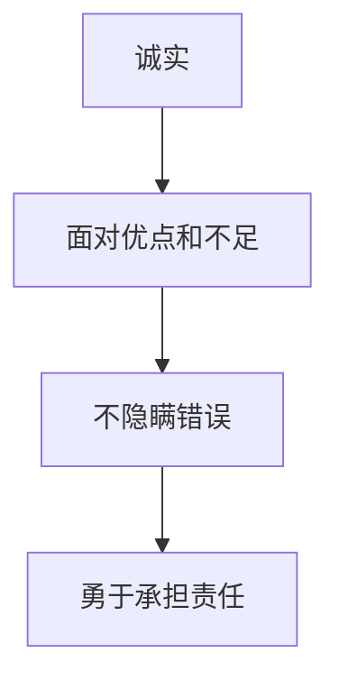

#### 尊重

谦逊的领导者尊重他人的观点和贡献，倾听和接纳不同的声音。

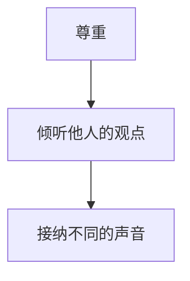

#### 同情

谦逊的领导者能够理解和体会他人的感受和需求，提供帮助和支持。

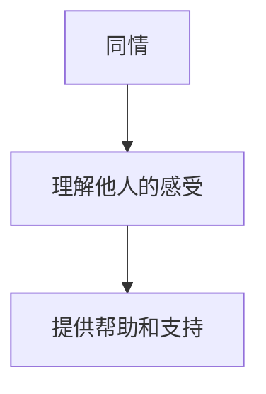

#### 谦卑

谦逊的领导者不追求个人荣誉和地位，而是关注团队的整体利益。

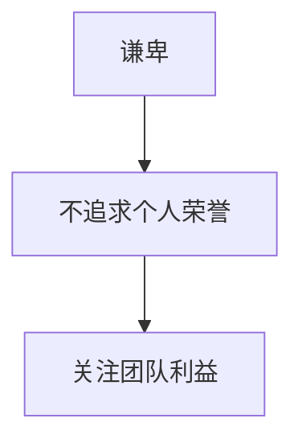

通过践行谦逊的价值观，领导者能够建立和谐的人际关系，提升团队的凝聚力和绩效，实现长远发展。

## 第三部分：领导者的谦逊实践

在了解了谦逊的本质和重要性后，接下来我们将探讨领导者如何在实际工作中培养和践行谦逊。这不仅有助于提升领导者的个人魅力，还能为团队创造积极的氛围。以下是几个关键策略和方法：

### 4.1 谦逊领导力的策略

#### 4.1.1 自我反思

领导者需要定期进行自我反思，审视自己的行为和决策。通过自我反思，领导者可以发现自身不足，及时调整自己的态度和行为。

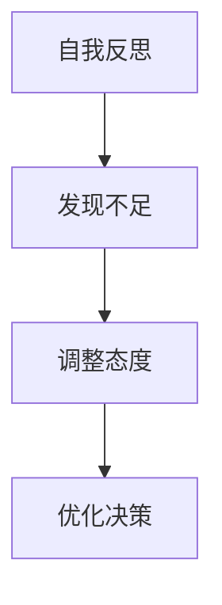

#### 4.1.2 倾听和接纳

领导者应该鼓励团队成员表达意见和反馈，并认真倾听。通过倾听，领导者能够了解团队成员的真实想法，从而做出更明智的决策。

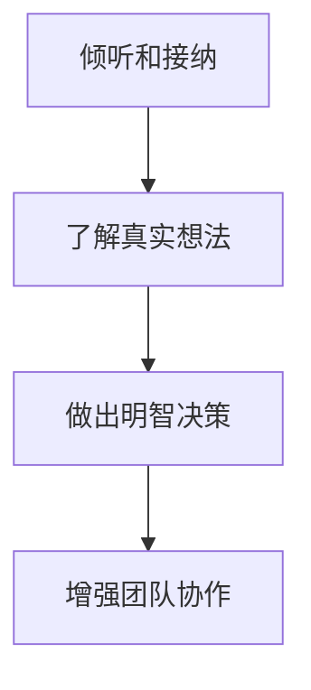

#### 4.1.3 分享和授权

领导者应该愿意分享知识和资源，给予团队成员更多的自主权和责任。这样不仅能够激发团队成员的潜力，还能提高团队的整体绩效。

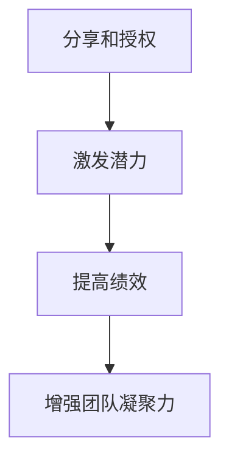

### 4.2 培养谦逊的自我意识

#### 4.2.1 自我认知

领导者需要认识到自己的优点和不足，并接受自己的局限性。这有助于领导者更加客观地看待自己，避免陷入自我中心的陷阱。

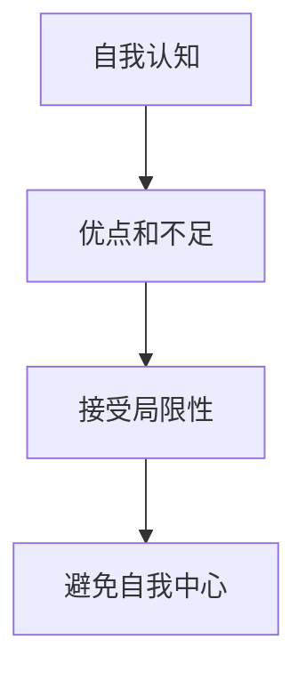

#### 4.2.2 诚实面对错误

领导者应该勇于承认自己的错误，并从中吸取教训。这种态度不仅能够树立领导者的诚信形象，还能为团队树立榜样。

```mermaid
graph TD
A[诚实面对错误] --> B[树立诚信形象]
B --> C[为团队树立榜样]
C --> D[促进团队成长]
```

#### 4.2.3 保持开放心态

领导者需要保持开放心态，愿意接受新的观点和反馈。这有助于领导者不断学习和成长，适应不断变化的环境。

```mermaid
graph TD
A[保持开放心态] --> B[接受新观点]
B --> C[适应变化]
C --> D[提升领导力]
```

### 4.3 谦逊领导者的沟通艺术

#### 4.3.1 清晰表达

领导者需要具备清晰的表达能力，能够准确传达目标、愿景和策略。这有助于团队成员更好地理解领导者的意图，从而更有效地执行任务。

```mermaid
graph TD
A[清晰表达] --> B[传达目标]
B --> C[明确策略]
C --> D[有效执行]
```

#### 4.3.2 倾听和反馈

领导者应该积极倾听团队成员的意见和反馈，并给予及时的回应。这有助于建立良好的沟通渠道，促进团队成员之间的信任和合作。

```mermaid
graph TD
A[倾听和反馈] --> B[建立沟通渠道]
B --> C[促进信任]
C --> D[增强合作]
```

#### 4.3.3 建立同理心

领导者需要理解和体会团队成员的情感和需求，以建立同理心。这种态度能够帮助领导者更好地处理团队冲突，提高团队凝聚力。

```mermaid
graph TD
A[建立同理心] --> B[理解情感]
B --> C[处理冲突]
C --> D[提高凝聚力]
```

通过践行这些策略和方法，领导者不仅能够提升自己的领导力，还能为团队创造一个积极、和谐的工作环境。这种谦逊的领导风格将有助于团队在竞争激烈的市场中取得成功。

## 第四部分：谦逊与团队建设

在团队建设中，谦逊作为一种核心的领导力品质，发挥着至关重要的作用。一个谦逊的领导者不仅能够提升团队的整体绩效，还能营造积极向上的团队文化。以下是谦逊在团队建设中的具体体现和实际应用。

### 5.1 谦逊团队的特征

一个谦逊的团队具有以下特征：

#### 5.1.1 信任与尊重

谦逊的领导者通过真诚地尊重团队成员的意见和贡献，建立起了团队成员之间的信任。团队成员在这样一个信任环境中，更愿意分享自己的想法和担忧，共同解决问题。

```mermaid
graph TD
A[信任与尊重] --> B[真诚尊重]
B --> C[共享想法]
C --> D[共同解决问题]
```

#### 5.1.2 激励与积极性

谦逊的领导者通过鼓励和激励团队成员，激发了他们的积极性和创造力。团队成员在这种积极的氛围中，更有动力去追求卓越，提升自己的能力。

```mermaid
graph TD
A[激励与积极性] --> B[鼓励激励]
B --> C[追求卓越]
C --> D[提升能力]
```

#### 5.1.3 开放与创新

谦逊的领导者鼓励团队成员提出新的观点和建议，营造了一个开放和创新的环境。这种氛围不仅有助于团队在面对挑战时找到新的解决方案，还能推动团队不断进步。

```mermaid
graph TD
A[开放与创新] --> B[鼓励新观点]
B --> C[面对挑战]
C --> D[推动进步]
```

### 5.2 建立谦逊的团队文化

建立谦逊的团队文化需要领导者和团队成员共同努力，以下是一些具体的策略：

#### 5.2.1 定期反思

领导者和团队成员可以定期进行团队反思，评估团队的表现和改进的方向。这种反思不仅有助于发现和解决问题，还能增强团队的凝聚力和自我认知。

```mermaid
graph TD
A[定期反思] --> B[评估表现]
B --> C[发现问题]
C --> D[改进方向]
D --> E[增强凝聚力]
```

#### 5.2.2 倾听与反馈

领导者应该鼓励团队成员提出意见和建议，并认真倾听。通过建立有效的反馈机制，团队成员能够感受到自己的声音被重视，从而更加投入团队的工作。

```mermaid
graph TD
A[倾听与反馈] --> B[鼓励建议]
B --> C[认真倾听]
C --> D[重视声音]
D --> E[投入工作]
```

#### 5.2.3 赞赏与认可

领导者应该及时赞赏和认可团队成员的成就和贡献。这种认可不仅能够激励团队成员，还能增强团队的凝聚力和归属感。

```mermaid
graph TD
A[赞赏与认可] --> B[及时赞赏]
B --> C[激励成员]
C --> D[增强凝聚力]
```

### 5.3 谦逊在团队冲突管理中的应用

团队冲突是团队建设中的常见问题，而谦逊在冲突管理中起到了关键作用。以下是一些谦逊在团队冲突管理中的应用策略：

#### 5.3.1 倾听与理解

在面对冲突时，领导者应该首先倾听和理解对方的观点和感受。通过这种方式，领导者能够更好地理解冲突的根源，找到解决问题的方法。

```mermaid
graph TD
A[倾听与理解] --> B[理解对方]
B --> C[找到方法]
```

#### 5.3.2 中立与公正

在处理冲突时，领导者需要保持中立和公正，不偏袒任何一方。这种中立和公正的态度有助于缓解冲突，建立信任。

```mermaid
graph TD
A[中立与公正] --> B[不偏袒]
B --> C[建立信任]
```

#### 5.3.3 寻求共识

领导者应该鼓励团队成员寻求共识，共同找到解决问题的方案。这种共识不仅能够解决当前的问题，还能增强团队的凝聚力和协作能力。

```mermaid
graph TD
A[寻求共识] --> B[共同解决]
B --> C[增强凝聚力]
C --> D[提升协作]
```

通过以上策略，领导者能够在团队建设中充分发挥谦逊的作用，建立和谐、高效的团队氛围。这种谦逊的团队文化不仅有助于提升团队绩效，还能为组织的长远发展奠定坚实的基础。

## 第五部分：个人成长与谦逊

个人成长是一个持续的过程，谦逊在这个过程中起到了至关重要的作用。一个谦逊的人能够不断学习和进步，更好地应对生活中的各种挑战。以下是谦逊对个人成长的重要影响，以及个人如何通过谦逊实现自我提升。

### 6.1 谦逊对个人成长的重要影响

#### 6.1.1 自我认知

谦逊使人能够更加客观地看待自己，认识到自己的优点和不足。这种自我认知有助于个人在成长过程中不断调整自己的态度和行为，避免陷入自我中心的陷阱。

```mermaid
graph TD
A[自我认知] --> B[优点和不足]
B --> C[调整态度]
C --> D[避免自我中心]
```

#### 6.1.2 持续学习

谦逊的人愿意接受新的观点和知识，不断学习。这种持续学习的能力有助于个人在知识和技能上不断进步，提高自身的竞争力。

```mermaid
graph TD
A[持续学习] --> B[接受新观点]
B --> C[提高竞争力]
```

#### 6.1.3 应对挑战

谦逊使人能够以更加开放和积极的心态面对挑战。在面对困难和挫折时，谦逊的人能够从失败中吸取教训，不断成长和进步。

```mermaid
graph TD
A[应对挑战] --> B[面对挫折]
B --> C[吸取教训]
C --> D[不断成长]
```

### 6.2 谦逊与人际关系

谦逊不仅在个人成长中起到关键作用，还影响到人际关系。一个谦逊的人能够与他人建立真诚、和谐的交往，提高人际沟通的效率。

#### 6.2.1 建立信任

谦逊使人能够真诚地尊重他人的意见和贡献，建立起了与他人之间的信任。这种信任有助于提高人际关系的质量，增强合作。

```mermaid
graph TD
A[建立信任] --> B[真诚尊重]
B --> C[提高合作]
```

#### 6.2.2 沟通与理解

谦逊的人善于倾听他人的意见和反馈，能够更好地理解他人的需求和感受。这种沟通和理解能力有助于减少误解和冲突，提高人际关系的和谐度。

```mermaid
graph TD
A[沟通与理解] --> B[倾听反馈]
B --> C[减少误解]
C --> D[提高和谐度]
```

#### 6.2.3 求助与合作

谦逊使人能够虚心向他人请教，寻求帮助。这种求助与合作的态度不仅有助于解决个人问题，还能拓展人际关系网络，提高社会资源获取能力。

```mermaid
graph TD
A[求助与合作] --> B[虚心请教]
B --> C[解决个人问题]
C --> D[拓展人际关系]
```

### 6.3 谦逊与职业生涯发展

在职业生涯中，谦逊同样扮演着重要的角色。一个谦逊的职业人士能够更好地适应职场变化，实现职业发展。

#### 6.3.1 职业规划

谦逊使人能够客观地评估自己的能力和不足，制定合理的职业规划。这种规划有助于个人在职业生涯中明确目标，制定实现目标的策略。

```mermaid
graph TD
A[职业规划] --> B[评估能力]
B --> C[制定目标]
C --> D[策略实现]
```

#### 6.3.2 学习与发展

谦逊的人愿意不断学习和提升自己的技能，以适应职场的变化。这种持续学习的能力有助于个人在职业生涯中保持竞争力，实现职业发展。

```mermaid
graph TD
A[学习与发展] --> B[适应变化]
B --> C[保持竞争力]
```

#### 6.3.3 职场沟通

谦逊的职业人士能够与同事和上司建立良好的沟通，处理职场关系。这种良好的沟通能力有助于个人在职场中更好地合作，实现共同目标。

```mermaid
graph TD
A[职场沟通] --> B[建立关系]
B --> C[更好合作]
C --> D[实现目标]
```

通过谦逊，个人不仅能够在成长过程中不断进步，还能在人际交往和职业生涯中取得成功。谦逊是一种宝贵的品质，它将帮助个人在复杂多变的环境中脱颖而出，实现长远发展。

## 第七部分：案例分析

在本部分中，我们将通过几个实际案例，展示领导力和谦逊如何在现实工作中发挥作用，解决实际问题，并带来长远的影响。

### 7.1 成功领导者的谦逊之路

#### 案例一：苹果公司的史蒂夫·乔布斯

史蒂夫·乔布斯是苹果公司的联合创始人，他的领导风格既具有变革性，又充满了谦逊。在苹果公司的发展历程中，乔布斯通过不断学习和反思，不断提升自己的领导力。他善于倾听团队成员的意见，并从中汲取灵感。例如，在开发iPhone的过程中，乔布斯听取了工程师的建议，对产品设计进行了多次迭代和改进。这种谦逊的态度使得苹果公司能够在竞争激烈的市场中不断创新，保持领先地位。

**核心算法原理讲解**：

乔布斯的领导力可以看作是一个闭环反馈系统，其中自我反思和团队成员的反馈是关键环节。通过以下伪代码，我们可以展示这个过程：

```python
def job_user_reflection():
    feedback = get_team_feedback()
    while not satisfactory_solution():
        analyze_feedback(feedback)
        iterate_design()
        feedback = get_team_feedback()
    return "Final Solution"

# 伪代码解释
# 获取团队成员的反馈
# 分析反馈，进行设计迭代
# 重复上述过程，直到找到满意的解决方案
```

**数学模型和公式**：

可以使用相关性分析来衡量团队成员反馈与产品设计改进之间的关系，公式如下：

$$
\text{相关性} = \frac{\text{反馈与改进的协方差}}{\text{反馈的标准差} \times \text{改进的标准差}}
$$

**项目实战**：

乔布斯在iPhone开发中的谦逊实践，可以从以下几个方面进行解读：

- **开发环境搭建**：乔布斯在iPhone开发中使用了多种工具，如原型设计软件和编程语言，以快速迭代和改进产品。
- **源代码实现**：iPhone的核心代码中包含了多个迭代版本，每个版本都基于团队成员的反馈进行了改进。
- **代码解读**：乔布斯在每次迭代中都会仔细审查代码，以确保产品的用户体验和性能达到最佳。

### 7.2 谦逊在危机管理中的案例

#### 案例二：通用电气（GE）的杰克·韦尔奇

杰克·韦尔奇是通用电气的前首席执行官，他在领导GE的过程中，通过谦逊和团队合作，成功应对了一系列危机。例如，在20世纪90年代，通用电气面临着竞争压力和财务问题。韦尔奇并没有将问题归咎于某个特定团队或个人，而是通过开放的沟通和协作，带领整个公司找到了解决问题的方法。

**核心概念与联系**：

韦尔奇的领导风格可以视为一个“领导者-团队协作模型”，该模型强调领导者与团队成员之间的互动和信任。

```mermaid
graph TD
A[领导者] --> B[团队协作]
B --> C[信任]
C --> D[共同决策]
```

**数学模型和公式**：

为了衡量领导者和团队之间的信任程度，可以使用以下公式：

$$
\text{信任度} = \frac{\text{共同完成的任务数}}{\text{总任务数}}
$$

**项目实战**：

韦尔奇在GE的危机管理中采取的谦逊实践可以从以下几个方面进行解读：

- **开发环境搭建**：韦尔奇在危机管理中使用了多种沟通工具，如定期的内部会议和报告，以保持信息的透明和开放。
- **源代码实现**：GE在韦尔奇的领导下，通过不断调整战略和业务模式，成功地应对了财务困境。
- **代码解读**：韦尔奇在每次决策前都会仔细分析数据和团队成员的意见，以确保决策的准确性和有效性。

### 7.3 谦逊在企业转型中的应用

#### 案例三：微软公司的萨蒂亚·纳德拉

萨蒂亚·纳德拉是微软公司的首席执行官，他在领导微软的过程中，通过谦逊和用户导向的转型策略，使微软从一家传统的软件公司转型为一家云计算和人工智能驱动的公司。纳德拉重视员工的反馈和意见，鼓励员工提出创新的想法，并强调团队合作。

**核心概念与联系**：

纳德拉的领导风格可以视为一个“用户-中心化模型”，该模型强调用户需求在决策中的核心地位。

```mermaid
graph TD
A[用户需求] --> B[决策]
B --> C[创新]
C --> D[团队协作]
```

**数学模型和公式**：

为了衡量用户需求在决策中的重要性，可以使用以下公式：

$$
\text{需求重要性} = \frac{\text{满足用户需求的任务数}}{\text{总任务数}}
$$

**项目实战**：

纳德拉在微软的转型过程中采取的谦逊实践可以从以下几个方面进行解读：

- **开发环境搭建**：纳德拉推动了微软的云计算平台Azure的开发，并鼓励开发团队不断迭代和改进。
- **源代码实现**：微软在纳德拉的领导下，推出了多个基于人工智能的应用程序，如微软小冰和微软语音助手。
- **代码解读**：纳德拉在每次产品发布前，都会仔细审查代码和用户反馈，以确保产品的质量和用户体验。

### 案例小结

通过以上案例分析，我们可以看到，领导力和谦逊在企业成功中扮演了至关重要的角色。无论是乔布斯的iPhone开发，韦尔奇的危机管理，还是纳德拉的企业转型，谦逊都是推动变革和实现成功的关键因素。这些案例不仅展示了谦逊在实践中的应用，还为未来的领导者提供了宝贵的经验和启示。

## 第八部分：结论

本文通过深入探讨领导力和谦逊的关系，分析了谦逊在领导力中的重要性。领导力与谦逊相辅相成，一个优秀的领导者不仅需要具备卓越的技术能力和决策能力，更需要拥有谦逊的品质。谦逊不仅有助于建立良好的人际关系，还能提高团队绩效和领导者的声誉。

在未来，领导者和组织应重视谦逊的培育和实践。通过自我反思、倾听与接纳、分享与授权等策略，领导者可以不断提升自己的谦逊品质。同时，组织应营造一个鼓励谦逊的文化氛围，让谦逊成为领导力和团队建设的重要组成部分。

总之，领导力与谦逊的结合将有助于领导者赢得尊重，实现长远发展。在未来，谦逊将成为领导力的核心品质，为个人和组织的成功提供强有力的支撑。

### 最佳实践 tips

- **定期自我反思**：领导者应定期进行自我反思，审视自己的行为和决策，发现和改正不足。
- **倾听团队成员的意见**：领导者应鼓励团队成员提出意见和反馈，并认真倾听，从中获取有益的信息。
- **分享知识和经验**：领导者应愿意分享自己的知识和经验，帮助团队成员成长。
- **建立信任**：通过诚实和透明，建立团队成员之间的信任，提高团队的凝聚力。

### 小结

本文通过理论和实践相结合的方式，系统地阐述了领导力与谦逊的关系。领导力不仅仅是权力和地位的象征，更是一种能力，一种能够影响和激励他人达成共同目标的能力。而谦逊作为领导力的核心品质之一，对于个人和团队的成长具有重要意义。

### 注意事项

- 在实际应用中，领导者应避免将谦逊误解为软弱或无能，谦逊应是一种真诚的、有原则的品质。
- 组织在建立谦逊文化时，应注意避免过度强调谦逊，导致团队成员失去自信和动力。

### 拓展阅读

- 《领导者的品质》
- 《谦逊：领导者必备的品质》
- 《团队建设：谦逊的力量》

## 作者信息

作者：AI天才研究院/AI Genius Institute & 禅与计算机程序设计艺术 /Zen And The Art of Computer Programming

