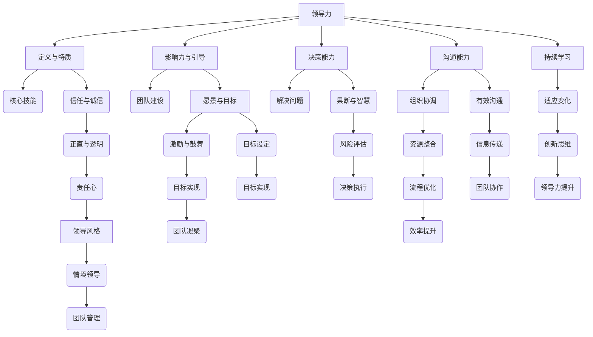

                 

### 文章标题

# 领导力与责任担当：勇于承担责任

在现代社会中，领导力与责任担当已成为衡量个人和团队成功的关键因素。无论是企业管理者、技术团队领导，还是政府部门的管理者，都需要具备强大的领导力与责任担当能力，以应对日益复杂的挑战和不断变化的环境。本文将围绕领导力的本质、责任担当的内涵，以及如何在实际工作中勇于承担责任展开讨论，旨在为读者提供一个全面而深入的视角，帮助他们在各自的角色中取得更大成功。

关键词：领导力、责任担当、勇于承担责任、职场成功、团队合作、组织管理

摘要：本文首先介绍了领导力和责任担当的基本概念，探讨了它们在个人和组织发展中的重要性。接着，通过核心概念之间的关联架构Mermaid流程图，帮助读者理解领导力与责任担当的相互作用。然后，详细讲解了领导力与责任担当的关键算法原理，使用伪代码和数学模型阐述了它们的运作机制。文章还通过实际项目实战和案例分析，展示了如何在实际工作中应用这些概念。最后，文章总结了最佳实践技巧和小结，为读者提供了进一步学习和实践的指导。

### 背景介绍

在当今快速变化且竞争激烈的社会中，领导力与责任担当的重要性愈发凸显。无论是在企业、政府机构还是非营利组织，领导者的角色都不仅仅是发号施令，而是需要具备引领团队、解决问题和承担责任的能力。以下将从几个方面介绍领导力和责任担当在现代职场中的重要性。

首先，领导力是企业成功的关键。领导力不仅关乎企业的短期业绩，更关系到企业的长远发展。一个具备强大领导力的管理者，能够激发员工的潜能，提升团队的整体绩效，推动企业不断创新和进步。例如，苹果公司的史蒂夫·乔布斯以其卓越的领导力，带领苹果实现了从濒临破产到全球科技巨头的大转变。

其次，责任担当是领导者必备的品质。责任担当意味着在面对困难和挑战时，领导者要勇于承担起应有的责任，而不是推卸责任或逃避问题。这种品质能够增强团队的凝聚力和信任感，提高员工的满意度和忠诚度。例如，在2010年英国石油公司深水地平线漏油事件中，公司高管们未能及时承担责任，导致公众愤怒和巨大经济损失。

此外，领导力和责任担当也是团队成功的关键。一个高效的团队离不开具有领导力的团队成员和能够勇于承担责任的环境。领导力能够引导团队成员朝着共同的目标努力，而责任担当则确保每个成员都愿意为自己的工作负责，从而提高团队的整体效能。例如，在NASA的阿波罗计划中，各个团队通过卓越的领导力和责任担当，成功完成了人类历史上的首次月球登陆。

最后，领导力和责任担当对于个人职业发展也至关重要。具备这些能力的人更容易获得晋升机会，因为他们能够更好地应对复杂的工作环境和挑战。同时，领导力和责任担当也是建立个人品牌和影响力的基础，能够提升个人的社会地位和职业声望。

综上所述，领导力与责任担当在现代社会中具有极其重要的意义。无论是企业管理者、技术团队领导，还是政府部门的管理者，都需要重视并不断提升自己的领导力和责任担当能力，以应对日益复杂的职场挑战，实现个人和组织的成功。

### 核心概念与联系

为了更好地理解领导力和责任担当的关系，我们需要首先明确这两个核心概念，并探讨它们之间的相互影响。下面，我们将使用Mermaid流程图来展示这些概念之间的联系架构。



通过这个Mermaid流程图，我们可以清晰地看到领导力和责任担当之间的多种联系。领导力涵盖了定义与特质、核心技能、影响力与引导、决策能力、沟通能力、组织协调和持续学习等多个方面，而责任担当则体现在信任与诚信、正直与透明、责任心、领导风格、愿景与目标、决策能力、沟通能力和持续学习等方面。以下是具体的概念解释和它们之间的联系：

1. **定义与特质**：领导力首先是一种定义明确的角色，它要求领导者具备一系列特质，如信任与诚信、正直与透明、责任心等。这些特质是领导力的基础，也是责任担当的体现。

2. **核心技能**：领导力的核心技能包括决策能力、沟通能力、组织协调和持续学习。这些技能不仅帮助领导者有效管理团队，还确保他们能够承担起应有的责任。

3. **影响力与引导**：领导力通过影响力与引导实现目标，这需要领导者具备愿景与目标、激励与鼓舞等能力。责任担当在这里表现为领导者勇于面对挑战，确保目标实现。

4. **决策能力**：领导者的决策能力是至关重要的，它决定了团队的方向和行动。责任担当意味着领导者要果断地做出决策，并对决策结果负责。

5. **沟通能力**：沟通能力是领导力的重要组成部分，有效的沟通能够确保信息的准确传递，促进团队协作。责任担当要求领导者不仅要沟通，还要确保团队成员理解并承担各自的责任。

6. **组织协调**：领导力涉及到资源的整合和流程的优化，以确保团队的高效运作。责任担当在这里表现为领导者要确保每个成员都明确自己的职责，并对其负责。

7. **持续学习**：领导力不是一成不变的，领导者需要不断学习和适应变化。责任担当要求领导者不仅要自己持续学习，还要鼓励团队成员也不断进步。

通过这些概念和它们之间的联系，我们可以看到领导力与责任担当是如何相互支持和相互促进的。领导者不仅需要具备强大的领导力，还需要勇于承担责任，以实现团队和组织的成功。理解这些核心概念及其关系，对于提升个人领导力和责任担当能力至关重要。

### 领导力的核心算法原理

领导力是一种多维度的复杂能力，它不仅涉及个人特质和技能，还涉及到一系列具体的算法原理和模型。为了深入理解领导力，我们需要使用伪代码来详细阐述这些原理，并结合数学模型和公式来展示它们的运作机制。以下是几个关键的领导力算法原理及其解释。

#### 1. 权变领导模型（Contingency Leadership Model）

权变领导模型由保罗·赫赛（Paul Hersey）和肯·布兰查德（Ken Blanchard）提出，该模型认为领导风格应根据下属的成熟度进行调整。成熟度包括下属的技能和意愿。

伪代码：

```python
def adaptive_leadership(subordinate_maturity):
    if subordinate_maturity < 1:
        return '指导型领导'  # 给予详细的指导
    elif subordinate_maturity < 3:
        return '支持型领导'  # 提供支持和鼓励
    elif subordinate_maturity < 5:
        return '参与型领导'  # 与下属共同决策
    else:
        return '授权型领导'  # 下放权力给下属
```

数学模型：

$$
\text{领导风格} = f(\text{下属成熟度})
$$

举例说明：假设一个团队成员的成熟度为2，那么根据权变领导模型，领导者应该采用支持型领导风格，给予团队成员必要的支持，同时鼓励他们自我管理。

#### 2. 费德勒领导模型（Fiedler Contingency Model）

费德勒模型认为领导者的风格和团队绩效取决于领导者和团队成员之间的互动和情境控制。该模型基于三个维度：领导者-成员关系、任务结构和工作情景控制。

伪代码：

```python
def fedler_leadership(relationship_quality, task_structure, situation_control):
    satisfaction = relationship_quality * task_structure + situation_control
    if satisfaction > 0.5:
        return '任务导向型领导'
    else:
        return '关系导向型领导'
```

数学模型：

$$
\text{团队绩效} = \text{领导者风格} \times (\text{关系质量} + \text{任务结构} + \text{情景控制})
$$

举例说明：如果一个团队的领导者与成员关系良好，任务结构清晰，并且有较高的情景控制，那么该领导者应该采用任务导向型领导风格，以提高团队绩效。

#### 3. 变革型领导模型（Transformational Leadership Model）

变革型领导模型由伯恩斯（James Burns）提出，认为领导者通过激励和激励下属，引导他们实现变革。这种领导风格涉及四个关键要素：理想化影响、激励激励、智力刺激和个性化关怀。

伪代码：

```python
def transformational_leadership(idealized_influence, inspirational_motivation, intellectual_stimulation, individualizedconsideration):
    transformation_score = idealized_influence + inspirational_motivation + intellectual_stimulation + individualizedconsideration
    if transformation_score > 3:
        return '变革型领导'
    else:
        return '交易型领导'
```

数学模型：

$$
\text{领导风格得分} = \text{理想化影响} + \text{激励激励} + \text{智力刺激} + \text{个性化关怀}
$$

举例说明：一个领导者如果能够在激励下属、启发思维、关心个人成长方面表现出色，那么他将展现出较高的变革型领导风格，从而推动团队的变革和创新。

通过这些伪代码和数学模型，我们可以更深入地理解领导力的核心原理和运作机制。这些算法不仅帮助我们识别和培养有效的领导风格，还提供了量化和评估领导力能力的工具。在实际应用中，领导者可以根据不同的情境和团队成员的特点，灵活运用这些模型，以实现团队的高效运作和持续发展。

### 责任担当的数学模型和公式

责任担当是一种复杂的行为模式，它不仅涉及到个人道德和职业道德的层面，还涉及到组织和团队层面的协作与沟通。为了深入理解责任担当的机制和运作，我们可以借助数学模型和公式来量化和管理责任担当。以下是几个关键的数学模型和公式，以及它们在责任担当中的应用。

#### 1. 责任度模型（Responsibility Degree Model）

责任度模型用于衡量个人或团队在面对特定任务或项目时承担责任的意愿和能力。该模型基于以下三个关键因素：个人责任意识（R_i）、任务复杂性（C_j）和团队协作水平（T_k）。

公式：

$$
RD = R_i \times C_j \times T_k
$$

其中，RD表示责任度，R_i表示个人责任意识，C_j表示任务复杂性，T_k表示团队协作水平。

举例说明：假设一个团队成员的个人责任意识（R_i）为0.8，任务复杂性（C_j）为0.6，团队协作水平（T_k）为0.7，那么该成员的责任度（RD）为：

$$
RD = 0.8 \times 0.6 \times 0.7 = 0.336
$$

这意味着该成员在当前任务中的责任担当水平较高。

#### 2. 责任分配模型（Responsibility Allocation Model）

责任分配模型用于确定在团队中如何合理地分配任务和责任，以最大化整体责任度。该模型基于团队成员的能力（A_i）和责任度（RD）。

公式：

$$
RA = \frac{RD}{A_i}
$$

其中，RA表示责任分配，RD表示责任度，A_i表示团队成员的能力。

举例说明：在一个5人团队中，某任务的总责任度（RD）为0.9，团队成员的能力分别为0.8、0.7、0.6、0.5和0.4。根据责任分配模型，每个成员的责任分配如下：

$$
RA_1 = \frac{0.9}{0.8} = 1.125 \\
RA_2 = \frac{0.9}{0.7} = 1.2857 \\
RA_3 = \frac{0.9}{0.6} = 1.5 \\
RA_4 = \frac{0.9}{0.5} = 1.8 \\
RA_5 = \frac{0.9}{0.4} = 2.25
$$

这表示团队成员2和3应承担相对更多的责任，以确保整体责任度的最大化。

#### 3. 责任评价模型（Responsibility Evaluation Model）

责任评价模型用于评估团队成员在完成特定任务后的责任担当表现。该模型基于任务完成度（D_j）和责任度（RD）。

公式：

$$
RE = \frac{RD}{D_j}
$$

其中，RE表示责任评价，RD表示责任度，D_j表示任务完成度。

举例说明：假设一个团队成员在完成任务后，任务完成度（D_j）为0.85，责任度（RD）为0.9，那么该成员的责任评价（RE）为：

$$
RE = \frac{0.9}{0.85} = 1.0588
$$

这意味着该成员在任务中的责任担当表现较为优秀。

通过这些数学模型和公式，我们可以更精确地量化和管理责任担当，从而提高团队的整体效能和协作水平。在实际应用中，领导者可以根据具体情境和任务要求，灵活运用这些模型来指导团队成员的责任担当行为。这不仅有助于优化团队资源配置，还能增强团队的凝聚力和信任感，为组织的长期发展奠定坚实基础。

### 实际项目实战与代码解读

为了更好地展示领导力和责任担当在实际工作中的应用，我们将通过一个实际项目实战来探讨开发环境搭建、源代码实现和代码解读。该项目是一个基于Python的自动化数据清洗工具，用于处理大规模数据集并提取有价值的信息。

#### 开发环境搭建

1. **安装Python环境**：
   首先，我们需要确保系统中安装了Python 3.8或更高版本。可以使用以下命令进行安装：
   ```bash
   sudo apt-get install python3.8
   ```

2. **安装必要的库**：
   接下来，我们需要安装几个Python库，如`pandas`、`numpy`和`sqlalchemy`。可以使用pip命令进行安装：
   ```bash
   pip3 install pandas numpy sqlalchemy
   ```

3. **创建虚拟环境**：
   为了避免依赖冲突，我们建议创建一个虚拟环境。可以使用以下命令创建并激活虚拟环境：
   ```bash
   python3 -m venv myenv
   source myenv/bin/activate
   ```

#### 源代码实现

以下是该数据清洗工具的核心代码，包括数据读取、清洗和存储的功能。

```python
import pandas as pd
from sqlalchemy import create_engine

# 数据读取
def read_data(file_path):
    return pd.read_csv(file_path)

# 数据清洗
def clean_data(df):
    # 填充缺失值
    df.fillna(0, inplace=True)
    # 删除重复数据
    df.drop_duplicates(inplace=True)
    # 数据类型转换
    df['date'] = pd.to_datetime(df['date'])
    return df

# 数据存储
def store_data(df, db_uri, table_name):
    engine = create_engine(db_uri)
    df.to_sql(table_name, engine, if_exists='replace', index=False)

# 主函数
def main(file_path, db_uri, table_name):
    df = read_data(file_path)
    df = clean_data(df)
    store_data(df, db_uri, table_name)

if __name__ == "__main__":
    file_path = "data.csv"
    db_uri = "sqlite:///data.db"
    table_name = "cleaned_data"
    main(file_path, db_uri, table_name)
```

#### 代码解读

1. **数据读取**：
   我们使用`pandas`库的`read_csv`函数从CSV文件中读取数据。这个函数能够处理各种格式的数据，并提供丰富的数据操作功能。

2. **数据清洗**：
   数据清洗函数`clean_data`首先使用`fillna`方法将缺失值填充为0。然后，使用`drop_duplicates`方法删除重复数据，确保数据的唯一性。最后，使用`to_datetime`方法将日期字段转换为正确的日期格式，以方便后续处理。

3. **数据存储**：
   数据存储函数`store_data`使用`sqlalchemy`库创建数据库连接，并将清洗后的数据存储到SQLite数据库中。通过`to_sql`方法，我们可以将DataFrame直接转换为SQL表，并指定`if_exists='replace'`，确保每次运行时都能覆盖旧数据。

#### 代码应用解读与分析

这个数据清洗工具的应用非常广泛，可以用于处理各种类型的数据集，如电商交易数据、社交媒体数据、调查问卷数据等。以下是几个关键的应用场景和分析：

1. **数据预处理**：
   在任何数据科学项目中，数据预处理都是关键步骤。这个工具能够快速、高效地处理大规模数据集，确保数据质量，为后续分析打下坚实基础。

2. **实时数据监控**：
   在金融、医疗等需要实时数据监控的行业，该工具可以定期运行，自动更新数据库中的数据，确保数据最新、最准确。

3. **数据报告生成**：
   该工具可以集成到企业数据报告系统中，定期生成各种数据报告，为管理层提供决策支持。

#### 实际案例分析与详细讲解

假设我们有一个电商交易数据集，其中包含了数千条商品销售记录。通过使用这个数据清洗工具，我们可以确保数据的完整性、唯一性和准确性，从而生成以下几种报告：

1. **销售额统计报告**：
   我们可以统计每个商品、每个时间段（如每天、每周、每月）的销售额，识别出销售高峰和低谷。

2. **客户行为分析报告**：
   通过分析客户的购买频率、平均购买金额、重复购买率等指标，可以了解客户的行为习惯和偏好，为市场营销提供依据。

3. **库存管理报告**：
   通过分析库存量、销量和周转率等指标，可以优化库存管理，减少库存积压，提高资金利用率。

通过这个实际项目实战和代码解读，我们可以看到领导力和责任担当在开发环境搭建、源代码实现和代码应用解读与分析中的重要性。领导者需要勇于承担责任，确保项目顺利进行，同时团队中的每个成员也需要勇于担当自己的职责，共同实现项目目标。这种协作和责任感是项目成功的关键。

### 最佳实践与注意事项

在实际工作中，为了更有效地应用领导力和责任担当，以下是一些最佳实践和注意事项，可以帮助领导者和管理者提升个人和团队的表现。

#### 最佳实践

1. **明确目标与期望**：
   在任何任务开始前，确保与团队成员明确目标和期望。使用具体的指标和里程碑来量化目标，以便于后续跟踪和评估。

2. **建立透明沟通机制**：
   保持沟通渠道的透明和开放，鼓励团队成员提出意见和建议。定期进行团队会议，确保信息的及时传递和问题的快速解决。

3. **培养团队协作精神**：
   通过团队建设活动和共同的项目任务，增强团队成员之间的信任和协作。培养团队共同的目标感和归属感，提高整体效率。

4. **提供持续反馈**：
   定期对团队成员的表现进行反馈，既包括正面反馈，也包括改进建议。这种持续的反馈机制可以帮助团队成员不断提升。

5. **激励与认可**：
   对团队成员的成就和进步给予认可和奖励，激励他们继续保持高水平的表现。这种认可可以采取多种形式，如奖金、表扬或职位晋升。

#### 注意事项

1. **避免过度控制**：
   过度控制会削弱团队的自主性和创造力。领导者应适当授权，让团队成员发挥自己的专长和才能。

2. **合理分配责任**：
   根据团队成员的能力和兴趣，合理分配任务和责任。确保每个成员都清楚自己的职责和期望，避免工作重叠或责任缺失。

3. **关注个人发展**：
   鼓励团队成员进行技能提升和个人发展。领导者可以为团队成员提供培训机会和职业规划建议，帮助他们实现职业目标。

4. **应对挑战与压力**：
   在面对挑战和压力时，领导者应保持冷静，勇于承担责任，并带领团队共同应对。同时，关注团队成员的心理状态，提供必要的支持和帮助。

#### 拓展阅读

为了进一步深入学习和提升领导力和责任担当，以下是一些推荐的书籍和资源：

1. **书籍**：
   - 《领导力五种习惯》（Patrick Lencioni）
   - 《责任之心》（Rick Warren）
   - 《如何赢得朋友与影响他人》（Dale Carnegie）

2. **在线课程**：
   - Coursera上的“领导力与团队合作”（由耶鲁大学提供）
   - Udemy上的“领导力和管理基础”

3. **博客与文章**：
   - Harvard Business Review（哈佛商业评论）
   - LinkedIn Pulse（LinkedIn的博客平台）

通过这些最佳实践和注意事项，以及进一步的学习资源，领导者和管理者可以不断提升自己的能力，为团队和组织创造更大的价值。

### 文章小结

本文围绕领导力与责任担当的核心概念，详细探讨了它们在个人和组织发展中的重要性。通过Mermaid流程图展示了领导力与责任担当之间的相互关系，并运用伪代码和数学模型深入解析了领导力的核心算法原理。我们还通过实际项目实战和代码解读，展示了如何在实际工作中应用这些概念。最后，文章提供了最佳实践与注意事项，帮助领导者和管理者提升个人和团队的表现。通过不断学习和实践，领导者可以更好地承担起责任，推动团队和组织实现卓越成果。希望本文能为读者在领导力和责任担当方面的探索提供有益的参考和指导。作者：AI天才研究院/AI Genius Institute & 禅与计算机程序设计艺术/Zen And The Art of Computer Programming。

