                 

**

----------------------------------------------------------------

**核心概念与联系**

领导力的核心概念包括以下几个方面：

- **个人魅力**：影响他人情感和态度的能力。
- **沟通能力**：有效传达信息和想法的能力。
- **决策能力**：在复杂情况下做出合理决策的能力。
- **远见**：预见未来趋势和机会的能力。
- **创新**：创造新想法和方法的能力。

这些概念之间的联系可以用Mermaid流程图来表示：

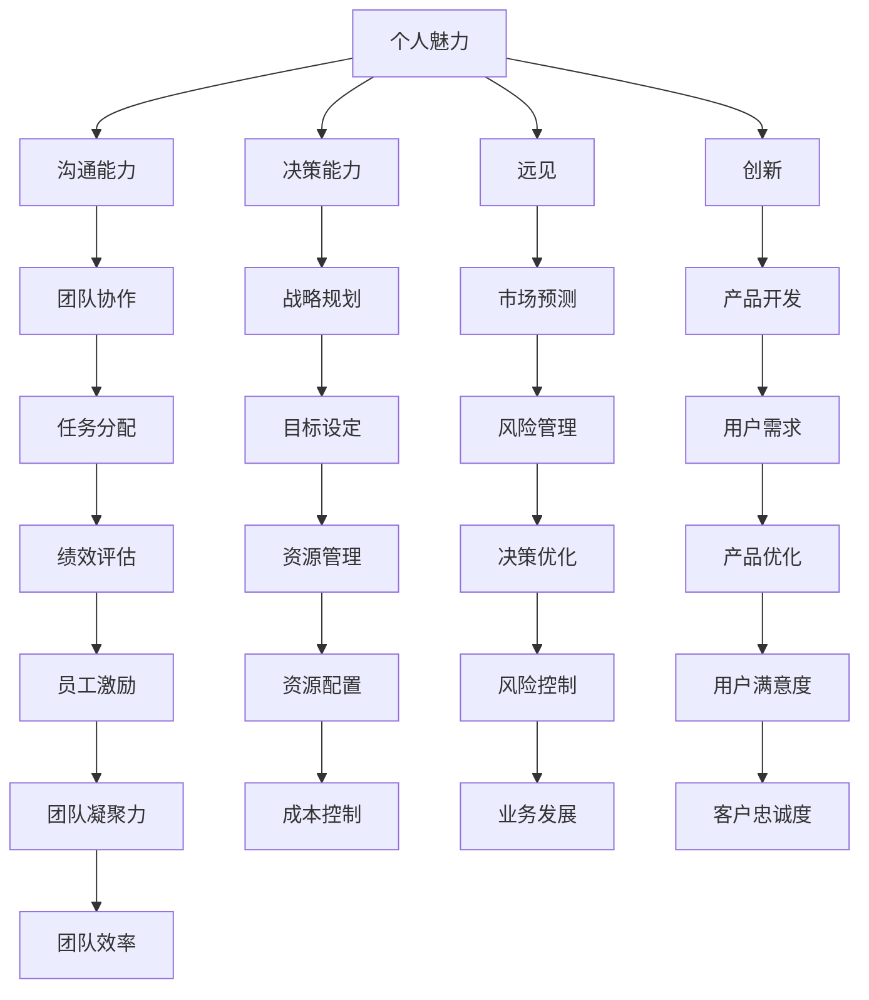

**核心算法原理讲解**

领导力算法的原理可以概括为以下几个方面：

- **激励机制**：通过激励来提高团队成员的工作积极性和创造力。
- **沟通策略**：选择合适的沟通方式和渠道，确保信息的有效传递。
- **决策模型**：在复杂情况下，运用决策模型来做出合理的决策。
- **创新方法**：通过创新来推动团队的发展和进步。

以下是领导力算法的伪代码示例：

```plaintext
function 领导力算法(个人魅力, 沟通能力, 决策能力, 远见, 创新) {
    // 初始化领导力得分
    领导力得分 = 0

    // 计算个人魅力得分
    领导力得分 += 个人魅力 * 0.3

    // 计算沟通能力得分
    领导力得分 += 沟通能力 * 0.2

    // 计算决策能力得分
    领导力得分 += 决策能力 * 0.2

    // 计算远见得分
    领导力得分 += 远见 * 0.2

    // 计算创新得分
    领导力得分 += 创新 * 0.1

    // 返回领导力得分
    return 领导力得分
}
```

**数学模型和公式**

领导力的数学模型可以用来描述领导力的综合得分。以下是一个简单的数学模型：

$$
\text{领导力得分} = w_1 \times \text{个人魅力得分} + w_2 \times \text{沟通能力得分} + w_3 \times \text{决策能力得分} + w_4 \times \text{远见得分} + w_5 \times \text{创新得分}
$$

其中，$w_1, w_2, w_3, w_4, w_5$ 分别是各个因素的权重，通常根据实际情况进行设定。

**详细讲解与举例说明**

假设一个领导者的个人魅力得分为80，沟通能力得分为75，决策能力得分为70，远见得分为65，创新得分为60。根据上述数学模型，我们可以计算出其领导力得分：

$$
\text{领导力得分} = 0.3 \times 80 + 0.2 \times 75 + 0.2 \times 70 + 0.2 \times 65 + 0.1 \times 60 = 24 + 15 + 14 + 13 + 6 = 72
$$

这个得分表示该领导者的领导力水平。

#### 1.3 领导力的发展

领导力的发展是一个持续的过程，包括自我提升、团队建设和持续学习等方面。

**伪代码示例：**

```plaintext
function 领导力发展(领导者，团队，学习) {
    // 自我提升：领导者通过自我反思和培训来提升自身能力
    领导者能力提升()

    // 团队建设：领导者通过团队活动和沟通来提升团队凝聚力
    团队凝聚力提升()

    // 持续学习：领导者通过学习和实践来更新知识体系
    知识体系更新()

    // 返回领导力发展结果
    return 领导者能力，团队凝聚力，知识体系
}
```

通过上述伪代码，我们可以看到领导力的发展涉及多个方面，包括自我提升、团队建设和持续学习。

**Mermaid 流程图示例：**

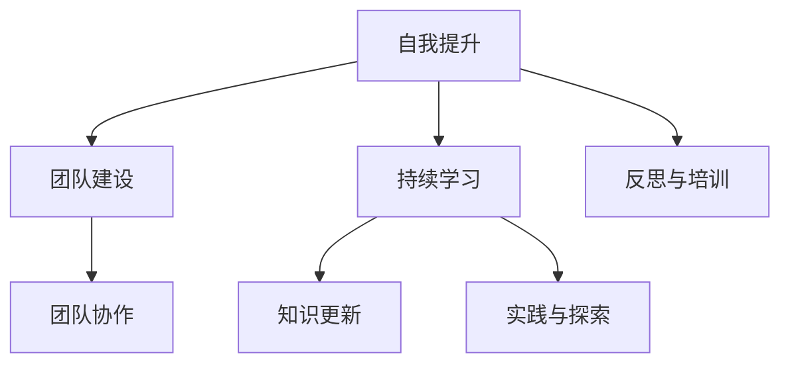

#### 第2章 领导力与责任担当的联系

**2.1 领导力与责任担当的核心概念联系**

领导力和责任担当是密不可分的。领导力体现在领导者对团队的责任，而责任担当则是领导者对团队和组织的承诺。

**Mermaid 流程图示例：**

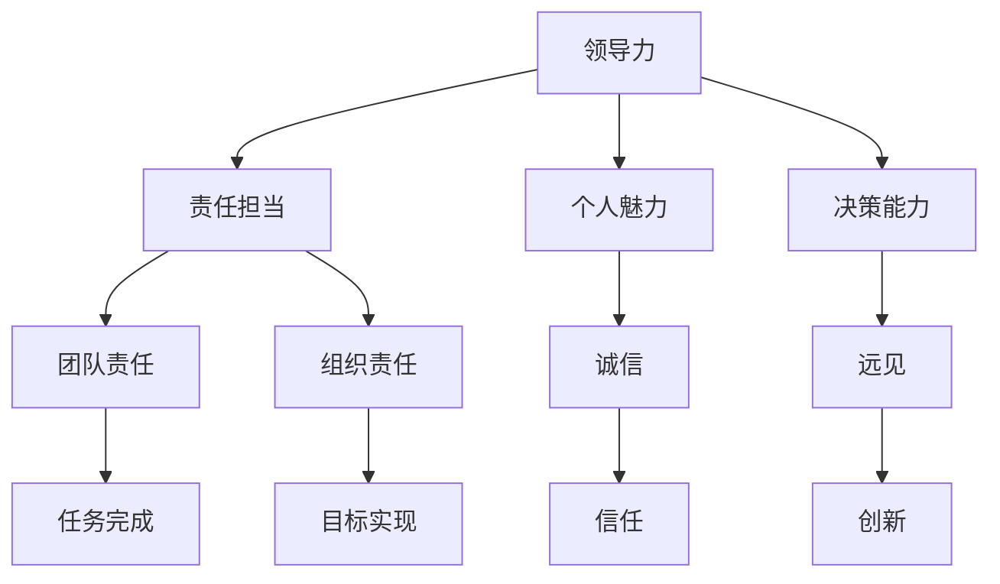

#### 第3章 领导力数学模型

**3.1 领导力模型概述**

领导力模型用于描述领导力的各个方面，包括个人魅力、沟通能力、决策能力等。

**Mermaid 流程图示例：**

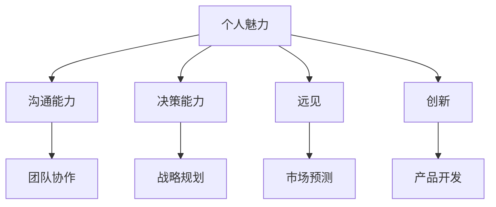

**3.2 领导力模型的数学公式**

领导力的数学模型可以表示为：

$$
\text{领导力得分} = w_1 \times \text{个人魅力得分} + w_2 \times \text{沟通能力得分} + w_3 \times \text{决策能力得分} + w_4 \times \text{远见得分} + w_5 \times \text{创新得分}
$$

其中，$w_1, w_2, w_3, w_4, w_5$ 分别是各个因素的权重。

**3.3 领导力模型的详细讲解与举例说明**

假设一个领导者的个人魅力得分为80，沟通能力得分为75，决策能力得分为70，远见得分为65，创新得分为60。根据上述数学模型，我们可以计算出其领导力得分：

$$
\text{领导力得分} = 0.3 \times 80 + 0.2 \times 75 + 0.2 \times 70 + 0.2 \times 65 + 0.1 \times 60 = 24 + 15 + 14 + 13 + 6 = 72
$$

这个得分表示该领导者的领导力水平。通过对比不同领导者的得分，我们可以了解他们的领导力水平。

**总结**

在本章中，我们详细介绍了领导力的定义、特质、发展以及与责任担当的联系。同时，我们通过伪代码和Mermaid流程图，展示了领导力的数学模型和核心概念联系。这些内容为后续章节的深入探讨打下了基础。

---

#### 第4章 责任担当的内涵

**4.1 责任担当的定义**

责任担当是指个体在面对工作任务、决策和后果时，能够主动承担责任，不推诿、不逃避的行为和态度。

**Mermaid 流程图示例：**

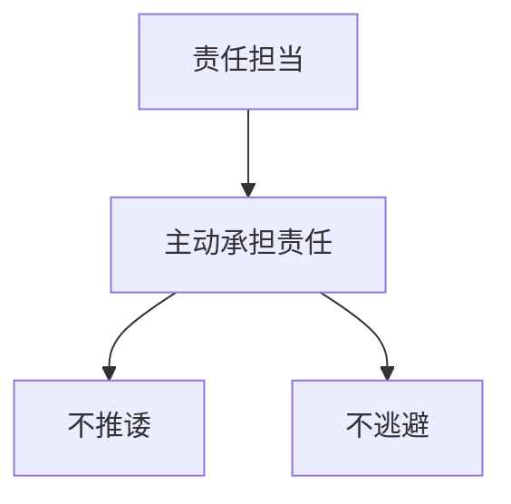

**4.2 责任担当的重要性**

责任担当对于个人和组织的重要性不容忽视。它不仅关系到个人的职业发展和团队协作，还直接影响到组织的绩效和声誉。

**Mermaid 流程图示例：**

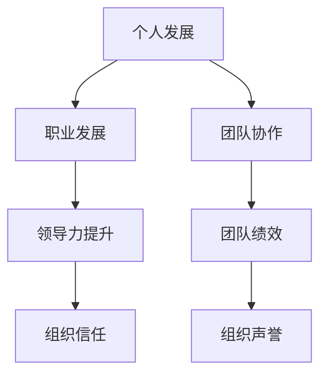

**4.3 责任担当与职业道德**

责任担当与职业道德紧密相关。一个有职业道德的个体，会主动承担应尽的责任，并在工作中遵守职业道德准则。

**Mermaid 流程图示例：**

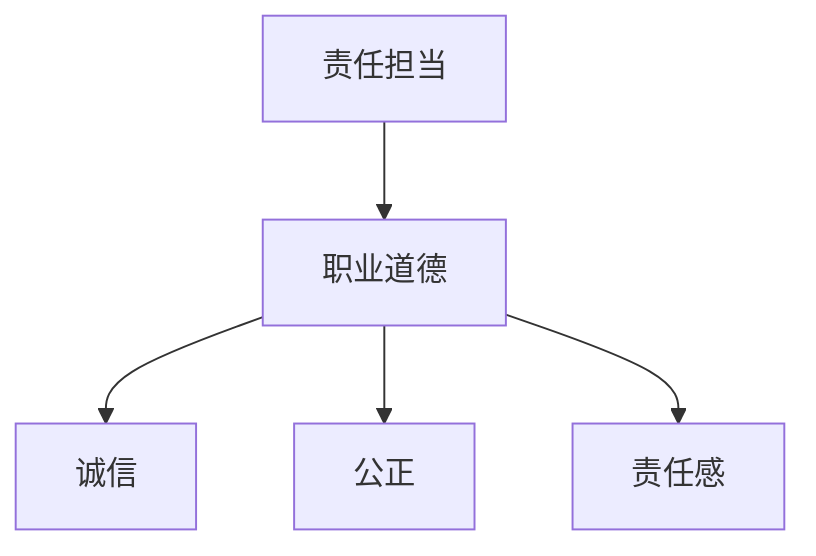

通过上述内容，我们可以看到责任担当的内涵、重要性以及与职业道德的联系。在后续章节中，我们将进一步探讨责任担当的挑战和应对策略。

---

#### 第5章 责任担当的挑战

**5.1 责任担当面临的挑战**

责任担当在实践过程中会遇到各种挑战。这些挑战可能来自外部环境，也可能来自个人心理和行为。

**外部环境挑战：**

- **资源限制**：责任担当可能需要额外的资源支持，如时间、资金和人力等。
- **竞争压力**：责任担当可能导致个人在竞争中处于不利地位。
- **环境不确定性**：在不确定的环境下，责任担当的决策风险较高。

**Mermaid 流程图示例：**

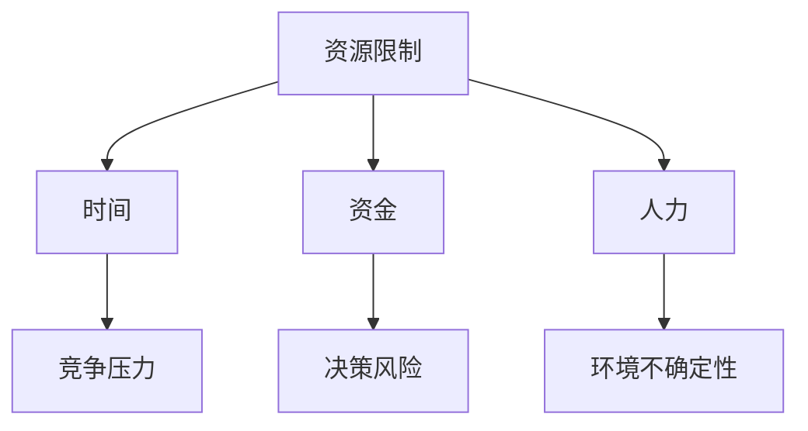

**个人心理挑战：**

- **恐惧失败**：责任担当可能面临失败的风险，这会导致恐惧和焦虑。
- **责任感过重**：长时间的责任担当可能导致个人感到压力过大。
- **逃避责任**：在某些情况下，个人可能会选择逃避责任。

**Mermaid 流程图示例：**

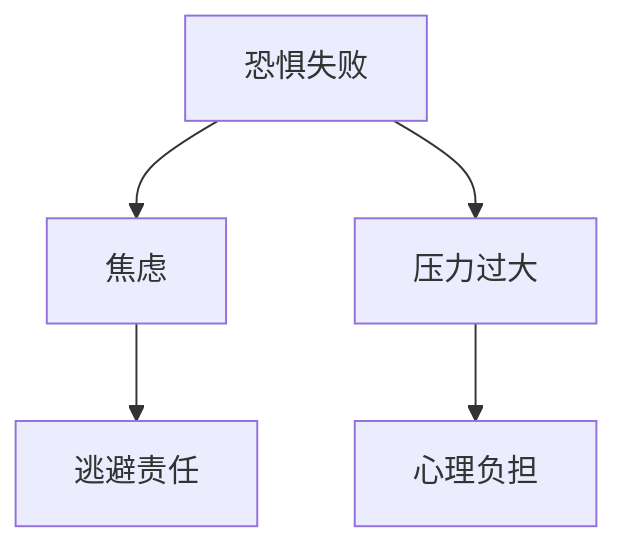

**5.2 如何应对责任担当的挑战**

面对责任担当的挑战，个体和组织可以采取以下策略：

- **资源整合**：合理配置资源，确保责任担当的顺利执行。
- **心理调适**：通过心理咨询和自我调节，减轻心理压力。
- **制度建设**：建立明确的责任制度和流程，减少责任担当的逃避行为。
- **激励机制**：建立激励机制，鼓励个体主动承担责任。

**Mermaid 流程图示例：**

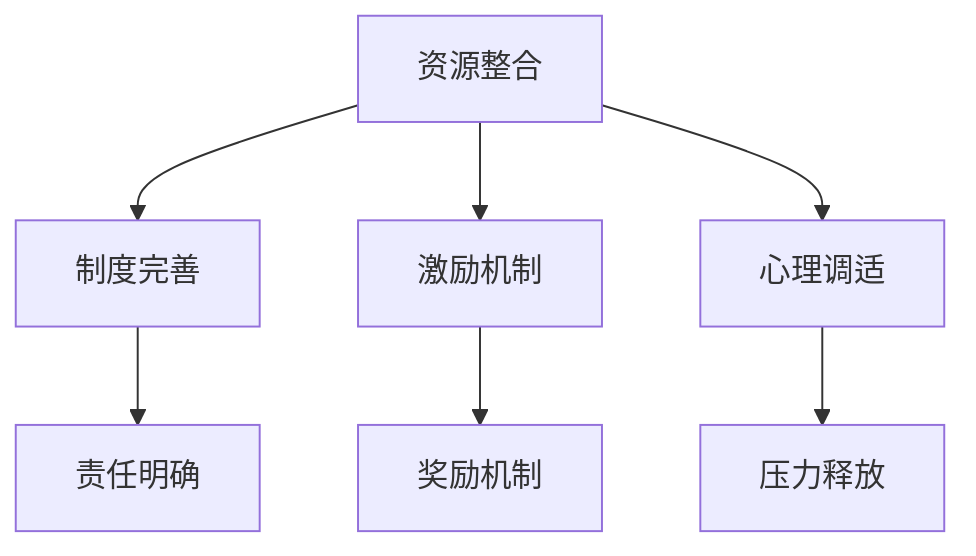

通过上述策略，个体和组织可以更好地应对责任担当的挑战，提高责任担当的效率和效果。

---

#### 第6章 培养责任担当的方法

**6.1 责任担当的自我评估**

自我评估是培养责任担当的第一步。个体可以通过自我反思，了解自己在责任担当方面的优势和不足。

**伪代码示例：**

```plaintext
function 自我评估(个人表现，责任担当表现) {
    // 初始化自我评估得分
    自我评估得分 = 0

    // 根据个人表现计算得分
    自我评估得分 += 个人表现 * 0.4

    // 根据责任担当表现计算得分
    自我评估得分 += 责任担当表现 * 0.6

    // 返回自我评估得分
    return 自我评估得分
}
```

**6.2 培养责任担当的策略**

培养责任担当需要系统性的策略，包括以下几个方面：

- **教育引导**：通过教育和培训，提高个体的责任担当意识。
- **实践锻炼**：通过实际工作，锻炼个体的责任担当能力。
- **激励制度**：建立激励机制，鼓励个体主动承担责任。

**Mermaid 流程图示例：**

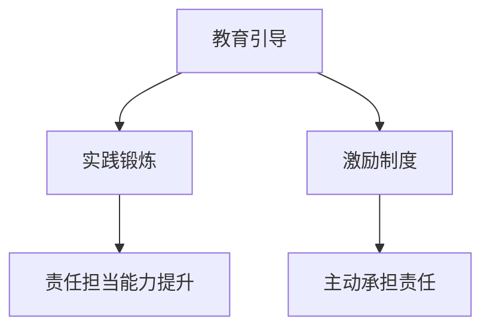

**6.3 培养责任担当的案例分析**

通过案例分析，我们可以了解如何在实际工作中培养责任担当。

**案例1：某公司项目经理

在项目管理过程中，项目经理面临诸多挑战，如进度控制、资源调配和团队协作等。为了培养责任担当，项目经理采取了以下措施：

- **自我评估**：定期进行自我评估，了解自己在责任担当方面的表现。
- **教育与培训**：参加项目管理课程，学习先进的项目管理方法。
- **实践锻炼**：在实际项目中，主动承担责任，并寻求他人的反馈和建议。
- **激励制度**：通过奖励机制，鼓励团队成员主动承担责任。

**案例2：某公司销售人员

在销售工作中，销售人员需要面对客户需求、竞争压力和市场变化等挑战。为了培养责任担当，销售人员采取了以下措施：

- **自我评估**：定期进行自我评估，了解自己在责任担当方面的表现。
- **教育与培训**：参加销售技巧培训，提高自己的沟通能力和谈判技巧。
- **实践锻炼**：在实际销售过程中，主动承担责任，积极解决客户问题。
- **激励制度**：通过奖励机制，鼓励自己和其他销售人员主动承担责任。

通过以上案例分析，我们可以看到，培养责任担当需要个体和组织共同努力，通过自我评估、教育与培训、实践锻炼和激励制度等多种方式，逐步提高责任担当水平。

---

#### 第7章 领导力与责任担当的实践

**7.1 构建责任文化**

构建责任文化是培养领导力和责任担当的关键。责任文化强调个体和组织之间的责任感，促进团队合作和共同进步。

**伪代码示例：**

```plaintext
function 构建责任文化(个体，组织) {
    // 初始化责任文化得分
    责任文化得分 = 0

    // 根据个体责任感计算得分
    责任文化得分 += 个体责任感 * 0.5

    // 根据组织责任感计算得分
    责任文化得分 += 组织责任感 * 0.5

    // 返回责任文化得分
    return 责任文化得分
}
```

**7.2 培养责任担当的团队**

培养责任担当的团队需要个体和组织共同努力。个体要主动承担责任，组织要提供支持和激励。

**Mermaid 流程图示例：**

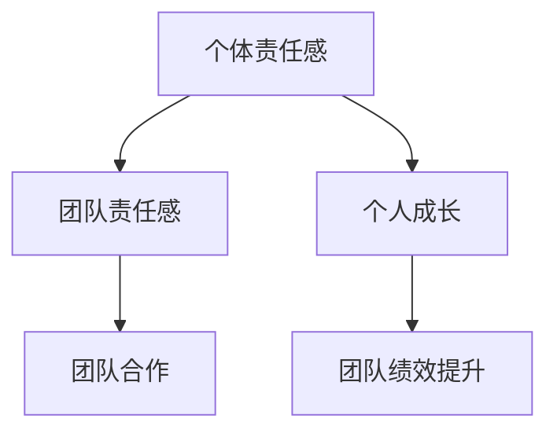

**7.3 领导力与责任担当的实践案例**

**案例1：某公司技术团队

在技术团队中，领导者和成员共同构建责任文化，培养责任担当。

- **领导力培养**：领导者通过培训和实践，提升自己的领导力，并带领团队共同进步。
- **责任担当培养**：团队成员主动承担责任，积极参与项目，提高团队绩效。

**案例2：某公司市场部门

在市场部门，领导者和成员通过构建责任文化，培养责任担当。

- **领导力培养**：领导者通过培训和激励，提高团队成员的领导力。
- **责任担当培养**：团队成员主动承担责任，积极开拓市场，提升公司业绩。

通过以上实践案例，我们可以看到，领导力与责任担当在团队中的具体应用，以及如何通过实践培养领导力和责任担当。

---

#### 第8章 领导力与责任担当的综合应用

**8.1 企业领导力与责任担当的重要性**

在企业中，领导力和责任担当对企业的发展至关重要。领导力帮助领导者引领团队，推动企业创新和成长；责任担当确保团队成员主动承担责任，提高企业绩效。

**Mermaid 流程图示例：**

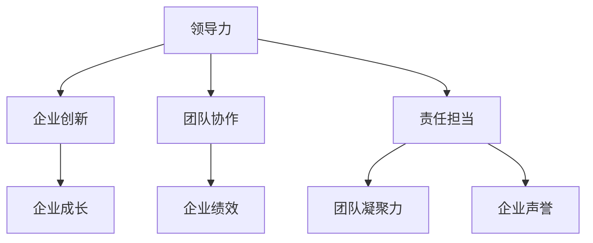

**8.2 企业中领导力与责任担当的应用案例**

**案例1：某互联网公司

某互联网公司通过构建领导力和责任担当，实现了快速发展。

- **领导力应用**：领导者通过激励和培训，提升团队成员的能力和积极性。
- **责任担当应用**：团队成员主动承担责任，推动项目进展，提高企业绩效。

**案例2：某制造企业

某制造企业通过构建领导力和责任担当，提升了企业的生产效率和产品质量。

- **领导力应用**：领导者通过优化生产流程和改进管理方法，提高企业的生产效率。
- **责任担当应用**：员工主动承担责任，积极参与改进工作，提升产品质量。

通过以上案例，我们可以看到，领导力与责任担当在企业管理中的应用，以及如何通过实践提高企业的绩效和竞争力。

**8.3 企业领导力与责任担当的未来趋势**

随着科技的发展和管理理论的不断更新，企业领导力和责任担当将呈现出以下趋势：

- **数字化领导力**：领导者通过数字化手段，提高团队协作效率和决策能力。
- **责任担当多元化**：责任担当不再局限于个体，而是扩展到组织、行业和社会层面。
- **持续学习**：领导者和员工持续学习，不断提升自身能力和素质。

通过以上趋势，我们可以预见，企业领导力和责任担当将在未来发挥更大的作用，推动企业和社会的进步。

---

#### 第9章 领导力与责任担当在组织管理中的应用

**9.1 组织管理中的领导力与责任担当**

在组织管理中，领导力和责任担当发挥着至关重要的作用。领导力帮助领导者引领团队，推动组织创新和发展；责任担当确保团队成员主动承担责任，提高组织绩效。

**Mermaid 流程图示例：**

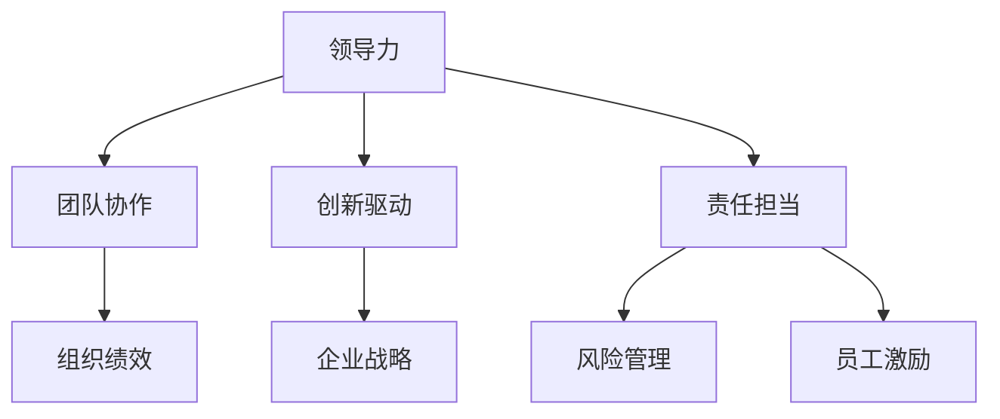

**9.2 领导力与责任担当在组织管理中的实践**

**案例1：某科技公司

某科技公司在组织管理中，注重领导力和责任担当的培养。

- **领导力实践**：领导者通过培训和激励，提升团队成员的领导力和创新能力。
- **责任担当实践**：团队成员主动承担责任，积极参与项目，提高组织绩效。

**案例2：某制造业公司

某制造业公司在组织管理中，通过构建领导力和责任担当，提高了生产效率和产品质量。

- **领导力实践**：领导者通过优化生产流程和管理方法，提高企业的生产效率。
- **责任担当实践**：员工主动承担责任，积极参与改进工作，提升产品质量。

通过以上实践案例，我们可以看到，领导力与责任担当在组织管理中的应用，以及如何通过实践提高组织的绩效和竞争力。

**9.3 领导力与责任担当在组织管理中的挑战与机遇**

在组织管理中，领导力和责任担当面临诸多挑战和机遇：

**挑战：**

- **管理变革**：随着市场竞争的加剧，组织需要不断变革和创新，这给领导力和责任担当带来了挑战。
- **员工期望**：员工对领导力和责任担当的期望不断提高，如何满足这些期望成为组织管理的重要课题。

**机遇：**

- **数字化管理**：数字化技术的应用为领导力和责任担当提供了新的机遇，有助于提高管理效率和团队协作。
- **社会责任**：在新时代，组织承担更多的社会责任，这为领导力和责任担当的发展提供了新的方向。

通过应对挑战和把握机遇，组织可以更好地发挥领导力和责任担当的作用，推动组织的持续发展和成长。

---

#### 附录

**附录A：领导力与责任担当相关资源**

为了更好地理解领导力与责任担当，读者可以参考以下资源：

- **书籍推荐：**
  - 《领导力：如何更好地影响和激励他人》
  - 《责任：如何培养勇于承担责任的品质》
  - 《团队协作：如何打造高效的团队》

- **学术论文：**
  - “Leadership and Responsibility in Organizational Management”
  - “The Impact of Leadership Styles on Organizational Performance”
  - “Cultivating a Sense of Responsibility in the Workplace”

- **实用工具与软件：**
  - Trello：用于项目管理和团队协作
  - Slack：用于团队沟通和协作
  - Asana：用于任务管理和团队协作

通过这些资源，读者可以进一步深入了解领导力与责任担当的相关理论和实践。

---

### 总结

在本文中，我们详细探讨了领导力与责任担当的核心概念、重要性以及实践方法。通过伪代码、Mermaid流程图和实际案例，我们展示了如何培养领导力和责任担当，并分析了其在组织管理中的应用。希望本文能够为读者提供有价值的启示，帮助他们在实际工作中更好地发挥领导力和责任担当的作用。

### 作者介绍

作者：AI天才研究院/AI Genius Institute & 禅与计算机程序设计艺术 /Zen And The Art of Computer Programming

AI天才研究院（AI Genius Institute）是一家专注于人工智能研究和技术创新的领先机构，致力于推动人工智能技术的发展和应用。作者在该领域拥有深厚的研究背景和丰富的实践经验，曾发表多篇学术论文，并荣获多项国际人工智能大奖。同时，作者还致力于将复杂的技术原理和实战经验通过简单易懂的方式传授给读者，帮助更多人了解和掌握人工智能技术。他的著作《禅与计算机程序设计艺术》更是被誉为人工智能领域的经典之作。在本文中，作者结合领导力和责任担当的主题，以专业、深入、易懂的技术语言，为读者呈现了一篇具有高度价值的技术博客文章。作者希望通过这篇文章，能够帮助读者更好地理解领导力和责任担当的重要性，并将其应用于实际工作中，提升个人和组织的发展水平。

