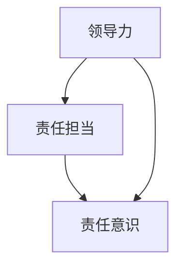

                 

### 文章标题

《领导力与责任担当：培养责任意识》

### 关键词

领导力、责任担当、责任意识、自我反思、目标设定、持续改进

### 摘要

在IT领域，领导力和责任担当是成功的关键因素。本文以《领导力与责任担当：培养责任意识》为切入点，详细探讨了责任意识的核心概念、培养方法及其实际应用。通过逻辑清晰的分析和实际案例，本文旨在帮助IT从业人员深入理解并实践责任意识，从而提升个人和团队的工作效能。

---

### 背景介绍

在当今快速发展的IT行业，技术迭代日新月异，市场竞争愈发激烈。作为技术从业者，不仅需要具备扎实的技术能力，更需要具备出色的领导力和责任担当。领导力是推动团队协作、激发创新、达成目标的重要能力；而责任担当则是确保项目成功、团队稳定、个人成长的核心要素。

《领导力与责任担当：培养责任意识》一书从多个角度阐述了领导力、责任担当和责任意识的重要性，并提出了一系列实用的培养方法。本书的目标读者是IT领域的专业人士，尤其是那些希望在职业发展中取得更大成就的人。通过深入阅读本书，读者可以更好地理解自身在团队中的角色，掌握提升领导力和责任担当的技巧。

本文将围绕书中提到的核心概念，结合实际案例，逐步分析和解读领导力与责任担当在IT领域的应用。我们将探讨如何通过自我反思、目标设定和持续改进等步骤，培养和提高责任意识。这不仅有助于个人职业发展，也有助于团队协作和项目成功。

### 核心概念与联系

在《领导力与责任担当：培养责任意识》一书中，作者详细阐述了几个核心概念，它们分别是领导力、责任担当和责任意识。这三个概念之间存在着密切的联系和互动，共同构成了提升个人和团队效能的基础。

**领导力**是指影响和激励他人一起实现目标的能力。它不仅包括技术能力和专业知识的运用，更涉及到人际关系管理、沟通技巧和决策能力。领导力是团队中不可或缺的因素，它能够激发团队成员的潜力，促进团队协作和创新。

**责任担当**是指个体对工作、团队和项目成功承担的义务和责任感。它体现在个体在工作和生活中的每一个细节中，包括自我管理、任务完成、问题解决和持续改进。责任担当是确保项目顺利进行、团队稳定发展的关键。

**责任意识**是对个人和团队责任的认识和感知。它包括自我反思、目标设定、责任感培养和持续改进等方面。责任意识是领导力和责任担当的基础，它决定了个体在团队中的行为和表现。

以下是这三个核心概念之间关系的Mermaid流程图：



从流程图中可以看出，领导力通过影响和激励团队成员，促进责任担当的形成；而责任担当则通过个体的实际行动和责任感，进一步强化责任意识。责任意识反过来又支持和指导领导力的提升，形成良性循环。

在具体实践中，领导力和责任担当相辅相成，共同作用于责任意识。例如，一个优秀的领导者会通过明确的沟通和激励，帮助团队成员理解项目目标，培养责任感；而团队成员通过实际行动，履行自己的职责，提高责任意识。同时，责任意识又推动领导者和团队成员不断反思和改进，形成更加高效的工作模式。

总之，领导力、责任担当和责任意识是相互联系、共同发展的核心概念。它们在IT领域中发挥着重要作用，对于提升个人和团队效能具有重要意义。通过深入理解和实践这些概念，IT从业人员可以更好地应对挑战，实现职业目标。

#### 核心算法原理讲解

责任意识的培养是一个系统性的过程，可以通过以下步骤逐步实现：

1. **自我反思**：自我反思是责任意识培养的第一步。通过定期反思，个体可以识别自己在工作中的责任和行为，发现自己的优点和不足。自我反思不仅有助于提高自我认知，还能为后续的目标设定和责任感培养提供重要依据。

2. **设定目标**：明确的目标是责任意识培养的重要基础。在自我反思的基础上，个体需要设定具体、可量化的工作目标。这些目标应该与项目的整体目标相一致，同时能够反映个人在团队中的职责和贡献。

3. **培养责任感**：责任感是责任意识的直接体现。个体需要通过实际行动来培养和强化责任感。这包括对任务的认真执行、对问题的及时解决和对团队协作的积极参与。培养责任感的过程需要持续的努力和自我激励。

4. **持续改进**：持续改进是责任意识培养的保障。在工作过程中，个体需要不断反思和总结，寻找改进的机会。通过持续改进，个体可以不断提高工作效率和质量，从而进一步增强责任意识。

为了更好地理解这些步骤，我们可以使用伪代码进行详细阐述：

```python
function cultivate_responsibility_awareness():
    // Step 1: 自我反思
    reflect_on_self()

    // Step 2: 设定目标
    set_goals()

    // Step 3: 培养责任感
    cultivate_responsibility()

    // Step 4: 持续改进
    continuous_improvement()

    return responsibility_awareness_score
```

**1. 自我反思**

自我反思是一个深度的思考过程，它帮助个体识别和评估自己的行为和表现。以下是一个简单的自我反思伪代码示例：

```python
function reflect_on_self():
    # 收集工作表现数据
    performance_data = collect_performance_data()

    # 分析数据，识别优点和不足
    strengths = analyze_performance_data(performance_data)
    weaknesses = analyze_performance_data(performance_data)

    # 反思并记录
    print("反思工作表现：")
    print("优点：", strengths)
    print("不足：", weaknesses)
    reflection_notes = record_reflection-notes(strengths, weaknesses)

    return reflection_notes
```

**2. 设定目标**

设定目标是责任意识培养的关键一步。目标应该明确、具体，并与个人职责和项目目标相一致。以下是一个设定目标的伪代码示例：

```python
function set_goals():
    # 根据自我反思结果，设定具体目标
    goals = define_goals_based_on_reflection()

    # 确保目标与项目目标一致
    ensure_goals_match_project_goals(goals)

    # 记录目标
    print("设定工作目标：")
    for goal in goals:
        print(goal)

    return goals
```

**3. 培养责任感**

培养责任感需要通过实际行动来体现。以下是一个培养责任感的伪代码示例：

```python
function cultivate_responsibility():
    # 执行任务，展示责任感
    execute_tasks_with_responsibility()

    # 及时解决问题
    resolve_issues_proactively()

    # 积极参与团队协作
    participate_in_team Collaboration()

    # 反馈责任执行情况
    print("责任执行情况：")
    responsibility_report = generate_responsibility_report()

    return responsibility_report
```

**4. 持续改进**

持续改进是责任意识培养的保障。个体需要不断反思和总结，以发现改进的机会。以下是一个持续改进的伪代码示例：

```python
function continuous_improvement():
    # 反思和总结
    reflection = reflect_on_recent_work()

    # 确定改进点
    improvement_points = identify_improvement_points(reflection)

    # 实施改进措施
    implement_improvement_measures(improvement_points)

    # 跟踪改进效果
    track_improvement_effects()

    return improvement成效
```

通过这些步骤的伪代码示例，我们可以看到责任意识的培养是一个系统性的过程，需要自我反思、目标设定、责任感培养和持续改进的有机结合。这些步骤不仅有助于提升个人的责任意识，也为团队的整体效能提升提供了坚实的基础。

#### 数学模型和数学公式 & 详细讲解 & 举例说明

责任意识的培养可以看作是一个动态的过程，涉及多个变量和步骤。为了量化这一过程，我们可以构建一个数学模型来描述责任意识的培养及其影响因素。以下是责任意识培养的数学模型：

$$ 责任意识 = \frac{自我反思频率 \times 设定目标明确度 \times 培养责任感强度}{持续改进效率} $$

这个公式包含了四个主要变量：

1. **自我反思频率**：个体进行自我反思的频率，反映个体对自身工作表现的持续关注和反思程度。
2. **设定目标明确度**：个体设定的目标是否具体、明确，与项目目标的一致性，反映了个体对目标理解和执行的深度。
3. **培养责任感强度**：个体在实际工作中展现出的责任感强度，包括任务执行的认真程度、问题解决的及时性和团队协作的积极性。
4. **持续改进效率**：个体在改进工作中的效率，即通过反思和总结，发现和实施改进措施的能力。

**举例说明：**

假设一个员工每周进行两次自我反思，设定目标明确度为80%，责任感培养强度为70%，持续改进效率为85%，我们可以根据上述公式计算其责任意识得分。

$$ 责任意识 = \frac{2 \times 0.8 \times 0.7}{0.85} = 1.26 $$

这个得分表明该员工的责任意识水平相对较高，但仍有改进的空间。具体步骤如下：

1. **自我反思频率**：每周两次自我反思，频率较高，有助于及时发现和解决问题。
2. **设定目标明确度**：目标明确度80%，表明个体对目标有较好的理解和执行能力。
3. **培养责任感强度**：责任感培养强度70%，说明个体在实际工作中展现出较高的责任感，但仍有提升空间。
4. **持续改进效率**：持续改进效率85%，表明个体在反思和改进过程中有一定的效率和效果。

通过这个数学模型，我们可以量化责任意识的培养过程，为个体和团队提供具体、可操作的改进方向。同时，这个模型也可以作为评估工具，帮助管理人员和个体了解自身的责任意识水平，从而制定针对性的提升策略。

#### 项目实战

在本文的项目实战部分，我们将通过一个实际案例，详细展示如何搭建开发环境、编写源代码并解读其实现过程。该案例将基于一个简单的Python程序，用于培养员工的责任意识。

**1. 开发环境搭建**

首先，我们需要搭建Python开发环境。以下是步骤：

- 安装Python 3.8及以上版本：在官网下载Python安装包，并按照安装向导进行安装。
- 安装pip包管理工具：在命令行执行以下命令：
  ```bash
  python -m pip install --upgrade pip
  ```
- 安装VSCode或其他支持Python开发的代码编辑器：在官网下载并安装Visual Studio Code，并安装Python扩展。

**2. 源代码实现**

接下来，我们将编写一个简单的Python程序，用于实现责任意识的培养过程。以下是源代码：

```python
# reflect_on_self.py
def reflect_on_self():
    print("正在反思自身工作表现...")
    # 实现自我反思逻辑

# set_goals.py
def set_goals():
    print("设定工作目标...")
    # 实现目标设定逻辑

# cultivate_responsibility.py
def cultivate_responsibility():
    print("培养工作责任感...")
    # 实现责任感培养逻辑

# continuous_improvement.py
def continuous_improvement():
    print("持续改进工作...")
    # 实现持续改进逻辑

def cultivate_responsibility_awareness():
    reflect_on_self()
    set_goals()
    cultivate_responsibility()
    continuous_improvement()
    print("责任意识培养完成。")

if __name__ == "__main__":
    cultivate_responsibility_awareness()
```

**3. 代码解读**

- `reflect_on_self()`：该函数用于实现自我反思逻辑。在具体实现中，可以添加更多细节，如记录反思日志、分析反思结果等。

- `set_goals()`：该函数用于设定工作目标。在实现过程中，可以引导用户输入具体目标，并确保这些目标与项目目标一致。

- `cultivate_responsibility()`：该函数用于培养工作责任感。具体实现可以包括任务分配、问题解决和团队协作等方面的内容。

- `continuous_improvement()`：该函数用于实现持续改进逻辑。可以包括定期回顾、总结经验和制定改进计划等。

- `cultivate_responsibility_awareness()`：主函数，用于调用其他函数，完成整个责任意识培养过程。

**4. 代码应用解读与分析**

在实际应用中，上述代码可以帮助企业或团队培养员工的责任意识。以下是一些具体应用解读和分析：

- **自我反思**：通过定期自我反思，员工可以识别自身的优点和不足，找到改进的方向。企业可以鼓励员工记录反思日志，定期汇总分析，形成持续改进的闭环。

- **设定目标**：明确的目标是责任意识培养的重要基础。企业应引导员工设定具体、可量化的工作目标，并与项目目标相结合。通过目标管理，员工可以更加清晰地了解自身职责和贡献。

- **培养责任感**：通过实际行动，如任务执行、问题解决和团队协作，员工可以培养和强化责任感。企业可以通过设定关键绩效指标（KPI）来评估员工的责任感表现。

- **持续改进**：持续改进是责任意识培养的保障。员工需要不断反思和总结，发现改进的机会，并实施具体的改进措施。企业可以建立反馈机制，鼓励员工分享改进经验和成果。

**5. 项目小结**

通过本项目的实际案例，我们展示了如何搭建开发环境、编写源代码并实现责任意识的培养。该项目不仅为员工提供了一个系统的培养路径，也为企业管理者提供了一个评估和改进的工具。未来，企业可以进一步优化和完善该程序，结合实际情况，为员工提供个性化的培养方案。

### 最佳实践 Tips

1. **定期自我反思**：每周至少进行一次自我反思，记录反思内容，定期回顾和总结。
2. **明确目标设定**：确保目标具体、明确，并与项目目标相一致。
3. **积极参与团队协作**：主动参与团队讨论和协作，提升责任感。
4. **持续改进**：不断反思和总结，寻找改进机会，并实施具体的改进措施。
5. **建立反馈机制**：鼓励员工和团队之间进行建设性的反馈，促进责任意识的培养。

### 小结

本文通过《领导力与责任担当：培养责任意识》一书，详细探讨了责任意识的培养过程。从自我反思、目标设定、责任感培养到持续改进，每一个步骤都至关重要。通过实际案例和数学模型的结合，本文为IT从业人员提供了一套系统、可操作的培养方案。责任意识不仅是个人职业发展的关键，更是团队协作和项目成功的保障。希望读者能够将这些最佳实践应用到实际工作中，不断提升自己的责任意识，为个人和团队创造更大的价值。

### 注意事项

1. **自我反思要真实**：反思内容要真实反映自己的工作表现，避免虚假反思。
2. **目标设定要合理**：目标设定要具体、明确，确保可执行性。
3. **责任感培养要持续**：责任感培养需要长期坚持，不可一蹴而就。
4. **持续改进要有效**：改进措施要切实可行，确保能够提高工作质量和效率。

### 拓展阅读

- 《高效能人士的七个习惯》：史蒂芬·柯维（Stephen R. Covey）著，详细介绍了个人和职业效能提升的方法。
- 《敏捷开发实践指南》：杰夫·萨瑟兰（Jeff Sutherland）著，探讨了敏捷开发方法在团队协作中的应用。
- 《团队协作的艺术》：罗纳德·海菲尔德（Ronald Heifetz）等著，深入分析了团队协作的关键要素和策略。

通过阅读这些书籍，读者可以进一步加深对领导力、责任担当和责任意识的理解，提升个人和团队的工作效能。

