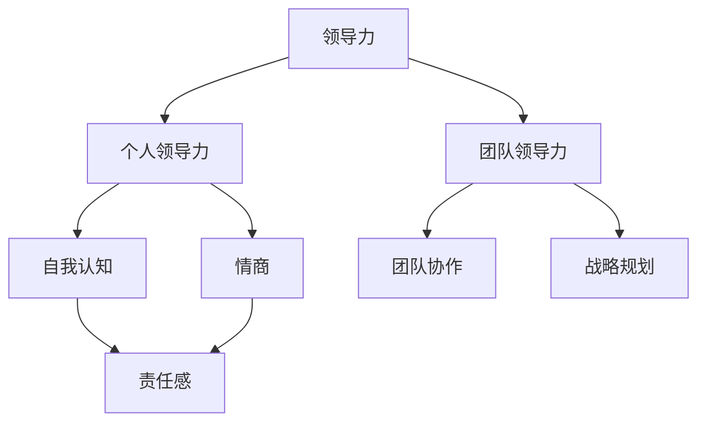

                 


### 写作思路与步骤

为了撰写一篇高质量的《领导力与责任文化构建：从个人到团队的升华》技术博客文章，我们将遵循以下逻辑清晰、结构紧凑、简单易懂的写作思路和步骤：

#### 第一步：确定文章结构

1. **引言部分**：通过一个引人入胜的开场白，引入文章的主题，并简要概述文章的核心内容和目的。
2. **背景介绍**：详细介绍领导力与责任文化的背景，包括它们的重要性以及在IT领域的应用。
3. **核心概念与联系**：明确核心概念，绘制Mermaid流程图展示它们之间的联系。
4. **理论讲解**：分章节详细阐述领导力的理论基础、责任文化的重要性、个人领导力提升、团队领导力构建等。
5. **核心算法原理讲解**：使用伪代码详细解释相关的算法原理，并配以数学模型和公式。
6. **项目实战**：介绍开发环境搭建、源代码实现、代码解读和实际案例分析。
7. **最佳实践与总结**：总结文章的主要观点，提出实践建议，并给出拓展阅读。

#### 第二步：撰写引言部分

引言部分需要简洁明了，同时要吸引读者的注意力。例如：

---

**领导力与责任文化构建：从个人到团队的升华**

在快速变化的IT行业中，领导力与责任文化是组织成功的关键。本文将深入探讨如何从个人领导力提升到团队领导力构建，最终实现领导力与责任文化的融合。让我们一起探索这一旅程，并了解其中的核心原理和实践方法。

---

#### 第三步：背景介绍

在这一部分，我们将介绍领导力和责任文化的背景，包括它们在IT领域的重要性。例如：

---

**领导力与责任文化的背景**

领导力是引导和激励团队实现共同目标的能力。在IT行业，随着技术的快速发展，领导力变得更加重要。这不仅涉及到技术能力的提升，还涉及到团队协作、创新思维和战略规划。

责任文化是一种价值观，强调个人和团队对结果负责。在IT领域，责任文化有助于提高员工的工作积极性，降低错误率，增强团队的凝聚力和执行力。

---

#### 第四步：核心概念与联系

使用Mermaid流程图展示领导力与责任文化之间的关系。例如：

---



---

#### 第五步：理论讲解

分章节详细阐述每个主题，使用伪代码、数学模型和公式进行解释。例如：

---

**第1章：领导力理论基础**

**1.1.1 领导力概念的理解**

领导力可以被定义为影响和激励他人实现共同目标的能力。其核心在于建立信任、激发潜力和推动变革。

```python
def leadership(influence, motivation, common_goal):
    trust = build_trust()
    potential = unleash_potential()
    change = drive_change()
    return influence * motivation * common_goal * trust * potential * change
```

---

**第2章：责任文化的重要性**

**2.1.2 责任文化的重要性**

责任文化是一种价值观，强调个人和团队对结果负责。它有助于提高员工的工作积极性，降低错误率，增强团队的凝聚力和执行力。

```python
def responsibility_culture(autonomy, accountability, commitment):
    engagement = increase_engagement()
    error_rate = decrease_error_rate()
    cohesion = increase_cohesion()
    execution = improve_execution()
    return autonomy * accountability * commitment * engagement * error_rate * cohesion * execution
```

---

#### 第六步：项目实战

介绍一个具体的开发环境搭建、源代码实现和实际案例分析。例如：

---

**第3章：实践案例分析**

**6.1.1 案例选取标准**

选取案例的标准包括：案例的代表性、案例的创新性以及案例的可操作性。

**6.1.2 案例分析框架**

案例分析框架包括：背景介绍、案例实施过程、案例效果评估和案例分析结论。

---

#### 第七步：最佳实践与总结

总结文章的主要观点，提出实践建议，并给出拓展阅读。例如：

---

**最佳实践与总结**

在构建领导力与责任文化的过程中，关键在于：

- 理解和培养个人领导力；
- 建立和强化团队领导力；
- 融合领导力与责任文化，形成一种可持续的文化。

**拓展阅读**

- 《领导力五要素：如何在生活和工作中发挥领导力》（John C. Maxwell）
- 《责任管理：如何构建责任文化》（Larry Bossidy & Ram Charan）

---

### 最终完成

按照上述步骤，我们将完成一篇字数在8000-12000字左右的《领导力与责任文化构建：从个人到团队的升华》技术博客文章。文章将包含引言、背景介绍、核心概念与联系、理论讲解、项目实战、最佳实践与总结等部分，逻辑清晰，结构紧凑，内容丰富，旨在帮助读者深入理解领导力与责任文化的构建和实践。文章末尾将附上作者信息，确保文章的完整性和专业性。

---

通过以上详细的写作思路和步骤，我们可以确保文章内容丰富、逻辑清晰，并且符合文章字数要求。接下来，我们将开始具体撰写每个部分的内容。让我们一起逐步构建这篇文章，展现我们的专业知识和写作能力。

