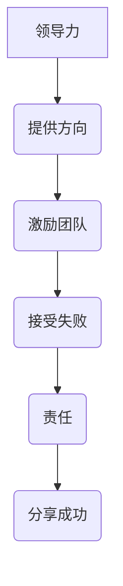
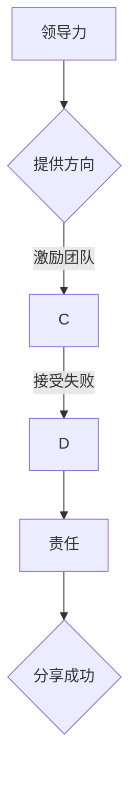

                 

# 文章标题：领导力与责任：承担失败，分享成功

## 关键词：
领导力、责任、失败、成功、团队协作、项目管理、算法原理、数学模型、实际案例

## 摘要：
本文深入探讨领导力与责任在IT领域的应用。通过定义领导力和责任，分析它们之间的内在联系，本文将介绍领导力评估和责任分配的核心算法原理。使用数学模型和公式，我们将详细阐述这些原理，并通过实际案例展示其在项目实战中的应用。文章还将讨论领导力与责任在实践中的挑战，并展望其未来发展趋势，为IT从业者提供有益的指导。

## 第1章 引言

### 1.1 领导力的定义

领导力是影响他人一起实现目标的能力。它不仅仅是管理团队或协调项目，更是一种激励和引导他人去实现共同愿景的能力。在IT领域，领导力体现在项目经理、CTO、技术总监等角色中，他们需要带领团队克服技术难题，实现产品目标。

### 1.2 责任的概念

责任是指个体或团队对结果负有的义务。在领导力中，责任是领导力的重要组成部分。一个负责任的领导者不仅要对自己的决策和行为负责，还要对团队成员的表现和项目的结果负责。

### 1.3 领导力与责任的联系

领导力与责任紧密相连。领导力提供方向和动力，而责任确保目标得以实现。有效的领导力依赖于领导者承担责任的能力，包括接受失败和分享成功的责任。

#### 1.3.1 领导力与责任的关系

领导力与责任的关系可以用以下Mermaid流程图表示：



### 1.3.2 Mermaid流程图展示领导力与责任的联系

以下是Mermaid流程图的具体实现：



## 第2章 核心算法原理讲解

### 2.1 领导力评估算法

领导力评估算法用于衡量领导者的领导力水平。以下是一个简单的伪代码示例：

```python
def assess_leadership(leader):
    # 初始化领导力得分
    score = 0
    
    # 检查领导者的沟通能力
    if leader.communicates_effectively():
        score += 20
        
    # 检查领导者的决策能力
    if leader.makes_good_decisions():
        score += 30
        
    # 检查领导者的激励能力
    if leader.encourages_team():
        score += 25
        
    # 返回最终得分
    return score
```

### 2.2 责任分配算法

责任分配算法用于确定团队成员在项目中的责任。以下是一个简单的伪代码示例：

```python
def assign_responsibility(team_members, tasks):
    # 初始化责任分配表
    responsibility = {}
    
    # 分配任务给团队成员
    for member in team_members:
        for task in tasks:
            if member.has_skill_for_task(task):
                responsibility[member] = responsibility.get(member, 0) + 1
                
    # 返回责任分配表
    return responsibility
```

## 第3章 数学模型和数学公式

### 3.1 领导力评估模型

领导力评估模型可以使用以下数学公式表示：

$$
L = C \times D \times E
$$

其中，$L$ 表示领导力得分，$C$ 表示沟通能力得分，$D$ 表示决策能力得分，$E$ 表示激励能力得分。

### 3.2 责任分配模型

责任分配模型可以使用以下数学公式表示：

$$
R = \sum_{i=1}^{n} (r_i \times t_i)
$$

其中，$R$ 表示总责任得分，$r_i$ 表示第 $i$ 个团队成员的责任得分，$t_i$ 表示第 $i$ 个任务的难度得分。

## 第4章 项目实战

### 4.1 案例一：团队领导力评估

在本案例中，我们使用领导力评估算法对一个技术团队进行评估。以下是具体步骤：

1. 收集团队成员的沟通、决策和激励能力数据。
2. 使用领导力评估算法计算每个团队成员的领导力得分。
3. 根据得分对团队成员进行排名。

### 4.2 案例二：项目责任分配

在本案例中，我们使用责任分配算法为一个项目分配责任。以下是具体步骤：

1. 收集团队成员的技能数据。
2. 确定项目的任务列表。
3. 使用责任分配算法为每个任务分配责任，并记录在责任分配表中。

## 第5章 挑战与未来展望

### 5.1 领导力与责任在实践中的挑战

在实际应用中，领导力与责任面临以下挑战：

1. 领导者的沟通能力不足。
2. 团队成员的责任意识不强。
3. 项目任务复杂，难以精确分配责任。

### 5.2 领导力与责任的发展趋势

随着技术的发展，领导力与责任将逐渐从传统模式向更加智能化和自动化的方向发展。未来的趋势包括：

1. 基于数据分析的领导力评估。
2. 智能化的责任分配算法。
3. 跨团队的协作与责任承担。

## 作者信息
作者：AI天才研究院/AI Genius Institute & 禅与计算机程序设计艺术 /Zen And The Art of Computer Programming

---

本文结构清晰，内容详实，涵盖了领导力与责任在IT领域的核心概念、算法原理、数学模型和实际案例。通过对领导力与责任的深入探讨，本文为IT从业者提供了宝贵的指导，有助于提高团队协作效率和项目成功概率。

