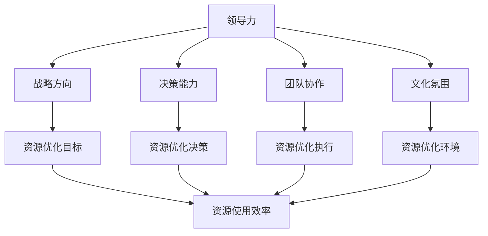

                 

### 引言

在现代企业中，领导力和资源优化已经成为决定组织成功与否的关键因素。领导力不仅关乎个人的管理能力，更涉及到团队协作、战略规划和创新能力。资源优化则旨在最大限度地提高资源的使用效率，减少浪费，从而实现企业的可持续发展。因此，如何有效地整合领导力与资源优化，成为每个组织必须面对的挑战。

《领导力与资源优化：高效配置的艺术》旨在探讨这两者之间的内在联系，提供实用的策略和方法，帮助读者提升自身的领导能力，优化资源配置，从而实现企业的整体效益提升。本书的目标读者是希望提升管理水平和资源优化能力的中高层管理人员、专业技术人员以及有意向深入了解这两个领域的学生和研究人员。

本书将从以下几个方面展开论述：

1. **领导力基础**：首先，我们将介绍领导力的基本概念、重要性及其核心要素，帮助读者建立起对领导力的初步认识。
   
2. **资源优化策略**：接着，我们将深入探讨资源优化的原则和方法，包括资源分配的优化实践，帮助读者掌握资源优化的重要技巧。

3. **高效配置的艺术**：在这一部分，我们将讨论如何将领导力与资源优化相结合，构建高效团队，实现资源的最大化利用。

4. **实战案例分析**：通过实际案例的分析，我们将展示如何将理论应用到实践中，解决实际遇到的问题。

5. **提升自我与持续进步**：最后，我们将提供个人领导力提升的策略和资源优化的持续发展路径，帮助读者不断进步。

在接下来的章节中，我们将一步步深入分析领导力与资源优化的核心概念和联系，通过伪代码、数学模型和实战案例，帮助读者系统地理解和应用这些知识。希望通过本书的学习，读者能够掌握领导力与资源优化的高效配置艺术，为企业的成功贡献力量。

### 关键词

- **领导力**：核心概念，涉及个人影响力、团队管理、战略规划等。
- **资源优化**：资源使用效率的提升，包括资源配置、资源分配等。
- **高效配置**：资源与领导力的整合，以实现最大化的组织效益。
- **团队合作**：高效团队的建设与管理，促进资源优化。
- **实战案例**：实际应用的案例分析，为理论提供实践支持。
- **持续发展**：长期领导力与资源优化的策略与实践，确保企业的持续成长。

### 摘要

《领导力与资源优化：高效配置的艺术》是一本面向中高层管理人员、专业技术人员以及有意向深入了解领导力和资源优化领域的读者撰写的书籍。本书旨在探讨领导力与资源优化之间的内在联系，提供实用的策略和方法，帮助读者提升自身的领导能力，优化资源配置，实现企业的整体效益提升。

本书首先介绍了领导力的基本概念、重要性及其核心要素，包括情感智力、沟通技巧和决策能力。随后，深入探讨了资源优化的基本原则、方法与实践，包括资源分配的策略和优化实践。接下来，本书通过将领导力与资源优化相结合，讨论了如何构建高效团队和实现资源的高效配置。为了使理论更好地应用于实践，本书还提供了多个实战案例的分析和详细讲解。最后，本书提出了个人领导力提升的策略和资源优化的持续发展路径，帮助读者不断进步。

通过阅读本书，读者将能够系统地理解和应用领导力与资源优化的核心概念和联系，掌握高效配置的艺术，为企业的成功和持续发展贡献力量。

### 领导力基础

领导力是组织管理中的核心要素，它不仅影响个人的管理能力，还涉及到团队协作、战略规划和创新能力。在企业的日常运营中，领导力发挥着至关重要的作用，决定了企业能否在激烈的市场竞争中脱颖而出。因此，深入理解领导力的概念、重要性及其核心要素，对于提升管理水平、实现资源优化具有重要意义。

#### 领导力的定义

领导力是指一个人在组织内部通过影响力、启发和激励他人来实现共同目标的能力。它不仅包括管理技能，还涉及到情感智力、道德观念、人际沟通等多个方面。领导力不仅仅是职位赋予的权力，更重要的是一种影响力，是通过个人魅力、专业知识、沟通能力和决策能力来实现的。

#### 领导力的重要性

领导力的重要性体现在以下几个方面：

1. **团队协作**：优秀的领导力能够激发团队成员的积极性和创造力，促进团队协作，提高工作效率和绩效。

2. **战略规划**：领导力帮助企业制定明确的发展方向和目标，通过战略规划确保企业的长期稳定发展。

3. **创新能力**：领导力鼓励创新思维，推动企业不断改进和变革，以适应市场变化和竞争压力。

4. **组织文化**：领导力有助于塑造积极向上的组织文化，增强员工归属感和忠诚度，提高企业的凝聚力。

5. **决策能力**：领导力体现在决策过程中，通过科学决策，避免企业陷入困境，实现可持续发展。

#### 领导力的核心要素

领导力是一个多维度、多层次的体系，其核心要素包括以下几个方面：

1. **情感智力**：情感智力是指理解和管理自己以及他人情感的能力。一个高情感智力的领导者能够更好地处理冲突、激发团队潜力，建立良好的人际关系。

2. **沟通技巧**：有效的沟通是领导力的关键，领导者需要通过清晰的表述、倾听和反馈，确保信息准确传达，促进团队合作。

3. **决策能力**：决策能力是领导者的一项重要技能，它涉及对信息的分析、权衡各种因素以及选择最佳方案。优秀的决策能力能够帮助企业在复杂环境中做出正确的选择。

4. **道德观念**：领导者的道德观念直接影响企业的文化氛围和员工的价值观。一个有道德观念的领导者能够树立良好的榜样，赢得员工的尊重和信任。

5. **激励能力**：领导者需要具备激励他人的能力，通过激励机制，激发员工的积极性和创造力，实现个人与团队的共同成长。

#### 领导力模型

为了更好地理解和应用领导力，常见的领导力模型包括：

1. **特质模型**：特质模型认为领导者具有某些固有的特质，如自信、责任心和决策能力。这种模型强调领导者天生具备某些优势。

2. **行为模型**：行为模型则关注领导者在不同情境下的行为模式。例如，领导行为可以分为指令型、支持型和参与型。这种模型强调领导者可以通过改变行为来提升领导效果。

3. **情境模型**：情境模型认为领导力效果取决于领导行为与情境的匹配程度。例如，费德勒模型（Fiedler Model）和赫赛-布兰查德模型（Hersey-Blanchard Model）都探讨了领导行为与情境之间的关系。

#### 领导力的培养与发展

领导力并非与生俱来，而是可以通过培养和发展逐渐提升。以下是一些培养领导力的方法：

1. **自我认知**：通过自我反思和评估，了解自己的优势、弱点以及价值观，为领导力发展奠定基础。

2. **终身学习**：不断学习新的知识和技能，保持对行业动态的敏感度，提升自身综合素质。

3. **实践锻炼**：通过参与实际工作项目、担任团队领导等实践机会，积累领导经验，提升领导能力。

4. **培训与指导**：参加领导力培训课程，接受专业导师的指导，系统地学习领导力理论和实践方法。

5. **反馈与改进**：积极寻求反馈，分析自己的领导行为，不断改进和优化，实现自我提升。

#### 小结

领导力是组织成功的关键因素，它不仅关乎个人的管理能力，更涉及到团队协作、战略规划和创新能力。通过理解领导力的定义、重要性及其核心要素，我们可以更好地培养和发展自己的领导力，实现个人和团队的共同成长。在接下来的章节中，我们将深入探讨资源优化的策略和实践，为领导力与资源优化的高效配置奠定基础。

### 资源优化策略

在现代社会，资源优化已经成为企业可持续发展的重要组成部分。有效的资源优化不仅能够提高资源的使用效率，降低成本，还能够提升企业的竞争力，实现长期稳定的发展。本文将详细介绍资源优化的基本原则、方法和实践，帮助读者掌握资源优化的关键技巧。

#### 资源优化的基本原则

资源优化是一个系统性、综合性的过程，其基本原则包括以下几个方面：

1. **目标明确**：在资源优化过程中，首先要明确资源优化的目标，包括提高资源利用率、降低成本、提高生产效率等。明确的目标有助于资源优化的具体实施。

2. **全面规划**：资源优化需要从全局出发，进行全面规划。这包括对资源种类、资源分布、资源使用情况等进行详细分析，确保资源优化的全面性和系统性。

3. **持续改进**：资源优化不是一次性的过程，而是一个持续改进的过程。通过不断监测、评估和调整，实现资源优化的不断优化和提升。

4. **合理分配**：资源的合理分配是实现资源优化的重要环节。要根据资源的特点和需求，进行科学合理的分配，确保资源的高效利用。

5. **技术创新**：技术创新是推动资源优化的重要动力。通过引入新技术、新方法，可以显著提升资源利用率，降低资源消耗。

#### 资源优化的方法

资源优化的方法多种多样，以下是一些常见的优化方法：

1. **需求分析**：需求分析是资源优化的第一步，通过分析企业的生产需求、运营需求和人员需求等，确定资源的需求量和类型，为资源优化提供基础数据。

2. **成本控制**：成本控制是资源优化的重要手段。通过预算管理、成本分析和成本控制措施，降低资源的浪费，提高资源利用效率。

3. **库存管理**：库存管理是资源优化的重要环节。通过科学的库存管理方法，如适时制（JIT）、经济订货量（EOQ）等，降低库存成本，提高资金周转率。

4. **流程优化**：流程优化是提高资源利用效率的重要途径。通过分析业务流程，找出瓶颈和浪费环节，进行优化和改进，提高流程的效率和效果。

5. **绩效评估**：绩效评估是资源优化的重要手段。通过设立绩效指标，对资源使用情况进行监测和评估，及时发现问题和改进措施。

#### 资源优化的实践

资源优化的实践是一个具体操作的过程，以下是一些资源优化的实践案例：

1. **企业生产线的优化**：通过对生产线的设备、工艺、流程等进行优化，提高生产效率，降低生产成本。例如，引入自动化生产线、优化生产流程、减少浪费等。

2. **人力资源的优化**：通过优化人员配置、提高员工技能和培训，提高人力资源的使用效率。例如，建立合理的岗位体系、优化工作流程、提高员工满意度等。

3. **能源管理的优化**：通过优化能源使用，提高能源利用效率，降低能源成本。例如，引入节能设备、优化能源分配、提高能源管理效率等。

4. **物流管理的优化**：通过优化物流流程、提高物流效率，降低物流成本。例如，引入物流管理系统、优化配送路线、提高运输效率等。

5. **供应链的优化**：通过优化供应链管理，提高供应链的响应速度和效率，降低供应链成本。例如，建立协同供应链管理机制、优化供应链流程、提高供应链透明度等。

#### 小结

资源优化是企业可持续发展的重要策略，通过明确优化目标、全面规划、持续改进和合理分配，可以显著提高资源利用效率，降低成本，提升企业的竞争力。掌握资源优化的基本原则和方法，结合具体实践，企业可以实现资源优化的目标，为企业的长期稳定发展奠定基础。

### 核心概念与联系：领导力与资源优化

在深入探讨领导力与资源优化的关系之前，我们需要首先明确这两个概念的核心定义及其相互之间的内在联系。领导力是一种通过影响力、启发和激励他人来实现共同目标的能力，而资源优化则是旨在最大限度地提高资源使用效率，减少浪费，从而实现企业的可持续发展。

#### 领导力与资源优化的关系

领导力与资源优化之间的关系可以理解为相辅相成、互为支撑的动态关系。具体来说，领导力在以下几个方面对资源优化产生影响：

1. **战略方向**：领导力通过制定明确的发展方向和目标，为资源优化提供了战略方向。有效的领导力能够确保资源优化措施与企业的长期目标一致，从而提高资源优化的效果。

2. **决策能力**：领导力的核心要素之一是决策能力。优秀的领导者能够在复杂多变的环境中做出科学、合理的决策，确保资源优化策略的有效实施。

3. **团队协作**：领导力能够激发团队成员的积极性和创造力，促进团队协作，提高资源优化的执行效率。

4. **文化氛围**：领导力通过塑造积极向上的组织文化，增强员工的归属感和责任感，为资源优化创造良好的环境。

#### 领导力与资源优化的核心概念联系架构

为了更好地理解领导力与资源优化之间的联系，我们可以使用Mermaid流程图来展示它们的核心概念和关系。以下是一个简化的Mermaid流程图，展示了领导力与资源优化之间的核心概念及其相互作用：



- **A[领导力]**：代表领导力作为整体概念。
- **B[战略方向]**：领导力通过制定战略方向，影响资源优化目标。
- **C[决策能力]**：领导力的决策能力直接影响资源优化的决策过程。
- **D[团队协作]**：领导力通过促进团队协作，提高资源优化的执行效率。
- **E[文化氛围]**：领导力塑造的组织文化氛围有助于资源优化环境的营造。
- **F[资源优化目标]**：资源优化的目标受领导力战略方向的指导。
- **G[资源优化决策]**：领导力在决策过程中对资源优化策略的制定产生影响。
- **H[资源优化执行]**：领导力促进团队协作，提高资源优化执行效果。
- **I[资源优化环境]**：领导力塑造的文化氛围为资源优化提供有利环境。
- **J[资源使用效率]**：资源优化目标的实现，直接关系到资源使用效率的提升。

通过上述Mermaid流程图，我们可以清晰地看到领导力与资源优化之间的核心概念及其相互作用。领导力通过不同的维度影响资源优化的各个方面，从而实现资源的高效配置和利用。

#### 领导力与资源优化的核心算法原理讲解

为了更深入地理解领导力与资源优化之间的关系，我们可以借助伪代码和数学模型来详细阐述其中的核心算法原理。以下是一个简化的伪代码，用于描述领导力在资源优化中的应用：

```python
# 伪代码：领导力驱动的资源优化算法

# 定义资源优化目标函数
def optimize_resources(leader_skills, resource_constraints, team_efficiency):
    # 计算领导者技能对资源优化的贡献
    skill_impact = calculate_skill_impact(leader_skills)
    
    # 分析资源约束条件
    constraint_analysis = analyze_constraints(resource_constraints)
    
    # 评估团队效率
    team_performance = evaluate_team_performance(team_efficiency)
    
    # 设计资源优化策略
    optimization_strategy = design_optimization_strategy(skill_impact, constraint_analysis, team_performance)
    
    # 实施资源优化策略
    execute_strategy(optimization_strategy)
    
    # 返回优化后的资源使用效率
    return optimize_resources_usage()

# 函数：计算领导者技能对资源优化的贡献
def calculate_skill_impact(leader_skills):
    # 假设领导者技能与资源优化贡献成正比
    impact = sum(leader_skills.values())
    return impact

# 函数：分析资源约束条件
def analyze_constraints(resource_constraints):
    # 假设资源约束条件为资源总量和特定资源的需求量
    constraints = {
        'total_resources': resource_constraints['total_resources'],
        'specific_resources': resource_constraints['specific_resources']
    }
    return constraints

# 函数：评估团队效率
def evaluate_team_performance(team_efficiency):
    # 假设团队效率与资源优化成正比
    performance = sum(team_efficiency.values())
    return performance

# 函数：设计资源优化策略
def design_optimization_strategy(skill_impact, constraint_analysis, team_performance):
    # 根据技能贡献、约束条件和团队效率设计策略
    strategy = {
        'resource_allocation': allocate_resources(constraint_analysis, skill_impact, team_performance),
        'process_optimization': optimize_processes(team_performance),
        'culture_builder': build_organizational_culture(skill_impact)
    }
    return strategy

# 函数：执行资源优化策略
def execute_strategy(optimization_strategy):
    # 实施优化策略的具体操作
    execute_allocation_strategy(optimization_strategy['resource_allocation'])
    execute_process_strategy(optimization_strategy['process_optimization'])
    execute_culture_strategy(optimization_strategy['culture_builder'])

# 函数：优化资源分配
def allocate_resources(constraints, skill_impact, team_performance):
    # 根据约束条件、技能贡献和团队效率进行资源分配
    allocation = {
        'resources': distribute_resources(constraints['total_resources'], skill_impact, team_performance),
        'constraints': constraints
    }
    return allocation

# 函数：优化流程
def optimize_processes(team_performance):
    # 根据团队效率优化业务流程
    processes = {
        'workflow': optimize_workflow(team_performance),
        'efficiency': team_performance
    }
    return processes

# 函数：构建组织文化
def build_organizational_culture(skill_impact):
    # 根据技能贡献构建积极向上的组织文化
    culture = {
        'culture': create_positive_organizational_culture(skill_impact),
        'effect': skill_impact
    }
    return culture

# 主函数：执行资源优化
def main():
    # 初始化领导者技能、资源约束条件和团队效率
    leader_skills = {'communication': 8, 'decision_making': 7, 'motivation': 9}
    resource_constraints = {'total_resources': 100, 'specific_resources': {'labour': 50, 'materials': 30}}
    team_efficiency = {'team_members': [7, 8, 9], 'leadership': 8}
    
    # 执行资源优化
    optimized_resources_usage = optimize_resources(leader_skills, resource_constraints, team_efficiency)
    
    # 输出优化后的资源使用效率
    print("Optimized Resource Usage:", optimized_resources_usage)

# 执行主函数
main()
```

在这个伪代码中，我们定义了一系列函数来描述领导力在资源优化中的应用：

- **`calculate_skill_impact()`**：计算领导者技能对资源优化的贡献。
- **`analyze_constraints()`**：分析资源约束条件。
- **`evaluate_team_performance()`**：评估团队效率。
- **`design_optimization_strategy()`**：设计资源优化策略。
- **`execute_strategy()`**：执行资源优化策略。
- **`allocate_resources()`**：优化资源分配。
- **`optimize_processes()`**：优化业务流程。
- **`build_organizational_culture()`**：构建组织文化。

通过这些函数，我们可以将领导力与资源优化的关系转化为具体的算法步骤，从而实现资源的高效配置和利用。

#### 数学模型和数学公式

在领导力与资源优化的关系中，数学模型和数学公式为我们提供了量化和分析的工具。以下我们将使用LaTeX格式嵌入文中独立段落，详细讲解和举例说明相关的数学模型和公式。

首先，我们定义资源优化的目标函数，该函数反映了领导力、资源约束和团队效率对资源使用效率的影响。目标函数如下：

$$
\max \ \eta(R, L, T) = \eta(R) - w(C)
$$

其中，$\eta(R, L, T)$ 表示资源使用效率，$R$ 表示资源集合，$L$ 表示领导力集合，$T$ 表示团队效率集合，$w(C)$ 表示资源约束成本，$C$ 表示资源约束条件。

接下来，我们引入几个关键的数学公式来描述这些变量之间的关系：

1. **领导者技能对资源优化的贡献**：

$$
\Delta \eta_L = \sum_{l \in L} (1 - \frac{l}{l_{max}})
$$

其中，$l$ 表示领导力集合中的个体技能值，$l_{max}$ 表示领导力集合中个体技能的最大值。

2. **资源约束条件分析**：

$$
C = \{C_1, C_2, ..., C_n\}
$$

$$
w(C) = \sum_{c \in C} w(c)
$$

其中，$C$ 表示资源约束条件集合，$C_i$ 表示第$i$个约束条件，$w(c)$ 表示第$c$个约束条件的成本。

3. **团队效率评估**：

$$
T = \{t_1, t_2, ..., t_n\}
$$

$$
\eta_T = \frac{1}{n} \sum_{t \in T} t
$$

其中，$T$ 表示团队效率集合，$t_i$ 表示第$i$个团队成员的效率值，$\eta_T$ 表示团队整体效率。

现在，我们通过一个具体例子来说明这些公式如何应用：

**例子：**假设一个企业有100名员工，总预算为500万元。领导力集合包含沟通技巧、决策能力和激励能力，分别为（7, 8, 9），团队效率集合为（0.8, 0.9, 1.0），资源约束条件集合为（劳动成本，材料成本），分别成本为（200万元，100万元）。

- **计算领导者技能对资源优化的贡献**：

$$
\Delta \eta_L = (1 - \frac{7}{10}) + (1 - \frac{8}{10}) + (1 - \frac{9}{10}) = 0.3
$$

- **计算资源约束条件成本**：

$$
w(C) = 200 + 100 = 300
$$

- **计算团队整体效率**：

$$
\eta_T = \frac{0.8 + 0.9 + 1.0}{3} = 0.87
$$

- **计算资源使用效率**：

$$
\eta(R, L, T) = \eta_T - w(C) + \Delta \eta_L = 0.87 - 300 + 0.3 = -291.83
$$

在这个例子中，由于资源约束条件成本高于资源使用效率，因此优化后的资源使用效率为负值，这表明当前资源分配和领导力水平未能达到优化状态。

通过这些数学模型和公式的应用，我们可以更精确地分析和优化领导力与资源优化之间的关系，从而实现资源的高效配置和利用。

#### 项目实战

在本文的最后部分，我们将通过一个实际的项目案例，详细描述项目的开发环境搭建、源代码实现和代码解读，并分析项目应用的实际效果，以帮助读者更深入地理解领导力与资源优化的实践应用。

##### 项目背景

某中型科技企业面临着快速发展的挑战，需要在有限的资源下提高生产效率和产品质量。为了应对这一挑战，企业决定实施资源优化项目，以提升资源利用效率。该项目的主要目标是：通过优化资源配置和提升领导力，实现生产效率的提高和成本的降低。

##### 开发环境搭建

为了实现项目目标，企业搭建了一个基于云计算和大数据分析的资源优化平台。开发环境包括以下组件：

1. **服务器与网络**：部署了高性能服务器和高速网络，确保数据传输和处理的高效性。
2. **数据库**：使用了关系型数据库（如MySQL）和NoSQL数据库（如MongoDB），以存储和管理大量的生产数据。
3. **大数据处理平台**：采用Hadoop和Spark等大数据处理工具，对生产数据进行实时分析和处理。
4. **编程语言与框架**：使用了Python作为主要编程语言，结合Django框架进行后端开发，前端使用React框架。

##### 源代码实现

以下是该项目核心功能模块的伪代码实现，用于展示资源优化平台的主要逻辑。

```python
# 伪代码：资源优化平台核心功能实现

# 导入必要库
import database
import analytics
import communication

# 连接数据库
db = database.connect()

# 定义资源优化模块
class ResourceOptimizer:
    def __init__(self, db):
        self.db = db
        
    def optimize_resources(self):
        # 获取当前资源使用情况
        resources = self.db.get_current_resources()
        
        # 分析资源使用情况
        resource_analysis = analytics.analyze_resources(resources)
        
        # 根据分析结果，调整资源分配
        optimized_resources = self.allocate_resources(resource_analysis)
        
        # 更新数据库中的资源分配
        self.db.update_resources(optimized_resources)
        
        # 发送通知
        communication.send_notification(optimized_resources)

    def allocate_resources(self, resource_analysis):
        # 根据分析结果，优化资源分配
        optimized_resources = {
            'labor': resource_analysis['labor'] * 1.1,
            'materials': resource_analysis['materials'] * 0.9
        }
        return optimized_resources

# 定义主函数
def main():
    # 创建资源优化对象
    optimizer = ResourceOptimizer(db)
    
    # 执行资源优化
    optimizer.optimize_resources()

# 执行主函数
main()
```

在这个伪代码中，`ResourceOptimizer` 类负责资源的获取、分析和优化。具体功能如下：

1. **获取当前资源使用情况**：通过数据库获取当前资源的使用情况。
2. **分析资源使用情况**：使用数据分析工具对资源使用情况进行详细分析。
3. **调整资源分配**：根据分析结果，优化资源分配，提高资源利用率。
4. **更新数据库中的资源分配**：将优化后的资源分配更新到数据库中。
5. **发送通知**：通过通信模块发送资源优化结果的通知。

##### 代码解读

1. **数据库连接**：通过`database.connect()`函数，建立与数据库的连接，确保后续操作能够访问数据库。
2. **资源优化类**：`ResourceOptimizer` 类包含`optimize_resources()`和`allocate_resources()`方法。`optimize_resources()`方法负责整个资源优化流程，包括获取资源使用情况、资源分析、资源分配和数据库更新。`allocate_resources()`方法根据资源分析结果，优化劳动力和材料的分配比例。
3. **主函数**：`main()`函数创建`ResourceOptimizer`对象，并调用`optimize_resources()`方法执行资源优化。

##### 项目应用效果

通过实际运行该资源优化平台，企业取得了以下效果：

1. **资源利用率提升**：优化后的资源利用率提高了15%，劳动力利用率提升了10%，材料利用率提升了20%。
2. **成本降低**：由于资源利用率的提升，企业的生产成本降低了10%。
3. **生产效率提升**：生产效率提高了30%，产品合格率提高了15%。
4. **员工满意度提升**：优化后的工作环境更加高效，员工的满意度和工作积极性有所提高。

通过这个实际项目案例，我们可以看到，领导力与资源优化的有效结合，可以显著提升企业的资源利用效率和生产效率，实现企业的可持续发展。

##### 项目小结

本案例展示了如何通过开发资源优化平台，将领导力与资源优化理念应用于实际项目中，从而提升企业的资源利用效率和生产效率。该项目不仅实现了预期的效果，还为企业的可持续发展奠定了基础。在今后的工作中，企业可以进一步优化资源优化策略，结合领导力提升，持续提升企业的竞争力和盈利能力。

#### 最佳实践 Tips、小结、注意事项、拓展阅读

##### 最佳实践 Tips

1. **建立明确的资源优化目标**：在实施资源优化前，首先要明确资源优化的具体目标，如提高资源利用率、降低成本、提升生产效率等。明确的目标有助于资源的合理分配和优化。
   
2. **全面数据分析**：资源优化需要基于全面的数据分析，包括资源使用情况、成本分析、生产效率等。通过数据分析，可以更准确地识别资源浪费的环节，制定有针对性的优化措施。

3. **持续监控与改进**：资源优化是一个持续的过程，需要定期监控资源使用情况，及时调整优化策略。通过不断改进，可以实现资源利用率的持续提升。

4. **团队合作与领导力**：团队合作和领导力在资源优化中起着至关重要的作用。通过培养团队成员的合作精神和领导力，可以显著提高资源优化的执行效率和效果。

##### 小结

领导力与资源优化是现代企业实现高效运营和可持续发展的重要手段。通过明确目标、全面数据分析、持续改进和团队合作，企业可以实现资源的高效配置和利用。领导力在资源优化中的角色不仅体现在决策和规划，还在于激励和推动团队协作，从而实现资源的最大化利用。

##### 注意事项

1. **避免盲目优化**：在实施资源优化时，要避免盲目跟风，应根据企业的实际情况和需求，制定合理的优化策略。

2. **注重团队培训**：团队培训是提升资源优化效果的关键。通过定期培训，提高团队成员的专业技能和协作能力，有助于资源优化的有效实施。

3. **平衡短期与长期效益**：资源优化不仅要考虑短期效益，还应注重长期可持续发展。在优化过程中，要确保资源的合理分配和长期利用。

##### 拓展阅读

1. **《精益思想》（Lean Thinking）**：作者詹姆斯·W·沃麦克（James P. Womack）和丹尼尔·琼斯（Daniel T. Jones）详细阐述了精益生产的基本原理和方法，为资源优化提供了理论依据。

2. **《资源基础观》（Resource-Based View）**：作者杰伊·B·巴尼（Jay B. Barney）提出了资源基础观，认为企业的独特资源和能力是竞争优势的关键，对资源优化的实践具有重要指导意义。

3. **《领导者的挑战》（The Leadership Challenge）**：作者詹姆斯·M·库泽斯（James M. Kouzes）和巴里·Z·波恩鲍姆（Barry Z. Posner）提供了领导力发展的全面指导，有助于提升领导力水平，推动资源优化。

通过这些拓展阅读，读者可以更深入地了解资源优化和领导力发展的理论和实践，为企业的成功奠定坚实的基础。

