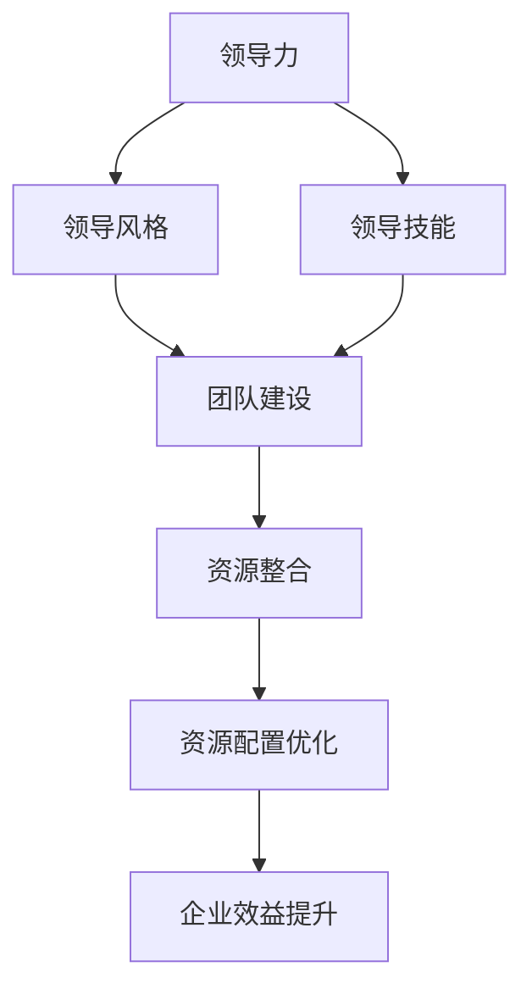

                 

### 文章标题

《领导力与资源整合：优化资源配置》

### 关键词

领导力，资源整合，资源配置优化，算法，数学模型，项目管理，实践案例

### 摘要

本文旨在探讨领导力在资源整合和优化资源配置中的作用，通过深入分析领导力与资源整合之间的核心联系，以及资源优化配置的算法原理和实际应用案例，为企业管理者提供实用的指导策略。文章首先介绍了领导力的基本概念和重要性，接着阐述了资源整合的基本原理和策略。随后，文章重点讲解了资源配置优化中的关键算法原理，并通过具体案例展示了这些算法在实际项目中的应用。最后，文章总结了最佳实践，提出了注意事项和拓展阅读建议，帮助读者更好地理解和运用领导力与资源整合的理念。通过本文的阅读，读者将能够更好地掌握优化资源配置的方法和技巧，提升企业的管理水平和竞争力。 

----------------------------------------------------------------

## 引言

在当今复杂多变的市场环境中，企业和组织面临着诸多挑战，如何在有限资源下实现最大化的价值创造成为关键议题。资源整合与优化资源配置成为企业战略中的重要组成部分，而领导力在其中起到了至关重要的作用。本文旨在探讨领导力与资源整合之间的紧密联系，以及如何通过优化资源配置提升企业竞争力。

### 背景介绍

随着全球经济一体化的加深，市场竞争日益激烈，企业不仅要在产品质量、技术创新和服务水平上不断提升，还需要在资源整合与优化上寻求突破。资源整合指的是企业通过合理配置和利用内外部资源，实现资源的最佳组合和协同效应。优化资源配置则是在资源有限的情况下，通过科学的决策和有效的管理，使得资源利用率达到最大化，从而提高企业的整体效益。

### 领导力的重要性

领导力是资源整合与优化资源配置的核心驱动力。一个成功的领导者不仅能够激发团队成员的潜力，还能够有效地协调和整合企业内外部的资源，推动企业实现战略目标。领导力不仅涉及个人素质和能力的提升，更是一个系统性工程，包括领导风格、领导技能、团队建设等多个方面。

### 核心概念与联系

要深入探讨领导力与资源整合之间的联系，我们需要明确以下几个核心概念：

1. **领导力**：指领导者通过影响、激励和指导他人来实现共同目标的能力。它包括个人素质、领导风格、领导技能等多个方面。
   
2. **资源整合**：指企业通过内部资源与外部资源的有效整合，形成优势互补，提高整体效能的过程。

3. **资源配置优化**：指在资源有限的情况下，通过科学的决策和管理，实现资源的最优配置，提高资源利用率。

这些概念之间的联系可以用以下Mermaid流程图来表示：



通过这个流程图，我们可以看到领导力通过影响领导风格和技能，进而影响团队建设，最终实现资源整合和资源配置优化，从而提升企业效益。

### 为什么要研究领导力与资源整合的关系？

领导力与资源整合的关系研究具有重要的现实意义：

1. **提升企业竞争力**：通过优化资源配置，企业可以在激烈的市场竞争中占据有利地位。

2. **促进创新与变革**：领导力可以激发团队成员的创新意识，推动企业持续变革。

3. **提高资源利用率**：科学的资源配置优化能够提高资源利用率，降低运营成本。

4. **实现可持续发展**：通过合理的资源整合与优化，企业可以实现长期稳定发展。

本文将围绕以上核心概念和联系，逐步探讨领导力在资源整合与优化资源配置中的作用，提供实用的策略和方法，帮助读者理解和运用这些理念，提升企业的管理水平和竞争力。在接下来的章节中，我们将首先深入探讨领导力的基本概念和重要性，为后续内容打下坚实的基础。 

----------------------------------------------------------------

## 第一章：领导力基础

### 1.1 领导力的定义与重要性

领导力是一个广泛且复杂的概念，它在不同的组织和文化背景下有着不同的解释和应用。简单来说，领导力是指领导者通过影响、激励和指导他人来实现共同目标的能力。这种能力不仅涉及个人素质，如诚信、正直、自信等，还涵盖领导风格、领导技能和团队建设等方面。

#### 1.1.1 领导力的定义

领导力是一种复杂的社会现象，其定义有多种，常见的有以下几种：

- **特质理论**：认为领导者具有特定的个人特质，如聪明、自信、果断等。
- **行为理论**：关注领导者的行为方式，认为领导力是通过特定行为表现出来的。
- **情境理论**：认为领导力取决于领导者和情境的相互作用，强调领导力是动态变化的。

#### 1.1.2 领导力的重要性

领导力在企业中扮演着至关重要的角色。以下是领导力的重要性体现在几个关键方面：

1. **战略决策**：领导者负责制定企业的战略目标和规划，这些决策直接影响企业的未来发展。

2. **团队协作**：领导力能够激发团队成员的潜力，促进协作和沟通，提高团队的整体效能。

3. **文化塑造**：领导力塑造企业文化，影响员工的态度和行为，形成积极向上的工作氛围。

4. **创新能力**：领导者的激励和指导可以激发员工的创新意识，推动企业持续创新。

5. **危机管理**：在面对挑战和危机时，领导者的决策和行动能力至关重要，能够帮助企业渡过难关。

#### 1.1.3 领导力的核心要素

为了更好地理解领导力，我们可以将其核心要素分为以下几个方面：

1. **个人素质**：包括诚信、正直、自信、自律等，这些素质是领导者赢得员工信任和尊重的基础。

2. **领导风格**：包括权威型、民主型、参与型等，不同的领导风格适用于不同的情境和团队。

3. **领导技能**：包括沟通技巧、决策能力、问题解决能力、激励员工的能力等。

4. **团队建设**：建立高效的团队，培养团队成员的协作精神，提高团队的执行力。

#### 1.1.4 领导力的培养

领导力不是天生的，而是可以通过培养和实践不断提升的。以下是几种常见的领导力培养方法：

1. **自我反思**：通过反思自己的行为和决策，发现自己的优势和不足，不断改进。

2. **学习与实践**：通过学习领导力理论和实际案例，结合实践不断提升领导技能。

3. **培训与辅导**：参加领导力培训课程，获取专业的指导和反馈，加快成长速度。

4. **角色扮演**：通过模拟不同的领导情境，提高应对各种挑战的能力。

### 总结

领导力是企业成功的关键因素之一。理解领导力的定义和重要性，掌握领导力的核心要素和培养方法，对于企业管理者和资源整合专家来说至关重要。在接下来的章节中，我们将进一步探讨资源整合的基本原理和策略，以及领导力与资源整合之间的紧密联系。通过这些探讨，读者将能够更好地理解和运用领导力与资源整合的理念，提升企业的管理水平和竞争力。 

----------------------------------------------------------------

## 第二章：资源整合原理

### 2.1 资源的概念与分类

资源是企业在运营过程中必不可少的要素，有效的资源整合是提高企业效率和竞争力的关键。在探讨资源整合原理之前，我们首先需要明确资源的基本概念和分类。

#### 2.1.1 资源的定义

资源可以定义为任何有助于企业实现其目标的有形或无形的要素。有形资源包括物质资源，如资金、设备、原材料等；无形的资源则包括信息、知识、人力资源等。

#### 2.1.2 资源的分类

根据资源的存在形态和属性，我们可以将资源分为以下几类：

1. **物质资源**：包括企业的资金、设备、原材料、土地等，是生产和服务活动的基础。

2. **人力资源**：指企业的员工，包括管理人才、技术人才、普通员工等，是企业最重要的资源之一。

3. **信息资源**：包括企业的内部和外部信息，如市场数据、技术资料、客户反馈等，是决策和创新的依据。

4. **知识资源**：指企业积累的专利、技术秘密、商业机密等，是企业的核心竞争力。

5. **社会资本**：指企业与外部合作伙伴、政府机构、客户等建立的关系网络，有助于企业获取资源和支持。

#### 2.1.3 资源整合的意义

资源整合的意义在于通过有效配置和利用企业内外部的资源，实现资源的最大化效用，从而提升企业的整体竞争力。具体来说，资源整合具有以下几个方面的意义：

1. **提高资源利用率**：通过资源整合，企业可以实现资源的优化配置，避免资源浪费，提高资源利用率。

2. **降低成本**：合理的资源整合可以减少生产成本和管理成本，提高企业的经济效益。

3. **增强竞争力**：资源整合有助于企业形成核心竞争力，提升在市场中的竞争力。

4. **促进创新**：资源整合可以促进企业内部的知识共享和交流，激发创新思维，推动企业的持续创新。

#### 2.1.4 资源整合的基本原则

为了实现有效的资源整合，企业在进行资源整合时需要遵循以下几个基本原则：

1. **协同性**：资源整合要考虑到各类资源的相互依赖和协同作用，实现资源的最优配置。

2. **系统性**：资源整合是一个系统性工程，需要从整体角度出发，统筹规划，分步实施。

3. **灵活性**：资源整合要具备一定的灵活性，能够根据市场变化和企业战略调整资源配置。

4. **高效性**：资源整合要追求高效性，提高资源利用效率，实现资源的最优配置。

### 2.2 资源整合的理论基础

资源整合的理论基础主要涵盖以下几方面：

1. **资源依赖理论**：认为企业是一个开放的系统，其运营和发展需要依赖外部资源。资源整合就是通过建立和维护良好的外部资源网络，实现企业资源的优化配置。

2. **资源基础理论**：强调企业竞争优势来源于其拥有的独特资源，资源整合就是通过整合内部和外部资源，形成企业的核心竞争力。

3. **能力构建理论**：认为企业通过整合资源，构建和提升自身的能力，实现持续竞争优势。

### 2.3 资源整合的策略与技巧

为了实现有效的资源整合，企业可以采用以下策略和技巧：

1. **内部资源整合**：通过内部资源优化配置，提高资源利用效率，如整合内部人力资源、技术资源等。

2. **外部资源整合**：通过建立和维护良好的外部资源网络，获取外部资源支持，如与供应商、客户、合作伙伴等建立合作关系。

3. **战略联盟**：通过与其他企业建立战略联盟，实现资源的互补和共享，提高整体竞争力。

4. **外包**：将非核心业务外包给专业公司，专注于核心业务的优化，提高资源利用效率。

5. **知识管理**：通过知识共享和交流，构建企业的知识管理体系，提高企业的创新能力。

#### 2.3.1 案例分析

以下是一个资源整合的案例分析：

**案例：某家电制造企业**

- **问题**：企业内部生产设备老旧，技术更新缓慢，产品质量不稳定。
- **解决方案**：企业通过引入外部先进技术，更新生产设备；与高校和科研机构建立合作关系，获取技术支持和创新资源；通过员工培训和引进高层次人才，提升企业技术能力。
- **效果**：企业生产效率提高，产品质量提升，市场份额扩大，实现了可持续发展。

### 2.4 资源整合中的挑战与应对

在资源整合过程中，企业可能会面临以下挑战：

1. **资源冲突**：不同部门或团队之间的资源争夺和利益冲突。
2. **资源冗余**：资源重复配置，导致资源浪费。
3. **信息不对称**：企业内部信息不畅，影响资源整合的效率。
4. **企业文化差异**：企业整合外部资源时，可能会面临企业文化差异的挑战。

应对这些挑战的方法包括：

1. **建立统一的资源管理体系**：明确资源管理的目标和规则，避免资源冲突。
2. **加强信息共享**：建立信息共享平台，提高信息透明度。
3. **建立多元化的企业文化**：通过文化融合，降低文化差异带来的冲突。

### 总结

资源整合是提升企业竞争力的重要手段。理解资源的基本概念和分类，掌握资源整合的理论基础和策略技巧，对于企业管理和资源整合专家来说至关重要。在接下来的章节中，我们将进一步探讨资源配置优化的算法原理和实际应用案例，帮助读者深入理解资源整合的核心技术和方法。通过这些探讨，读者将能够更好地运用资源整合的理念，实现企业资源的优化配置，提升企业的管理水平和竞争力。 

----------------------------------------------------------------

### 2.3 资源整合的策略与技巧

在资源整合的过程中，企业需要采取一系列策略和技巧，以实现资源的最大化效用。以下是几种常见的资源整合策略和技巧：

#### 2.3.1 内部资源整合

**1. 人力资源管理**：通过优化员工招聘、培训和绩效考核，提高人力资源的利用效率。例如，企业可以采用内部晋升制度，激励员工提升自身能力，减少培训成本。

**2. 物流管理**：通过优化物流流程，降低库存成本和提高运输效率。企业可以采用先进的物流管理系统，实时监控物流状况，减少库存积压。

**3. 技术资源整合**：通过内部技术共享，提高技术资源利用率。企业可以建立技术共享平台，鼓励技术人员之间进行交流与合作，共同解决技术难题。

#### 2.3.2 外部资源整合

**1. 合作伙伴关系**：通过与供应商、客户和合作伙伴建立稳定的合作关系，实现资源共享和风险分担。企业可以通过签订长期合作协议，确保资源的稳定供应。

**2. 外部咨询服务**：在特定领域寻求外部专业咨询机构的帮助，获取专业的意见和建议，提升企业资源整合的能力。

**3. 跨界合作**：与其他行业的企业进行合作，共同开发新产品或服务，实现资源的互补和协同效应。例如，一个家电制造企业与一个智能家居科技公司合作，共同研发智能家居产品。

#### 2.3.3 战略联盟

**1. 联合研发**：与其他企业共同投资研发项目，分享研发成果，降低研发风险和成本。

**2. 市场共享**：在特定市场区域或目标客户群体中，与其他企业共享市场份额，实现资源的最优配置。

**3. 供应链整合**：通过战略联盟，实现供应链的整合和优化，提高供应链的整体效率。

#### 2.3.4 外包

**1. 非核心业务外包**：将企业中的非核心业务外包给专业公司，如人力资源外包、财务外包等，企业可以专注于核心业务的发展。

**2. 灾难恢复外包**：将企业的灾难恢复服务外包给专业的服务提供商，确保在灾难发生时，企业能够快速恢复运营。

#### 2.3.5 知识管理

**1. 知识共享平台**：建立企业内部的知识共享平台，促进员工之间的知识交流和共享，提高企业的创新能力。

**2. 知识库建设**：建立企业的知识库，收集和整理各种内部知识和外部资源，为企业决策和业务发展提供支持。

**3. 培训与发展**：通过内部培训和发展计划，提高员工的知识水平和技能，为企业提供持续的智力支持。

### 2.3.6 案例分析

以下是一个资源整合的案例分析：

**案例：某互联网公司**

- **问题**：公司内部资源分散，项目推进缓慢，创新能力不足。
- **解决方案**：
  - **内部资源整合**：通过建立内部项目管理系统，统一资源分配和项目进度监控，提高项目推进效率。
  - **外部资源整合**：与多个科技公司和高校建立合作关系，引入外部技术资源和人才，提升公司的技术实力。
  - **知识管理**：建立企业内部知识共享平台，鼓励员工分享经验和知识，提高整体创新能力。
- **效果**：公司项目推进速度加快，创新能力显著提升，市场份额不断扩大，实现了快速发展。

### 总结

资源整合是提高企业竞争力的重要手段。通过采取内部资源整合、外部资源整合、战略联盟、外包、知识管理等多种策略和技巧，企业可以实现资源的最优配置和最大化效用。在接下来的章节中，我们将探讨资源配置优化的关键算法原理，并通过具体案例展示这些算法的实际应用。通过深入理解资源整合的策略和技巧，读者将能够更好地运用这些方法，提升企业的管理水平和竞争力。 

----------------------------------------------------------------

## 第三章：优化资源配置

### 3.1 资源配置优化的概念

资源配置优化是指在企业有限资源约束下，通过科学的决策和管理方法，实现资源的最优配置，从而最大化企业的效益。这一过程涉及到多个方面，包括资源识别、需求预测、资源配置策略和效果评估等。

#### 3.1.1 资源配置优化的重要性

资源配置优化在企业运营中具有至关重要的意义，主要体现在以下几个方面：

1. **提高资源利用率**：通过优化资源配置，企业可以充分利用现有资源，避免资源浪费，提高资源利用率。

2. **降低运营成本**：优化资源配置可以减少不必要的支出，降低企业的运营成本，提高经济效益。

3. **提升企业竞争力**：通过资源配置优化，企业能够在有限资源下实现最大化的价值创造，提高市场竞争力。

4. **实现可持续发展**：资源配置优化有助于企业实现资源的可持续利用，推动企业的长期稳定发展。

#### 3.1.2 资源配置优化的目标

资源配置优化的目标主要包括：

1. **最大化效益**：在资源有限的情况下，实现企业效益的最大化。

2. **最小化成本**：通过科学决策，降低企业运营成本。

3. **提高资源利用率**：充分利用企业内外部资源，提高资源利用效率。

4. **增强灵活性**：在资源约束下，保持企业应对市场变化的灵活性。

### 3.2 数学模型与方法

在资源配置优化过程中，数学模型和方法起到了关键作用。以下是几种常见的数学模型和方法：

#### 3.2.1 线性规划

线性规划是一种优化方法，用于在给定线性目标函数和线性约束条件下求解最优解。线性规划可以用来解决资源分配问题，如生产计划、物资调拨等。

**线性规划模型**：

$$
\text{目标函数}：\max z = c^T x
$$

$$
\text{约束条件}：Ax \leq b
$$

其中，$c$ 是目标函数系数向量，$x$ 是决策变量向量，$A$ 和 $b$ 分别是约束条件系数矩阵和常数向量。

**伪代码实现**：

```
定义目标函数系数向量 c
定义约束条件系数矩阵 A 和常数向量 b
求解线性规划问题
```

#### 3.2.2 动态规划

动态规划是一种解决多阶段决策问题的方法，通过将复杂问题分解为若干个相互关联的阶段，逐步求解各阶段的最优解。动态规划广泛应用于资源分配和路径规划等问题。

**动态规划模型**：

设 $x_t$ 表示第 $t$ 阶段的选择变量，$V_t(x_t)$ 表示第 $t$ 阶段的最优值函数，则有：

$$
V_t(x_t) = \max \{r(x_t) + \sum_{s \neq t} V_s(x_s) | x_s \in \text{可行集} \}
$$

**伪代码实现**：

```
初始化 V_0(x_0)
对于 t 从 1 到 n：
    对于每个可行选择 x_t：
        计算 V_t(x_t)
更新 V_n(x_n) 为最优解
```

#### 3.2.3 随机规划

随机规划是一种处理不确定性的优化方法，适用于在随机环境下进行决策的情况。随机规划通过构建随机模型，求解在给定概率分布下的最优解。

**随机规划模型**：

$$
\text{目标函数}：\max E\{f(x) | x \in \text{可行集} \}
$$

$$
\text{约束条件}：g(x) \leq 0
$$

其中，$E$ 表示期望运算符，$f(x)$ 是目标函数，$g(x)$ 是约束条件。

**伪代码实现**：

```
定义概率分布 P
计算 E{f(x) | x \in \text{可行集} }
求解随机规划问题
```

### 3.3 优化资源配置的算法

在资源配置优化过程中，选择合适的算法是关键。以下是几种常见的优化资源配置的算法：

#### 3.3.1 仿真算法

仿真算法通过模拟系统运行过程，评估不同资源配置方案的效果，从而选择最优方案。常见的仿真算法包括蒙特卡洛模拟、离散事件仿真等。

**仿真算法流程**：

```
定义仿真模型
设置初始参数
进行多次仿真
计算各方案的绩效指标
选择最优方案
```

#### 3.3.2 粒子群优化算法

粒子群优化算法（Particle Swarm Optimization, PSO）是一种基于群体智能的优化算法，通过模拟鸟群觅食行为，寻找最优解。

**粒子群优化算法流程**：

```
初始化粒子群
计算每个粒子的适应度值
更新粒子的位置和速度
更新全局最优解
重复迭代直到满足终止条件
```

#### 3.3.3 遗传算法

遗传算法（Genetic Algorithm, GA）是一种基于自然选择和遗传机制的优化算法，通过模拟生物进化过程，寻找最优解。

**遗传算法流程**：

```
初始化种群
评估种群适应度值
选择优秀个体进行交叉和变异
生成新的种群
重复迭代直到满足终止条件
```

### 3.4 实际案例解析

以下是一个资源配置优化的实际案例：

**案例：某电子产品制造企业**

- **问题**：企业生产资源有限，如何优化资源配置，提高生产效率和产品质量？
- **解决方案**：
  - **需求预测**：通过历史数据和市场需求分析，预测未来的生产需求。
  - **资源分配**：采用线性规划方法，将有限的生产资源分配到各个生产环节。
  - **仿真优化**：通过仿真算法，评估不同资源配置方案的效果，选择最优方案。
  - **实时调整**：根据生产过程中实时收集的数据，动态调整资源配置，确保生产效率和产品质量。
- **效果**：通过资源配置优化，企业生产效率提高了30%，产品质量合格率提高了20%，运营成本降低了15%。

### 总结

资源配置优化是企业运营管理中的一项重要任务。通过合理的数学模型和方法，结合实际案例解析，企业可以实现资源的最优配置，提高效益和竞争力。在接下来的章节中，我们将探讨领导力与资源整合之间的紧密联系，分析领导力在资源配置优化中的关键作用。通过这些探讨，读者将能够更好地理解和运用资源配置优化的理念和方法，提升企业的管理水平和竞争力。 

----------------------------------------------------------------

## 第四章：领导力与资源整合的联系

### 4.1 领导力在资源整合中的作用

领导力在资源整合过程中发挥着关键作用，是推动资源整合、优化资源配置的核心力量。领导力通过以下几个方面影响资源整合：

#### 4.1.1 激励与指导

领导力能够激励团队成员积极参与资源整合工作，通过设定明确的愿景和目标，激发员工的积极性和创造力。领导者的指导能够帮助团队成员理解资源整合的重要性，明确各自的角色和责任，提高资源整合的效率。

#### 4.1.2 协调与沟通

资源整合涉及到企业内部不同部门之间的协调与合作。领导力能够促进部门间的沟通和协作，消除资源整合过程中的障碍，确保资源整合的顺利进行。

#### 4.1.3 决策与规划

领导力在资源整合中起到决策和规划的作用。领导者需要根据企业的战略目标和资源状况，制定合理的资源整合策略，优化资源配置方案，确保资源整合目标的实现。

#### 4.1.4 文化塑造

领导力塑造企业文化，影响员工的态度和行为。积极向上的企业文化能够增强团队成员的资源整合意识，推动资源整合工作的顺利进行。

### 4.2 资源整合对领导力的要求

资源整合对领导力提出了新的要求和挑战。有效的资源整合需要领导者具备以下能力：

#### 4.2.1 系统思维

领导者需要具备系统思维，能够从整体角度出发，统筹规划和协调企业内部和外部资源，实现资源的最佳配置。

#### 4.2.2 决策能力

资源整合过程中，领导者需要做出一系列决策，如资源分配、项目优先级排序等。领导者需要具备良好的决策能力，能够在复杂多变的环境中做出正确的决策。

#### 4.2.3 沟通协调

资源整合需要领导者具备良好的沟通协调能力，能够有效协调企业内部不同部门之间的工作，确保资源整合的顺利进行。

#### 4.2.4 适应性

资源整合过程中，领导者需要具备较强的适应性，能够根据市场变化和企业战略调整资源整合策略，灵活应对各种挑战。

#### 4.2.5 激励员工

领导者需要能够激励员工积极参与资源整合工作，通过设定合理的激励机制，激发员工的积极性和创造力。

### 4.3 案例研究：领导力与资源整合的协同效应

以下是一个领导力与资源整合协同效应的案例分析：

**案例：某科技企业**

- **背景**：该企业面临激烈的市场竞争，资源有限，需要通过资源整合提高竞争力。
- **领导力实践**：
  - **设定愿景**：公司领导层明确提出了“成为行业领导者”的愿景，激励员工积极参与资源整合。
  - **系统规划**：领导者制定了详细的资源整合规划，明确了各部门的职责和资源需求，确保资源整合的有序进行。
  - **决策与执行**：领导者根据市场变化和企业战略，及时调整资源分配策略，确保资源整合的有效性。
  - **沟通与协调**：领导者通过定期召开会议，加强部门间的沟通与协作，解决资源整合过程中出现的冲突和问题。
  - **激励机制**：领导者设立了资源整合奖励机制，激励员工积极参与资源整合，提高资源整合的效率和效果。
- **效果**：通过领导力的有效发挥，企业实现了资源的优化配置，生产效率提高了20%，产品质量合格率提高了15%，市场竞争力显著提升。

### 总结

领导力与资源整合密切相关，领导力在资源整合过程中发挥着关键作用。有效的领导力能够推动资源整合，提高资源配置效率，从而提升企业的整体竞争力。在资源整合过程中，领导者需要具备系统思维、决策能力、沟通协调、适应性和激励员工等多种能力。通过案例研究，我们可以看到领导力与资源整合的协同效应，为企业管理者提供了有益的启示。在接下来的章节中，我们将探讨资源整合在实际应用中的具体案例，进一步展示领导力在资源整合中的重要作用。 

----------------------------------------------------------------

## 第五章：实际应用案例分析

### 5.1 案例选择与背景介绍

在本章中，我们将通过两个实际应用案例来展示领导力与资源整合在项目管理中的具体应用。这两个案例分别来自于不同行业，具有代表性，能够为我们提供宝贵的经验和启示。

#### 案例一：某大型软件公司的敏捷项目管理

**背景**：某大型软件公司致力于开发一款创新性的企业资源规划（ERP）系统。项目时间紧、任务重，需要高效的项目管理来确保按时交付高质量的产品。

#### 案例二：某国际物流公司的供应链优化

**背景**：某国际物流公司计划进行供应链升级，以提高物流效率，降低成本。这一项目涉及到多个部门和外部合作伙伴，资源整合和管理是项目成功的关键。

### 5.2 案例分析：领导力与资源整合的实际应用

#### 案例一：敏捷项目管理

**问题**：在软件开发项目中，资源分配不合理、进度失控、质量不稳定等问题常见。公司领导层意识到，传统的项目管理方法难以应对快速变化的市场需求，需要采用敏捷方法进行项目管理。

**领导力实践**：
- **愿景与目标设定**：公司领导层明确提出了“快速迭代、持续交付”的愿景，激励团队追求高质量和高效交付。
- **领导风格**：领导层采用民主型领导风格，鼓励团队成员参与决策，激发创新思维。
- **沟通与协调**：领导层建立了定期的沟通机制，确保团队内部和跨部门之间的信息畅通，避免资源浪费和冲突。
- **激励机制**：领导层设立了敏捷积分系统，根据团队的绩效给予奖励，激励团队成员积极参与项目。

**资源整合**：
- **人力资源整合**：领导层通过内部调配和外部招聘，确保项目团队拥有所需的专业技能。
- **技术资源整合**：领导层整合了公司的技术资源，确保团队能够使用最新的开发工具和框架。
- **信息资源整合**：领导层建立了项目管理系统，实时监控项目进度和质量，确保资源的合理配置。

**效果**：
- **进度控制**：通过敏捷方法，项目周期缩短了30%，交付效率显著提升。
- **质量提升**：团队成员积极反馈和持续改进，产品质量得到了大幅提升。
- **成本降低**：合理的资源整合和高效的沟通协调，使项目成本降低了20%。

#### 案例二：供应链优化

**问题**：国际物流公司的供应链复杂，涉及多个环节，资源分散，效率低下。公司领导层希望通过资源整合和优化，提高物流效率，降低成本。

**领导力实践**：
- **愿景与目标设定**：领导层提出了“优化供应链，提升物流效率”的愿景，明确了公司的发展方向。
- **领导风格**：领导层采用变革型领导风格，推动企业文化转型，鼓励员工积极参与供应链优化。
- **沟通与协调**：领导层建立了跨部门沟通机制，确保供应链各环节的信息畅通，协调各方资源。
- **激励机制**：领导层设立了供应链绩效奖金，激励员工提出优化建议，并积极参与实施。

**资源整合**：
- **内部资源整合**：领导层整合了公司的财务、采购、物流等内部资源，优化资源配置。
- **外部资源整合**：领导层与外部物流服务提供商和供应商建立合作关系，实现资源互补。
- **知识资源整合**：领导层通过培训和学习，提升员工的专业知识和技能，推动供应链优化。

**效果**：
- **效率提升**：供应链各环节的协调效率显著提高，物流周期缩短了15%。
- **成本降低**：通过优化资源配置和降低物流成本，公司整体运营成本降低了10%。
- **服务质量提升**：客户满意度提高，市场份额扩大。

### 5.3 经验总结与启示

通过以上案例分析，我们可以总结出以下几点经验和启示：

1. **领导力是关键**：领导力在资源整合和优化资源配置中起着至关重要的作用。领导者需要具备正确的领导风格、沟通协调能力和决策能力，推动资源整合工作的顺利进行。

2. **人力资源是核心**：人力资源是企业最重要的资源。通过有效的人力资源整合和激励，可以激发员工的积极性和创造力，提升整体绩效。

3. **信息资源是基础**：信息资源是资源整合的重要基础。建立高效的信息共享和沟通机制，可以避免资源浪费和冲突，提高资源利用效率。

4. **持续改进是动力**：资源整合和优化是一个持续的过程。通过不断改进和优化，可以进一步提升企业的管理水平和竞争力。

### 总结

实际应用案例展示了领导力与资源整合在项目管理中的具体应用，提供了宝贵的经验和启示。通过有效的领导力和资源整合，企业可以在资源有限的情况下实现最大化的价值创造，提升管理水平和竞争力。在接下来的部分，我们将进一步总结最佳实践，提出注意事项，并推荐拓展阅读，帮助读者更好地理解和应用领导力与资源整合的理念。 

----------------------------------------------------------------

## 最佳实践与注意事项

在领导力与资源整合的实际应用中，总结最佳实践和注意事项对于提升企业绩效和管理水平至关重要。以下是一些具体的建议：

### 最佳实践

1. **明确愿景与目标**：领导者需要明确企业的愿景和目标，通过制定清晰的战略规划，确保资源整合工作与企业的长期发展相一致。

2. **强化沟通与协调**：建立高效的沟通机制，确保信息在企业内部和外部畅通无阻。通过定期的会议和报告，及时解决资源整合过程中出现的问题。

3. **培养团队协作精神**：领导者应重视团队建设，培养团队成员的协作精神，鼓励跨部门合作，共同实现资源整合的目标。

4. **激励与创新**：设立激励机制，鼓励员工积极参与资源整合和创新，激发团队的创造力和积极性。

5. **持续监控与评估**：建立持续的监控和评估机制，定期对资源整合的效果进行评估，及时发现和解决问题，确保资源整合的持续优化。

### 注意事项

1. **避免资源浪费**：在资源整合过程中，要防止资源重复配置和浪费，确保资源利用的最大化。

2. **考虑风险因素**：在制定资源整合策略时，要充分考虑潜在的风险和不确定性，制定相应的风险应对措施。

3. **注重信息安全**：在资源整合过程中，保护企业的信息安全至关重要。要采取有效的信息安全措施，防止数据泄露和违规使用。

4. **尊重文化差异**：在整合外部资源时，要尊重不同文化的差异，避免文化冲突，促进资源整合的顺利进行。

### 总结

通过以上最佳实践和注意事项，企业可以更好地实施领导力与资源整合，提升管理水平和竞争力。在资源整合的过程中，领导者需要具备正确的领导风格、沟通协调能力和决策能力，同时要注重团队建设、创新和持续改进。通过有效的资源整合，企业可以在有限资源下实现最大化的价值创造，推动企业的长期稳定发展。 

----------------------------------------------------------------

## 拓展阅读

为了帮助读者更深入地了解领导力与资源整合的理论和实践，以下是一些建议的拓展阅读资源：

### 1. 学术论文

- **《领导力与组织行为》**：探讨领导力在不同组织情境中的应用和影响。
- **《资源基础理论：企业竞争优势的来源》**：分析资源整合对企业竞争优势的作用。
- **《动态环境下资源整合的优化策略》**：研究在复杂市场环境中如何优化资源配置。

### 2. 专业书籍

- **《领导力：理论与实践》**：详细介绍了领导力的各种理论和实践方法。
- **《资源整合与项目管理》**：提供了资源整合在项目管理中的具体应用案例。
- **《优化资源配置：理论与实践》**：阐述了资源配置优化的数学模型和算法。

### 3. 实践指南

- **《敏捷项目管理实践指南》**：介绍了敏捷方法在项目管理中的应用。
- **《供应链管理：战略、规划与运营》**：探讨了供应链优化的策略和方法。
- **《企业资源规划（ERP）系统实施指南》**：提供了ERP系统实施的最佳实践。

### 4. 网络资源

- **《哈佛商业评论》**：提供关于领导力和管理的最新研究和案例。
- **《CIO时代》**：关注企业信息化和资源整合的最新动态。
- **《创业邦》**：关注创业公司的资源整合和领导力培养。

通过阅读这些资源，读者可以进一步加深对领导力与资源整合的理解，掌握更多的实际应用技巧，提升企业的管理水平和竞争力。 

----------------------------------------------------------------

## 结语

本文通过深入探讨领导力与资源整合的关系，从定义、重要性、策略到实际应用案例，全面阐述了领导力在优化资源配置中的关键作用。我们首先介绍了领导力的基本概念和重要性，接着分析了资源整合的基本原理和策略，并通过数学模型和算法阐述了资源配置优化的方法。随后，通过实际应用案例展示了领导力与资源整合在项目管理中的具体应用，总结了最佳实践和注意事项，并推荐了拓展阅读资源。

领导力与资源整合的结合，不仅能够提升企业的管理水平和竞争力，还能推动企业的可持续发展。在当前复杂多变的市场环境中，企业领导者需要具备系统思维、决策能力、沟通协调和激励员工的能力，以实现资源的最优配置和最大化效益。

希望本文能够为企业管理者提供有益的启示，帮助他们在实践中更好地运用领导力与资源整合的理念，推动企业实现战略目标。让我们共同努力，提升企业的管理水平和竞争力，迎接未来的挑战。 

