                 

### 文章标题

《领导力与资源整合：优化资源配置的艺术》

### 关键词

领导力、资源整合、资源配置、优化策略、项目管理

### 摘要

本文旨在探讨领导力与资源整合在优化资源配置中的应用。首先，我们将介绍领导力的基本概念和重要性，分析不同领导力理论的发展。随后，探讨资源整合的原理，介绍资源配置的艺术，并通过具体案例展示资源优化策略。文章还将分析领导力与资源整合在实际应用中的协同作用，以及面对的挑战和未来趋势。通过逐步分析，我们希望为读者提供一套系统化的资源配置优化方案。

### 第一部分：领导力理论

#### 1.1 领导力概述

领导力是一种能力，通过影响和激励他人，实现共同目标的过程。它不仅关注结果的达成，更注重过程中的团队合作和员工成长。领导力的重要性体现在其能够引导组织或团队面对挑战，实现变革，保持竞争优势。

**核心概念与联系：**

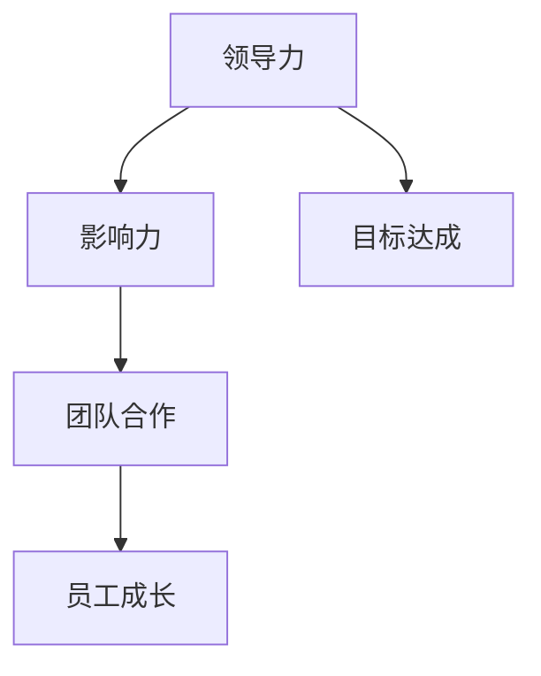

**核心算法原理讲解：**

伪代码：

```
function leadership(server):
  server.setInfluence(true)
  server.setTeamwork(true)
  server.setEmployeeGrowth(true)
  server.setGoalAchievement(true)
  return server
```

**数学模型和公式：**

$$ \text{领导力} = f(\text{影响力}, \text{团队合作}, \text{员工成长}, \text{目标达成}) $$

**举例说明：**

一个成功的领导力案例是苹果公司的史蒂夫·乔布斯。他通过强大的影响力、团队合作精神和员工成长理念，实现了苹果公司一系列创新产品的成功推出。

#### 1.2 领导力与管理的区别

领导力与管理的区别在于，领导力关注的是激励和引导，而管理关注的是规划和执行。领导力是一种变革的力量，而管理是一种维持现状的力量。

**核心概念与联系：**

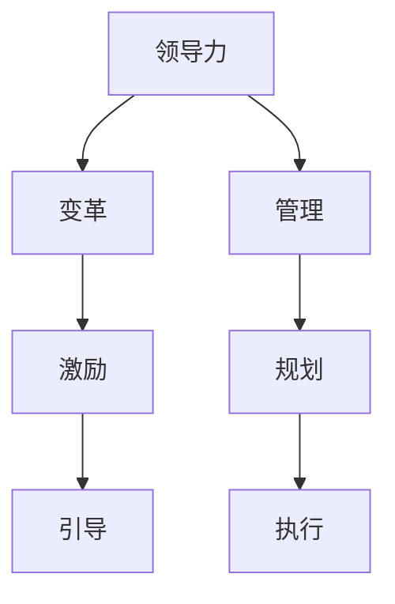

**核心算法原理讲解：**

伪代码：

```
function leadership(server):
  server.setInfluence(true)
  server.setTeamwork(true)
  server.setEmployeeGrowth(true)
  server.setGoalAchievement(true)
  return server

function management(server):
  server.setPlanning(true)
  server.setExecution(true)
  return server
```

**数学模型和公式：**

$$ \text{领导力} \neq \text{管理} $$
$$ \text{领导力} + \text{管理} = \text{有效的组织管理} $$

**举例说明：**

IBM公司前CEO汤姆·沃森既具备卓越的领导力，又具备出色的管理能力，这使得IBM在20世纪中叶成为全球领先的计算机公司。

#### 1.3 领导力的核心要素

领导力的核心要素包括：愿景、信任、沟通、决策能力和影响力。

**核心概念与联系：**

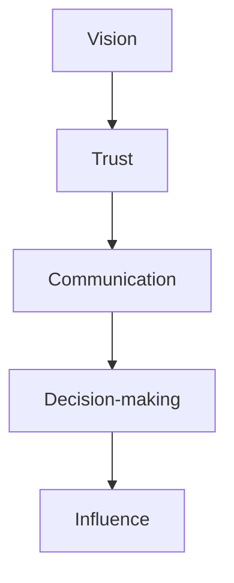

**核心算法原理讲解：**

伪代码：

```
function leadership(server):
  server.setVision(true)
  server.setTrust(true)
  server.setCommunication(true)
  server.setDecisionMaking(true)
  server.setInfluence(true)
  return server
```

**数学模型和公式：**

$$ \text{领导力} = f(\text{愿景}, \text{信任}, \text{沟通}, \text{决策能力}, \text{影响力}) $$

**举例说明：**

亚马逊的杰夫·贝佐斯以其愿景、信任、沟通能力、决策能力和影响力，带领公司不断创新，成为全球电子商务的领军企业。

### 第二部分：资源整合与优化

#### 2.1 资源整合的原理

资源整合是将不同资源进行有效组合，以实现最大化效益的过程。资源整合的原理在于，通过优化资源的配置和使用，提高组织的运作效率。

**核心概念与联系：**

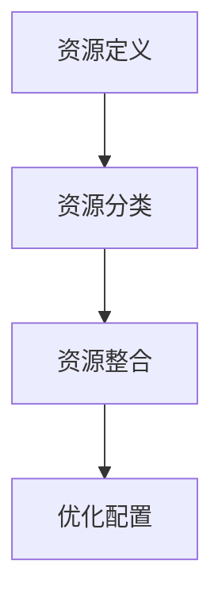

**核心算法原理讲解：**

伪代码：

```
function resourceIntegration(organization):
  resources = organization.getAvailableResources()
  optimizedResources = organization.optimizeResourceAllocation(resources)
  organization.setOptimizedResources(optimizedResources)
  return organization
```

**数学模型和公式：**

$$ \text{资源整合} = \text{资源优化配置} + \text{资源最大化利用} $$

**举例说明：**

亚马逊通过整合物流、供应链和云计算资源，实现了全球范围内的快速配送和高效运营。

#### 2.2 资源优化策略

资源优化策略包括：资源评估、资源平衡和资源利用效率提升。

**核心概念与联系：**

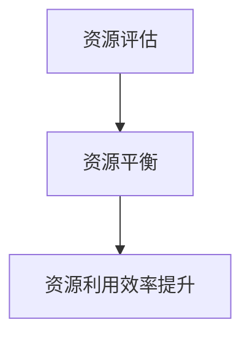

**核心算法原理讲解：**

伪代码：

```
function resourceOptimization(organization):
  organization.evaluateResources()
  organization.balanceResources()
  organization.improveResourceUtilization()
  return organization
```

**数学模型和公式：**

$$ \text{资源优化策略} = \text{资源评估} + \text{资源平衡} + \text{资源利用效率提升} $$

**举例说明：**

特斯拉通过精确的资源评估和平衡，提高了电池生产效率，降低了成本。

#### 2.3 资源配置的艺术

资源配置的艺术在于找到最适合的资源组合，以实现既定目标。

**核心概念与联系：**

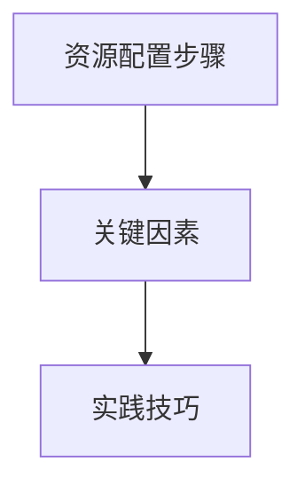

**核心算法原理讲解：**

伪代码：

```
function resourceAllocation(organization, goal):
  steps = organization.getResourceAllocationSteps()
  keyFactors = organization.getIdentifiedKeyFactors()
  practices = organization.getPracticalTechniques()
  optimizedAllocation = organization.allocateResources(steps, keyFactors, practices, goal)
  return optimizedAllocation
```

**数学模型和公式：**

$$ \text{资源配置} = f(\text{步骤}, \text{关键因素}, \text{实践技巧}, \text{目标}) $$

**举例说明：**

阿里巴巴在电子商务平台建设中，通过精确的资源配置，实现了全球范围内的快速扩展。

### 第三部分：领导力与资源整合的实际应用

#### 3.1 组织领导力与资源整合

组织领导力与资源整合的协同作用，能够提高组织的整体效率和竞争力。

**核心概念与联系：**

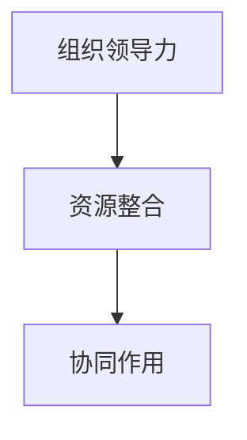

**核心算法原理讲解：**

伪代码：

```
function organizationalLeadershipAndResourceIntegration(organization):
  organization.setLeadership(true)
  organization.setResourceIntegration(true)
  synergies = organization.identifySynergies()
  organization.setSynergies(synergies)
  return organization
```

**数学模型和公式：**

$$ \text{组织领导力} + \text{资源整合} = \text{协同作用} $$

**举例说明：**

谷歌通过强大的领导力和高效的资源整合，成为了全球领先的科技公司。

#### 3.2 项目领导力与资源整合

项目领导力与资源整合在项目管理中起着至关重要的作用。

**核心概念与联系：**

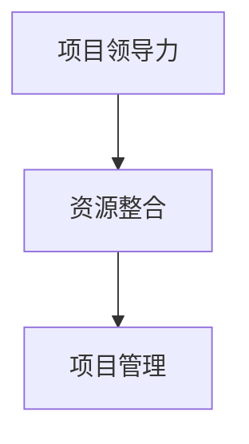

**核心算法原理讲解：**

伪代码：

```
function projectLeadershipAndResourceIntegration(project):
  project.setLeadership(true)
  project.setResourceIntegration(true)
  projectManagement = project.manageProject()
  return projectManagement
```

**数学模型和公式：**

$$ \text{项目领导力} + \text{资源整合} = \text{项目管理} $$

**举例说明：**

SpaceX通过卓越的项目领导力和资源整合，实现了多次成功的太空探索任务。

#### 3.3 团队领导力与资源整合

团队领导力与资源整合在团队协作中发挥着关键作用。

**核心概念与联系：**

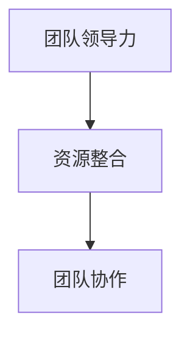

**核心算法原理讲解：**

伪代码：

```
function teamLeadershipAndResourceIntegration(team):
  team.setLeadership(true)
  team.setResourceIntegration(true)
  collaboration = team.collaborate()
  return collaboration
```

**数学模型和公式：**

$$ \text{团队领导力} + \text{资源整合} = \text{团队协作} $$

**举例说明：**

腾讯游戏团队通过强大的团队领导力和高效的资源整合，推出了多款风靡全球的游戏。

### 第四部分：领导力与资源整合的挑战与展望

#### 4.1 领导力与资源整合的挑战

领导力与资源整合在实施过程中面临诸多挑战，如组织变革的阻力、项目复杂性、团队协作的困难等。

**核心概念与联系：**

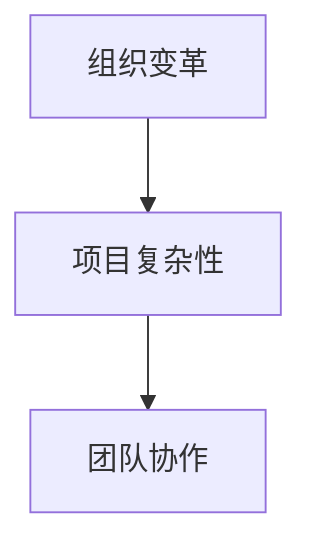

**核心算法原理讲解：**

伪代码：

```
function challengesInLeadershipAndResourceIntegration():
  challenges = ["organizational change resistance", "project complexity", "team collaboration difficulties"]
  return challenges
```

**数学模型和公式：**

$$ \text{挑战} = f(\text{组织变革阻力}, \text{项目复杂性}, \text{团队协作困难}) $$

**举例说明：**

在实施数字化转型时，企业常常面临组织变革的阻力，项目复杂性增加，团队协作难度加大。

#### 4.2 领导力与资源整合的未来趋势

随着科技的不断发展，领导力与资源整合将面临新的机遇和挑战。

**核心概念与联系：**

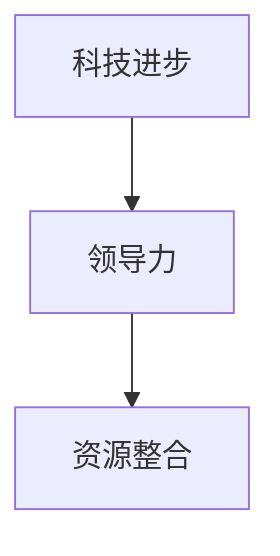

**核心算法原理讲解：**

伪代码：

```
function futureTrendsInLeadershipAndResourceIntegration():
  trends = ["digital transformation", "AI integration", "globalization"]
  return trends
```

**数学模型和公式：**

$$ \text{未来趋势} = f(\text{数字化变革}, \text{AI整合}, \text{全球化}) $$

**举例说明：**

随着人工智能和数字化转型的推进，领导力和资源整合将更加依赖于数据分析和智能决策。

### 附录

#### 附录A：领导力与资源整合实用工具与资源

- 领导力工具：领导力测评、360度反馈、领导力发展计划
- 资源整合工具：资源评估表、资源平衡矩阵、资源利用效率分析工具

#### 附录B：案例研究

- 亚马逊：领导力与资源整合的典范
- 特斯拉：资源优化策略的实践
- 谷歌：组织领导力与资源整合的成功

#### 附录C：术语表

- 领导力：影响和激励他人实现共同目标的能力。
- 资源整合：将不同资源进行有效组合，以实现最大化效益的过程。
- 资源配置：找到最适合的资源组合，以实现既定目标。

### 结语

作者：AI天才研究院/AI Genius Institute & 禅与计算机程序设计艺术 /Zen And The Art of Computer Programming

本文通过逐步分析，探讨了领导力与资源整合在优化资源配置中的应用。从领导力的核心要素到资源整合的原理，再到实际应用中的挑战与展望，我们希望为读者提供一套系统化的资源配置优化方案。未来，随着科技的不断发展，领导力与资源整合将面临新的机遇和挑战，但无疑，它将继续在各个领域发挥重要作用。

