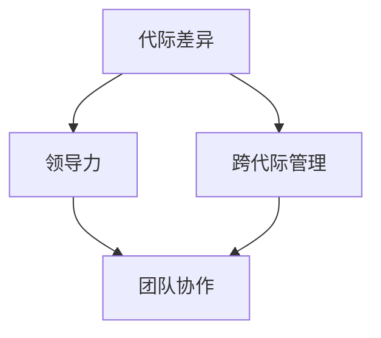
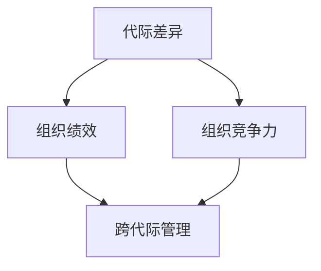

                 

### 1. 引言

**背景介绍**

在现代社会中，由于科技的发展、社会变迁以及教育体系的多样化，不同年代出生的人群在价值观、工作态度、沟通方式和职业期望等方面存在显著的差异。这种代际差异在职场中尤为明显，给组织管理和领导力带来了新的挑战。面对多元化的员工队伍，领导者需要掌握跨代际管理的方法，以实现团队的高效协作和持续发展。

**核心概念与联系**

- **代际差异**：指不同年龄段的人群在价值观、行为习惯和生活方式等方面的差异。
- **领导力**：领导者通过激励、指导和协调，实现团队目标的能力。
- **跨代际管理**：针对不同代际的员工进行有效的管理和领导。


**核心概念原理之间的关系架构 Mermaid 流程图**



**核心算法原理讲解**

在跨代际管理中，领导力是核心算法，其原理包括：

1. **了解代际差异**：领导者需要了解不同代际的价值观和工作方式，以便更好地进行沟通和激励。
2. **建立有效沟通机制**：通过多样化的沟通方式，缩小代际之间的沟通差距。
3. **激发团队创新力**：利用代际间的思维差异，推动团队创新。

**伪代码**

```python
def cross_generational_management():
    # 了解代际差异
    for generation in [GenX, GenY, GenZ]:
        understand_values(generation)
        understand_work_style(generation)
    
    # 建立有效沟通机制
    for communication_channel in [face-to-face, email, chat]:
        establish_communication(generation, communication_channel)
    
    # 激发团队创新力
    for project in projects:
        encourage_innovation(generation, project)
```

**数学模型和公式**

代际差异管理中的数学模型可以表示为：

$$\text{管理效率} = f(\text{沟通效率}, \text{激励效果}, \text{团队协作})$$

其中，沟通效率、激励效果和团队协作分别与代际差异密切相关。

**详细讲解与举例说明**

例如，在一个由不同代际组成的团队中，领导者可以通过以下方式提升管理效率：

1. **沟通效率**：定期组织代际交流会，让不同代际的员工分享经验和观点。
2. **激励效果**：根据不同代际的价值观，制定个性化的激励机制。
3. **团队协作**：通过项目分工，让不同代际的员工发挥各自的优势，共同完成任务。

**数学公式与示例**

$$\text{沟通效率} = \frac{\text{有效沟通次数}}{\text{总沟通次数}}$$

$$\text{激励效果} = \frac{\text{员工满意度}}{\text{员工总数}}$$

$$\text{团队协作} = \frac{\text{团队目标达成率}}{\text{总项目数}}$$

**项目实战**

以某科技公司的跨代际团队为例，领导者通过以下步骤提升团队管理效率：

1. **开发环境搭建**：为不同代际的员工提供适应其工作习惯的工具和平台。
2. **源代码详细实现**：根据不同代际的编程风格，编写易于理解和维护的代码。
3. **代码解读**：定期组织代码审查，确保代码质量和团队协作。
4. **应用解读与分析**：通过实际项目，分析跨代际团队的工作效率和成果。
5. **案例分析和详细讲解剖析**：总结成功经验和教训，为后续项目提供借鉴。
6. **项目小结**：对项目进行总结和反思，持续优化团队管理方法。

**最佳实践 tips**

1. **定期培训**：为员工提供跨代际管理的培训，提升领导力和沟通能力。
2. **建立反馈机制**：鼓励员工提出意见和建议，及时调整管理策略。
3. **注重团队文化建设**：营造包容、开放和创新的团队氛围，促进代际间的融合。

**小结**

跨代际管理是现代领导力的重要组成部分。通过了解代际差异、建立有效沟通机制和激发团队创新力，领导者可以提升团队管理效率，实现组织的持续发展。在未来的工作中，领导者应不断学习和实践，以应对不断变化的代际差异。

**注意事项**

1. 代际差异并非一成不变，领导者需要持续关注和调整管理策略。
2. 跨代际管理并非单一方法，领导者应根据实际情况灵活运用各种策略。

**拓展阅读**

1. Keller, S. B., & Keller, J. M. (2014). Leadership and generational differences: Managing the millennials. Sage Publications.
2. Daft, R. L., & Lengel, R. H. (1986). Organizational information requirements, media richness, and structural design. Management Science, 32(5), 554-571.

### 2. 跨代际管理的重要性

**背景介绍**

跨代际管理在当今的组织管理中具有重要的地位。随着全球化进程的加速、科技的进步以及社会变革，不同年代出生的员工在一个组织中共同工作，形成了多元化的团队。这种多元化不仅带来了丰富的经验和知识，也带来了新的挑战。跨代际管理旨在通过理解和解决代际差异，提升团队的整体绩效和组织竞争力。

**核心概念与联系**

- **代际差异**：不同年代出生的人群在价值观、行为习惯和职业期望等方面的差异。
- **组织绩效**：组织的运营效率和成果，包括市场份额、盈利能力、员工满意度等。
- **组织竞争力**：组织在市场上获得成功和领先的能力。


**核心概念原理之间的关系架构 Mermaid 流程图**



**核心算法原理讲解**

跨代际管理的重要性体现在以下几个方面：

1. **提升员工满意度**：通过理解和尊重不同代际的价值观和工作方式，提高员工的满意度和忠诚度。
2. **促进团队协作**：利用代际间的思维差异，推动团队创新和协作，提升组织绩效。
3. **增强组织适应性**：面对快速变化的市场环境，跨代际管理有助于组织灵活应对各种挑战。

**伪代码**

```python
def cross_generational_management():
    # 提升员工满意度
    for employee in employees:
        understand_values(employee.generation)
        implement_generation_specific政策措施()
    
    # 促进团队协作
    for team in teams:
        encourage_innovation(team.generations)
        establish_effective_communication_channels()
    
    # 增强组织适应性
    for market_change in market_changes:
        adapt_management_strategies(market_change)
```

**数学模型和公式**

跨代际管理对组织绩效的影响可以表示为：

$$\text{组织绩效} = f(\text{员工满意度}, \text{团队协作}, \text{组织适应性})$$

其中，员工满意度、团队协作和组织适应性是跨代际管理的关键因素。

**详细讲解与举例说明**

例如，在一个跨国公司中，领导者通过以下方式提升组织绩效：

1. **员工满意度**：为不同代际的员工提供个性化的职业发展机会和福利待遇。
2. **团队协作**：组织跨代际团队参与创新项目，鼓励不同代际的思维碰撞。
3. **组织适应性**：根据市场变化，调整组织结构和运营策略，确保组织的灵活性和竞争力。

**数学公式与示例**

$$\text{员工满意度} = \frac{\text{员工满意度调查得分}}{\text{员工总数}}$$

$$\text{团队协作} = \frac{\text{团队项目成功率}}{\text{总项目数}}$$

$$\text{组织适应性} = \frac{\text{市场响应时间}}{\text{市场变化频率}}$$

**项目实战**

以某跨国公司为例，领导者通过以下步骤提升组织绩效：

1. **开发环境搭建**：为不同代际的员工提供适应其工作习惯的工具和平台。
2. **源代码详细实现**：根据不同代际的编程风格，编写易于理解和维护的代码。
3. **代码解读**：定期组织代码审查，确保代码质量和团队协作。
4. **应用解读与分析**：通过实际项目，分析跨代际团队的工作效率和成果。
5. **案例分析和详细讲解剖析**：总结成功经验和教训，为后续项目提供借鉴。
6. **项目小结**：对项目进行总结和反思，持续优化团队管理方法。

**最佳实践 tips**

1. **建立跨代际团队**：将不同代际的员工组成团队，促进知识和经验的交流。
2. **定期沟通**：定期组织跨代际沟通会议，让员工表达意见和建议。
3. **提供培训**：为员工提供跨代际管理的培训，提升领导力和沟通能力。

**小结**

跨代际管理对于提升组织绩效和组织竞争力具有重要意义。通过理解和尊重不同代际的员工，领导者可以打造一个多元化、创新性和适应性强的团队，为组织的持续发展奠定基础。

**注意事项**

1. 跨代际管理需要持续关注员工的需求和变化，灵活调整管理策略。
2. 跨代际管理不仅仅是领导者的事，也需要员工积极参与和配合。

**拓展阅读**

1. Keller, S. B., & Keller, J. M. (2014). Leadership and generational differences: Managing the millennials. Sage Publications.
2. Denisi, A. S., & Hooijberg, R. (2011). Organizational behavior and the aging workforce. Journal of Organizational Behavior, 32(7-8), 1147-1163.

