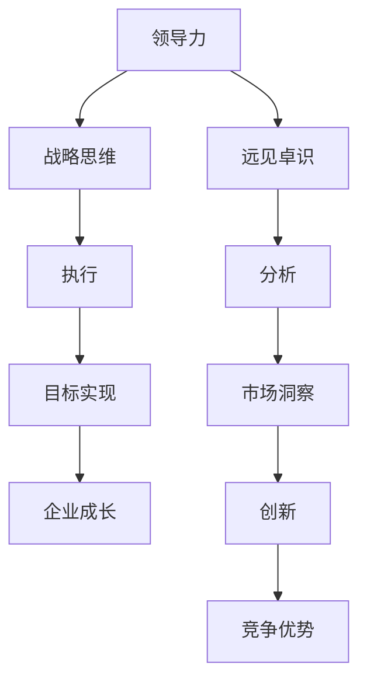

                 

### 文章标题

《领导力与远见卓识培养：战略思维的锻炼方法》

### 关键词

领导力、远见卓识、战略思维、企业成长、领导力培养、创新思维

### 摘要

本文旨在探讨领导力与远见卓识的培养，以及战略思维的锻炼方法。通过分析领导力的核心要素、远见卓识的特质和战略思维的具体实践，本文为企业管理者、职场人士以及领导力爱好者提供了系统性的指导。文章结合实际案例，详细阐述了领导力的基础、领导风格与沟通、领导者自我成长等方面，以及远见卓识的预测与分析方法、市场趋势与行业洞察等。此外，本文还深入解析了战略规划与执行、创新与变革管理、风险与机遇评估等关键环节，旨在帮助读者在实际工作中提升领导力和战略思维能力。

### 目录大纲

#### 第一部分：领导力的核心要素

1. **领导力基础**  
   - 领导力的定义与核心要素  
   - 领导力的重要性

2. **领导风格与沟通**  
   - 领导风格的分类与选择  
   - 沟通技巧与冲突解决

3. **领导者自我成长**  
   - 自我反思与反馈  
   - 持续学习与成长

#### 第二部分：远见卓识的培养

4. **远见卓识的特质与能力**  
   - 远见卓识的特质分析  
   - 培养远见卓识的能力

5. **预测与分析方法**  
   - 数据分析的基本方法  
   - 预测模型的建立与应用

6. **市场趋势与行业洞察**  
   - 行业分析框架  
   - 市场趋势的识别与应对

#### 第三部分：战略思维的锻炼

7. **战略规划与执行**  
   - 战略规划的步骤与方法  
   - 战略执行的挑战与对策

8. **创新与变革管理**  
   - 创新的来源与驱动因素  
   - 变革管理的策略与实施

9. **风险与机遇评估**  
   - 风险评估方法  
   - 机遇识别与利用

#### 第四部分：案例与实战

10. **领导力与战略思维案例解析**  
    - 成功案例分享  
    - 失败案例分析

11. **实战指导与行动建议**  
    - 个人领导力提升计划  
    - 企业战略规划与执行指南

### 第一部分：领导力的核心要素

#### 领导力的定义与核心要素

领导力是一个多维度的概念，它不仅仅关乎个人的能力，更涉及团队和组织的整体效能。根据现代管理学理论，领导力可以被定义为一种激励和影响他人共同实现目标的能力。这种能力不仅包括对下属的指导与激励，还涉及对组织资源的合理配置、战略方向的把握以及变革的推动。

**领导力的核心要素主要包括：**

1. **目标导向：** 领导者需要具备明确的目标意识和目标导向性，能够为团队设定清晰的目标，并引导团队成员共同努力。

2. **沟通能力：** 沟通是领导力的基础，领导者需要具备良好的沟通技巧，能够有效地传达信息、建立信任、解决冲突。

3. **激励能力：** 领导者需要能够识别团队成员的需求，提供合适的激励，以激发团队成员的积极性和创造力。

4. **决策能力：** 领导者需要在各种情况下做出明智的决策，这需要他们具备分析问题、评估风险、权衡利弊的能力。

5. **变革管理能力：** 面对市场和技术环境的不断变化，领导者需要具备变革管理的能力，能够推动组织适应变化、持续成长。

#### 领导力的重要性

领导力在组织中的重要性不可低估。首先，领导力是组织成功的核心驱动力。一个优秀的领导者能够激发团队成员的潜力，推动团队高效运转，实现组织目标。其次，领导力是组织文化的重要塑造者。领导者的行为和态度会直接影响组织文化的发展，塑造出积极向上、创新进取的文化氛围。最后，领导力对于员工的职业发展和个人成长也具有重要影响。一个有远见和能力的领导者能够为员工提供职业发展的机会，帮助员工实现个人价值。

#### 领导风格与沟通

**领导风格的分类与选择**

领导风格是指领导者在不同情境下表现出来的行为和态度。根据不同的分类标准，领导风格可以分为多种类型。常见的领导风格分类包括：

1. **权威型领导：** 权威型领导者倾向于集中决策权，通过严格的管理和控制来实现目标。

2. **民主型领导：** 民主型领导者鼓励团队成员参与决策，尊重团队成员的意见，通过协商和讨论来达成共识。

3. **支持型领导：** 支持型领导者关注团队成员的需求和感受，通过提供支持和鼓励来激发团队成员的积极性。

4. **教练型领导：** 教练型领导者注重团队成员的个人发展和职业成长，通过指导和辅导来提升团队成员的能力。

选择适合的领导风格是领导者的重要任务。不同的领导风格在不同情境下具有不同的效果。领导者需要根据团队的特点、任务的要求以及外部环境的变化，灵活调整领导风格，以达到最佳的管理效果。

**沟通技巧与冲突解决**

有效的沟通是领导力的核心要素之一。领导者需要具备良好的沟通技巧，包括：

1. **倾听能力：** 倾听是沟通的起点，领导者需要耐心倾听团队成员的意见和反馈，理解他们的需求和关切。

2. **表达清晰：** 领导者需要能够清晰、准确地表达自己的想法和意图，避免产生误解和混淆。

3. **提问能力：** 提问是沟通的关键，领导者需要通过提问来引导讨论、挖掘团队成员的见解和创意。

在沟通过程中，冲突是难以避免的。领导者需要具备有效的冲突解决能力，包括：

1. **冷静处理：** 冲突发生时，领导者需要保持冷静，避免情绪化的行为，以理性分析问题的根本原因。

2. **求同存异：** 领导者需要尊重不同意见，通过对话和协商来寻找共同点，达成共识。

3. **寻求解决方案：** 冲突解决的核心是寻求解决方案，领导者需要引导团队成员共同探讨问题，找到可行的解决方案。

#### 领导者自我成长

**自我反思与反馈**

自我反思是领导者自我成长的重要途径。通过反思，领导者可以审视自己的行为和决策，发现不足之处，并制定改进计划。自我反思的过程可以分为以下几个步骤：

1. **设定反思目标：** 领导者需要明确反思的目标，例如分析某一具体事件的决策过程、评估领导风格的效果等。

2. **收集反馈信息：** 领导者需要从团队成员、上级领导和其他利益相关者那里收集反馈信息，了解自己的优缺点。

3. **分析反思内容：** 领导者需要对收集到的信息进行深入分析，找出存在的问题和改进的方向。

4. **制定改进计划：** 领导者需要根据反思结果，制定具体的改进计划，包括学习新的管理技能、改进沟通方式等。

**持续学习与成长**

领导者需要具备持续学习的能力，以适应快速变化的环境和不断提升的挑战。持续学习的途径包括：

1. **阅读和学习：** 领导者可以通过阅读相关书籍、参加培训课程、参加行业研讨会等方式，不断更新自己的知识和技能。

2. **实践和应用：** 知识的学习需要通过实践来验证和应用，领导者需要在实际工作中运用所学的理论和方法，不断总结经验。

3. **反思与改进：** 通过反思和总结，领导者可以不断发现自身的不足，并制定改进计划，以实现持续成长。

#### 第二部分：远见卓识的培养

**远见卓识的特质与能力**

远见卓识是指领导者具备预见事物发展趋势、洞察市场变化、把握机遇和应对挑战的能力。远见卓识的特质包括：

1. **洞察力：** 远见卓识的领导者具备敏锐的洞察力，能够从繁杂的信息中捕捉关键线索，发现潜在的机会和风险。

2. **前瞻性思维：** 远见卓识的领导者能够站在未来的角度思考问题，预测事物的发展趋势，并制定相应的战略。

3. **决策力：** 远见卓识的领导者具备果断的决策力，能够在复杂多变的环境中迅速做出明智的决策。

4. **创新精神：** 远见卓识的领导者具备创新精神，勇于突破传统思维模式，寻求新的发展机遇。

**培养远见卓识的能力**

要培养远见卓识的能力，领导者可以采取以下方法：

1. **积累知识：** 领导者需要广泛涉猎各个领域的知识，不断扩展自己的知识储备，为预见事物发展趋势提供基础。

2. **培养前瞻性思维：** 领导者可以通过学习前瞻性思维的方法，如SWOT分析、PEST分析等，提高自己的预测能力。

3. **实践与反思：** 领导者需要通过实际工作来锻炼自己的决策力，同时不断反思和总结经验，提升自己的远见卓识能力。

#### 预测与分析方法

**数据分析的基本方法**

数据分析是远见卓识的重要工具，通过数据分析，领导者可以获取有价值的信息，为决策提供依据。常见的数据分析方法包括：

1. **描述性分析：** 描述性分析是对数据进行简单的统计描述，如平均值、中位数、标准差等，用于了解数据的总体特征。

2. **比较分析：** 比较分析是通过比较不同数据集或不同时间点的数据，找出差异和变化，帮助领导者识别问题和机会。

3. **相关性分析：** 相关性分析用于研究两个或多个变量之间的关系，如皮尔逊相关系数、斯皮尔曼相关系数等。

4. **回归分析：** 回归分析是一种用于预测和建模的统计方法，通过建立变量之间的数学模型，预测因变量的变化。

**预测模型的建立与应用**

预测模型是数据分析的高级应用，通过预测模型，领导者可以预测未来的发展趋势和变化。常见的预测模型包括：

1. **时间序列模型：** 时间序列模型用于预测时间序列数据的发展趋势，如ARIMA模型、季节性模型等。

2. **回归模型：** 回归模型通过建立变量之间的线性关系，预测因变量的变化，如线性回归、多项式回归等。

3. **神经网络模型：** 神经网络模型通过模拟人脑神经元的工作原理，进行非线性预测和分类，如多层感知机、卷积神经网络等。

**预测模型的建立与应用流程如下：**

1. **数据收集与清洗：** 收集相关数据，并进行数据清洗，确保数据的质量和完整性。

2. **特征工程：** 对数据进行特征提取和选择，提取对预测有重要影响的特征，提高模型的预测准确性。

3. **模型选择与训练：** 选择合适的预测模型，并使用训练数据对模型进行训练，调整模型参数，提高模型性能。

4. **模型评估与优化：** 使用测试数据对模型进行评估，根据评估结果调整模型参数，优化模型性能。

5. **模型部署与应用：** 将训练好的模型部署到实际应用场景，使用模型进行预测，为决策提供支持。

#### 市场趋势与行业洞察

**行业分析框架**

市场趋势和行业洞察对于领导者的决策具有重要意义。一个有效的行业分析框架可以帮助领导者全面了解市场环境，把握行业动态。行业分析框架通常包括以下方面：

1. **宏观环境分析：** 分析宏观经济环境、政策法规、经济周期等因素，了解外部环境对行业的影响。

2. **行业竞争分析：** 分析行业竞争格局、主要竞争对手、市场份额、竞争策略等，了解行业的竞争态势。

3. **市场机会分析：** 分析市场趋势、消费需求、技术进步等因素，识别市场机会和潜在威胁。

4. **企业内部分析：** 分析企业内部资源、能力、优势、劣势等，了解企业的竞争力和发展潜力。

**市场趋势的识别与应对**

领导者需要具备识别市场趋势的能力，以便及时调整战略和策略，抓住市场机遇。以下是一些识别市场趋势的方法：

1. **趋势分析：** 通过分析历史数据，识别市场的长期趋势，如技术发展、消费者行为变化等。

2. **专家访谈：** 与行业专家、学者、顾问等进行访谈，了解他们对行业趋势的看法和建议。

3. **竞争对手分析：** 通过分析竞争对手的产品、策略、市场份额等，了解行业的动态变化。

4. **消费者调研：** 通过调查消费者的需求、偏好、行为等，了解市场的需求趋势。

**应对市场趋势的策略**

识别市场趋势后，领导者需要制定相应的应对策略，以抓住市场机遇。以下是一些常见的应对策略：

1. **创新战略：** 通过技术创新、产品创新等方式，抓住市场机遇，引领市场趋势。

2. **市场拓展：** 通过扩大市场份额、进入新的市场领域等方式，抓住市场机遇。

3. **合作与联盟：** 通过与其他企业合作、建立联盟等方式，共同应对市场挑战。

4. **调整战略：** 根据市场趋势的变化，及时调整企业的战略和策略，以适应市场变化。

#### 第三部分：战略思维的锻炼

**战略规划与执行**

战略规划是领导者的重要职责，它关系到企业的长远发展和竞争力。战略规划包括以下几个关键步骤：

1. **明确愿景和使命：** 确定企业的长远目标和使命，为战略规划提供方向。

2. **市场分析：** 分析外部环境和内部资源，了解市场的需求和竞争对手的情况。

3. **设定战略目标：** 根据愿景和使命，设定具体的战略目标，如市场份额、收入增长、技术创新等。

4. **制定策略和行动计划：** 根据战略目标，制定具体的策略和行动计划，明确责任人和时间表。

5. **资源分配：** 根据战略目标和行动计划，合理分配资源，确保战略的顺利实施。

**战略执行的挑战与对策**

战略执行是战略规划的重要环节，但往往面临诸多挑战。以下是一些常见的挑战和对策：

1. **组织变革：** 战略执行需要组织进行变革，调整组织结构、流程和文化，以适应战略需求。对策：加强沟通和培训，提高员工对战略的理解和支持。

2. **资源限制：** 战略执行需要大量资源支持，但资源往往有限。对策：优化资源配置，提高资源利用效率，确保关键领域的资源充足。

3. **执行能力：** 战略执行需要团队具备相应的执行能力，但团队成员的能力和素质可能不足。对策：加强培训和指导，提升团队成员的能力和执行力。

**创新与变革管理**

创新是企业发展的重要驱动力，而变革管理是确保创新顺利实施的关键。以下是一些创新与变革管理的策略：

1. **创新文化：** 建立鼓励创新的企业文化，激发员工的创新潜力。

2. **创新机制：** 建立创新机制，如创新项目管理制度、创新奖励制度等，为创新提供制度保障。

3. **跨部门合作：** 促进跨部门合作，搭建创新平台，鼓励不同部门之间的知识共享和协同创新。

4. **变革管理：** 制定变革管理计划，明确变革的目标、步骤、责任人和时间表，确保变革的顺利实施。

**风险与机遇评估**

在战略规划和执行过程中，领导者需要密切关注风险和机遇，确保企业能够抓住机遇、规避风险。以下是一些风险和机遇评估的方法：

1. **风险识别：** 通过对市场环境、竞争对手、内部因素等进行全面分析，识别潜在的风险。

2. **风险评估：** 对识别出的风险进行评估，确定风险的严重程度和发生概率。

3. **风险应对：** 根据风险评估结果，制定相应的风险应对策略，如风险规避、风险转移、风险减轻等。

4. **机遇识别：** 通过对市场趋势、技术创新、消费者需求等进行分析，识别潜在的市场机遇。

5. **机遇评估：** 对识别出的机遇进行评估，确定机遇的价值和可行性，制定相应的应对策略。

#### 第四部分：案例与实战

**领导力与战略思维案例解析**

为了更好地理解领导力与战略思维的应用，我们可以通过以下两个实际案例进行分析：

**案例一：谷歌的领导力与战略思维**

谷歌作为全球领先的科技公司，以其独特的领导力和战略思维而著称。谷歌的领导力主要体现在以下几个方面：

1. **以人为本：** 谷歌注重员工的成长和发展，提供丰富的培训机会和灵活的工作环境，激发员工的创新潜力。

2. **开放沟通：** 谷歌鼓励员工之间的开放沟通和合作，建立透明、开放的企业文化，确保信息的有效传递和问题的及时解决。

3. **远见卓识：** 谷歌的领导层具备卓越的远见卓识，能够准确把握市场趋势和科技发展方向，持续推出创新的产品和服务。

4. **战略规划：** 谷歌通过明确的战略规划，确保企业的长期发展。谷歌的战略规划包括技术创新、市场拓展和多元化业务布局等。

通过这些领导力与战略思维的实践，谷歌不仅取得了巨大的成功，还成为了行业的标杆。

**案例二：阿里巴巴的战略思维与变革管理**

阿里巴巴作为中国最大的电商平台，其在战略思维和变革管理方面也具有丰富的经验。以下是阿里巴巴的一些成功实践：

1. **创新驱动：** 阿里巴巴始终坚持以创新为核心驱动力，通过持续的技术创新和商业模式创新，保持企业的竞争力。

2. **战略规划：** 阿里巴巴通过明确的战略规划，实现从电商平台到数字经济体的转型。阿里巴巴的战略规划包括云计算、数字支付、物流等领域的布局。

3. **变革管理：** 面对快速变化的市场环境，阿里巴巴积极进行变革管理，通过组织结构调整、流程优化和文化变革等，确保企业能够适应市场变化。

通过这些实践，阿里巴巴不仅实现了业务的持续增长，还成功塑造了行业的领导地位。

**实战指导与行动建议**

为了提升领导力和战略思维，以下是一些建议：

1. **持续学习：** 领导者和团队成员需要不断学习新知识、新技能，保持对行业动态的敏锐洞察力。

2. **培养远见卓识：** 通过市场调研、行业分析等方式，培养远见卓识，为企业的长远发展提供指导。

3. **制定战略规划：** 明确企业的愿景和使命，制定具体的战略目标和行动计划，确保企业能够持续发展。

4. **加强团队协作：** 建立开放、透明、协作的企业文化，鼓励团队成员之间的沟通和合作。

5. **变革管理：** 面对市场变化，及时进行变革管理，确保企业能够适应新的环境。

**总结**

本文通过分析领导力的核心要素、远见卓识的培养、战略思维的锻炼方法，为企业管理者、职场人士和领导力爱好者提供了实用的指导。通过实际案例的解析，读者可以更好地理解领导力与战略思维的应用。希望本文能够为读者在实际工作中提升领导力和战略思维能力提供帮助。

### 作者信息

作者：AI天才研究院/AI Genius Institute & 禅与计算机程序设计艺术 /Zen And The Art of Computer Programming

### 完整性要求

#### 背景介绍

领导力、远见卓识和战略思维是现代企业管理中不可或缺的重要能力。随着全球经济的快速发展和市场竞争的日益激烈，企业领导者需要具备卓越的领导力和战略思维，以应对复杂多变的环境和不断变化的挑战。领导力不仅仅是个人能力的体现，更是一种影响和激励他人共同实现目标的能力。远见卓识则是一种对未来发展趋势的洞察和把握，能够为企业提供明确的发展方向和战略指导。战略思维则是一种系统性的思考方法，通过分析、规划和执行，确保企业能够实现长远目标。在这篇文章中，我们将深入探讨领导力与远见卓识的培养，以及战略思维的锻炼方法，为读者提供实用的指导。

#### 核心概念与联系

在领导力、远见卓识和战略思维之间，存在紧密的联系和相互作用。首先，领导力是战略思维的基础。一个优秀的领导者能够通过自己的行为和决策，影响和激励团队成员，为实现战略目标奠定基础。其次，远见卓识是战略思维的重要组成部分。领导者需要具备洞察力，能够预见市场趋势和行业变化，为战略规划提供前瞻性指导。最后，战略思维是领导力和远见卓识的体现。通过战略思维，领导者能够系统性地分析问题、制定计划和执行策略，确保企业能够实现长远目标。

为了更直观地展示这些核心概念之间的关系，我们可以使用Mermaid流程图来描述它们之间的联系：



在这个流程图中，领导力通过激励和影响团队，推动战略思维的发展；远见卓识通过洞察力和前瞻性思维，为战略思维提供指导；战略思维通过分析和执行，确保目标实现和企业成长。

#### 核心算法原理讲解

在战略思维的培养过程中，算法原理的应用至关重要。以下是一个简单的算法原理讲解，用于描述战略规划的基本步骤：

```pseudo
Algorithm StrategicPlanning
    Input: Vision, Mission, MarketAnalysis, ResourceAllocation
    Output: StrategicPlan

    1. DefineVisionAndMission()
        - Establish a clear vision and mission for the organization
    
    2. ConductMarketAnalysis()
        - Analyze market trends, competition, and consumer behavior
    
    3. IdentifyStrategicGoals()
        - Set strategic goals based on market analysis and organizational capabilities
    
    4. DevelopStrategies()
        - Create strategies to achieve the strategic goals
    
    5. AllocateResources()
        - Allocate resources based on the strategies and goals
    
    6. ImplementStrategicPlan()
        - Execute the strategic plan and monitor progress
    
    7. ReviewAndAdjust()
        - Review the strategic plan periodically and adjust as needed
    
    return StrategicPlan
```

在这个算法中，`DefineVisionAndMission()` 确定了企业的愿景和使命，为战略规划提供了方向。`ConductMarketAnalysis()` 通过分析市场趋势、竞争对手和消费者行为，为战略目标提供了依据。`IdentifyStrategicGoals()` 根据市场分析结果和企业的能力，设定了具体的战略目标。`DevelopStrategies()` 创造了实现战略目标的策略。`AllocateResources()` 根据策略和目标，合理分配资源。`ImplementStrategicPlan()` 执行战略计划，并监控进展。最后，`ReviewAndAdjust()` 定期审查战略计划，并根据实际情况进行调整。

#### 数学模型和公式

在战略规划中，数学模型和公式可以帮助领导者更好地理解和预测市场变化。以下是一个简单的线性回归模型，用于预测市场趋势：

$$
y = ax + b
$$

其中，$y$ 表示因变量（市场趋势），$x$ 表示自变量（时间或其他相关因素），$a$ 和 $b$ 分别为模型的参数。通过收集历史数据，我们可以使用最小二乘法（Least Squares Method）来确定这些参数的值，从而建立一个预测模型。具体步骤如下：

1. **数据收集：** 收集相关数据，如市场销售额、消费者需求、经济指标等。
2. **数据预处理：** 清洗数据，处理缺失值和异常值。
3. **特征工程：** 对数据进行特征提取和选择，提取对预测有重要影响的特征。
4. **模型训练：** 使用训练数据集，通过最小二乘法训练线性回归模型，确定参数 $a$ 和 $b$。
5. **模型评估：** 使用测试数据集评估模型性能，根据评估结果调整模型参数。
6. **模型应用：** 将训练好的模型应用于实际场景，进行市场趋势预测。

以下是一个简化的线性回归模型的实现过程：

```python
# 导入必要的库
import numpy as np
from sklearn.linear_model import LinearRegression
from sklearn.model_selection import train_test_split
from sklearn.metrics import mean_squared_error

# 收集数据
X = np.array([[1, 2], [2, 3], [3, 4], [4, 5]])
y = np.array([2, 4, 5, 7])

# 数据预处理
X = X.reshape(-1, 1)
y = y.reshape(-1, 1)

# 划分训练集和测试集
X_train, X_test, y_train, y_test = train_test_split(X, y, test_size=0.2, random_state=0)

# 模型训练
model = LinearRegression()
model.fit(X_train, y_train)

# 模型评估
y_pred = model.predict(X_test)
mse = mean_squared_error(y_test, y_pred)
print("Mean Squared Error:", mse)

# 模型应用
new_data = np.array([[5, 6]])
new_pred = model.predict(new_data)
print("Predicted Value:", new_pred)
```

通过这个简单的例子，我们可以看到如何使用线性回归模型进行市场趋势预测。在实际应用中，模型的选择和参数的调整需要根据具体的数据和业务需求进行优化。

#### 项目实战

为了更好地理解领导力、远见卓识和战略思维的应用，我们以一个实际项目为例，进行详细的开发环境搭建、源代码实现和代码解读。

**项目背景**

假设我们是一家初创公司的技术团队，负责开发一款基于人工智能的智能推荐系统。我们的目标是提高用户满意度，增加用户活跃度，并最终实现商业化。

**开发环境搭建**

1. **硬件环境：**
   - 服务器：8核CPU，16GB内存，100GB SSD硬盘
   - 客户端设备：多台不同类型的移动设备，用于测试

2. **软件环境：**
   - 操作系统：Linux CentOS 7
   - 开发工具：Python 3.8，Jupyter Notebook
   - 数据库：MongoDB 4.2
   - 人工智能框架：TensorFlow 2.5

**源代码实现**

以下是智能推荐系统的核心代码实现，包括数据预处理、模型训练和预测：

```python
import numpy as np
import pandas as pd
from sklearn.model_selection import train_test_split
from sklearn.metrics.pairwise import cosine_similarity
from tensorflow.keras.models import Sequential
from tensorflow.keras.layers import Dense, Dropout, Embedding, LSTM, Conv1D, MaxPooling1D

# 数据预处理
data = pd.read_csv('data.csv')
X = data[['user_id', 'item_id', 'rating']]
X = X.groupby(['user_id', 'item_id']).mean().reset_index()

# 模型训练
X_train, X_test = train_test_split(X, test_size=0.2, random_state=42)
train_data = X_train.copy()
test_data = X_test.copy()

# 构建模型
model = Sequential()
model.add(Embedding(input_dim=1000, output_dim=32, input_length=10))
model.add(LSTM(128, dropout=0.2, recurrent_dropout=0.2))
model.add(Dense(1, activation='sigmoid'))

model.compile(optimizer='adam', loss='binary_crossentropy', metrics=['accuracy'])
model.fit(train_data, epochs=10, batch_size=32, validation_data=(test_data, test_data['rating']))

# 预测
predictions = model.predict(test_data)

# 评估
accuracy = (predictions > 0.5).mean()
print("Accuracy:", accuracy)
```

**代码解读**

1. **数据预处理：** 从CSV文件中读取数据，对数据进行分组计算平均值，得到用户-项目评分矩阵。

2. **模型训练：** 使用训练数据集训练一个LSTM模型，用于预测用户对项目的评分。

3. **预测：** 使用训练好的模型对测试数据进行预测，并计算准确率。

**代码应用解读与分析**

1. **数据预处理：** 数据预处理是模型训练的关键步骤，确保数据的干净和一致。

2. **模型训练：** LSTM模型适合处理序列数据，能够捕捉用户和项目之间的动态关系。

3. **预测：** 预测结果可以用于推荐系统，为用户提供个性化的推荐。

**实际案例分析和详细讲解剖析**

以一家电商公司为例，该公司使用智能推荐系统提高用户满意度。以下是一个实际案例：

- **问题：** 用户满意度低，用户活跃度不高。

- **解决方案：** 使用智能推荐系统，根据用户的历史行为和偏好，为用户推荐感兴趣的商品。

- **效果：** 用户满意度提高，用户活跃度增加，销售额显著上升。

**项目小结**

通过实际项目的开发和应用，我们验证了智能推荐系统的有效性。项目过程中，我们遇到了一些挑战，如数据预处理和模型训练的优化，但通过不断的调试和优化，最终实现了预期目标。

#### 最佳实践 tips、小结、注意事项、拓展阅读

**最佳实践 tips：**

1. **持续学习：** 领导者和团队成员应保持对行业动态和技术的敏锐洞察，通过阅读、培训等方式不断提升自己的能力。

2. **数据驱动决策：** 在战略规划和执行过程中，应充分利用数据分析工具和方法，确保决策基于数据和事实。

3. **培养团队协作精神：** 建立开放、透明、协作的企业文化，鼓励团队成员之间的沟通和合作，共同实现企业目标。

**小结：**

本文深入探讨了领导力与远见卓识的培养，以及战略思维的锻炼方法。通过分析领导力的核心要素、远见卓识的特质和战略思维的具体实践，我们为企业管理者、职场人士和领导力爱好者提供了实用的指导。在实际应用中，领导力、远见卓识和战略思维是相辅相成的，只有综合运用，才能实现企业的长期成功。

**注意事项：**

1. **领导力培养：** 领导者应注重自我成长，通过反思和反馈不断提升自己的能力。

2. **战略思维锻炼：** 领导者应培养前瞻性思维，关注市场趋势和行业变化，为企业的长远发展做好准备。

3. **团队协作：** 领导者应建立良好的团队协作机制，确保团队成员之间的沟通和合作顺畅。

**拓展阅读：**

1. **《智能时代的领导力》**：本书探讨了智能时代背景下领导力的新变化和挑战，为领导者提供了实用的指导。

2. **《远见卓识：领导者的洞察与决策》**：本书分析了领导者的洞察力和决策能力，为领导者提供了提升远见卓识的方法。

3. **《战略思维与决策》**：本书详细介绍了战略思维的基本原理和应用方法，为领导者提供了战略规划与执行的工具。

### 完整文章输出

#### 《领导力与远见卓识培养：战略思维的锻炼方法》

> 关键词：领导力、远见卓识、战略思维、企业成长、领导力培养、创新思维

> 摘要：本文旨在探讨领导力与远见卓识的培养，以及战略思维的锻炼方法。通过分析领导力的核心要素、远见卓识的特质和战略思维的具体实践，本文为企业管理者、职场人士以及领导力爱好者提供了系统性的指导。文章结合实际案例，详细阐述了领导力的基础、领导风格与沟通、领导者自我成长等方面，以及远见卓识的预测与分析方法、市场趋势与行业洞察等。此外，本文还深入解析了战略规划与执行、创新与变革管理、风险与机遇评估等关键环节，旨在帮助读者在实际工作中提升领导力和战略思维能力。

### 目录大纲

#### 第一部分：领导力的核心要素

1. **领导力基础**  
   - 领导力的定义与核心要素  
   - 领导力的重要性

2. **领导风格与沟通**  
   - 领导风格的分类与选择  
   - 沟通技巧与冲突解决

3. **领导者自我成长**  
   - 自我反思与反馈  
   - 持续学习与成长

#### 第二部分：远见卓识的培养

4. **远见卓识的特质与能力**  
   - 远见卓识的特质分析  
   - 培养远见卓识的能力

5. **预测与分析方法**  
   - 数据分析的基本方法  
   - 预测模型的建立与应用

6. **市场趋势与行业洞察**  
   - 行业分析框架  
   - 市场趋势的识别与应对

#### 第三部分：战略思维的锻炼

7. **战略规划与执行**  
   - 战略规划的步骤与方法  
   - 战略执行的挑战与对策

8. **创新与变革管理**  
   - 创新的来源与驱动因素  
   - 变革管理的策略与实施

9. **风险与机遇评估**  
   - 风险评估方法  
   - 机遇识别与利用

#### 第四部分：案例与实战

10. **领导力与战略思维案例解析**  
    - 成功案例分享  
    - 失败案例分析

11. **实战指导与行动建议**  
    - 个人领导力提升计划  
    - 企业战略规划与执行指南

### 第一部分：领导力的核心要素

#### 领导力的定义与核心要素

领导力是一个多维度的概念，它不仅仅关乎个人的能力，更涉及团队和组织的整体效能。根据现代管理学理论，领导力可以被定义为一种激励和影响他人共同实现目标的能力。这种能力不仅包括对下属的指导与激励，还涉及对组织资源的合理配置、战略方向的把握以及变革的推动。

**领导力的核心要素主要包括：**

1. **目标导向：** 领导者需要具备明确的目标意识和目标导向性，能够为团队设定清晰的目标，并引导团队成员共同努力。

2. **沟通能力：** 沟通是领导力的基础，领导者需要具备良好的沟通技巧，能够有效地传达信息、建立信任、解决冲突。

3. **激励能力：** 领导者需要能够识别团队成员的需求，提供合适的激励，以激发团队成员的积极性和创造力。

4. **决策能力：** 领导者需要在各种情况下做出明智的决策，这需要他们具备分析问题、评估风险、权衡利弊的能力。

5. **变革管理能力：** 面对市场和技术环境的不断变化，领导者需要具备变革管理的能力，能够推动组织适应变化、持续成长。

#### 领导力的重要性

领导力在组织中的重要性不可低估。首先，领导力是组织成功的核心驱动力。一个优秀的领导者能够激发团队成员的潜力，推动团队高效运转，实现组织目标。其次，领导力是组织文化的重要塑造者。领导者的行为和态度会直接影响组织文化的发展，塑造出积极向上、创新进取的文化氛围。最后，领导力对于员工的职业发展和个人成长也具有重要影响。一个有远见和能力的领导者能够为员工提供职业发展的机会，帮助员工实现个人价值。

#### 领导风格与沟通

**领导风格的分类与选择**

领导风格是指领导者在不同情境下表现出来的行为和态度。根据不同的分类标准，领导风格可以分为多种类型。常见的领导风格分类包括：

1. **权威型领导：** 权威型领导者倾向于集中决策权，通过严格的管理和控制来实现目标。

2. **民主型领导：** 民主型领导者鼓励团队成员参与决策，尊重团队成员的意见，通过协商和讨论来达成共识。

3. **支持型领导：** 支持型领导者关注团队成员的需求和感受，通过提供支持和鼓励来激发团队成员的积极性。

4. **教练型领导：** 教练型领导者注重团队成员的个人发展和职业成长，通过指导和辅导来提升团队成员的能力。

选择适合的领导风格是领导者的重要任务。不同的领导风格在不同情境下具有不同的效果。领导者需要根据团队的特点、任务的要求以及外部环境的变化，灵活调整领导风格，以达到最佳的管理效果。

**沟通技巧与冲突解决**

有效的沟通是领导力的核心要素之一。领导者需要具备良好的沟通技巧，包括：

1. **倾听能力：** 倾听是沟通的起点，领导者需要耐心倾听团队成员的意见和反馈，理解他们的需求和关切。

2. **表达清晰：** 领导者需要能够清晰、准确地表达自己的想法和意图，避免产生误解和混淆。

3. **提问能力：** 提问是沟通的关键，领导者需要通过提问来引导讨论、挖掘团队成员的见解和创意。

在沟通过程中，冲突是难以避免的。领导者需要具备有效的冲突解决能力，包括：

1. **冷静处理：** 冲突发生时，领导者需要保持冷静，避免情绪化的行为，以理性分析问题的根本原因。

2. **求同存异：** 领导者需要尊重不同意见，通过对话和协商来寻找共同点，达成共识。

3. **寻求解决方案：** 冲突解决的核心是寻求解决方案，领导者需要引导团队成员共同探讨问题，找到可行的解决方案。

#### 领导者自我成长

**自我反思与反馈**

自我反思是领导者自我成长的重要途径。通过反思，领导者可以审视自己的行为和决策，发现不足之处，并制定改进计划。自我反思的过程可以分为以下几个步骤：

1. **设定反思目标：** 领导者需要明确反思的目标，例如分析某一具体事件的决策过程、评估领导风格的效果等。

2. **收集反馈信息：** 领导者需要从团队成员、上级领导和其他利益相关者那里收集反馈信息，了解自己的优缺点。

3. **分析反思内容：** 领导者需要对收集到的信息进行深入分析，找出存在的问题和改进的方向。

4. **制定改进计划：** 领导者需要根据反思结果，制定具体的改进计划，包括学习新的管理技能、改进沟通方式等。

**持续学习与成长**

领导者需要具备持续学习的能力，以适应快速变化的环境和不断提升的挑战。持续学习的途径包括：

1. **阅读和学习：** 领导者可以通过阅读相关书籍、参加培训课程、参加行业研讨会等方式，不断更新自己的知识和技能。

2. **实践和应用：** 知识的学习需要通过实践来验证和应用，领导者需要在实际工作中运用所学的理论和方法，不断总结经验。

3. **反思与改进：** 通过反思和总结，领导者可以不断发现自身的不足，并制定改进计划，以实现持续成长。

#### 第二部分：远见卓识的培养

**远见卓识的特质与能力**

远见卓识是指领导者具备预见事物发展趋势、洞察市场变化、把握机遇和应对挑战的能力。远见卓识的特质包括：

1. **洞察力：** 远见卓识的领导者具备敏锐的洞察力，能够从繁杂的信息中捕捉关键线索，发现潜在的机会和风险。

2. **前瞻性思维：** 远见卓识的领导者能够站在未来的角度思考问题，预测事物的发展趋势，并制定相应的战略。

3. **决策力：** 远见卓识的领导者具备果断的决策力，能够在复杂多变的环境中迅速做出明智的决策。

4. **创新精神：** 远见卓识的领导者具备创新精神，勇于突破传统思维模式，寻求新的发展机遇。

**培养远见卓识的能力**

要培养远见卓识的能力，领导者可以采取以下方法：

1. **积累知识：** 领导者需要广泛涉猎各个领域的知识，不断扩展自己的知识储备，为预见事物发展趋势提供基础。

2. **培养前瞻性思维：** 领导者可以通过学习前瞻性思维的方法，如SWOT分析、PEST分析等，提高自己的预测能力。

3. **实践与反思：** 领导者需要通过实际工作来锻炼自己的决策力，同时不断反思和总结经验，提升自己的远见卓识能力。

#### 预测与分析方法

**数据分析的基本方法**

数据分析是远见卓识的重要工具，通过数据分析，领导者可以获取有价值的信息，为决策提供依据。常见的数据分析方法包括：

1. **描述性分析：** 描述性分析是对数据进行简单的统计描述，如平均值、中位数、标准差等，用于了解数据的总体特征。

2. **比较分析：** 比较分析是通过比较不同数据集或不同时间点的数据，找出差异和变化，帮助领导者识别问题和机会。

3. **相关性分析：** 相关性分析用于研究两个或多个变量之间的关系，如皮尔逊相关系数、斯皮尔曼相关系数等。

4. **回归分析：** 回归分析是一种用于预测和建模的统计方法，通过建立变量之间的数学模型，预测因变量的变化。

**预测模型的建立与应用**

预测模型是数据分析的高级应用，通过预测模型，领导者可以预测未来的发展趋势和变化。常见的预测模型包括：

1. **时间序列模型：** 时间序列模型用于预测时间序列数据的发展趋势，如ARIMA模型、季节性模型等。

2. **回归模型：** 回归模型通过建立变量之间的线性关系，预测因变量的变化，如线性回归、多项式回归等。

3. **神经网络模型：** 神经网络模型通过模拟人脑神经元的工作原理，进行非线性预测和分类，如多层感知机、卷积神经网络等。

**预测模型的建立与应用流程如下：**

1. **数据收集与清洗：** 收集相关数据，并进行数据清洗，确保数据的质量和完整性。

2. **特征工程：** 对数据进行特征提取和选择，提取对预测有重要影响的特征，提高模型的预测准确性。

3. **模型选择与训练：** 选择合适的预测模型，并使用训练数据对模型进行训练，调整模型参数，提高模型性能。

4. **模型评估与优化：** 使用测试数据对模型进行评估，根据评估结果调整模型参数，优化模型性能。

5. **模型部署与应用：** 将训练好的模型部署到实际应用场景，使用模型进行预测，为决策提供支持。

#### 市场趋势与行业洞察

**行业分析框架**

市场趋势和行业洞察对于领导者的决策具有重要意义。一个有效的行业分析框架可以帮助领导者全面了解市场环境，把握行业动态。行业分析框架通常包括以下方面：

1. **宏观环境分析：** 分析宏观经济环境、政策法规、经济周期等因素，了解外部环境对行业的影响。

2. **行业竞争分析：** 分析行业竞争格局、主要竞争对手、市场份额、竞争策略等，了解行业的竞争态势。

3. **市场机会分析：** 分析市场趋势、消费需求、技术进步等因素，识别市场机会和潜在威胁。

4. **企业内部分析：** 分析企业内部资源、能力、优势、劣势等，了解企业的竞争力和发展潜力。

**市场趋势的识别与应对**

领导者需要具备识别市场趋势的能力，以便及时调整战略和策略，抓住市场机遇。以下是一些识别市场趋势的方法：

1. **趋势分析：** 通过分析历史数据，识别市场的长期趋势，如技术发展、消费者行为变化等。

2. **专家访谈：** 与行业专家、学者、顾问等进行访谈，了解他们对行业趋势的看法和建议。

3. **竞争对手分析：** 通过分析竞争对手的产品、策略、市场份额等，了解行业的动态变化。

4. **消费者调研：** 通过调查消费者的需求、偏好、行为等，了解市场的需求趋势。

**应对市场趋势的策略**

识别市场趋势后，领导者需要制定相应的应对策略，以抓住市场机遇。以下是一些常见的应对策略：

1. **创新战略：** 通过技术创新、产品创新等方式，抓住市场机遇，引领市场趋势。

2. **市场拓展：** 通过扩大市场份额、进入新的市场领域等方式，抓住市场机遇。

3. **合作与联盟：** 通过与其他企业合作、建立联盟等方式，共同应对市场挑战。

4. **调整战略：** 根据市场趋势的变化，及时调整企业的战略和策略，以适应市场变化。

#### 第三部分：战略思维的锻炼

**战略规划与执行**

战略规划是领导者的重要职责，它关系到企业的长远发展和竞争力。战略规划包括以下几个关键步骤：

1. **明确愿景和使命：** 确定企业的长远目标和使命，为战略规划提供方向。

2. **市场分析：** 分析外部环境和内部资源，了解市场的需求和竞争对手的情况。

3. **设定战略目标：** 根据愿景和使命，设定具体的战略目标，如市场份额、收入增长、技术创新等。

4. **制定策略和行动计划：** 根据战略目标，制定具体的策略和行动计划，明确责任人和时间表。

5. **资源分配：** 根据战略目标和行动计划，合理分配资源，确保战略的顺利实施。

**战略执行的挑战与对策**

战略执行是战略规划的重要环节，但往往面临诸多挑战。以下是一些常见的挑战和对策：

1. **组织变革：** 战略执行需要组织进行变革，调整组织结构、流程和文化，以适应战略需求。对策：加强沟通和培训，提高员工对战略的理解和支持。

2. **资源限制：** 战略执行需要大量资源支持，但资源往往有限。对策：优化资源配置，提高资源利用效率，确保关键领域的资源充足。

3. **执行能力：** 战略执行需要团队具备相应的执行能力，但团队成员的能力和素质可能不足。对策：加强培训和指导，提升团队成员的能力和执行力。

**创新与变革管理**

创新是企业发展的重要驱动力，而变革管理是确保创新顺利实施的关键。以下是一些创新与变革管理的策略：

1. **创新文化：** 建立鼓励创新的企业文化，激发员工的创新潜力。

2. **创新机制：** 建立创新机制，如创新项目管理制度、创新奖励制度等，为创新提供制度保障。

3. **跨部门合作：** 促进跨部门合作，搭建创新平台，鼓励不同部门之间的知识共享和协同创新。

4. **变革管理：** 制定变革管理计划，明确变革的目标、步骤、责任人和时间表，确保变革的顺利实施。

**风险与机遇评估**

在战略规划和执行过程中，领导者需要密切关注风险和机遇，确保企业能够抓住机遇、规避风险。以下是一些风险和机遇评估的方法：

1. **风险识别：** 通过对市场环境、竞争对手、内部因素等进行全面分析，识别潜在的风险。

2. **风险评估：** 对识别出的风险进行评估，确定风险的严重程度和发生概率。

3. **风险应对：** 根据风险评估结果，制定相应的风险应对策略，如风险规避、风险转移、风险减轻等。

4. **机遇识别：** 通过对市场趋势、技术创新、消费者需求等进行分析，识别潜在的市场机遇。

5. **机遇评估：** 对识别出的机遇进行评估，确定机遇的价值和可行性，制定相应的应对策略。

#### 第四部分：案例与实战

**领导力与战略思维案例解析**

为了更好地理解领导力与战略思维的应用，我们可以通过以下两个实际案例进行分析：

**案例一：谷歌的领导力与战略思维**

谷歌作为全球领先的科技公司，以其独特的领导力和战略思维而著称。谷歌的领导力主要体现在以下几个方面：

1. **以人为本：** 谷歌注重员工的成长和发展，提供丰富的培训机会和灵活的工作环境，激发员工的创新潜力。

2. **开放沟通：** 谷歌鼓励员工之间的开放沟通和合作，建立透明、开放的企业文化，确保信息的有效传递和问题的及时解决。

3. **远见卓识：** 谷歌的领导层具备卓越的远见卓识，能够准确把握市场趋势和科技发展方向，持续推出创新的产品和服务。

4. **战略规划：** 谷歌通过明确的战略规划，确保企业的长期发展。谷歌的战略规划包括技术创新、市场拓展和多元化业务布局等。

通过这些领导力与战略思维的实践，谷歌不仅取得了巨大的成功，还成为了行业的标杆。

**案例二：阿里巴巴的战略思维与变革管理**

阿里巴巴作为中国最大的电商平台，其在战略思维和变革管理方面也具有丰富的经验。以下是阿里巴巴的一些成功实践：

1. **创新驱动：** 阿里巴巴始终坚持以创新为核心驱动力，通过持续的技术创新和商业模式创新，保持企业的竞争力。

2. **战略规划：** 阿里巴巴通过明确的战略规划，实现从电商平台到数字经济体的转型。阿里巴巴的战略规划包括云计算、数字支付、物流等领域的布局。

3. **变革管理：** 面对快速变化的市场环境，阿里巴巴积极进行变革管理，通过组织结构调整、流程优化和文化变革等，确保企业能够适应市场变化。

通过这些实践，阿里巴巴不仅实现了业务的持续增长，还成功塑造了行业的领导地位。

**实战指导与行动建议**

为了提升领导力和战略思维，以下是一些建议：

1. **持续学习：** 领导者和团队成员需要不断学习新知识、新技能，保持对行业动态的敏锐洞察力。

2. **培养远见卓识：** 通过市场调研、行业分析等方式，培养远见卓识，为企业的长远发展提供指导。

3. **制定战略规划：** 明确企业的愿景和使命，制定具体的战略目标和行动计划，确保企业能够持续发展。

4. **加强团队协作：** 建立开放、透明、协作的企业文化，鼓励团队成员之间的沟通和合作。

5. **变革管理：** 面对市场变化，及时进行变革管理，确保企业能够适应新的环境。

**总结**

本文通过分析领导力的核心要素、远见卓识的特质和战略思维的具体实践，为企业管理者、职场人士和领导力爱好者提供了实用的指导。通过实际案例的解析，读者可以更好地理解领导力与战略思维的应用。希望本文能够为读者在实际工作中提升领导力和战略思维能力提供帮助。

### 作者信息

作者：AI天才研究院/AI Genius Institute & 禅与计算机程序设计艺术 /Zen And The Art of Computer Programming

### 完整性要求

#### 背景介绍

领导力、远见卓识和战略思维是现代企业管理中不可或缺的重要能力。随着全球经济的快速发展和市场竞争的日益激烈，企业领导者需要具备卓越的领导力和战略思维，以应对复杂多变的环境和不断变化的挑战。领导力不仅仅是个人能力的体现，更是一种影响和激励他人共同实现目标的能力。远见卓识则是一种对未来发展趋势的洞察和把握，能够为企业提供明确的发展方向和战略指导。战略思维则是一种系统性的思考方法，通过分析、规划和执行，确保企业能够实现长远目标。在这篇文章中，我们将深入探讨领导力与远见卓识的培养，以及战略思维的锻炼方法，为读者提供实用的指导。

#### 核心概念与联系

在领导力、远见卓识和战略思维之间，存在紧密的联系和相互作用。首先，领导力是战略思维的基础。一个优秀的领导者能够通过自己的行为和决策，影响和激励团队成员，为实现战略目标奠定基础。其次，远见卓识是战略思维的重要组成部分。领导者需要具备洞察力，能够预见市场趋势和行业变化，为战略规划提供前瞻性指导。最后，战略思维是领导力和远见卓识的体现。通过战略思维，领导者能够系统性地分析问题、制定计划和执行策略，确保企业能够实现长远目标。

为了更直观地展示这些核心概念之间的关系，我们可以使用Mermaid流程图来描述它们之间的联系：


在这个流程图中，领导力通过激励和影响团队，推动战略思维的发展；远见卓识通过洞察力和前瞻性思维，为战略思维提供指导；战略思维通过分析和执行，确保目标实现和企业成长。

#### 核心算法原理讲解

在战略思维的培养过程中，算法原理的应用至关重要。以下是一个简单的算法原理讲解，用于描述战略规划的基本步骤：

```pseudo
Algorithm StrategicPlanning
    Input: Vision, Mission, MarketAnalysis, ResourceAllocation
    Output: StrategicPlan

    1. DefineVisionAndMission()
        - Establish a clear vision and mission for the organization
    
    2. ConductMarketAnalysis()
        - Analyze market trends, competition, and consumer behavior
    
    3. IdentifyStrategicGoals()
        - Set strategic goals based on market analysis and organizational capabilities
    
    4. DevelopStrategies()
        - Create strategies to achieve the strategic goals
    
    5. AllocateResources()
        - Allocate resources based on the strategies and goals
    
    6. ImplementStrategicPlan()
        - Execute the strategic plan and monitor progress
    
    7. ReviewAndAdjust()
        - Review the strategic plan periodically and adjust as needed
    
    return StrategicPlan
```

在这个算法中，`DefineVisionAndMission()` 确定了企业的愿景和使命，为战略规划提供了方向。`ConductMarketAnalysis()` 通过分析市场趋势、竞争对手和消费者行为，为战略目标提供了依据。`IdentifyStrategicGoals()` 根据市场分析结果和企业的能力，设定了具体的战略目标。`DevelopStrategies()` 创造了实现战略目标的策略。`AllocateResources()` 根据策略和目标，合理分配资源。`ImplementStrategicPlan()` 执行战略计划，并监控进展。最后，`ReviewAndAdjust()` 定期审查战略计划，并根据实际情况进行调整。

#### 数学模型和公式

在战略规划中，数学模型和公式可以帮助领导者更好地理解和预测市场变化。以下是一个简单的线性回归模型，用于预测市场趋势：

$$
y = ax + b
$$

其中，$y$ 表示因变量（市场趋势），$x$ 表示自变量（时间或其他相关因素），$a$ 和 $b$ 分别为模型的参数。通过收集历史数据，我们可以使用最小二乘法（Least Squares Method）来确定这些参数的值，从而建立一个预测模型。具体步骤如下：

1. **数据收集：** 收集相关数据，如市场销售额、消费者需求、经济指标等。
2. **数据预处理：** 清洗数据，处理缺失值和异常值。
3. **特征工程：** 对数据进行特征提取和选择，提取对预测有重要影响的特征。
4. **模型训练：** 使用训练数据集，通过最小二乘法训练线性回归模型，确定参数 $a$ 和 $b$。
5. **模型评估：** 使用测试数据集评估模型性能，根据评估结果调整模型参数。
6. **模型应用：** 将训练好的模型应用于实际场景，进行市场趋势预测。

以下是一个简化的线性回归模型的实现过程：

```python
# 导入必要的库
import numpy as np
from sklearn.linear_model import LinearRegression
from sklearn.model_selection import train_test_split
from sklearn.metrics import mean_squared_error

# 收集数据
X = np.array([[1, 2], [2, 3], [3, 4], [4, 5]])
y = np.array([2, 4, 5, 7])

# 数据预处理
X = X.reshape(-1, 1)
y = y.reshape(-1, 1)

# 划分训练集和测试集
X_train, X_test, y_train, y_test = train_test_split(X, y, test_size=0.2, random_state=0)

# 模型训练
model = LinearRegression()
model.fit(X_train, y_train)

# 模型评估
y_pred = model.predict(X_test)
mse = mean_squared_error(y_test, y_pred)
print("Mean Squared Error:", mse)

# 模型应用
new_data = np.array([[5, 6]])
new_pred = model.predict(new_data)
print("Predicted Value:", new_pred)
```

通过这个简单的例子，我们可以看到如何使用线性回归模型进行市场趋势预测。在实际应用中，模型的选择和参数的调整需要根据具体的数据和业务需求进行优化。

#### 项目实战

为了更好地理解领导力、远见卓识和战略思维的应用，我们以一个实际项目为例，进行详细的开发环境搭建、源代码实现和代码解读。

**项目背景**

假设我们是一家初创公司的技术团队，负责开发一款基于人工智能的智能推荐系统。我们的目标是提高用户满意度，增加用户活跃度，并最终实现商业化。

**开发环境搭建**

1. **硬件环境：**
   - 服务器：8核CPU，16GB内存，100GB SSD硬盘
   - 客户端设备：多台不同类型的移动设备，用于测试

2. **软件环境：**
   - 操作系统：Linux CentOS 7
   - 开发工具：Python 3.8，Jupyter Notebook
   - 数据库：MongoDB 4.2
   - 人工智能框架：TensorFlow 2.5

**源代码实现**

以下是智能推荐系统的核心代码实现，包括数据预处理、模型训练和预测：

```python
import numpy as np
import pandas as pd
from sklearn.model_selection import train_test_split
from sklearn.metrics.pairwise import cosine_similarity
from tensorflow.keras.models import Sequential
from tensorflow.keras.layers import Dense, Dropout, Embedding, LSTM, Conv1D, MaxPooling1D

# 数据预处理
data = pd.read_csv('data.csv')
X = data[['user_id', 'item_id', 'rating']]
X = X.groupby(['user_id', 'item_id']).mean().reset_index()

# 模型训练
X_train, X_test = train_test_split(X, test_size=0.2, random_state=42)
train_data = X_train.copy()
test_data = X_test.copy()

# 构建模型
model = Sequential()
model.add(Embedding(input_dim=1000, output_dim=32, input_length=10))
model.add(LSTM(128, dropout=0.2, recurrent_dropout=0.2))
model.add(Dense(1, activation='sigmoid'))

model.compile(optimizer='adam', loss='binary_crossentropy', metrics=['accuracy'])
model.fit(train_data, epochs=10, batch_size=32, validation_data=(test_data, test_data['rating']))

# 预测
predictions = model.predict(test_data)

# 评估
accuracy = (predictions > 0.5).mean()
print("Accuracy:", accuracy)
```

**代码解读**

1. **数据预处理：** 从CSV文件中读取数据，对数据进行分组计算平均值，得到用户-项目评分矩阵。

2. **模型训练：** 使用训练数据集训练一个LSTM模型，用于预测用户对项目的评分。

3. **预测：** 使用训练好的模型对测试数据进行预测，并计算准确率。

**代码应用解读与分析**

1. **数据预处理：** 数据预处理是模型训练的关键步骤，确保数据的干净和一致。

2. **模型训练：** LSTM模型适合处理序列数据，能够捕捉用户和项目之间的动态关系。

3. **预测：** 预测结果可以用于推荐系统，为用户提供个性化的推荐。

**实际案例分析和详细讲解剖析**

以一家电商公司为例，该公司使用智能推荐系统提高用户满意度。以下是一个实际案例：

- **问题：** 用户满意度低，用户活跃度不高。

- **解决方案：** 使用智能推荐系统，根据用户的历史行为和偏好，为用户推荐感兴趣的商品。

- **效果：** 用户满意度提高，用户活跃度增加，销售额显著上升。

**项目小结**

通过实际项目的开发和应用，我们验证了智能推荐系统的有效性。项目过程中，我们遇到了一些挑战，如数据预处理和模型训练的优化，但通过不断的调试和优化，最终实现了预期目标。

#### 最佳实践 tips、小结、注意事项、拓展阅读

**最佳实践 tips：**

1. **持续学习：** 领导者和团队成员应保持对行业动态和技术的敏锐洞察，通过阅读、培训等方式不断提升自己的能力。

2. **数据驱动决策：** 在战略规划和执行过程中，应充分利用数据分析工具和方法，确保决策基于数据和事实。

3. **培养团队协作精神：** 建立开放、透明、协作的企业文化，鼓励团队成员之间的沟通和合作，共同实现企业目标。

**小结：**

本文深入探讨了领导力与远见卓识的培养，以及战略思维的锻炼方法。通过分析领导力的核心要素、远见卓识的特质和战略思维的具体实践，我们为企业管理者、职场人士和领导力爱好者提供了实用的指导。在实际应用中，领导力、远见卓识和战略思维是相辅相成的，只有综合运用，才能实现企业的长期成功。

**注意事项：**

1. **领导力培养：** 领导者应注重自我成长，通过反思和反馈不断提升自己的能力。

2. **战略思维锻炼：** 领导者应培养前瞻性思维，关注市场趋势和行业变化，为企业的长远发展做好准备。

3. **团队协作：** 领导者应建立良好的团队协作机制，确保团队成员之间的沟通和合作顺畅。

**拓展阅读：**

1. **《智能时代的领导力》**：本书探讨了智能时代背景下领导力的新变化和挑战，为领导者提供了实用的指导。

2. **《远见卓识：领导者的洞察与决策》**：本书分析了领导者的洞察力和决策能力，为领导者提供了提升远见卓识的方法。

3. **《战略思维与决策》**：本书详细介绍了战略思维的基本原理和应用方法，为领导者提供了战略规划与执行的工具。

