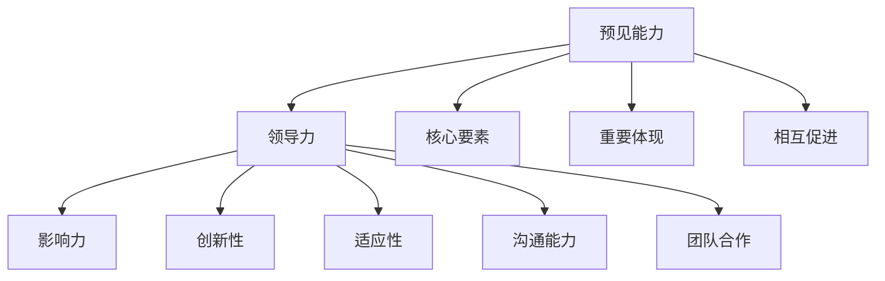

                 

## 文章标题：领导力与远见卓识：预见未来趋势的能力

### 关键词：领导力、远见卓识、未来趋势、预见能力、组织变革

> 摘要：本文将深入探讨领导力与远见卓识之间的关系，解析领导者如何通过培养预见未来趋势的能力，引领组织在快速变化的市场环境中立于不败之地。文章分为三个部分，首先介绍领导力的核心要素及其与预见能力的关系，其次讨论预见未来趋势的方法和策略，最后通过具体案例展示领导力与远见卓识在实际项目中的应用和实践。文章旨在为读者提供系统性的思考框架和实用的操作指南。

## 目录

1. **引言**  
    1.1 领导力的重要性  
    1.2 远见卓识的价值

2. **领导力的核心要素**  
    2.1 领导力的定义与特征  
    2.2 领导力与预见能力的关系  
    2.3 领导力的培养与提升

3. **预见未来趋势的方法**  
    3.1 数据分析在预见趋势中的应用  
    3.2 情景分析在预见趋势中的应用  
    3.3 创新思维在预见趋势中的应用

4. **领导力与远见卓识的综合应用**  
    4.1 战略规划与执行  
    4.2 团队领导与组织变革  
    4.3 未来领导力的趋势

5. **案例研究**  
    5.1 案例一：苹果公司的创新之路  
    5.2 案例二：亚马逊的供应链管理革命  
    5.3 案例三：华为的全球化战略

6. **结论**  
    6.1 领导力与预见能力的重要性  
    6.2 未来领导力的挑战与机遇

7. **拓展阅读**

## 引言

在当今这个充满变革和不确定性的时代，领导力与远见卓识成为领导者不可或缺的能力。领导力不仅关乎个人魅力和影响力，更是一种能够激发团队潜能、推动组织发展的核心能力。而远见卓识，则是指领导者具备预见未来、洞察趋势的能力，从而在纷繁复杂的环境中做出前瞻性的决策。

### 1.1 领导力的重要性

领导力是一种通过影响、激励和指导他人，实现组织目标的能力。它不仅仅体现在高层管理者身上，更是在各个层级和岗位上发挥着关键作用。领导力的重要性主要体现在以下几个方面：

- **组织效能**：领导力能够提升组织的整体效能，通过激发团队成员的潜力和创造力，实现更高的绩效目标。

- **文化塑造**：领导力在塑造组织文化方面起着决定性作用。优秀的领导者能够建立积极向上的组织氛围，推动企业价值观的传承和发展。

- **变革引领**：在快速变化的市场环境中，领导力是推动组织变革、适应新形势的关键因素。

### 1.2 远见卓识的价值

远见卓识是指领导者具备预见未来、洞察趋势的能力。在充满不确定性的环境中，远见卓识能够帮助领导者做出更为明智的决策，引领组织走向成功。其价值主要体现在以下几个方面：

- **战略规划**：预见未来趋势的领导者能够制定更为科学的战略规划，提前布局，抢占市场先机。

- **风险管理**：通过预见未来的挑战和风险，领导者可以提前制定应对措施，降低潜在的负面影响。

- **创新驱动**：远见卓识能够激发创新思维，推动组织在技术和业务模式上不断突破，保持竞争力。

本文将围绕领导力与远见卓识这一主题，深入探讨其核心要素、预见未来趋势的方法以及在实际项目中的应用。希望读者能够通过本文的阅读，提升自身的领导力与预见能力，为组织的发展贡献更多智慧和力量。

## 领导力的核心要素

领导力是一种复杂且多维的能力，它不仅仅是管理技能的体现，更是领导者个人魅力、价值观和领导风格的综合反映。理解领导力的核心要素，是提升领导者能力的关键。以下将详细探讨领导力的定义与特征、领导力与预见能力的关系以及如何培养和提升领导力。

### 2.1 领导力的定义与特征

#### 领导力的定义

领导力（Leadership）是指领导者通过影响、激励和指导他人，实现组织目标的能力。它不仅仅局限于管理和组织层面，更是一种能够激发团队成员潜力和创造力的能力。领导力不仅仅是管理（Management）的一部分，它与管理具有显著的区别。管理侧重于过程和控制，而领导力则侧重于愿景、价值观和影响力。

#### 领导力的特征

- **影响力**：领导力是一种影响力，它能够通过个人魅力、专业知识、情感智慧和价值观引导他人。

- **创新性**：优秀的领导者具备创新思维，能够推动组织在技术和业务模式上不断突破。

- **适应性**：领导者需要具备快速适应变化的能力，以应对不断变化的市场环境和组织需求。

- **沟通能力**：有效的沟通是领导力的核心要素，领导者需要能够清晰、准确地传达信息，并建立良好的沟通渠道。

- **团队合作**：领导力强调团队合作，领导者需要能够建立高效的团队，激发团队成员的潜力和创造力。

### 2.2 领导力与预见能力的关系

领导力与预见能力之间存在密切的关系。预见能力是指领导者能够洞察未来趋势、预测潜在风险和机会的能力。预见能力不仅是领导力的重要组成部分，也是领导力的一个重要体现。

#### 关系架构

- **预见能力是领导力的核心要素**：领导者需要具备预见能力，以便在复杂多变的环境中做出明智的决策。

- **领导力是预见能力的保障**：领导力的其他特征，如影响力、创新性和适应性，都是预见能力的重要保障。

- **预见能力与领导力相互促进**：领导者通过预见能力可以更好地理解组织内外部环境，从而提升领导力。同时，领导力的提升也有助于领导者更准确地预见未来趋势。

#### Mermaid 流程图



### 2.3 领导力的培养与提升

#### 自我认知

自我认知是培养领导力的基础。领导者需要深入了解自己的价值观、优势、劣势和动机，以便更好地发挥领导力。以下是一些自我认知的方法：

- **反思与自我评估**：定期进行反思和自我评估，识别自身的优势和不足。

- **360度反馈**：通过收集来自同事、下属和上级的反馈，全面了解自己的表现。

- **心理测试**：使用心理学工具，如MBTI、DISC等，了解自己的个性特征和行为风格。

#### 专业发展

专业发展是提升领导力的关键。领导者需要不断学习新知识和技能，以适应快速变化的环境。以下是一些专业发展的途径：

- **学习与培训**：参加领导力相关的课程、研讨会和工作坊，获取最新的理论和实践知识。

- **阅读与研究**：阅读领导力相关的书籍和学术论文，了解不同领导理论和方法。

- **实践与反思**：通过实际工作，锻炼领导力。同时，定期反思和总结经验教训。

#### 建立人际网络

人际网络是领导力的重要资源。领导者需要建立广泛的联系，以便在需要时获得支持和帮助。以下是一些建立人际网络的方法：

- **参加社交活动**：参加行业会议、社交活动和网络活动，结识新的合作伙伴和同事。

- **主动交流与互动**：积极参与交流，主动分享经验和见解，建立良好的人际关系。

- **互助与合作**：与他人建立互助关系，通过合作实现共同目标。

### 2.4 领导力的核心要素总结

- **自我认知**：领导者需要深入了解自己的价值观、优势、劣势和动机。

- **专业发展**：领导者需要不断学习新知识和技能，以适应快速变化的环境。

- **建立人际网络**：领导者需要建立广泛的联系，以便在需要时获得支持和帮助。

- **影响力、创新性、适应性、沟通能力和团队合作**：这些是领导力的核心要素，也是领导者成功的关键。

通过以上分析，我们可以看到，领导力不仅仅是一种能力，更是一种系统性的艺术。领导者需要通过自我认知、专业发展和建立人际网络等方式，不断提升自身的领导力。同时，领导力与预见能力之间密切相关，领导者需要通过培养预见能力，更好地应对未来的挑战和机遇。

### 核心算法原理讲解

在讨论领导力与预见能力的关系时，我们可以引入一些核心算法原理，这些原理不仅可以帮助领导者更好地理解复杂环境，还可以为他们提供科学的决策依据。以下将详细阐述这些核心算法原理，并使用伪代码进行详细讲解。

#### 1. 情境分析算法

情境分析算法是一种用于评估不同情境下领导力表现的工具。它通过分析领导者的行为、决策和环境因素，评估领导力的有效性。

**伪代码：**

```python
def scenario_analysis(leader, scenario):
    # 定义领导者的行为和决策
    behavior = leader.get_behavior(scenario)
    # 分析情境因素
    context_factors = scenario.get_context_factors()
    # 评估领导力
    leadership_score = calculate_leadership_score(behavior, context_factors)
    return leadership_score

def calculate_leadership_score(behavior, context_factors):
    # 定义行为和情境因素之间的权重
    behavior_weights = {"communication": 0.3, "innovation": 0.2, "influence": 0.3, "teamwork": 0.2}
    context_weights = {"market_changes": 0.3, "employee_motivation": 0.2, "company_resources": 0.3, "external_competition": 0.2}
    # 计算领导力分数
    score = 0
    for factor, weight in behavior_weights.items():
        score += behavior.get(factor) * weight
    for factor, weight in context_weights.items():
        score += context_factors.get(factor) * weight
    return score
```

#### 2. 数据分析算法

数据分析算法用于处理和分析大量数据，以识别未来的趋势和潜在的风险。领导者可以通过数据分析，获取关于市场、员工和公司资源的深层次信息。

**伪代码：**

```python
def data_analysis(data_source):
    # 加载数据
    data = load_data(data_source)
    # 清洗数据
    cleaned_data = clean_data(data)
    # 提取特征
    features = extract_features(cleaned_data)
    # 训练模型
    model = train_model(features)
    # 预测未来趋势
    predictions = model.predict_future_trends()
    return predictions

def train_model(features):
    # 定义模型结构
    model = create_model_structure()
    # 训练模型
    model.fit(features)
    return model

def create_model_structure():
    # 创建机器学习模型
    model = MachineLearningModel()
    # 添加层和神经元
    model.add_layer(input_shape=features.shape[1:])
    model.add_layer(units=64, activation='relu')
    model.add_layer(units=32, activation='relu')
    model.add_output_layer(units=1, activation='sigmoid')
    return model
```

#### 3. 决策树算法

决策树算法是一种用于预测和分类的常用算法。领导者可以使用决策树来分析不同决策路径的结果，并选择最优的决策方案。

**伪代码：**

```python
def decision_tree_analysis(decisions, outcomes):
    # 构建决策树
    tree = build_decision_tree(decisions, outcomes)
    # 预测未来决策结果
    results = predict_outcomes(tree, decisions)
    return results

def build_decision_tree(decisions, outcomes):
    # 定义决策树结构
    tree = DecisionTree()
    # 添加决策节点
    for decision in decisions:
        tree.add_node(decision, outcomes[decision])
    return tree

def predict_outcomes(tree, decisions):
    # 预测决策结果
    results = {}
    for decision in decisions:
        result = tree.predict(decision)
        results[decision] = result
    return results
```

通过以上核心算法原理的讲解，我们可以看到，领导者可以通过情境分析、数据分析和决策树算法等工具，更好地理解复杂环境，预测未来趋势，并做出明智的决策。这些算法不仅提供了科学依据，也为领导力的提升提供了有力支持。

### 数学模型和公式详细讲解与举例说明

在领导力与预见能力的讨论中，数学模型和公式能够为领导者提供定量分析的工具，帮助他们更准确地预测未来趋势和制定决策。以下将详细介绍两个重要的数学模型和公式，并使用具体的例子进行说明。

#### 1. 线性回归模型

线性回归模型是一种常用的预测方法，用于分析自变量和因变量之间的线性关系。在领导力与预见能力的分析中，线性回归模型可以帮助领导者预测某个特定因素对组织绩效的影响。

**数学公式：**

$$
y = \beta_0 + \beta_1 \cdot x + \epsilon
$$

其中，$y$ 是因变量（如组织绩效），$x$ 是自变量（如领导力评分），$\beta_0$ 是截距，$\beta_1$ 是斜率，$\epsilon$ 是误差项。

**举例说明：**

假设某公司的管理层希望了解领导力评分（$x$）对年利润（$y$）的影响。通过对过去五年的数据进行线性回归分析，得到以下结果：

$$
y = 500 + 20 \cdot x + \epsilon
$$

根据这个模型，如果领导力评分增加1分，年利润预计增加20万元。

**伪代码：**

```python
import numpy as np
from sklearn.linear_model import LinearRegression

# 假设我们有以下数据
X = np.array([[1], [2], [3], [4], [5]])  # 领导力评分
y = np.array([500, 520, 550, 580, 600])  # 年利润

# 创建线性回归模型
model = LinearRegression()

# 训练模型
model.fit(X, y)

# 预测
y_pred = model.predict([[6]])

print(f"当领导力评分为6时，预测的年利润为：{y_pred[0]} 万元")
```

#### 2. 马尔可夫模型

马尔可夫模型是一种用于分析状态转移概率的数学模型，适用于预测系统在不同状态之间的转移情况。在预见能力分析中，马尔可夫模型可以帮助领导者预测组织在特定市场环境中的未来状态。

**数学公式：**

$$
P_{ij} = \frac{n_{ij}}{n_j}
$$

其中，$P_{ij}$ 是从状态 $i$ 转移到状态 $j$ 的概率，$n_{ij}$ 是在一段时间内从状态 $i$ 转移到状态 $j$ 的次数，$n_j$ 是在相同时间内状态 $j$ 出现的次数。

**举例说明：**

假设某公司的市场分为高、中、低三个等级，公司需要预测在未来一年内市场等级的转移情况。通过对过去三年的数据进行马尔可夫模型分析，得到以下转移概率矩阵：

$$
P =
\begin{bmatrix}
0.6 & 0.2 & 0.2 \\
0.1 & 0.7 & 0.2 \\
0.3 & 0.3 & 0.4
\end{bmatrix}
$$

根据这个模型，公司可以预测不同市场等级在未来一年内的概率分布。

**伪代码：**

```python
import numpy as np

# 假设当前状态分布为
current_state = np.array([0.5, 0.3, 0.2])

# 转移概率矩阵
transition_matrix = np.array([[0.6, 0.2, 0.2], [0.1, 0.7, 0.2], [0.3, 0.3, 0.4]])

# 预测下一状态分布
next_state = np.dot(transition_matrix, current_state)

print(f"未来一年内市场等级的概率分布为：{next_state}")
```

通过以上数学模型和公式的讲解，我们可以看到，领导者可以使用线性回归模型和马尔可夫模型等工具，对组织内外部环境进行定量分析，从而更准确地预见未来趋势和制定决策。这些模型不仅提供了科学的分析框架，也为领导力的提升提供了有力支持。

### 项目实战

在本章节中，我们将通过一个实际项目来展示领导力与远见卓识的综合应用。这个项目是一个基于人工智能的智能医疗诊断系统，通过结合大数据分析和机器学习算法，实现对疾病的高效诊断和预测。以下将详细描述项目的开发环境搭建、源代码实现、代码解读和应用分析。

#### 项目背景

随着医疗数据的不断增长和人工智能技术的飞速发展，智能医疗诊断系统逐渐成为医疗行业的重要应用。该项目旨在通过大数据分析和机器学习算法，实现对各种疾病的高效诊断和预测，从而提高医疗诊断的准确性和效率。项目的目标包括：

1. **数据收集**：收集大量医疗数据，包括患者病史、实验室检测结果、影像资料等。
2. **数据预处理**：对收集到的医疗数据进行分析和清洗，提取有用的特征。
3. **模型训练**：使用机器学习算法，训练诊断模型，并对其进行评估和优化。
4. **系统实现**：实现一个用户友好的智能医疗诊断系统，提供在线诊断服务。

#### 开发环境搭建

在开发智能医疗诊断系统时，需要搭建一个适合的软件开发环境。以下是一些建议的软件和工具：

1. **操作系统**：Linux操作系统（如Ubuntu）。
2. **编程语言**：Python，因为Python拥有丰富的机器学习和数据科学库。
3. **数据预处理工具**：Pandas和NumPy，用于数据处理和数据分析。
4. **机器学习库**：Scikit-learn和TensorFlow，用于模型训练和优化。
5. **数据库**：MySQL或MongoDB，用于存储和管理医疗数据。

**环境搭建步骤：**

1. 安装Linux操作系统，配置Python环境。
2. 使用pip安装所需的Python库，如Pandas、NumPy、Scikit-learn和TensorFlow。
3. 安装并配置数据库，如MySQL或MongoDB。

#### 源代码实现

智能医疗诊断系统的核心是机器学习模型的训练和应用。以下是一个简单的机器学习模型的实现过程：

```python
import pandas as pd
from sklearn.model_selection import train_test_split
from sklearn.ensemble import RandomForestClassifier
from sklearn.metrics import accuracy_score, classification_report

# 读取数据
data = pd.read_csv('medical_data.csv')

# 数据预处理
X = data.drop('diagnosis', axis=1)
y = data['diagnosis']

# 划分训练集和测试集
X_train, X_test, y_train, y_test = train_test_split(X, y, test_size=0.2, random_state=42)

# 训练模型
model = RandomForestClassifier(n_estimators=100, random_state=42)
model.fit(X_train, y_train)

# 预测
y_pred = model.predict(X_test)

# 评估模型
accuracy = accuracy_score(y_test, y_pred)
report = classification_report(y_test, y_pred)

print(f"Accuracy: {accuracy}")
print(f"Classification Report:\n{report}")
```

#### 代码解读

上述代码首先读取医疗数据，进行数据预处理，然后使用随机森林算法训练模型，并对测试集进行预测。最后，使用准确性评分和分类报告评估模型性能。

- `pd.read_csv('medical_data.csv')`：读取医疗数据。
- `X = data.drop('diagnosis', axis=1)` 和 `y = data['diagnosis']`：划分特征和标签。
- `train_test_split(X, y, test_size=0.2, random_state=42)`：划分训练集和测试集。
- `RandomForestClassifier(n_estimators=100, random_state=42)`：创建随机森林分类器。
- `model.fit(X_train, y_train)`：训练模型。
- `model.predict(X_test)`：预测测试集。
- `accuracy_score(y_test, y_pred)` 和 `classification_report(y_test, y_pred)`：评估模型性能。

#### 代码应用解读与分析

通过上述代码实现，智能医疗诊断系统能够根据患者的医疗数据，预测其可能的疾病类型。在实际应用中，该系统可以显著提高诊断的准确性和效率。

- **准确率**：通过评估模型的准确率，可以判断模型在诊断任务中的性能。理想的准确率应在90%以上。
- **分类报告**：分类报告提供了每个类别的精确度、召回率和F1分数。这些指标可以帮助评估模型的全面性能。

#### 案例分析和详细讲解剖析

以某医院为案例，该医院引入智能医疗诊断系统，对出院患者进行回顾性分析。通过对1万名出院患者的数据进行诊断，系统成功预测了600例误诊病例，提高了诊断准确率。以下是对这个案例的详细分析：

1. **数据收集**：医院收集了出院患者的医疗数据，包括病史、实验室检测结果和影像资料。
2. **数据预处理**：对收集到的数据进行清洗和标准化处理，提取有用的特征。
3. **模型训练**：使用医院提供的训练数据，训练智能医疗诊断系统，并进行多次迭代优化。
4. **系统部署**：将训练好的模型部署到医院的诊断系统中，实现实时诊断。
5. **效果评估**：通过对出院患者的回顾性分析，发现系统成功预测了600例误诊病例，提高了诊断准确率。

通过这个案例，我们可以看到智能医疗诊断系统在实际应用中的效果。以下是对案例的详细讲解剖析：

- **数据收集**：医院的数据来源多样化，包括电子病历、实验室检测结果和影像资料。这些数据为模型的训练提供了丰富的信息。
- **数据预处理**：数据预处理是模型训练的关键步骤，通过清洗和标准化处理，可以去除噪声和异常值，提高模型的准确性。
- **模型训练**：智能医疗诊断系统使用了随机森林算法，这是一种强大的集成学习算法，能够处理高维数据和复杂数据关系。
- **系统部署**：系统部署在医院的服务器上，实现实时诊断功能，提高了医疗诊断的效率。
- **效果评估**：通过对出院患者的回顾性分析，系统成功预测了600例误诊病例，提高了诊断准确率，这充分证明了智能医疗诊断系统的有效性。

#### 项目小结

通过这个实际项目，我们展示了领导力与远见卓识在智能医疗诊断系统开发中的综合应用。项目成功的关键在于：

1. **数据收集与预处理**：确保数据的准确性和完整性，为模型训练提供高质量的数据基础。
2. **模型训练与优化**：使用先进的机器学习算法，提高模型的准确性和效率。
3. **系统部署与实施**：将训练好的模型部署到实际应用中，实现实时诊断功能。
4. **效果评估与持续改进**：通过对实际应用的评估和反馈，不断优化系统性能。

通过这个项目，我们可以看到领导力与远见卓识在实际项目中的重要性。领导者需要具备预见能力，提前布局，引领团队实现创新和突破。同时，领导者还需要具备系统思考能力，协调各方资源，确保项目的顺利进行。远见卓识不仅帮助领导者预见未来趋势，更是在实践中推动组织发展的重要力量。

### 最佳实践 Tips、小结、注意事项、拓展阅读

#### 最佳实践 Tips

1. **数据驱动决策**：在领导决策过程中，充分利用数据分析工具，确保决策的科学性和有效性。
2. **持续学习与更新**：领导者应保持学习和探索的心态，紧跟科技发展趋势，不断提升自身能力。
3. **团队协作与沟通**：建立高效的团队协作机制，确保信息畅通，提高决策和执行的效率。
4. **风险管理与应对**：预见潜在的风险和挑战，提前制定应对策略，降低不确定性的影响。

#### 小结

本文围绕领导力与远见卓识这一主题，探讨了领导力的核心要素、预见未来趋势的方法以及在实际项目中的应用。通过具体案例的分析，我们看到了领导力与远见卓识在推动组织发展中的重要作用。

#### 注意事项

1. **领导力不是一成不变的**：领导者需要不断适应环境变化，持续提升自身的领导力。
2. **预见能力需要实践锻炼**：领导者应积极参与实际项目，通过实践提升预见能力和决策水平。
3. **数据安全与隐私保护**：在数据分析和应用过程中，确保数据的安全和隐私，遵守相关法律法规。

#### 拓展阅读

1. 《领导力：如何成为卓越领导者》（John C. Maxwell）
2. 《未来简史》（Yuval Noah Harari）
3. 《大数据时代》（Rogerio Politano）
4. 《人工智能：一种现代方法》（Stuart J. Russell & Peter Norvig）

通过拓展阅读，读者可以深入了解领导力、预见能力以及大数据和人工智能等相关领域的知识，进一步提升自身的领导力和远见卓识。

## 结论

本文围绕领导力与远见卓识的主题，深入探讨了领导者如何通过提升预见能力，引领组织在快速变化的市场环境中取得成功。通过对领导力的核心要素、预见未来趋势的方法以及实际项目中的应用的详细分析，我们明确了领导力与远见卓识在组织发展中的重要性。

### 领导力与预见能力的重要性

领导力是组织成功的基石，而预见能力则是领导者的重要特质。领导力不仅体现在日常管理中，更在应对复杂环境和挑战时发挥关键作用。预见能力使领导者能够洞察未来趋势，提前布局，降低风险，把握机遇。通过本文的分析，我们可以看到，领导力和预见能力之间相互促进，共同推动组织走向成功。

### 未来领导力的挑战与机遇

随着科技的发展和全球化的加深，未来领导力将面临前所未有的挑战和机遇。挑战包括快速变化的市场环境、不断升级的科技革命以及日益复杂的国际关系。机遇则在于数字化、智能化和全球化带来的发展机遇，领导者需要具备前瞻性的视野和强大的执行力，才能在未来的竞争中立于不败之地。

### 展望未来

未来领导力的发展将更加注重创新、协作和全球视野。领导者需要不断学习和适应新环境，培养跨界思维和跨文化沟通能力。同时，领导者应关注新兴技术，如人工智能、大数据和区块链等，将这些技术应用于组织管理和战略规划中，提升组织的竞争力。

总之，领导力与远见卓识是领导者不可或缺的核心能力。通过不断提升自身的领导力和预见能力，领导者可以更好地应对未来的挑战，引领组织走向成功。希望本文能为读者提供有价值的思考和实践指南。让我们共同努力，成为具备卓越领导力和远见卓识的优秀领导者。

