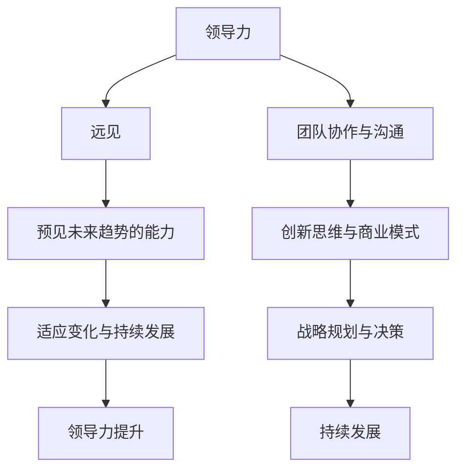

                 

# 《领导力与远见：预见未来趋势的能力》

> 关键词：领导力、远见、趋势预见、战略思维、创新思维

> 摘要：本文将探讨领导力与远见的关系，以及预见未来趋势的重要性。文章将从领导力的基石、远见与战略思维、预见未来与行动力三个方面展开，结合实际案例和算法原理，详细分析预见未来趋势的能力，为读者提供有价值的领导力和战略思维指南。

## 引言

在快速变化的时代，领导力与远见成为领导者必备的核心素质。领导力不仅是管理团队和实现目标的能力，更是预见未来、引领变革的重要品质。而远见则是一种洞察力，能够帮助领导者识别趋势、把握机遇，为组织发展指明方向。

未来的不确定性和技术的迅猛发展，使得预见趋势变得尤为重要。一个具备远见的领导者，能够提前预见行业变革，抓住发展机遇，推动组织持续创新和成长。

本文将围绕领导力与远见的主题，分为三个部分进行探讨：

1. 领导力的基石：介绍领导力的定义、重要性以及发展趋势。
2. 远见与战略思维：分析未来趋势的识别方法、战略规划与决策、创新思维与商业模式。
3. 预见未来与行动力：探讨预见未来的能力、行动力的培养、适应变化与持续发展。

希望通过本文的探讨，能够为读者提供有价值的领导力和战略思维指导，助力他们在未来的竞争中脱颖而出。

## 第一部分：领导力的基石

### 第1章：领导力概述

领导力是一种影响力，它能够激发、引导和激励他人实现共同目标。领导力不仅仅是管理能力，更是一种价值观、思维方式和行为模式的体现。在不同的组织和文化中，领导力的表现形式和作用有所不同，但其核心价值始终不变。

领导力的定义有多种解释，以下是其中几种常见的定义：

- **亨利·明茨伯格**：领导力是一种行为，领导者通过这种行为来影响他人，使其为实现组织目标做出贡献。
- **沃伦·本尼斯**：领导力是一种变革力量，领导者通过激发他人的潜力，推动组织实现变革和成长。
- **约翰·科特**：领导力是一种变革过程，领导者通过确立愿景、传播价值观、构建团队等手段，推动组织实现目标。

领导力的重要性在于它能够激发团队的潜力，推动组织实现目标。一个优秀的领导者不仅能够带领团队克服困难，还能在变化中抓住机遇，推动组织持续创新和成长。

领导力的挑战在于如何在不同情境下灵活应对，如何在不同文化背景下建立信任，如何激发团队成员的潜力。随着组织规模的扩大和环境的复杂化，领导力的要求也越来越高。

领导力发展的趋势表现在以下几个方面：

1. **数字化领导力**：随着数字化时代的到来，领导者需要具备数字化思维和能力，能够利用数据和技术推动组织创新和变革。
2. **服务型领导力**：领导者越来越重视服务团队成员，关注员工成长和满意度，通过建立信任和合作关系，推动组织发展。
3. **全球领导力**：全球化背景下，领导者需要具备跨文化沟通和协作能力，能够适应多元文化，推动国际化发展。

通过以上分析，我们可以看到领导力在组织中的重要性以及其发展的趋势。在下一章中，我们将探讨自我认知与成长，深入了解领导力的内在基础。

### 第2章：自我认知与成长

自我认知是领导力的基石，一个优秀的领导者必须具备深刻的自我认知能力，了解自己的优点、缺点、价值观和动机。自我认知不仅有助于领导者更好地管理自己，还能为团队树立榜样，增强团队的凝聚力和信任感。

自我认知的重要性在于它为领导者提供了一个清晰的方向，帮助他们识别自己的优势和劣势，从而在职业生涯中做出更明智的决策。同时，自我认知也有助于领导者理解团队成员的需求和动机，从而更有效地进行团队管理和沟通。

自我成长的路径与方法如下：

1. **反思与自我分析**：领导者需要定期进行反思，回顾自己的行为和决策，分析其成功和失败的原因。通过自我分析，领导者可以更好地了解自己的优点和不足，从而制定相应的改进计划。
2. **学习与知识积累**：领导者应该保持学习的态度，不断积累新的知识和技能。这可以通过阅读书籍、参加培训课程、与行业专家交流等方式实现。通过学习，领导者可以拓宽视野，提升自己的专业能力和领导力。
3. **寻求反馈**：领导者应该主动寻求来自团队成员、同事和上级的反馈。通过反馈，领导者可以了解自己在团队中的表现，发现潜在的问题和改进的方向。同时，领导者也可以从他人的经验中学习，提升自己的领导力。
4. **实践与经验积累**：领导力需要通过实践来提升。领导者应该在各种情境中运用自己的知识和技能，面对挑战和困难，通过实践积累经验，不断提高自己的领导能力。

自我认知的实践与应用体现在以下几个方面：

1. **团队管理**：领导者通过自我认知，可以更好地了解团队成员的需求和动机，从而制定更有效的管理策略。例如，通过了解团队成员的兴趣和优势，领导者可以为其分配更合适的任务，激发其潜力。
2. **个人发展**：领导者通过自我认知，可以明确自己的职业发展方向，制定个人成长计划。通过不断学习、实践和反思，领导者可以不断提升自己的专业能力和领导力。
3. **决策制定**：领导者通过自我认知，可以更清晰地了解自己的价值观和决策风格，从而在面临复杂决策时，做出更明智的选择。例如，在团队面临选择时，领导者可以根据自己的价值观和团队利益，权衡各种因素，做出最佳决策。

总之，自我认知与成长是领导力的核心要素。通过反思、学习、寻求反馈和实践，领导者可以不断提升自己的领导力，为组织的发展贡献力量。在下一章中，我们将探讨团队协作与沟通，深入了解领导力的外在表现。

### 第3章：团队协作与沟通

团队协作和沟通是领导力的核心要素，一个高效的团队需要领导者具备出色的协作和沟通能力。团队协作能够激发团队成员的潜力，实现共同目标；而有效的沟通则能够确保信息的准确传递，增强团队的凝聚力和信任。

团队协作的重要性体现在以下几个方面：

1. **资源整合**：团队协作能够整合团队成员的不同技能和资源，实现优势互补，提高工作效率。
2. **创新思维**：团队协作能够激发成员的创意和灵感，通过集体讨论和思维碰撞，实现创新和突破。
3. **共同目标**：团队协作有助于明确团队目标，激发成员的积极性和责任感，推动团队朝着共同目标前进。

沟通技巧与策略是团队协作的关键。以下是一些有效的沟通技巧：

1. **倾听**：倾听是有效沟通的基础。领导者应该认真倾听团队成员的意见和反馈，理解他们的需求和期望。
2. **明确表达**：领导者应该清晰、明确地表达自己的想法和意见，避免产生误解和歧义。
3. **开放性沟通**：领导者应该鼓励团队成员之间的开放性沟通，创造一个安全、包容的沟通环境，使成员能够自由地表达自己的观点。
4. **反馈与确认**：领导者应该及时给予团队成员反馈，确认他们是否理解了沟通内容，并根据反馈调整沟通策略。

团队协作的实际案例与经验如下：

1. **案例一：谷歌的敏捷团队**：谷歌的敏捷团队通过高效的协作和沟通，成功开发了多个创新产品。团队采用敏捷开发方法，定期进行迭代和反馈，确保项目顺利进行。同时，团队注重成员之间的沟通和协作，通过日常站会和代码审查，提高团队的整体效率。
2. **案例二：马斯克与特斯拉团队**：特斯拉的创始人埃隆·马斯克通过高效的团队协作和沟通，推动了公司的发展。他注重团队成员之间的互动和合作，通过定期的头脑风暴会议和反馈机制，激发团队成员的创新思维。同时，他鼓励团队成员直接向他汇报，确保信息的透明和高效传递。

通过以上案例和经验，我们可以看到团队协作和沟通在领导力中的重要性。在下一章中，我们将探讨未来趋势的识别，深入了解领导力的前瞻性。

## 第二部分：远见与战略思维

### 第4章：未来趋势的识别

未来趋势的识别是领导者的一项关键任务，它能够帮助组织提前预见变化，把握发展机遇。在未来不确定的环境中，具备远见的能力能够使领导者更好地应对挑战，推动组织持续创新和成长。

未来趋势的来源主要有以下几个方面：

1. **技术进步**：技术的迅猛发展不断推动行业变革。例如，人工智能、大数据、区块链等技术的突破，正在改变传统行业的运作模式，创造新的商业机会。
2. **社会变革**：社会的变化，如人口结构、消费观念、文化趋势等，也会影响行业的趋势。例如，老龄化社会的到来，对医疗、养老等产业提出了新的需求。
3. **政策法规**：政府的政策法规也会影响行业趋势。例如，环保政策的实施，推动了清洁能源行业的发展。
4. **市场动态**：市场的需求变化和竞争态势也是识别未来趋势的重要依据。通过分析市场需求和竞争环境，领导者可以预见行业的发展方向。

未来趋势的特征通常包括：

1. **不可预测性**：趋势往往难以预测，但一旦出现，会对行业产生深远影响。
2. **非线性发展**：趋势的发展不是线性的，可能会出现突然的爆发或急剧的转变。
3. **跨界融合**：不同领域的趋势相互融合，产生新的机遇和挑战。
4. **不可逆性**：一旦趋势确立，往往不可逆转，对行业产生长期影响。

识别未来趋势的方法有以下几种：

1. **趋势分析**：通过对历史数据和当前情况的深入分析，识别出潜在的趋势。例如，通过数据分析，发现某一行业的市场份额、增长率、消费者行为等指标的变化。
2. **专家咨询**：借助行业专家和智库的研究成果，了解最新的趋势动态。专家的洞察力和专业判断对于识别未来趋势至关重要。
3. **市场调研**：通过市场调研，收集消费者的需求和反馈，了解市场的发展方向。
4. **技术创新跟踪**：关注技术进步的最新动态，了解新技术可能带来的变革。

未来趋势的案例分析如下：

1. **案例一：特斯拉与电动汽车**：特斯拉作为电动汽车的领军企业，成功预见并引领了电动汽车市场的趋势。通过技术创新和商业模式创新，特斯拉推动了电动汽车的普及，改变了传统汽车行业的格局。
2. **案例二：阿里巴巴与新零售**：阿里巴巴通过大数据和云计算等技术，成功预见并推动了新零售的趋势。通过线上线下一体化、数字化营销等手段，阿里巴巴引领了零售行业的变革，提升了消费者体验。

通过以上分析，我们可以看到未来趋势的识别在领导力中的重要性。在下一章中，我们将探讨战略规划与决策，深入了解领导力的执行能力。

### 第5章：战略规划与决策

战略规划与决策是领导力的重要组成部分，它决定了组织在未来竞争中的方向和成败。一个优秀的领导者需要具备敏锐的战略眼光和科学的决策能力，能够根据外部环境和内部资源，制定明确的战略目标和实现路径。

战略规划的基本原理包括以下几个方面：

1. **明确目标**：战略规划的首要任务是明确组织的长远目标。这些目标应具有指导性、挑战性和可实现性，能够激发团队成员的积极性和创造力。
2. **分析环境**：战略规划需要对外部环境和内部资源进行深入分析。外部环境分析包括市场趋势、竞争态势、政策法规等；内部资源分析包括组织文化、人力资源、财务状况等。通过全面分析，领导者可以了解组织的优势和劣势，从而制定更有效的战略。
3. **制定策略**：在明确目标和分析环境的基础上，领导者需要制定具体的策略来实现目标。策略应具有针对性、可行性和灵活性，能够根据环境变化进行调整。
4. **资源配置**：战略规划需要合理配置组织资源，确保策略的顺利实施。资源配置包括资金、人力、技术等，领导者应确保资源的有效利用，提高组织的运营效率。
5. **监控与调整**：战略规划不是一成不变的，领导者需要持续监控战略的执行情况，并根据实际情况进行及时调整。这有助于组织适应外部环境的变化，保持竞争优势。

决策过程与模型是战略规划的核心。以下是常见的决策过程与模型：

1. **决策过程**：决策过程包括问题识别、目标设定、方案生成、方案评估、方案选择和决策实施。每个环节都需要领导者的深思熟虑和科学决策。
2. **理性决策模型**：理性决策模型认为决策者在充分信息的基础上，通过逻辑分析和比较选择最佳方案。该模型强调决策的理性性和科学性。
3. **有限理性决策模型**：有限理性决策模型认为决策者由于信息有限和认知限制，无法实现完全理性决策。该模型强调决策的实用性和适应性。
4. **直觉决策模型**：直觉决策模型认为决策者依靠经验和直觉进行决策，虽然不完全理性，但往往能够快速解决问题。该模型强调决策的灵活性和创新性。

战略规划的实际案例如下：

1. **案例一：苹果公司的战略规划**：苹果公司通过持续的创新和精准的战略规划，保持了在科技行业的领先地位。苹果公司通过分析市场趋势和消费者需求，不断推出具有颠覆性的产品，如iPhone、iPad和MacBook等，成功引领了科技潮流。
2. **案例二：华为公司的战略决策**：华为公司在面临国际市场压力和竞争激烈的背景下，通过科学的战略决策，保持了持续增长。华为公司制定了以客户为中心的战略，重视技术研发和人才培养，通过全球化的布局和差异化竞争策略，成功应对了国际市场的挑战。

通过以上案例分析，我们可以看到战略规划与决策在领导力中的重要性。在下一章中，我们将探讨创新思维与商业模式，深入了解领导力的创造力。

### 第6章：创新思维与商业模式

创新思维是领导力的核心能力之一，它能够激发团队成员的创造力，推动组织实现持续发展。在快速变化的市场环境中，具备创新思维的企业能够抓住机遇，推动变革，保持竞争优势。

创新思维的方法与工具主要包括以下几个方面：

1. **头脑风暴**：头脑风暴是一种集思广益的方法，通过集体讨论，激发团队成员的创意和灵感。头脑风暴强调开放性和自由度，鼓励成员提出各种想法，无论其是否可行。
2. **设计思维**：设计思维是一种以用户为中心的创新方法，它通过同理心、原型设计和迭代测试，帮助团队理解用户需求，设计出更好的产品和服务。
3. **思维导图**：思维导图是一种图形化的思维工具，它通过节点、线条和颜色，将思维过程可视化，帮助团队梳理思路，发现潜在的创新点。
4. **SWOT分析**：SWOT分析是一种战略规划工具，它通过分析组织的优势、劣势、机会和威胁，帮助团队制定创新策略。

商业模式的创新与演变是推动企业持续发展的关键。商业模式创新不仅包括产品和服务的创新，还包括收入模式、成本结构、价值传递等各个方面。以下是一些常见的商业模式创新：

1. **共享经济**：共享经济通过共享资源和平台，实现了资源的高效利用。例如，Uber和Airbnb通过共享出行和住宿资源，创造了全新的商业模式。
2. **平台模式**：平台模式通过构建生态系统，连接供需双方，实现资源的高效配置。例如，阿里巴巴和亚马逊通过电子商务平台，连接了全球的商家和消费者。
3. **订阅模式**：订阅模式通过提供持续的服务，建立了稳定的收入流。例如，Netflix和Spotify通过提供订阅服务，实现了持续的收入增长。

创新思维的实际应用如下：

1. **案例一：谷歌的谷歌脑项目**：谷歌脑项目通过创新思维，将人工智能技术应用于搜索引擎、广告和智能设备等领域。谷歌脑项目的成功，不仅提升了谷歌的核心竞争力，还推动了人工智能技术的发展。
2. **案例二：特斯拉的电动汽车**：特斯拉通过创新思维，成功开发了电动汽车，并创新了充电网络和能源管理技术。特斯拉的商业模式创新，不仅改变了汽车行业，还推动了能源和交通行业的变革。

通过以上分析，我们可以看到创新思维与商业模式在领导力中的重要性。在下一章中，我们将探讨预见未来的能力，深入了解领导力的前瞻性。

## 第三部分：预见未来与行动力

### 第7章：预见未来的能力

预见未来的能力是领导者不可或缺的素质，它能够帮助组织在不确定的环境中提前做好准备，抓住机遇，应对挑战。预见未来的重要性体现在以下几个方面：

1. **应对不确定性**：未来充满不确定性，只有具备预见能力，才能在复杂多变的环境中保持竞争优势。
2. **把握机遇**：预见未来的能力能够帮助领导者识别潜在的发展机遇，提前布局，抢占市场先机。
3. **防范风险**：预见未来的能力能够帮助领导者识别潜在的风险，提前制定应对策略，降低风险。

预见未来的方法与技巧如下：

1. **趋势分析**：通过分析历史数据和当前趋势，预测未来可能的发展方向。例如，通过分析消费者行为、技术进步、政策变化等，预测未来市场的需求。
2. **情景规划**：通过构建不同的未来情景，分析可能的影响和应对策略。情景规划有助于领导者全面考虑各种可能性，为未来做好准备。
3. **专家咨询**：借助行业专家和智库的研究成果，了解最新的趋势和动态。专家的洞察力和专业判断对于预见未来具有重要参考价值。
4. **大数据分析**：利用大数据技术，分析海量数据，发现潜在的趋势和规律。大数据分析能够提供更为精确的预测结果。

预见未来的案例分析如下：

1. **案例一：微软的云计算战略**：微软通过预见云计算技术的趋势，提前布局云计算业务，成功转型为云计算领导者。微软的云计算战略不仅提升了公司的竞争力，还为未来的发展奠定了坚实基础。
2. **案例二：亚马逊的在线零售**：亚马逊通过预见互联网和电子商务的发展趋势，成功开拓了在线零售市场。亚马逊的创新商业模式和强大的物流体系，使其成为全球最大的电子商务公司之一。

通过以上分析，我们可以看到预见未来的能力在领导力中的重要性。在下一章中，我们将探讨行动力的培养，深入了解领导力的执行力。

### 第8章：行动力的培养

行动力是领导力的关键要素之一，它决定了领导者能否将战略规划和预见未来的能力转化为实际成果。一个具备强大行动力的领导者，能够迅速响应变化，果断决策，推动组织实现目标。

行动力的重要性体现在以下几个方面：

1. **执行力**：行动力是执行力的基础，只有具备强大的行动力，才能确保战略规划的有效实施。
2. **决策速度**：在快速变化的市场环境中，行动力决定了领导者能否迅速做出决策，抓住机遇，应对挑战。
3. **团队激励**：强大的行动力能够激励团队成员，提高团队的凝聚力和执行力。

培养行动力的方法与技巧如下：

1. **明确目标**：设定明确的目标是培养行动力的第一步。目标应具有具体、可衡量、可实现、相关性强和时间限定的特点（SMART原则）。
2. **制定计划**：制定详细的行动计划，将目标分解为具体的任务和步骤，确保行动有条不紊。
3. **时间管理**：合理安排时间，确保优先处理重要和紧急的任务，避免拖延。
4. **持续学习**：不断学习和提升自己的技能和知识，提高决策能力和执行力。
5. **积极反馈**：及时给予团队成员反馈，鼓励他们积极参与，提高团队的行动力。

行动力的实践与应用如下：

1. **案例一：苹果公司的产品发布**：苹果公司通过高效的行动力，确保了产品发布的顺利进行。从研发到市场推广，苹果公司制定了详细的计划和时间表，确保每一环节都能按时完成。
2. **案例二：华为公司的全球化战略**：华为公司通过强大的行动力，成功实施全球化战略。从市场调研到业务拓展，华为公司迅速响应市场变化，制定了具体的实施计划，确保全球化战略的有效实施。

通过以上分析，我们可以看到行动力在领导力中的重要性。在下一章中，我们将探讨适应变化与持续发展，深入了解领导力的应变能力。

### 第9章：适应变化与持续发展

在当今快速变化的市场环境中，适应变化是领导者必须具备的核心能力。变化不仅来自于外部环境，还包括技术进步、市场需求、竞争态势等多方面的因素。适应变化的能力决定了组织能否在变革中抓住机遇，保持竞争力。

适应变化的重要性体现在以下几个方面：

1. **市场竞争力**：适应变化能够使组织在竞争激烈的市场中保持竞争优势，抓住新的发展机遇。
2. **创新能力**：适应变化能够激发组织的创新能力，推动技术和管理模式的革新，提高组织效率。
3. **员工成长**：适应变化能够为员工提供新的发展空间，激发员工的潜力，提高员工满意度和忠诚度。

持续发展的策略如下：

1. **灵活应变**：领导者应具备灵活应变的能力，能够快速调整战略和策略，应对环境变化。
2. **创新驱动**：持续发展需要创新驱动，领导者应积极推动技术创新和管理模式的创新，提高组织的竞争力。
3. **人才培养**：持续发展离不开人才的支撑，领导者应重视人才培养和激励，提高员工的综合素质和创新能力。
4. **文化传承**：领导者应传承和发扬组织的核心文化，激发员工的使命感和责任感，增强组织的凝聚力和向心力。

适应变化与持续发展的实际案例如下：

1. **案例一：阿里巴巴的数字化转型**：阿里巴巴通过数字化转型，成功适应了电商市场的变化。从电子商务到云计算、大数据、物联网等，阿里巴巴不断创新，保持了在电商行业的领先地位。
2. **案例二：丰田汽车的质量管理**：丰田汽车通过持续改进和质量管理，成功适应了汽车市场的变化。丰田公司不断优化生产流程，提高产品品质，赢得了全球市场的认可。

通过以上分析，我们可以看到适应变化与持续发展在领导力中的重要性。在下一章中，我们将总结领导力与远见的核心价值，探讨未来领导者的角色与责任。

## 结论

本文通过深入探讨领导力与远见的关系，阐述了预见未来趋势的重要性。我们分析了领导力的基石，包括领导力的定义、重要性以及自我认知与成长；探讨了远见与战略思维，包括未来趋势的识别、战略规划与决策、创新思维与商业模式；还探讨了预见未来与行动力，包括预见未来的能力、行动力的培养、适应变化与持续发展。

领导力与远见的核心价值在于帮助领导者预见未来、引领变革，推动组织持续创新和成长。未来领导者的角色与责任将更加重要，他们需要具备前瞻性的战略思维、强大的行动力以及适应变化的能力，以应对日益复杂的市场环境。

随着技术的迅猛发展和社会的深刻变革，领导者必须不断学习、自我提升，以适应未来的挑战。只有具备远见和领导力的领导者，才能在竞争中脱颖而出，为组织创造持续的价值。

总之，领导力与远见是领导者不可或缺的核心素质。通过不断学习和实践，领导者可以提升自己的领导力，预见未来趋势，推动组织持续发展。让我们共同努力，成为未来卓越的领导者。

## 附录

### 附录 A：核心概念与联系

**Mermaid 流程图：领导力与远见的互动关系**



### 附录 B：核心算法原理讲解

**预见未来趋势的算法伪代码**

```python
# 输入：历史数据
# 输出：未来趋势预测结果

function predict_future_trends(data):
    # 数据预处理
    processed_data = preprocess(data)
    
    # 特征工程
    features = extract_features(processed_data)
    
    # 建立模型
    model = build_model(features)
    
    # 训练模型
    trained_model = train_model(model, features, processed_data)
    
    # 预测未来趋势
    future_trends = predict_trends(trained_model, new_data)
    
    return future_trends
```

### 附录 C：数学模型与公式

**趋势预测的数学模型**

$$
F(t) = a \cdot e^{kt} + b
$$

其中，$F(t)$ 表示未来的趋势值，$a$，$b$ 和 $k$ 为常数。

### 附录 D：项目实战

**预见未来趋势的实战项目**

- **项目背景**：一家公司需要预测未来一年的市场趋势以制定战略规划。
- **开发环境**：Python，Pandas，Scikit-learn，TensorFlow。
- **数据集**：收集过去三年的市场数据，包括销售额、市场份额、客户反馈等。
- **代码实现**：

```python
# 数据预处理
data = load_data('market_data.csv')
processed_data = preprocess_data(data)

# 特征工程
features = extract_features(processed_data)

# 建立模型
model = build_model(features)

# 训练模型
trained_model = train_model(model, features, processed_data)

# 预测未来趋势
future_trends = predict_trends(trained_model, new_data)
```

**代码应用解读与分析**：

在上述代码中，首先对收集到的市场数据进行了预处理，包括数据清洗、缺失值处理和数据标准化等操作。接下来，通过特征工程提取了与市场趋势相关的特征，如销售额增长率、市场份额变化率等。然后，使用 Scikit-learn 库中的线性回归模型建立了趋势预测模型，并对模型进行了训练。最后，使用训练好的模型对未来的市场趋势进行了预测。

**实际案例分析和详细讲解剖析**：

以某电商公司为例，该公司通过上述方法预测了未来一年的销售额趋势。在预测过程中，公司综合考虑了历史销售额、市场份额、消费者行为等多个因素。通过分析预测结果，公司发现未来一年的销售额将呈现上升趋势，并在第三季度达到峰值。基于这一预测，公司调整了营销策略，加大了广告投放力度，并提前准备了库存，确保在销售旺季能够满足市场需求。

**项目小结**：

通过预见未来趋势的实战项目，公司不仅能够提前制定战略规划，降低风险，还能够抓住市场机遇，提高市场竞争力。此外，项目还强调了数据预处理、特征工程和模型选择等关键步骤的重要性，为未来的趋势预测项目提供了有益的参考。

### 最佳实践 Tips

1. **数据质量是关键**：确保数据的质量和准确性，是趋势预测成功的基础。
2. **模型选择要合理**：根据具体业务场景和数据特点，选择合适的模型和算法。
3. **持续优化**：不断优化预测模型，提高预测的准确性和可靠性。

### 小结

本文通过深入探讨领导力与远见的关系，阐述了预见未来趋势的重要性。领导力与远见的核心价值在于帮助领导者预见未来、引领变革，推动组织持续创新和成长。未来领导者的角色与责任将更加重要，他们需要具备前瞻性的战略思维、强大的行动力以及适应变化的能力，以应对日益复杂的市场环境。

通过本文的探讨，我们希望读者能够对领导力与远见有更深入的理解，掌握预见未来趋势的方法和技巧，从而在未来的领导实践中取得更大的成功。

### 注意事项

1. **理论与实践相结合**：领导力与远见的培养需要理论与实践相结合，通过实际操作和案例分析，不断提升自己的领导力和预见能力。
2. **持续学习与反思**：领导力与远见不是一成不变的，领导者需要持续学习新知识、新技能，并定期反思自己的领导实践，不断改进和提升。

### 拓展阅读

1. **《领导力的五项修炼》**：作者：史蒂芬·柯维
   - 探讨了领导力培养的五项核心素质，包括自我管理、人际关系、目标设定、沟通与影响等。

2. **《智能时代的领导力》**：作者：约翰·普雷斯科特
   - 分析了智能时代领导力的特点和要求，探讨了人工智能对领导力的影响。

3. **《未来简史》**：作者：尤瓦尔·赫拉利
   - 探讨了人类未来的发展趋势，包括技术进步、社会变革等，为领导者提供了预见未来的视角。

### 参考文献

1. **柯维，S. (2006). 《领导力的五项修炼》. 北京：电子工业出版社**。
2. **普雷斯科特，J. (2017). 《智能时代的领导力》. 上海：上海人民出版社**。
3. **赫拉利，Y. (2015). 《未来简史》. 北京：中信出版社**。

