                 

### 文章标题

《领导力与远见：预见机遇与挑战的能力》

### 关键词

- 领导力
- 远见力
- 机遇预见
- 挑战预见
- 团队协作
- 技术环境
- 组织发展
- 个人成长

### 摘要

本文将深入探讨领导力与远见力的本质，以及它们如何帮助领导者预见机遇与挑战。我们将通过多个章节详细分析领导力基础理论、远见力概念、预见策略、团队协作、技术环境中的领导力实践、组织发展及个人成长等方面，并结合实际案例和最佳实践，提供实用的指导和方法。最终，本文旨在帮助读者提升领导力和远见力，从而在复杂多变的环境中取得成功。

## 第1章 领导力基础理论

### 1.1 领导力定义

领导力是一种复杂而多维的能力，它不仅仅包括领导者在组织中所发挥的作用，还涉及领导者的个人特质、行为和思维模式。根据当代领导力理论，领导力可以被定义为：“通过影响、激励和引导他人，实现共同目标和价值的艺术与科学。”这种定义强调了领导力的多维度性，包括情感、认知和行为方面。

### 1.2 领导力的重要性

领导力在组织和社会中扮演着至关重要的角色。首先，领导力决定了组织的方向和目标。有效的领导者能够清晰传达组织的愿景，并激发团队成员为实现这一目标而努力。其次，领导力影响了团队成员的动力和士气。领导者通过激励和鼓励，可以提升团队的整体表现和效率。此外，领导力还促进了创新和变革。领导者需要具备前瞻性和适应性，以应对快速变化的市场和环境。

### 1.3 领导力理论回顾

在领导力研究领域，有许多经典的理论模型，如领导行为理论、领导特质理论、情境理论等。领导行为理论关注领导者的具体行为，如指令性领导、支持性领导等。领导特质理论则认为领导者具备某些特定的个人特质，如自信、决断力等。情境理论则强调领导力行为和风格应根据不同情境进行调整。

### 1.4 领导力模型

一个综合性的领导力模型应包括以下几个方面：愿景、沟通、影响力、决策能力和团队管理。愿景是领导力的核心，它为组织提供了明确的方向和目标。沟通则是领导者与团队成员之间建立信任和协作的基础。影响力是领导者通过行为和言语影响他人，实现共同目标的能力。决策能力则是领导者应对复杂问题和不确定性时的关键技能。团队管理包括领导者如何激励、指导和协调团队成员，以实现最佳效果。

### 核心概念与联系

为了更好地理解领导力的多维结构，我们可以通过Mermaid流程图来展示核心概念之间的关系：

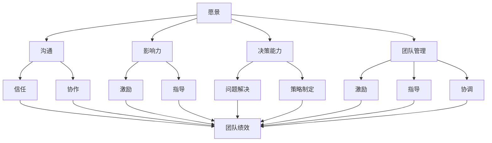

### 核心算法原理讲解

在领导力模型中，我们可以将决策能力视为一种核心算法。以下是一个简单的伪代码，用于说明领导者在面对决策时的基本思路：

```python
function make_decision(context, options, constraints):
    # 收集信息
    info = gather_information(context)
    
    # 分析选项
    analyzed_options = analyze_options(info, options)
    
    # 评估约束
    valid_options = evaluate_constraints(analyzed_options, constraints)
    
    # 选择最优选项
    decision = select_best_option(valid_options)
    
    # 实施决策
    implement_decision(decision)
    
    return decision
```

在这个算法中，`gather_information` 函数用于收集与决策相关的所有信息，`analyze_options` 函数用于分析每个选项的潜在影响，`evaluate_constraints` 函数用于评估每个选项是否符合组织的约束条件，而 `select_best_option` 函数则用于从有效的选项中选出最优的决策。

### 数学模型和公式讲解

领导力模型中常常涉及到一些数学模型和公式，用于量化领导者的影响力和团队绩效。以下是一个简单的绩效评估模型：

$$
绩效 = f(领导力, 团队协作, 环境因素)
$$

在这个模型中，`领导力`、`团队协作` 和 `环境因素` 是影响绩效的三个主要变量。具体公式可以表示为：

$$
领导力 = \alpha_1 \cdot 自信心 + \alpha_2 \cdot 决策能力 + \alpha_3 \cdot 影响力
$$

$$
团队协作 = \beta_1 \cdot 沟通能力 + \beta_2 \cdot 激励能力 + \beta_3 \cdot 协调能力
$$

$$
环境因素 = \gamma_1 \cdot 市场竞争 + \gamma_2 \cdot 技术发展 + \gamma_3 \cdot 组织文化
$$

其中，各个系数代表不同因素对绩效的相对重要性。

### 举例说明

假设一个领导者在面临一个重要决策时，可以使用上述模型来分析和做出决策。首先，领导者需要收集相关信息，如市场趋势、竞争对手行动、内部团队状态等。然后，分析每个决策选项的潜在影响，并评估每个选项是否符合组织的约束条件。最后，选择最优的决策选项，并实施这一决策。

### 项目实战

在实际项目中，领导力模型的应用可以极大地提升团队的绩效。以下是一个开发项目的例子：

- **项目背景**：一个软件开发团队正在开发一款新型移动应用。项目面临的主要挑战是时间紧迫和技术复杂。
- **领导力应用**：
  - **愿景**：领导者明确传达项目的愿景和目标，确保团队明确知道项目的方向和重要性。
  - **沟通**：领导者积极与团队成员沟通，了解每个人的状态和需求，确保信息的透明和畅通。
  - **影响力**：领导者通过激励和鼓励，激发团队成员的积极性和创造力。
  - **决策能力**：领导者在面对技术难题时，能够快速做出决策，确保项目顺利进行。
  - **团队管理**：领导者指导团队成员，协调各自的工作，确保团队协作高效。

- **项目小结**：通过领导者的有效领导，项目最终在预定时间内完成，并获得了用户的高度评价。这充分展示了领导力在项目成功中的关键作用。

### 最佳实践 tips

- **定期反思**：领导者应定期反思自己的领导行为，识别不足并持续改进。
- **培养团队**：领导者应注重培养团队成员的能力，提升团队的整体实力。
- **灵活应对**：领导者需要具备灵活性，能够根据不同情境调整领导风格。

### 小结

领导力是一种复杂而重要的能力，它对于组织的成功至关重要。通过深入理解和实践领导力理论，领导者可以更好地预见机遇与挑战，并带领团队实现共同的目标。在本章中，我们介绍了领导力的定义、重要性、理论回顾和模型，并通过实例说明了领导力在项目中的应用。下一章，我们将探讨远见力的概念和重要性。

## 第2章 远见力概念

### 2.1 远见力定义

远见力，也称为前瞻性思维，是指领导者预见未来发展趋势、识别潜在机遇和挑战的能力。远见力不仅仅是预测未来的能力，更是一种基于对趋势和数据的深刻理解，以及高度敏感的洞察力和判断力。

### 2.2 远见力的重要性

远见力对于领导者至关重要。首先，它能够帮助领导者识别潜在的机遇，抓住市场先机，实现组织的快速增长。其次，远见力能够帮助领导者预见挑战，提前制定应对策略，降低不确定性带来的风险。此外，远见力还能够帮助领导者塑造组织的长期愿景，确保组织的可持续发展。

### 2.3 远见力的特质

远见力具有以下几个关键特质：

- **洞察力**：能够从复杂的信息中提取出关键趋势和模式。
- **前瞻性**：能够预见未来可能发生的变化，并提前做好准备。
- **创造性**：能够提出新颖的解决方案和策略。
- **适应性**：能够在不确定的环境中灵活调整计划。
- **判断力**：能够在复杂和模糊的情况下做出明智的决策。

### 2.4 远见力与领导力的联系

远见力与领导力紧密相连，二者相辅相成。领导力为远见力提供了实践的基础，而远见力则为领导力注入了前瞻性和创造性。有效的领导者不仅能够带领团队实现当前目标，更能够预见未来，为团队和组织的发展制定清晰的路线图。

### 核心概念与联系

为了更好地理解远见力的特质和其在领导力中的作用，我们可以通过Mermaid流程图来展示核心概念之间的关系：

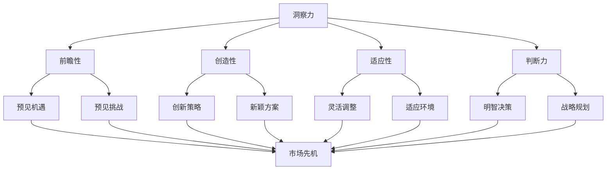

### 核心算法原理讲解

远见力在决策过程中起到关键作用。以下是一个简单的伪代码，用于说明领导者在做出决策时如何运用远见力：

```python
function make_decision_with_vision(context, options, constraints):
    # 收集信息
    info = gather_information(context)
    
    # 分析趋势
    trends = analyze_trends(info)
    
    # 预见机遇和挑战
    foresight = foresee_opportunities_and_challenges(trends)
    
    # 调整选项
    adjusted_options = adjust_options(options, foresight)
    
    # 评估约束
    valid_options = evaluate_constraints(adjusted_options, constraints)
    
    # 选择最佳选项
    decision = select_best_option(valid_options)
    
    # 实施决策
    implement_decision(decision)
    
    return decision
```

在这个算法中，`gather_information` 函数用于收集与决策相关的所有信息，`analyze_trends` 函数用于分析信息中的趋势，`foresee_opportunities_and_challenges` 函数用于预见未来的机遇和挑战，`adjust_options` 函数用于根据预见结果调整选项，而 `select_best_option` 函数则用于从有效的选项中选出最优的决策。

### 数学模型和公式讲解

远见力可以量化为领导者对未来的预见能力和决策质量。以下是一个简单的数学模型，用于评估领导者的远见力：

$$
远见力 = f(洞察力, 前瞻性, 创造性, 适应性, 判断力)
$$

其中，各个特质对远见力的贡献可以用系数来表示：

$$
远见力 = \alpha_1 \cdot 洞察力 + \alpha_2 \cdot 前瞻性 + \alpha_3 \cdot 创造性 + \alpha_4 \cdot 适应性 + \alpha_5 \cdot 判断力
$$

### 举例说明

假设一个领导者在面临市场变化时，如何运用远见力做出决策。首先，领导者收集市场信息，分析行业趋势。然后，预见可能的机遇和挑战，如新的市场需求或竞争对手的行动。接着，领导者调整战略和业务计划，以应对这些变化。最后，领导者评估各种方案，选择最优的决策。

### 项目实战

在一个新兴的科技公司中，领导者运用远见力，成功预见到了市场对新型智能硬件的需求。通过提前布局研发和营销，公司迅速占领市场，获得了巨大的商业成功。

- **项目背景**：科技公司在市场上推出了一款新型智能硬件。
- **远见力应用**：
  - **预见机遇**：领导者预见到了智能硬件市场的巨大潜力。
  - **调整策略**：领导者提前布局研发，加快产品上市时间。
  - **灵活应对**：领导者根据市场反馈，及时调整产品功能和营销策略。
- **项目小结**：通过领导者的远见力，公司成功占领市场，实现了快速增长。

### 最佳实践 tips

- **持续学习**：领导者应不断学习新的知识和技能，提升预见能力。
- **数据分析**：领导者应善于使用数据分析工具，帮助预见市场趋势。
- **培养团队**：领导者应培养团队成员的远见力，形成集体预见能力。

### 小结

远见力是领导者成功的关键能力之一。它不仅帮助领导者预见机遇，抓住市场先机，还能够帮助领导者预见挑战，提前制定应对策略。在本章中，我们介绍了远见力的定义、重要性、特质以及与领导力的联系。下一章，我们将探讨预见机遇与挑战的具体策略。

## 第3章 预见机遇与挑战的策略

### 3.1 机遇与挑战的类型

预见机遇与挑战首先需要了解其类型。机遇通常包括市场变化、技术进步、社会趋势等。例如，随着5G技术的普及，新型智能硬件市场呈现出巨大的增长潜力。而挑战则可能来源于竞争加剧、政策变化、资源限制等。比如，在疫情期间，供应链中断成为许多企业的重大挑战。

### 3.2 预见策略与方法

为了预见机遇与挑战，领导者可以采用以下策略与方法：

- **市场调研**：通过市场调研了解消费者需求和市场趋势。
- **数据分析**：利用数据分析工具分析历史数据，识别潜在趋势。
- **行业洞察**：密切关注行业动态，了解竞争对手的行动和战略。
- **专家咨询**：咨询行业专家和顾问，获取专业意见和建议。
- **情景分析**：构建不同情境下的预测模型，评估可能的结果。

### 3.3 预见工具与技术

多种工具和技术可以帮助领导者进行预见分析，包括：

- **趋势分析工具**：如Google Trends、社交媒体分析工具等。
- **数据分析软件**：如Tableau、Power BI等。
- **预测模型**：如时间序列分析、回归分析等。
- **情景规划**：通过构建不同的未来情景，评估潜在的机遇和挑战。

### 3.4 预见实践案例

以下是一个预见机遇与挑战的实践案例：

- **项目背景**：一家电子商务公司希望通过扩大产品线，抓住市场机遇。
- **预见策略**：
  - **市场调研**：公司通过问卷调查和在线调研，了解消费者对新产品类别的需求。
  - **数据分析**：利用销售数据和消费者行为数据，分析潜在的新产品类别。
  - **行业洞察**：关注行业报告和竞争对手的产品动态，识别市场趋势。
  - **专家咨询**：咨询行业专家，获取关于新产品类别的建议。
  - **情景分析**：构建不同情境下的市场预测模型，评估新产品对销售额的影响。
- **预见结果**：通过以上策略，公司成功预见到了市场对健康食品和家居装饰品的需求增长，迅速推出相关产品，获得了市场认可。

### 核心概念与联系

为了更好地理解预见机遇与挑战的策略和方法，我们可以通过Mermaid流程图来展示核心概念之间的关系：

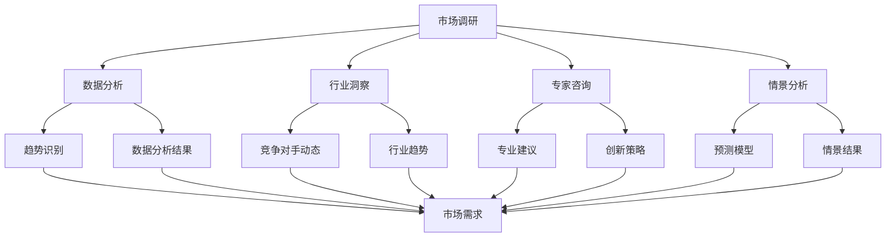

### 核心算法原理讲解

预见机遇与挑战的核心算法通常涉及以下几个步骤：

```python
function foresee_opportunities_and_risks():
    # 收集信息
    info = gather_market_data()

    # 分析市场趋势
    trends = analyze_trends(info)

    # 识别机遇
    opportunities = identify_opportunities(trends)

    # 识别挑战
    risks = identify_risks(trends)

    # 构建预测模型
    prediction_model = build_prediction_model(opportunities, risks)

    # 情景分析
    scenarios = analyze_scenarios(prediction_model)

    return scenarios
```

在这个算法中，`gather_market_data` 函数用于收集市场信息，`analyze_trends` 函数用于分析市场趋势，`identify_opportunities` 和 `identify_risks` 函数分别用于识别机遇和挑战，`build_prediction_model` 函数用于构建预测模型，而 `analyze_scenarios` 函数用于情景分析。

### 数学模型和公式讲解

预见机遇与挑战的数学模型可以包括以下几个关键要素：

$$
预见结果 = f(市场趋势, 竞争对手分析, 内部能力)
$$

具体公式可以表示为：

$$
机遇 = \alpha_1 \cdot 市场需求增长 + \alpha_2 \cdot 技术进步 + \alpha_3 \cdot 消费者行为变化
$$

$$
挑战 = \beta_1 \cdot 竞争对手动态 + \beta_2 \cdot 政策变化 + \beta_3 \cdot 资源限制
$$

其中，各个系数代表不同因素对机遇和挑战的影响程度。

### 举例说明

假设一个公司在进行新产品开发时，需要预见市场机遇和挑战。首先，公司通过市场调研收集消费者需求数据。然后，分析行业趋势，如技术进步和消费者行为变化。接着，公司评估竞争对手的动态，以及政策变化和资源限制。最后，公司构建预测模型，分析不同情境下的市场前景，并制定相应的战略。

### 项目实战

以下是一个企业预见机遇与挑战的实际案例：

- **项目背景**：一家汽车制造公司面临新能源汽车市场的快速增长。
- **预见策略**：
  - **市场调研**：公司通过市场调研，了解消费者对新能源汽车的需求。
  - **数据分析**：公司分析新能源汽车的市场趋势和竞争对手的动态。
  - **行业洞察**：公司关注行业报告，了解政策变化和技术进步。
  - **情景分析**：公司构建不同情境下的市场预测模型，评估新能源汽车市场的机遇和挑战。
- **预见结果**：公司成功预见到了新能源汽车市场的巨大机遇，并提前调整战略，增加了新能源汽车的生产和研发投入。

### 最佳实践 tips

- **定期评估**：领导者应定期评估市场环境和竞争对手，确保预见结果的有效性。
- **跨部门合作**：领导者应促进跨部门合作，整合不同部门的信息和资源，提高预见能力。
- **持续学习**：领导者应持续学习新的知识和技能，提升预见能力和决策质量。

### 小结

预见机遇与挑战是领导者的重要职责之一。通过市场调研、数据分析、行业洞察和情景分析等策略，领导者可以更好地预见未来的发展趋势，抓住市场机遇，应对潜在挑战。在本章中，我们介绍了预见机遇与挑战的类型、策略和方法，并通过实际案例进行了说明。下一章，我们将探讨团队协作与领导力的关系。

## 第4章 团队协作与领导力

### 4.1 团队协作原理

团队协作是指团队成员通过相互沟通、共享资源和共同努力，以实现共同目标的过程。有效的团队协作能够提高团队的效率和绩效，减少冲突，增强团队成员的满意度和忠诚度。

### 4.2 领导者在团队协作中的角色

领导者在团队协作中扮演着多重角色，包括：

- **协调者**：领导者需要协调团队成员的工作，确保各项工作有序进行。
- **激励者**：领导者需要激励团队成员，激发他们的工作热情和创造力。
- **沟通者**：领导者需要确保团队内部的信息畅通，避免误解和冲突。
- **冲突解决者**：领导者需要及时解决团队内部的冲突，维护团队的稳定。
- **榜样**：领导者通过自己的行为和态度，树立榜样，影响和引导团队成员。

### 4.3 激励与沟通策略

为了提高团队协作的效果，领导者可以采用以下激励与沟通策略：

- **目标明确**：领导者应明确团队的目标，确保每个成员都清楚自己的任务和责任。
- **奖励机制**：领导者可以设立奖励机制，对团队成员的工作表现进行认可和奖励。
- **积极反馈**：领导者应积极反馈团队成员的工作成果，鼓励他们持续改进。
- **开放沟通**：领导者应鼓励团队成员之间进行开放沟通，分享想法和经验。
- **冲突管理**：领导者应采取有效的冲突管理策略，解决团队内部的矛盾和分歧。

### 4.4 团队协作实践案例

以下是一个团队协作实践案例：

- **项目背景**：一个软件开发团队负责开发一款新型移动应用。
- **团队协作策略**：
  - **目标明确**：团队领导明确传达了项目的目标和任务，确保每个成员都清楚自己的工作职责。
  - **激励机制**：团队领导设立了一个奖励机制，鼓励团队成员积极参与和贡献。
  - **积极反馈**：团队领导定期召开会议，听取成员的工作汇报，并给予积极的反馈。
  - **开放沟通**：团队领导鼓励成员之间进行开放沟通，分享各自的进展和问题。
  - **冲突管理**：团队领导采取有效的冲突管理策略，及时解决团队内部的矛盾和分歧。
- **项目结果**：通过有效的团队协作，团队成功在预定时间内完成了项目，并获得了用户的高度评价。

### 核心概念与联系

为了更好地理解团队协作与领导力的关系，我们可以通过Mermaid流程图来展示核心概念之间的关系：

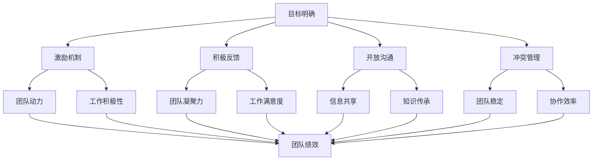

### 核心算法原理讲解

团队协作的算法可以简化为以下几个步骤：

```python
function effective_team_collaboration(team_members, goals, resources):
    # 明确目标
    define_goals = set_goals(team_members, goals)

    # 设定激励机制
    incentive_system = set_incentives(team_members)

    # 确保积极反馈
    feedback_loop = set_feedback_system(team_members)

    # 促进开放沟通
    communication_channel = set_communication_tools(team_members)

    # 管理冲突
    conflict_resolution = set_conflict_management_strategy(team_members)

    # 分配资源
    resource_allocation = allocate_resources(team_members, resources)

    # 监控协作效率
    collaboration_monitoring = monitor_team_performance(team_members)

    # 调整策略
    strategy_adjustment = adjust_strategy_if_needed(collaboration_monitoring)

    return collaboration_monitoring
```

在这个算法中，`set_goals` 函数用于明确团队目标，`set_incentives` 函数用于设定激励机制，`set_feedback_system` 函数用于确保积极反馈，`set_communication_tools` 函数用于促进开放沟通，`set_conflict_management_strategy` 函数用于管理冲突，`allocate_resources` 函数用于分配资源，而 `monitor_team_performance` 函数用于监控协作效率。

### 数学模型和公式讲解

团队协作的效果可以通过以下数学模型进行评估：

$$
团队绩效 = f(目标明确度, 激励机制, 积极反馈, 开放沟通, 冲突管理)
$$

具体公式可以表示为：

$$
目标明确度 = \alpha_1 \cdot 目标清晰度 + \alpha_2 \cdot 成员认同感
$$

$$
激励机制 = \beta_1 \cdot 奖励力度 + \beta_2 \cdot 成员参与度
$$

$$
积极反馈 = \gamma_1 \cdot 反馈频率 + \gamma_2 \cdot 反馈质量
$$

$$
开放沟通 = \delta_1 \cdot 信息透明度 + \delta_2 \cdot 成员互动
$$

$$
冲突管理 = \epsilon_1 \cdot 冲突解决效率 + \epsilon_2 \cdot 团队信任度
$$

其中，各个系数代表不同因素对团队绩效的影响程度。

### 举例说明

假设一个团队正在开发一款新产品，团队领导可以采取以下步骤：

1. **明确目标**：明确新产品的功能和市场定位。
2. **设定激励机制**：设立奖励计划，激励团队成员积极参与。
3. **积极反馈**：定期召开会议，听取成员的工作进展，给予积极反馈。
4. **开放沟通**：鼓励团队成员分享经验和问题，确保信息透明。
5. **冲突管理**：及时解决团队内部的冲突，维护团队的稳定。

### 项目实战

以下是一个团队协作的实际案例：

- **项目背景**：一个跨部门团队负责实施一项大型IT项目。
- **团队协作策略**：
  - **目标明确**：团队领导明确了项目的目标和任务，确保每个成员都清楚自己的工作职责。
  - **激励机制**：团队领导设立了奖励机制，对成员的工作表现进行认可。
  - **积极反馈**：团队领导定期召开会议，听取成员的汇报，并给予积极的反馈。
  - **开放沟通**：团队领导鼓励成员之间进行开放沟通，分享各自的进展和问题。
  - **冲突管理**：团队领导采取有效的冲突管理策略，及时解决团队内部的矛盾。
- **项目结果**：通过有效的团队协作，项目在预定时间内成功完成，并获得了客户的高度评价。

### 最佳实践 tips

- **定期评估**：领导者应定期评估团队协作的效果，及时调整策略。
- **培养信任**：领导者应注重培养团队成员之间的信任，增强团队的凝聚力。
- **提供资源**：领导者应确保团队成员拥有足够的资源和工具，以提高工作效率。

### 小结

团队协作与领导力密不可分。有效的团队协作能够提高团队的效率和绩效，而领导者在这一过程中扮演着关键角色。在本章中，我们介绍了团队协作原理、领导者在团队协作中的角色、激励与沟通策略，并通过实际案例进行了说明。下一章，我们将探讨领导力在技术环境中的实践。

## 第5章 领导力在技术环境中的实践

### 5.1 技术环境下的领导力挑战

随着技术的发展，领导者面临着新的挑战。技术环境的变化速度极快，要求领导者具备快速学习和适应能力。此外，技术环境下的团队协作更加复杂，跨学科、跨国界的协作成为常态。同时，技术的复杂性和不确定性也增加了领导者的决策难度。

### 5.2 技术驱动的领导力策略

为了应对技术环境中的挑战，领导者可以采用以下策略：

- **技术领导力**：领导者应具备一定的技术背景，理解技术的基本原理和应用。
- **持续学习**：领导者应保持学习的状态，不断提升自己的技术知识和领导能力。
- **团队建设**：领导者应注重团队建设，培养团队的技术能力和协作精神。
- **开放沟通**：领导者应建立开放的沟通机制，鼓励团队成员分享技术见解和问题。
- **创新驱动**：领导者应鼓励创新，推动团队不断尝试新的技术和方法。

### 5.3 技术创新与领导力

技术创新是技术环境中领导力的核心。领导者需要具备以下能力：

- **愿景**：领导者应具备清晰的愿景，为技术创新提供方向和目标。
- **决策**：领导者需要具备快速决策的能力，在技术项目中做出明智的决策。
- **激励**：领导者应激励团队成员，激发他们的创新潜能。
- **资源**：领导者应确保团队拥有足够的资源，支持技术创新。

### 5.4 技术领导力实践案例

以下是一个技术领导力实践案例：

- **项目背景**：一家科技公司决定开发一款智能家居产品，以应对智能家居市场的快速增长。
- **技术领导力应用**：
  - **技术领导力**：公司领导具备丰富的技术背景，能够为智能家居产品的开发提供专业的指导。
  - **持续学习**：公司领导不断学习最新的智能家居技术和市场趋势，确保公司的技术领先地位。
  - **团队建设**：公司领导注重团队建设，培养团队成员的技术能力和协作精神。
  - **开放沟通**：公司领导建立开放的沟通机制，鼓励团队成员分享技术见解和问题。
  - **创新驱动**：公司领导鼓励团队成员创新，推动智能家居产品的持续改进和优化。
- **项目结果**：通过技术领导力的有效应用，公司成功开发出了一款具有市场竞争力的智能家居产品，并在市场上取得了巨大的成功。

### 核心概念与联系

为了更好地理解技术领导力在技术环境中的应用，我们可以通过Mermaid流程图来展示核心概念之间的关系：

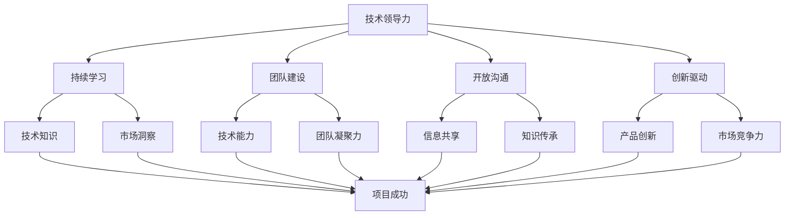

### 核心算法原理讲解

技术领导力的核心算法可以简化为以下几个步骤：

```python
function technical_leadership(technical_knowledge, team miembros):
    # 提升技术知识
    improve_technical_knowledge = learn_new_technologies()

    # 建设团队
    build_team = recruit_talented_members()

    # 沟通机制
    communication_system = establish_open_communication()

    # 创新驱动
    drive_innovation = encourage_innovative_ideas()

    # 资源分配
    resource_allocation = allocate_resources()

    # 项目管理
    project_management = implement_project_management_practices()

    # 持续学习
    continuous_learning = foster_a_learning_culture()

    return success
```

在这个算法中，`learn_new_technologies` 函数用于提升技术知识，`recruit_talented_members` 函数用于建设团队，`establish_open_communication` 函数用于建立沟通机制，`encourage_innovative_ideas` 函数用于创新驱动，`allocate_resources` 函数用于资源分配，而 `implement_project_management_practices` 函数用于项目管理。

### 数学模型和公式讲解

技术领导力可以量化为领导者对技术知识的掌握程度、团队协作效率以及创新能力的综合表现。以下是一个简单的数学模型，用于评估技术领导力：

$$
技术领导力 = f(技术知识, 团队协作效率, 创新能力)
$$

具体公式可以表示为：

$$
技术知识 = \alpha_1 \cdot 知识广度 + \alpha_2 \cdot 知识深度
$$

$$
团队协作效率 = \beta_1 \cdot 信息共享 + \beta_2 \cdot 团队凝聚力
$$

$$
创新能力 = \gamma_1 \cdot 创新频率 + \gamma_2 \cdot 创新质量
$$

其中，各个系数代表不同因素对技术领导力的贡献程度。

### 举例说明

假设一个科技公司领导决定提升公司的技术领导力。首先，领导可以参加技术培训和研讨会，提升自己的技术知识。然后，领导可以招聘具有不同技术背景的团队成员，以增强团队的能力和多样性。接着，领导可以建立开放的沟通机制，鼓励团队成员分享技术和经验。最后，领导可以推动创新项目，激励团队持续改进和优化产品。

### 项目实战

以下是一个技术领导力的实际案例：

- **项目背景**：一家科技公司决定开发一款基于人工智能的自动驾驶系统。
- **技术领导力应用**：
  - **技术知识**：公司领导积极学习人工智能和自动驾驶的最新技术，为项目提供技术指导。
  - **团队建设**：公司领导招聘了具有人工智能和自动驾驶经验的技术专家，组建了一支高水平的研发团队。
  - **开放沟通**：公司领导建立了开放的沟通平台，鼓励团队成员分享技术见解和问题。
  - **创新驱动**：公司领导推动了一系列创新项目，包括算法优化、硬件升级等，以提升自动驾驶系统的性能。
- **项目结果**：通过技术领导力的有效应用，公司成功开发出了一款具有竞争力的自动驾驶系统，并在市场上取得了巨大的成功。

### 最佳实践 tips

- **持续学习**：领导者应保持学习的状态，不断提升自己的技术知识和领导能力。
- **激励团队**：领导者应鼓励团队成员创新，提供必要的资源和支持。
- **跨学科协作**：领导者应促进跨学科的协作，充分利用团队的不同技能和经验。

### 小结

在技术环境中，领导力的重要性更加凸显。领导者需要具备技术知识、持续学习的能力，以及推动团队创新和协作的精神。在本章中，我们介绍了技术环境下的领导力挑战、技术驱动的领导力策略，并通过实际案例进行了说明。下一章，我们将探讨领导力与组织发展的关系。

## 第6章 领导力与组织发展

### 6.1 组织发展理论

组织发展理论关注组织如何通过变革和适应来提高效率和绩效。该理论认为，组织是一个动态的系统，需要不断地调整和优化，以适应外部环境的变化。组织发展的关键在于领导者的角色，他们需要通过有效的领导力推动组织变革，实现长期发展。

### 6.2 领导力在组织发展中的作用

领导力在组织发展中起着至关重要的作用。首先，领导者通过设定愿景和目标，为组织的发展提供方向。其次，领导者通过激励和培养员工，提高组织的整体能力和绩效。此外，领导者还需要在组织变革过程中发挥关键作用，推动组织适应新的环境和需求。

### 6.3 组织变革与领导力

组织变革是组织发展的重要手段，而领导力在其中起着决定性的作用。有效的组织变革需要领导者具备以下能力：

- **变革愿景**：领导者需要具备清晰的变革愿景，明确变革的目标和路径。
- **沟通能力**：领导者需要与员工进行有效沟通，解释变革的原因和意义，赢得员工的支持。
- **影响力**：领导者需要通过影响力和说服力，推动变革的执行。
- **适应能力**：领导者需要具备适应变革的能力，能够灵活应对变革过程中的挑战和问题。

### 6.4 组织发展实践案例

以下是一个组织发展实践案例：

- **项目背景**：一家传统制造企业决定进行数字化转型，以提升效率和竞争力。
- **领导力应用**：
  - **变革愿景**：企业领导明确提出了数字化的愿景，为全体员工指明了变革的方向。
  - **沟通能力**：领导层通过定期会议和内部通讯，向员工解释数字化转型的必要性和重要性。
  - **影响力**：领导层通过个人示范和激励措施，激发员工的积极性和参与度。
  - **适应能力**：领导层在变革过程中，不断调整策略和方法，以应对各种挑战和问题。
- **项目结果**：通过有效的领导力应用，企业成功完成了数字化转型，实现了生产效率和竞争力的显著提升。

### 核心概念与联系

为了更好地理解领导力在组织发展中的作用，我们可以通过Mermaid流程图来展示核心概念之间的关系：

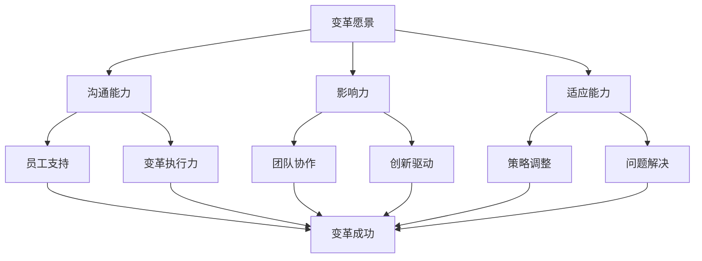

### 核心算法原理讲解

领导力在组织发展中的应用可以简化为以下几个步骤：

```python
function organizational_development(leader, employees, environment):
    # 设定变革愿景
    vision = set_vision()

    # 进行有效沟通
    communication = communicate_changes()

    # 展现影响力
    influence = demonstrate_influence()

    # 适应环境变化
    adaptability = adapt_to_environment()

    # 调整策略
    strategy_adjustment = adjust_strategies()

    # 解决问题
    problem_solving = solve_issues()

    # 驱动创新
    innovation = drive_innovation()

    # 获得员工支持
    employee_support = gain_employee_support()

    # 实施变革
    implementation = implement_changes()

    return success
```

在这个算法中，`set_vision` 函数用于设定变革愿景，`communicate_changes` 函数用于进行有效沟通，`demonstrate_influence` 函数用于展现影响力，`adapt_to_environment` 函数用于适应环境变化，`adjust_strategies` 函数用于调整策略，`solve_issues` 函数用于解决问题，`drive_innovation` 函数用于驱动创新，而 `gain_employee_support` 函数用于获得员工支持，最后 `implement_changes` 函数用于实施变革。

### 数学模型和公式讲解

领导力在组织发展中的效果可以通过以下数学模型进行评估：

$$
组织发展效率 = f(变革愿景, 沟通能力, 影响力, 适应能力, 创新驱动, 员工支持)
$$

具体公式可以表示为：

$$
变革愿景 = \alpha_1 \cdot 愿景清晰度 + \alpha_2 \cdot 愿景可行性
$$

$$
沟通能力 = \beta_1 \cdot 信息传递效率 + \beta_2 \cdot 员工理解度
$$

$$
影响力 = \gamma_1 \cdot 领导权威 + \gamma_2 \cdot 激励效果
$$

$$
适应能力 = \delta_1 \cdot 灵活性 + \delta_2 \cdot 环境感知
$$

$$
创新驱动 = \epsilon_1 \cdot 创新频率 + \epsilon_2 \cdot 创新质量
$$

$$
员工支持 = \zeta_1 \cdot 员工满意度 + \zeta_2 \cdot 员工参与度
$$

其中，各个系数代表不同因素对组织发展效率的影响程度。

### 举例说明

假设一个企业决定进行数字化转型，企业领导可以采取以下步骤：

1. **设定变革愿景**：明确数字化转型的目标和路径，确保全体员工理解。
2. **进行有效沟通**：通过内部会议、培训和工作坊等形式，向员工解释数字化转型的重要性和必要性。
3. **展现影响力**：通过个人示范和激励措施，激发员工的积极性和参与度。
4. **适应环境变化**：根据市场和技术环境的变化，灵活调整转型策略。
5. **驱动创新**：鼓励员工提出创新的想法和解决方案，推动数字化转型。
6. **获得员工支持**：通过透明的沟通和参与机制，确保员工对变革的支持。

### 项目实战

以下是一个组织发展的实际案例：

- **项目背景**：一家零售企业决定进行数字化转型，以提高客户体验和运营效率。
- **领导力应用**：
  - **变革愿景**：企业领导提出了数字化的愿景，明确了转型目标和路径。
  - **沟通能力**：企业领导通过内部会议和培训，向员工解释数字化转型的重要性和必要性。
  - **影响力**：企业领导通过个人示范和激励措施，激发员工的积极性和参与度。
  - **适应能力**：企业领导根据市场和技术环境的变化，灵活调整转型策略。
  - **创新驱动**：企业领导鼓励员工提出创新的想法和解决方案，推动数字化转型。
  - **获得员工支持**：企业领导通过透明的沟通和参与机制，确保员工对变革的支持。
- **项目结果**：通过领导力的有效应用，企业成功完成了数字化转型，实现了客户体验和运营效率的显著提升。

### 最佳实践 tips

- **明确愿景**：领导者应明确组织的发展愿景，确保全体员工对变革有共同的理解和目标。
- **有效沟通**：领导者应通过多种渠道和方式，确保员工了解变革的重要性和必要性。
- **激励创新**：领导者应鼓励员工创新，提供必要的资源和支持，以推动组织的发展。

### 小结

领导力在组织发展中起着至关重要的作用。通过设定愿景、进行有效沟通、展现影响力、适应环境变化和激励创新，领导者可以推动组织实现持续发展。在本章中，我们介绍了组织发展理论、领导力在组织发展中的作用，并通过实际案例进行了说明。下一章，我们将探讨领导力个人成长的重要性。

## 第7章 领导力个人成长

### 7.1 领导力自我评估

领导力个人成长的第一步是进行自我评估。领导者需要反思自己的领导行为、能力和表现，识别自身的优势和不足。以下是一个简单的自我评估步骤：

1. **反思领导行为**：回顾过去一段时间内的领导行为，分析哪些行为有效，哪些行为需要改进。
2. **收集反馈**：从团队成员、同事和其他利益相关者那里收集反馈，了解他们对自己的看法和建议。
3. **分析能力**：评估自己在领导力各方面的能力，包括沟通能力、决策能力、团队管理能力等。
4. **制定改进计划**：根据自我评估和反馈，制定具体的改进计划，包括学习新的技能、参加培训课程等。

### 7.2 领导力发展路径

领导力个人成长是一个持续的过程，需要制定明确的发展路径。以下是一个典型的领导力发展路径：

1. **基础阶段**：学习领导力的基本理论和原则，了解不同类型的领导力模型。
2. **实践阶段**：通过实际工作，将领导力理论应用于实践，积累领导经验。
3. **提升阶段**：通过培训和自我反思，不断提升领导力，学习新的技能和知识。
4. **卓越阶段**：成为优秀的领导者，具备高度的影响力、沟通能力和决策能力。

### 7.3 持续学习与领导力提升

持续学习是领导力个人成长的关键。以下是一些有效的学习方法和策略：

1. **阅读**：阅读领导力相关的书籍和文章，了解最新的理论和实践。
2. **参加培训**：参加领导力培训课程和工作坊，学习新的技能和策略。
3. **实践**：通过实际工作，将所学知识应用到实践中，不断反思和调整。
4. **建立学习网络**：与同行交流，分享经验和见解，互相学习和成长。

### 7.4 个人领导力实践案例

以下是一个个人领导力实践案例：

- **项目背景**：一位年轻的经理在一家快速成长的科技公司担任领导职务。
- **领导力实践**：
  - **自我评估**：经理通过反思和收集反馈，识别自己在沟通和决策方面的不足。
  - **持续学习**：经理参加了领导力培训课程，学习如何更有效地沟通和做出决策。
  - **实践应用**：经理将所学知识应用到实际工作中，改进与团队成员的沟通方式，提高决策质量。
  - **反思调整**：经理定期反思自己的领导行为，根据反馈进行调整和改进。
- **项目结果**：通过持续学习和实践，经理的领导力得到了显著提升，团队绩效和员工满意度也显著提高。

### 核心概念与联系

为了更好地理解领导力个人成长的过程，我们可以通过Mermaid流程图来展示核心概念之间的关系：

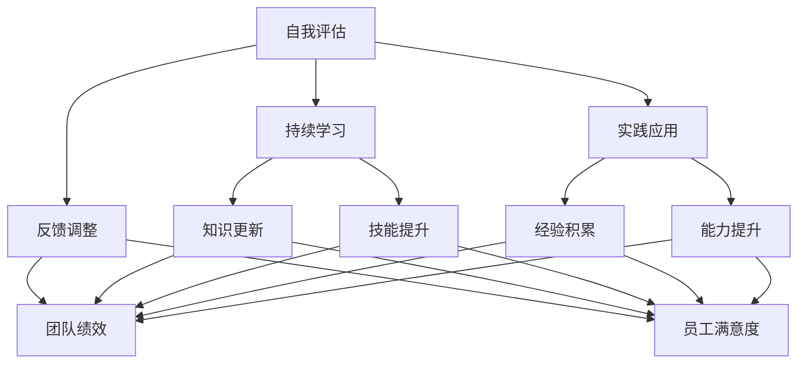

### 核心算法原理讲解

领导力个人成长可以简化为以下几个步骤：

```python
function leadership_growth(self_evaluation, continuous_learning, practical_application, feedback_adjustment):
    # 进行自我评估
    self_evaluation = perform_self_evaluation()

    # 持续学习
    continuous_learning = engage_in_continuous_learning()

    # 实践应用
    practical_application = apply_knowledge_practically()

    # 收集反馈
    feedback = collect_feedback()

    # 调整策略
    feedback_adjustment = adjust_strategy_based_on_feedback()

    # 提升能力
    skill_and_ability_improvement = improve_skills_and_abilities()

    # 增强团队绩效
    team_performance_improvement = enhance_team_performance()

    # 提高员工满意度
    employee_satisfaction_improvement = increase_employee_satisfaction()

    return success
```

在这个算法中，`perform_self_evaluation` 函数用于进行自我评估，`engage_in_continuous_learning` 函数用于持续学习，`apply_knowledge_practically` 函数用于实践应用，`collect_feedback` 函数用于收集反馈，`adjust_strategy_based_on_feedback` 函数用于调整策略，而 `improve_skills_and_abilities` 函数用于提升能力，`enhance_team_performance` 函数用于增强团队绩效，最后 `increase_employee_satisfaction` 函数用于提高员工满意度。

### 数学模型和公式讲解

领导力个人成长的效果可以通过以下数学模型进行评估：

$$
领导力成长 = f(自我评估, 持续学习, 实践应用, 反馈调整)
$$

具体公式可以表示为：

$$
自我评估 = \alpha_1 \cdot 自我反思 + \alpha_2 \cdot 反馈收集
$$

$$
持续学习 = \beta_1 \cdot 知识更新 + \beta_2 \cdot 技能提升
$$

$$
实践应用 = \gamma_1 \cdot 经验积累 + \gamma_2 \cdot 能力提升
$$

$$
反馈调整 = \delta_1 \cdot 反馈响应 + \delta_2 \cdot 策略调整
$$

其中，各个系数代表不同因素对领导力成长的影响程度。

### 举例说明

假设一个领导者在个人成长过程中，可以采取以下步骤：

1. **自我评估**：定期反思自己的领导行为，收集团队成员的反馈。
2. **持续学习**：参加领导力培训课程，阅读相关书籍，学习新的领导力理论和实践。
3. **实践应用**：将所学知识应用到实际工作中，不断提升自己的领导能力。
4. **反馈调整**：根据团队成员的反馈和自己的反思，调整领导策略和方法。

### 项目实战

以下是一个个人领导力成长的实际案例：

- **项目背景**：一位年轻的经理在一家初创公司担任领导职务，面临着巨大的压力和挑战。
- **领导力实践**：
  - **自我评估**：经理通过反思和收集反馈，识别自己在决策和团队管理方面的不足。
  - **持续学习**：经理参加了多个领导力培训课程，学习如何更有效地决策和领导团队。
  - **实践应用**：经理将所学知识应用到实际工作中，改进与团队成员的沟通方式，提高决策质量。
  - **反馈调整**：经理根据团队成员的反馈和自己的反思，不断调整领导策略和方法。
- **项目结果**：通过个人领导力的持续成长，经理成功地带领团队克服了各种挑战，取得了显著的业绩提升。

### 最佳实践 tips

- **定期反思**：领导者应定期反思自己的领导行为，识别不足并持续改进。
- **持续学习**：领导者应保持学习的状态，不断提升自己的领导能力和知识水平。
- **实践应用**：领导者应将所学知识应用到实际工作中，通过实践提升领导力。

### 小结

领导力个人成长是一个持续不断的过程。通过自我评估、持续学习、实践应用和反馈调整，领导者可以不断提升自己的领导能力，实现个人和团队的共同成长。在本章中，我们介绍了领导力自我评估、领导力发展路径、持续学习与领导力提升以及个人领导力实践案例。通过这些内容，读者可以更好地理解领导力个人成长的重要性。

## 第8章 领导力跨文化管理

### 8.1 跨文化领导力挑战

跨文化领导力面临诸多挑战，包括语言障碍、文化差异、价值观冲突等。这些挑战对领导者的沟通能力、决策能力和管理风格提出了更高的要求。

### 8.2 跨文化沟通策略

为了克服跨文化领导力挑战，领导者可以采取以下沟通策略：

- **语言适应**：领导者应尽量使用简单、直接的语言，避免使用专业术语和俚语。
- **文化敏感**：领导者需要了解不同文化的工作习惯和沟通风格，尊重文化差异。
- **开放沟通**：领导者应鼓励团队成员分享意见和反馈，营造开放、包容的沟通氛围。
- **建立信任**：领导者需要通过实际行动建立信任，包括透明沟通、遵守承诺等。

### 8.3 跨文化团队建设

跨文化团队建设是跨文化领导力的关键。以下是一些有效的团队建设策略：

- **文化培训**：为团队成员提供文化培训，帮助他们了解不同文化的特点和习惯。
- **团队活动**：组织跨文化团队活动，如团队建设工作坊、文化体验活动等，增强团队凝聚力。
- **多元化领导**：鼓励多元化领导，让不同文化的成员参与决策，促进团队协作。

### 8.4 跨文化领导力实践案例

以下是一个跨文化领导力实践案例：

- **项目背景**：一家跨国公司在全球范围内设立了一个跨文化团队，负责开发一款全球推广的软件。
- **跨文化领导力应用**：
  - **文化培训**：公司为团队成员提供了文化培训，帮助他们了解不同文化的工作习惯和沟通风格。
  - **开放沟通**：领导层建立了开放的沟通机制，鼓励团队成员分享意见和反馈。
  - **多元化领导**：团队成员来自不同的国家和地区，领导层鼓励他们参与决策，促进团队协作。
- **项目结果**：通过跨文化领导力的有效应用，团队成功开发出了一款符合全球市场需求的软件，并在多个国家取得了成功。

### 核心概念与联系

为了更好地理解跨文化领导力的概念和应用，我们可以通过Mermaid流程图来展示核心概念之间的关系：

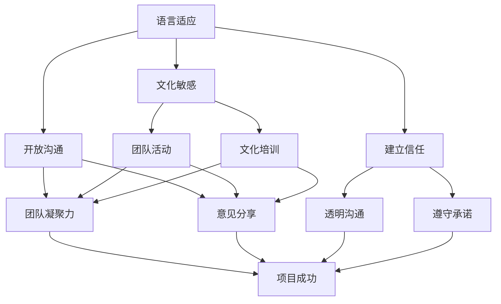

### 核心算法原理讲解

跨文化领导力的核心算法可以简化为以下几个步骤：

```python
function cross_cultural_leadership(language_adaptation, cultural_sensitivity, open_communication, trust_building):
    # 语言适应
    language_adaptation = adapt_language()

    # 文化敏感
    cultural_sensitivity = understand_different_cultures()

    # 开放沟通
    open_communication = establish_an_open_communication_channel()

    # 建立信任
    trust_building = build_trust()

    # 团队活动
    team_activities = organize_team_building_activities()

    # 文化培训
    cultural_training = provide_cultural_training()

    # 透明沟通
    transparent_communication = ensure_transparency()

    # 遵守承诺
    keep_promises = fulfill_commitments()

    return success
```

在这个算法中，`adapt_language` 函数用于语言适应，`understand_different_cultures` 函数用于文化敏感，`establish_an_open_communication_channel` 函数用于开放沟通，而 `build_trust` 函数用于建立信任。

### 数学模型和公式讲解

跨文化领导力的效果可以通过以下数学模型进行评估：

$$
跨文化领导力 = f(语言适应, 文化敏感, 开放沟通, 建立信任)
$$

具体公式可以表示为：

$$
语言适应 = \alpha_1 \cdot 语言能力 + \alpha_2 \cdot 语言简洁度
$$

$$
文化敏感 = \beta_1 \cdot 文化理解 + \beta_2 \cdot 文化尊重
$$

$$
开放沟通 = \gamma_1 \cdot 信息透明度 + \gamma_2 \cdot 意见分享
$$

$$
建立信任 = \delta_1 \cdot 透明沟通 + \delta_2 \cdot 遵守承诺
$$

其中，各个系数代表不同因素对跨文化领导力的影响程度。

### 举例说明

假设一个跨国公司的领导者在面对一个跨文化团队时，可以采取以下步骤：

1. **语言适应**：领导者使用简单、直接的语言，避免使用专业术语和俚语。
2. **文化敏感**：领导者了解团队成员的不同文化背景和工作习惯，尊重他们的文化差异。
3. **开放沟通**：领导者鼓励团队成员分享意见和反馈，建立开放的沟通机制。
4. **建立信任**：领导者通过透明沟通和遵守承诺，建立与团队成员的信任关系。

### 项目实战

以下是一个跨文化领导力的实际案例：

- **项目背景**：一家跨国公司在全球范围内设立了一个跨文化团队，负责开发一款面向全球市场的软件。
- **跨文化领导力应用**：
  - **文化培训**：公司为团队成员提供了文化培训，帮助他们了解不同文化的工作习惯和沟通风格。
  - **开放沟通**：领导层建立了开放的沟通机制，鼓励团队成员分享意见和反馈。
  - **多元化领导**：团队成员来自不同的国家和地区，领导层鼓励他们参与决策，促进团队协作。
- **项目结果**：通过跨文化领导力的有效应用，团队成功开发出了一款符合全球市场需求的软件，并在多个国家取得了成功。

### 最佳实践 tips

- **文化培训**：领导者应提供文化培训，帮助团队成员了解不同文化的工作习惯和沟通风格。
- **开放沟通**：领导者应鼓励团队成员分享意见和反馈，建立开放、包容的沟通氛围。
- **建立信任**：领导者需要通过实际行动建立信任，包括透明沟通、遵守承诺等。

### 小结

跨文化领导力在全球化背景下具有重要意义。通过语言适应、文化敏感、开放沟通和建立信任等策略，领导者可以克服跨文化领导力挑战，推动团队协作和项目成功。在本章中，我们介绍了跨文化领导力挑战、沟通策略、团队建设策略以及实践案例。通过这些内容，读者可以更好地理解跨文化领导力的重要性。

## 第9章 领导力与领导艺术

### 9.1 领导艺术的定义

领导艺术是指领导者在实际工作中，运用领导理论和实践经验，灵活应对复杂局面，实现组织目标的能力。与传统的领导理论不同，领导艺术强调个性化和情境适应性，是一种基于经验和直觉的领导方式。

### 9.2 领导艺术的重要性

领导艺术在领导实践中具有重要价值。首先，它能够帮助领导者更好地应对不确定性和复杂性，提高决策的灵活性和准确性。其次，领导艺术能够增强领导者的个人魅力和影响力，提升团队的凝聚力和士气。此外，领导艺术还促进了领导者的个人成长和职业发展。

### 9.3 领导艺术的实践

领导艺术的实践包括以下几个方面：

- **情境适应**：领导者需要根据不同的情境和挑战，灵活调整领导风格和策略。
- **情感智慧**：领导者需要具备高水平的情感智慧，理解并管理自己的情绪，以及团队成员的情绪。
- **人际沟通**：领导者需要掌握有效的人际沟通技巧，包括倾听、反馈、激励等。
- **决策能力**：领导者需要具备出色的决策能力，能够在复杂和模糊的情况下做出明智的选择。
- **创新能力**：领导者需要鼓励创新，推动组织不断改进和进步。

### 9.4 领导艺术案例解析

以下是一个领导艺术案例解析：

- **案例背景**：一家企业在面临市场危机时，领导层决定通过变革来应对挑战。
- **领导艺术应用**：
  - **情境适应**：领导层分析了市场环境和企业内部状况，确定了变革的必要性和可行性。
  - **情感智慧**：领导层与员工进行了深入的沟通，了解他们的担忧和期望，赢得了他们的信任和支持。
  - **人际沟通**：领导层通过召开会议、发布内部通讯等方式，及时传达变革的信息，确保员工的知情权和参与权。
  - **决策能力**：领导层在变革过程中，迅速做出了一系列决策，包括调整组织结构、优化业务流程等。
  - **创新能力**：领导层鼓励员工提出创新的想法和解决方案，推动了企业的持续改进和进步。
- **案例结果**：通过领导艺术的运用，企业成功地克服了市场危机，实现了业务的转型升级。

### 核心概念与联系

为了更好地理解领导艺术的概念和应用，我们可以通过Mermaid流程图来展示核心概念之间的关系：

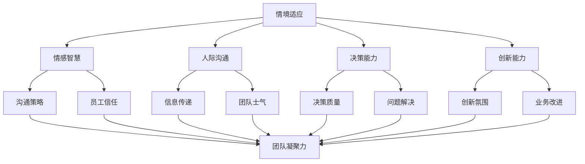

### 核心算法原理讲解

领导艺术的实践可以简化为以下几个步骤：

```python
function leadership_arts(situation_adaptation, emotional_intelligence, interpersonal_communication, decision_making, innovation):
    # 情境适应
    situation_adaptation = adapt_to_situation()

    # 情感智慧
    emotional_intelligence = manage_emotions()

    # 人际沟通
    interpersonal_communication = improve_communication()

    # 决策能力
    decision_making = make_wise_decisions()

    # 创新能力
    innovation = foster_innovation()

    # 沟通策略
    communication_strategies = implement_communication_strategies()

    # 员工信任
    employee_trust = build_employee_trust()

    # 决策质量
    decision_quality = enhance_decision_quality()

    # 问题解决
    problem_solving = improve_problem_solving()

    # 创新氛围
    innovation_atmosphere = create_an_innovation_atmosphere()

    # 业务改进
    business_improvement = drive_business_improvement()

    return success
```

在这个算法中，`adapt_to_situation` 函数用于情境适应，`manage_emotions` 函数用于情感智慧，`improve_communication` 函数用于人际沟通，而 `make_wise_decisions` 函数用于决策能力。

### 数学模型和公式讲解

领导艺术的实践效果可以通过以下数学模型进行评估：

$$
领导艺术效果 = f(情境适应, 情感智慧, 人际沟通, 决策能力, 创新能力)
$$

具体公式可以表示为：

$$
情境适应 = \alpha_1 \cdot 应对能力 + \alpha_2 \cdot 灵活性
$$

$$
情感智慧 = \beta_1 \cdot 情绪管理 + \beta_2 \cdot 情感识别
$$

$$
人际沟通 = \gamma_1 \cdot 沟通效率 + \gamma_2 \cdot 沟通质量
$$

$$
决策能力 = \delta_1 \cdot 决策准确性 + \delta_2 \cdot 决策速度
$$

$$
创新能力 = \epsilon_1 \cdot 创新频率 + \epsilon_2 \cdot 创新质量
$$

其中，各个系数代表不同因素对领导艺术效果的影响程度。

### 举例说明

假设一个领导者需要处理一个复杂的团队冲突，可以采取以下步骤：

1. **情境适应**：领导者根据冲突的情境，调整自己的应对策略。
2. **情感智慧**：领导者识别并管理自己的情绪，以及团队成员的情绪。
3. **人际沟通**：领导者通过有效的沟通技巧，解决冲突，恢复团队的和谐。
4. **决策能力**：领导者在冲突中做出明智的决策，以维护团队的利益。
5. **创新能力**：领导者鼓励团队成员提出创新的解决方案，避免类似的冲突再次发生。

### 项目实战

以下是一个领导艺术项目的实际案例：

- **项目背景**：一家企业面临产品滞销和市场份额下降的问题，领导层决定通过创新和改进来扭转局面。
- **领导艺术应用**：
  - **情境适应**：领导层分析了市场环境和内部问题，确定了创新和改进的必要性。
  - **情感智慧**：领导层与员工进行了深入沟通，了解他们的情绪和期望。
  - **人际沟通**：领导层通过内部会议和沟通，传达了创新和改进的愿景，赢得了员工的支持。
  - **决策能力**：领导层迅速做出决策，调整了产品线和营销策略。
  - **创新能力**：领导层鼓励员工提出创新的想法，推动了产品的改进和市场推广。
- **项目结果**：通过领导艺术的运用，企业成功摆脱了困境，实现了业务的增长和市场份额的提升。

### 最佳实践 tips

- **情境适应**：领导者应具备灵活应对各种情境的能力，不断调整自己的领导风格和策略。
- **情感智慧**：领导者应培养情感智慧，理解并管理自己的情绪，以及团队成员的情绪。
- **人际沟通**：领导者应掌握有效的人际沟通技巧，提升团队凝聚力和士气。
- **决策能力**：领导者应具备出色的决策能力，在复杂和模糊的情况下做出明智的选择。
- **创新能力**：领导者应鼓励创新，推动组织不断改进和进步。

### 小结

领导艺术是领导者在实际工作中运用领导理论和实践经验，灵活应对复杂局面，实现组织目标的能力。通过情境适应、情感智慧、人际沟通、决策能力和创新能力等实践，领导者可以提升领导艺术水平，推动组织的持续发展和成功。在本章中，我们介绍了领导艺术的定义、重要性、实践方法和实际案例。通过这些内容，读者可以更好地理解领导艺术的价值和运用。

## 第10章 领导力与社会责任

### 10.1 领导力与社会责任的关系

领导力与社会责任密切相关。领导力不仅关乎组织内部的效率和目标实现，还涉及对社会和环境的影响。一个负责任的领导者不仅关注组织的短期利益，更注重长期的社会责任，包括可持续发展、公平公正、环境保护等方面。

### 10.2 领导力在可持续发展中的作用

可持续发展是现代领导者必须面对的重要议题。领导力在推动可持续发展中发挥着关键作用：

- **战略规划**：领导者应将可持续发展纳入组织的战略规划，确保组织的长期目标和社会责任的一致性。
- **资源管理**：领导者需要优化资源管理，提高资源利用效率，减少浪费。
- **创新驱动**：领导者应鼓励创新，推动绿色技术和环保解决方案的应用。
- **员工参与**：领导者应激发员工的环保意识，推动全员参与可持续发展。

### 10.3 社会责任领导力实践

以下是一个社会责任领导力实践案例：

- **项目背景**：一家大型企业决定通过一系列措施，提升其社会责任和可持续发展水平。
- **领导力应用**：
  - **战略规划**：企业领导层制定了可持续发展战略，明确了企业的长期目标和社会责任。
  - **资源管理**：企业优化了生产流程，提高了资源利用效率，减少了碳排放。
  - **创新驱动**：企业投资于绿色技术研发，推动了一系列环保项目的实施。
  - **员工参与**：企业组织了多次环保培训活动，鼓励员工积极参与环保行动。
- **项目结果**：通过社会责任领导力的有效应用，企业成功提升了其社会责任形象，赢得了社会的广泛认可。

### 核心概念与联系

为了更好地理解领导力与社会责任的关系，我们可以通过Mermaid流程图来展示核心概念之间的关系：

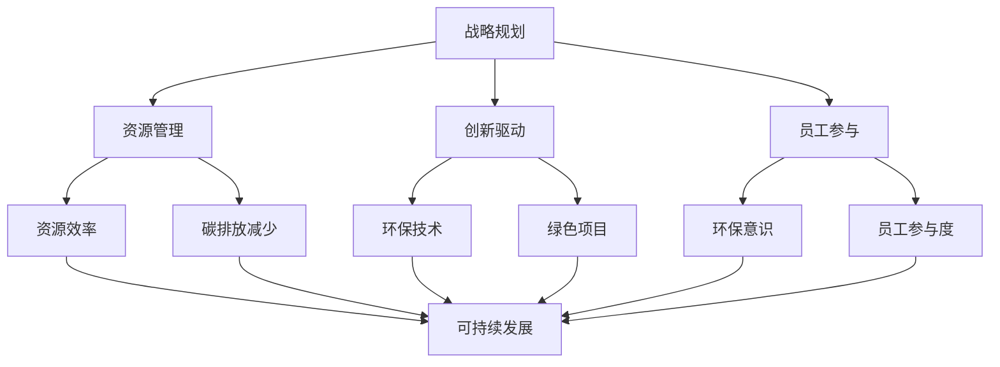

### 核心算法原理讲解

社会责任领导力的实践可以简化为以下几个步骤：

```python
function social_responsibility_leadership(strategic_planning, resource_management, innovation驱动, employee_involvement):
    # 战略规划
    strategic_planning = develop_sustainability_strategy()

    # 资源管理
    resource_management = optimize_resource_usage()

    # 创新驱动
    innovation驱動 = promote_innovative_green_technologies()

    # 员工参与
    employee_involvement = encourage_employees_to_participate()

    # 资源效率
    resource_efficiency = improve_resource_efficiency()

    # 碳排放减少
    carbon_reduction = reduce_carbon_emissions()

    # 环保技术
    environmental_technologies = invest_in_green_technologies()

    # 绿色项目
    green_projects = implement_environmental_projects()

    # 环保意识
    environmental_awareness = enhance_employee_awareness()

    # 员工参与度
    employee_participation = increase_employee_involvement()

    return success
```

在这个算法中，`develop_sustainability_strategy` 函数用于战略规划，`optimize_resource_usage` 函数用于资源管理，`promote_innovative_green_technologies` 函数用于创新驱动，而 `encourage_employees_to_participate` 函数用于员工参与。

### 数学模型和公式讲解

社会责任领导力的实践效果可以通过以下数学模型进行评估：

$$
社会责任效果 = f(战略规划, 资源管理, 创新驱动, 员工参与)
$$

具体公式可以表示为：

$$
战略规划 = \alpha_1 \cdot 可持续目标 + \alpha_2 \cdot 社会责任承诺
$$

$$
资源管理 = \beta_1 \cdot 资源效率 + \beta_2 \cdot 碳排放减少
$$

$$
创新驱动 = \gamma_1 \cdot 环保技术投资 + \gamma_2 \cdot 绿色项目实施
$$

$$
员工参与 = \delta_1 \cdot 环保意识提升 + \delta_2 \cdot 员工参与度
$$

其中，各个系数代表不同因素对社会责任效果的影响程度。

### 举例说明

假设一个企业在推动社会责任时，可以采取以下步骤：

1. **战略规划**：企业领导层制定了一份可持续发展战略，明确了企业的长期目标和社会责任。
2. **资源管理**：企业优化了生产流程，提高了资源利用效率，减少了碳排放。
3. **创新驱动**：企业投资于环保技术研发，推动了一系列绿色项目的实施。
4. **员工参与**：企业组织了环保培训活动，提升了员工的环保意识，并鼓励他们积极参与环保行动。

### 项目实战

以下是一个社会责任领导力的实际案例：

- **项目背景**：一家制造业公司决定通过实施环保措施，提升其社会责任形象。
- **领导力应用**：
  - **战略规划**：公司领导层制定了一份可持续发展战略，明确了企业的长期目标和社会责任。
  - **资源管理**：公司优化了生产流程，提高了资源利用效率，减少了碳排放。
  - **创新驱动**：公司投资于环保技术研发，推动了一系列绿色项目的实施。
  - **员工参与**：公司组织了环保培训活动，提升了员工的环保意识，并鼓励他们积极参与环保行动。
- **项目结果**：通过社会责任领导力的有效应用，公司成功提升了其社会责任形象，赢得了社会的广泛认可。

### 最佳实践 tips

- **战略规划**：领导者应将可持续发展纳入组织的战略规划，确保长期目标和社会责任的一致性。
- **资源管理**：领导者应优化资源管理，提高资源利用效率，减少浪费。
- **创新驱动**：领导者应鼓励创新，推动绿色技术和环保解决方案的应用。
- **员工参与**：领导者应激发员工的环保意识，推动全员参与可持续发展。

### 小结

领导力与社会责任密切相关，领导者应承担起推动可持续发展和履行社会责任的重要职责。通过战略规划、资源管理、创新驱动和员工参与等实践，领导者可以提升社会责任效果，推动组织的长期发展和成功。在本章中，我们介绍了领导力与社会责任的关系、领导力在可持续发展中的作用，并通过实际案例进行了说明。通过这些内容，读者可以更好地理解领导力与社会责任的重要性。

## 第11章 领导力在数字化转型中的角色

### 11.1 数字化转型的背景与挑战

数字化转型已经成为当今企业发展的核心趋势。随着信息技术的飞速发展，企业需要通过数字化手段提高效率、降低成本、优化客户体验，以应对激烈的市场竞争。然而，数字化转型也带来了诸多挑战，包括技术复杂性、数据安全、人才短缺等。

### 11.2 领导力在数字化转型中的作用

领导力在数字化转型中发挥着至关重要的作用。首先，领导者需要具备前瞻性和远见力，能够预见数字化带来的机遇和挑战，为组织制定清晰的战略方向。其次，领导者需要具备灵活性和适应性，能够快速调整组织结构和业务模式，以适应技术变革。此外，领导者还需要具备强大的沟通能力和影响力，能够动员全体员工参与数字化转型，并确保资源的有效配置。

### 11.3 数字化领导力策略

为了有效推动数字化转型，领导者可以采取以下策略：

- **愿景与战略**：明确数字化转型的愿景和目标，制定清晰的战略路径。
- **组织变革**：推动组织结构和业务流程的变革，以适应数字化时代的需求。
- **人才发展**：培养数字化人才，提升团队的整体数字化能力。
- **文化建设**：塑造创新和协作的企业文化，鼓励员工积极参与数字化转型。
- **技术投资**：加大技术投资，引进先进的数字化工具和解决方案。

### 11.4 数字化转型领导力实践案例

以下是一个数字化转型领导力实践案例：

- **项目背景**：一家传统制造企业决定进行数字化转型，以提高生产效率和客户满意度。
- **领导力应用**：
  - **愿景与战略**：企业领导层明确提出了数字化的愿景，制定了具体的战略目标和路径。
  - **组织变革**：企业领导层推动组织结构的调整，成立了专门的数字化部门，优化了业务流程。
  - **人才发展**：企业领导层大力培养数字化人才，通过内部培训和外部引进，提升了团队的整体数字化能力。
  - **文化建设**：企业领导层积极塑造创新和协作的企业文化，鼓励员工提出数字化改进建议。
  - **技术投资**：企业领导层加大了技术投资，引入了先进的生产线和数字化管理系统。
- **项目结果**：通过数字化转型领导力的有效应用，企业成功提升了生产效率，降低了成本，并大幅提高了客户满意度。

### 核心概念与联系

为了更好地理解数字化转型的核心概念和应用，我们可以通过Mermaid流程图来展示核心概念之间的关系：

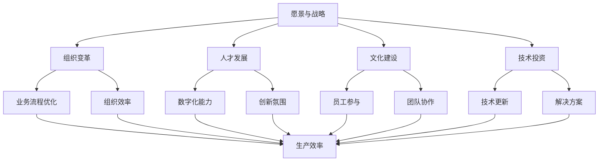

### 核心算法原理讲解

数字化转型领导力的实践可以简化为以下几个步骤：

```python
function digital_transformation_leadership(vision_and_strategy, organizational_change, talent_development, cultural_change, technology_investment):
    # 愿景与战略
    vision_and_strategy = set_digital_vision()

    # 组织变革
    organizational_change = adjust_organizational_structure()

    # 人才发展
    talent_development = build_digital_talent()

    # 文化建设
    cultural_change = foster_innovation_culture()

    # 技术投资
    technology_investment = invest_in_digital_technologies()

    # 业务流程优化
    process_optimization = optimize_business_processes()

    # 生产效率提升
    efficiency_improvement = enhance_production_efficiency()

    # 客户满意度提升
    customer_satisfaction = improve_customer_satisfaction()

    # 员工参与度提升
    employee_involvement = increase_employee_participation()

    # 技术更新
    technology_update = adopt_new_technologies()

    # 解决方案创新
    solution_innovation = develop_innovative_solutions()

    return success
```

在这个算法中，`set_digital_vision` 函数用于设定数字化愿景，`adjust_organizational_structure` 函数用于组织变革，`build_digital_talent` 函数用于人才发展，而 `foster_innovation_culture` 函数用于文化建设。

### 数学模型和公式讲解

数字化转型领导力的效果可以通过以下数学模型进行评估：

$$
数字化转型效果 = f(愿景与战略, 组织变革, 人才发展, 文化建设, 技术投资)
$$

具体公式可以表示为：

$$
愿景与战略 = \alpha_1 \cdot 愿景清晰度 + \alpha_2 \cdot 战略可行性
$$

$$
组织变革 = \beta_1 \cdot 业务流程优化 + \beta_2 \cdot 组织效率
$$

$$
人才发展 = \gamma_1 \cdot 数字化能力 + \gamma_2 \cdot 创新氛围
$$

$$
文化建设 = \delta_1 \cdot 员工参与度 + \delta_2 \cdot 团队协作
$$

$$
技术投资 = \epsilon_1 \cdot 技术更新 + \epsilon_2 \cdot 解决方案创新
$$

其中，各个系数代表不同因素对数字化转型效果的影响程度。

### 举例说明

假设一个企业在推动数字化转型时，可以采取以下步骤：

1. **设定数字化愿景**：明确企业数字化转型的目标和方向。
2. **组织变革**：调整组织结构，成立专门的数字化部门，优化业务流程。
3. **人才发展**：通过内部培训和外部引进，提升数字化人才的能力。
4. **文化建设**：鼓励创新和协作，提升员工的数字化意识。
5. **技术投资**：引进先进的技术和工具，推动解决方案的创新。

### 项目实战

以下是一个数字化转型领导力的实际案例：

- **项目背景**：一家传统零售企业决定进行数字化转型，以提高客户体验和运营效率。
- **领导力应用**：
  - **愿景与战略**：企业领导层明确提出了数字化的愿景，制定了具体的战略目标和路径。
  - **组织变革**：企业领导层推动组织结构的调整，成立了数字化部门，优化了业务流程。
  - **人才发展**：企业领导层大力培养数字化人才，通过内部培训和外部引进，提升了团队的整体数字化能力。
  - **文化建设**：企业领导层积极塑造创新和协作的企业文化，鼓励员工提出数字化改进建议。
  - **技术投资**：企业领导层加大了技术投资，引入了先进的技术和工具，推动了解决方案的创新。
- **项目结果**：通过数字化转型领导力的有效应用，企业成功提升了客户体验和运营效率，实现了业务的快速增长。

### 最佳实践 tips

- **愿景与战略**：领导者应明确数字化转型的愿景和目标，制定清晰的战略路径。
- **组织变革**：领导者应推动组织结构和业务流程的变革，以适应数字化时代的需求。
- **人才发展**：领导者应注重培养数字化人才，提升团队的整体数字化能力。
- **文化建设**：领导者应积极塑造创新和协作的企业文化，鼓励员工积极参与数字化转型。
- **技术投资**：领导者应加大技术投资，引进先进的技术和工具，推动解决方案的创新。

### 小结

在数字化时代，领导力在数字化转型中扮演着至关重要的角色。通过设定愿景与战略、推动组织变革、培养数字化人才、塑造创新文化和技术投资等实践，领导者可以有效地推动数字化转型，提升企业的竞争力和可持续发展能力。在本章中，我们介绍了数字化转型的背景与挑战、领导力在数字化转型中的作用，并通过实际案例进行了说明。通过这些内容，读者可以更好地理解领导力在数字化转型中的重要性。

