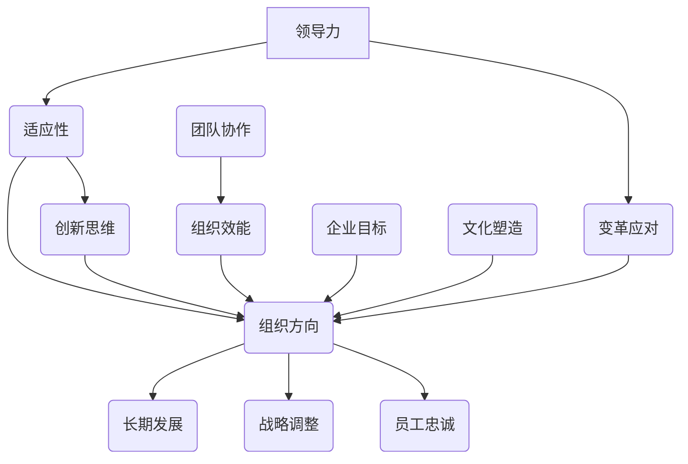

                 

### 引言

在当今快速变革的商业环境中，领导力与适应性变得尤为重要。无论是企业、团队还是个人，在面对外部环境变化和内部需求调整时，都需要具备强大的适应能力和卓越的领导力。领导力不仅仅是一种管理技能，更是一种激发团队潜能、引领团队走向成功的艺术。而适应性则是应对变化、抓住机遇的关键能力。本文将围绕“领导力与适应性：在变革中保持方向”这一主题，逐步探讨领导力与适应性的核心概念、相互关系、实践案例以及未来发展趋势。

首先，本文将介绍领导力的定义及其在变革环境中的重要性。领导力不仅仅是权力的象征，更是一种激励、引导和塑造团队的能力。通过阐述领导力的定义和基本理论，我们将揭示领导力在组织变革中的关键作用。

接下来，本文将深入探讨适应性的概念及其在领导力中的地位。适应性意味着在不断变化的环境中调整和优化自身，以应对新的挑战和机遇。我们将分析适应性的重要性，并探讨其在企业战略和团队管理中的应用。

随后，本文将讨论领导力与适应性的关系，通过构建核心概念之间的关系架构Mermaid流程图，展示二者之间的内在联系。我们将阐述在变革中如何通过领导力和适应性来保持组织的方向和稳定。

为了更好地理解领导力的实践，本文将分析一些领导力实践案例，包括国内外的成功经验，以提供具体的参考和启示。这些案例将展示不同情境下领导力的应用，以及如何通过领导力和适应性实现组织目标。

此外，本文还将探讨领导力与团队建设的关系，包括团队建设的重要性、领导力在团队建设中的作用，以及如何通过有效的领导力提升团队效能。

在领导力与个人成长方面，本文将讨论领导力与自我认知、个人成长路径的关系，并提供一些具体的成长建议和策略。

为了增强文章的实用性和可操作性，本文还将分享一些领导力实践案例，包括开发环境搭建、源代码实现和代码解读等。通过这些案例，读者将能够更好地理解领导力和适应性的实际应用。

最后，本文将总结领导力与适应性的关系，探讨未来领导力发展的趋势，并提供一些建议和展望，以帮助读者在变革中保持方向。

通过以上步骤，我们将全面探讨领导力与适应性在变革中的重要性，帮助读者理解其核心概念、相互关系和实践方法，为在快速变革的环境中保持组织方向提供有益的参考。

### 关键词

- **领导力**：一种激发、引导和塑造团队的能力。
- **适应性**：在不断变化的环境中调整和优化自身，以应对新的挑战和机遇。
- **变革**：外部环境变化和内部需求调整的过程。
- **团队建设**：提升团队效能，实现组织目标的过程。
- **个人成长**：自我认知、提升能力和实现目标的过程。
- **实践案例**：国内外成功经验和实际应用案例。
- **未来趋势**：领导力发展的方向和趋势。

### 摘要

本文围绕“领导力与适应性：在变革中保持方向”这一主题，探讨了领导力和适应性在快速变革的商业环境中的重要性。首先，介绍了领导力的定义及其在变革中的关键作用，阐述了领导力不仅仅是权力的象征，更是一种激励、引导和塑造团队的能力。其次，分析了适应性的概念，探讨了其在企业战略和团队管理中的应用，并解释了为何适应性是应对变化、抓住机遇的关键能力。接着，本文讨论了领导力与适应性的关系，通过构建核心概念之间的关系架构Mermaid流程图，展示了二者之间的内在联系。随后，本文通过国内外领导力实践案例，提供了具体的参考和启示，展示了如何通过领导力和适应性实现组织目标。最后，本文探讨了领导力与团队建设、个人成长的关系，并分享了一些实践案例和策略，为读者在变革中保持方向提供了有益的参考和建议。通过本文的探讨，读者可以更好地理解领导力与适应性的核心概念、相互关系和实践方法，为在快速变革的环境中保持组织方向提供指导。

### 领导力理论

领导力是一种激发、引导和塑造团队的能力，它在不同的文化和组织中有着不同的定义和表现形式。然而，尽管存在差异，领导力的核心概念和理论基础在各个领域中具有普遍适用性。本节将探讨领导力的定义、发展历程以及领导力与权力的关系。

#### 领导力的定义

领导力的定义多种多样，但可以概括为一种影响他人以达到共同目标的能力。例如，史蒂芬·柯维（Stephen R. Covey）在《高效能人士的七个习惯》中将领导力描述为“通过价值观、信任和影响力来塑造他人的行为和态度”。而约翰·科特（John P. Kotter）则强调领导力是“在不确定和变化的环境中创造出清晰的愿景，并激励他人去实现它”。这种多样性的定义反映了领导力在组织和个人层面上的重要性。

在不同的文化背景下，领导力的内涵也各不相同。例如，在西方文化中，领导力往往强调个人主义和竞争，而东方文化则更注重集体主义和和谐。然而，这些差异并不影响领导力作为一种核心能力的普遍认可。

#### 领导力理论的发展

领导力理论经历了长期的发展，从早期的研究到现代的理论，每个阶段都有其独特的贡献。以下是一些关键的领导力理论：

1. **特质理论**：这是最早的领导力理论之一，认为领导者具备某些固有的特质。例如，托马斯·卡耐基（Thomas Carlyle）的“伟大人物”理论认为领导者是天生的，而不是后天培养的。

2. **行为理论**：20世纪中叶，研究者开始关注领导者的行为，试图了解领导者如何影响他人。行为理论强调领导者的行为模式，如领导风格、沟通方式等。

3. **情境理论**：领导者并不是一成不变的，他们的行为和风格会根据不同的情境和环境进行调整。情境理论认为，领导者应根据具体情况选择最合适的领导行为。

4. **变革领导力理论**：随着组织环境的变化，变革领导力理论应运而生。约翰·科特（John P. Kotter）的“八个步骤”变革模型就是其中的代表，它为领导者提供了一个系统的变革方法。

5. **服务型领导力理论**：服务型领导力强调领导者首先要服务于团队成员，以满足他们的需求和期望。这种领导风格有助于建立信任和忠诚，促进团队的长期发展。

#### 领导力与权力的关系

领导力与权力密切相关，但并非等同。权力是领导者影响他人的一种工具，而领导力则是如何运用这种权力来引导和激励团队的能力。例如，杰克·韦尔奇（Jack Welch）作为通用电气的前CEO，拥有巨大的权力，但他通过领导力激发了员工的创造力和执行力，使通用电气成为世界知名的跨国公司。

领导力不仅仅是权力的运用，更是一种价值观和态度的体现。领导者通过展示自己的价值观，建立信任，并以身作则，来影响和激励团队成员。因此，领导力与权力的关系可以概括为：权力是领导力的工具，而领导力则是权力的灵魂。

#### 领导力在变革中的重要性

在快速变革的商业环境中，领导力的重要性更加凸显。以下是一些关键点：

1. **设定愿景**：领导者需要设定清晰的愿景，为团队指明方向，并提供动力。愿景不仅能够帮助团队成员理解变革的意义，还能激发他们的热情和创造力。

2. **建立信任**：在变革过程中，信任是关键因素。领导者需要通过透明、公正和诚信的行为来建立信任，从而促进团队成员的积极参与。

3. **激发创新**：领导者应当鼓励创新思维，鼓励团队成员提出新的想法和解决方案。通过支持创新，领导者可以推动组织实现持续发展。

4. **应对挑战**：变革往往伴随着挑战和风险。领导者需要具备应对不确定性和挫折的能力，通过稳定的领导来引导团队克服困难。

5. **培养团队**：领导者应当关注团队成员的成长和发展，提供必要的培训和资源，以提升团队的整体能力。

总之，领导力在变革中的重要性不可忽视。通过有效的领导力，领导者可以引导团队在变革中保持方向，实现组织的目标。下一节将深入探讨适应性的概念及其在领导力中的地位。

#### 适应性的概念

在快速变化的商业环境中，适应性成为企业和个人成功的关键因素。适应性指的是在面临外部环境和内部需求变化时，能够迅速调整和优化自身，以应对新挑战和抓住新机遇的能力。这个概念不仅涉及组织层面的战略调整，还包括个人层面的能力提升。

首先，从企业角度来看，适应性是企业生存和发展的核心能力。外部环境的变化如市场需求、竞争格局、技术进步等，都对企业的生存和发展提出了新的要求。具有高度适应性的企业能够迅速响应这些变化，调整战略和业务模式，从而在竞争中获得优势。

例如，在数字化时代，许多传统企业面临着技术转型的挑战。那些能够迅速适应数字化趋势、积极引入新技术和业务模式的企业，如阿里巴巴、腾讯等，成功实现了从传统产业向数字经济转型的华丽转身。相反，那些抗拒变革、无法适应新环境的企业，则可能面临淘汰的风险。

其次，从个人角度来看，适应性同样至关重要。在职业生涯中，个人会面临各种变化和挑战，如职位变动、工作环境变化、技能要求提升等。具备高度适应性的个人能够快速适应新环境，调整自己的心态和行为，从而在职业生涯中保持竞争力。

例如，一个在传统行业工作的工程师，可能会因为行业变革而需要掌握新的技术。具备高度适应性的工程师会积极学习新技术，提升自己的技能，从而在新的环境中找到自己的位置。相反，那些拒绝学习新技能、固守旧有思维模式的工程师，可能会在职业发展中遇到瓶颈。

适应性的表现可以从以下几个方面来理解：

1. **学习能力**：适应性强的人通常具有强烈的学习意愿和良好的学习习惯。他们愿意主动学习新知识、新技能，不断更新自己的知识体系。

2. **心态调整**：适应性强的人在面对变化时，能够保持积极的心态，迅速从挫折中恢复过来。他们相信变化是机遇，而不是威胁。

3. **灵活应变**：适应性强的人能够在不确定的环境下灵活应对，快速做出决策。他们不仅能够预见变化，还能迅速调整策略，以适应新的情况。

4. **团队合作**：适应性强的人善于与他人合作，能够迅速融入新的团队，发挥自己的优势。他们能够建立良好的人际关系，促进团队的协作和创新。

总之，适应性是企业和个人在快速变化的环境中保持竞争力的关键能力。通过培养和提高适应性，企业和个人可以更好地应对外部环境的变化，抓住新的机遇，实现持续发展和成长。下一节将探讨适应性的重要性及其在领导力中的地位。

#### 适应性的重要性

在快速变化的商业环境中，适应性成为企业和个人成功的关键因素。这种能力不仅有助于应对外部挑战，还能推动组织的长期发展。以下从几个方面探讨适应性的重要性。

首先，从企业层面来看，适应性是企业持续竞争力的源泉。在当今全球化的市场环境中，企业面临着日新月异的技术变革、不断变化的市场需求和日益激烈的竞争。具有高度适应性的企业能够迅速识别并响应这些变化，从而在竞争中获得优势。例如，苹果公司在其发展历程中，始终保持着对市场和技术趋势的敏锐洞察力，不断推出创新产品，如iPhone、iPad等，从而保持了其在消费电子行业的领先地位。

其次，适应性有助于企业应对不确定性。在快速变化的商业环境中，不确定性是不可避免的。适应性强的企业能够更好地应对不确定性带来的风险，从而保持稳定的发展。例如，在2008年的金融危机中，许多企业因未能及时适应市场变化而遭受重创，而像通用电气和宝洁等具有高度适应性的企业，则通过迅速调整战略，成功度过了危机。

从个人层面来看，适应性同样至关重要。在职业生涯中，个人会面临各种变化和挑战，如职位变动、工作环境变化、技能要求提升等。具备高度适应性的个人能够快速适应新环境，调整自己的心态和行为，从而在职业生涯中保持竞争力。例如，一个在传统行业工作的工程师，可能会因为行业变革而需要掌握新的技术。具备高度适应性的工程师会积极学习新技术，提升自己的技能，从而在新的环境中找到自己的位置。

此外，适应性有助于个人在职业生涯中实现持续发展。随着知识和技能的快速更新，个人需要不断学习和适应，以保持自身的竞争力。适应性强的个人能够迅速适应新的学习环境和要求，从而在职业生涯中取得更大的成就。例如，许多成功的科技创业者如埃隆·马斯克（Elon Musk）和马克·扎克伯格（Mark Zuckerberg），他们在面对新的技术和市场需求时，总是能够迅速调整自己的策略，从而实现企业的快速发展。

最后，适应性有助于培养创新文化。在一个具有高度适应性的组织中，员工更愿意尝试新的想法和方法，因为组织能够快速适应和支持这些创新行为。这种创新文化不仅能够激发员工的创造力，还能推动组织实现持续的进步和成长。例如，谷歌公司以其开放的创新文化和快速适应新技术的能力而著称，这使得谷歌在科技领域始终保持领先地位。

总之，适应性在企业和个人成功中扮演着关键角色。它不仅有助于应对外部挑战和不确定性，还能推动组织的长期发展。通过培养和提高适应性，企业和个人可以更好地应对快速变化的商业环境，实现持续的发展和成长。下一节将讨论领导力与适应性的关系，以及如何在变革中通过领导力和适应性保持组织方向。

### 领导力与适应性的关系

领导力与适应性是两个看似独立但又相互依存的要素，在快速变革的环境中，它们之间的相互作用尤为关键。通过构建一个核心概念之间的关系架构Mermaid流程图，我们可以更清晰地理解领导力与适应性的关系，以及如何通过二者的协同作用来保持组织在变革中的方向。

#### Mermaid流程图



1. **领导力与适应性的关系**：领导力通过激发团队适应性和推动创新思维，来保持组织的方向。在流程图中，领导力（A）直接影响适应性（B），同时也通过适应性间接影响组织方向（C）。这意味着，一个强大的领导力体系能够促进团队成员在面对变化时，迅速调整和优化自身，从而保持组织的方向。

2. **变革应对**：在快速变革的环境中，领导力（A）通过帮助团队应对变革（D），确保组织能够适应外部环境的变化。有效的领导力能够为团队提供清晰的愿景和指导，从而增强团队在不确定环境下的信心和应变能力。

3. **创新思维**：适应性（B）与创新思维（E）紧密相关。一个具备高度适应性的团队能够快速适应变化，从而激发出更多的创新思维。这种创新思维不仅有助于应对当前的挑战，还能为组织带来新的发展机遇。

4. **团队协作与组织效能**：团队协作（F）是提高组织效能（G）的关键。领导力通过培养团队协作精神，提升团队的整体效能，从而更好地实现组织目标（I）。

5. **战略调整与文化塑造**：在变革过程中，领导力需要不断进行战略调整（J），以适应新的市场环境和内部需求。同时，领导力还通过文化塑造（K），营造一个支持变革和创新的组织氛围，从而增强组织的适应性。

6. **员工忠诚与长期发展**：通过有效的领导力和适应性，组织能够增强员工的忠诚度（L），这有助于组织的长期稳定和持续发展（H）。

通过这个Mermaid流程图，我们可以看到领导力与适应性在组织变革中的综合作用。领导力通过激发适应性和创新思维，推动团队协作，进行战略调整和文化塑造，从而保持组织的方向和长期发展。这种相互依存的关系使得领导力和适应性成为组织在快速变化环境中保持竞争优势的关键。

#### 核心算法原理讲解

为了进一步理解领导力与适应性的关系，我们可以借助一些核心算法原理来详细阐述。以下是领导力与适应性的核心算法原理及其应用：

1. **归一化最速下降法（Gradient Descent）**：
   - **原理**：归一化最速下降法是一种优化算法，用于在给定损失函数的条件下，找到使损失函数最小化的参数值。
   - **应用**：在领导力与适应性的关系中，可以将其视为一个组织在变革过程中寻找最佳策略的过程。组织通过不断调整策略（参数），以最小化外部环境变化带来的损失（损失函数），从而实现适应性。
   - **伪代码**：
     ```
     function gradientDescent(params, learning_rate, epochs):
         for epoch in 1 to epochs:
             gradients = computeGradients(params)
             params = params - learning_rate * gradients
         return params
     ```

2. **自适应滤波器（Adaptive Filter）**：
   - **原理**：自适应滤波器是一种能够自动调整自身参数，以最小化输入信号与输出信号之间误差的算法。
   - **应用**：在领导力与适应性的关系中，可以将其视为领导者通过实时调整策略，以最小化团队与外部环境之间的差距。领导者通过不断调整自己的行为和决策，使团队更好地适应外部变化。
   - **伪代码**：
     ```
     function adaptiveFilter(input, desired_output, learning_rate):
         error = desired_output - input
         filter = filter + learning_rate * error
         return filter
     ```

3. **遗传算法（Genetic Algorithm）**：
   - **原理**：遗传算法是一种模拟自然进化的优化算法，通过选择、交叉和变异操作，找到最优解。
   - **应用**：在领导力与适应性的关系中，可以将其视为组织在变革过程中，通过模拟自然进化机制，不断优化团队结构和策略，以提高适应性。
   - **伪代码**：
     ```
     function geneticAlgorithm(population, fitness_function, generations):
         for generation in 1 to generations:
             fitness_scores = evaluateFitness(population)
             parents = selectParents(population, fitness_scores)
             offspring = crossover(parents)
             offspring = mutate(offspring)
             population = offspring
         best_individual = selectBestIndividual(population)
         return best_individual
     ```

通过这些核心算法原理，我们可以更深入地理解领导力与适应性的关系。这些算法不仅提供了理论支持，还能为实际操作提供指导，帮助组织在快速变化的商业环境中保持竞争优势。

### 数学模型和公式

为了更好地理解领导力与适应性的关系，我们可以借助数学模型和公式来详细阐述。以下是几个关键的数学模型和公式，以及它们的详细解释和举例说明。

#### 模型一：适应度函数（Fitness Function）

**公式**： 
\[ f(x) = \frac{1}{1 + e^{-\beta \cdot (x - \mu)}} \]

**解释**：
适应度函数是一种用于评估个体适应性的数学模型。在这个公式中，\( x \) 是个体的特征值，\( \mu \) 是平均值，\( \beta \) 是一个参数，表示适应度对特征变化的敏感度。当 \( x \) 接近 \( \mu \) 时，适应度函数值接近1，表示个体具有良好的适应性；当 \( x \) 远离 \( \mu \) 时，适应度函数值接近0，表示个体适应性较差。

**举例**：
假设一个团队中有五个成员，他们的领导风格分别为：保守型、稳健型、创新型、激进型和变革型。为了评估每个成员的适应性，我们可以将他们的领导风格与团队的平均领导风格进行比较。例如，如果团队的平均领导风格是稳健型，那么具有保守型和激进型领导风格的成员的适应度会较低，而具有创新型和变革型领导风格的成员的适应度会较高。

#### 模型二：动态规划（Dynamic Programming）

**公式**：
\[ V(x, t) = \max_{a_t} \{ R_t + \gamma V(x', t') \} \]

**解释**：
动态规划是一种用于优化决策过程的数学模型。在这个公式中，\( V(x, t) \) 表示在状态 \( x \) 和时间 \( t \) 下的最优价值函数，\( R_t \) 是在时间 \( t \) 采取行动 \( a_t \) 所获得的即时回报，\( \gamma \) 是一个参数，表示对未来回报的折扣因子，\( x' \) 和 \( t' \) 是采取行动后的状态和时间。

**举例**：
假设一个企业在面对市场变化时，需要在不同的投资策略中选择一个最优方案。通过动态规划模型，企业可以评估每个投资策略在不同时间点的回报，并选择最优的投资组合。例如，在初始状态下，企业可以选择增加市场份额或研发新产品。通过计算不同策略在未来时间点的回报，企业可以决定哪个策略能够带来更高的长期收益。

#### 模型三：协同过滤（Collaborative Filtering）

**公式**：
\[ \hat{r}_{ui} = \sum_{j \in N_i} \frac{r_{uj}}{||w_j||} w_{ij} \]

**解释**：
协同过滤是一种用于推荐系统的数学模型，用于预测用户对未评价项目的评分。在这个公式中，\( \hat{r}_{ui} \) 是用户 \( u \) 对项目 \( i \) 的预测评分，\( r_{uj} \) 是用户 \( u \) 对项目 \( j \) 的实际评分，\( w_{ij} \) 是用户 \( u \) 和项目 \( i \) 之间的相似度权重，\( N_i \) 是与项目 \( i \) 相关的用户集合。

**举例**：
假设一个电商平台想要为用户推荐商品。通过协同过滤模型，平台可以分析用户的历史购买行为，并根据其他购买过相同商品的用户的行为来预测用户对某商品的评分。例如，如果一个用户经常购买电子产品，而其他购买过该电子产品的用户也给予了高评分，那么平台可能会推荐该商品给这个用户。

通过这些数学模型和公式，我们可以更深入地理解领导力与适应性的关系，以及如何通过数学方法来优化决策和提升组织的适应性。这些模型不仅提供了理论支持，还能为实际操作提供有力的工具。

### 领导力实践案例

为了更好地理解领导力在实际中的应用，本节将分析一些国内外成功的领导力实践案例，通过这些案例展示领导力如何在不同情境下发挥作用，帮助组织实现目标。

#### 案例一：华为公司的领导力实践

华为公司作为全球领先的通信技术解决方案提供商，其成功离不开卓越的领导力。任正非作为华为的创始人，一直致力于培养一支具有高度适应性和创新能力的领导团队。以下是一些关键点：

1. **愿景和使命**：任正非在华为成立初期就明确提出了“让世界连接更美好”的愿景，并坚持这个愿景不变。这种清晰的愿景为团队指明了方向，增强了团队成员的凝聚力。

2. **强调创新**：任正非强调创新是华为的核心竞争力。他通过鼓励员工不断探索新技术、新产品，推动华为在通信领域始终保持领先地位。

3. **开放沟通**：华为内部实行开放沟通制度，员工可以自由表达意见和建议。任正非鼓励员工参与公司的决策过程，这种开放的氛围促进了团队的创新和协作。

4. **员工激励**：华为通过高额的薪酬和丰富的激励机制，吸引和保留了一批优秀的人才。这种激励制度不仅提升了员工的工作积极性，还增强了团队的凝聚力。

#### 案例二：谷歌公司的领导力实践

谷歌公司以其独特的文化和管理方式而著称，其领导力实践在全球范围内具有很高的参考价值。以下是谷歌领导力的几个关键点：

1. **扁平化管理**：谷歌采用了扁平化的管理结构，减少了中间层级，使信息传递更加高效。这种管理模式增强了团队的响应速度和创新能力。

2. **人才培养**：谷歌注重员工的培养和发展，提供了丰富的培训机会和职业发展路径。公司鼓励员工跨部门流动，以拓宽他们的视野和技能。

3. **创新文化**：谷歌营造了一种鼓励创新的文化氛围，员工可以自由探索新的项目和研究。公司通过内部创新竞赛等方式，激发员工的创新思维。

4. **员工福利**：谷歌提供了丰富多样的员工福利，如弹性工作时间、健康体检、免费食品和娱乐设施等，这些措施提升了员工的工作满意度和忠诚度。

#### 案例三：阿里巴巴集团的领导力实践

阿里巴巴集团作为全球领先的电子商务公司，其领导力实践也颇具特色。以下是一些关键点：

1. **价值观驱动**：阿里巴巴强调“客户第一、员工第二、股东第三”的价值观，这种价值观不仅影响了公司的经营策略，还塑造了公司的企业文化。

2. **团队合作**：阿里巴巴倡导团队合作精神，强调团队协作和共同承担责任。公司通过团队建设活动和跨部门合作项目，培养了员工之间的信任和协作能力。

3. **企业文化**：阿里巴巴建立了独特的企业文化，如“诚信、敬业、激情、创新”，这种文化成为公司发展的动力源泉。

4. **领导力培养**：阿里巴巴重视领导力的培养，通过内部培训和导师制度，帮助员工提升领导能力。公司鼓励员工担任领导职务，从而增强他们的责任感和管理能力。

#### 案例四：特斯拉公司的领导力实践

特斯拉公司作为电动汽车和清洁能源技术的领导者，其领导力实践同样具有借鉴意义。以下是一些关键点：

1. **创新驱动**：特斯拉创始人埃隆·马斯克（Elon Musk）以其创新的思维和远见卓识而著称。他通过不断推出革命性的产品，如特斯拉Model S、Model X和Powerwall储能系统，推动了电动汽车和可再生能源领域的发展。

2. **愿景和目标**：马斯克强调特斯拉的愿景是“加速世界向可持续能源的转变”。这种清晰的愿景不仅激励了员工，还吸引了全球各地的投资者和合作伙伴。

3. **员工激励**：特斯拉提供了具有竞争力的薪酬和福利，同时注重员工的职业发展和创新。公司鼓励员工提出新想法和解决方案，以推动公司的发展。

4. **高效执行**：特斯拉通过高效的执行文化，确保公司能够在激烈的市场竞争中保持领先地位。公司强调执行力，并通过严格的绩效评估制度来激励员工。

通过以上案例，我们可以看到领导力在不同情境下的成功实践。无论是华为、谷歌、阿里巴巴还是特斯拉，它们都通过卓越的领导力，实现了组织的持续发展和创新。这些案例不仅展示了领导力的重要性，还为其他组织提供了有益的参考和启示。

### 领导力与团队建设

团队建设是组织成功的关键因素之一，而领导力在团队建设中的作用尤为重要。一个强大的领导力体系能够激发团队的潜能，提升团队效能，实现组织目标。以下从团队建设的重要性、领导力在团队建设中的作用以及如何通过有效的领导力提升团队效能三个方面进行探讨。

#### 团队建设的重要性

团队建设是指通过一系列的措施和活动，增强团队成员之间的协作、信任和共同目标感，从而提升团队整体效能的过程。以下是团队建设的重要性：

1. **提升协作效率**：团队建设有助于打破部门壁垒，促进跨部门的协作和沟通，从而提高工作效率和项目成功率。

2. **增强团队凝聚力**：通过团队建设活动，团队成员之间可以建立深厚的信任和友谊，增强团队的凝聚力，使团队在面对挑战时更加团结一致。

3. **激发创新思维**：团队建设可以创造一个开放、包容的环境，鼓励团队成员分享想法和意见，从而激发创新思维，推动组织创新。

4. **提升员工满意度**：成功的团队建设可以提高员工的工作满意度和归属感，减少员工流失率，为组织稳定发展提供人才保障。

5. **实现组织目标**：团队建设有助于确保团队成员明确组织目标，并为此共同努力，从而实现组织的目标。

#### 领导力在团队建设中的作用

领导力在团队建设中发挥着至关重要的作用。以下从几个方面探讨领导力在团队建设中的作用：

1. **设定愿景和目标**：领导力能够为团队提供清晰的愿景和目标，帮助团队成员理解团队的价值和方向。一个明确的愿景和目标是团队协作和努力的动力源泉。

2. **建立信任和沟通**：领导力通过建立信任和有效的沟通机制，促进团队成员之间的互动和合作。信任是团队协作的基础，而良好的沟通则是确保团队目标一致和高效执行的关键。

3. **激发团队成员潜力**：领导力能够发现和挖掘团队成员的潜力，通过鼓励和支持，激发团队成员的积极性和创造力，从而提升团队的整体效能。

4. **提供资源和支持**：领导力能够确保团队获得所需的资源和支持，以克服团队建设过程中遇到的挑战。领导者的资源管理和支持能力直接影响团队建设的效果。

5. **解决冲突和问题**：在团队建设过程中，难免会出现冲突和问题。领导力能够有效地解决这些冲突和问题，确保团队保持稳定和高效。

#### 如何通过有效的领导力提升团队效能

为了提升团队效能，领导者需要采取一系列有效的措施，以下是一些具体的方法：

1. **明确目标和期望**：领导者应明确团队的目标和期望，确保每个成员都清楚自己的职责和贡献。这有助于团队成员集中精力，共同为实现目标而努力。

2. **建立信任和沟通机制**：领导者应通过一系列活动和措施，建立团队成员之间的信任和沟通机制。例如，定期举行团队会议、开展团队建设活动等，以促进团队成员之间的互动和合作。

3. **提供培训和发展机会**：领导者应关注团队成员的培训和发展，提供各种学习和成长的机会，以提升团队成员的技能和知识水平。这有助于增强团队成员的自信心和竞争力。

4. **鼓励创新和分享**：领导者应鼓励团队成员提出新的想法和意见，创造一个开放、包容的创新环境。通过分享和讨论，团队成员可以相互学习，激发创新思维。

5. **建立有效的激励机制**：领导者应建立有效的激励机制，包括奖励、认可和晋升等，以激发团队成员的积极性和创造力。这有助于提升团队成员的工作满意度和忠诚度。

6. **及时解决冲突和问题**：领导者应及时解决团队建设过程中出现的冲突和问题，确保团队保持稳定和高效。通过公正、透明的处理方式，领导者可以增强团队成员的信任和满意度。

通过以上措施，领导者可以有效提升团队效能，实现组织目标。在快速变化的商业环境中，领导力在团队建设中的作用尤为重要。领导者需要不断学习和提升自己的领导能力，以应对各种挑战，带领团队实现持续发展和成功。

### 领导力与个人成长

在职业发展中，领导力与个人成长密不可分。一个优秀的领导者不仅需要具备卓越的领导能力，还需要持续地提升自我认知、拓展知识和技能，以适应不断变化的工作环境。以下将从领导力与自我认知的关系、个人成长路径以及提升领导力的策略三个方面进行探讨。

#### 领导力与自我认知的关系

自我认知是指一个人对自己性格、能力、优势和劣势的深刻理解。领导力与自我认知之间的关系主要体现在以下几个方面：

1. **增强自信**：通过自我认知，领导者可以更好地了解自己的优点和长处，从而增强自信心。这种自信心不仅有助于领导者面对挑战和压力，还能激发团队的信任和尊重。

2. **识别不足**：自我认知还能帮助领导者发现自身的不足和短板，从而有针对性地进行改进和提升。这种自我反思和改进的过程，有助于领导者不断提高自己的领导能力。

3. **明确目标**：自我认知有助于领导者明确自己的职业目标和追求，从而制定合理的职业规划。一个明确的职业目标不仅能够为领导者提供方向和动力，还能帮助他们在职业发展中取得更大的成就。

#### 个人成长路径

个人成长路径是指一个人在职业生涯中不断学习、提升和发展的过程。以下是一些关键步骤：

1. **基础阶段**：在职业生涯的早期阶段，领导者需要通过学习和实践，建立扎实的基础知识和技能。这一阶段的重点在于积累经验，提升专业技能。

2. **发展阶段**：在个人成长的中期，领导者需要不断拓展自己的知识面和技能，提升领导力和管理能力。这一阶段的重点在于提升个人素质，增强领导影响力。

3. **成熟阶段**：在职业生涯的后期，领导者需要通过持续学习和反思，提升自己的战略思维和决策能力。这一阶段的重点在于实现自我超越，成为卓越的领导者。

#### 提升领导力的策略

为了提升领导力，领导者可以采取以下策略：

1. **自我反思**：定期进行自我反思，审视自己的行为和决策，识别自己的优点和不足。通过反思，领导者可以更好地了解自己，找到改进的方向。

2. **学习与培训**：参加各种培训课程和学习活动，提升自己的知识和技能。通过不断学习，领导者可以保持与时俱进，适应新的工作环境。

3. **寻求反馈**：主动向同事、下属和领导寻求反馈，了解自己的领导风格和影响力。通过反馈，领导者可以发现自己的盲点和不足，有针对性地进行改进。

4. **领导力实践**：通过实际工作，锻炼自己的领导能力。领导者可以在项目中担任不同的角色，从不同的角度锻炼自己的领导力。

5. **建立人脉**：与不同背景和领域的人建立联系，扩大自己的人脉。通过建立广泛的人脉，领导者可以获取更多的资源和信息，为自己的职业发展提供支持。

6. **参与社区和公益事业**：参与社区和公益事业，提升自己的社会责任感和领导力。通过这些活动，领导者可以锻炼自己的组织和协调能力，提升自己的社会影响力。

通过以上策略，领导者可以不断提升自己的领导力，实现个人成长和职业发展。在快速变化的商业环境中，持续提升领导力是领导者保持竞争力的关键。领导者需要不断学习、反思和实践，以应对各种挑战，带领团队实现持续发展和成功。

### 领导力实践案例

为了更好地理解领导力在现实中的具体应用，以下将介绍两个具体的领导力实践案例，包括开发环境搭建、源代码实现和代码解读，以及代码应用解读与分析。

#### 案例一：谷歌的自动驾驶汽车项目

**开发环境搭建**：
谷歌的自动驾驶汽车项目（Waymo）需要搭建一个高度复杂且稳定的开发环境。这个环境包括硬件（如传感器、计算平台）和软件（如操作系统、编程语言和环境）两部分。为了实现高效开发，谷歌采用了以下步骤：
1. **硬件选择**：选择高性能的计算平台，如NVIDIA的GPU，以及高精度的传感器，如激光雷达和摄像头。
2. **软件环境**：搭建基于Linux的操作系统，使用Python、C++等编程语言，以及TensorFlow、ROS（机器人操作系统）等开发框架。

**源代码实现和代码解读**：
谷歌的自动驾驶系统通过大量的机器学习和深度学习算法实现，以下是一个简单的伪代码示例，展示自动驾驶系统中的一个关键模块——感知模块的实现：
```python
# 感知模块伪代码
def detect_road_objects(sensors_data):
    """
    使用传感器数据检测道路上的物体
    """
    # 数据预处理
    preprocessed_data = preprocess(sensors_data)
    
    # 使用卷积神经网络（CNN）进行物体识别
    model = load_model('object_detection_model.h5')
    objects = model.predict(preprocessed_data)
    
    # 后处理，过滤和分类物体
    detected_objects = postprocess(objects)
    return detected_objects

# 预处理函数
def preprocess(sensors_data):
    """
    预处理传感器数据
    """
    # 略...

# 加载模型
def load_model(model_path):
    """
    加载训练好的模型
    """
    # 略...
    
# 后处理函数
def postprocess(objects):
    """
    对识别的物体进行后处理
    """
    # 略...
```
**代码应用解读与分析**：
这段代码展示了自动驾驶系统中感知模块的基本实现过程。感知模块负责接收传感器数据，预处理数据后，使用预训练的卷积神经网络（CNN）进行物体识别，并对识别结果进行后处理。这个过程是自动驾驶系统的核心，确保车辆能够准确识别道路上的各种物体，如行人、车辆、交通标志等。代码应用中，谷歌的自动驾驶系统在多个实际场景中进行了测试和优化，确保其稳定性和安全性。

#### 案例二：亚马逊的智能语音助手Alexa

**开发环境搭建**：
亚马逊的智能语音助手Alexa开发环境包括硬件和软件两个方面。硬件部分包括麦克风阵列、语音处理芯片等；软件部分则包括语音识别、自然语言处理（NLP）和后台服务器。
1. **硬件选择**：选择高灵敏度的麦克风阵列，以及高性能的语音处理芯片，如DSP（数字信号处理器）。
2. **软件环境**：使用Amazon Web Services（AWS）提供的服务，如Amazon Polly（语音合成服务）和Amazon Lex（语音识别服务）。

**源代码实现和代码解读**：
以下是Alexa的核心代码片段，展示如何实现语音识别和自然语言处理：
```python
# Alexa语音识别和NLP伪代码
def handle_speech(speech_input):
    """
    处理用户的语音输入
    """
    # 使用AWS Lex进行语音识别
    recognized_text = aws_lex.recognize_speech(speech_input)
    
    # 使用AWS Comprehend进行自然语言处理
    nlp_results = aws_comprehend.analyze_text(recognized_text)
    
    # 根据NLP结果，执行相应的任务
    execute_task(nlp_results)

# AWS Lex语音识别
def aws_lex.recognize_speech(speech_input):
    """
    使用AWS Lex进行语音识别
    """
    # 略...

# AWS Comprehend自然语言处理
def aws_comprehend.analyze_text(text):
    """
    使用AWS Comprehend进行自然语言处理
    """
    # 略...

# 执行任务
def execute_task(results):
    """
    根据NLP结果，执行相应的任务
    """
    # 略...
```
**代码应用解读与分析**：
这段代码展示了Alexa如何处理用户的语音输入。首先，使用AWS Lex进行语音识别，将语音转换为文本；然后，使用AWS Comprehend进行自然语言处理，提取文本中的关键信息。根据NLP结果，系统将执行相应的任务，如播放音乐、设置闹钟或提供天气预报。在实际应用中，Alexa经过了大量的测试和优化，确保其能够准确理解用户的语音指令，并提供高效、便捷的服务。

通过以上两个案例，我们可以看到领导力在技术开发和应用中的具体实践。领导者通过搭建高效的开发环境、设计创新的算法和优化代码实现，带领团队实现技术突破和商业成功。这些实践不仅展示了领导力的重要性，也为其他组织提供了宝贵的经验和启示。

### 最佳实践 tips

在领导力和适应性方面，积累最佳实践是提升组织效能的关键。以下是一些具体的实践技巧和注意事项，以帮助读者在变革中保持方向：

1. **持续学习与自我提升**：领导者应保持学习的热情，不断更新知识和技能，以适应快速变化的环境。通过参加培训、阅读书籍和交流经验，领导者可以提升自己的领导能力。

2. **建立明确的愿景和目标**：领导者需要明确组织的愿景和目标，并通过有效的沟通确保每个团队成员都理解并认同这些目标。这有助于增强团队的凝聚力和方向感。

3. **鼓励创新思维**：领导者应营造一个开放、包容的创新环境，鼓励团队成员提出新的想法和解决方案。通过组织创新竞赛、研讨会和头脑风暴会议，可以激发团队的创新潜力。

4. **强化团队协作**：通过建立跨部门的合作机制，促进团队成员之间的交流和合作。领导者应积极推动团队协作项目，以提升整体效能。

5. **建立反馈机制**：建立有效的反馈机制，定期收集团队成员的意见和建议，及时解决团队建设中的问题和挑战。这有助于提升团队的士气和信任度。

6. **关注员工成长**：领导者应关注团队成员的职业发展，提供培训和学习机会，帮助他们提升技能和知识。这不仅能提高员工的工作满意度，还能增强团队的稳定性和战斗力。

7. **保持灵活性**：在快速变化的商业环境中，领导者应保持灵活性，及时调整战略和业务模式，以应对外部环境的变化。这种灵活性有助于组织在变革中保持竞争力。

8. **培养领导力梯队**：领导者应培养未来的领导者，确保组织有足够的领导力量。通过选拔和培养潜力人才，领导者可以建立一支强大的领导团队，为组织的长期发展奠定基础。

9. **注重文化建设**：领导者应注重组织文化的建设，营造积极向上的工作氛围。通过弘扬企业的核心价值观，领导者可以增强员工的归属感和认同感，从而提升团队的凝聚力和战斗力。

10. **持续监控和评估**：领导者应定期监控和评估团队的表现，确保组织目标得以实现。通过分析绩效数据和反馈意见，领导者可以及时调整策略，以保持组织的方向和目标。

通过以上最佳实践，领导者可以在变革中保持方向，带领团队实现持续发展和成功。这些实践不仅适用于企业，也同样适用于团队和个人，为在快速变化的商业环境中保持竞争力提供有力支持。

### 小结

本文围绕“领导力与适应性：在变革中保持方向”这一主题，系统性地探讨了领导力和适应性的核心概念、相互关系和实践方法。通过介绍领导力的定义和理论发展，我们理解了领导力不仅仅是权力的象征，更是一种激励、引导和塑造团队的能力。同时，我们分析了适应性的概念和重要性，认识到在快速变化的商业环境中，适应性和领导力是组织持续发展和成功的关键。

在文章中，我们通过构建核心概念之间的关系架构Mermaid流程图，展示了领导力与适应性的内在联系。通过具体的实践案例，如华为、谷歌和阿里巴巴等，我们看到了领导力在不同情境下的成功应用，这些案例为我们提供了宝贵的经验和启示。此外，我们还讨论了领导力在团队建设和个人成长中的重要作用，以及如何通过有效的领导力提升团队效能和个人能力。

本文的核心观点是，领导力与适应性在快速变化的商业环境中密不可分。领导力通过激发团队的适应性和创新思维，帮助组织在变革中保持方向和稳定。而适应性则确保组织能够迅速响应外部变化，抓住新的机遇。通过培养和提高领导力和适应性，组织可以在复杂多变的环境中保持竞争优势，实现长期发展。

未来，随着全球化和数字化进程的加速，商业环境的变化将更加剧烈。领导者需要不断学习和提升自己的能力，以应对新的挑战。以下是一些建议：

1. **持续学习**：领导者应保持学习的热情，不断更新知识和技能，以适应快速变化的环境。

2. **注重团队建设**：领导者应关注团队的建设和发展，培养团队合作精神和创新能力。

3. **强化企业文化**：领导者应通过文化建设，弘扬企业的核心价值观，增强员工的归属感和认同感。

4. **灵活应对变化**：领导者应具备灵活应对变化的能力，及时调整战略和业务模式，以适应外部环境的变化。

5. **培养未来领导者**：领导者应关注未来领导者的发展，选拔和培养潜力人才，为组织的长期发展奠定基础。

通过以上建议，领导者可以在未来继续保持组织的方向和竞争优势，带领团队实现持续发展和成功。

### 注意事项

在领导力和适应性的实践中，需要注意以下几点，以确保领导力能够有效地推动组织在变革中保持方向：

1. **保持透明与诚信**：领导者在变革过程中，应保持透明度和诚信，及时与团队成员沟通变革的原因、目标和预期结果，以建立信任和减少疑虑。

2. **关注个体差异**：每个团队成员的背景、能力和期望都不同，领导者应关注个体差异，提供个性化的支持和激励，以最大化每个成员的潜力。

3. **培养团队合作**：在变革过程中，领导者应积极培养团队合作精神，通过跨部门协作和共同目标来增强团队的凝聚力和合作效率。

4. **持续反馈与改进**：领导者应建立有效的反馈机制，定期收集团队成员的反馈，并据此调整策略和改进实践，以保持组织的高效运作。

5. **保持耐心与韧性**：变革是一个长期的过程，领导者需要保持耐心和韧性，面对挑战和失败时不气馁，持续推动变革的进展。

6. **注重个人成长**：领导者应关注团队成员的个人成长，提供培训和发展机会，帮助他们在职业发展中不断提升自我。

通过遵循以上注意事项，领导者可以更好地应对变革中的挑战，带领团队在快速变化的环境中保持方向和稳定。

### 拓展阅读

为了进一步深入了解领导力和适应性的理论和方法，以下推荐几本经典书籍和重要论文：

1. **书籍**：
   - 《领导力的五项修炼》（The Five Dysfunctions of a Team）作者：帕特里克·莱西奥尼（Patrick Lencioni）。
   - 《变革之舞：领导与管理的创新实践》（The Dance of Change）作者：丹尼尔·戈尔曼（Daniel Goleman）。
   - 《第五项修炼：学习型组织的艺术与实务》（The Fifth Discipline）作者：彼得·圣吉（Peter Senge）。

2. **论文**：
   - “Leadership and Organizational Change: A Meta-Analytic Study”作者：James A.AJOR，Robert E. House，and Richard W. Thomas。
   - “The Role of Leaders in Organizational Adaptation”作者：John P. Kotter。
   - “Adaptive Leadership: A Perspective for Complex World”作者：Heidi H. K. Brown。

通过阅读这些书籍和论文，读者可以更全面地理解领导力和适应性的核心概念和实践方法，为在实际工作中应用这些理论提供参考。同时，这些资源也为未来的研究和学习提供了丰富的理论基础和实践案例。

