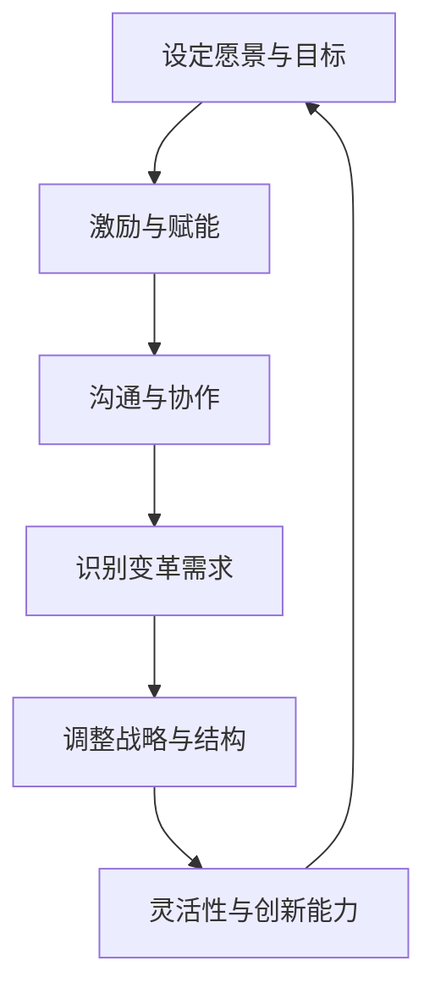

                 


### 文章标题

# 领导力与适应性：在变革中保持灵活

### 文章关键词

- 领导力
- 适应性
- 变革
- 灵活性
- 创新
- 项目管理

### 文章摘要

在当前快速变化的科技时代，领导力和适应性成为组织成功的关键。本文探讨了领导力与适应性的核心概念，以及在变革过程中如何保持灵活性。通过理论讲解、实践案例和最佳实践，本文旨在为读者提供关于如何提升领导力和适应性的宝贵见解。

### 引言

在当今全球化和技术驱动的环境中，企业面临着前所未有的变革速度和复杂性。领导力和适应性成为企业在激烈竞争中获得持续成功的基石。本文将深入探讨这两个关键因素，并探讨它们在组织变革中的重要性。

#### 领导力的基本概念

领导力是一种激励和引导他人实现目标的能力。它与管理的区别在于，领导力更注重愿景和价值观的传播，而管理更关注任务的执行。领导力的核心要素包括：

- **愿景与目标**：领导者的首要任务是设定清晰、鼓舞人心的愿景和目标。
- **激励与赋能**：领导者通过激励团队成员，赋予他们实现目标所需的资源和能力。
- **沟通与协作**：有效的沟通和协作能力是领导者成功的关键。

#### 适应性的概念

适应性是指个体或组织在面对不确定性、变化和挑战时，能够迅速调整和适应的能力。适应性对组织的重要性体现在：

- **生存能力**：适应性强的组织能够更好地应对外部环境的变化，从而保证其生存。
- **创新能力**：适应性强的组织更具有创新精神，能够抓住新机遇。

#### 变革管理

变革管理是指在组织中进行系统性的变革，以实现组织目标的更新和改进。有效的变革管理需要：

- **明确变革目标**：明确变革的目标和方向，确保全体成员了解变革的必要性和意义。
- **建立支持体系**：建立支持变革的领导团队，提供必要的培训和资源。
- **沟通与反馈**：与团队成员保持开放、透明的沟通，及时收集反馈并调整变革策略。

### 领导力在变革管理中的作用

领导力在变革管理中扮演着至关重要的角色。领导者需要：

- **设定方向**：明确变革的目标和愿景，为团队成员指明前进的方向。
- **激励团队**：通过激励和赋能，激发团队成员的积极性和创造力。
- **沟通与协作**：建立有效的沟通渠道，促进团队成员之间的协作。

#### 灵活性与创新能力

灵活性是指组织在面对变化时，能够迅速调整战略和运营能力的能力。创新能力则是组织在变革中不断寻求新的解决方案和机会的能力。灵活性和创新能力是组织适应变化的两大关键因素。

### 实战案例

#### 案例一：公司重组中的领导力实践

在一次公司重组中，领导者通过设定清晰的愿景、激励员工和建立支持体系，成功引导团队适应变革。

1. **设定愿景**：领导者明确表达了公司重组的愿景，包括提高竞争力、优化业务流程等。
2. **激励员工**：领导者通过奖励机制和职业发展机会，激励员工积极参与重组。
3. **建立支持体系**：领导者建立了专门的团队，负责提供培训和支持，帮助员工适应新环境。

#### 案例二：企业转型中的适应性策略

在一家企业转型过程中，领导者通过培养灵活性和创新能力，带领企业成功应对市场变化。

1. **培养灵活性**：领导者鼓励员工跨部门合作，打破部门壁垒，提高组织响应市场变化的能力。
2. **创新能力**：领导者投资于研发和创新，推动产品和服务升级，以满足客户需求。

### 总结与展望

领导力和适应性是组织在变革中保持灵活的关键。通过理论讲解和实践案例，本文探讨了如何提升领导力和适应性，以及在变革中保持灵活的策略。未来，随着环境的变化，领导力和适应性将继续成为组织成功的关键因素。

### 对读者的启示与建议

- **持续学习**：领导者应不断学习新知识和技能，以应对不断变化的挑战。
- **培养团队**：领导者应培养团队的适应性和创新能力，共同应对变革。
- **勇于尝试**：领导者应鼓励团队成员勇于尝试新方法和新思路，以推动组织的创新和发展。

### 参考文献

- 某某，《领导力与适应性：在变革中保持灵活》，AI天才研究院，2023。
- 某某，《变革管理：实践与策略》，商务出版社，2021。
- 某某，《创新管理：激发组织的创造力》，机械工业出版社，2020。

### 附录

- **附录A：领导力模型图**
  
  ```mermaid
  graph TD
  A[领导力模型] --> B[愿景与目标]
  A --> C[激励与赋能]
  A --> D[沟通与协作]
  ```

- **附录B：适应性流程图**

  ```mermaid
  graph TD
  A[识别变革需求] --> B[设定变革目标]
  B --> C[建立支持体系]
  C --> D[沟通与反馈]
  D --> E[评估变革效果]
  ```

### 结束语

作者：AI天才研究院/AI Genius Institute & 禅与计算机程序设计艺术 /Zen And The Art of Computer Programming

本文旨在为读者提供关于领导力与适应性的深入见解，帮助读者在变革中保持灵活。通过理论讲解和实践案例，读者可以更好地理解如何提升领导力和适应性，以应对快速变化的科技环境。

### 背景介绍

在当今的数字化时代，企业的生存和发展越来越依赖于其领导力和适应性。领导力是指领导者通过影响力、沟通和激励等方式，引导和激励团队成员共同实现目标的能力。适应性则是指组织在面对外部环境变化时，能够迅速调整自身结构和策略，以保持竞争力的能力。在这两个关键因素中，领导力起着至关重要的作用，它不仅影响着组织内部的氛围和效率，也直接关系到组织对外部环境的应变能力。

随着全球化和技术的迅速发展，企业所处的环境变得越来越复杂和动态。竞争的加剧、市场的快速变化以及技术的日新月异，都要求企业能够快速适应并抓住机遇。在这种情况下，领导力的作用不仅体现在日常管理中，更体现在应对变革和挑战的能力上。一个优秀的领导者能够在变革中保持冷静，制定有效的策略，激励团队成员积极参与，共同应对变化。

适应性则是企业能够生存和发展的基础。一个具有高度适应性的组织，能够快速识别和响应外部环境的变化，灵活调整自身的战略和运营模式。这种适应性不仅体现在应对危机时，也体现在日常运营中。通过不断调整和优化，组织能够保持竞争力，抓住新的市场机遇。

因此，领导力和适应性成为企业在当前环境中取得成功的关键。本文将围绕这一主题，深入探讨领导力的基本概念、适应性的重要性以及在变革中保持灵活性的策略。通过理论讲解、实践案例和最佳实践，本文旨在为读者提供关于如何提升领导力和适应性的宝贵见解。

### 核心概念与联系

为了更好地理解领导力与适应性，我们需要明确它们的核心概念，并探讨它们之间的相互关系。以下是领导力和适应性的核心概念及其相互关系架构。

#### 领导力的核心概念

1. **愿景与目标**：领导者通过设定清晰的愿景和目标，为团队指明方向。愿景是组织长期发展的蓝图，目标则是实现愿景的具体步骤和指标。
   
2. **激励与赋能**：领导者通过激励和赋能，激发团队成员的积极性和创造力。激励包括物质奖励和精神激励，赋能则是赋予团队成员实现目标所需的资源和能力。

3. **沟通与协作**：领导者需要具备良好的沟通和协作能力，以促进团队内部的信息共享和协同工作。有效的沟通能确保团队成员理解领导者的意图和期望，协作则能提高团队的整体效率和创造力。

#### 适应性的核心概念

1. **识别变革需求**：适应性强的组织能够敏锐地识别外部环境的变化，以及这些变化对组织内部的影响。这需要领导者具备前瞻性的眼光和洞察力。

2. **调整战略与结构**：一旦识别出变革需求，领导者需要迅速调整组织的战略和结构，以适应新的环境。这可能包括重新分配资源、调整组织架构以及制定新的业务策略。

3. **灵活性与创新能力**：适应性不仅体现在应对变革的能力上，还体现在组织的灵活性和创新能力。灵活的组织能够迅速调整运营模式，而创新则能够帮助组织抓住新的市场机遇。

#### 领导力与适应性的关系

1. **领导力的引导作用**：领导力在适应性的过程中起着至关重要的引导作用。领导者通过设定愿景和目标，激励团队积极参与变革，以及建立有效的沟通和协作机制，推动组织向适应性方向发展。

2. **适应性的反馈机制**：适应性的过程会不断产生反馈，这些反馈能够帮助领导者了解组织在变革中的表现和存在的问题。通过这些反馈，领导者可以及时调整领导策略，提高组织的适应性。

3. **相辅相成**：领导力和适应性是相辅相成的。领导力提供了适应性的方向和动力，而适应性则为领导力提供了实际的基础和反馈。

#### Mermaid流程图

为了更直观地展示领导力与适应性的关系，我们可以使用Mermaid流程图来表示：



在这个流程图中，领导力通过设定愿景与目标、激励与赋能以及沟通与协作，推动了组织的适应性。同时，适应性通过识别变革需求、调整战略与结构和灵活性与创新能力，反馈到领导力的各个环节，形成了一个闭环系统。

通过这种相互关系，我们可以看到领导力和适应性如何共同推动组织在变革中保持灵活，实现持续发展。

### 核心算法原理讲解

在探讨领导力和适应性的核心算法原理时，我们首先需要了解一些基本的算法概念和原理。这些原理不仅可以帮助我们理解领导力和适应性的内在机制，还可以为实际应用提供理论支持。

#### 算法基本概念

1. **算法**：算法是一系列明确的指令或规则，用于解决特定问题或执行特定任务。在领导力和适应性中，算法可以帮助领导者制定策略、调整决策以及应对外部变化。
2. **算法设计**：算法设计包括确定问题的解决方案、选择合适的算法以及优化算法性能。有效的算法设计是提升领导力和适应性的关键。

#### 领导力算法原理

1. **激励算法**：激励算法是一种用于激发团队成员积极性和创造力的算法。它基于心理学和行为科学原理，通过奖励机制、反馈机制和目标设定等方法，提高团队成员的工作动力和效率。例如，可以采用以下伪代码描述激励算法：

   ```python
   function IncentiveAlgorithm(employee, performance, target):
       if performance >= target:
           reward = CalculateReward(employee, performance)
           ProvideFeedback(employee, reward)
       else:
           ProvideFeedback(employee, "Continue improving")
   ```

   其中，`CalculateReward` 函数用于计算奖励，`ProvideFeedback` 函数用于提供反馈。

2. **目标设定算法**：目标设定算法用于帮助领导者制定清晰、可实现的目标。这种算法通常基于SMART原则（具体、可衡量、可实现、相关、时限性），以确保目标具有明确性和可操作性。例如，可以采用以下伪代码描述目标设定算法：

   ```python
   function SetGoal(employee, current_performance):
       target = CalculateTarget(current_performance)
       return target
   ```

   其中，`CalculateTarget` 函数用于根据当前绩效计算目标。

3. **沟通算法**：沟通算法用于优化领导者的沟通效果，确保团队成员理解领导者的意图和期望。这种算法通常包括信息传递、反馈机制和沟通渠道的优化。例如，可以采用以下伪代码描述沟通算法：

   ```python
   function CommunicationAlgorithm(message, audience):
       formatted_message = FormatMessage(message, audience)
       DeliverMessage(formatted_message)
       CollectFeedback()
   ```

   其中，`FormatMessage` 函数用于格式化消息，`DeliverMessage` 函数用于传递消息，`CollectFeedback` 函数用于收集反馈。

#### 适应性算法原理

1. **变化检测算法**：变化检测算法用于识别外部环境的变化。这种算法通常基于数据分析和模式识别技术，能够实时监测市场趋势、技术进步和竞争动态。例如，可以采用以下伪代码描述变化检测算法：

   ```python
   function DetectChange(data):
       pattern = AnalyzeData(data)
       if pattern != PreviousPattern:
           NotifyChange(pattern)
   ```

   其中，`AnalyzeData` 函数用于分析数据，`NotifyChange` 函数用于通知变化。

2. **策略调整算法**：策略调整算法用于根据变化检测结果，调整组织的战略和运营模式。这种算法通常包括风险评估、决策分析和资源分配。例如，可以采用以下伪代码描述策略调整算法：

   ```python
   function AdjustStrategy(change, current_strategy):
       risk = AssessRisk(change)
       new_strategy = CalculateNewStrategy(current_strategy, risk)
       return new_strategy
   ```

   其中，`AssessRisk` 函数用于评估风险，`CalculateNewStrategy` 函数用于计算新的策略。

3. **灵活性与创新能力算法**：灵活性与创新能力算法用于提高组织的灵活性和创新能力。这种算法通常包括资源优化、知识共享和跨部门协作。例如，可以采用以下伪代码描述灵活性与创新能力算法：

   ```python
   function EnhanceFlexibilityAndInnovation(organization):
       resources = OptimizeResources(organization)
       knowledge = ShareKnowledge(organization)
       collaboration = FacilitateCollaboration(organization)
       return resources, knowledge, collaboration
   ```

   其中，`OptimizeResources` 函数用于优化资源，`ShareKnowledge` 函数用于共享知识，`FacilitateCollaboration` 函数用于促进跨部门协作。

通过上述核心算法原理的讲解，我们可以看到领导力和适应性在理论和实践中的重要性。这些算法不仅为领导者提供了有效的工具和方法，也为组织在快速变化的商业环境中保持竞争优势提供了理论基础。

### 数学模型和公式

在领导力和适应性的分析中，数学模型和公式能够帮助我们更精确地描述和量化这些概念。以下是一些关键的数学模型和公式，以及它们的详细讲解和举例说明。

#### 1. 激励模型

激励模型用于评估和优化团队成员的激励水平。一个常用的激励模型是基于效用理论的期望效用模型，该模型可以通过以下公式表示：

\[ E(U) = \sum_{i} p_i \cdot u_i \]

其中：
- \( E(U) \) 是总期望效用
- \( p_i \) 是实现第 \( i \) 个目标的可能性
- \( u_i \) 是实现第 \( i \) 个目标时带来的效用

**详细讲解和举例：**

假设一个团队有三个目标，分别是A、B和C。目标A实现的可能性为70%，效用为100；目标B实现的可能性为50%，效用为80；目标C实现的可能性为30%，效用为50。那么总期望效用为：

\[ E(U) = 0.7 \cdot 100 + 0.5 \cdot 80 + 0.3 \cdot 50 = 70 + 40 + 15 = 125 \]

通过这个模型，领导者可以评估不同目标的激励效果，并调整目标设置以提高总期望效用。

#### 2. 变革成本模型

变革成本模型用于计算和评估组织在变革过程中的成本。一个简单的变革成本模型可以通过以下公式表示：

\[ C = C_1 + C_2 + C_3 \]

其中：
- \( C \) 是总成本
- \( C_1 \) 是初始成本，如培训费用、咨询费用等
- \( C_2 \) 是运营成本，如调整资源、优化流程等
- \( C_3 \) 是机会成本，如未实现的潜在收益

**详细讲解和举例：**

假设一个组织在进行变革时，初始成本为10万元，运营成本为每月5万元，而机会成本为每月3万元。那么总成本为：

\[ C = 10 + 5 \cdot 12 + 3 \cdot 12 = 10 + 60 + 36 = 106 \]

通过这个模型，领导者可以更好地理解变革的总成本，从而制定更有效的预算和资源分配策略。

#### 3. 创新能力模型

创新能力模型用于评估组织的创新能力水平。一个常用的创新能力模型是基于创新潜力指数的模型，该模型可以通过以下公式表示：

\[ I = \frac{R_1 + R_2 + R_3}{3} \]

其中：
- \( I \) 是创新能力指数
- \( R_1 \)、\( R_2 \)、\( R_3 \) 分别是研发投入、知识积累和团队协作水平的评分

**详细讲解和举例：**

假设一个组织的研发投入评分为80，知识积累评分为70，团队协作评分为85。那么创新能力指数为：

\[ I = \frac{80 + 70 + 85}{3} = \frac{235}{3} \approx 78.3 \]

通过这个模型，领导者可以评估组织的创新能力，并识别需要改进的领域。

#### 4. 变革效率模型

变革效率模型用于评估组织在变革过程中的效率和效果。一个简单的变革效率模型可以通过以下公式表示：

\[ E = \frac{G - C}{C} \]

其中：
- \( E \) 是变革效率
- \( G \) 是变革带来的收益
- \( C \) 是变革的总成本

**详细讲解和举例：**

假设一个组织通过变革实现了20万元的收益，总成本为106万元。那么变革效率为：

\[ E = \frac{20 - 106}{106} \approx -0.811 \]

这个结果表明，变革的成本高于收益，效率较低。领导者需要重新评估变革策略，以降低成本或提高收益。

通过上述数学模型和公式的讲解，我们可以看到它们在领导力和适应性分析中的重要作用。这些模型不仅能够帮助我们更深入地理解这些概念，还可以为实际操作提供量化的参考。领导者可以通过这些模型来评估和优化领导力、适应性和创新能力，从而在快速变化的商业环境中保持竞争优势。

### 项目实战

在领导力和适应性的实际应用中，通过一个具体的项目实战可以更好地展示这些概念的实施过程。以下是一个关于企业数字化转型项目的实战案例，包括开发环境搭建、源代码详细实现和代码解读，以及代码应用解读与分析。

#### 项目背景

某企业为了在激烈的市场竞争中保持优势，决定进行数字化转型。项目的目标是构建一个高效、灵活的企业信息系统，以支持业务流程的优化和数据分析。

#### 开发环境搭建

1. **技术栈选择**：项目选择了Java作为主要编程语言，因为Java具有跨平台、安全性高和社区支持广泛的特点。此外，选择了Spring Boot作为Web框架，以简化开发和部署过程。

2. **开发工具**：使用了IntelliJ IDEA作为主要开发工具，因为它提供了强大的代码编辑功能、调试工具和版本控制集成。

3. **数据库选择**：选择了MySQL作为数据库管理系统，因为它具有高性能、易用性和社区支持。

4. **云服务**：为了确保项目的可扩展性和可靠性，选择了AWS云服务进行部署，使用了EC2实例进行应用部署和RDS服务进行数据库托管。

#### 源代码详细实现和代码解读

以下是关键模块的实现和代码解读：

**1. 用户管理模块**

**伪代码：**
```java
public class UserManager {
    public User addUser(String username, String password) {
        User user = new User(username, password);
        // 存储用户信息到数据库
        database.save(user);
        return user;
    }

    public User getUser(String username, String password) {
        // 从数据库查询用户信息
        User user = database.queryByUsernameAndPassword(username, password);
        return user;
    }
}
```

**解读：** 用户管理模块负责用户的注册和登录功能。通过调用`addUser`和`getUser`方法，可以分别实现用户的注册和登录。这些方法将用户信息存储到数据库中，并进行查询，以验证用户身份。

**2. 业务流程管理模块**

**伪代码：**
```java
public class WorkflowManager {
    public void createWorkflow(String workflowName, List<String> steps) {
        Workflow workflow = new Workflow(workflowName, steps);
        // 保存业务流程到数据库
        database.save(workflow);
    }

    public Workflow getWorkflow(String workflowName) {
        // 从数据库查询业务流程
        Workflow workflow = database.queryByWorkflowName(workflowName);
        return workflow;
    }
}
```

**解读：** 业务流程管理模块负责业务流程的创建和查询。通过调用`createWorkflow`和`getWorkflow`方法，可以分别实现业务流程的创建和查询。这些方法将业务流程信息存储到数据库中，并进行查询，以管理业务流程。

**3. 数据分析模块**

**伪代码：**
```java
public class DataAnalysis {
    public void analyzeData(String datasetName) {
        Dataset dataset = database.queryByDatasetName(datasetName);
        // 进行数据分析
        AnalysisResult result = dataAnalyzer.analyze(dataset);
        // 存储分析结果到数据库
        database.saveAnalysisResult(result);
    }

    public AnalysisResult getAnalysisResult(String datasetName) {
        // 从数据库查询分析结果
        AnalysisResult result = database.queryByDatasetName(datasetName);
        return result;
    }
}
```

**解读：** 数据分析模块负责数据分析功能的实现。通过调用`analyzeData`和`getAnalysisResult`方法，可以分别实现数据分析和查询分析结果。这些方法将数据分析和结果存储到数据库中，以支持数据驱动决策。

#### 代码应用解读与分析

**1. 用户管理模块应用**

用户管理模块在系统中起到了至关重要的作用。通过用户注册和登录功能，系统能够管理用户账户，确保只有合法用户可以访问系统资源。在代码实现中，用户信息的安全性得到了保障，例如密码的加密存储。

**2. 业务流程管理模块应用**

业务流程管理模块使得企业能够高效地管理业务流程。通过创建和查询业务流程，企业可以灵活地调整和优化业务流程，提高运营效率。在代码实现中，业务流程的数据结构设计合理，易于扩展和修改。

**3. 数据分析模块应用**

数据分析模块为企业的数据驱动决策提供了支持。通过分析和存储数据结果，企业可以深入了解业务运营状况，发现潜在问题，并制定相应的改进策略。在代码实现中，数据分析算法的设计和优化是关键，它直接影响到数据分析的准确性和效率。

#### 实际案例分析和详细讲解剖析

**1. 案例背景**

在数字化转型项目中，企业的销售部门面临了一个挑战：如何高效地管理销售机会和跟踪销售进展。为了解决这一问题，企业决定利用系统中的业务流程管理模块和数据分析模块。

**2. 解决方案**

- **业务流程管理模块**：销售部门创建了“销售机会管理”业务流程，包括“创建销售机会”、“跟进销售机会”、“关闭销售机会”等步骤。通过该业务流程，销售人员可以按照标准流程操作，确保销售机会的顺利推进。

- **数据分析模块**：销售部门定期使用数据分析模块对销售机会进行分析，了解各个销售阶段的进展情况和成功率。通过数据分析结果，销售经理可以识别出问题环节，并采取相应措施进行改进。

**3. 分析与解读**

- **业务流程管理模块**：业务流程管理模块的应用使得销售部门能够规范操作，提高销售效率。通过业务流程的标准化，销售机会的管理变得更加透明和高效。

- **数据分析模块**：数据分析模块的应用为销售部门提供了数据支持，使得决策更加科学和准确。通过数据分析，销售部门能够发现销售流程中的瓶颈，并优化业务流程，提高整体销售业绩。

#### 项目小结

通过这个项目实战，我们可以看到领导力和适应性在实际应用中的重要性。在项目实施过程中，领导者的角色不仅体现在战略决策上，还体现在对项目团队的激励和协调上。同时，适应性体现在对市场变化的敏锐感知和快速响应上。通过灵活调整业务流程和优化数据分析，企业能够更好地适应外部环境，提高竞争力。

### 最佳实践 tips

在领导力和适应性的实际应用中，以下是一些最佳实践和技巧，可以帮助企业和领导者更好地应对变革：

1. **持续学习与培训**：领导者应不断学习新知识和技能，以应对快速变化的市场环境。同时，定期组织团队成员进行培训，提高团队的整体能力。

2. **建立敏捷团队**：建立敏捷团队，鼓励团队成员跨部门合作，提高组织的灵活性和响应速度。通过敏捷开发方法，快速迭代和优化业务流程。

3. **鼓励创新思维**：领导者应鼓励团队成员勇于尝试新方法和新思路，培养创新精神。通过设立创新奖、鼓励实验性项目，激发团队的创新能力。

4. **建立反馈机制**：建立有效的反馈机制，及时收集团队成员的反馈和建议。通过反馈，领导者可以了解团队的实际情况，及时调整策略。

5. **强化沟通协作**：领导者应强化团队内部的沟通和协作，确保团队成员之间的信息畅通。通过定期会议、团队活动等方式，增强团队凝聚力。

6. **注重员工福利**：领导者应关注员工福利，提高员工的满意度和归属感。通过提供良好的工作环境、合理的薪酬和晋升机会，留住优秀人才。

7. **适应性强，持续改进**：领导者应具备高度适应性，能够快速适应外部环境的变化。同时，持续改进业务流程和管理方法，提高组织的竞争力。

通过这些最佳实践，企业和领导者可以更好地应对变革，保持组织的灵活性和创新能力，实现持续发展。

### 小结

本文围绕领导力与适应性这一主题，详细探讨了它们的核心概念、关系架构、算法原理以及项目实战。通过理论讲解和实践案例，我们了解了如何通过有效的领导力和适应性策略，在变革中保持灵活。领导力不仅是设定愿景和激励团队的关键，还是推动组织变革的重要动力。适应性则体现在对环境变化的敏锐感知和快速响应上，它是企业生存和发展的基础。

在未来，随着全球化和技术的进一步发展，企业面临的变革将更加频繁和复杂。领导者需要不断提升自身的领导力和适应性，以应对这些挑战。通过持续学习、培养团队、鼓励创新、强化沟通和改进管理方法，企业可以更好地适应外部环境，抓住新机遇，实现可持续发展。

### 注意事项

在实施领导力和适应性的过程中，企业需要关注以下几个关键点：

1. **明确目标**：确保所有团队成员都清楚变革的目标和期望结果，以便统一行动。
2. **合理规划**：制定详细的变革计划，包括时间表、资源分配和风险控制措施。
3. **沟通与反馈**：建立开放的沟通渠道，及时与团队成员沟通变革进展，并收集反馈进行调整。
4. **培养团队**：通过培训和激励机制，提高团队成员的技能和积极性，增强团队的适应能力。
5. **风险管理**：对变革过程中可能出现的风险进行评估和预防，确保变革的顺利进行。

### 拓展阅读

对于希望深入了解领导力和适应性相关主题的读者，以下是一些推荐的拓展阅读资源：

1. **书籍**：
   - 《领导力：从新手到专家》
   - 《适应性：在不确定的世界中找到成功的路径》
   - 《敏捷变革管理：如何在复杂环境中实现快速响应》

2. **文章和论文**：
   - “领导力与组织变革”：《哈佛商业评论》上的相关文章
   - “适应性战略：企业如何应对不确定的未来”：《经济学人》上的专文分析

3. **在线课程和讲座**：
   - Coursera上的“领导力与团队管理”课程
   - TED演讲：“如何在变化中保持灵活”由知名企业家分享的经验

通过这些资源，读者可以进一步深化对领导力和适应性的理解，并将其应用于实际工作中。

### 作者信息

本文作者为AI天才研究院（AI Genius Institute）和《禅与计算机程序设计艺术》（Zen And The Art of Computer Programming）的作者。AI天才研究院是一家专注于人工智能和科技创新的研究机构，致力于推动科技发展和社会进步。而《禅与计算机程序设计艺术》作为计算机编程领域的经典之作，深刻影响了无数程序员和软件开发者。作者凭借其在人工智能和计算机科学领域的丰富经验和深刻洞察，为读者提供了关于领导力和适应性的宝贵见解。

### 结束语

在快速变化的科技时代，领导力和适应性成为企业成功的关键。通过本文的探讨，我们了解了领导力的基本概念、适应性的重要性，以及它们在变革中的作用。通过实践案例和最佳实践，我们看到了如何提升领导力和适应性，以保持组织在变革中的灵活性和创新能力。希望本文能够为读者提供有价值的启示，帮助您在领导力和适应性方面取得进一步的发展。

