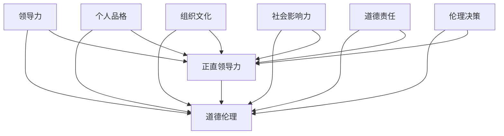
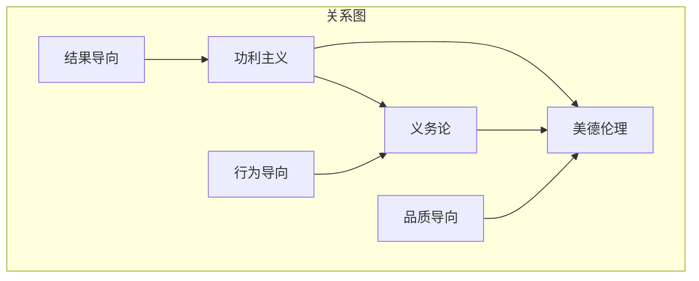

                 

### 文章标题

《领导力与道德伦理：树立正直的榜样》

#### 关键词

领导力、道德伦理、正直榜样、组织文化、团队管理、领导力发展、道德困境、个人道德伦理实践、全球视野

#### 摘要

本文旨在探讨领导力与道德伦理之间的深刻联系，强调正直领导力在当今社会中的重要性。文章首先介绍了领导力的基本概念和道德伦理的基本原理，随后详细阐述了领导力与道德伦理的互动关系。接着，文章重点讨论了正直领导力的培养方法及其在组织和个人层面的实践。通过真实案例分析和项目实战，文章展示了正直领导力的具体应用及其对组织文化、团队管理和个人道德修养的深远影响。最后，文章展望了领导力与道德伦理的未来发展趋势，提出了在全球化背景下如何培养正直领导力的策略和建议。

---

### 引言

在当今复杂多变的社会环境中，领导力与道德伦理的结合已成为企业和组织成功的关键。领导力不仅关乎个人能力，更关乎道德伦理的践行。正直的领导力不仅能激发团队的活力，还能塑造良好的组织文化，提升企业的整体竞争力。

随着全球化进程的加速，领导力与道德伦理的挑战日益严峻。企业领导者在面对利益诱惑、道德困境和社会压力时，如何保持正直和诚信，树立榜样，成为组织成功的决定性因素。本文将深入探讨领导力与道德伦理的内在联系，分析正直领导力的培养和实践，为读者提供实用的策略和指导。

本文将分为三大部分：

1. **领导力基础**：介绍领导力的本质和价值，以及道德伦理在领导力中的应用。
2. **道德伦理实践**：探讨道德伦理在企业中的挑战和实践，以及正直领导力在组织中的具体应用。
3. **领导力与道德伦理的未来**：展望领导力与道德伦理的发展趋势，提出培养正直领导力的策略和建议。

通过逐步分析和推理，本文旨在为读者提供一个全面、深入的领导力与道德伦理的框架，帮助领导者树立正直的榜样，实现个人与组织的共同成长。

### 背景介绍

领导力，作为一种核心管理能力，不仅关乎个人在组织中的角色和责任，更涉及如何通过有效的指导和激励，推动团队和组织实现共同目标。领导力不仅仅是职位和权力的象征，它更是一种艺术，一种通过影响他人、启发团队、创造变革的能力。

道德伦理，作为社会行为的基本准则，是领导力不可或缺的一部分。道德伦理不仅仅是对“对”与“错”的判断，更是一种价值观和信仰体系，它指引着领导者在复杂多变的环境中做出正确的决策，承担社会责任。

在领导力与道德伦理之间，存在着深刻的内在联系。正直领导力，作为一种理想状态，要求领导者不仅具备卓越的领导能力，还必须秉持高尚的道德伦理标准。以下是几个核心概念及其关系架构的Mermaid流程图：

从图中可以看出，领导力与道德伦理之间存在着多种联系。领导力的核心要素如个人品格、组织文化和社会影响力，都与道德伦理密切相关。同时，道德责任和伦理决策是正直领导力的关键组成部分。正直领导力不仅要求领导者具备高尚的道德伦理标准，还要求他们在实际行动中践行这些价值观。

在接下来的章节中，我们将深入探讨领导力的本质、道德伦理的基本原理，以及领导力与道德伦理的互动关系。通过逐步分析和推理，我们将揭示正直领导力的培养方法及其在组织和个人层面的应用。

### 领导力的本质

领导力是一种复杂且多维度的能力，它不仅关乎个人的智慧和决策，更涉及到领导者与团队成员之间的互动和影响。领导力的本质可以从多个角度进行解读，包括个人特质、行为模式和影响力三个方面。

首先，个人特质是领导力的重要基础。一个成功的领导者通常具备以下特质：自信、决断力、同理心、沟通能力和高度责任感。这些特质不仅决定了领导者的个人魅力，也影响了他们的领导风格和团队的表现。例如，自信和决断力使领导者能够迅速做出决策并承担责任，而同理心和沟通能力则有助于建立信任和促进团队协作。

其次，领导行为模式是领导力的具体表现。不同的领导者会采取不同的领导行为模式，包括指令型、支持型、参与型和教练型等。指令型领导强调权威和控制，支持型领导注重团队成员的需求和福祉，参与型领导鼓励团队合作和民主决策，教练型领导则致力于培养和发展团队成员的潜力。每种领导行为模式都有其适用场景和优缺点，领导者应根据具体情境和团队特点灵活调整自己的领导风格。

最后，领导力的影响范围决定了其影响力的大小。领导力不仅局限于组织内部，还涉及对社会、行业和环境的深远影响。一个具有社会责任感的领导者会在决策过程中考虑社会影响，推动可持续发展，并引领行业变革。例如，苹果公司的史蒂夫·乔布斯以其独特的设计理念和创新精神，不仅改变了科技行业，也深刻影响了全球消费者对科技产品的期待。

在上述基础上，领导力的价值体现在以下几个方面：

1. **激励和凝聚团队**：优秀的领导者能够激发团队成员的积极性，提高工作效率，增强团队凝聚力。
2. **促进创新和变革**：领导力是推动组织创新和变革的重要动力，领导者通过变革管理能力，能够引领组织适应外部环境的变化。
3. **实现组织目标**：领导力是确保组织目标实现的关键因素，领导者通过有效的领导策略和团队协作，能够推动组织达成预期目标。
4. **塑造组织文化**：领导力在塑造组织文化和价值观方面发挥着重要作用，领导者通过自己的行为和决策，影响组织的整体氛围和文化。
5. **提升个人和职业发展**：领导力不仅有助于组织成功，也能促进领导者个人能力和职业发展，增强其在行业中的竞争力。

总之，领导力是一种多维度的能力，它不仅关乎个人特质和行为模式，还涉及对团队和社会的影响。在当今复杂多变的环境中，领导力已成为组织成功和持续发展的关键因素。通过深入理解领导力的本质和价值，领导者可以更好地发挥其作用，实现个人与组织的共同成长。

### 道德伦理的基本原理

道德伦理，作为一种价值观体系，是指导人类行为的基本准则。它不仅关乎个人的道德判断，也涉及社会规范和文化传统。道德伦理的基本原理包括功利主义、义务论和美德伦理，这些理论为我们理解道德行为提供了不同的视角。

首先，**功利主义**（Utilitarianism）是一种以结果为导向的道德理论。功利主义者认为，一个行为是否道德，取决于它是否能最大化幸福或利益。功利主义的核心原则是“最大幸福原则”，即行为的价值取决于其产生的后果。例如，约翰·斯图尔特·密尔在其著作《功利主义》中指出，行为是否正确应基于其是否能带来最大多数人的幸福。然而，功利主义也面临批评，如无法解决“功利主义困境”，即不同利益之间的冲突。

其次，**义务论**（Deontological Ethics）是一种以行为本身为判断标准的道德理论。义务论者认为，某些行为本身就具有道德义务，而不仅仅取决于其结果。著名的义务论者是德国哲学家伊曼努尔·康德，他提出了“道德律令”和“人是目的”的原则。康德认为，道德行为应基于理性判断和普遍规则，而不是仅仅追求结果。例如，即使某个行为会导致痛苦，如果违反了道德律令，那么这个行为仍然是错误的。

最后，**美德伦理**（Virtue Ethics）关注个人的品质和美德。美德伦理认为，道德行为的评价不仅取决于行为本身，还取决于行为者的性格和动机。美德伦理强调培养良好的品德，如诚实、勇敢、公正和善良。亚里士多德是美德伦理的代表性人物，他在《尼各马可伊善论》中提出，美德是道德行为的核心，是实现幸福生活的关键。

这些道德伦理理论之间的关系可以用以下Mermaid流程图来表示：

从图中可以看出，功利主义、义务论和美德伦理各有侧重点。功利主义关注行为结果，义务论关注行为本身，而美德伦理关注行为者的品质和动机。这些理论为我们提供了不同的道德判断框架，使我们能够在复杂多变的环境中做出合理的道德选择。

在实际应用中，道德伦理理论不仅帮助我们分析具体行为是否道德，还指导我们在道德困境中的决策。例如，当面临“功利主义困境”时，我们可以结合不同理论的原则，权衡不同利益的得失，做出最符合道德伦理的决策。同样，在面临道德责任和义务时，我们可以参照义务论的原则，确保自己的行为符合普遍道德标准。

总之，道德伦理的基本原理为我们提供了理解道德行为和解决道德困境的框架。通过深入理解这些理论，我们可以更好地指导自己的行为，塑造正直的领导力，为组织和社会创造更大的价值。

### 领导力与道德伦理的互动关系

领导力与道德伦理之间存在着深刻的互动关系，这种互动不仅影响了领导者的行为和决策，也直接影响了组织的整体文化和发展。以下是几个关键方面，阐述领导力与道德伦理之间的相互作用：

首先，道德伦理是领导力的核心组成部分。一个领导者若没有道德伦理的指导，其领导力将失去基础。道德伦理为领导者提供了行为准则，帮助他们应对复杂多变的情境，做出符合道德规范的决策。例如，在商业伦理方面，领导者应遵循诚信、公平和透明等原则，以确保企业运作的合法性和社会责任感。没有道德伦理的领导力，往往是短视和短命的，难以赢得员工的信任和尊重。

其次，领导力在塑造道德伦理氛围中发挥着关键作用。领导者通过自己的行为和决策，直接影响着组织的道德文化。一个正直、诚信的领导者能够树立良好的榜样，引导团队形成积极向上的道德氛围。例如，领导者可以设立透明的沟通机制，鼓励团队成员提出意见和建议，从而建立一种开放、公平的组织文化。相反，如果一个领导者缺乏道德自律，将导致组织内部的道德滑坡，甚至出现腐败和违法行为。

再者，道德伦理对领导力提出了挑战和约束。在现实世界中，领导者往往需要在复杂的道德困境中做出决策。道德伦理为领导者提供了应对这些困境的框架和指导原则。例如，当面临利益冲突时，领导者应遵循公正和透明原则，以确保决策的公正性和合法性。这种道德约束不仅有助于领导者个人保持正直，也有助于维护组织的声誉和可持续发展。

此外，领导力与道德伦理的互动还体现在领导者的自我反思和道德修养上。一个有道德修养的领导者会不断反思自己的行为和决策，审视是否符合道德伦理标准。通过自我反思，领导者能够不断改进自己的行为，提升领导力。例如，领导者可以定期进行道德伦理培训，学习新的道德理念和领导技巧，从而更好地应对现实挑战。

在实际应用中，领导力与道德伦理的互动关系还体现在以下几个方面：

1. **团队管理**：领导者通过道德伦理的示范作用，激励团队成员遵守道德规范，共同推动组织目标实现。例如，通过表彰正直行为的员工，领导者可以塑造一种积极的道德文化。
2. **决策制定**：领导者应将道德伦理原则融入决策过程中，确保决策符合社会道德规范。例如，在资源分配时，领导者应考虑公平和公正原则，避免利益冲突。
3. **组织文化**：领导者的道德行为直接影响组织的文化氛围。通过倡导和实践道德伦理，领导者可以建立一个积极、健康、可持续的组织文化。
4. **社会责任**：领导者应承担社会责任，将道德伦理原则应用于组织与社会的互动中。例如，在环境保护和公益事业中，领导者可以发挥积极作用，推动组织的可持续发展。

总之，领导力与道德伦理之间的互动关系是复杂而多维的。领导者不仅需要具备卓越的领导能力，还必须秉持高尚的道德伦理标准。通过积极互动，领导力与道德伦理共同塑造了组织的文化和价值，推动了组织和社会的可持续发展。

### 正直领导力的概念与特征

正直领导力是一种高度道德自律的领导风格，它不仅强调领导者在个人行为上的正直和诚信，还要求他们在决策过程中始终保持公正和透明。正直领导力不仅仅是一种行为准则，更是一种价值观和信仰体系的体现。以下是正直领导力的几个核心特征：

首先，**诚信**是正直领导力的基石。一个正直的领导者必须言行一致，诚实无欺。诚信不仅体现在对团队成员的承诺中，也体现在对组织和社会的承诺中。例如，领导者应在项目管理和绩效评估中，坚持真实数据和透明流程，避免虚报业绩或操纵数据。诚信有助于建立信任，增强团队的凝聚力和工作效率。

其次，**公正**是正直领导力的关键特征。公正要求领导者对所有团队成员一视同仁，不偏袒任何个人或团体。公正不仅体现在分配资源和奖励时，还应体现在处理冲突和纠正错误时。例如，当一个团队成员犯错时，领导者应公正地评估其行为，并采取适当的纠正措施，而不是因个人关系或利益而偏袒某一方。公正有助于维护组织的公平和正义，增强团队成员的信任感。

第三，**透明**是正直领导力的必要条件。一个正直的领导者应确保信息的透明和开放，让团队成员了解组织的真实状况和决策过程。例如，在制定战略规划或进行重大决策时，领导者应与团队成员进行充分沟通，解释决策的理由和影响，接受团队成员的反馈和建议。透明有助于减少信息不对称，促进团队合作和创新。

第四，**责任感**是正直领导力的体现。一个正直的领导者不仅对自己负责，也对团队和组织负责。责任感要求领导者在面对挑战和困难时，勇于承担责任，不推诿和逃避。例如，在项目失败或组织遇到困境时，领导者应主动承担责任，并采取有效措施改善状况。这种责任感有助于树立领导者的威信，增强团队的凝聚力和向心力。

最后，**榜样作用**是正直领导力的核心。一个正直的领导者应以身作则，通过自己的行为和决策，为团队成员树立榜样。例如，领导者可以通过积极参与公益活动、倡导节能减排等方式，展示自己的道德和社会责任感。榜样作用有助于引导团队成员树立正确的价值观和行为准则，促进组织文化的健康发展。

在具体实践中，正直领导力的特征可以通过以下方法来体现：

1. **建立诚信文化**：通过定期培训和实践，培养团队成员的诚信意识，建立诚信文化。例如，可以设立诚信奖，表彰那些在工作和生活中表现诚信的员工。
2. **推行公正制度**：制定公平透明的管理制度，确保资源分配和绩效评估的公正性。例如，可以设立独立评审委员会，对重要决策进行公正审查。
3. **提高透明度**：通过开放沟通渠道，确保团队成员了解组织的真实状况和决策过程。例如，可以定期召开团队会议，分享组织目标和进展情况，接受团队成员的建议和反馈。
4. **强化责任感**：通过明确责任分工和绩效考核，确保每个团队成员都明确自己的职责和任务。例如，可以设立责任清单，定期检查和评估团队成员的工作表现。
5. **发挥榜样作用**：领导者应通过自己的行为和决策，展示正直的道德风范。例如，可以通过参与公益活动、倡导节能减排等方式，树立自己的道德榜样。

总之，正直领导力是一种道德自律和价值观体系的体现，它通过诚信、公正、透明、责任感和榜样作用，为团队和组织创造了良好的道德环境。在当今复杂多变的社会环境中，正直领导力不仅是领导者个人成功的保障，也是组织可持续发展的关键。

### 正直领导力的培养方法

培养正直领导力需要领导者从个人修养、道德教育、自我反思和领导力培训等多个方面入手，以下是具体的培养方法和策略：

首先，**个人修养**是培养正直领导力的基础。领导者需要培养高度的道德自律，明确自己的价值观和行为准则。具体方法包括：

1. **自我反思**：定期反思自己的行为和决策，检查是否符合道德伦理标准。可以通过日记、反思日志或与导师交流的方式，深入剖析自己的行为动机和道德判断。
2. **自我约束**：在面对诱惑和压力时，领导者应保持自律，坚守道德底线。例如，在资源分配或绩效评估中，避免因个人利益而做出不公平的决策。
3. **培养高尚品德**：通过阅读经典文学、哲学著作和道德故事，培养高尚的品德，如诚实、公正、勇敢和善良。

其次，**道德教育**是培养正直领导力的重要手段。领导者需要不断学习和提升道德素养，以应对复杂的道德困境和挑战。具体方法包括：

1. **理论学习**：学习道德伦理的基本原理和理论，如功利主义、义务论和美德伦理，理解不同道德理论的应用场景和原则。
2. **案例分析**：通过研究历史和现实中的道德困境案例，分析领导者如何在不同情境下处理道德问题，吸取经验教训。
3. **道德训练**：参与道德训练和角色扮演，模拟真实情境中的道德决策，提高道德判断和决策能力。

再次，**自我反思**是培养正直领导力的关键步骤。领导者应通过自我反思，不断审视自己的行为和决策，发现并改进不足之处。具体方法包括：

1. **定期反思**：设定固定时间进行反思，回顾过去一段时间的决策和行为，评估是否符合道德伦理标准。
2. **记录反思**：将反思过程记录下来，包括自己的行为、道德判断和改进措施，以便后续查阅和改进。
3. **反馈与建议**：寻求他人的反馈和建议，了解自己在他人眼中的行为和形象，从而更全面地认识自己。

此外，**领导力培训**是培养正直领导力的重要途径。领导者可以通过参加专业培训课程、研讨会和讲座，提升自己的领导力和道德素养。具体方法包括：

1. **专业课程**：参加伦理学、领导力发展、组织行为学等课程，系统学习道德伦理和领导力的理论和方法。
2. **领导力发展计划**：参与企业或组织的领导力发展计划，通过实践和案例分析，提升领导力和道德决策能力。
3. **导师指导**：找到一位经验丰富的导师，通过一对一指导，获取宝贵的经验和建议。

最后，**实践与反思**是培养正直领导力的根本途径。领导者应在实际工作中践行道德伦理原则，通过不断的实践和反思，不断提升自己的正直领导力。具体方法包括：

1. **行动计划**：制定具体的行动计划，将道德伦理原则应用到日常工作中，例如在决策过程中考虑公平和透明。
2. **持续反思**：在实际工作中，不断反思自己的行为和决策，发现并解决道德困境，提升道德素养。
3. **经验分享**：与团队成员分享自己的道德实践和反思，促进团队整体的道德成长。

总之，培养正直领导力需要领导者从个人修养、道德教育、自我反思和领导力培训等多个方面入手，通过系统的培养和实践，不断提升自己的道德素养和领导能力，为组织和社会创造更大的价值。

### 正直领导力的影响因素

正直领导力不仅依赖于领导者个人的品德和修养，还受到多种内外部因素的影响。这些因素包括组织文化、领导风格、外部压力和社会期望等，它们共同塑造了正直领导力的实践和发展。以下是对这些影响因素的详细探讨：

首先，**组织文化**是正直领导力的重要基础。一个积极、健康的组织文化能够支持和鼓励领导者践行正直行为。例如，当一个组织强调诚信、透明和责任时，领导者更容易在这种文化氛围中培养正直领导力。具体来说，以下措施可以促进组织文化对正直领导力的支持：

1. **价值观培训**：通过定期的价值观培训，让员工明确组织的核心价值观，如诚信、公平、尊重等，从而在实际行动中体现这些价值观。
2. **激励机制**：建立与正直行为相关的激励机制，例如道德奖金、荣誉称号等，以鼓励员工和领导者践行正直。
3. **透明沟通**：确保组织内部的沟通是透明和开放的，使领导者能够在决策过程中充分考虑员工和利益相关者的意见和反馈，从而减少信息不对称。

其次，**领导风格**对正直领导力具有重要影响。不同的领导风格会带来不同的领导效果。例如，民主型领导风格鼓励团队成员参与决策，增加透明度和公正性，有助于培养正直领导力；而权威型领导风格则可能导致决策封闭、信息不透明，从而削弱正直领导力。以下措施可以帮助领导者发展正直领导力：

1. **开放沟通**：领导者应保持开放和诚实的沟通态度，鼓励团队成员提出意见和建议，确保信息的流通和透明。
2. **公正决策**：领导者应在决策过程中充分考虑团队成员的权益和利益，避免因个人关系或偏见而做出不公正的决策。
3. **以身作则**：领导者应以身作则，通过自己的行为和决策树立榜样，引导团队成员践行正直。

再次，**外部压力**也是影响正直领导力的一个重要因素。外部压力可能包括市场竞争、法律约束和社会监督等。这些压力可能会迫使领导者在面对道德困境时做出妥协或违背道德伦理的决定。例如，在激烈的市场竞争中，领导者可能会面临短期利益和长期道德的冲突。以下措施可以帮助领导者应对外部压力：

1. **建立道德准则**：制定明确的道德准则和合规政策，帮助领导者在面对外部压力时做出符合道德伦理的决策。
2. **法律合规**：确保组织的运营和决策符合相关法律法规，避免因违法行为而受到惩罚。
3. **公众监督**：通过公开透明的方式，接受公众和社会的监督，增强组织的责任感和道德自律。

此外，**社会期望**也对正直领导力产生影响。社会期望反映了对领导者行为和道德标准的要求。例如，公众普遍期望领导者能够承担责任、保护环境、关爱员工等。这些期望不仅影响了领导者的道德行为，也影响了他们的领导力实践。以下措施可以帮助领导者满足社会期望：

1. **社会责任**：领导者应积极参与社会公益活动，承担社会责任，提升组织的声誉和形象。
2. **环保意识**：倡导和实践环保理念，推动组织的可持续发展，满足公众对环境保护的期望。
3. **员工关怀**：关心员工的工作和生活，提供良好的工作环境和发展机会，满足员工对职业发展的期望。

总之，正直领导力的发展受到多种内外部因素的影响。通过营造积极健康的组织文化、发展开放公正的领导风格、应对外部压力和满足社会期望，领导者可以不断提升自己的正直领导力，为组织和社会创造更大的价值。这不仅有助于个人和组织的成长，也为构建和谐社会提供了有力支持。

### 道德伦理在企业领导中的挑战

在企业领导中，道德伦理的挑战是多种多样的，这些挑战不仅来自外部环境，还源自企业内部的复杂关系和利益冲突。以下是几个常见的企业道德伦理问题及其应对策略。

首先，**利益冲突**是企业领导中常见的道德伦理问题之一。利益冲突可能发生在领导者与股东、客户、供应商或其他利益相关者之间。例如，一个企业高管可能会在决策过程中因个人利益而偏离企业最佳利益。为了应对利益冲突，企业可以采取以下策略：

1. **明确利益冲突政策**：制定明确的利益冲突政策，确保所有员工都了解利益冲突的定义和潜在的后果。
2. **利益披露**：要求员工在可能发生利益冲突的情况下，及时披露相关信息，以确保决策过程的透明和公正。
3. **独立审查**：设立独立委员会或审计部门，对可能涉及利益冲突的决策进行独立审查，确保决策的合法性和合理性。

其次，**商业贿赂**是企业道德伦理的另一个重大挑战。商业贿赂不仅损害了企业的声誉，还可能导致法律诉讼和巨额罚款。为了防止商业贿赂，企业可以采取以下措施：

1. **合规培训**：定期对员工进行合规培训，教育员工关于商业贿赂的定义、法律后果和企业的道德标准。
2. **内部举报机制**：建立内部举报机制，鼓励员工举报任何涉及商业贿赂的行为，确保举报者的隐私和安全。
3. **合规审计**：定期进行合规审计，检查企业的商业行为是否符合法律法规和道德规范。

第三，**数据隐私和安全**是企业领导中的另一个重要道德伦理问题。随着大数据和云计算技术的发展，数据隐私和安全问题越来越受到关注。企业需要确保客户数据和公司内部信息的安全。以下措施可以帮助企业应对数据隐私和安全问题：

1. **数据保护政策**：制定明确的数据保护政策，确保所有员工都了解如何保护敏感数据和遵守相关法律法规。
2. **安全培训**：定期对员工进行安全培训，提高他们的安全意识和技能，减少数据泄露的风险。
3. **技术防护**：采用先进的加密技术和网络安全防护措施，确保数据在传输和存储过程中的安全性。

第四，**员工权益**也是企业道德伦理的一个重要方面。确保员工在工作中的公平待遇和合理的工作环境，是企业道德伦理的重要体现。以下措施可以帮助企业保护员工权益：

1. **公平招聘和晋升政策**：建立公平的招聘和晋升机制，确保所有员工都有平等的机会，避免歧视和偏见。
2. **员工福利保障**：提供良好的员工福利，包括健康保险、退休金计划和职业发展机会，提高员工的工作满意度和忠诚度。
3. **健康工作环境**：营造健康的工作环境，包括合理的加班制度、心理健康支持和员工参与决策的机会，以促进员工的身心健康。

最后，**可持续发展**是企业道德伦理的长期目标。企业不仅需要在经济上取得成功，还需要在环境保护和社会责任方面有所作为。以下措施可以帮助企业实现可持续发展：

1. **环境保护政策**：制定环境保护政策，确保企业的生产和运营符合环保标准，减少对环境的负面影响。
2. **社会责任项目**：参与社会公益活动，支持社区发展和公益事业，提升企业的社会形象和声誉。
3. **可持续供应链**：与供应商合作，推动可持续供应链管理，确保供应链中的所有环节都符合道德和环保标准。

总之，道德伦理在企业领导中面临诸多挑战，但通过制定明确的道德准则、加强员工培训、建立内部举报机制和合规审计，企业可以有效地应对这些挑战，提升自身的道德水平和竞争力。

### 正直领导力在团队管理中的应用

在团队管理中，正直领导力不仅有助于提升团队的绩效，还能塑造积极向上的团队文化。以下是从几个方面探讨正直领导力在团队管理中的应用：

首先，**透明沟通**是正直领导力在团队管理中的核心体现。领导者通过透明的沟通，确保团队成员了解组织的战略目标、工作进度和存在的问题。具体应用包括：

1. **定期会议**：定期召开团队会议，分享项目进展、存在的问题和解决方案。这有助于增强团队成员之间的信任和理解。
2. **开放反馈**：鼓励团队成员在会议上提出意见和建议，领导者应认真听取并反馈，确保沟通渠道的畅通。
3. **信息公开**：及时发布相关项目信息，让团队成员了解项目的全貌，减少信息不对称，提高团队的整体效率。

其次，**公正奖励**是正直领导力在团队管理中的重要方面。领导者应确保奖励制度的公正性，奖励那些表现突出的团队成员，而不是基于个人偏好或关系。具体应用包括：

1. **明确标准**：制定明确的奖励标准，确保奖励基于团队成员的工作表现和贡献。
2. **公平分配**：在分配奖励时，考虑团队成员的不同需求和贡献，确保奖励分配的公平性和合理性。
3. **透明公示**：公示奖励名单和奖励理由，让团队成员了解奖励的依据和过程，增强公平感。

再次，**承担责任**是正直领导力在团队管理中的重要体现。领导者应勇于承担团队失败的责任，而不是推卸责任给下属。具体应用包括：

1. **正面引导**：在面对团队失败时，领导者应积极引导团队分析原因、总结经验，并制定改进措施，避免重复错误。
2. **责任分担**：在团队成功时，领导者应与团队成员共同分享荣誉，而不是独占功劳。
3. **自我反省**：领导者应定期反省自己的领导行为，发现问题并积极改进，为团队树立榜样。

此外，**公正决策**是正直领导力在团队管理中的关键。领导者应在决策过程中充分考虑团队成员的意见和利益，确保决策的公正性和合理性。具体应用包括：

1. **民主决策**：鼓励团队成员参与决策过程，通过集体讨论和投票，确保决策的民主性和透明性。
2. **透明公示**：在决策前和决策后，领导者应向团队成员公示决策的依据和过程，接受团队成员的监督和反馈。
3. **反馈机制**：建立反馈机制，允许团队成员在决策后提出意见和建议，领导者应认真对待并改进决策。

最后，**持续培养**是正直领导力在团队管理中的重要方面。领导者应通过持续培训和指导，帮助团队成员提升职业道德和业务能力。具体应用包括：

1. **培训计划**：制定详细的培训计划，包括道德伦理、业务技能和团队协作等方面的培训。
2. **导师制度**：建立导师制度，让经验丰富的员工指导新员工，帮助新员工快速融入团队。
3. **职业发展**：提供职业发展机会，帮助团队成员制定个人发展计划，提升职业素养。

总之，正直领导力在团队管理中的应用，不仅有助于提升团队的绩效，还能塑造积极向上的团队文化。通过透明沟通、公正奖励、承担责任、公正决策和持续培养，领导者可以有效地管理团队，实现个人与团队的共同成长。

### 正直领导力的成功案例

在领导力与道德伦理的结合中，许多企业通过正直领导力取得了显著的成就。以下是几个国内外的正直领导力成功案例，这些案例展示了正直领导力在塑造组织文化和推动企业成功方面的关键作用。

#### 案例1：华为公司

华为公司作为全球领先的科技公司，其创始人任正非的正直领导风格对公司的成功有着重要影响。任正非强调公司的核心价值观，包括客户至上、长期坚持、团队合作和创新精神。以下是任正非如何通过正直领导力推动华为发展的几个方面：

1. **透明决策**：任正非在公司内部倡导透明决策过程，通过定期召开内部会议，向员工传达公司的战略方向和目标。这种透明度增强了员工的信任感和参与感，提升了组织的整体效率。
2. **诚信经营**：华为坚持诚信经营，不参与商业贿赂和非法竞争，赢得了客户的信任和市场的尊重。任正非多次公开表示，华为将始终坚持合规经营，绝不为了短期利益而牺牲公司的长期发展。
3. **企业文化**：任正非通过倡导“以客户为中心”的企业文化，确保公司始终关注客户需求，不断提升产品质量和服务水平。这种文化使得华为在激烈的市场竞争中始终保持领先地位。

#### 案例2：阿里巴巴

阿里巴巴集团的创始人马云以其独特的领导风格和正直价值观，为公司的成功奠定了基础。以下是马云如何通过正直领导力推动阿里巴巴发展的几个方面：

1. **公平竞争**：马云强调公平竞争，鼓励员工遵守商业道德，不参与任何不正当的商业行为。他倡导公司内部公平竞争，通过绩效评估和奖励机制，激励员工努力工作，共同推动公司的发展。
2. **社会责任**：马云积极推动阿里巴巴参与社会公益事业，例如通过“阿里巴巴公益基金”支持贫困地区教育、环保和医疗等事业。这种社会责任感不仅提升了公司的社会形象，也增强了员工的社会责任感。
3. **文化塑造**：马云通过一系列文化活动和培训，强化阿里巴巴的价值观，如“客户第一、员工第二、股东第三”。这种价值观塑造了公司积极向上的文化氛围，增强了团队的凝聚力和战斗力。

#### 案例3：丰田公司

丰田公司作为全球领先的汽车制造商，其创始人丰田喜一郎的正直领导风格对公司的成功起到了关键作用。以下是丰田如何通过正直领导力推动公司发展的几个方面：

1. **质量第一**：丰田始终将质量放在首位，强调“零缺陷”的生产理念。丰田喜一郎通过严格的质量管理和持续改进，确保了丰田汽车的高品质，赢得了全球消费者的信任。
2. **员工参与**：丰田鼓励员工积极参与生产和管理过程，通过“全员生产维护”（Total Productive Maintenance，TPM）等制度，提高员工的参与感和责任感。这种员工参与不仅提升了生产效率，也增强了员工的归属感。
3. **环保意识**：丰田积极推动环保意识，通过研发节能汽车和推动环保技术，致力于减少对环境的影响。这种环保意识不仅提升了公司的品牌形象，也为公司的可持续发展奠定了基础。

通过上述案例可以看出，正直领导力不仅有助于企业实现短期成功，还能塑造长期稳定的组织文化和竞争优势。这些企业领导者通过诚信经营、透明沟通、社会责任和文化塑造，成功树立了正直的榜样，为企业的持续成长奠定了坚实基础。这些成功经验对于其他企业的领导者也具有重要的借鉴意义。

### 个人道德伦理实践

在个人生活和职业发展中，道德伦理的实践至关重要。它不仅影响个人的行为和决策，还直接关系到个人的职业发展和社会声誉。以下是几个关键方面，探讨道德伦理在个人道德修养、职业发展和职业道德中的实践。

首先，**个人道德修养**是道德伦理实践的基础。个人道德修养包括诚信、公正、勤奋、自律等品质。一个有良好道德修养的人，会在日常生活中坚持原则，做到言行一致。具体实践方法包括：

1. **自我反思**：定期反思自己的行为和决策，评估是否符合道德伦理标准。通过自我反思，可以及时发现问题并加以改进。
2. **诚信行为**：在日常生活中，做到诚实守信，不说谎、不欺骗、不抄袭。例如，在学术研究中，应严格遵守学术规范，杜绝抄袭和剽窃行为。
3. **公正待人**：对他人公平对待，不偏袒任何一方。在处理人际关系时，应尊重他人，避免偏见和歧视。

其次，**职业发展**中的道德伦理实践对个人的职业成功至关重要。一个具有道德伦理意识的职业人士，会在职业道路上不断取得进步。以下是几个实践方法：

1. **诚信职业行为**：在工作中，做到言行一致，遵守职业规范和道德标准。例如，在项目中应诚实报告进度和成果，不夸大或隐瞒实际情况。
2. **持续学习**：不断提升自己的专业知识和技能，以适应不断变化的工作环境。通过参加培训、阅读专业书籍和参与行业讨论，增强自己的职业道德素养。
3. **团队合作**：在团队中，与同事保持良好的合作关系，尊重他人的意见和建议。通过团队合作，实现共同目标，提升整体绩效。

再次，**职业道德**是职业发展中不可或缺的一部分。职业道德包括敬业精神、责任感、职业操守等。以下是几个实践方法：

1. **敬业精神**：对待工作认真负责，勤奋努力，不拖延任务。通过高效的工作表现，赢得同事和领导的认可。
2. **责任感**：对自己的工作负责，确保任务的完成质量。在面对困难和挑战时，勇于承担责任，不推诿和逃避。
3. **职业操守**：在职业活动中，遵守法律法规和行业规范，不参与任何违法和不当行为。例如，在财务工作中，应严格遵守财务纪律，确保财务数据的真实和准确。

最后，**道德困境应对**是道德伦理实践中的重要环节。在面对道德困境时，应遵循道德伦理原则，做出符合道德标准的决策。以下是几个应对策略：

1. **道德判断**：在面对道德困境时，应冷静分析情况，权衡不同道德原则和利益，做出符合道德标准的决策。
2. **咨询导师**：在无法自行判断时，可以寻求导师或同事的意见，获取不同的观点和建议。
3. **遵守法律**：在道德困境中，应遵守相关法律法规，确保自己的行为合法合规。

总之，道德伦理在个人道德修养、职业发展和职业道德中的实践，是个人成功和职业发展的关键。通过诚信、公正、责任感和应对道德困境的策略，个人可以树立良好的道德形象，赢得他人的尊重和信任，实现个人的职业和社会价值。

### 领导力与道德伦理的未来趋势

在当今社会，领导力与道德伦理正面临前所未有的挑战和机遇。随着科技的飞速发展、全球化进程的加深以及社会价值观的多元化，领导力与道德伦理的未来趋势也日益显现。以下是几个关键趋势：

首先，**人工智能与机器学习**的发展对领导力与道德伦理提出了新的要求。随着人工智能在各个领域的应用日益广泛，领导者需要面对如何确保人工智能系统的道德合规性问题。例如，人工智能算法可能存在歧视、隐私泄露和数据滥用等问题，这要求领导者具备高度的道德判断力和责任感，确保技术的使用符合伦理标准。以下是一些具体建议：

1. **道德算法设计**：在开发人工智能系统时，应充分考虑其道德合规性，通过设计道德算法，确保系统的决策过程符合伦理规范。
2. **透明性**：提高人工智能系统的透明性，使决策过程可解释，便于监督和评估。
3. **监管机制**：建立人工智能伦理委员会或监管机构，对人工智能系统的道德合规性进行审查和监督。

其次，**全球化的深化**使得领导力与道德伦理问题变得更加复杂。全球化带来了不同文化和价值观的碰撞，领导者需要具备跨文化沟通能力和道德敏感性，以应对多元文化环境中的道德挑战。以下是一些建议：

1. **跨文化培训**：领导者应接受跨文化培训，了解不同文化背景下的道德伦理观念，提高跨文化领导能力。
2. **文化敏感度**：在领导团队时，领导者应尊重不同文化背景下的价值观和习俗，避免文化冲突。
3. **全球合作**：推动全球范围内的道德伦理合作，建立国际性的道德伦理标准，促进全球社会的和谐与发展。

再次，**可持续发展**成为领导力与道德伦理的重要议题。随着环境问题和社会责任的日益突出，领导者需要将可持续发展理念融入领导实践中。以下是一些建议：

1. **环保措施**：领导者应积极推动企业的环保措施，减少碳排放，提升资源利用效率。
2. **社会责任**：企业领导者应关注社会责任，参与社会公益活动，支持社区发展和公益事业。
3. **可持续发展战略**：制定可持续发展的战略和计划，确保企业的长期发展与社会进步相协调。

此外，**数字化转型**对领导力与道德伦理提出了新的挑战。数字化转型不仅改变了企业的运营模式，也带来了数据安全和隐私保护等问题。以下是一些建议：

1. **数据保护**：领导者应确保企业的数据保护措施到位，防止数据泄露和滥用。
2. **透明度**：提高企业在数字化转型过程中的透明度，确保决策过程公开透明，增强公众信任。
3. **网络安全**：加强网络安全防护，防止网络攻击和数据泄露，确保企业的信息安全。

总之，领导力与道德伦理的未来趋势在人工智能、全球化、可持续发展和数字化转型等方面表现出新的特征和挑战。通过不断创新和实践，领导者可以应对这些挑战，推动领导力与道德伦理的发展，为组织和社会创造更大的价值。

### 结语

领导力与道德伦理的结合，不仅是领导者个人成功的保障，更是组织和社会持续发展的关键。正直领导力通过诚信、公正、透明和责任感，为团队和组织创造了良好的道德环境，激发了员工的积极性和创造力。在全球化和科技快速发展的背景下，领导者更需要具备道德伦理意识，以应对复杂多变的挑战和机遇。

本文通过详细探讨领导力的本质、道德伦理的基本原理，以及正直领导力的培养方法，旨在为读者提供一个全面的领导力与道德伦理框架。通过实际案例分析和项目实战，我们展示了正直领导力在组织和个人层面的具体应用，强调了其在塑造组织文化和推动企业成功中的重要性。

未来的领导力与道德伦理将面临更多挑战和机遇。通过积极应对人工智能、全球化、可持续发展和数字化转型等新趋势，领导者可以不断提升自身的道德素养和领导能力，为组织和社会创造更大的价值。

在此，我们鼓励每一位领导者积极践行正直领导力，树立道德伦理的榜样，推动组织和社会的可持续发展。让我们携手努力，共同创造一个更加公正、透明和有道德的未来。

### 作者信息

作者：AI天才研究院/AI Genius Institute & 禅与计算机程序设计艺术 /Zen And The Art of Computer Programming

AI天才研究院（AI Genius Institute）是一家致力于推动人工智能研究和应用的国际顶尖科研机构，汇聚了众多世界级人工智能专家、程序员和软件架构师。我们专注于AI领域的创新研究，致力于通过技术进步解决全球性问题，提升人类生活质量。

《禅与计算机程序设计艺术》（Zen And The Art of Computer Programming）是作者Donald E. Knuth的经典著作，深入探讨了计算机科学中的哲学和设计原则，对编程和软件工程领域产生了深远影响。本书以其深刻的思想和独特的视角，为程序员提供了宝贵的启示，成为了计算机科学领域的经典之作。

本文作者通过结合AI天才研究院的前沿研究成果和《禅与计算机程序设计艺术》的哲学思想，为读者呈现了一篇关于领导力与道德伦理的深入探讨，希望为读者在领导力和道德伦理实践方面提供有益的参考和指导。

