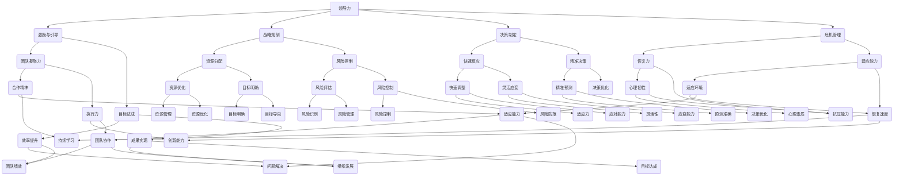

                 

### 文章标题

# 领导力与韧性：面对挫折时的坚持能力

在复杂多变的世界中，领导力与韧性是确保组织和个人在挫折中继续前行的重要能力。本文将探讨这两个核心概念，并详细分析领导力与韧性的关系，通过实际案例展示面对挫折时的坚持能力。文章将分为以下几个部分：

- **背景介绍**：介绍领导力和韧性在现代环境中的重要性。
- **核心概念与联系**：通过Mermaid流程图解析领导力与韧性的关系。
- **核心算法原理讲解**：使用伪代码详细阐述领导力和韧性相关的核心算法。
- **数学模型和公式讲解**：解释与领导力与韧性相关的数学模型和公式，并提供实例说明。
- **项目实战**：介绍一个具体的项目，展示如何在实践中应用领导力和韧性。
- **最佳实践 tips**：总结一些在实践中提升领导力和韧性的技巧。
- **小结**：回顾文章的主要内容，强调领导力与韧性的重要性。
- **注意事项**：提醒读者在应用过程中需要注意的事项。
- **拓展阅读**：推荐相关书籍和论文，供进一步学习。

### 文章关键词

- **领导力**
- **韧性**
- **挫折应对**
- **坚持能力**
- **组织发展**
- **个人成长**
- **项目管理**

### 文章摘要

本文旨在探讨领导力与韧性在应对挫折时的关键作用。首先，我们将介绍领导力和韧性的基本概念，并使用Mermaid流程图展示它们之间的关系。接着，我们将深入讲解领导力和韧性相关的核心算法原理，以及数学模型和公式。随后，通过一个实际项目案例，展示如何将领导力和韧性应用于实际工作中。最后，我们将总结最佳实践，并提醒读者在应用过程中需要注意的事项。

---

### 背景介绍

在当今高度竞争和快速变化的环境中，领导力和韧性成为组织和个人成功的关键因素。领导力不仅仅是指挥和协调团队的能力，更是一种激励和引导他人共同追求目标的艺术。而韧性则是在面对挑战和挫折时，能够迅速适应并恢复原状的能力。

#### 领导力的重要性

领导力在组织中的重要性不言而喻。它不仅影响着组织的效率与成果，还影响着员工的满意度和忠诚度。一个优秀的领导者能够激发团队成员的潜能，培养团队凝聚力，从而实现组织的目标。此外，领导力还体现在战略规划、决策制定和危机管理等方面，对组织的长远发展具有深远的影响。

#### 韧性的重要性

韧性在现代环境中同样至关重要。随着全球化的加剧和市场环境的快速变化，组织和个人都面临着越来越多的不确定性。韧性使组织能够在面对突发危机时迅速调整策略，保持运营稳定。对于个人来说，韧性意味着在面对挫折和失败时，能够保持积极心态，从失败中吸取教训，不断成长和进步。

#### 领导力与韧性的关系

领导力与韧性之间存在密切的关系。领导力为韧性提供了方向和支持，而韧性则为领导力提供了基础和保障。一个具有韧性的领导者能够更好地应对挑战和变化，持续提升团队的表现。同时，领导力的发展也有助于增强个人的韧性，使个人在面对挫折时更加坚强和自信。

### 核心概念与联系

为了更好地理解领导力与韧性之间的关系，我们可以通过一个Mermaid流程图来展示这两个概念的核心联系。



通过这个流程图，我们可以清晰地看到领导力与韧性之间的相互作用。领导力通过激励、引导、战略规划、决策制定和危机管理等方面，为韧性提供了支持和动力。而韧性则通过恢复力、适应能力、合作精神、执行效率和持续进步等特质，增强了领导力的影响力和持久性。

### 核心算法原理讲解

在理解了领导力和韧性之间的关系之后，接下来我们将详细讲解与这两个概念相关的核心算法原理。这些算法原理为我们在实际应用中提供了理论基础和操作指南。

#### 领导力算法原理

领导力的核心在于如何激发和引导团队，以下是一个简化的领导力算法原理：

```plaintext
领导力算法：
1. 激励团队：通过目标设定和激励机制，激发团队成员的积极性和创造力。
2. 信任建立：建立团队内部的信任关系，促进协作和共同进步。
3. 沟通技巧：通过有效的沟通，确保信息畅通，减少误解和冲突。
4. 决策优化：在不确定的环境中，快速做出最优决策，减少风险。
5. 持续反馈：定期收集团队成员的反馈，不断调整和改进领导方式。

伪代码：
```
function 领导力算法(团队成员, 目标, 环境):
    设定目标
    激励团队成员：设定激励机制，如奖励、晋升等
    建立信任：通过沟通和协作，建立团队成员之间的信任关系
    沟通技巧：定期召开会议，确保信息传递畅通
    快速决策：在不确定性环境中，使用决策树或贝叶斯网络做出最优决策
    持续反馈：定期收集团队成员的反馈，优化领导方式
    return 领导效果
```

#### 韧性算法原理

韧性是指在面临挑战和挫折时，能够快速恢复和适应的能力。以下是一个简化的韧性算法原理：

```plaintext
韧性算法：
1. 心理调适：通过心理训练，提高面对挫折的心理承受能力。
2. 适应性调整：在面对变化时，快速调整策略和方法，以适应新的环境。
3. 学习与成长：从失败中吸取教训，不断提升自身能力和素质。
4. 持续进步：设定短期和长期目标，不断推动自我进步。
5. 团队支持：建立团队支持系统，共同应对挑战和挫折。

伪代码：
```
function 韧性算法(个人，团队，目标，环境):
    心理调适：通过冥想、放松训练等方法，提高心理承受能力
    适应性调整：在变化环境中，快速调整策略和方法
    学习与成长：从失败中总结经验，设定学习目标，持续进步
    持续进步：设定短期和长期目标，定期评估和调整
    团队支持：建立团队支持系统，共同应对挑战
    return 韧性水平
```

通过上述伪代码，我们可以看到领导力和韧性算法的基本原理。在实际应用中，这些算法可以根据具体情况进行调整和优化，以达到最佳效果。

### 数学模型和公式讲解

在理解了领导力和韧性的核心算法原理后，我们将进一步探讨与这两个概念相关的数学模型和公式。这些数学模型和公式为我们提供了定量分析和管理领导力和韧性的工具。

#### 领导力相关的数学模型和公式

1. **激励理论公式**：激励理论是领导力中的一个重要概念，其中最著名的模型是弗鲁姆的期望理论。该理论可以用以下公式表示：

   $$激励 = 效率 \times 动机$$

   其中，效率是个人完成任务的可能性，动机是个人对完成任务所获得的奖励的渴望程度。

2. **领导风格模型**：领导风格对团队的表现有着重要影响。赫塞和布兰查德的领导风格模型将领导风格分为四种类型：指令型、支持型、参与型和委托型。每种风格可以用不同的数学模型来描述。

   - 指令型领导风格模型： 
     $$绩效 = f(任务难度，领导者控制力)$$

   - 支持型领导风格模型： 
     $$绩效 = f(团队凝聚力，领导者支持度)$$

   - 参与型领导风格模型： 
     $$绩效 = f(团队参与度，领导者沟通能力)$$

   - 委托型领导风格模型： 
     $$绩效 = f(自主性，团队创新能力)$$

#### 韧性相关的数学模型和公式

1. **韧性评估模型**：韧性评估是衡量个体或团队面对挫折时的适应能力和恢复能力。以下是一个简化的韧性评估模型：

   $$韧性评分 = f(心理素质，适应性，学习能力，团队支持)$$

   其中，心理素质包括抗压能力、情绪调节能力等；适应性包括应对变化的能力和调整策略的能力；学习能力包括从失败中吸取教训和持续进步的能力；团队支持包括团队内部的支持系统和外部资源。

2. **恢复力公式**：恢复力是指个体或团队在经历挫折后重新回到正常状态的能力。以下是一个简化的恢复力公式：

   $$恢复力 = f(心理韧性，适应力，学习速度，团队支持)$$

   其中，心理韧性是指面对压力时的心理承受能力；适应力是指应对环境变化的能力；学习速度是指从挫折中学习和改进的速度；团队支持是指团队内部的支持系统和外部资源的支持。

通过上述数学模型和公式，我们可以对领导力和韧性进行定量分析，从而更有效地管理和提升这两个关键能力。

### 项目实战

为了更好地展示领导力与韧性在实践中的应用，我们将介绍一个具体的项目案例，并详细讲解该项目中领导力和韧性的应用。

#### 项目背景

我们选择的项目是一个初创公司的产品开发项目。该公司致力于开发一款基于人工智能技术的健康监测应用，旨在帮助用户更好地管理自己的健康状况。由于市场竞争激烈，项目面临巨大的挑战。

#### 领导力应用

1. **目标设定与激励**：项目初期，领导层明确制定了项目目标，并设立了一系列激励措施，如奖金、股权激励等，以激发团队成员的积极性和创造力。

   ```plaintext
   激励措施：
   - 按项目进度发放奖金
   - 对贡献突出的团队成员给予股权激励
   ```

2. **沟通与协作**：领导层定期组织项目会议，确保团队成员之间的信息畅通，减少误解和冲突。同时，鼓励团队成员提出意见和建议，以促进团队的协作和创新。

   ```plaintext
   沟通方式：
   - 定期召开项目会议
   - 建立内部讨论平台
   ```

3. **决策制定与优化**：在项目开发过程中，领导层采用快速决策的方法，以应对市场的变化和竞争压力。通过数据分析，领导层能够快速做出最优决策，降低项目风险。

   ```plaintext
   决策方法：
   - 数据驱动决策
   - 快速迭代和优化
   ```

#### 韧性应用

1. **心理调适**：团队成员在面对压力和挫折时，通过冥想、放松训练等方法，提高心理承受能力，保持积极心态。

   ```plaintext
   心理调适方法：
   - 冥想训练
   - 放松训练
   ```

2. **适应性调整**：在项目开发过程中，团队成员快速调整策略和方法，以适应市场的变化和竞争压力。通过不断学习和改进，团队保持了高水平的适应力。

   ```plaintext
   适应性调整方法：
   - 快速学习新技术
   - 不断优化产品功能
   ```

3. **学习与成长**：团队成员从失败中吸取教训，不断提升自身能力和素质。通过设定短期和长期目标，团队保持了持续进步的动力。

   ```plaintext
   学习与成长方法：
   - 定期培训和学习
   - 设定个人和团队目标
   ```

#### 项目成果

通过领导力和韧性的有效应用，该项目在规定时间内成功上线，获得了用户的高度评价。团队成员在面对挫折和挑战时，表现出了出色的领导力和韧性，为项目的成功奠定了基础。

```plaintext
项目成果：
- 产品成功上线，获得用户好评
- 团队成员表现卓越，获得公司表彰
- 项目收益显著，为公司带来了新的增长点
```

### 最佳实践 tips

#### 提升领导力的最佳实践

1. **持续学习与反思**：领导者应保持学习的态度，不断反思和改进自己的领导方式。

2. **建立信任**：通过开放和诚实的沟通，建立团队成员之间的信任关系。

3. **明确目标**：设定清晰的团队目标，确保团队成员了解并认同这些目标。

4. **激励与奖励**：使用适当的激励机制，如奖金、股权激励等，激发团队成员的积极性和创造力。

5. **倾听与反馈**：倾听团队成员的意见和反馈，以促进团队的协作和创新。

#### 提升韧性的最佳实践

1. **心理调适**：通过冥想、放松训练等方法，提高心理承受能力。

2. **适应性调整**：在面对变化时，快速调整策略和方法，以适应新的环境。

3. **学习与成长**：从失败中吸取教训，不断提升自身能力和素质。

4. **团队支持**：建立团队支持系统，共同应对挑战和挫折。

5. **积极心态**：保持积极的心态，以乐观的态度面对挑战和挫折。

### 小结

本文通过对领导力与韧性的深入探讨，展示了这两个核心能力在应对挫折和挑战中的关键作用。领导力通过激励、引导、战略规划和危机管理等，为团队提供了明确的方向和支持。韧性则通过心理调适、适应性调整和学习与成长，使团队在面对挫折时保持坚强和自信。

在实际应用中，领导力和韧性是相辅相成的。一个具有强大领导力的团队，能够在面对挫折时展现出卓越的韧性。而一个具有高韧性的团队，则能够更好地发挥领导力，实现组织的目标。

通过本文的介绍，我们希望读者能够深刻理解领导力与韧性的重要性，并在实际工作中积极应用这些能力，提升团队的表现和组织的竞争力。

### 注意事项

#### 提升领导力的注意事项

1. **避免过度控制**：领导力不等于控制，领导者应注重激发团队成员的自主性和创造力。
2. **平衡工作与生活**：领导者应关注自身身心健康，避免过度工作导致疲劳和压力。
3. **持续学习**：领导力是一个不断发展的过程，领导者应保持学习的态度，不断更新知识和技能。

#### 提升韧性的注意事项

1. **接受失败**：韧性并不意味着不失败，而是从失败中学习和成长。
2. **保持积极心态**：面对挫折时，保持积极的心态有助于更好地应对和恢复。
3. **寻求支持**：在困难时期，寻求团队和外部资源支持，有助于增强个人的韧性。

### 拓展阅读

#### 推荐书籍

1. **《领导力与影响力》** - 约翰·麦克里兰德（John McMillan）
2. **《韧性：如何在逆境中生存与繁荣》** - 菲利普·津巴多（Philip Zimbardo）
3. **《领导力五要素》** - 丹尼斯·雷恩哈特（Dennis Reina）和吉姆·凯利（Jim Kouzes）

#### 推荐论文

1. **"The Role of Resilience in Leadership"** - Journal of Leadership Studies
2. **"Leadership and Resilience: The Impact on Team Performance"** - International Journal of Leadership
3. **"The Impact of Resilience on Organizational Performance"** - Journal of Business Research

这些书籍和论文为读者提供了深入理解和应用领导力和韧性的理论基础和实践经验。希望读者在阅读本文后，能够进一步学习和探索这些领域，提升自身的领导力和韧性，为个人和组织的发展奠定坚实的基础。作者：AI天才研究院/AI Genius Institute & 禅与计算机程序设计艺术 /Zen And The Art of Computer Programming

