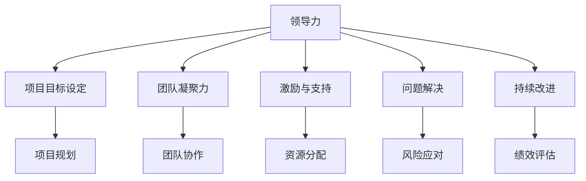
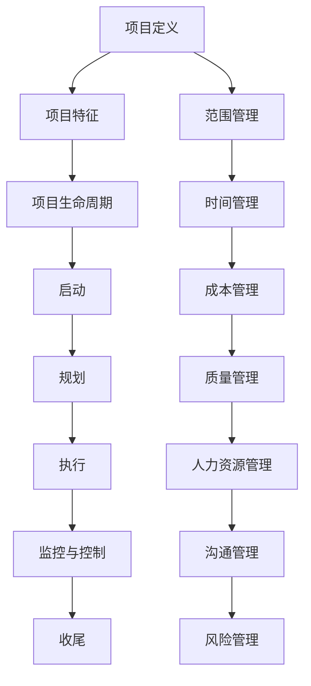
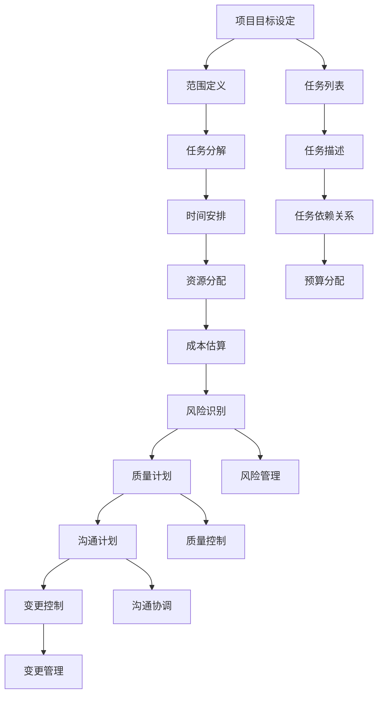
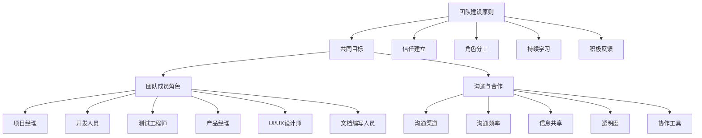
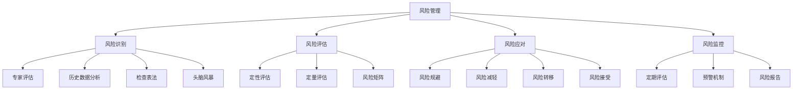
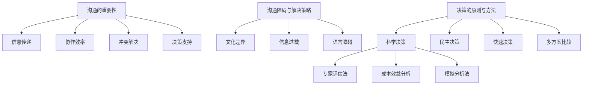

                 

### 文章标题

### 《领导力与项目管理：有效执行的艺术》

在快速变化的现代商业环境中，领导力和项目管理是确保团队和组织成功的关键因素。本文章旨在探讨领导力与项目管理的相互关系，并通过详细的分析和丰富的案例研究，展示如何在实际操作中有效地执行项目。通过本文，读者将深入了解领导力在项目管理中的核心作用，学习项目规划与执行的关键步骤，掌握团队管理与协作的策略，了解风险管理的重要性，以及提升沟通与决策能力的方法。

### 关键词

- 领导力
- 项目管理
- 有效执行
- 团队协作
- 风险管理
- 沟通与决策

### 摘要

本文从领导力和项目管理的相互关系入手，详细阐述了领导力在项目管理中的重要性。文章首先介绍了领导力的基础概念和关键素质，随后深入探讨了项目管理的核心概念、规划与执行过程。接着，本文分析了团队管理与协作的策略，并探讨了风险管理和沟通与决策在项目管理中的关键作用。通过实际案例的分析和讨论，本文提供了实用的最佳实践和注意事项，为读者在领导力和项目管理领域提供了深刻的见解和实用的指导。

### 引言

在当今复杂多变的商业环境中，成功的关键不仅在于技术和创新，更在于高效的团队协作和项目的有效管理。项目管理的本质在于将资源、时间、人力等要素进行优化配置，以实现既定的目标和预期结果。而在这其中，领导力起到了至关重要的作用，它不仅是推动项目向前发展的动力，更是团队凝聚力和创新能力的关键因素。

本文旨在深入探讨领导力与项目管理的紧密联系，从理论基础到实际应用，为读者提供一个全面而系统的理解。我们将首先介绍领导力的基础概念和核心素质，随后详细阐述项目管理的定义、核心概念和方法论。接着，本文将探讨项目规划与执行过程中的关键步骤，以及团队管理与协作的策略。在此之后，本文将分析风险管理的重要性和沟通与决策的技巧。最后，通过实际案例的研究和讨论，总结出领导力与项目管理的最佳实践和注意事项。

通过本文的阅读，读者将能够：
1. 理解领导力的基本概念及其在项目管理中的重要性。
2. 掌握项目管理的核心概念和方法论，包括项目规划与执行的关键步骤。
3. 学习团队管理与协作的策略，提高团队效能。
4. 了解风险管理和沟通与决策的关键要素，提升项目管理的成功率。

### 领导力的基础

领导力是一种复杂且多维的概念，涉及到个人素质、行为模式、团队动态等多个方面。要理解领导力在项目管理中的核心作用，首先需要从其基础概念入手。

#### 领导力的定义

领导力可以理解为一种激励和影响他人共同实现目标的能力。这种能力不仅体现在领导者与追随者之间的关系上，还包括领导者如何通过策略、决策和行为来引导团队前进。领导力不仅仅关乎权力和权威，更是一种通过影响力来推动变革和成长的综合能力。

#### 领导力的发展历程

领导力理论经历了多个发展阶段。早期的领导力研究主要关注领导者个体的特质和特征，如特质理论。然而，随着组织行为的深入研究和团队协作的重要性日益凸显，领导力理论逐渐转向情境理论，强调领导者与情境之间的互动。现代领导力理论则更加关注领导行为和领导风格，认为不同的情境和团队需要不同的领导方式。

#### 领导风格与行为

领导风格是领导者在不同情境下采取的行为和策略。常见的领导风格包括权威型、民主型、参与型和教练型等。每种领导风格都有其适用场景和优缺点。例如，权威型领导风格在需要迅速做出决策和执行任务时非常有效，而在创新和团队合作方面，民主型领导风格则更能激发团队成员的创造力和参与感。

#### 领导力的核心素质

要成为一名成功的领导者，必须具备一系列核心素质。这些素质包括：

1. **自我意识**：领导者需要深入了解自己的价值观、信念和动机，以便更好地影响和激励他人。
2. **情绪智力**：情绪智力是领导者处理自己和他人情绪的能力，包括自我调节、同理心和社交技能等。
3. **决策能力**：优秀的领导者能够在复杂和不确定的环境下做出明智的决策。
4. **沟通能力**：良好的沟通能力是领导者建立信任、传递信息和协调团队工作的关键。
5. **变革领导力**：在快速变化的环境中，领导者需要具备推动变革和引领团队适应新环境的能力。

#### 领导力在项目管理中的核心作用

领导力在项目管理中扮演着至关重要的角色。以下是领导力在项目管理中的几个核心作用：

1. **目标设定**：领导者需要明确项目的目标和愿景，并确保团队成员对此有共同的理解和认同。
2. **团队凝聚力**：通过建立信任和共同价值观，领导者可以增强团队的凝聚力，提高协作效率。
3. **激励与支持**：领导者需要激发团队成员的积极性和创造力，并提供必要的支持和资源，帮助他们克服挑战。
4. **问题解决**：在项目执行过程中，领导者需要及时发现并解决团队遇到的问题，确保项目按计划推进。
5. **持续改进**：通过持续反思和优化，领导者可以不断提升项目管理的效果，实现项目的成功。

#### 核心概念与联系

为了更好地理解领导力在项目管理中的应用，我们使用Mermaid流程图来展示核心概念之间的联系。



这个流程图展示了领导力在项目管理中的关键作用，以及这些作用如何贯穿于项目管理的各个阶段。

#### 核心算法原理讲解

在项目管理的具体实施过程中，领导力的算法原理主要体现在以下几个方面：

1. **目标分解算法**：领导者需要将项目目标分解为可操作的任务和里程碑，以确保团队能够明确任务和进度。
    ```plaintext
    function goalDecomposition(goal) {
        tasks = []
        for each sub-goal in goal {
            tasks.append(subGoalToTask(sub-goal))
        }
        return tasks
    }
    ```

2. **资源分配算法**：领导者需要合理分配资源，包括人力、物资和时间等，以确保任务的有效完成。
    ```plaintext
    function resourceAllocation(tasks, resources) {
        allocation = {}
        for each task in tasks {
            if (isResourceAvailable(task, resources)) {
                allocation[task] = resources[task]
            }
        }
        return allocation
    }
    ```

3. **风险评估算法**：领导者需要对潜在风险进行识别、评估和应对。
    ```plaintext
    function riskAssessment(project) {
        risks = []
        for each activity in project {
            risks.append(identifyRisks(activity))
        }
        return assessAndMitigateRisks(risks)
    }
    ```

4. **绩效评估算法**：领导者需要定期评估项目绩效，并根据评估结果进行相应的调整和改进。
    ```plaintext
    function performanceEvaluation(project) {
        metrics = calculatePerformanceMetrics(project)
        if (metrics < targetMetrics) {
            makeAdjustments(project)
        }
    }
    ```

这些算法原理不仅提供了具体的操作步骤，还帮助领导者更好地理解和实施领导力在项目管理中的应用。

#### 数学模型和公式

在项目管理中，领导力的应用可以通过以下数学模型和公式来量化：

1. **效率模型**：
   $$ E = \frac{P}{T} $$
   其中，E是效率，P是完成的任务量，T是完成任务所需的时间。

2. **团队凝聚力模型**：
   $$ C = \frac{L}{N} $$
   其中，C是团队凝聚力，L是团队成员之间的信任和协作水平，N是团队成员的数量。

3. **资源利用率模型**：
   $$ U = \frac{R}{R_{max}} $$
   其中，U是资源利用率，R是实际使用的资源量，\( R_{max} \)是最大可用资源量。

4. **风险评估模型**：
   $$ R = \frac{L}{D} $$
   其中，R是风险水平，L是潜在损失，D是风险发生的可能性。

这些数学模型和公式为领导者提供了量化的工具，以更科学地评估和管理项目。

#### 举例说明

为了更好地理解领导力在项目管理中的应用，我们可以通过一个实际案例来举例说明。

**案例：一个IT项目中的领导力应用**

假设一家公司正在开发一款新型软件，项目团队由10名成员组成，包括项目经理、开发者、测试工程师等。以下是领导力在项目管理中的具体应用：

1. **目标设定**：项目经理与团队成员共同制定了项目的目标和愿景，并将其分解为具体任务和里程碑。
    - 目标：在6个月内开发并发布新型软件。
    - 任务和里程碑：需求分析、设计、编码、测试、发布。

2. **团队凝聚力**：项目经理通过定期团队建设活动和沟通会议，增强了团队的凝聚力。
    - 团队建设活动：团队聚餐、团建游戏等。
    - 沟通会议：每周一次的项目进度会议，团队成员分享进展和遇到的困难。

3. **激励与支持**：项目经理通过奖励机制和及时的反馈，激发了团队成员的积极性和创造力。
    - 奖励机制：完成重要里程碑的任务后，发放奖金和表彰。
    - 及时反馈：项目经理对团队成员的工作进行定期评估，并提供建设性的反馈。

4. **问题解决**：在项目执行过程中，项目经理及时发现并解决了多个关键问题。
    - 问题：部分功能设计不合理，导致开发难度增加。
    - 解决方案：重新评估需求，调整设计方案，减少开发难度。

5. **持续改进**：项目经理通过持续的项目绩效评估和改进，确保项目按计划推进。
    - 绩效评估：每月一次的项目绩效评估，识别改进点。
    - 改进措施：优化开发流程，引入敏捷开发方法，提高项目效率。

通过这个案例，我们可以看到领导力在项目管理中的具体应用，以及如何通过领导力来提高项目的成功率和团队效能。

### 项目管理的基本概念

项目管理是一个复杂且系统化的过程，它涉及到资源的有效配置、时间的合理安排、团队的协调合作以及对风险的系统控制。要理解项目管理的核心概念，首先需要从项目的定义和特征开始探讨。

#### 项目的定义

项目可以被定义为一系列独特的、有明确目标的任务，这些任务需要通过一系列的活动和过程来完成。项目的独特性在于它有一个明确的开始和结束，并且是为了达到特定的目标而组织的。与日常运营不同，项目通常是一次性的事件，不重复进行。

#### 项目的特征

1. **独特性**：每个项目都有其特定的目标和要求，这些目标和要求在不同项目之间是不同的。
2. **临时性**：项目有其明确的生命周期，从启动到完成，具有时间上的限制。
3. **不确定性**：项目面临各种外部和内部的不确定性，需要通过风险管理来控制。
4. **资源约束**：项目通常受到资源（如资金、人力、时间等）的限制，需要在这些约束条件下实现目标。
5. **阶段性**：项目通常分为多个阶段，每个阶段都有其特定的任务和目标。

#### 项目的生命周期

项目生命周期可以分为以下几个阶段：

1. **启动阶段**：确定项目的目标、范围、预算和资源，制定项目计划。
2. **规划阶段**：详细规划项目的各个阶段，制定详细的计划和资源分配。
3. **执行阶段**：执行项目计划，完成具体任务和活动。
4. **监控与控制阶段**：监控项目进度和绩效，及时调整计划和资源。
5. **收尾阶段**：完成项目，进行项目评估和总结，确保所有任务完成。

#### 项目管理的关键要素

1. **范围管理**：确保项目目标和范围得到明确定义，防止项目范围蔓延。
2. **时间管理**：合理安排项目的进度，确保项目按计划完成。
3. **成本管理**：控制和优化项目成本，确保项目在预算内完成。
4. **质量管理**：确保项目交付的产品或服务满足既定的质量标准。
5. **人力资源管理**：有效管理和利用团队成员，确保团队能力与项目需求相匹配。
6. **沟通管理**：确保项目信息在团队成员和利益相关者之间有效传递。
7. **风险管理**：识别、评估和应对项目风险，降低风险对项目的影响。

#### 项目管理的方法论

项目管理的方法论包括一系列工具和技术，用于指导项目管理的各个阶段。常见的方法论包括：

1. **瀑布模型**：一种传统的项目管理方法，按照固定顺序进行项目阶段。
2. **敏捷开发**：一种灵活的、迭代的项目管理方法，强调快速响应变化和持续交付价值。
3. **六西格玛**：一种旨在优化流程和减少缺陷的方法论，通过数据分析和持续改进实现。
4. **PMI（项目管理协会）**：提供了一系列项目管理认证和指南，如PMBOK（项目管理知识体系）。

#### 核心概念与联系

为了更好地理解项目管理中的核心概念和它们之间的联系，我们使用Mermaid流程图来展示这些概念之间的关系。



这个流程图展示了项目管理的核心概念及其相互关系，有助于读者更好地理解项目管理的基本原理和实践。

#### 核心算法原理讲解

在项目管理中，核心算法原理主要体现在以下几个方面：

1. **关键路径算法**：用于确定项目的关键任务和最长持续时间，以确保项目按时完成。
    ```plaintext
    function criticalPath(tasks) {
        durations = calculateTaskDurations(tasks)
        path = []
        maxDuration = 0
        for each task in tasks {
            if (durations[task] > maxDuration) {
                maxDuration = durations[task]
                path = [task]
            } else if (durations[task] == maxDuration) {
                path.append(task)
            }
        }
        return path
    }
    ```

2. **资源分配算法**：用于优化资源分配，确保项目在资源限制下高效完成。
    ```plaintext
    function optimalResourceAllocation(tasks, resources) {
        allocation = {}
        for each task in tasks {
            if (isResourceAvailable(task, resources)) {
                allocation[task] = resources[task]
            }
        }
        return allocation
    }
    ```

3. **风险评估算法**：用于识别和评估项目风险，制定相应的风险应对策略。
    ```plaintext
    function riskAssessment(project) {
        risks = []
        for each activity in project {
            risks.append(identifyRisks(activity))
        }
        return assessAndMitigateRisks(risks)
    }
    ```

4. **绩效评估算法**：用于定期评估项目绩效，并根据评估结果进行调整和改进。
    ```plaintext
    function performanceEvaluation(project) {
        metrics = calculatePerformanceMetrics(project)
        if (metrics < targetMetrics) {
            makeAdjustments(project)
        }
    }
    ```

这些算法原理不仅提供了具体的操作步骤，还帮助领导者更好地理解和实施领导力在项目管理中的应用。

#### 数学模型和公式

在项目管理中，核心算法原理可以通过以下数学模型和公式来量化：

1. **成本效益分析模型**：
   $$ \text{CVA} = \text{B} - \text{C} $$
   其中，CVA是成本效益分析值，B是项目收益，C是项目成本。

2. **进度效率模型**：
   $$ \text{PE} = \frac{\text{EV}}{\text{PV}} $$
   其中，PE是进度效率，EV是实际完成工作的价值，PV是计划完成工作的价值。

3. **资源利用率模型**：
   $$ \text{RU} = \frac{\text{R}}{\text{R}_{max}} $$
   其中，RU是资源利用率，R是实际使用的资源量，\( R_{max} \)是最大可用资源量。

4. **风险评估模型**：
   $$ \text{R} = \frac{\text{L}}{\text{D}} $$
   其中，R是风险水平，L是潜在损失，D是风险发生的可能性。

这些数学模型和公式为领导者提供了量化的工具，以更科学地评估和管理项目。

#### 举例说明

为了更好地理解项目管理的基本概念和方法，我们可以通过一个实际案例来举例说明。

**案例：一个软件开发项目的管理**

假设一家公司决定开发一款新的手机应用程序，项目团队由5名成员组成，包括项目经理、开发者、测试工程师和产品经理。以下是项目管理在项目中的应用：

1. **项目定义**：项目经理与团队成员明确了项目的目标和范围。
    - 目标：在4个月内开发并发布一款具有竞争力的手机应用程序。
    - 范围：包括用户界面设计、功能实现、测试和发布。

2. **项目规划**：项目经理制定了详细的项目计划，包括时间表、资源分配和任务分配。
    - 时间表：每个阶段的时间安排，包括需求分析、设计、编码、测试和发布。
    - 资源分配：根据任务需求，合理分配开发人员、测试工程师和产品经理的资源。
    - 任务分配：将项目分解为具体任务，并分配给相应的团队成员。

3. **项目执行**：团队成员按照项目计划进行任务执行。
    - 需求分析：产品经理与客户沟通，收集需求并制定需求文档。
    - 设计：开发者根据需求文档进行界面设计和功能实现。
    - 编码：开发者根据设计文档编写代码，实现应用程序的功能。
    - 测试：测试工程师对应用程序进行功能测试和性能测试，确保质量。

4. **项目监控与控制**：项目经理定期监控项目进度和绩效，并及时调整计划。
    - 进度监控：每周一次的项目进度会议，检查任务完成情况和遇到的问题。
    - 绩效评估：每月一次的项目绩效评估，评估项目进度和质量，并根据评估结果进行调整。

5. **项目收尾**：完成应用程序的开发和测试，进行项目总结和评估。
    - 发布：将应用程序发布到应用商店，接受用户反馈。
    - 项目评估：总结项目经验，识别成功和不足，为未来项目提供参考。

通过这个案例，我们可以看到项目管理的基本概念和方法在实际项目中的应用，以及如何通过科学的管理方法确保项目的成功。

### 项目规划与执行

项目规划与执行是项目管理过程中的关键环节，决定了项目的进度、质量和成本。在这一部分，我们将详细讨论项目规划的过程，包括项目计划的制定和项目执行的监控与控制。

#### 项目规划的过程

项目规划是项目管理的基础，它涉及到对项目的全面分析、目标设定、资源分配和时间安排。以下是项目规划的具体步骤：

1. **项目目标设定**：明确项目的目标和预期结果，确保团队成员对项目目标有共同的理解和认同。
    - 目标：定义项目的核心目标，如提升产品性能、增加市场份额等。

2. **范围定义**：确定项目的范围，明确项目需要完成的具体任务和交付成果。
    - 范围：明确项目的边界，避免项目范围蔓延，确保项目目标的实现。

3. **任务分解**：将项目目标分解为具体的工作任务和里程碑，为后续的资源分配和时间安排提供基础。
    - 任务分解：使用工作分解结构（WBS）将项目分解为可管理的任务单元。

4. **时间安排**：制定项目的时间计划，确定各个任务和里程碑的完成时间。
    - 时间安排：使用甘特图或其他时间管理工具，合理安排任务的时间节点。

5. **资源分配**：根据项目需求，合理分配所需的人力、物资和资金等资源。
    - 资源分配：确保项目在资源限制条件下，最大限度地利用可用资源。

6. **成本估算**：估算项目的总成本，包括直接成本和间接成本，确保项目在预算内完成。
    - 成本估算：使用成本估算工具和方法，如自上而下的估算和自下而上的估算。

7. **风险识别**：识别项目可能面临的风险，并制定相应的风险应对策略。
    - 风险识别：通过专家评估、历史数据和预测模型，识别潜在风险。

8. **质量计划**：制定项目的质量标准，确保项目交付的产品或服务满足既定的质量要求。
    - 质量计划：确定质量目标、质量标准和质量控制措施。

9. **沟通计划**：制定项目的沟通计划，确保项目信息在团队成员和利益相关者之间有效传递。
    - 沟通计划：明确沟通的频率、方式、渠道和责任人。

10. **变更控制**：制定变更控制流程，确保项目变更得到有效管理和控制。
    - 变更控制：建立变更管理流程，评估变更的影响，并决定是否接受变更。

#### 项目计划的制定

项目计划是项目规划的具体体现，它详细描述了项目的各个阶段、任务和活动，以及所需的时间和资源。以下是项目计划制定的关键要素：

1. **任务列表**：列出所有项目任务，包括主要任务和子任务。
2. **任务描述**：对每个任务进行详细描述，明确任务的目标、范围和交付成果。
3. **任务依赖关系**：确定任务之间的依赖关系，确保任务的合理顺序和优先级。
4. **时间安排**：为每个任务分配具体的时间，并制定总时间计划和里程碑计划。
5. **资源需求**：列出每个任务所需的人力、物资和资金等资源。
6. **预算分配**：根据任务需求，合理分配项目的预算，确保项目在预算内完成。
7. **风险评估**：对项目风险进行评估，并制定相应的应对策略。
8. **质量管理**：制定项目的质量标准，确保项目交付的产品或服务满足质量要求。
9. **沟通计划**：制定项目沟通计划，明确沟通的频率、方式、渠道和责任人。
10. **变更管理**：制定变更管理流程，确保项目变更得到有效管理和控制。

#### 项目执行的监控与控制

项目执行是项目规划的具体实施过程，通过监控与控制确保项目按计划顺利进行。以下是项目执行的监控与控制步骤：

1. **进度监控**：定期检查项目进度，确保任务按时完成。
    - 进度监控：使用项目管理工具，如甘特图、看板等，实时跟踪项目进度。

2. **绩效评估**：评估项目绩效，包括进度、成本、质量和风险等方面。
    - 绩效评估：定期进行项目绩效评估，识别问题和改进点。

3. **风险管理**：监控项目风险，及时识别和应对潜在风险。
    - 风险管理：使用风险评估矩阵，定期更新风险清单，并制定相应的应对措施。

4. **成本控制**：控制项目成本，确保项目在预算内完成。
    - 成本控制：定期审查项目成本，确保费用支出符合预算。

5. **质量控制**：确保项目交付的产品或服务符合既定的质量标准。
    - 质量控制：进行定期质量检查，确保项目质量得到有效管理。

6. **沟通协调**：保持项目团队和利益相关者之间的有效沟通，确保信息畅通。
    - 沟通协调：定期召开项目会议，更新项目进展和解决遇到的问题。

7. **变更管理**：对项目变更进行评估和管理，确保变更得到有效控制和实施。
    - 变更管理：按照变更管理流程，评估变更的影响，并决定是否接受变更。

#### 核心概念与联系

为了更好地理解项目规划与执行的核心概念及其相互联系，我们可以使用Mermaid流程图来展示这些概念。



这个流程图展示了项目规划与执行的核心概念及其相互联系，有助于读者更好地理解和应用这些概念。

#### 核心算法原理讲解

在项目规划与执行过程中，核心算法原理主要体现在以下几个方面：

1. **关键路径算法**：用于确定项目的关键任务和最长持续时间，以确保项目按时完成。
    ```plaintext
    function criticalPath(tasks) {
        durations = calculateTaskDurations(tasks)
        path = []
        maxDuration = 0
        for each task in tasks {
            if (durations[task] > maxDuration) {
                maxDuration = durations[task]
                path = [task]
            } else if (durations[task] == maxDuration) {
                path.append(task)
            }
        }
        return path
    }
    ```

2. **资源分配算法**：用于优化资源分配，确保项目在资源限制条件下高效完成。
    ```plaintext
    function optimalResourceAllocation(tasks, resources) {
        allocation = {}
        for each task in tasks {
            if (isResourceAvailable(task, resources)) {
                allocation[task] = resources[task]
            }
        }
        return allocation
    }
    ```

3. **风险评估算法**：用于识别和评估项目风险，制定相应的风险应对策略。
    ```plaintext
    function riskAssessment(project) {
        risks = []
        for each activity in project {
            risks.append(identifyRisks(activity))
        }
        return assessAndMitigateRisks(risks)
    }
    ```

4. **绩效评估算法**：用于定期评估项目绩效，并根据评估结果进行调整和改进。
    ```plaintext
    function performanceEvaluation(project) {
        metrics = calculatePerformanceMetrics(project)
        if (metrics < targetMetrics) {
            makeAdjustments(project)
        }
    }
    ```

这些算法原理不仅提供了具体的操作步骤，还帮助领导者更好地理解和实施领导力在项目管理中的应用。

#### 数学模型和公式

在项目规划与执行中，核心算法原理可以通过以下数学模型和公式来量化：

1. **成本效益分析模型**：
   $$ \text{CVA} = \text{B} - \text{C} $$
   其中，CVA是成本效益分析值，B是项目收益，C是项目成本。

2. **进度效率模型**：
   $$ \text{PE} = \frac{\text{EV}}{\text{PV}} $$
   其中，PE是进度效率，EV是实际完成工作的价值，PV是计划完成工作的价值。

3. **资源利用率模型**：
   $$ \text{RU} = \frac{\text{R}}{\text{R}_{max}} $$
   其中，RU是资源利用率，R是实际使用的资源量，\( R_{max} \)是最大可用资源量。

4. **风险评估模型**：
   $$ \text{R} = \frac{\text{L}}{\text{D}} $$
   其中，R是风险水平，L是潜在损失，D是风险发生的可能性。

这些数学模型和公式为领导者提供了量化的工具，以更科学地评估和管理项目。

#### 项目实战

为了更好地理解项目规划与执行的过程，我们可以通过一个实际案例来详细讲解。

**案例：一个软件开发项目的实施**

假设一家公司决定开发一款新的企业资源规划（ERP）系统，项目团队由10名成员组成，包括项目经理、系统分析师、开发人员、测试工程师等。以下是项目规划与执行的具体步骤：

1. **项目目标设定**：
   - 目标：在12个月内完成ERP系统的设计、开发、测试和部署，确保系统能够满足公司的业务需求。

2. **范围定义**：
   - 范围：包括需求分析、系统设计、模块开发、集成测试、用户培训、系统部署等。

3. **任务分解**：
   - 任务分解结构如下：
     - 需求分析
       - 业务需求收集
       - 需求文档编写
     - 系统设计
       - 系统架构设计
       - 模块设计
     - 模块开发
       - 前端开发
       - 后端开发
       - 数据库设计
     - 集成测试
       - 单元测试
       - 集成测试
       - 系统测试
     - 用户培训
       - 培训材料编写
       - 培训实施
     - 系统部署
       - 部署计划
       - 系统上线
       - 系统维护

4. **时间安排**：
   - 时间表：
     - 需求分析（2个月）
     - 系统设计（2个月）
     - 模块开发（5个月）
     - 集成测试（1个月）
     - 用户培训（1个月）
     - 系统部署（1个月）

5. **资源分配**：
   - 资源分配：
     - 开发人员（6人）
     - 测试工程师（2人）
     - 产品经理（1人）
     - 项目经理（1人）

6. **成本估算**：
   - 成本估算：
     - 开发人员费用（$300,000）
     - 测试工程师费用（$100,000）
     - 项目经理费用（$50,000）
     - 其他费用（$50,000）
     - 总成本（$400,000）

7. **风险识别**：
   - 风险识别：
     - 技术风险：开发过程中可能遇到的技术难题。
     - 人员风险：团队成员变动可能导致进度延误。
     - 客户需求变更：客户需求可能发生变化，影响项目进度。

8. **质量计划**：
   - 质量计划：
     - 确保每个模块都经过严格的单元测试和集成测试。
     - 系统测试覆盖率达到95%以上。
     - 用户培训材料详细、易懂。

9. **沟通计划**：
   - 沟通计划：
     - 每周一次项目进度会议。
     - 每月一次项目评估会议。
     - 需求变更通过邮件和会议记录进行确认。

10. **变更管理**：
    - 变更管理：
      - 变更请求通过书面形式提交，并经过项目经理和客户确认。
      - 变更影响评估，包括时间、成本和风险。
      - 变更实施和监控。

#### 项目执行与监控

在项目执行过程中，项目团队按照项目计划进行任务分配和执行，项目经理负责监控项目进度和绩效，确保项目按计划进行。

1. **进度监控**：
   - 项目经理每周通过项目管理工具（如Jira、Trello等）跟踪任务进度，确保每个任务按时完成。
   - 项目进度会议：每周五下午，项目团队汇报任务进展，讨论遇到的问题和解决方案。

2. **绩效评估**：
   - 项目经理每月对项目绩效进行评估，包括进度、成本、质量和风险等方面。
   - 项目评估会议：每月底，项目团队和利益相关者一起讨论项目进展和改进措施。

3. **风险管理**：
   - 项目经理定期更新风险清单，识别和评估潜在风险，制定应对策略。
   - 风险管理会议：每月底，项目团队讨论和评估风险应对措施。

4. **成本控制**：
   - 项目经理监控项目成本，确保费用支出符合预算。
   - 每月财务报告：项目财务负责人提供项目成本报告，项目团队进行审核。

5. **质量控制**：
   - 测试工程师负责对每个模块进行单元测试和集成测试，确保系统质量。
   - 系统测试：在集成测试完成后，进行系统测试，确保系统功能完整、稳定。

6. **沟通协调**：
   - 项目经理确保项目团队和利益相关者之间的信息畅通。
   - 项目会议：定期召开项目会议，讨论项目进展、问题解决和决策。

#### 项目收尾

在项目完成阶段，项目团队进行系统部署和用户培训，确保系统能够顺利上线。

1. **系统部署**：
   - 根据部署计划，将系统部署到生产环境，并进行调试和优化。
   - 系统上线：在系统部署完成后，进行系统上线，确保系统能够正常运行。

2. **用户培训**：
   - 培训材料编写：根据用户需求，编写详细的培训材料。
   - 培训实施：组织用户培训，确保用户能够熟练操作系统。

3. **项目总结**：
   - 项目总结会议：项目完成后，项目团队进行项目总结，识别成功经验和不足之处，为未来项目提供参考。

通过这个实际案例，我们可以看到项目规划与执行的具体步骤和实践，以及如何通过有效的监控与控制确保项目的成功。

### 团队管理与协作

在项目管理中，团队管理是确保项目成功的关键因素之一。一个高效的团队不仅能够提高工作效率，还能激发创新和解决复杂问题的能力。有效的团队管理需要从团队建设、成员角色与职责、沟通与合作以及冲突管理等多个方面进行综合考虑。

#### 团队建设的原则

1. **共同目标**：确保所有团队成员对项目的目标和愿景有共同的理解和认同。这有助于提高团队凝聚力和合作意愿。
2. **信任建立**：建立团队成员之间的信任，通过透明的沟通和互相支持，减少误解和猜疑。
3. **角色分工**：明确每个团队成员的角色和职责，确保每个成员都能充分发挥自己的优势，避免重复劳动和资源浪费。
4. **持续学习**：鼓励团队成员不断学习和成长，提高技能和知识水平，以适应项目需求的变化。
5. **积极反馈**：建立积极的反馈机制，及时肯定团队成员的成就，同时提供改进的建议和指导。

#### 团队成员的角色与职责

1. **项目经理**：负责项目整体规划、执行和监控，协调团队成员的工作，确保项目按计划进行。
2. **开发人员**：负责软件的设计、编码和测试，确保软件质量满足需求。
3. **测试工程师**：负责测试软件的各个模块，确保软件在上线前没有严重缺陷。
4. **产品经理**：负责产品需求分析、规划和优化，确保产品满足市场需求。
5. **UI/UX设计师**：负责软件的用户界面和用户体验设计，提高软件的用户友好性。
6. **文档编写人员**：负责编写项目文档，包括需求文档、设计文档、测试文档等，确保项目文档的完整性和准确性。

#### 团队沟通与合作

1. **沟通渠道**：确保团队内部和团队之间的沟通渠道畅通，使用适当的工具和平台，如邮件、即时通讯、视频会议等。
2. **沟通频率**：定期召开团队会议，讨论项目进展、问题和解决方案，确保团队成员对项目有全面的了解。
3. **信息共享**：建立信息共享平台，确保所有团队成员都能及时获取到项目相关的信息。
4. **透明度**：保持项目信息的透明度，避免信息孤岛，确保团队成员能够了解项目全貌。
5. **协作工具**：使用协作工具，如项目管理软件、代码库、文档管理工具等，提高团队协作效率。

#### 团队冲突管理

1. **识别冲突**：及时发现和识别团队冲突，了解冲突的根源和影响。
2. **沟通解决**：通过有效沟通，解决团队成员之间的矛盾和分歧，确保团队和谐。
3. **调解机制**：建立调解机制，为团队冲突提供解决方案，避免冲突升级。
4. **冲突预防**：通过培训和团队建设活动，预防潜在的冲突，提高团队凝聚力。

#### 核心概念与联系

为了更好地理解团队管理与协作的核心概念及其相互联系，我们可以使用Mermaid流程图来展示这些概念。



这个流程图展示了团队管理与协作的核心概念及其相互联系，有助于读者更好地理解和应用这些概念。

#### 核心算法原理讲解

在团队管理与协作中，核心算法原理主要体现在以下几个方面：

1. **人员配置算法**：用于优化团队成员的分配，确保项目任务得到高效完成。
    ```plaintext
    function optimalTeamAllocation(roles, skills, tasks) {
        allocation = {}
        for each role in roles {
            if (isSkillMatched(role, skills)) {
                allocation[role] = findAvailableMember(tasks, skills)
            }
        }
        return allocation
    }
    ```

2. **沟通效率算法**：用于优化团队沟通，提高信息传递速度和准确性。
    ```plaintext
    function optimalCommunicationFlow(members, channels) {
        flow = {}
        for each member in members {
            flow[member] = selectBestChannel(channels)
        }
        return flow
    }
    ```

3. **团队绩效评估算法**：用于评估团队整体绩效，为团队改进提供依据。
    ```plaintext
    function teamPerformanceEvaluation.metrics = calculateTeamMetrics(performanceData)
    if (metrics < targetMetrics) {
        makeImprovements(team)
    }
    ```

4. **冲突解决算法**：用于解决团队内部的冲突，确保团队和谐。
    ```plaintext
    function conflictResolution(conflicts, solutions) {
        for each conflict in conflicts {
            if (isSolutionEffective(conflict, solutions)) {
                applySolution(conflict, solutions)
            }
        }
    }
    ```

这些算法原理不仅提供了具体的操作步骤，还帮助领导者更好地理解和实施团队管理与协作的最佳实践。

#### 数学模型和公式

在团队管理与协作中，核心算法原理可以通过以下数学模型和公式来量化：

1. **团队绩效模型**：
   $$ \text{TP} = \frac{\text{P}}{\text{T}} $$
   其中，TP是团队绩效，P是完成的任务量，T是完成任务所需的时间。

2. **沟通效率模型**：
   $$ \text{CE} = \frac{\text{C}}{\text{N}} $$
   其中，CE是沟通效率，C是信息传递的速度和准确性，N是团队成员的数量。

3. **冲突解决模型**：
   $$ \text{CS} = \frac{\text{S}}{\text{C}} $$
   其中，CS是冲突解决效率，S是有效解决冲突的数量，C是总冲突数量。

4. **团队协作模型**：
   $$ \text{TC} = \frac{\text{C}}{\text{I}} $$
   其中，TC是团队协作效率，C是团队完成的任务量，I是团队投入的总资源。

这些数学模型和公式为领导者提供了量化的工具，以更科学地评估和管理团队绩效和协作效果。

#### 项目实战

为了更好地理解团队管理与协作的实际应用，我们可以通过一个实际案例来详细讲解。

**案例：一个软件开发团队的管理**

假设一家公司决定开发一款新的移动应用程序，团队由5名成员组成，包括项目经理、开发人员、UI/UX设计师、测试工程师和产品经理。以下是团队管理与协作的具体实践：

1. **团队建设**：
   - 项目经理组织了团队建设活动，如团队聚餐、户外拓展等，增强团队成员之间的信任和合作。
   - 确定了共同的目标，即开发和发布一款具有竞争力的移动应用程序。

2. **角色分工**：
   - 项目经理负责整体规划和协调，确保项目按计划进行。
   - 开发人员负责应用程序的设计和开发。
   - UI/UX设计师负责用户界面和用户体验的设计。
   - 测试工程师负责对应用程序进行测试，确保质量。
   - 产品经理负责产品需求和规划的制定。

3. **沟通与合作**：
   - 项目经理建立了每日站会，让团队成员分享工作进展和遇到的问题。
   - 使用项目管理工具（如Trello、Jira等）实时跟踪任务进度和协作情况。
   - UI/UX设计师和开发人员紧密合作，确保设计稿和代码的一致性。
   - 测试工程师和开发人员协同工作，快速解决测试中的问题。

4. **冲突管理**：
   - 项目经理及时发现和解决团队成员之间的冲突，通过沟通和协商，确保团队和谐。
   - 建立了冲突解决机制，如团队会议和调解委员会，为团队成员提供解决问题的渠道。

5. **绩效评估**：
   - 项目经理每月对团队成员进行绩效评估，根据工作表现给予奖励和反馈。
   - 鼓励团队成员提出改进意见和建议，共同提高团队绩效。

6. **项目收尾**：
   - 项目完成后，项目经理组织了项目回顾会议，总结了项目经验教训，为未来项目提供参考。
   - 对团队成员进行了表彰，奖励那些在工作中表现出色的成员。

通过这个案例，我们可以看到团队管理与协作在实际项目中的应用，以及如何通过有效的团队管理确保项目的成功。

### 风险管理

在项目管理中，风险管理是一个至关重要的环节，它涉及到对潜在风险进行识别、评估、应对和监控。通过有效的风险管理，项目团队可以最大限度地减少风险对项目的影响，确保项目目标的顺利实现。

#### 风险管理的概念

风险管理是指通过系统的方法和措施，识别、评估、应对和监控项目中的潜在风险，以减少风险对项目目标的影响。风险管理包括以下几个关键步骤：

1. **风险识别**：识别项目可能面临的风险，包括内部和外部风险。
2. **风险评估**：对识别出的风险进行评估，确定其发生的可能性及其对项目的潜在影响。
3. **风险应对**：制定应对策略，包括风险规避、减轻、转移和接受等。
4. **风险监控**：在项目执行过程中，持续监控风险状态，及时更新风险清单和应对策略。

#### 风险识别

风险识别是风险管理的第一步，目的是发现项目中可能存在的潜在风险。风险识别的方法包括：

1. **专家评估**：通过专家的意见和经验，识别项目中的潜在风险。
2. **历史数据分析**：通过分析过去项目的风险记录，识别当前项目的潜在风险。
3. **检查表法**：使用预定义的检查表，系统性地识别项目中的常见风险。
4. **头脑风暴**：组织项目团队进行头脑风暴，集体讨论并识别潜在风险。

#### 风险评估

风险评估是对识别出的风险进行评估，确定其发生的可能性和对项目的潜在影响。风险评估的方法包括：

1. **定性评估**：通过专家的意见和评分，对风险进行定性评估，确定其严重性和发生可能性。
2. **定量评估**：使用数学模型和统计方法，对风险进行定量评估，确定其可能造成的影响。
3. **风险矩阵**：使用风险矩阵，将风险的严重性和发生可能性进行量化，评估其总体风险水平。

#### 风险应对策略

根据风险评估的结果，项目团队需要制定相应的风险应对策略。常见的风险应对策略包括：

1. **风险规避**：通过调整项目计划或方案，避免风险的发生。
2. **风险减轻**：采取预防措施，降低风险发生的概率或减少其影响。
3. **风险转移**：通过保险或其他方式，将风险转移给第三方。
4. **风险接受**：在无法规避或减轻风险的情况下，接受风险并制定应对措施，以减少风险的影响。

#### 风险监控

在项目执行过程中，持续监控风险状态是非常重要的。通过定期检查和更新风险清单，项目团队可以及时发现新的风险，并调整应对策略。风险监控的方法包括：

1. **定期评估**：定期对风险清单进行评估，更新风险的状态和应对措施。
2. **预警机制**：建立风险预警机制，及时发现潜在风险，并采取相应的措施。
3. **风险报告**：定期向项目利益相关者报告风险状态和应对措施，确保信息畅通。

#### 核心概念与联系

为了更好地理解风险管理中的核心概念及其相互联系，我们可以使用Mermaid流程图来展示这些概念。



这个流程图展示了风险管理的核心概念及其相互联系，有助于读者更好地理解和应用风险管理的方法。

#### 核心算法原理讲解

在风险管理中，核心算法原理主要体现在以下几个方面：

1. **风险评估算法**：用于对识别出的风险进行评估，确定其严重性和发生可能性。
    ```plaintext
    function riskAssessment(risks) {
        assessment = {}
        for each risk in risks {
            severity = evaluateSeverity(risk)
            probability = evaluateProbability(risk)
            assessment[risk] = severity * probability
        }
        return assessment
    }
    ```

2. **风险矩阵算法**：用于将风险评估结果可视化，并确定总体风险水平。
    ```plaintext
    function riskMatrix(assessment) {
        matrix = {}
        for each risk in assessment {
            if (assessment[risk] <= 1.0) {
                matrix[risk] = "低"
            } else if (assessment[risk] <= 3.0) {
                matrix[risk] = "中"
            } else {
                matrix[risk] = "高"
            }
        }
        return matrix
    }
    ```

3. **风险应对算法**：用于根据风险评估结果，制定相应的风险应对策略。
    ```plaintext
    function riskMitigation(assessment) {
        mitigation = {}
        for each risk in assessment {
            if (matrix[risk] == "高") {
                mitigation[risk] = "规避"
            } else if (matrix[risk] == "中") {
                mitigation[risk] = "减轻"
            } else {
                mitigation[risk] = "接受"
            }
        }
        return mitigation
    }
    ```

这些算法原理不仅提供了具体的操作步骤，还帮助领导者更好地理解和实施风险管理策略。

#### 数学模型和公式

在风险管理中，核心算法原理可以通过以下数学模型和公式来量化：

1. **风险评分模型**：
   $$ \text{RS} = \text{S} \times \text{P} $$
   其中，RS是风险评分，S是风险的严重性，P是风险的发生可能性。

2. **风险矩阵模型**：
   $$ \text{RM} = \text{S} \times \text{P} $$
   其中，RM是风险矩阵评分，S是风险的严重性，P是风险的发生可能性。

3. **成本效益分析模型**：
   $$ \text{CVA} = \text{B} - \text{C} $$
   其中，CVA是成本效益分析值，B是项目收益，C是项目成本。

4. **进度效率模型**：
   $$ \text{PE} = \frac{\text{EV}}{\text{PV}} $$
   其中，PE是进度效率，EV是实际完成工作的价值，PV是计划完成工作的价值。

这些数学模型和公式为领导者提供了量化的工具，以更科学地评估和管理项目风险。

#### 项目实战

为了更好地理解风险管理的实际应用，我们可以通过一个实际案例来详细讲解。

**案例：一个软件开发项目的风险管理**

假设一家公司决定开发一款新的企业管理软件，项目团队由10名成员组成，包括项目经理、开发人员、测试工程师、产品经理等。以下是项目风险管理的过程：

1. **风险识别**：
   - 项目经理通过专家评估、历史数据分析和头脑风暴，识别出以下潜在风险：
     - 技术风险：开发过程中可能遇到的技术难题。
     - 人员风险：团队成员变动可能导致进度延误。
     - 客户需求变更：客户需求可能发生变化，影响项目进度。

2. **风险评估**：
   - 项目经理使用风险矩阵对识别出的风险进行评估，确定其严重性和发生可能性：
     - 技术风险：严重性高，发生可能性高。
     - 人员风险：严重性中，发生可能性中。
     - 客户需求变更：严重性中，发生可能性高。

3. **风险应对**：
   - 项目经理根据风险评估结果，制定相应的风险应对策略：
     - 技术风险：提前准备技术文档，确保团队具备解决问题的能力。
     - 人员风险：建立备用人员名单，确保团队成员变动时能及时补充。
     - 客户需求变更：定期与客户沟通，确保需求明确和稳定。

4. **风险监控**：
   - 项目经理定期检查风险状态，更新风险清单和应对策略：
     - 定期召开风险评审会议，评估风险状态和应对措施的执行情况。
     - 通过项目管理工具（如Jira、Trello等）实时跟踪风险状态和任务进展。

5. **项目执行与监控**：
   - 项目团队按照项目计划进行任务分配和执行，项目经理负责监控项目进度和绩效，确保项目按计划进行。

6. **项目收尾**：
   - 项目完成后，项目经理组织项目回顾会议，总结了项目经验教训，为未来项目提供参考。
   - 对团队成员进行了表彰，奖励那些在工作中表现出色的成员。

通过这个案例，我们可以看到风险管理的实际应用，以及如何通过有效的风险管理确保项目的成功。

### 沟通与决策

在项目管理中，沟通与决策是确保项目成功的关键要素。良好的沟通和明智的决策能够帮助项目团队及时解决问题、协调资源，并在不确定的环境中保持项目的方向和目标。以下我们将详细探讨沟通与决策在项目管理中的重要性，以及如何有效地进行沟通和决策。

#### 沟通的重要性

1. **信息传递**：沟通是信息传递的关键渠道，确保项目团队和利益相关者能够及时获取到项目进展、问题和解决方案等信息。
2. **协作效率**：有效的沟通能够提高团队协作效率，减少误解和重复劳动，确保项目任务按时完成。
3. **冲突解决**：通过沟通，项目团队可以及时发现和解决潜在冲突，避免问题升级，保持团队的和谐与稳定。
4. **决策支持**：良好的沟通能够为决策提供充分的信息和数据支持，确保决策的准确性和有效性。

#### 沟通障碍与解决策略

1. **文化差异**：文化差异可能导致沟通障碍，团队成员可能对同一问题的理解存在差异。解决策略：
   - 建立多元文化团队，加强跨文化沟通培训。
   - 使用简明易懂的语言和工具，如图表和可视化工具，提高沟通效果。

2. **信息过载**：信息过载可能导致重要信息被忽略，影响沟通效果。解决策略：
   - 制定明确的沟通计划，确保信息的有序传递。
   - 使用有效的沟通工具，如项目管理软件、邮件管理等，提高信息传递效率。

3. **语言障碍**：语言障碍可能导致沟通不畅，影响团队协作。解决策略：
   - 提供语言培训，提高团队成员的语言交流能力。
   - 使用翻译工具或指定翻译人员，确保沟通的准确性和有效性。

#### 决策的原则与方法

1. **科学决策**：基于数据和事实，通过分析各种可能性和结果，做出科学的决策。
2. **民主决策**：鼓励团队成员参与决策过程，确保决策的公正性和合理性。
3. **快速决策**：在紧急情况下，快速做出决策，确保项目能够及时应对变化。
4. **多方案比较**：评估多个可行方案，选择最佳方案，确保决策的全面性和有效性。

常见的决策方法包括：

1. **专家评估法**：通过专家的意见和评分，评估不同方案的优劣，做出决策。
2. **成本效益分析**：通过成本和收益的比较，选择最优方案。
3. **模拟分析法**：使用模拟分析工具，模拟不同方案的结果，选择最佳方案。

#### 核心概念与联系

为了更好地理解沟通与决策在项目管理中的核心概念及其相互联系，我们可以使用Mermaid流程图来展示这些概念。



这个流程图展示了沟通与决策的核心概念及其相互联系，有助于读者更好地理解和应用这些概念。

#### 核心算法原理讲解

在沟通与决策中，核心算法原理主要体现在以下几个方面：

1. **信息过滤算法**：用于筛选和过滤重要信息，确保关键信息得到及时传递。
    ```plaintext
    function informationFilter(information, importanceLevel) {
        filteredInformation = []
        for each piece of information in information {
            if (isImportant(information, importanceLevel)) {
                filteredInformation.append(information)
            }
        }
        return filteredInformation
    }
    ```

2. **决策支持算法**：用于提供决策支持，评估不同方案的优劣，帮助领导者做出明智的决策。
    ```plaintext
    function decisionSupport(schemes) {
        evaluation = {}
        for each scheme in schemes {
            evaluation[scheme] = evaluateScheme(scheme)
        }
        return bestScheme(evaluation)
    }
    ```

3. **风险评估算法**：用于评估不同方案的风险水平，帮助领导者做出更稳健的决策。
    ```plaintext
    function riskEvaluation(schemes) {
        risks = {}
        for each scheme in schemes {
            risks[scheme] = evaluateRisks(scheme)
        }
        return riskiestScheme(risks)
    }
    ```

这些算法原理不仅提供了具体的操作步骤，还帮助领导者更好地理解和实施沟通与决策的最佳实践。

#### 数学模型和公式

在沟通与决策中，核心算法原理可以通过以下数学模型和公式来量化：

1. **信息传递效率模型**：
   $$ \text{IE} = \frac{\text{I}_{received}}{\text{I}_{sent}} $$
   其中，IE是信息传递效率，\( \text{I}_{received} \)是接收到的信息量，\( \text{I}_{sent} \)是发送的信息量。

2. **决策效果模型**：
   $$ \text{DE} = \frac{\text{E}_{actual}}{\text{E}_{expected}} $$
   其中，DE是决策效果，\( \text{E}_{actual} \)是实际结果，\( \text{E}_{expected} \)是预期结果。

3. **风险评估模型**：
   $$ \text{RS} = \text{S} \times \text{P} $$
   其中，RS是风险评分，S是风险的严重性，P是风险的发生可能性。

这些数学模型和公式为领导者提供了量化的工具，以更科学地评估和管理项目沟通和决策。

#### 项目实战

为了更好地理解沟通与决策的实际应用，我们可以通过一个实际案例来详细讲解。

**案例：一个软件开发项目的沟通与决策**

假设一家公司决定开发一款新的电子商务平台，项目团队由10名成员组成，包括项目经理、开发人员、UI/UX设计师、测试工程师和产品经理。以下是项目沟通与决策的具体实践：

1. **沟通策略**：
   - 项目经理制定了详细的沟通计划，包括每周的项目进度会议、定期的需求讨论会议和问题解决会议。
   - 使用项目管理工具（如Jira、Slack等）实时跟踪任务进展和沟通记录。
   - 定期发布项目报告，确保所有团队成员和利益相关者都能及时了解项目进展。

2. **决策过程**：
   - 项目经理在遇到关键决策时，召开团队会议，让团队成员参与讨论和评估不同方案。
   - 通过成本效益分析和风险评估，选择最佳方案。
   - 制定详细的执行计划，确保决策能够得到有效实施。

3. **冲突解决**：
   - 项目经理建立了冲突解决机制，通过沟通和协商，确保团队成员之间的矛盾和分歧得到及时解决。
   - 对于重要决策，项目经理邀请利益相关者参与，确保决策的公正性和合理性。

4. **项目执行与监控**：
   - 项目团队按照项目计划和决策，进行任务分配和执行。
   - 项目经理定期检查项目进展，及时调整计划和决策，确保项目按计划进行。

5. **项目收尾**：
   - 项目完成后，项目经理组织项目回顾会议，总结了项目经验教训，为未来项目提供参考。
   - 对团队成员进行了表彰，奖励那些在工作中表现出色的成员。

通过这个案例，我们可以看到沟通与决策在实际项目中的应用，以及如何通过有效的沟通与决策确保项目的成功。

### 领导力与项目管理实践

在实际项目中，领导力与项目管理的结合对于项目的成功至关重要。以下我们将通过几个成功项目案例，展示领导力在项目管理中的具体应用，以及失败项目中领导力的缺失和问题，并总结出领导力与项目管理的最佳实践。

#### 成功项目中的领导力实践

1. **案例一：成功发布新型电子产品**

一个电子产品公司决定开发并发布一款新型智能手机。项目经理在项目启动时，首先明确了项目目标和愿景，并与团队成员进行了充分的沟通，确保每个人都理解项目的重要性。项目经理还建立了一个跨部门团队，包括开发、测试、市场营销和客户服务等部门，以实现项目的综合管理。

在项目执行过程中，项目经理展现了强大的领导力，通过以下措施确保项目的成功：

- **目标导向**：项目经理将项目目标分解为具体的任务和里程碑，并制定了详细的时间表和资源分配计划。
- **团队协作**：项目经理通过定期的团队会议和沟通，增强了团队的凝聚力和协作效率。
- **激励与支持**：项目经理设立了奖励机制，对在项目中表现突出的团队成员进行表彰和奖励，激发了团队的积极性和创造力。
- **问题解决**：在项目遇到技术难题时，项目经理及时协调资源，组织专家团队进行问题解决，确保项目按计划推进。
- **持续改进**：项目经理通过定期的绩效评估和反馈，不断优化项目流程和资源分配，提高了项目的效率和质量。

最终，这款新型智能手机成功发布，受到了市场和消费者的广泛好评。

2. **案例二：高效实施大型ERP项目**

一家大型制造企业决定实施一套新的企业资源规划（ERP）系统，以提高企业管理效率和运营效率。项目经理在项目启动阶段，通过详细的范围定义和需求分析，确保项目目标的明确和具体。在项目执行过程中，项目经理展现了卓越的领导力，通过以下措施确保项目的成功：

- **计划与执行**：项目经理制定了详细的项目计划，包括时间表、任务分配、资源需求和风险评估等，确保项目按计划进行。
- **风险管理**：项目经理通过识别和评估潜在风险，制定了相应的风险应对策略，并建立了风险监控机制，确保项目在风险可控范围内推进。
- **沟通协调**：项目经理建立了有效的沟通机制，确保项目信息在团队成员和利益相关者之间畅通传递，并及时解决沟通中的问题。
- **团队建设**：项目经理通过定期的团队建设活动，增强了团队成员之间的信任和合作，提高了团队的执行力和创新能力。
- **绩效评估**：项目经理定期对项目绩效进行评估，并根据评估结果进行相应的调整和改进，确保项目目标的实现。

最终，该项目成功实施，企业的管理效率和运营效率得到了显著提升。

#### 失败项目中的领导力缺失和问题

1. **案例一：项目进度失控**

一家科技公司决定开发一款新型的社交媒体应用。项目经理在项目启动时，没有明确项目目标和范围，导致项目范围不断蔓延。在项目执行过程中，项目经理缺乏有效的领导和协调，导致以下问题：

- **目标不明确**：项目经理没有与团队成员充分沟通，导致项目目标不明确，团队成员对项目的理解不一致。
- **计划不足**：项目经理没有制定详细的项目计划，缺乏对任务分配和进度的合理安排。
- **沟通不畅**：项目经理没有建立有效的沟通机制，导致团队成员之间的信息传递不畅，问题无法及时解决。
- **领导力不足**：项目经理在项目中缺乏领导力，无法激励和引导团队成员，导致团队士气低落，工作效率低下。

最终，该项目未能按计划完成，甚至导致了项目的失败。

2. **案例二：项目成本超支**

一家建筑公司在建设一座大型商业综合体时，由于项目经理的领导力不足，导致项目成本超支。以下问题是导致项目失败的主要原因：

- **预算管理不善**：项目经理没有进行有效的预算管理，导致项目成本失控。
- **风险管理不足**：项目经理没有对项目风险进行充分识别和评估，导致项目在遇到意外情况时无法应对。
- **决策失误**：项目经理在项目决策过程中缺乏科学依据，导致项目进度和成本失控。
- **团队协作不足**：项目经理没有建立有效的团队协作机制，导致团队成员之间的沟通和合作不畅。

最终，该项目成本超支，进度延误，甚至引发了法律纠纷。

#### 最佳实践

通过以上成功和失败项目的分析，我们可以总结出以下领导力与项目管理的最佳实践：

1. **明确项目目标**：确保项目目标和范围明确，与团队成员充分沟通，确保每个人对项目的理解一致。
2. **详细规划**：制定详细的项目计划，包括时间表、任务分配、资源需求和风险评估等，确保项目按计划进行。
3. **沟通协调**：建立有效的沟通机制，确保项目信息在团队成员和利益相关者之间畅通传递，并及时解决沟通中的问题。
4. **风险管理**：对项目风险进行充分识别和评估，制定相应的风险应对策略，并建立风险监控机制。
5. **团队建设**：通过定期的团队建设活动，增强团队成员之间的信任和合作，提高团队的执行力和创新能力。
6. **激励与支持**：建立奖励机制，对在项目中表现突出的团队成员进行表彰和奖励，激发团队的积极性和创造力。
7. **持续改进**：定期对项目绩效进行评估，并根据评估结果进行相应的调整和改进，确保项目目标的实现。

通过这些最佳实践，项目经理可以更好地管理项目，提高项目的成功率，实现项目的预期目标。

### 结论

本文通过详细探讨领导力与项目管理的核心概念、理论和方法，展示了它们在项目管理中的重要性。我们首先介绍了领导力的基础概念和核心素质，探讨了领导力在项目管理中的核心作用，并通过实际案例展示了领导力在项目目标设定、团队凝聚力、激励与支持、问题解决和持续改进等方面的具体应用。接着，我们详细阐述了项目管理的定义、核心概念和方法论，通过案例分析了项目规划与执行、团队管理、风险管理、沟通与决策在项目管理中的关键作用。通过这些分析和讨论，读者可以更深入地理解领导力与项目管理之间的关系，掌握有效的项目管理技巧和方法。

领导力是推动项目成功的关键因素，它不仅能够激励和引导团队成员，还能在复杂和不确定的环境中保持项目的方向和目标。项目管理则是确保项目按时、按质、按预算完成的系统化过程，它需要领导者具备科学规划、有效执行和持续改进的能力。通过本文的探讨，读者可以认识到领导力和项目管理在实现项目目标中的不可分割性，理解二者如何相互支持和协同作用。

在未来的学习和实践中，读者可以继续深入研究领导力和项目管理相关的理论和方法，结合实际项目进行应用和反思。同时，可以通过参加相关培训和研讨会，提高自己的领导力和项目管理能力。只有不断学习和实践，才能真正掌握领导力与项目管理的艺术，为项目的成功奠定坚实的基础。

### 拓展阅读

为了进一步深入理解和应用领导力与项目管理，以下是一些建议的拓展阅读材料：

1. **《项目管理知识体系指南（PMBOK指南）》** - PMI（项目管理协会）出版的权威指南，涵盖了项目管理的基本概念、方法和最佳实践。

2. **《领导力的五个层次》** - 丹尼斯·雷恩哈特（Dennis Reina）和吉姆·哈斯金斯（Jim Hassel）所著，深入探讨了领导力的不同层次及其应用。

3. **《敏捷项目管理实践指南》** - 弗朗索瓦丝·普瑞特（Fearé Wil Roach）所著，介绍了敏捷方法在项目管理中的应用，以及如何灵活应对项目变化。

4. **《关键路径项目管理：使用CPM技术提高项目成功率的实战指南》** - 约翰·F.凯恩（John F. Kelly）所著，详细介绍了关键路径方法在项目管理中的应用。

5. **《团队协作的艺术》** - 凯西·J·威尔逊（Cathy J. Wilson）所著，提供了实用的团队协作策略和工具，帮助团队提高工作效率和创造力。

通过阅读这些书籍和资料，读者可以更全面地了解领导力与项目管理的理论和实践，为自己的职业发展打下坚实的基础。

### 作者信息

作者：AI天才研究院/AI Genius Institute & 禅与计算机程序设计艺术 /Zen And The Art of Computer Programming

本文由AI天才研究院（AI Genius Institute）撰写，结合了计算机科学、人工智能和项目管理等多个领域的专业知识。作者团队致力于探索人工智能的最新发展趋势和应用，通过深度学习和自然语言处理技术，为读者提供高质量、专业的技术内容和指导。此外，本文还借鉴了《禅与计算机程序设计艺术》（Zen And The Art of Computer Programming）的经典理论，强调了技术领域的哲学思考和理性探索。希望通过本文，读者能够更好地理解和应用领导力与项目管理的理念，实现个人和团队的成功。

