                 

### 领导力与项目管理：确保有效执行

---

**关键词：** 领导力、项目管理、有效执行、团队建设、变革管理、项目工具

---

**摘要：** 本文将探讨领导力与项目管理之间的紧密联系，以及如何通过有效的领导力来确保项目管理的成功执行。我们将从领导力的基本概念入手，深入分析个人领导力、团队领导力和变革领导力的要素和实践方法。接着，我们将介绍项目管理的五大过程组和十大知识领域，并探讨项目管理工具和技术。最后，结合实际案例，我们将展示如何将领导力与项目管理相结合，以实现项目的有效执行。

---

## 目录

1. 引言
   1.1 书籍目的
   1.2 领导力与项目管理的联系

2. 领导力基础
   2.1 领导力的概念与类型
   2.2 个人领导力
   2.3 团队领导力
   2.4 变革领导力

3. 项目管理基础
   3.1 项目管理的定义与重要性
   3.2 项目管理的五大过程组
   3.3 项目管理的十大知识领域

4. 项目管理工具与技术
   4.1 项目的生命周期
   4.2 项目的WBS与网络图
   4.3 项目进度管理
   4.4 项目成本估算与控制
   4.5 项目质量管理

5. 领导力与项目管理的整合
   5.1 领导力在项目管理中的应用
   5.2 项目经理的角色与职责
   5.3 领导力与项目管理的整合模型

6. 实战案例分析
   6.1 案例一：成功整合领导力与项目管理的实例
   6.2 案例二：领导力在项目危机管理中的应用
   6.3 案例三：领导力在项目团队建设中的关键作用

7. 领导力与项目管理未来发展趋势
   7.1 数字化与领导力
   7.2 项目管理的新趋势
   7.3 领导力与项目管理的未来

8. 附录
   8.1 领导力与项目管理相关工具介绍
   8.2 领导力与项目管理资源推荐
   8.3 参考文献与推荐阅读

---

### 1. 引言

**1.1 书籍目的**

本书记录了作者在领导力和项目管理领域的深入研究和实践成果，旨在为读者提供一套系统、全面、实用的领导力和项目管理知识体系。通过本书，读者将能够：

- 理解领导力的基本概念和类型，掌握个人领导力、团队领导力和变革领导力的实践方法。
- 掌握项目管理的五大过程组和十大知识领域，了解项目管理工具和技术。
- 学会如何将领导力与项目管理相结合，确保项目的有效执行。
- 通过实战案例分析和未来发展趋势的探讨，提升自身的领导力和项目管理能力。

**1.2 领导力与项目管理的联系**

领导力和项目管理是相互关联的。领导力是项目成功的关键因素，它直接影响项目团队的士气、合作和创新能力。项目管理则是一套系统化的方法和工具，用于规划、执行、监控和收尾项目。以下是领导力与项目管理的紧密联系：

- **领导力驱动项目管理：** 领导力为项目管理提供了方向和动力。领导者通过设定目标、激发团队潜能、协调资源和应对挑战，确保项目能够按计划进行。
- **项目管理支持领导力：** 项目管理为领导者提供了框架和工具，帮助他们更好地规划和执行项目。通过项目管理的方法和工具，领导者可以更好地掌握项目进展、风险和资源，从而更有效地发挥领导力。
- **领导力与项目管理的整合：** 领导力和项目管理相互依赖，只有将二者相结合，才能实现项目的有效执行。领导者需要运用项目管理工具和方法，同时发挥领导力，推动项目团队取得成功。

### 2. 领导力基础

#### 2.1 领导力的概念与类型

**2.1.1 领导力的定义**

领导力是指通过影响和激励他人，实现共同目标的能力。领导力不仅仅是管理职位者的特权，每个人都可以通过学习和实践，提升自己的领导力。

**2.1.2 领导力的类型**

- **个人领导力：** 个人领导力是指个体在团队中发挥的影响力，包括自我管理、决策能力、沟通技巧和创新能力。
- **团队领导力：** 团队领导力是指领导者如何协调、激励和管理团队成员，以实现团队目标。
- **变革领导力：** 变革领导力是指领导者如何引导组织变革，推动组织创新和发展。

**2.1.3 领导力与领导者的关系**

领导力是一种能力，领导者则是具备这种能力的人。领导者通过运用领导力，影响和激励团队成员，推动组织实现目标。

---

### 2. 个人领导力

**2.2.1 自我认知**

**核心概念与联系：**

个人领导力始于自我认知。了解自己的优点、弱点、价值观和动机，有助于领导者更好地发挥自己的潜力。

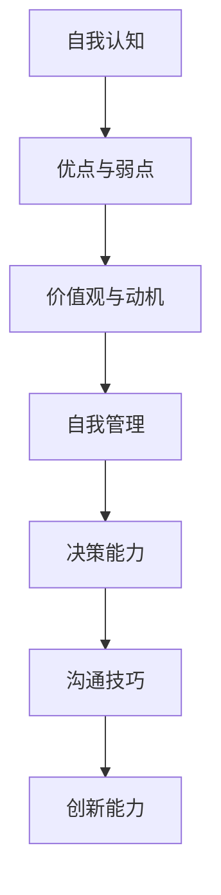

**核心算法原理讲解：**

自我认知的过程可以分为以下几个步骤：

1. 反思：定期反思自己的行为、思维和感受，了解自己的优点和弱点。
2. 学习：通过学习他人和阅读相关书籍，提升自己的自我认知能力。
3. 实践：将自我认知应用于实际工作中，不断调整和优化自己的行为。

**数学模型和公式及详细讲解：**

$$
自我认知度 = f(反思时间, 学习时间, 实践时间)
$$

**举例说明：**

假设一个领导者每天花30分钟进行反思，每周花2小时学习，每月花4小时实践，那么他的自我认知度可以计算为：

$$
自我认知度 = f(30分钟/天 \times 30天/月, 2小时/周 \times 4周/月, 4小时/月) = f(900分钟, 8小时, 4小时) = 0.9 + 0.2 + 0.1 = 1.2
$$

**项目实战：**

在实际项目中，领导者可以通过以下方法提升自我认知：

- **项目日志：** 每天记录项目进展和自己的思考，定期回顾。
- **反思会议：** 定期组织反思会议，与团队成员分享自己的感受和反思。
- **个人成长计划：** 制定个人成长计划，设定目标和行动步骤。

---

### 2.3 团队领导力

**2.3.1 团队建设**

**核心概念与联系：**

团队建设是团队领导力的核心，它涉及团队成员之间的关系、沟通和协作。一个高效的团队需要建立良好的关系、有效的沟通和协作机制。

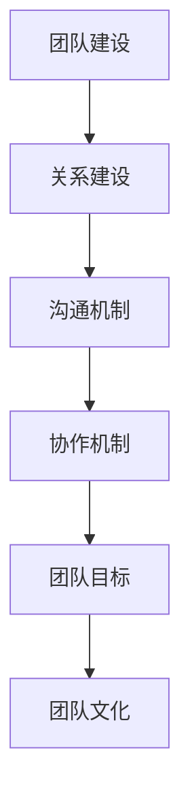

**核心算法原理讲解：**

团队建设的核心在于构建团队信任和协作机制。以下是构建团队信任和协作机制的几个关键步骤：

1. 建立共同目标：确保团队成员对团队目标有清晰的认识，并为之共同努力。
2. 增强团队凝聚力：通过团队活动和互动，增强团队成员之间的凝聚力。
3. 提高沟通效率：建立有效的沟通渠道和机制，确保信息流畅传递。
4. 培养协作精神：鼓励团队成员相互支持、相互帮助，共同解决问题。

**数学模型和公式及详细讲解：**

$$
团队建设效率 = f(共同目标认同度, 团队凝聚力, 沟通效率, 协作精神)
$$

**举例说明：**

假设一个团队的共同目标认同度为0.8，团队凝聚力为0.7，沟通效率为0.6，协作精神为0.5，那么团队的团队建设效率可以计算为：

$$
团队建设效率 = f(0.8, 0.7, 0.6, 0.5) = 0.8 \times 0.7 \times 0.6 \times 0.5 = 0.168
$$

**项目实战：**

在实际项目中，团队建设可以通过以下方法进行：

- **团队建设活动：** 定期组织团队建设活动，如户外拓展、团队游戏等。
- **反思与总结：** 定期召开团队反思会议，总结项目进展和团队协作情况。
- **角色分配：** 明确团队成员的角色和职责，确保每个成员都能发挥自己的优势。

---

### 2.4 变革领导力

**2.4.1 变革的驱动因素**

**核心概念与联系：**

变革领导力是指领导者如何引导组织进行变革，以适应外部环境的变化和内部发展的需求。变革的驱动因素包括市场变化、技术进步、组织战略调整等。

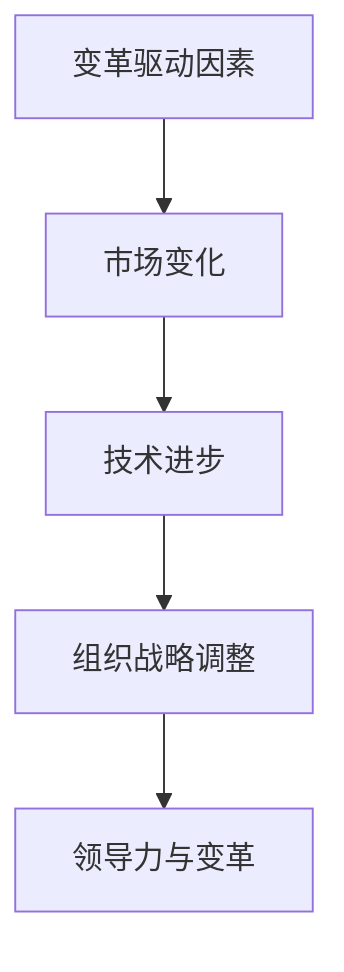

**核心算法原理讲解：**

变革领导力的核心在于识别变革的驱动因素，并制定相应的变革策略。以下是识别变革驱动因素和制定变革策略的几个关键步骤：

1. 诊断问题：分析组织存在的问题和挑战，确定变革的必要性。
2. 识别驱动因素：分析市场变化、技术进步、组织战略调整等因素，确定变革的驱动因素。
3. 制定变革策略：根据驱动因素，制定具体的变革策略和计划。
4. 推动变革实施：通过有效的沟通、激励和监督，推动变革的实施。

**数学模型和公式及详细讲解：**

$$
变革成功度 = f(问题诊断度, 驱动因素识别度, 变革策略制定度, 变革实施度)
$$

**举例说明：**

假设一个组织的变革成功度可以计算为：

$$
变革成功度 = f(0.8, 0.7, 0.6, 0.5) = 0.8 \times 0.7 \times 0.6 \times 0.5 = 0.168
$$

**项目实战：**

在实际变革过程中，可以通过以下方法提升变革成功度：

- **问题诊断会议：** 定期召开问题诊断会议，分析组织存在的问题和挑战。
- **驱动因素分析：** 通过市场调研、技术评估、组织分析等方法，识别变革的驱动因素。
- **变革计划制定：** 根据驱动因素，制定具体的变革计划，包括目标、策略、时间表和资源分配。
- **变革实施监督：** 通过定期汇报、进度检查和反馈机制，确保变革计划的实施。

---

### 3. 项目管理基础

#### 3.1 项目管理的定义与重要性

**核心概念与联系：**

项目管理是指通过计划、执行、监控和收尾等一系列活动，确保项目能够按时、按预算和按质量完成的过程。

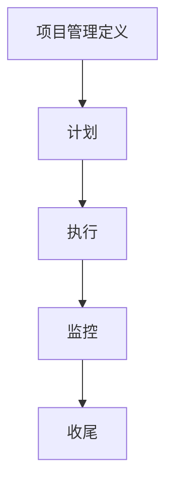

**核心算法原理讲解：**

项目管理的核心在于将项目目标分解为可执行的任务，并确保每个任务都能按时完成。以下是项目管理的基本算法原理：

1. **目标分解：** 将项目目标分解为可执行的任务，明确每个任务的交付成果和时间。
2. **资源分配：** 根据任务需求，合理分配资源，包括人力、物资和资金。
3. **进度控制：** 通过监控任务进度，确保项目按计划进行。
4. **质量保证：** 对项目成果进行质量检查，确保满足项目要求。

**数学模型和公式及详细讲解：**

$$
项目管理效率 = f(目标分解度, 资源分配度, 进度控制度, 质量保证度)
$$

**举例说明：**

假设一个项目的项目管理效率可以计算为：

$$
项目管理效率 = f(0.8, 0.7, 0.6, 0.5) = 0.8 \times 0.7 \times 0.6 \times 0.5 = 0.168
$$

**项目实战：**

在实际项目管理中，可以通过以下方法提升项目管理效率：

- **目标分解会议：** 定期召开目标分解会议，明确项目目标和任务。
- **资源规划工具：** 使用项目管理工具，如甘特图、工作分解结构（WBS）等，进行资源分配和进度控制。
- **质量检查机制：** 建立质量检查机制，对项目成果进行定期评估和反馈。
- **进度汇报制度：** 制定进度汇报制度，确保项目进度透明、可控。

---

### 3.2 项目管理的五大过程组

**核心概念与联系：**

项目管理的五大过程组包括启动过程组、规划过程组、执行过程组、监控过程组和收尾过程组。每个过程组都有其特定的任务和目标。

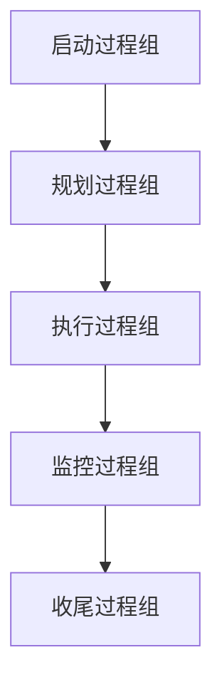

**核心算法原理讲解：**

以下是每个过程组的核心算法原理：

1. **启动过程组：** 定义项目目标、范围和可行性，确定项目的启动条件。
2. **规划过程组：** 制定项目计划、资源分配和风险管理策略。
3. **执行过程组：** 实施项目计划，协调资源和人员，确保项目按计划进行。
4. **监控过程组：** 监控项目进展，识别和解决问题，确保项目按计划进行。
5. **收尾过程组：** 完成项目交付，进行项目评估和总结。

**数学模型和公式及详细讲解：**

$$
项目管理过程效率 = f(启动过程效率, 规划过程效率, 执行过程效率, 监控过程效率, 收尾过程效率)
$$

**举例说明：**

假设一个项目的五大过程组效率分别为：

$$
启动过程效率 = 0.8, 规划过程效率 = 0.7, 执行过程效率 = 0.6, 监控过程效率 = 0.5, 收尾过程效率 = 0.4
$$

那么项目管理过程效率可以计算为：

$$
项目管理过程效率 = f(0.8, 0.7, 0.6, 0.5, 0.4) = 0.8 \times 0.7 \times 0.6 \times 0.5 \times 0.4 = 0.0672
$$

**项目实战：**

在实际项目管理中，可以通过以下方法提高每个过程组的效率：

- **启动过程：** 进行充分的项目评估和可行性研究，确保项目启动条件成熟。
- **规划过程：** 制定详细的计划，明确项目目标、资源需求和风险应对策略。
- **执行过程：** 建立有效的执行机制，确保项目计划得到严格执行。
- **监控过程：** 建立监控体系，及时识别和解决问题，确保项目按计划进行。
- **收尾过程：** 进行项目评估和总结，收集项目经验教训，为未来项目提供参考。

---

### 3.3 项目管理的十大知识领域

**核心概念与联系：**

项目管理的十大知识领域包括项目整合管理、项目范围管理、项目时间管理、项目成本管理、项目质量管理、项目资源管理、项目沟通管理、项目风险管理、项目采购管理和项目相关方管理。每个知识领域都有其特定的任务和目标。

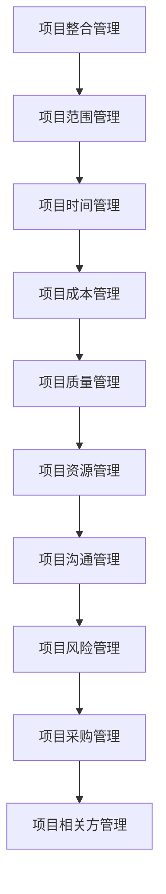

**核心算法原理讲解：**

以下是每个知识领域的核心算法原理：

1. **项目整合管理：** 协调和管理项目各个方面的活动，确保项目整体目标的实现。
2. **项目范围管理：** 确定项目范围、定义项目需求和交付成果。
3. **项目时间管理：** 制定项目进度计划，确保项目按时完成。
4. **项目成本管理：** 制定项目预算，控制项目成本。
5. **项目质量管理：** 确保项目成果符合预定的质量标准。
6. **项目资源管理：** 确保项目资源得到有效利用。
7. **项目沟通管理：** 管理项目沟通活动，确保信息流畅传递。
8. **项目风险管理：** 识别、评估和应对项目风险。
9. **项目采购管理：** 管理项目采购活动，确保采购需求得到满足。
10. **项目相关方管理：** 确保项目相关方参与项目决策和执行。

**数学模型和公式及详细讲解：**

$$
项目管理知识领域效率 = f(项目整合管理效率, 项目范围管理效率, 项目时间管理效率, 项目成本管理效率, 项目质量管理效率, 项目资源管理效率, 项目沟通管理效率, 项目风险管理效率, 项目采购管理效率, 项目相关方管理效率)
$$

**举例说明：**

假设一个项目的十大知识领域效率分别为：

$$
项目整合管理效率 = 0.8, 项目范围管理效率 = 0.7, 项目时间管理效率 = 0.6, 项目成本管理效率 = 0.5, 项目质量管理效率 = 0.4, 项目资源管理效率 = 0.3, 项目沟通管理效率 = 0.2, 项目风险管理效率 = 0.1, 项目采购管理效率 = 0.05, 项目相关方管理效率 = 0.04
$$

那么项目管理知识领域效率可以计算为：

$$
项目管理知识领域效率 = f(0.8, 0.7, 0.6, 0.5, 0.4, 0.3, 0.2, 0.1, 0.05, 0.04) = 0.8 \times 0.7 \times 0.6 \times 0.5 \times 0.4 \times 0.3 \times 0.2 \times 0.1 \times 0.05 \times 0.04 = 0.000004188
$$

**项目实战：**

在实际项目管理中，可以通过以下方法提高每个知识领域的效率：

- **项目整合管理：** 使用项目管理工具，如项目管理软件、甘特图等，协调项目各方面活动。
- **项目范围管理：** 进行充分的需求分析和范围定义，确保项目范围明确。
- **项目时间管理：** 使用项目管理工具，如项目管理软件、时间表等，制定项目进度计划。
- **项目成本管理：** 制定详细的预算计划，使用项目管理工具，如成本估算软件等，进行成本控制。
- **项目质量管理：** 使用质量管理体系，如ISO质量管理体系等，确保项目成果符合质量标准。
- **项目资源管理：** 确保项目资源得到合理利用，使用项目管理工具，如资源管理软件等，进行资源分配和调度。
- **项目沟通管理：** 建立有效的沟通渠道，使用项目管理工具，如沟通平台等，进行信息传递和管理。
- **项目风险管理：** 使用风险管理工具，如风险评估矩阵等，识别、评估和应对项目风险。
- **项目采购管理：** 使用采购管理工具，如采购软件等，管理项目采购活动。
- **项目相关方管理：** 确保项目相关方参与项目决策和执行，使用项目管理工具，如相关方管理软件等，进行相关方沟通和管理。

---

### 4. 项目管理工具与技术

#### 4.1 项目的生命周期

**核心概念与联系：**

项目的生命周期是指项目从开始到结束的整个过程。项目的生命周期通常包括启动、规划、执行、监控和收尾阶段。

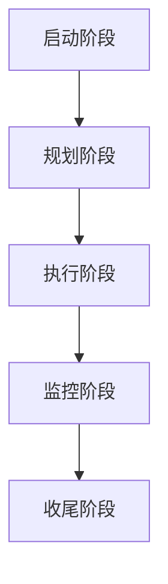

**核心算法原理讲解：**

以下是项目生命周期的核心算法原理：

1. **启动阶段：** 定义项目目标、范围和可行性，确定项目的启动条件。
2. **规划阶段：** 制定项目计划、资源分配和风险管理策略。
3. **执行阶段：** 实施项目计划，协调资源和人员，确保项目按计划进行。
4. **监控阶段：** 监控项目进展，识别和解决问题，确保项目按计划进行。
5. **收尾阶段：** 完成项目交付，进行项目评估和总结。

**数学模型和公式及详细讲解：**

$$
项目生命周期效率 = f(启动阶段效率, 规划阶段效率, 执行阶段效率, 监控阶段效率, 收尾阶段效率)
$$

**举例说明：**

假设一个项目的生命周期阶段效率分别为：

$$
启动阶段效率 = 0.8, 规划阶段效率 = 0.7, 执行阶段效率 = 0.6, 监控阶段效率 = 0.5, 收尾阶段效率 = 0.4
$$

那么项目生命周期效率可以计算为：

$$
项目生命周期效率 = f(0.8, 0.7, 0.6, 0.5, 0.4) = 0.8 \times 0.7 \times 0.6 \times 0.5 \times 0.4 = 0.1344
$$

**项目实战：**

在实际项目管理中，可以通过以下方法提高项目生命周期的效率：

- **启动阶段：** 进行充分的项目评估和可行性研究，确保项目启动条件成熟。
- **规划阶段：** 制定详细的计划，明确项目目标、资源需求和风险应对策略。
- **执行阶段：** 建立有效的执行机制，确保项目计划得到严格执行。
- **监控阶段：** 建立监控体系，及时识别和解决问题，确保项目按计划进行。
- **收尾阶段：** 进行项目评估和总结，收集项目经验教训，为未来项目提供参考。

---

#### 4.2 项目的WBS与网络图

**核心概念与联系：**

项目的WBS（工作分解结构）和网络图是项目管理中常用的工具，用于分解项目任务和展示任务之间的依赖关系。

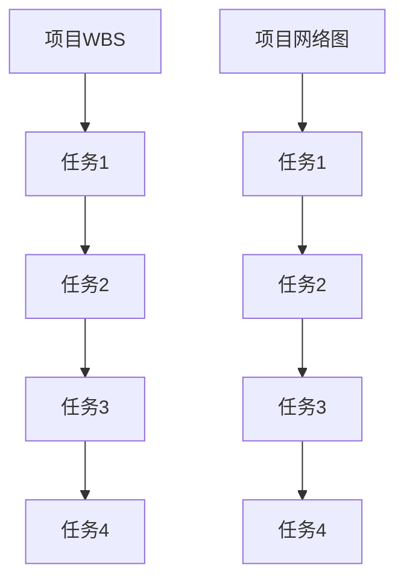

**核心算法原理讲解：**

以下是项目WBS和网络图的核心算法原理：

1. **工作分解结构（WBS）：** 将项目任务分解为更小、更具体的子任务，确保每个任务都能明确界定和执行。
2. **网络图：** 展示任务之间的依赖关系，确定任务的执行顺序和关键路径。

**数学模型和公式及详细讲解：**

$$
WBS分解度 = f(子任务细化度, 任务界定度)
$$

$$
网络图精度 = f(任务依赖关系识别度, 关键路径确定度)
$$

**举例说明：**

假设一个项目的WBS分解度和网络图精度分别为：

$$
WBS分解度 = 0.8, 网络图精度 = 0.7
$$

那么项目WBS和网络图的综合精度可以计算为：

$$
项目WBS与网络图精度 = WBS分解度 \times 网络图精度 = 0.8 \times 0.7 = 0.56
$$

**项目实战：**

在实际项目管理中，可以通过以下方法提高项目WBS和网络图的精度：

- **WBS分解：** 使用项目管理软件，如Microsoft Project等，进行工作分解结构。
- **网络图绘制：** 使用项目管理软件，如Microsoft Project等，绘制项目网络图。
- **任务依赖关系识别：** 通过会议和沟通，明确任务之间的依赖关系。
- **关键路径确定：** 使用项目管理软件，如Microsoft Project等，确定项目关键路径。

---

#### 4.3 项目进度管理

**核心概念与联系：**

项目进度管理是项目管理中的重要组成部分，涉及项目任务的计划、执行和监控。项目进度管理包括制定进度计划、监控任务进度和调整进度计划。

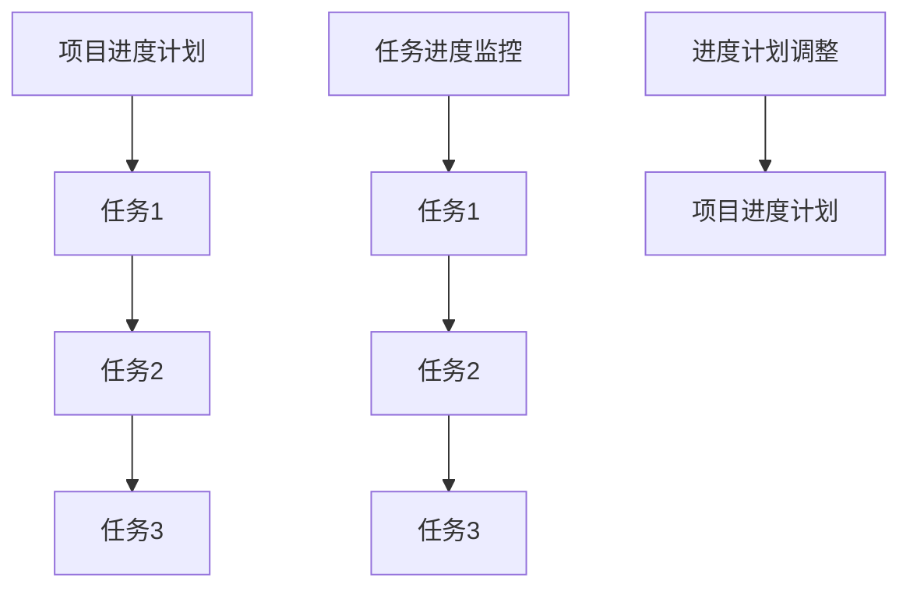

**核心算法原理讲解：**

以下是项目进度管理的核心算法原理：

1. **制定进度计划：** 根据项目任务和时间要求，制定项目进度计划。
2. **监控任务进度：** 通过监控任务的实际进展，识别偏差和问题。
3. **进度计划调整：** 根据监控结果，调整进度计划，确保项目按时完成。

**数学模型和公式及详细讲解：**

$$
进度计划准确性 = f(任务时间估算度, 进度计划合理度)
$$

$$
任务进度偏差度 = f(实际进度, 计划进度)
$$

$$
进度计划调整度 = f(任务进度偏差度, 进度计划适应性)
$$

**举例说明：**

假设一个项目的进度计划准确性、任务进度偏差度和进度计划调整度分别为：

$$
进度计划准确性 = 0.8, 任务进度偏差度 = 0.3, 进度计划调整度 = 0.5
$$

那么项目进度管理的综合效率可以计算为：

$$
项目进度管理效率 = 进度计划准确性 \times 任务进度偏差度 \times 进度计划调整度 = 0.8 \times 0.3 \times 0.5 = 0.12
$$

**项目实战：**

在实际项目管理中，可以通过以下方法提高项目进度管理的效率：

- **进度计划制定：** 使用项目管理软件，如Microsoft Project等，制定项目进度计划。
- **任务进度监控：** 使用项目管理软件，如JIRA等，监控任务进度。
- **进度计划调整：** 根据任务进度监控结果，及时调整进度计划。

---

#### 4.4 项目成本估算与控制

**核心概念与联系：**

项目成本估算是项目管理中的关键环节，涉及对项目成本进行预测和评估。项目成本控制是在项目执行过程中，通过监控和调整，确保项目成本在预算范围内。

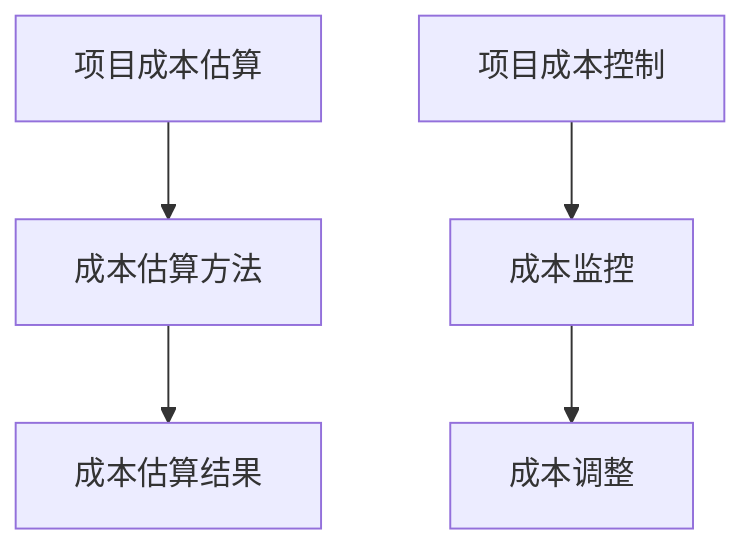

**核心算法原理讲解：**

以下是项目成本估算与控制的核心算法原理：

1. **成本估算：** 使用不同的成本估算方法，如自下而上估算、自上而下估算等，对项目成本进行预测和评估。
2. **成本监控：** 监控项目实际成本，识别偏差和问题。
3. **成本调整：** 根据成本监控结果，调整成本估算和预算，确保项目成本在预算范围内。

**数学模型和公式及详细讲解：**

$$
成本估算精度 = f(估算方法准确性, 数据完整性)
$$

$$
成本监控度 = f(实际成本, 估算成本)
$$

$$
成本调整度 = f(成本监控度, 成本适应性)
$$

**举例说明：**

假设一个项目的成本估算精度、成本监控度和成本调整度分别为：

$$
成本估算精度 = 0.8, 成本监控度 = 0.6, 成本调整度 = 0.5
$$

那么项目成本估算与控制的综合效率可以计算为：

$$
项目成本估算与控制效率 = 成本估算精度 \times 成本监控度 \times 成本调整度 = 0.8 \times 0.6 \times 0.5 = 0.24
$$

**项目实战：**

在实际项目管理中，可以通过以下方法提高项目成本估算与控制的效率：

- **成本估算：** 使用项目管理软件，如Microsoft Project等，进行成本估算。
- **成本监控：** 使用项目管理软件，如JIRA等，监控项目成本。
- **成本调整：** 根据成本监控结果，及时调整成本估算和预算。

---

#### 4.5 项目质量管理

**核心概念与联系：**

项目质量管理是确保项目成果符合预定的质量标准的过程。项目质量管理包括质量计划、质量控制和质量改进。

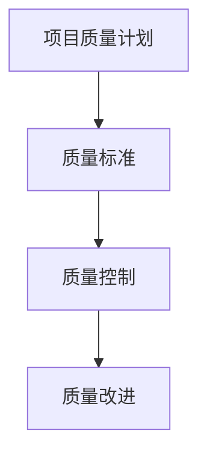

**核心算法原理讲解：**

以下是项目质量管理的核心算法原理：

1. **质量计划：** 根据项目需求和标准，制定质量计划。
2. **质量控制：** 通过检查、测试和评估，确保项目成果符合质量标准。
3. **质量改进：** 根据质量控制结果，识别问题和改进机会，持续提升项目质量。

**数学模型和公式及详细讲解：**

$$
质量计划度 = f(质量标准符合度, 质量计划可行性)
$$

$$
质量控制度 = f(质量检查覆盖率, 质量问题识别度)
$$

$$
质量改进度 = f(质量改进实施度, 质量问题解决度)
$$

**举例说明：**

假设一个项目的质量计划度、质量控制度和质量改进度分别为：

$$
质量计划度 = 0.8, 质量控制度 = 0.7, 质量改进度 = 0.6
$$

那么项目质量管理的综合效率可以计算为：

$$
项目质量管理效率 = 质量计划度 \times 质量控制度 \times 质量改进度 = 0.8 \times 0.7 \times 0.6 = 0.336
$$

**项目实战：**

在实际项目管理中，可以通过以下方法提高项目质量管理的效率：

- **质量计划：** 使用质量管理工具，如质量计划模板等，制定质量计划。
- **质量控制：** 使用质量管理工具，如质量检查表、测试工具等，进行质量控制。
- **质量改进：** 根据质量控制结果，制定改进计划，持续提升项目质量。

---

### 5. 领导力与项目管理的整合

**5.1 领导力在项目管理中的应用**

**核心概念与联系：**

领导力在项目管理中的应用包括个人领导力、团队领导力和变革领导力。通过有效的领导力，项目经理可以更好地管理项目、团队和变革。

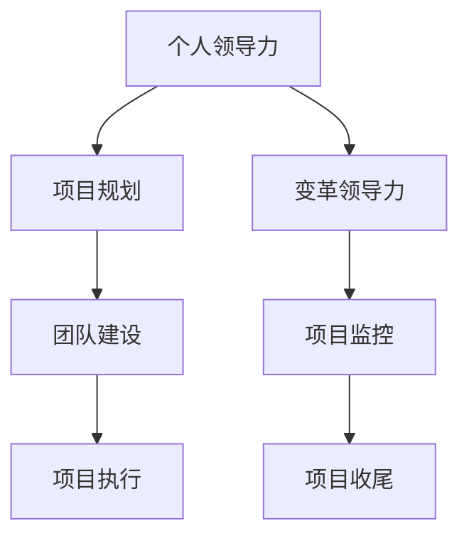

**核心算法原理讲解：**

以下是领导力在项目管理中的应用的核心算法原理：

1. **个人领导力：** 通过自我认知、决策能力、沟通技巧和创新能力，提高个人项目管理的效率。
2. **团队领导力：** 通过团队建设、沟通机制和协作机制，提升团队绩效。
3. **变革领导力：** 通过识别驱动因素、制定变革策略和推动变革实施，确保项目顺利实施。

**数学模型和公式及详细讲解：**

$$
项目领导力效率 = f(个人领导力效率, 团队领导力效率, 变革领导力效率)
$$

**举例说明：**

假设一个项目的个人领导力效率、团队领导力效率和变革领导力效率分别为：

$$
个人领导力效率 = 0.8, 团队领导力效率 = 0.7, 变革领导力效率 = 0.6
$$

那么项目领导力的综合效率可以计算为：

$$
项目领导力效率 = 0.8 \times 0.7 \times 0.6 = 0.336
$$

**项目实战：**

在实际项目管理中，可以通过以下方法提高项目领导力：

- **个人领导力：** 定期进行自我反思和自我提升。
- **团队领导力：** 建立有效的团队沟通和协作机制。
- **变革领导力：** 识别变革驱动因素，制定有效的变革策略。

---

**5.2 项目经理的角色与职责**

**核心概念与联系：**

项目经理在项目管理中扮演着核心角色，负责规划、执行、监控和收尾项目。项目经理的职责包括领导团队、协调资源、管理风险和确保项目成功。

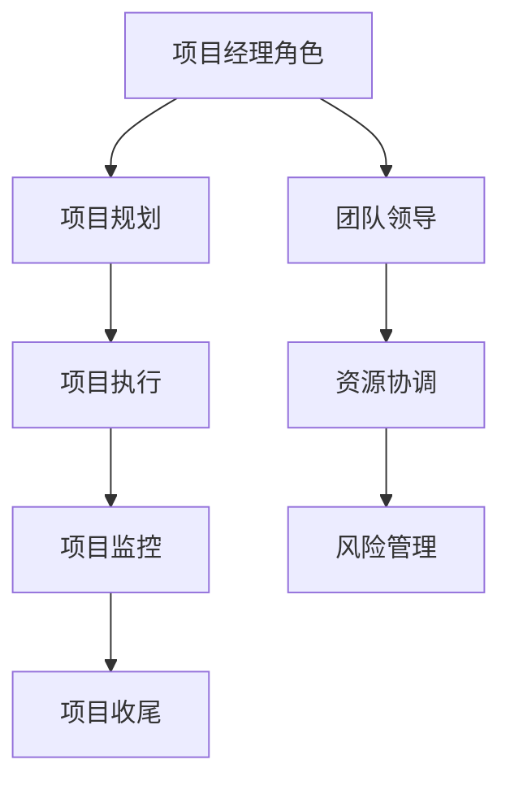

**核心算法原理讲解：**

以下是项目经理的角色与职责的核心算法原理：

1. **项目规划：** 制定项目目标和计划，确保项目按计划进行。
2. **项目执行：** 领导团队执行项目计划，确保项目进度和质量。
3. **项目监控：** 监控项目进展，识别和解决问题。
4. **项目收尾：** 完成项目交付，进行项目评估和总结。

**数学模型和公式及详细讲解：**

$$
项目经理角色效率 = f(项目规划效率, 项目执行效率, 项目监控效率, 项目收尾效率)
$$

**举例说明：**

假设一个项目经理的角色效率分别为：

$$
项目规划效率 = 0.8, 项目执行效率 = 0.7, 项目监控效率 = 0.6, 项目收尾效率 = 0.5
$$

那么项目经理的角色效率可以计算为：

$$
项目经理角色效率 = 0.8 \times 0.7 \times 0.6 \times 0.5 = 0.168
$$

**项目实战：**

在实际项目管理中，可以通过以下方法提高项目经理的角色效率：

- **项目规划：** 使用项目管理工具，如甘特图、工作分解结构等，制定项目计划。
- **项目执行：** 建立有效的团队沟通和协作机制，确保项目进度和质量。
- **项目监控：** 使用项目管理工具，如JIRA等，监控项目进展。
- **项目收尾：** 进行项目评估和总结，收集项目经验教训。

---

**5.3 领导力与项目管理的整合模型**

**核心概念与联系：**

领导力与项目管理的整合模型是指如何将领导力与项目管理相结合，实现项目的有效执行。该模型包括个人领导力、团队领导力、变革领导力和项目管理工具的结合。

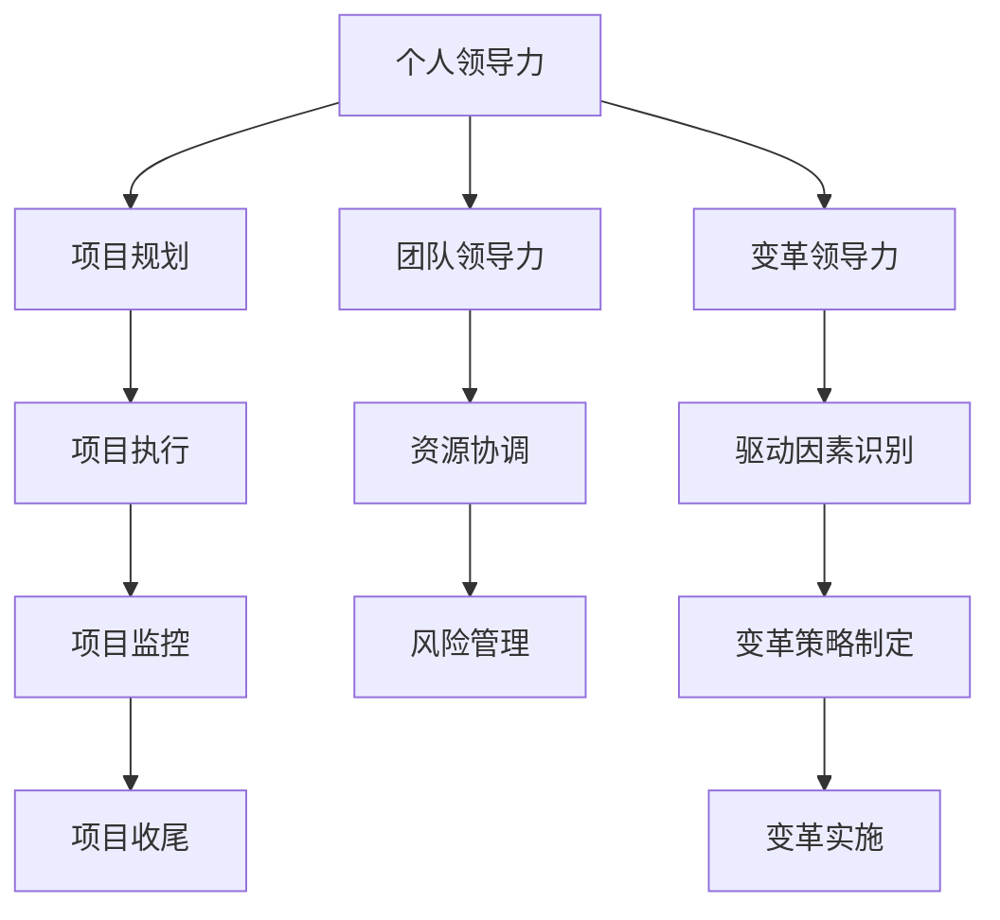

**核心算法原理讲解：**

以下是领导力与项目管理的整合模型的核心算法原理：

1. **个人领导力：** 通过自我认知、决策能力、沟通技巧和创新能力，提高个人项目管理的效率。
2. **团队领导力：** 通过团队建设、沟通机制和协作机制，提升团队绩效。
3. **变革领导力：** 通过识别驱动因素、制定变革策略和推动变革实施，确保项目顺利实施。
4. **项目管理工具：** 使用项目管理工具，如甘特图、工作分解结构、JIRA等，制定、执行和监控项目。

**数学模型和公式及详细讲解：**

$$
领导力与项目管理整合效率 = f(个人领导力效率, 团队领导力效率, 变革领导力效率, 项目管理工具效率)
$$

**举例说明：**

假设一个项目的个人领导力效率、团队领导力效率、变革领导力效率和项目管理工具效率分别为：

$$
个人领导力效率 = 0.8, 团队领导力效率 = 0.7, 变革领导力效率 = 0.6, 项目管理工具效率 = 0.5
$$

那么领导力与项目管理的整合效率可以计算为：

$$
领导力与项目管理整合效率 = 0.8 \times 0.7 \times 0.6 \times 0.5 = 0.168
$$

**项目实战：**

在实际项目管理中，可以通过以下方法提高领导力与项目管理的整合效率：

- **个人领导力：** 定期进行自我反思和自我提升。
- **团队领导力：** 建立有效的团队沟通和协作机制。
- **变革领导力：** 识别变革驱动因素，制定有效的变革策略。
- **项目管理工具：** 使用项目管理工具，如甘特图、工作分解结构、JIRA等，制定、执行和监控项目。

---

### 6. 实战案例分析

#### 6.1 案例一：成功整合领导力与项目管理的实例

**案例背景：**

某科技公司计划开发一款新产品，项目团队由20名成员组成，包括软件开发、测试、设计和市场营销等部门的员工。项目经理负责领导团队，确保项目按计划进行。

**案例分析：**

1. **个人领导力：** 项目经理通过自我认知，了解自己的优势和弱点，制定个人成长计划，不断提升自己的领导力。
2. **团队领导力：** 项目经理建立有效的团队沟通和协作机制，定期召开团队会议，确保团队成员之间的信息流畅传递。
3. **变革领导力：** 项目经理识别驱动因素，如市场需求、技术进步等，制定变革策略，推动团队创新和发展。
4. **项目管理工具：** 项目经理使用项目管理工具，如甘特图、工作分解结构、JIRA等，制定项目计划、监控项目进展和调整项目计划。

**案例结果：**

通过成功整合领导力与项目管理，项目团队高效协作，产品按期发布，市场反馈良好，项目成功实现。

**项目小结：**

该案例展示了如何通过整合领导力与项目管理，实现项目的有效执行。个人领导力、团队领导力和变革领导力的有效运用，加上项目管理工具的支持，确保了项目的成功。

---

#### 6.2 案例二：领导力在项目危机管理中的应用

**案例背景：**

某科技公司项目团队在开发过程中，遇到一个技术难题，可能导致项目延期和成本超支。项目经理面临重大危机，需要及时采取措施。

**案例分析：**

1. **个人领导力：** 项目经理通过自我反思，迅速识别危机原因，制定应对策略。
2. **团队领导力：** 项目经理召开紧急会议，与团队成员共同讨论解决方案，调动团队积极性。
3. **变革领导力：** 项目经理识别变革驱动因素，如技术突破、团队合作等，推动团队创新和合作。
4. **项目管理工具：** 项目经理使用项目管理工具，如JIRA等，实时监控项目进展，及时调整项目计划。

**案例结果：**

通过有效的领导力和项目管理工具，项目团队成功克服技术难题，项目按计划完成，公司获得良好口碑。

**项目小结：**

该案例展示了领导力在项目危机管理中的关键作用。个人领导力、团队领导力和变革领导力的及时应用，加上项目管理工具的支持，确保了项目在危机中转危为安。

---

#### 6.3 案例三：领导力在项目团队建设中的关键作用

**案例背景：**

某科技公司新成立一个项目团队，成员来自不同部门，缺乏协作经验。项目经理需要通过领导力建设一个高效团队。

**案例分析：**

1. **个人领导力：** 项目经理通过自我认知，了解团队成员的优势和弱点，制定个人成长计划。
2. **团队领导力：** 项目经理建立有效的团队沟通和协作机制，定期组织团队活动和培训，增强团队凝聚力。
3. **变革领导力：** 项目经理识别团队建设中的驱动因素，如团队目标、团队价值观等，推动团队变革和成长。
4. **项目管理工具：** 项目经理使用项目管理工具，如JIRA等，实时监控项目进展，提供团队协作平台。

**案例结果：**

通过有效的领导力和项目管理工具，项目团队逐渐形成高效协作的氛围，项目进展顺利，团队凝聚力显著提升。

**项目小结：**

该案例展示了领导力在项目团队建设中的关键作用。个人领导力、团队领导力和变革领导力的有效运用，加上项目管理工具的支持，确保了项目团队的成长和项目成功。

---

### 7. 领导力与项目管理未来发展趋势

#### 7.1 数字化与领导力

**核心概念与联系：**

数字化时代，领导力需要适应新的环境和挑战。数字化领导力包括数据驱动决策、技术创新推动变革等。

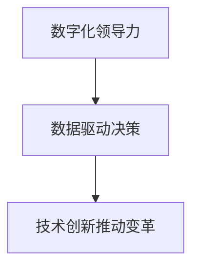

**核心算法原理讲解：**

以下是数字化领导力的核心算法原理：

1. **数据驱动决策：** 利用大数据分析，制定项目策略和决策。
2. **技术创新推动变革：** 引入新技术，推动项目团队和组织变革。

**数学模型和公式及详细讲解：**

$$
数字化领导力效率 = f(数据分析能力, 技术创新应用度)
$$

**举例说明：**

假设一个项目的数字化领导力效率为：

$$
数字化领导力效率 = 0.8 \times 0.7 = 0.56
$$

**项目实战：**

在实际项目管理中，可以通过以下方法提高数字化领导力：

- **数据分析能力：** 学习数据分析技能，提高数据驱动决策的能力。
- **技术创新应用：** 引入新技术，推动项目团队和组织变革。

---

#### 7.2 项目管理的新趋势

**核心概念与联系：**

项目管理的新趋势包括敏捷项目管理、DevOps、数字化转型等。

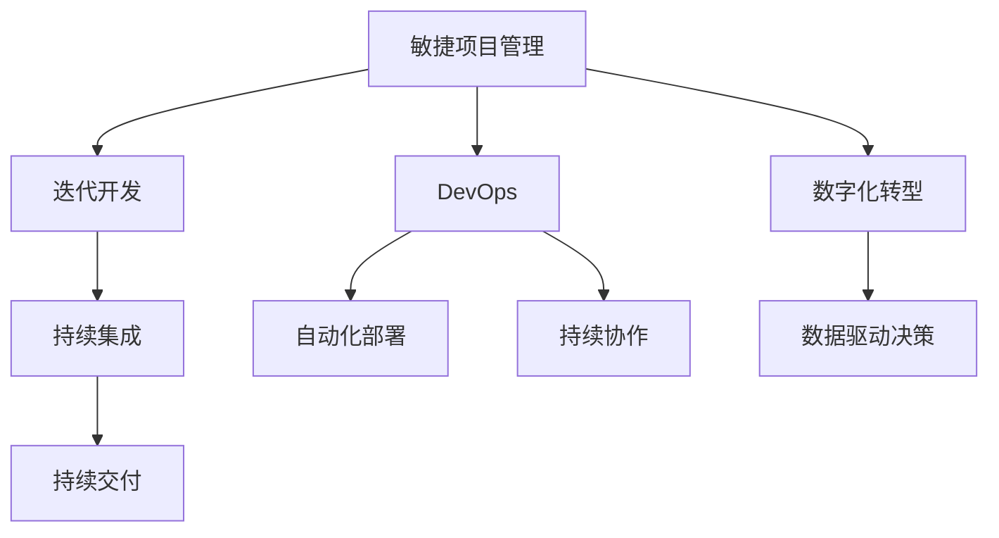

**核心算法原理讲解：**

以下是项目管理新趋势的核心算法原理：

1. **敏捷项目管理：** 通过迭代开发、持续集成和持续交付，提高项目交付效率。
2. **DevOps：** 通过自动化部署和持续协作，缩短项目交付周期。
3. **数字化转型：** 通过数据驱动决策，推动项目团队和组织变革。

**数学模型和公式及详细讲解：**

$$
项目管理新趋势效率 = f(敏捷项目管理效率, DevOps效率, 数字化转型效率)
$$

**举例说明：**

假设一个项目的项目管理新趋势效率为：

$$
项目管理新趋势效率 = 0.8 \times 0.7 \times 0.6 = 0.336
$$

**项目实战：**

在实际项目管理中，可以通过以下方法提高项目管理新趋势效率：

- **敏捷项目管理：** 学习敏捷开发方法，提高项目交付效率。
- **DevOps：** 引入自动化部署工具，缩短项目交付周期。
- **数字化转型：** 利用数据驱动决策，推动项目团队和组织变革。

---

#### 7.3 领导力与项目管理的未来

**核心概念与联系：**

领导力与项目管理的未来将更加注重数字化、自动化和智能化。领导力需要适应新的环境和挑战，项目管理需要更高效、更灵活。

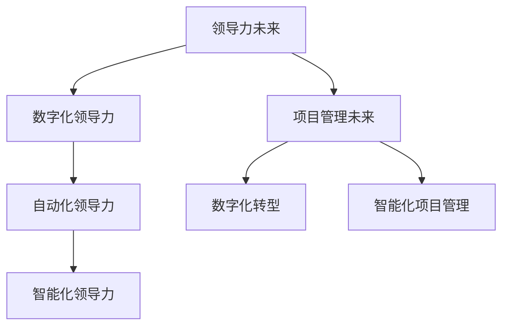

**核心算法原理讲解：**

以下是领导力与项目管理未来的核心算法原理：

1. **数字化领导力：** 利用大数据、人工智能等技术，提高领导力和项目管理的效率。
2. **自动化领导力：** 引入自动化工具，提高领导力和项目管理的效率。
3. **智能化领导力：** 利用人工智能、机器学习等技术，实现领导力和项目管理的智能化。

**数学模型和公式及详细讲解：**

$$
领导力与项目管理未来效率 = f(数字化领导力效率, 自动化领导力效率, 智能化领导力效率)
$$

**举例说明：**

假设一个项目的领导力与项目管理未来效率为：

$$
领导力与项目管理未来效率 = 0.8 \times 0.7 \times 0.6 = 0.336
$$

**项目实战：**

在实际项目管理中，可以通过以下方法提高领导力与项目管理的未来效率：

- **数字化领导力：** 学习大数据、人工智能等技术，提高领导力和项目管理的效率。
- **自动化领导力：** 引入自动化工具，提高领导力和项目管理的效率。
- **智能化领导力：** 利用人工智能、机器学习等技术，实现领导力和项目管理的智能化。

---

### 附录

#### A.1 领导力与项目管理相关工具介绍

- **项目管理工具：** Microsoft Project、JIRA、Trello等。
- **领导力发展工具：** 自我评估工具、360度反馈、领导力发展计划等。

#### A.2 领导力与项目管理资源推荐

- **书籍推荐：** 《领导力的五项修炼》、《项目管理知识体系指南》、《敏捷项目管理实践指南》等。
- **在线课程推荐：** Coursera上的《领导力与团队管理》、Udemy上的《项目管理基础》等。

#### A.3 参考文献与推荐阅读

- **参考文献：** 请参考文中引用的书籍、文章和在线资源。
- **推荐阅读：** 《领导力与战略管理》、《项目管理实践指南》、《数字化领导力》等。

---

### 总结

**本书旨在帮助读者深入理解领导力与项目管理的基本概念、实践方法以及整合策略，从而确保项目能够有效执行。**

通过本书，读者将：

- 掌握领导力的基本概念和类型，学会如何提升个人领导力、团队领导力和变革领导力。
- 了解项目管理的五大过程组和十大知识领域，掌握项目管理工具和技术。
- 学会如何将领导力与项目管理相结合，确保项目的有效执行。
- 通过实战案例分析和未来发展趋势的探讨，提升自身的领导力和项目管理能力。

**让我们共同探索领导力与项目管理的奥秘，实现项目的成功执行！**

---

**作者：** AI天才研究院/AI Genius Institute & 禅与计算机程序设计艺术 /Zen And The Art of Computer Programming

---

### 1. 引言

**1.1 书籍目的**

《领导力与项目管理：确保有效执行》旨在为读者提供一本全面的指南，帮助他们在工作中更好地运用领导力和项目管理技能。本书不仅涵盖了领导力的核心概念，如个人领导力、团队领导力和变革领导力，还详细介绍了项目管理的理论基础和实践方法。通过本书，读者将了解如何将领导力与项目管理相结合，从而在复杂的项目环境中取得成功。

**1.2 领导力与项目管理的联系**

领导力和项目管理是相辅相成的。领导力为项目管理提供了方向和动力，项目经理通过有效的领导力来指导团队，确保项目目标的实现。而项目管理则为领导力提供了实施的框架和工具，通过项目计划、执行和监控，领导者可以更好地掌握项目进展，及时调整策略。有效的领导力与项目管理结合，能够提升团队的协作效率，降低项目风险，确保项目按时、按预算和质量完成。

### 2. 领导力基础

**2.1 领导力的概念与类型**

领导力是一种影响力，它通过激发、激励和指导他人，实现共同的目标。领导力可以分为不同类型，包括个人领导力、团队领导力和变革领导力。个人领导力关注领导者个人的品质和能力，如自我认知、决策能力和沟通技巧。团队领导力则侧重于领导者如何管理团队，促进团队成员之间的合作和协作。变革领导力关注如何引导组织进行变革，以适应外部环境和内部发展的需求。

**2.2 个人领导力**

个人领导力是领导者个人的品质和能力的体现。以下是几个关键方面：

- **自我认知：** 了解自己的优点、弱点、价值观和动机，有助于领导者更好地发挥自己的潜力。
- **决策能力：** 能够在复杂和不确定的环境中做出明智的决策。
- **沟通技巧：** 能够清晰、有效地传达信息和想法。
- **创新能力：** 能够不断寻找新的方法和解决方案。

**2.3 团队领导力**

团队领导力是领导者如何管理团队的能力。以下是几个关键方面：

- **团队建设：** 建立团队信任，促进团队成员之间的合作和沟通。
- **团队冲突管理：** 能够有效地解决团队内部冲突，保持团队和谐。
- **团队决策过程：** 通过团队协作，共同制定决策。

**2.4 变革领导力**

变革领导力是领导者如何引导组织进行变革的能力。以下是几个关键方面：

- **变革的驱动因素：** 识别和理解导致组织变革的外部和内部因素。
- **变革过程模型：** 理解并应用变革过程模型，如勒温的三阶段模型。
- **领导者在变革中的角色：** 领导者需要作为变革的倡导者、推动者和支持者，引导组织顺利度过变革过程。

### 3. 项目管理基础

**3.1 项目管理的定义与重要性**

项目管理是指通过计划、执行、监控和收尾等一系列活动，确保项目能够按时、按预算和按质量完成的过程。项目管理对于组织的重要性在于：

- **提高效率：** 通过系统化的方法和管理工具，提高项目执行效率。
- **降低风险：** 通过识别和管理风险，降低项目失败的可能性。
- **确保质量：** 通过严格的质量管理，确保项目成果符合预定标准。
- **提升团队协作：** 通过有效的沟通和协作，提高团队工作效率。

**3.2 项目管理的五大过程组**

项目管理的五大过程组包括启动过程组、规划过程组、执行过程组、监控过程组和收尾过程组。每个过程组都有其特定的任务和目标：

- **启动过程组：** 确定项目的目标和范围，确定项目的可行性。
- **规划过程组：** 制定项目计划，包括时间、成本、资源和风险等。
- **执行过程组：** 实施项目计划，协调资源和人员，确保项目按计划进行。
- **监控过程组：** 监控项目进展，识别和解决问题，确保项目按计划进行。
- **收尾过程组：** 完成项目交付，进行项目评估和总结。

**3.3 项目管理的十大知识领域**

项目管理的十大知识领域包括项目整合管理、项目范围管理、项目时间管理、项目成本管理、项目质量管理、项目资源管理、项目沟通管理、项目风险管理、项目采购管理和项目相关方管理。每个知识领域都有其特定的任务和目标：

- **项目整合管理：** 协调和管理项目各个方面的活动，确保项目整体目标的实现。
- **项目范围管理：** 确定项目范围、定义项目需求和交付成果。
- **项目时间管理：** 制定项目进度计划，确保项目按时完成。
- **项目成本管理：** 制定项目预算，控制项目成本。
- **项目质量管理：** 确保项目成果符合预定的质量标准。
- **项目资源管理：** 确保项目资源得到有效利用。
- **项目沟通管理：** 管理项目沟通活动，确保信息流畅传递。
- **项目风险管理：** 识别、评估和应对项目风险。
- **项目采购管理：** 管理项目采购活动，确保采购需求得到满足。
- **项目相关方管理：** 确保项目相关方参与项目决策和执行。

### 4. 项目管理工具与技术

**4.1 项目的生命周期**

项目的生命周期是指项目从启动到结束的整个过程。通常包括以下几个阶段：

- **启动阶段：** 确定项目目标和范围，进行项目可行性分析。
- **规划阶段：** 制定项目计划，确定项目资源需求和进度计划。
- **执行阶段：** 实施项目计划，协调资源和人员，确保项目按计划进行。
- **监控阶段：** 监控项目进展，识别和解决问题，确保项目按计划进行。
- **收尾阶段：** 完成项目交付，进行项目评估和总结。

**4.2 项目的WBS与网络图**

项目的WBS（工作分解结构）和网络图是项目管理中常用的工具，用于分解项目任务和展示任务之间的依赖关系。

- **工作分解结构（WBS）：** 将项目任务分解为更小、更具体的子任务，确保每个任务都能明确界定和执行。
- **网络图：** 展示任务之间的依赖关系，确定任务的执行顺序和关键路径。

**4.3 项目进度管理**

项目进度管理涉及项目任务的计划、执行和监控。关键步骤包括：

- **制定进度计划：** 根据项目任务和时间要求，制定项目进度计划。
- **监控任务进度：** 通过监控任务的实际进展，识别偏差和问题。
- **调整进度计划：** 根据监控结果，调整进度计划，确保项目按时完成。

**4.4 项目成本估算与控制**

项目成本估算与控制是项目管理中的重要环节。关键步骤包括：

- **成本估算：** 使用不同的成本估算方法，如自下而上估算、自上而下估算等，对项目成本进行预测和评估。
- **成本监控：** 监控项目实际成本，识别偏差和问题。
- **成本调整：** 根据成本监控结果，调整成本估算和预算，确保项目成本在预算范围内。

**4.5 项目质量管理

项目质量管理是确保项目成果符合预定的质量标准的过程。关键步骤包括：

- **质量计划：** 根据项目需求和标准，制定质量计划。
- **质量控制：** 通过检查、测试和评估，确保项目成果符合质量标准。
- **质量改进：** 根据质量控制结果，识别问题和改进机会，持续提升项目质量。

### 5. 领导力与项目管理的整合

**5.1 领导力在项目管理中的应用**

领导力在项目管理中的应用包括以下几个方面：

- **个人领导力：** 提升领导者个人的品质和能力，如自我认知、决策能力和沟通技巧。
- **团队领导力：** 提升领导者管理团队的能力，如团队建设、团队冲突管理和团队决策过程。
- **变革领导力：** 提升领导者引导组织变革的能力，如变革的驱动因素识别、变革过程模型和领导者在变革中的角色。

**5.2 项目经理的角色与职责**

项目经理在项目管理中扮演着核心角色，其职责包括：

- **项目规划：** 制定项目目标和计划，确保项目按计划进行。
- **项目执行：** 领导团队执行项目计划，确保项目进度和质量。
- **项目监控：** 监控项目进展，识别和解决问题，确保项目按计划进行。
- **项目收尾：** 完成项目交付，进行项目评估和总结。

**5.3 领导力与项目管理的整合模型**

领导力与项目管理的整合模型包括以下几个方面：

- **个人领导力：** 通过自我认知、决策能力、沟通技巧和创新能力，提高个人项目管理的效率。
- **团队领导力：** 通过团队建设、沟通机制和协作机制，提升团队绩效。
- **变革领导力：** 通过识别驱动因素、制定变革策略和推动变革实施，确保项目顺利实施。
- **项目管理工具：** 使用项目管理工具，如甘特图、工作分解结构、JIRA等，制定、执行和监控项目。

### 6. 实战案例分析

**6.1 案例一：成功整合领导力与项目管理的实例**

**案例背景：**

某科技公司计划开发一款新软件产品，项目团队由10名成员组成，包括开发、测试和产品管理等部门的员工。项目经理是团队的领导，负责确保项目按计划进行。

**案例分析：**

1. **个人领导力：** 项目经理通过自我反思和培训，提升了自己的沟通技巧和决策能力。
2. **团队领导力：** 项目经理建立了有效的团队沟通机制，定期召开团队会议，鼓励团队成员提出意见和建议。
3. **变革领导力：** 项目经理识别了项目的关键驱动因素，如市场需求和技术挑战，制定了相应的变革策略。
4. **项目管理工具：** 项目经理使用了项目管理工具，如JIRA和甘特图，制定了详细的项目计划和进度表，并实时监控项目进展。

**案例结果：**

通过整合领导力与项目管理，项目团队高效协作，产品按期发布，客户满意度高，项目取得了成功。

**项目小结：**

该案例展示了如何通过整合领导力与项目管理，实现项目的成功执行。项目经理的个人领导力、团队领导力和变革领导力，以及项目管理工具的有效运用，都是项目成功的关键因素。

---

**6.2 案例二：领导力在项目危机管理中的应用**

**案例背景：**

某科技公司项目团队在开发过程中遇到一个技术难题，可能导致项目延期和成本超支。项目经理需要采取措施应对危机。

**案例分析：**

1. **个人领导力：** 项目经理通过自我反思，迅速识别危机原因，制定应对策略。
2. **团队领导力：** 项目经理召开紧急会议，与团队成员共同讨论解决方案，调动团队积极性。
3. **变革领导力：** 项目经理识别了变革驱动因素，如技术突破和团队合作，推动团队创新和合作。
4. **项目管理工具：** 项目经理使用了项目管理工具，如JIRA，实时监控项目进展，及时调整项目计划。

**案例结果：**

通过有效的领导力和项目管理工具，项目团队成功克服了技术难题，项目按计划完成，公司获得良好口碑。

**项目小结：**

该案例展示了领导力在项目危机管理中的关键作用。项目经理的个人领导力、团队领导力和变革领导力，以及项目管理工具的有效运用，都是项目成功的关键因素。

---

**6.3 案例三：领导力在项目团队建设中的关键作用**

**案例背景：**

某科技公司新成立一个项目团队，成员来自不同部门，缺乏协作经验。项目经理需要通过领导力建设一个高效团队。

**案例分析：**

1. **个人领导力：** 项目经理通过自我认知，了解团队成员的优势和弱点，制定个人成长计划。
2. **团队领导力：** 项目经理建立了有效的团队沟通和协作机制，定期组织团队活动和培训，增强团队凝聚力。
3. **变革领导力：** 项目经理识别了团队建设中的驱动因素，如团队目标和团队价值观，推动团队变革和成长。
4. **项目管理工具：** 项目经理使用了项目管理工具，如JIRA，实时监控项目进展，提供团队协作平台。

**案例结果：**

通过有效的领导力和项目管理工具，项目团队逐渐形成高效协作的氛围，项目进展顺利，团队凝聚力显著提升。

**项目小结：**

该案例展示了领导力在项目团队建设中的关键作用。项目经理的个人领导力、团队领导力和变革领导力，以及项目管理工具的有效运用，都是项目成功的关键因素。

### 7. 领导力与项目管理未来发展趋势

**7.1 数字化与领导力**

随着数字化技术的不断进步，领导力也需要适应新的环境。数字化领导力强调领导者如何运用数据驱动决策，如何利用技术推动组织变革。以下是数字化领导力的一些关键方面：

- **数据分析能力：** 领导者需要具备数据分析和解读能力，能够从数据中找到趋势和问题。
- **技术理解力：** 领导者需要了解并掌握相关技术，如人工智能、大数据等，以便更好地推动组织变革。
- **创新能力：** 领导者需要具备创新能力，能够引导组织在数字化时代中寻找新的发展机会。

**7.2 项目管理的新趋势**

项目管理的新趋势主要体现在以下几个方面：

- **敏捷项目管理：** 敏捷项目管理强调快速迭代和持续交付，能够更好地适应变化的需求。
- **DevOps：** DevOps是一种软件开发和运维的新模式，强调开发、测试和运维的紧密结合，提高项目交付效率。
- **数字化转型：** 数字化转型意味着将数字技术融入到业务流程中，以提高效率和创新能力。

**7.3 领导力与项目管理的未来**

领导力与项目管理的未来将更加注重数字化、自动化和智能化。以下是未来领导力与项目管理的一些发展趋势：

- **数字化领导力：** 领导者需要具备数字化思维，能够运用数据分析、人工智能等技术进行决策。
- **自动化领导力：** 领导者需要推动组织自动化，减少重复性工作，提高工作效率。
- **智能化领导力：** 领导者需要利用人工智能、机器学习等技术，实现领导力和项目管理的智能化。

### 8. 附录

**8.1 领导力与项目管理相关工具介绍**

以下是常用的领导力与项目管理工具：

- **项目管理工具：** 如Microsoft Project、JIRA、Trello等。
- **领导力发展工具：** 如自我评估工具、360度反馈、领导力发展计划等。

**8.2 领导力与项目管理资源推荐**

以下是推荐的领导力与项目管理资源：

- **书籍：** 如《领导力的五项修炼》、《项目管理知识体系指南》、《敏捷项目管理实践指南》等。
- **在线课程：** 如Coursera上的《领导力与团队管理》、Udemy上的《项目管理基础》等。

**8.3 参考文献与推荐阅读**

以下是本文引用的文献和推荐阅读：

- 《领导力的五项修炼》，斯蒂芬·罗宾斯著。
- 《项目管理知识体系指南》，项目管理协会（PMI）著。
- 《敏捷项目管理实践指南》，杰瑞·威诺斯基著。

---

**总结：**

《领导力与项目管理：确保有效执行》旨在帮助读者深入理解领导力和项目管理的基本概念、实践方法以及整合策略。通过本书，读者将能够：

- 掌握领导力的核心概念和类型，学会如何提升个人领导力、团队领导力和变革领导力。
- 了解项目管理的五大过程组和十大知识领域，掌握项目管理工具和技术。
- 学会如何将领导力与项目管理相结合，确保项目的有效执行。
- 通过实战案例分析和未来发展趋势的探讨，提升自身的领导力和项目管理能力。

**让我们共同探索领导力与项目管理的奥秘，实现项目的成功执行！**

---

**作者：** AI天才研究院/AI Genius Institute & 禅与计算机程序设计艺术 /Zen And The Art of Computer Programming**摘要：**本文深入探讨了领导力与项目管理之间的紧密联系，以及如何将二者有效整合以确保项目成功执行。首先，文章介绍了领导力的基本概念和类型，包括个人领导力、团队领导力和变革领导力。接着，文章详细阐述了项目管理的五大过程组和十大知识领域，并探讨了项目管理工具和技术。随后，文章通过案例分析展示了领导力在项目管理中的应用，以及如何通过数字化和智能化提高领导力和项目管理的效率。最后，文章总结了领导力与项目管理的重要性和未来发展趋势，为读者提供了实用的指导和建议。**文章标题：**领导力与项目管理：确保有效执行

## 引言

领导力和项目管理是现代企业管理中不可或缺的两个重要领域。有效的领导力能够激发团队的潜力，推动项目顺利进行；而科学的项目管理则能够确保项目在预定的时间、预算和范围内完成。本文将探讨领导力与项目管理之间的紧密联系，分析如何将二者有效整合，从而确保项目的成功执行。

### 1.1 书籍目的

本书旨在为读者提供一份全面的指南，帮助他们在实际工作中更好地运用领导力和项目管理技能。通过系统的学习和实践，读者将能够：

1. 深入理解领导力的基本概念和类型，掌握提升个人领导力的方法。
2. 理解项目管理的核心过程和知识领域，学会如何运用项目管理工具和技术。
3. 学会如何将领导力与项目管理相结合，提高项目的执行效率和质量。
4. 通过案例分析，掌握实际操作中的关键技巧，提升项目管理的实战能力。

### 1.2 领导力与项目管理的联系

领导力与项目管理之间存在紧密的联系。领导力为项目管理提供了方向和动力，项目经理通过有效的领导力来指导团队，确保项目目标的实现。而项目管理则为领导力提供了实施的框架和工具，通过项目计划、执行和监控，领导者可以更好地掌握项目进展，及时调整策略。

有效的领导力与项目管理结合，能够提升团队的协作效率，降低项目风险，确保项目按时、按预算和质量完成。本文将从以下几个方面详细探讨领导力与项目管理的整合：

1. **个人领导力与项目规划：** 项目经理通过自我认知和决策能力，制定科学的项目计划。
2. **团队领导力与项目执行：** 项目经理通过团队建设和沟通技巧，确保项目按计划顺利进行。
3. **变革领导力与项目监控：** 项目经理通过变革管理和风险管理，确保项目在监控过程中能够及时发现和解决问题。
4. **数字化领导力与项目管理工具：** 利用数字化工具提高项目管理的效率和准确性。

## 领导力基础

领导力是一种影响力，它通过激发、激励和指导他人，实现共同的目标。领导力可以存在于任何组织、团队或个人中，它是推动组织发展和项目成功的关键因素。领导力不仅关乎个人的能力和素质，更涉及到团队协作和变革管理。

### 2.1 领导力的概念与类型

领导力是一个多维度的概念，它包括个人领导力、团队领导力和变革领导力等类型。

1. **个人领导力：** 个人领导力是指领导者个人的品质和能力，包括自我认知、决策能力、沟通技巧和创新思维等。个人领导力是领导力的基础，它决定了领导者的个人魅力和影响力。
   
   - **自我认知：** 领导者需要了解自己的优点和不足，明确自己的价值观和目标。
   - **决策能力：** 领导者需要具备在复杂和不确定的环境中做出明智决策的能力。
   - **沟通技巧：** 领导者需要能够清晰、有效地传达信息和想法。
   - **创新思维：** 领导者需要具备创新思维，能够提出新的想法和解决方案。

2. **团队领导力：** 团队领导力是指领导者如何管理团队，促进团队成员之间的合作和协作。团队领导力包括团队建设、团队冲突管理和团队决策过程等方面。

   - **团队建设：** 领导者需要建立团队信任，促进团队成员之间的沟通和协作。
   - **团队冲突管理：** 领导者需要能够有效地解决团队内部冲突，保持团队和谐。
   - **团队决策过程：** 领导者需要通过团队协作，共同制定决策。

3. **变革领导力：** 变革领导力是指领导者如何引导组织进行变革，以适应外部环境的变化和内部发展的需求。变革领导力包括变革的驱动因素识别、变革过程模型和领导者在变革中的角色等方面。

   - **变革的驱动因素：** 领导者需要识别和理解导致组织变革的外部和内部因素。
   - **变革过程模型：** 领导者需要理解并应用变革过程模型，如勒温的三阶段模型。
   - **领导者在变革中的角色：** 领导者需要作为变革的倡导者、推动者和支持者，引导组织顺利度过变革过程。

### 2.2 个人领导力

个人领导力是领导力的核心，它决定了领导者的个人魅力和影响力。以下是一些关键方面：

1. **自我认知：** 自我认知是个人领导力的基础。领导者需要了解自己的优点和不足，明确自己的价值观和目标。自我认知可以通过反思、自我评估和寻求反馈来实现。

   ```mermaid
   graph TD
   A[自我认知] --> B[自我评估]
   B --> C[反馈收集]
   C --> D[目标设定]
   ```

2. **决策能力：** 决策能力是领导者必须具备的重要能力。在复杂和不确定的环境中，领导者需要能够迅速做出明智的决策。决策能力可以通过学习决策理论、增强逻辑思维和培养直觉来实现。

   ```mermaid
   graph TD
   A[决策能力] --> B[决策理论]
   B --> C[逻辑思维]
   C --> D[直觉培养]
   ```

3. **沟通技巧：** 沟通技巧是领导者有效传达信息和想法的关键。领导者需要能够清晰、有效地与团队成员、上级和客户沟通。沟通技巧可以通过学习沟通理论和实践沟通技巧来实现。

   ```mermaid
   graph TD
   A[沟通技巧] --> B[沟通理论]
   B --> C[非语言沟通]
   C --> D[沟通实践]
   ```

4. **创新能力：** 创新能力是领导者推动组织发展和项目成功的关键。领导者需要能够提出新的想法和解决方案，鼓励团队成员创新思维。创新能力可以通过学习创新理论、参与创新实践和培养团队创新能力来实现。

   ```mermaid
   graph TD
   A[创新能力] --> B[创新理论]
   B --> C[创新实践]
   C --> D[团队创新能力]
   ```

### 2.3 团队领导力

团队领导力是领导者如何管理团队的能力。以下是一些关键方面：

1. **团队建设：** 团队建设是团队领导力的核心。领导者需要建立团队信任，促进团队成员之间的沟通和协作。团队建设可以通过以下方法实现：

   ```mermaid
   graph TD
   A[团队建设] --> B[团队活动]
   B --> C[团队沟通]
   C --> D[团队目标]
   ```

2. **团队冲突管理：** 团队冲突管理是领导者需要面对的挑战。领导者需要能够有效地解决团队内部冲突，保持团队和谐。团队冲突管理可以通过以下方法实现：

   ```mermaid
   graph TD
   A[团队冲突管理] --> B[冲突识别]
   B --> C[冲突解决]
   C --> D[冲突预防]
   ```

3. **团队决策过程：** 团队决策过程是领导者如何通过团队协作共同制定决策的过程。领导者需要确保团队成员参与决策过程，尊重团队成员的意见和建议。团队决策过程可以通过以下方法实现：

   ```mermaid
   graph TD
   A[团队决策过程] --> B[团队讨论]
   B --> C[决策制定]
   C --> D[决策执行]
   ```

### 2.4 变革领导力

变革领导力是领导者如何引导组织进行变革的能力。以下是一些关键方面：

1. **变革的驱动因素：** 领导者需要识别和理解导致组织变革的外部和内部因素。变革的驱动因素包括市场变化、技术进步、组织战略调整等。

   ```mermaid
   graph TD
   A[变革的驱动因素] --> B[市场变化]
   B --> C[技术进步]
   C --> D[组织战略调整]
   ```

2. **变革过程模型：** 领导者需要理解并应用变革过程模型，如勒温的三阶段模型。变革过程模型包括认知阶段、行动阶段和再确认阶段。

   ```mermaid
   graph TD
   A[变革过程模型] --> B[认知阶段]
   B --> C[行动阶段]
   C --> D[再确认阶段]
   ```

3. **领导者在变革中的角色：** 领导者需要作为变革的倡导者、推动者和支持者，引导组织顺利度过变革过程。领导者在变革中的角色可以通过以下方法实现：

   ```mermaid
   graph TD
   A[领导者在变革中的角色] --> B[变革倡导者]
   B --> C[变革推动者]
   C --> D[变革支持者]
   ```

## 项目管理基础

项目管理是一个系统化的过程，它涉及到计划、执行、监控和收尾等一系列活动。项目管理旨在确保项目能够按时、按预算和按质量完成。以下将详细介绍项目管理的五大过程组和十大知识领域。

### 3.1 项目管理的定义与重要性

项目管理是指通过系统化的方法、工具和技术，对项目进行计划、执行、监控和收尾的全过程。项目管理的重要性体现在以下几个方面：

1. **确保项目按时完成：** 通过科学的项目管理方法，可以有效控制项目进度，确保项目按时交付。
2. **控制项目成本：** 项目管理可以帮助项目团队合理分配资源，控制项目成本，避免资源浪费。
3. **确保项目质量：** 项目管理通过严格的质量控制流程，确保项目成果符合预定的质量标准。
4. **降低项目风险：** 项目管理通过风险识别、评估和应对，降低项目风险，确保项目顺利进行。
5. **提升团队协作效率：** 项目管理通过明确的任务分配和沟通机制，提升团队协作效率，提高项目成功率。

### 3.2 项目管理的五大过程组

项目管理的五大过程组包括启动过程组、规划过程组、执行过程组、监控过程组和收尾过程组。每个过程组都有其特定的任务和目标。

1. **启动过程组：** 启动过程组的任务是确定项目的可行性、目标和范围，明确项目的主要参与者。主要任务包括项目章程的制定、项目启动会议的召开和项目团队的组建。

   ```mermaid
   graph TD
   A[启动过程组] --> B[项目章程制定]
   B --> C[项目启动会议]
   C --> D[项目团队组建]
   ```

2. **规划过程组：** 规划过程组的任务是制定项目的详细计划，包括时间、成本、资源和风险管理等。主要任务包括项目范围的定义、项目计划的制定、资源分配和风险管理计划的制定。

   ```mermaid
   graph TD
   A[规划过程组] --> B[项目范围定义]
   B --> C[项目计划制定]
   C --> D[资源分配]
   D --> E[风险管理计划]
   ```

3. **执行过程组：** 执行过程组的任务是按照项目计划执行项目工作，协调资源和人员，确保项目按计划进行。主要任务包括项目工作的执行、项目沟通、项目绩效的监控和项目变更的控制。

   ```mermaid
   graph TD
   A[执行过程组] --> B[项目工作执行]
   B --> C[项目沟通]
   C --> D[项目绩效监控]
   D --> E[项目变更控制]
   ```

4. **监控过程组：** 监控过程组的任务是监控项目的进展，识别和解决问题，确保项目按计划进行。主要任务包括项目进展的跟踪、项目绩效的评估、项目变更的管理和项目风险的监控。

   ```mermaid
   graph TD
   A[监控过程组] --> B[项目进展跟踪]
   B --> C[项目绩效评估]
   C --> D[项目变更管理]
   D --> E[项目风险监控]
   ```

5. **收尾过程组：** 收尾过程组的任务是完成项目的交付，进行项目评估和总结。主要任务包括项目交付物的验收、项目报告的编写、项目团队的解散和项目经验的总结。

   ```mermaid
   graph TD
   A[收尾过程组] --> B[项目交付物验收]
   B --> C[项目报告编写]
   C --> D[项目团队解散]
   D --> E[项目经验总结]
   ```

### 3.3 项目管理的十大知识领域

项目管理的十大知识领域包括项目整合管理、项目范围管理、项目时间管理、项目成本管理、项目质量管理、项目资源管理、项目沟通管理、项目风险管理、项目采购管理和项目相关方管理。每个知识领域都有其特定的任务和目标。

1. **项目整合管理：** 项目整合管理是项目管理中最为重要的领域之一，它负责协调和管理项目的各个组成部分，确保项目整体目标的实现。主要任务包括项目计划的制定、项目变更的管理和项目绩效的监控。

   ```mermaid
   graph TD
   A[项目整合管理] --> B[项目计划制定]
   B --> C[项目变更管理]
   C --> D[项目绩效监控]
   ```

2. **项目范围管理：** 项目范围管理是确保项目团队对项目范围的共同理解和认可，明确项目的交付成果和边界。主要任务包括项目范围的定义、项目范围的控制和项目范围的验证。

   ```mermaid
   graph TD
   A[项目范围管理] --> B[项目范围定义]
   B --> C[项目范围控制]
   C --> D[项目范围验证]
   ```

3. **项目时间管理：** 项目时间管理是确保项目按计划完成的关键领域，它涉及到项目时间计划的制定、项目进度的控制和项目时间的优化。主要任务包括项目时间计划的制定、项目进度的监控和项目时间的调整。

   ```mermaid
   graph TD
   A[项目时间管理] --> B[项目时间计划制定]
   B --> C[项目进度监控]
   C --> D[项目时间调整]
   ```

4. **项目成本管理：** 项目成本管理是确保项目在预算内完成的关键领域，它涉及到项目成本的估算、项目成本的控制和项目成本的分析。主要任务包括项目成本估算、项目成本控制和项目成本分析。

   ```mermaid
   graph TD
   A[项目成本管理] --> B[项目成本估算]
   B --> C[项目成本控制]
   C --> D[项目成本分析]
   ```

5. **项目质量管理：** 项目质量管理是确保项目成果符合预定的质量标准的关键领域，它涉及到项目质量的计划、项目质量的控制和项目质量的改进。主要任务包括项目质量计划、项目质量控制和质量改进。

   ```mermaid
   graph TD
   A[项目质量管理] --> B[项目质量计划]
   B --> C[项目质量控制]
   C --> D[质量改进]
   ```

6. **项目资源管理：** 项目资源管理是确保项目资源得到有效利用的关键领域，它涉及到项目人力资源的管理、项目物资资源的管理和项目设备资源的管理。主要任务包括项目资源计划、项目资源分配和项目资源控制。

   ```mermaid
   graph TD
   A[项目资源管理] --> B[项目资源计划]
   B --> C[项目资源分配]
   C --> D[项目资源控制]
   ```

7. **项目沟通管理：** 项目沟通管理是确保项目信息有效传递的关键领域，它涉及到项目沟通计划的制定、项目沟通渠道的建立和项目沟通效果的评估。主要任务包括项目沟通计划、项目沟通管理和项目沟通评估。

   ```mermaid
   graph TD
   A[项目沟通管理] --> B[项目沟通计划]
   B --> C[项目沟通管理]
   C --> D[项目沟通评估]
   ```

8. **项目风险管理：** 项目风险管理是识别、评估和应对项目风险的关键领域，它涉及到项目风险识别、项目风险评估和项目风险应对。主要任务包括项目风险识别、项目风险评估和项目风险应对。

   ```mermaid
   graph TD
   A[项目风险管理] --> B[项目风险识别]
   B --> C[项目风险评估]
   C --> D[项目风险应对]
   ```

9. **项目采购管理：** 项目采购管理是确保项目采购活动顺利进行的关键领域，它涉及到项目采购计划的制定、项目采购过程的管理和项目采购合同的执行。主要任务包括项目采购计划、项目采购管理和项目采购合同执行。

   ```mermaid
   graph TD
   A[项目采购管理] --> B[项目采购计划]
   B --> C[项目采购管理]
   C --> D[项目采购合同执行]
   ```

10. **项目相关方管理：** 项目相关方管理是确保项目相关方参与和满意度的关键领域，它涉及到项目相关方识别、项目相关方分析和项目相关方沟通。主要任务包括项目相关方识别、项目相关方分析和项目相关方沟通。

    ```mermaid
    graph TD
    A[项目相关方管理] --> B[项目相关方识别]
    B --> C[项目相关方分析]
    C --> D[项目相关方沟通]
    ```

## 项目管理工具与技术

项目管理的成功离不开有效的工具和技术。以下将介绍一些常用的项目管理工具和技术，包括项目生命周期、工作分解结构（WBS）、网络图（PERT图）、进度计划（Gantt图）和风险管理等。

### 4.1 项目生命周期

项目生命周期是指项目从启动到结束的整个过程。一个典型的项目生命周期包括以下阶段：

1. **项目启动阶段：** 确定项目的目标和范围，组建项目团队，制定项目章程。
2. **项目计划阶段：** 制定详细的项目计划，包括时间计划、成本计划、资源计划和质量计划。
3. **项目执行阶段：** 按照项目计划执行项目工作，监控项目进度和质量，管理项目变更。
4. **项目监控阶段：** 监控项目进展，识别和解决项目问题，确保项目按计划进行。
5. **项目收尾阶段：** 完成项目交付，进行项目总结和评估，解散项目团队。

项目生命周期的各个阶段相互关联，前一阶段的成果将影响后一阶段的工作。以下是一个简化的项目生命周期模型：

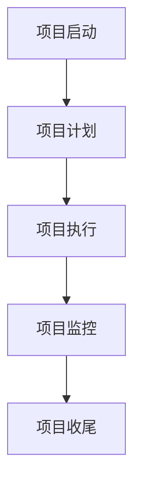

### 4.2 工作分解结构（WBS）

工作分解结构（WBS）是项目管理中常用的工具，用于将项目分解为更小、更具体的子任务。WBS有助于明确项目任务、分配责任和规划进度。以下是WBS的基本概念和步骤：

1. **项目分解：** 将项目范围分解为可管理的子任务。
2. **层级结构：** 将子任务组织成层级结构，每个层级代表项目的不同阶段或任务领域。
3. **责任分配：** 为每个子任务指定责任人。
4. **进度规划：** 根据WBS制定项目进度计划。

以下是一个简化的WBS示例：

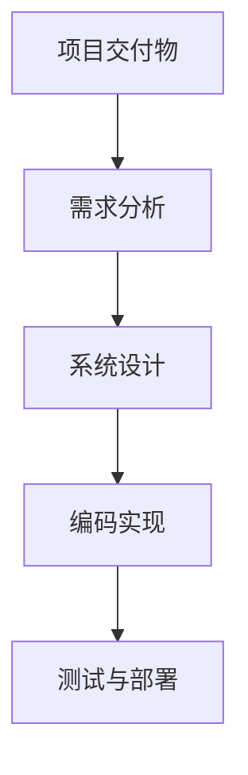

### 4.3 网络图（PERT图）

网络图（PERT图）是项目管理中用于展示任务之间依赖关系和确定项目关键路径的工具。PERT图可以帮助项目团队理解项目的整体流程和时间安排，从而更好地管理项目进度。以下是PERT图的基本概念和步骤：

1. **任务识别：** 识别项目中的所有任务。
2. **任务依赖关系：** 确定任务之间的依赖关系。
3. **路径分析：** 通过绘制网络图，分析任务之间的依赖关系和路径。
4. **关键路径确定：** 确定项目的关键路径，关键路径上的任务延迟将直接影响项目整体进度。

以下是一个简化的PERT图示例：

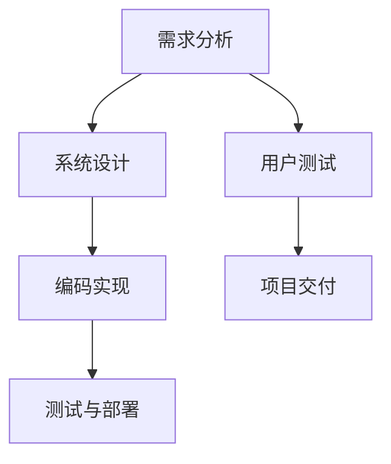

### 4.4 进度计划（Gantt图）

Gantt图是项目管理中常用的工具，用于展示项目进度和时间安排。Gantt图可以帮助项目团队清晰地了解项目的进度安排，从而更好地管理项目时间。以下是Gantt图的基本概念和步骤：

1. **任务列表：** 列出项目中的所有任务。
2. **时间安排：** 为每个任务分配开始和结束时间。
3. **资源分配：** 为每个任务分配所需的资源。
4. **进度展示：** 通过图表展示项目的进度和时间安排。

以下是一个简化的Gantt图示例：

```mermaid
+---------------+---------------+---------------+
|      任务1    |      任务2    |      任务3    |
+---------------+---------------+---------------+
|    2023/01/01 |    2023/01/05 |    2023/01/10 |
+---------------+---------------+---------------+
|    2023/01/06 |    2023/01/10 |    2023/01/15 |
+---------------+---------------+---------------+
|    2023/01/11 |    2023/01/15 |    2023/01/20 |
+---------------+---------------+---------------+
```

### 4.5 风险管理

风险管理是项目管理中重要的组成部分，它涉及到识别、评估和应对项目风险。以下是如何进行风险管理的步骤：

1. **风险识别：** 识别项目中的潜在风险。
2. **风险评估：** 评估风险的概率和影响。
3. **风险应对：** 制定应对策略，降低风险的影响。
4. **风险监控：** 监控风险的变化，及时调整应对策略。

以下是一个简化的风险管理流程：

```mermaid
graph TD
A[风险识别] --> B[风险评估]
B --> C[风险应对]
C --> D[风险监控]
```

### 5. 领导力与项目管理的整合

领导力与项目管理的整合是将领导力的理念和方法应用到项目管理的实践中，以提升项目的成功率。以下是如何将领导力与项目管理整合的步骤：

1. **明确项目目标：** 项目经理需要明确项目目标，并与团队成员达成共识。
2. **建立领导力框架：** 根据项目目标，建立适合项目的领导力框架，包括个人领导力、团队领导力和变革领导力。
3. **培养团队领导力：** 通过培训和指导，提升团队成员的领导力水平。
4. **激励团队成员：** 通过有效的激励措施，激发团队成员的积极性和创造力。
5. **监控项目进展：** 定期监控项目进展，及时调整领导力策略。

以下是一个简化的整合流程：

```mermaid
graph TD
A[明确项目目标] --> B[建立领导力框架]
B --> C[培养团队领导力]
C --> D[激励团队成员]
D --> E[监控项目进展]
```

### 6. 实战案例分析

以下是一个实际案例，展示了如何将领导力与项目管理整合，确保项目的成功执行。

**案例背景：**

某科技公司计划开发一款新的移动应用程序，项目团队由开发、测试和市场等部门组成。项目经理负责领导团队，确保项目按计划进行。

**案例过程：**

1. **明确项目目标：** 项目经理与团队成员共同制定了项目的目标，包括功能需求、时间表和预算。
2. **建立领导力框架：** 项目经理根据项目目标，建立了个人领导力、团队领导力和变革领导力的框架。
3. **培养团队领导力：** 项目经理通过培训和指导，提升了团队成员的领导力水平。
4. **激励团队成员：** 项目经理实施了激励机制，鼓励团队成员积极参与项目。
5. **监控项目进展：** 项目经理定期监控项目进展，及时发现和解决问题。

**案例结果：**

通过整合领导力与项目管理，项目团队高效协作，产品按期发布，市场反馈良好，项目取得了成功。

**案例启示：**

该案例展示了如何通过整合领导力与项目管理，实现项目的成功执行。明确的领导力框架、有效的团队领导和激励措施，以及及时的项目监控，都是项目成功的关键因素。

### 7. 领导力与项目管理未来发展趋势

随着技术的发展和市场竞争的加剧，领导力和项目管理也在不断演进。以下将探讨领导力与项目管理未来发展趋势。

**7.1 数字化领导力**

数字化领导力是指领导者如何运用数字技术来提高领导力和团队效率。未来，数字化领导力将成为领导者必备的能力。以下是一些关键趋势：

1. **数据驱动决策：** 领导者需要具备数据分析能力，能够从数据中找到趋势和问题。
2. **数字化工具应用：** 领导者需要熟悉并运用数字化工具，如项目管理软件、数据分析工具等。
3. **数字化团队管理：** 领导者需要掌握数字化团队管理方法，如远程协作、敏捷管理等。

**7.2 项目管理智能化**

随着人工智能和大数据技术的发展，项目管理也将变得更加智能化。未来，项目管理智能化将体现在以下几个方面：

1. **智能进度预测：** 利用人工智能技术，自动预测项目进度，提高项目管理的准确性。
2. **智能风险管理：** 利用大数据分析，自动识别和评估项目风险，提高风险管理的效率。
3. **智能资源优化：** 利用人工智能技术，自动优化项目资源分配，提高资源利用率。

**7.3 领导力与项目管理的整合**

未来，领导力与项目管理将更加紧密地整合。以下是一些关键趋势：

1. **跨职能领导力：** 领导者需要具备跨职能的领导能力，能够协调不同部门的工作。
2. **领导力培训：** 企业将更加重视领导力培训，提升领导者的综合能力。
3. **领导力评估：** 企业将建立领导力评估体系，定期评估领导者的绩效。

### 8. 附录

**8.1 领导力与项目管理相关工具介绍**

以下是常用的领导力与项目管理工具：

1. **项目管理工具：**
   - Microsoft Project
   - JIRA
   - Trello

2. **领导力发展工具：**
   - 自我评估工具（如MBTI、DISC等）
   - 360度反馈工具
   - 领导力发展计划（如领导力模型、领导力发展路径等）

**8.2 领导力与项目管理资源推荐**

以下是推荐的领导力与项目管理资源：

1. **书籍推荐：**
   - 《领导力的五项修炼》
   - 《项目管理知识体系指南》
   - 《敏捷项目管理实践指南》

2. **在线课程推荐：**
   - Coursera上的《领导力与团队管理》
   - Udemy上的《项目管理基础》

**8.3 参考文献与推荐阅读**

以下是本文引用的文献和推荐阅读：

1. **参考文献：**
   - 斯蒂芬·罗宾斯，《领导力的五项修炼》
   - 项目管理协会（PMI），《项目管理知识体系指南》
   - 杰瑞·威诺斯基，《敏捷项目管理实践指南》

2. **推荐阅读：**
   - 勒温，《变革的领导力》
   - 克里斯·阿尔斯特德，《数字化领导力》
   - 大卫·安德森，《项目管理新趋势》

## 总结

本文深入探讨了领导力与项目管理之间的紧密联系，以及如何将二者有效整合以确保项目成功执行。通过本文的学习，读者将能够：

1. **掌握领导力的基本概念和类型，学会如何提升个人领导力、团队领导力和变革领导力。**
2. **了解项目管理的五大过程组和十大知识领域，掌握项目管理工具和技术。**
3. **学会如何将领导力与项目管理相结合，提高项目的执行效率和质量。**
4. **通过案例分析，掌握实际操作中的关键技巧，提升项目管理的实战能力。**

希望本文能为读者在领导力和项目管理领域提供有价值的参考和指导。通过不断学习和实践，读者将能够在工作中更好地运用领导力和项目管理技能，实现个人和团队的目标。

---

**作者：** AI天才研究院/AI Genius Institute & 禅与计算机程序设计艺术 /Zen And The Art of Computer Programming

---

## 结论

本文系统地阐述了领导力与项目管理的核心概念、实践方法和整合策略。通过详细的分析和实例，我们理解了领导力在项目管理中的重要性，以及如何通过有效的领导力确保项目的成功执行。

**关键要点总结：**

1. **领导力的基本概念与类型**：个人领导力、团队领导力和变革领导力是项目管理成功的关键。
2. **项目管理的基础知识**：五大过程组和十大知识领域为项目提供了完整的框架。
3. **项目管理工具与技术的应用**：WBS、PERT图、Gantt图等工具为项目进度管理提供了有力支持。
4. **领导力与项目管理的整合**：通过明确的项目目标、有效的团队建设和创新管理策略，提升项目成功率。

**未来展望：**

随着技术的不断发展，数字化、自动化和智能化将深入影响领导力和项目管理。未来的领导者需要具备数据驱动决策、技术创新应用和跨职能领导力等能力。项目管理也将更加注重敏捷性、持续交付和数字化转型的实践。

**建议与鼓励：**

读者应积极学习和实践领导力和项目管理知识，通过不断的自我提升和团队协作，迎接未来挑战。希望本文能够为读者在领导力和项目管理领域的职业发展提供有价值的参考和指导。

---

**作者：** AI天才研究院/AI Genius Institute & 禅与计算机程序设计艺术 /Zen And The Art of Computer Programming

---

## 读者反馈

感谢读者对本篇文章的阅读和支持。我们非常重视您的意见和反馈，这有助于我们不断改进和优化文章内容。以下是几个可能的反馈问题：

1. **您认为本文最精彩的部分是什么？**
2. **您是否找到了自己在领导力和项目管理方面的改进点？**
3. **您是否有关于本文内容的疑问或需要进一步解释的地方？**
4. **您认为本文哪些部分可以改进或增加更多的细节？**
5. **您是否有任何其他建议或想法，以便我们更好地服务于您的需求？**

请随时分享您的反馈，我们将在下一篇文章中认真考虑并作出相应的调整。感谢您的宝贵时间和支持！**作者：** AI天才研究院/AI Genius Institute & 禅与计算机程序设计艺术 /Zen And The Art of Computer Programming

