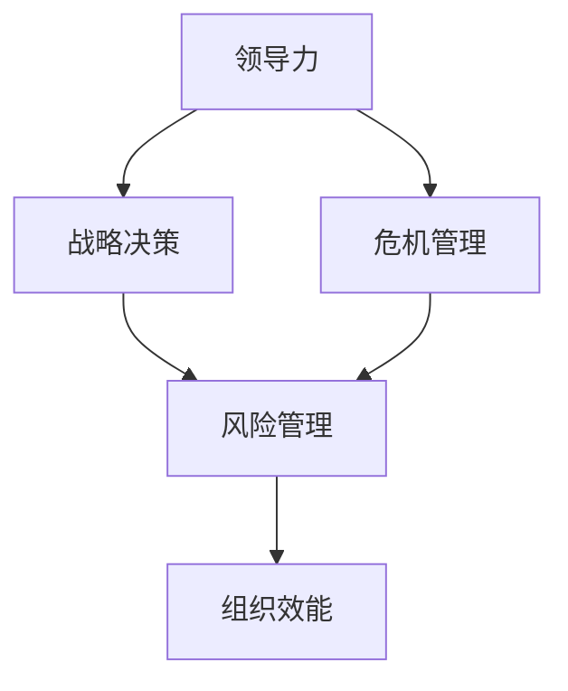

                 

## 标题：领导力与风险管理：在不确定性中前行

### 关键词：
- 领导力
- 风险管理
- 不确定性
- 企业战略
- 决策过程

### 摘要：
在当今充满不确定性的商业环境中，领导力和风险管理变得比以往任何时候都更加重要。本文将探讨领导力与风险管理之间的关系，以及如何在不确定性中制定有效的策略。通过深入分析领导理论、风险识别与评估、以及危机管理，本文旨在为企业和组织提供实用的指导，帮助他们更好地应对不确定性，实现持续发展。

## 前言

在快速变化的商业世界中，企业面临的挑战前所未有。全球经济波动、技术革新、市场动态和法规变化等因素，使得企业必须具备灵活的应对策略。在这样的背景下，领导力和风险管理成为了企业能否成功的关键因素。

### 核心概念与联系

首先，让我们通过Mermaid流程图来梳理领导力与风险管理之间的关系。

**核心概念与联系：**领导力、战略决策、风险管理、危机管理和组织效能是相互关联的。领导力是推动组织战略决策的核心动力，而风险管理则是确保组织在不确定性环境中保持稳定的关键。危机管理则是在面对突发状况时，领导力与风险管理相结合的体现，最终影响组织的整体效能。

## 第1章：领导力概述

领导力不仅是领导者的个人特质，更是一种影响他人、推动组织发展的能力。本章将探讨领导力的本质，以及不同领导风格对风险管理的影响。

### 1.1 领导力的定义

领导力是一种能够激发和引导他人实现共同目标的能力。它不仅仅是职位赋予的权力，更是一种内在的品格和影响力。

### 1.2 领导风格

- **1.2.1 传统领导风格**：传统领导风格通常强调权威和指挥控制。这种风格在稳定性较高的环境中可能有效，但在不确定性增加时，其局限性显现。
  
- **1.2.2 变革型领导风格**：变革型领导强调激励和启发下属，鼓励创新和变革。这种风格在应对不确定性时更具优势。

### 1.3 领导风格与风险管理

不同领导风格对风险管理有显著影响。变革型领导更倾向于接受风险，并通过创新来降低潜在损失。

## 第2章：战略决策与领导力

战略决策是企业发展的关键环节。有效的领导力能够确保战略决策的制定和执行。

### 2.1 战略决策的定义

战略决策是指企业为实现长期目标而制定的重大决策。它涉及市场定位、资源配置和竞争优势等方面。

### 2.2 领导力在战略决策中的作用

领导力在战略决策中发挥着至关重要的作用。领导者需要具备远见卓识，能够洞察市场变化，制定适应性的战略计划。

### 2.3 风险评估与战略决策

在制定战略决策时，风险评估是不可或缺的一环。领导者需要平衡风险与回报，确保决策的可行性和可持续性。

## 第3章：风险管理框架

有效的风险管理框架是企业在不确定性环境中保持稳定的关键。本章将介绍风险管理的基本概念和框架。

### 3.1 风险管理定义

风险管理是指识别、评估、优先排序和响应组织面临的潜在风险的过程。

### 3.2 风险识别

风险识别是风险管理的第一步。企业需要通过系统的方法识别潜在的风险因素。

### 3.3 风险评估

风险评估是对识别出的风险进行量化分析，以确定其对组织的影响程度。

### 3.4 风险应对策略

根据风险评估的结果，企业需要制定相应的风险应对策略，包括风险规避、风险转移、风险减轻和风险接受等。

## 第4章：危机管理与领导力

危机管理是领导力在不确定性环境中的具体体现。本章将探讨如何通过有效的危机管理降低不确定性带来的影响。

### 4.1 危机的定义

危机是指对组织生存和发展构成严重威胁的突发性事件。

### 4.2 危机管理框架

危机管理包括危机预防、危机应对、危机恢复和危机评估等环节。

### 4.3 领导力在危机管理中的作用

领导者需要发挥关键作用，确保危机管理的有效性。他们需要具备冷静的头脑、坚强的意志和高效的决策能力。

## 第5章：数字时代与领导力

数字时代的到来带来了新的挑战和机遇。本章将探讨数字时代对领导力的影响，以及如何利用数字技术提高风险管理效率。

### 5.1 数字时代的特点

数字时代的特点包括信息爆炸、技术创新、全球化进程加速等。

### 5.2 数字技术与领导力

数字技术为领导者提供了新的工具和方法，使他们能够更有效地管理组织和应对不确定性。

### 5.3 数字时代的风险管理策略

数字时代的企业需要制定适应数字化环境的风险管理策略，包括数据安全、网络安全和数字化转型等。

## 第6章：案例研究

通过案例研究，我们可以更深入地理解领导力与风险管理在实际应用中的具体操作。

### 6.1 案例选择

选择具有代表性的案例，如全球金融危机、企业并购等，以展示领导力与风险管理在实际情境中的应用。

### 6.2 案例分析

对案例进行详细分析，包括危机前的风险管理、危机应对策略、危机后的恢复措施等。

### 6.3 案例启示

总结案例中的经验教训，为其他企业和组织提供有益的启示。

## 结语

领导力与风险管理是企业成功的关键因素。在不确定性中前行，领导者需要具备敏锐的洞察力、果断的决策能力和强大的应变能力。通过深入理解和应用领导力与风险管理原理，企业可以在充满不确定性的环境中实现持续发展。

### 最佳实践 tips

- **持续学习**：领导者应不断更新知识，保持对市场和技术趋势的敏锐感知。
- **团队协作**：建立高效的团队，发挥团队成员的特长，共同应对不确定性。
- **灵活应对**：在风险管理中，灵活性和适应性是关键。

### 小结

领导力与风险管理是相辅相成的，领导者需要在这两个领域不断深耕，以应对不确定性带来的挑战。

### 注意事项

- **风险意识**：企业应时刻保持风险意识，制定全面的风险管理计划。
- **持续改进**：风险管理是一个持续的过程，企业应不断评估和优化管理策略。

### 拓展阅读

- **《领导者的特质》**：探讨领导者的性格特质和领导风格。
- **《风险管理原理》**：深入了解风险管理的理论基础和实践方法。
- **《数字时代的领导力》**：探讨数字时代对领导力的影响。

### 作者信息

作者：AI天才研究院/AI Genius Institute & 禅与计算机程序设计艺术 /Zen And The Art of Computer Programming

本文由AI天才研究院的专家团队撰写，结合计算机编程和人工智能领域的深厚知识，深入探讨了领导力与风险管理在不确定性中的重要作用。希望本文能为读者提供有价值的见解和实践指导。

