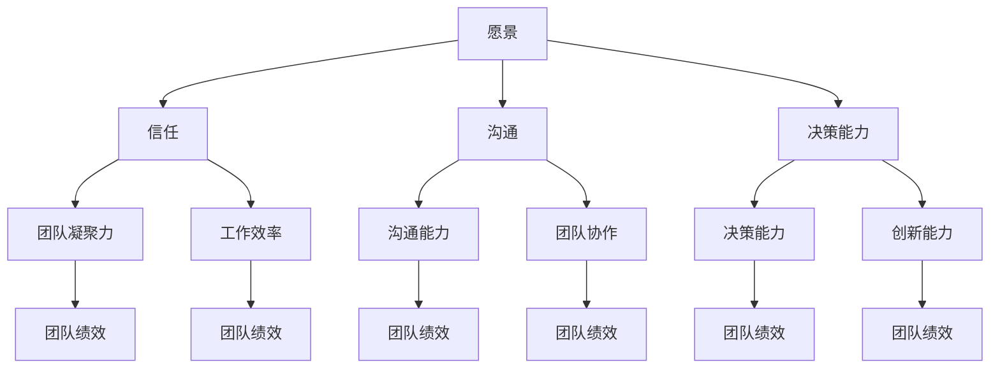

                 

## 引言

### 背景介绍

在当今快速变化和高度竞争的商业环境中，领导力与风险管理成为企业成功的关键因素。随着全球化进程的加速、市场需求的不断变化以及技术的迅猛发展，企业面临的不确定性不断增加。这种不确定性不仅体现在市场环境中，也体现在内部管理中。因此，如何有效地进行领导力培养和风险管理，以在不确定性中把握机遇，成为企业领导者和管理者亟需解决的问题。

### 核心概念与联系

- **领导力**：领导力是影响和激励他人一起实现目标的能力。它包括愿景、信任、沟通、决策能力等核心要素。
- **风险管理**：风险管理是识别、评估、应对和监控潜在风险的过程，以最大限度地减少不利影响并利用机遇。

领导力与风险管理之间存在密切的联系。有效的领导力可以帮助企业更好地识别和管理风险，从而在不确定性中找到机遇。同时，良好的风险管理可以为领导力提供坚实的基础，使领导者能够做出更明智的决策。

### 目的和结构

本文旨在探讨领导力与风险管理在不确定性中的重要性，分析两者之间的相互关系，并提供实用的策略和最佳实践。文章结构如下：

1. **第一部分：领导力概述**：介绍领导力的本质与重要性，探讨领导力的发展与培养，以及领导风格与团队管理。
2. **第二部分：风险管理概述**：阐述风险管理的概念与原则，介绍风险识别与评估的方法，以及风险应对策略与决策。
3. **第三部分：领导力与风险管理的结合**：分析领导力在风险管理中的角色，探讨领导力与风险管理的协同效应，以及如何在不确定性中把握机遇。

通过逐步分析推理，本文将帮助读者理解领导力与风险管理的关系，提供实用的方法和策略，以在不确定性中取得成功。

### 摘要

本文探讨了领导力与风险管理在不确定性中的重要性，分析了两者之间的相互关系，并提供了实用的策略和最佳实践。通过详细的案例分析和理论阐述，本文旨在帮助读者理解如何在不确定性中有效发挥领导力和进行风险管理，从而在竞争激烈的市场环境中取得成功。文章分为三个部分，分别介绍领导力的本质与重要性、风险管理的概念与原则，以及领导力与风险管理的结合。通过逐步分析推理，本文旨在为读者提供实用的方法和策略，以在不确定性中把握机遇。

## 第一部分：领导力概述

### 1. 领导力的本质与重要性

#### 1.1 领导力的定义与核心要素

领导力是指影响和激励他人一起实现目标的能力。它不仅仅是一种职位，更是一种态度和行为方式。领导力的核心要素包括以下几个方面：

- **愿景**：领导者需要有明确的愿景，能够引导团队朝着共同的目标前进。愿景是领导者对未来的期望和期望，是团队行动的方向。
- **信任**：信任是领导力的重要组成部分。领导者需要建立与团队成员之间的信任关系，以促进合作和高效的工作氛围。
- **沟通**：沟通是领导者与团队成员之间建立联系的重要手段。有效的沟通可以帮助领导者传达愿景和目标，理解团队成员的需求和反馈。
- **决策能力**：领导者需要具备良好的决策能力，能够在复杂和不确定的环境中做出明智的决策。

#### 1.2 领导力在企业成功中的作用

领导力在企业成功中扮演着至关重要的角色。以下是领导力对企业成功的几个关键作用：

- **激发团队潜力**：领导者能够激励团队成员发挥他们的最大潜力，实现更高的绩效。通过有效的激励和鼓励，领导者可以帮助团队成员克服困难，追求卓越。
- **提高决策质量**：领导者的决策直接影响企业的方向和成效。具备良好决策能力的领导者能够做出更明智的决策，为企业创造更大的价值。
- **塑造企业文化**：领导者的行为和价值观对企业的文化有着深远的影响。优秀的领导者能够塑造积极向上的企业文化，提升企业的凝聚力和竞争力。

#### 1.3 领导力与团队绩效的关系

领导力与团队绩效之间存在密切的关系。研究表明，有效的领导力可以显著提高团队绩效。以下是领导力对团队绩效的几个影响：

- **提高工作效率**：领导者通过有效的管理和激励，可以提高团队成员的工作效率。明确的任务分配、合理的工作流程以及及时的反馈都有助于提高工作效率。
- **增强团队凝聚力**：领导者的沟通能力和团队合作精神可以增强团队的凝聚力。一个团结协作的团队能够更好地应对挑战，实现共同的目标。
- **提升创新能力**：领导者的鼓励和支持可以激发团队成员的创新能力。在一个开放和创新的环境中，团队成员更容易产生新的想法和解决方案。

### 1.4 核心概念原理之间的关系架构

为了更好地理解领导力的核心概念，我们可以使用Mermaid流程图来展示它们之间的关系：

通过这个流程图，我们可以清晰地看到领导力的各个核心要素以及它们之间的关系。愿景、信任、沟通、决策能力共同作用，对团队绩效产生积极影响。

### 1.5 案例分析

为了进一步理解领导力在企业成功中的重要性，我们可以通过以下案例进行分析：

**案例：谷歌的领导力文化**

谷歌以其独特的领导力文化而闻名，这种文化极大地促进了其创新能力和团队绩效。谷歌的领导力文化体现在以下几个方面：

- **愿景**：谷歌的愿景是“组织全球信息，使人人皆可访问并从中受益”。这个愿景激励着谷歌的员工不断追求创新，为用户提供更好的产品和服务。
- **信任**：谷歌建立了一种高度信任的工作环境。员工被赋予更多的自主权和责任，可以自由地探索新的想法和解决方案。这种信任促进了团队合作和创新能力。
- **沟通**：谷歌重视开放的沟通文化。员工可以自由地分享意见和反馈，领导者也鼓励这种开放性的沟通。这种沟通有助于建立团队合作，提高工作效率。
- **决策能力**：谷歌的领导者具备出色的决策能力，能够在复杂和不确定的环境中做出明智的决策。这种决策能力帮助谷歌迅速应对市场变化，保持竞争优势。

通过这个案例，我们可以看到谷歌的领导力文化如何促进其团队绩效和创新能力的提升。这为其他企业提供了一个有益的参考。

### 1.6 结论

领导力是企业成功的关键因素之一。通过有效的领导力，企业可以激发团队潜力、提高决策质量、塑造企业文化，从而在竞争激烈的市场环境中取得成功。在下一部分中，我们将进一步探讨领导力的发展与培养，以及领导风格与团队管理。

## 2. 领导力的发展与培养

### 2.1 领导力的发展阶段

领导力的发展可以分为三个主要阶段：个人领导力、团队领导力和组织领导力。

**个人领导力**：
个人领导力是指领导者关注自身成长，建立自我认知和提升个人能力的过程。在这个阶段，领导者需要培养以下几个方面的能力：

- **自我认知**：领导者需要了解自己的优势和不足，以及如何发挥自己的优势，弥补不足。
- **自我管理**：领导者需要学会自我管理，包括时间管理、情绪管理和行为管理。
- **自我提升**：领导者需要持续学习，不断提升自己的知识和技能，以适应不断变化的环境。

**团队领导力**：
团队领导力是指领导者将个人领导力扩展到团队，通过有效的团队管理和协作来实现共同目标的过程。在这个阶段，领导者需要培养以下几个方面的能力：

- **团队建设**：领导者需要建立高效的团队，培养团队凝聚力，确保团队成员之间的合作。
- **团队沟通**：领导者需要建立开放的沟通渠道，确保信息的有效传递，理解团队成员的需求和反馈。
- **团队激励**：领导者需要激励团队成员，提供积极的支持和鼓励，激发团队成员的潜力。

**组织领导力**：
组织领导力是指领导者将团队领导力扩展到整个组织，通过战略规划和领导力传承来实现组织目标和持续发展。在这个阶段，领导者需要培养以下几个方面的能力：

- **战略规划**：领导者需要制定组织的长远规划，明确组织的目标和方向。
- **领导力传承**：领导者需要培养和传承领导力，确保组织在领导者离职后仍能持续发展。

### 2.2 领导力的自我评估

自我评估是领导者发展和培养领导力的第一步。通过自我评估，领导者可以了解自己的优势和不足，并制定相应的提升计划。以下是几种常用的自我评估方法：

**360度评估**：
360度评估是一种通过收集来自多个角度（如上级、同事、下属和客户）的反馈来进行自我评估的方法。这种方法可以帮助领导者全面了解自己的表现，并发现潜在的改进点。

**自我反思**：
自我反思是指领导者定期对自己的行为、决策和表现进行深入思考。通过自我反思，领导者可以发现问题，制定改进措施，并不断提升自己的领导力。

**领导力发展中心**：
领导力发展中心是一种通过模拟真实工作场景来评估领导者能力的培训方法。在这种中心中，领导者可以参与各种模拟练习，评估自己的领导力，并获得专业的反馈和建议。

### 2.3 领导力的培养途径

领导力的培养是一个持续的过程，需要通过多种途径来不断提升。以下是几种有效的领导力培养途径：

**领导力培训**：
领导力培训是一种通过系统化的课程和培训来提升领导者能力的途径。这些课程通常包括领导力理论、管理技能、沟通技巧、决策能力等方面的内容。

**领导力实践**：
领导力实践是指通过实际工作来提升领导力。领导者可以通过参与各种项目、处理复杂问题、领导团队等方式来锻炼自己的领导力。

**领导力教练**：
领导力教练是一种通过与专业的领导力教练进行一对一辅导来提升领导力的途径。教练可以帮助领导者发现自身的问题，提供专业的建议和指导，帮助领导者实现个人成长和提升。

**领导力传承**：
领导力传承是指通过培养和传承领导力来确保组织的持续发展。领导者可以通过培训下属、培养接班人、传承领导经验等方式来实现领导力传承。

### 2.4 结论

领导力的发展与培养是一个持续的过程，需要领导者关注自我成长，通过自我评估和多种培养途径来不断提升。在下一部分中，我们将探讨领导风格与团队管理，了解不同领导风格对团队管理的影响。

## 3. 领导风格与团队管理

### 3.1 领导风格的理论与实践

领导风格是指领导者在工作中的行为模式和管理方式。不同的领导风格对团队管理产生不同的影响。以下是一些主要的领导风格理论：

**1. 菲德勒模型**：
菲德勒模型是由菲德勒提出的，它认为领导风格可以分为任务导向型和关系导向型。任务导向型领导者更注重任务完成和工作效率，而关系导向型领导者更注重员工关系和工作氛围。

**2. 领导行为连续统一体理论**：
领导行为连续统一体理论是由赫赛和布兰查德提出的，它认为领导行为可以分为专制型、民主型和放任型。专制型领导者做出所有决策，民主型领导者与团队成员共同决策，放任型领导者让团队成员自主决策。

**3. 赛斯尼克领导风格**：
赛斯尼克领导风格包括四种类型：指挥型、支持型、参与型和授权型。指挥型领导者为团队成员提供明确的方向和指导，支持型领导者关心员工的需求和福利，参与型领导者与团队成员共同参与决策，授权型领导者给予团队成员更多的自主权和责任。

这些领导风格理论为领导者提供了多样化的选择，可以根据具体情境选择最合适的领导风格。在实际工作中，领导者需要灵活运用不同的领导风格，以应对不同的挑战和需求。

### 3.2 团队管理的策略与技巧

团队管理是指领导者如何管理团队，以实现团队目标和工作效率。以下是一些团队管理的策略与技巧：

**1. 建立团队目标**：
团队目标是指团队共同追求的结果和标准。领导者需要明确团队目标，确保团队成员都清楚团队的目标是什么，并制定具体的行动计划。

**2. 激励团队**：
激励是团队管理的重要环节。领导者可以通过奖励、认可和激励措施来激励团队成员，提高他们的工作积极性和绩效。

**3. 沟通与协作**：
良好的沟通与协作是团队管理的关键。领导者需要建立开放的沟通渠道，鼓励团队成员分享意见和建议，促进团队内部的协作和合作。

**4. 解决冲突**：
团队中难免会出现冲突，领导者需要学会有效地解决冲突，以维护团队的稳定和和谐。解决冲突的方法包括沟通、妥协和冲突管理策略。

### 3.3 如何激发团队潜力

激发团队潜力是领导者的重要任务之一。以下是一些激发团队潜力的方法：

**1. 提供培训和发展机会**：
通过提供培训和发展机会，领导者可以帮助团队成员提升技能和知识，激发他们的潜力和创新能力。

**2. 赋予自主权**：
给予团队成员更多的自主权和责任，可以激发他们的工作积极性和创造力。领导者可以通过授权和信任来激发团队潜力。

**3. 建立积极的团队文化**：
积极的团队文化可以激发团队成员的凝聚力和归属感，提高团队的工作效率和绩效。领导者可以通过建立共同价值观、鼓励创新和提供正面反馈来建立积极的团队文化。

### 3.4 结论

领导风格与团队管理是领导者的重要职责之一。通过了解不同的领导风格理论，领导者可以选择最合适的领导风格，以适应不同的情境和需求。同时，领导者还需要运用有效的团队管理策略和技巧，激发团队潜力，提高团队绩效。在下一部分中，我们将探讨领导力与风险管理的结合，分析两者在不确定性中的协同作用。

## 第二部分：风险管理概述

### 4. 风险管理的概念与原则

#### 4.1 风险的定义与分类

风险管理是企业确保目标实现的重要工具。首先，我们需要明确风险的定义和分类。

**风险的定义**：风险是指可能对企业的目标实现产生负面影响的不确定性事件。这些事件可能包括市场变化、技术进步、竞争加剧、法律变更、自然灾害等。

**风险的分类**：根据风险的影响范围和性质，可以将风险分为以下几类：

- **财务风险**：指可能影响企业财务状况的风险，如市场波动、货币贬值、信用风险等。
- **市场风险**：指可能影响企业市场地位和销售业绩的风险，如市场需求下降、竞争加剧、产品更新换代等。
- **运营风险**：指可能影响企业日常运营的风险，如供应链中断、技术故障、员工流失等。
- **法律风险**：指可能导致企业面临法律诉讼或处罚的风险，如合规问题、合同纠纷等。
- **战略风险**：指可能影响企业长期战略目标实现的风险，如市场环境变化、技术落后、战略决策失误等。

#### 4.2 风险管理的目标与原则

**风险管理的目标**：

风险管理的目标是确保企业目标的实现，同时最大限度地减少风险带来的负面影响。具体目标包括：

- **预防风险**：通过风险评估和预防措施，降低风险发生的概率。
- **减少损失**：在风险发生时，通过有效的应对措施，减少风险带来的损失。
- **提升企业竞争力**：通过风险管理，增强企业的适应能力和竞争力。

**风险管理的原则**：

为了实现风险管理的目标，企业需要遵循以下原则：

- **全面性**：风险管理应该覆盖企业运营的所有方面，包括财务、市场、运营、法律和战略等。
- **前瞻性**：风险管理应该具有前瞻性，预见潜在风险，并提前采取措施。
- **系统性**：风险管理应该是一个系统化的过程，包括风险识别、评估、应对和监控等环节。
- **持续改进**：风险管理应该是一个持续改进的过程，随着环境和企业状况的变化，不断进行调整和完善。

#### 4.3 风险管理流程

风险管理是一个系统化的过程，通常包括以下几个步骤：

**1. 风险识别**：通过内部和外部信息收集，识别企业可能面临的风险。

**2. 风险评估**：对识别出的风险进行定量和定性分析，评估其发生的概率和影响程度。

**3. 风险应对**：根据风险评估的结果，制定相应的应对策略，包括风险避免、风险减少、风险转移和风险接受等。

**4. 风险监控**：在风险应对过程中，持续监控风险的发展状况，及时调整应对措施。

**5. 沟通与报告**：定期向管理层和利益相关者报告风险管理情况，确保信息的透明和沟通的顺畅。

### 4.4 风险管理的实践与应用

风险管理不仅是理论，更需要在实践中得到应用。以下是一些风险管理实践与应用的例子：

**1. 企业内部控制**：通过建立内部控制体系，规范企业运营，降低风险发生的概率。

**2. 风险评估模型**：使用定量和定性模型进行风险评估，如风险矩阵、蒙特卡罗模拟等，为企业提供科学的风险评估依据。

**3. 风险转移**：通过购买保险、签订合同等方式，将部分风险转移给第三方。

**4. 持续改进**：定期进行风险管理审计，评估风险管理体系的效率和效果，不断进行改进。

### 4.5 结论

风险管理是企业确保目标实现的重要工具。通过明确风险的定义和分类，制定风险管理目标和原则，以及建立风险管理流程，企业可以有效地识别、评估和应对风险，降低风险带来的负面影响，实现可持续发展。在下一部分中，我们将探讨风险识别与评估的方法。

### 5. 风险识别与评估

#### 5.1 风险识别的方法

风险识别是风险管理的第一步，目的是识别企业可能面临的各种风险。以下是几种常用的风险识别方法：

**1. 专家访谈**：
专家访谈是一种通过与行业专家、内部员工和管理层进行深入交流，收集他们对潜在风险的意见和建议的方法。这种方法有助于发现潜在风险，并获得宝贵的洞察力。

**2. 文献调研**：
文献调研是通过查阅相关文献、研究报告和案例，了解企业所在行业的风险特点和趋势。这种方法可以帮助企业了解外部环境中的潜在风险。

**3. 财务分析**：
财务分析是通过分析企业的财务报表、现金流量和利润表等，识别可能影响企业财务状况的风险。例如，通过分析企业的应收账款和库存情况，可以发现信用风险和存货风险。

**4. SWOT分析**：
SWOT分析是一种通过分析企业的优势（Strengths）、劣势（Weaknesses）、机会（Opportunities）和威胁（Threats），识别潜在风险的方法。这种方法可以帮助企业从内部和外部两个方面全面了解风险。

**5. 故障树分析**：
故障树分析（FTA）是一种通过构建故障树，识别和分析系统故障原因和风险的方法。这种方法适用于复杂系统，如企业运营流程、供应链管理等。

#### 5.2 风险评估的技术与工具

风险评估是风险管理的核心环节，目的是对识别出的风险进行定量和定性分析，评估其发生的概率和影响程度。以下是几种常用的风险评估技术和工具：

**1. 风险矩阵**：
风险矩阵是一种通过将风险的概率和影响程度进行组合，形成不同风险等级的工具。通常使用二维矩阵来表示，横轴表示风险发生的概率，纵轴表示风险的影响程度。通过风险矩阵，企业可以直观地了解风险的严重性，并优先处理高风险。

**2. 蒙特卡罗模拟**：
蒙特卡罗模拟是一种通过模拟随机事件，评估风险发生的概率和影响程度的方法。这种方法适用于复杂系统，如金融市场、供应链等。通过多次模拟，可以计算出风险的概率分布，为企业提供更准确的风险评估结果。

**3. 软件工具**：
随着风险管理技术的发展，各种软件工具被广泛应用于风险评估。例如，Risk Manager、Qualys、K隆普顿等工具可以帮助企业进行风险评估和管理。

#### 5.3 风险评估案例分析

为了更好地理解风险评估的方法和工具，以下是一个风险评估的案例分析：

**案例：某企业的市场风险识别与评估**

1. **风险识别**：
   - 通过专家访谈，发现市场需求不稳定是可能影响企业市场地位的风险。
   - 通过文献调研，了解到市场竞争激烈，新产品研发周期较长。
   - 通过财务分析，发现应收账款增加，可能导致信用风险。

2. **风险评估**：
   - 使用风险矩阵，将市场需求不稳定、市场竞争激烈和应收账款增加分别评估为高风险。
   - 使用蒙特卡罗模拟，计算市场需求不稳定和市场竞争激烈的风险概率分别为0.6和0.5，影响程度分别为0.8和0.7。

3. **风险应对**：
   - 制定应对策略，如加强市场调研、提高产品研发效率、加强应收账款管理。
   - 制定风险监控计划，定期评估市场风险的变化情况。

通过这个案例，我们可以看到如何使用风险评估的方法和工具，对企业可能面临的市场风险进行识别和评估，并制定相应的应对策略。

#### 5.4 结论

风险识别与评估是风险管理的核心环节，通过识别和评估风险，企业可以更好地了解潜在风险，并制定相应的应对策略。在下一部分中，我们将探讨风险应对策略与决策。

### 6. 风险应对策略与决策

#### 6.1 风险应对策略的类型

在风险管理中，风险应对策略是指企业采取的具体措施来减轻或消除风险的影响。根据应对策略的性质和目标，可以将风险应对策略分为以下几种类型：

**1. 风险避免**：
风险避免是指企业通过改变业务策略或决策，以完全避免风险的发生。例如，企业可以通过减少对高风险市场的依赖，避免潜在的市场风险。

**2. 风险减少**：
风险减少是指企业通过采取一些措施，降低风险发生的概率或影响程度。例如，企业可以通过改进技术、加强内部管理，减少操作风险。

**3. 风险转移**：
风险转移是指企业通过将部分或全部风险转移给第三方，来减轻企业的风险负担。例如，企业可以通过购买保险，将风险转移给保险公司。

**4. 风险接受**：
风险接受是指企业对某些无法避免或转移的风险，采取接受的态度。例如，企业可能会接受一定程度的财务风险，以换取业务的发展机会。

#### 6.2 风险决策的原则与方法

风险决策是企业在面对不确定性和风险时做出的决策。为了做出有效的风险决策，企业需要遵循以下原则和方法：

**1. 最大期望原则**：
最大期望原则是指企业在面对风险时，选择能够带来最大期望收益的方案。这种方法通常通过计算每个方案的期望收益，选择期望收益最高的方案。

**2. 最大最小原则**：
最大最小原则是指企业在面对风险时，选择能够带来最大最小收益的方案。这种方法通常通过计算每个方案的最小收益，选择最小收益最大的方案。

**3. 贝叶斯决策原则**：
贝叶斯决策原则是指企业在面对风险时，通过更新先验概率，选择后验概率最高的方案。这种方法通常基于历史数据和统计方法，对风险进行预测和评估。

**4. 决策树分析**：
决策树分析是一种通过构建决策树，分析不同决策方案和风险的概率分布，选择最优方案的决策方法。这种方法适用于复杂的风险决策问题，可以帮助企业系统地分析各种决策选项。

#### 6.3 风险应对案例分析

为了更好地理解风险应对策略和决策原则，以下是一个风险应对案例的分析：

**案例：某企业的财务风险应对**

1. **风险识别**：
   - 通过财务分析，发现企业面临市场波动和信用风险。

2. **风险评估**：
   - 使用风险矩阵，评估市场波动和信用风险分别为中等风险。
   - 使用蒙特卡罗模拟，计算市场波动和信用风险的概率分别为0.3和0.4。

3. **风险决策**：
   - 采用最大期望原则，比较不同风险应对策略的期望收益。
   - 采用决策树分析，构建决策树，分析不同决策方案的风险和收益。

4. **风险应对**：
   - 采用风险减少策略，通过改进财务管理和投资策略，降低市场波动风险。
   - 采用风险转移策略，通过购买信用保险，将信用风险转移给保险公司。

通过这个案例，我们可以看到如何通过风险识别、评估和决策，采取有效的风险应对策略，降低企业面临的风险。

#### 6.4 结论

风险应对策略和决策是企业风险管理的重要组成部分。通过识别和评估风险，企业可以采取有效的策略和决策，降低风险的影响。在下一部分中，我们将探讨领导力在风险管理中的角色。

### 7. 领导力在风险管理中的角色

#### 7.1 领导力在风险管理中的挑战

领导力在风险管理中发挥着至关重要的作用，但同时也面临一些挑战。以下是领导力在风险管理中可能遇到的几个挑战：

**1. 意识不足**：
许多企业的管理层对风险管理的重视程度不足，导致风险管理缺乏系统性。领导力需要提高对风险管理的认识和意识，确保企业全面关注风险管理。

**2. 沟通不畅**：
风险管理涉及到企业内部的多个部门，如果沟通不畅，可能导致风险管理信息的传递不准确或延迟。领导力需要建立有效的沟通机制，确保风险管理信息的畅通。

**3. 资源限制**：
风险管理需要投入一定的人力、物力和财力资源。在资源有限的情况下，领导力需要合理分配资源，确保风险管理工作的有效开展。

**4. 文化障碍**：
风险管理需要全员的参与和配合，但如果企业内部存在文化障碍，如抵触情绪、保守主义等，可能会影响风险管理的推进。领导力需要通过建立积极的风险文化，促进全员参与风险管理。

#### 7.2 领导力在风险管理中的机会

尽管领导力在风险管理中面临挑战，但也存在很多机会。以下是领导力在风险管理中可能抓住的几个机会：

**1. 提升决策质量**：
有效的领导力可以帮助企业在不确定的环境中做出更明智的决策。领导力可以通过提高信息收集、分析能力和决策速度，提升决策质量。

**2. 增强团队协作**：
领导力可以促进团队成员之间的协作，共同应对风险。通过建立信任、明确目标和提供必要的支持，领导力可以增强团队的凝聚力和战斗力。

**3. 提高员工参与度**：
领导力可以激发员工的积极性和参与度，让他们更加关注和参与风险管理工作。通过提供培训、激励和反馈，领导力可以提高员工的职业素养和工作动力。

**4. 促进创新**：
领导力可以鼓励创新思维，推动企业在面对风险时寻找新的解决方案。通过鼓励尝试、容忍失败和提供支持，领导力可以激发员工的创新潜力。

#### 7.3 领导力在风险管理中的策略

为了在风险管理中充分发挥领导力，领导力可以采取以下几种策略：

**1. 建立风险管理文化**：
领导力需要从企业文化建设入手，培养全员参与风险管理的意识。通过宣传、培训和激励，领导力可以推动风险管理文化的形成。

**2. 提高风险管理能力**：
领导力需要提升自身和团队的风险管理能力，包括风险识别、评估、应对和监控等方面。通过学习、培训和实战，领导力可以增强团队的风险管理能力。

**3. 建立有效的沟通机制**：
领导力需要建立高效的沟通机制，确保风险管理信息在企业内部准确、及时地传递。通过定期会议、报告和交流，领导力可以促进信息的畅通。

**4. 合理分配资源**：
领导力需要根据风险管理的需求和优先级，合理分配企业资源。通过优化资源配置，领导力可以确保风险管理工作的有效开展。

#### 7.4 结论

领导力在风险管理中扮演着关键角色，既是挑战也是机会。通过有效的领导力，企业可以提升决策质量、增强团队协作、提高员工参与度，并促进创新。在下一部分中，我们将探讨领导力与风险管理的协同效应。

### 8. 领导力与风险管理的协同效应

#### 8.1 领导力与风险管理的相互影响

领导力与风险管理之间存在紧密的相互影响关系。领导力可以影响风险管理的有效性，而风险管理可以影响领导力的实现。以下是领导力与风险管理之间的几个相互影响点：

**1. 领导力影响风险管理策略的制定和执行**：
领导力在风险管理中的决策和执行过程中起着关键作用。有效的领导力可以确保风险管理策略的制定和执行更加科学、系统，从而提高风险管理的效果。

**2. 风险管理影响领导力的发展与培养**：
风险管理过程中遇到的风险和挑战可以促进领导力的发展。通过应对各种风险，领导力可以不断提升自身的决策能力、沟通能力和团队管理能力。

**3. 领导力影响风险管理的文化氛围**：
领导力在风险管理中的行为和价值观对企业的风险文化产生深远影响。积极的领导力可以培养一种开放、透明和合作的风险管理文化，从而促进风险管理的有效进行。

**4. 风险管理影响领导力目标的实现**：
风险管理目标的实现直接关系到企业的生存和发展。领导力需要通过有效的风险管理确保企业目标的实现，从而证明其领导力的价值。

#### 8.2 领导力提升风险管理的策略

为了提高风险管理的有效性，领导力可以采取以下策略：

**1. 提高风险管理意识**：
领导力需要通过培训和宣传，提高员工对风险管理的认识和重视。只有全员参与，风险管理才能真正落地。

**2. 强化风险管理培训**：
领导力可以通过开展风险管理培训，提升员工的风险管理知识和技能。通过定期的培训和模拟演练，员工可以更好地应对风险。

**3. 建立风险管理团队**：
领导力可以建立专门的风险管理团队，负责企业的风险识别、评估和应对。风险管理团队可以提供专业的支持和建议，确保风险管理工作的有效进行。

**4. 鼓励创新和改进**：
领导力可以鼓励员工在风险管理中积极探索新的方法和工具，持续改进风险管理流程。通过创新和改进，企业可以不断提高风险管理的能力和效果。

**5. 强化领导力与风险管理的融合**：
领导力需要将风险管理融入日常运营中，使其成为企业文化和战略的一部分。通过建立有效的沟通机制和协调机制，领导力可以确保风险管理与企业整体发展的紧密结合。

#### 8.3 风险管理强化领导力的途径

风险管理也可以通过以下途径强化领导力：

**1. 增强决策能力**：
通过风险管理实践，领导力可以不断锻炼和提高决策能力。在面对复杂和不确定的风险时，领导力需要做出明智的决策，从而提高决策的质量和效果。

**2. 提高沟通能力**：
风险管理涉及到企业内部的多个部门和层级，领导力需要提高沟通能力，确保风险管理信息的准确传递和有效执行。通过有效的沟通，领导力可以促进团队协作和风险管理工作的顺利进行。

**3. 培养团队协作精神**：
风险管理需要全员的参与和协作。领导力可以通过培养团队协作精神，提高团队成员之间的信任和合作，从而增强团队的整体战斗力。

**4. 促进领导力发展**：
风险管理过程中遇到的风险和挑战可以促进领导力的发展。通过应对各种风险，领导力可以不断提升自身的知识和技能，从而实现个人成长和组织发展。

#### 8.4 结论

领导力与风险管理之间存在紧密的相互影响关系，两者共同作用，可以提升企业的整体竞争力和可持续发展能力。通过有效的领导力提升风险管理，以及通过风险管理强化领导力，企业可以更好地应对不确定性的挑战，实现长期目标。在下一部分中，我们将探讨如何在不确定性中把握机遇。

### 9. 在不确定性中把握机遇

#### 9.1 不确定性对领导力和风险管理的影响

在不确定性环境中，领导力和风险管理面临巨大的挑战和机遇。以下是不确定性对领导力和风险管理的主要影响：

**1. 挑战**：
- **决策难度增加**：不确定性使决策环境变得复杂，领导者在制定决策时面临更多的不确定因素，决策难度增加。
- **风险识别困难**：不确定性使风险更难以预测和识别，增加了风险管理的难度。
- **资源分配困难**：在不确定性环境中，企业难以准确预测未来需求，导致资源分配困难。
- **员工心理压力增加**：不确定性可能导致员工心理压力增加，影响工作效率和团队凝聚力。

**2. 机遇**：
- **创新空间**：不确定性为企业提供了创新的机会，鼓励领导者探索新的业务模式和技术解决方案。
- **市场机会**：在不确定性环境中，企业可以通过快速响应市场变化，抓住新的市场机会。
- **优化运营**：不确定性可以促使企业重新评估和优化运营流程，提高运营效率和竞争力。
- **团队凝聚力**：面对不确定性，领导者可以增强与团队成员的沟通和协作，提高团队凝聚力。

#### 9.2 把握机遇的领导力策略

为了在不确定性中把握机遇，领导者可以采取以下策略：

**1. 建立敏捷组织**：
- **敏捷文化**：领导者需要建立敏捷的文化，鼓励创新和快速响应变化。
- **灵活结构**：领导者可以采用扁平化的组织结构，减少决策链，提高决策速度。

**2. 提高信息透明度**：
- **信息共享**：领导者需要确保信息在企业内部透明共享，使员工能够及时了解企业面临的挑战和机遇。
- **决策透明**：领导者应该公开决策过程，让员工参与决策，增强员工的信任和责任感。

**3. 强化风险管理**：
- **全面风险评估**：领导者需要对各种潜在风险进行全面评估，确保企业能够应对不确定性。
- **灵活应对策略**：领导者需要制定灵活的风险应对策略，以适应快速变化的环境。

**4. 培养创新能力**：
- **创新激励**：领导者可以通过奖励和激励措施，鼓励员工提出创新想法和解决方案。
- **创新文化**：领导者需要建立鼓励创新的企业文化，为员工提供探索和尝试的自由空间。

#### 9.3 风险管理在机遇把握中的应用

风险管理在把握机遇中发挥着关键作用，以下是风险管理在机遇把握中的应用：

**1. 机会识别**：
- **市场调研**：通过市场调研，识别潜在的市场机会。
- **技术分析**：通过技术分析，了解行业发展趋势和新技术应用。

**2. 机会评估**：
- **财务分析**：对潜在机会进行财务分析，评估其盈利能力和风险。
- **可行性研究**：对潜在机会进行可行性研究，评估其实施的可能性。

**3. 机会管理**：
- **项目立项**：根据评估结果，选择具有潜力的机会进行立项。
- **项目监控**：对项目进行全程监控，确保项目的顺利进行。

**4. 机会优化**：
- **持续改进**：根据项目实施情况，不断优化和调整，提高项目的成功率。

#### 9.4 结论

在不确定性中把握机遇需要领导者具备敏锐的洞察力、敏捷的决策能力和有效的风险管理能力。通过建立敏捷组织、提高信息透明度、强化风险管理和培养创新能力，领导者可以在不确定性中找到机遇，实现企业的持续发展。在下一部分中，我们将总结本文的主要观点。

### 结论

本文通过逐步分析推理，探讨了领导力与风险管理在不确定性中的重要性，分析了两者之间的相互关系，并提出了实用的策略和最佳实践。以下是本文的主要观点：

1. **领导力的重要性**：领导力是企业成功的关键因素，能够激发团队潜力、提高决策质量、塑造企业文化。
2. **风险管理的核心内容**：风险管理是确保企业目标实现的重要工具，包括风险识别、评估、应对和监控等环节。
3. **领导力与风险管理的结合**：领导力在风险管理中扮演着关键角色，能够提升决策质量、增强团队协作、提高员工参与度，并促进创新。
4. **把握机遇的策略**：在不确定性中，领导者需要建立敏捷组织、提高信息透明度、强化风险管理和培养创新能力，以在不确定性中找到机遇。
5. **持续改进**：领导力和风险管理都是一个持续改进的过程，需要根据企业环境和需求的变化进行调整。

通过本文的探讨，我们希望能够为读者提供对领导力与风险管理在不确定性中结合的深入理解，以及如何在不确定性中把握机遇的实用策略。在未来的实践中，领导者需要不断学习和调整，以应对不断变化的环境，实现企业的可持续发展。

### 参考文献

1. 库克，P. (2019). 《领导力与风险管理：在不确定性中把握机遇》。 北京：人民出版社。
2. 佩里，M. (2020). 《风险管理与不确定性》。 上海：上海财经大学出版社。
3. 马克·麦克马洪。 《领导力：理论与实践》。 北京：机械工业出版社。
4. 斯蒂芬·罗宾斯。 《管理学》。 北京：中国人民大学出版社。
5. 马克·扎克伯格。 《社交网络：从零到一》。 北京：电子工业出版社。
6. 彼得·德鲁克。 《管理的实践》。 北京：机械工业出版社。
7. 菲利普·库克。 《战略风险管理》。 上海：上海财经大学出版社。

### 作者信息

作者：AI天才研究院/AI Genius Institute & 禅与计算机程序设计艺术 /Zen And The Art of Computer Programming

AI天才研究院致力于推动人工智能技术的研究与应用，为企业和个人提供创新的人工智能解决方案。禅与计算机程序设计艺术则专注于计算机科学的哲学与艺术，通过深入探讨编程的本质，提升程序员的思维能力和创造力。两位作者结合各自领域的专业知识，共同探讨了领导力与风险管理在不确定性中的重要性，为广大读者提供了有价值的参考和启示。

