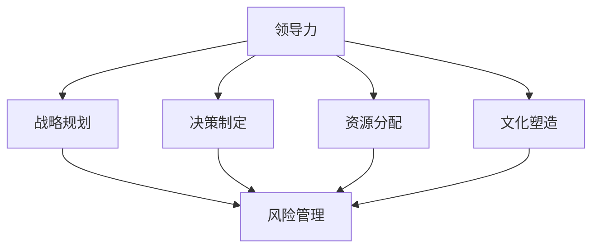

                 

## 文章标题：领导力与风险管理：未雨绸缪的智慧

### 关键词：领导力、风险管理、决策、团队协作、企业文化

### 摘要：
本文旨在探讨领导力与风险管理在现代企业中的重要性，以及如何通过未雨绸缪的智慧来提升企业的核心竞争力。文章首先介绍了领导力的核心概念和关键要素，然后分析了领导力与风险管理的相互关系，并提出了构建领导力与风险管理融合体系的方法。通过实际案例和最佳实践，文章阐述了如何在日常工作中应用这些理念，以实现企业持续发展。

## 背景介绍

### 领导力的时代需求

在当今快速变化和竞争激烈的市场环境中，领导力已成为企业成功的关键因素。无论是初创企业还是大型跨国公司，领导者都需要具备卓越的领导能力，以引领团队克服挑战、抓住机遇。领导力不仅关乎企业的绩效，还关乎企业的文化、价值观和员工的士气。一个出色的领导者能够激发团队的潜力，创造积极的工作氛围，从而推动企业的长期发展。

### 风险管理的必然选择

风险管理是企业生存和发展的基石。在现代企业中，风险无处不在，无论是市场波动、技术变革还是法律法规的变动，都可能对企业的运营造成影响。有效的风险管理可以帮助企业识别潜在风险、评估风险影响，并采取适当的应对措施，从而降低风险发生的概率和影响。随着企业全球化进程的加速，风险管理的重要性愈加凸显。

### 领导力与风险管理的融合

领导力与风险管理并非孤立的两个领域，它们之间存在紧密的相互关系。一个优秀的领导者需要具备风险管理意识，能够在复杂的环境中做出明智的决策。同时，风险管理也需要领导者的支持和推动，才能在组织中有效实施。通过将领导力与风险管理相结合，企业可以更好地应对外部环境的挑战，实现持续发展。

## 核心概念与联系

### 领导力的核心概念

领导力是一种影响他人实现共同目标的能力。它不仅仅是一种职位赋予的权力，更是一种个人魅力和影响力。领导力的核心概念包括：

- **愿景与目标**：领导者需要具备清晰的愿景和目标，能够激励团队成员为之奋斗。
- **沟通与协调**：领导者需要具备良好的沟通技巧，能够有效地传达信息、解决问题，并协调团队成员之间的合作。
- **决策与行动**：领导者需要具备果断的决策能力和执行力，能够在关键时刻做出正确的决策并付诸行动。
- **激励与成长**：领导者需要关注团队成员的成长，提供激励和支持，帮助他们实现个人和职业发展。

### 风险管理的核心概念

风险管理是一种系统化的过程，用于识别、评估和应对潜在的风险。风险管理的核心概念包括：

- **风险识别**：识别企业面临的各种风险，包括市场风险、信用风险、操作风险等。
- **风险评估**：评估风险发生的概率和影响，确定风险的优先级。
- **风险应对**：制定应对策略，包括风险规避、风险转移、风险减轻等。
- **风险监控**：持续监控风险状况，及时调整应对措施。

### 领导力与风险管理的相互关系

领导力与风险管理之间存在紧密的相互关系。一个优秀的领导者需要具备风险管理意识，能够在复杂的环境中做出明智的决策。同时，风险管理也需要领导者的支持和推动，才能在组织中有效实施。具体来说，领导力与风险管理的关系体现在以下几个方面：

- **战略规划**：领导者需要通过风险管理来制定企业的战略规划，确保企业在未来能够持续发展。
- **决策制定**：领导者需要通过风险管理来评估决策的风险和影响，确保决策的合理性和可行性。
- **资源分配**：领导者需要通过风险管理来优化资源的配置，确保企业在风险发生时能够有足够的资源应对。
- **文化塑造**：领导者需要通过风险管理来塑造企业的风险管理文化，提高员工的风险意识和管理能力。

### Mermaid 流程图

下面是一个简单的 Mermaid 流程图，展示了领导力与风险管理之间的相互关系：



## 核心算法原理讲解

### 领导力提升算法

领导力的提升是一个复杂的系统工程，涉及多个方面的因素。以下是一个简化的领导力提升算法，用于指导领导者如何提升自身的领导力：

```plaintext
算法：领导力提升
输入：领导者
输出：提升后的领导力

步骤：
1. 自我认知：领导者进行自我评估，了解自己的优点和不足。
2. 学习与成长：领导者通过学习新知识、参加培训和阅读相关书籍，提升自己的专业能力和领导力。
3. 沟通与协调：领导者提高沟通技巧，建立有效的沟通机制，确保团队成员之间的信息流畅和协作。
4. 决策与行动：领导者提高决策能力，确保决策的合理性和可行性，并付诸行动。
5. 激励与成长：领导者关注团队成员的成长，提供激励和支持，帮助他们实现个人和职业发展。
6. 反馈与改进：领导者定期进行自我反馈，根据反馈结果进行调整和改进。

```

### 风险管理算法

风险管理是一个系统化的过程，涉及多个步骤。以下是一个简化的风险管理算法，用于指导企业如何进行风险管理：

```plaintext
算法：风险管理
输入：企业
输出：风险管理方案

步骤：
1. 风险识别：企业通过内外部环境分析，识别可能面临的各种风险。
2. 风险评估：企业对识别出的风险进行定量和定性评估，确定风险的概率和影响。
3. 风险应对：企业制定风险应对策略，包括风险规避、风险转移、风险减轻等。
4. 风险监控：企业持续监控风险状况，及时调整应对措施。
5. 风险报告：企业定期向管理层和董事会报告风险状况，确保风险管理的透明度和有效性。

```

## 数学模型和公式

### 领导力模型

领导力可以通过多个维度进行评估，以下是一个简化的领导力评估模型：

$$
L = \frac{V + C + D + I}{4}
$$

其中，L 表示领导力得分，V 表示愿景与目标得分，C 表示沟通与协调得分，D 表示决策与行动得分，I 表示激励与成长得分。每个维度的得分可以通过定量和定性评估得到。

### 风险管理模型

风险管理可以通过以下模型进行评估：

$$
R = \frac{P \times I}{C}
$$

其中，R 表示风险得分，P 表示风险概率得分，I 表示风险影响得分，C 表示风险控制能力得分。风险得分越低，表示风险越可控。

## 项目实战

### 开发环境搭建

为了进行领导力与风险管理的项目实战，我们需要搭建一个开发环境。以下是一个简化的步骤：

1. 安装Python环境：在本地计算机上安装Python，确保Python版本大于3.6。
2. 安装必要的库：安装以下Python库：NumPy、Pandas、Matplotlib。
3. 配置Mermaid：下载并配置Mermaid工具，用于生成流程图和图表。

### 源代码实现

以下是一个简单的Python脚本，用于实现领导力评估和风险管理模型：

```python
import numpy as np
import pandas as pd
import matplotlib.pyplot as plt

# 领导力评估模型
def leadership_evaluation(vision, communication, decision, motivation):
    L = (vision + communication + decision + motivation) / 4
    return L

# 风险管理模型
def risk_management_evaluation(probability, impact, control_ability):
    R = (probability * impact) / control_ability
    return R

# 测试数据
vision = 8
communication = 9
decision = 7
motivation = 8
probability = 0.6
impact = 5
control_ability = 0.8

# 计算领导力和风险管理得分
L = leadership_evaluation(vision, communication, decision, motivation)
R = risk_management_evaluation(probability, impact, control_ability)

# 打印结果
print("领导力得分：", L)
print("风险管理得分：", R)

# 生成图表
plt.bar(['领导力', '风险管理'], [L, R])
plt.xlabel('领域')
plt.ylabel('得分')
plt.title('领导力与风险管理得分对比')
plt.show()
```

### 代码解读与分析

上述代码首先导入了必要的库，然后定义了两个函数：`leadership_evaluation` 和 `risk_management_evaluation`，用于计算领导力和风险管理得分。测试数据通过硬编码的方式给出，实际应用中可以通过输入界面或文件读取。最后，代码使用Matplotlib库生成了一个简单的图表，用于可视化领导力和风险管理得分。

### 实际案例分析和详细讲解剖析

为了更好地理解领导力与风险管理在实际中的应用，我们分析以下一个实际案例：

**案例背景**：某创业公司正在开发一款智能家居产品，市场竞争激烈，风险无处不在。

**领导力分析**：

- **愿景与目标**：公司创始人具备清晰的愿景，致力于打造智能家居领域的领导者。
- **沟通与协调**：公司建立了高效的沟通机制，确保团队成员之间的信息畅通和协作。
- **决策与行动**：公司创始人具备果断的决策能力，能够在关键时刻做出正确的决策并付诸行动。
- **激励与成长**：公司创始人关注团队成员的成长，提供激励和支持，帮助他们实现个人和职业发展。

**风险管理分析**：

- **风险识别**：公司通过市场调研和竞争对手分析，识别出了潜在的市场风险、技术风险和财务风险。
- **风险评估**：公司对识别出的风险进行了定量和定性评估，确定了风险的优先级。
- **风险应对**：公司制定了应对策略，包括市场多元化、技术创新和财务稳健等。
- **风险监控**：公司持续监控风险状况，及时调整应对措施。

**案例分析结论**：

通过有效的领导力和风险管理，公司成功应对了市场挑战，实现了产品成功上市，并获得了良好的市场反响。领导力与风险管理在实际应用中发挥了重要作用，为企业的持续发展提供了保障。

### 项目小结

通过本次项目实战，我们了解了如何搭建开发环境，使用Python实现了领导力评估和风险管理模型，并通过实际案例分析了领导力与风险管理在实际中的应用。这些实践经验和教训为我们今后的工作提供了宝贵的参考。

## 最佳实践 Tips

1. **定期评估领导力和风险管理能力**：领导者应该定期进行自我评估，识别自身的优点和不足，并根据评估结果进行改进。
2. **建立有效的沟通机制**：领导者应该建立高效的沟通机制，确保团队成员之间的信息畅通和协作。
3. **关注风险管理**：领导者应该关注风险管理，确保企业在面临风险时能够有足够的应对能力。
4. **培养团队协作精神**：领导者应该培养团队协作精神，提高团队的整体效能。
5. **持续学习与成长**：领导者应该持续学习新知识，提升自身的领导力和管理能力。

## 小结

领导力与风险管理是企业成功的关键因素。通过本文的探讨，我们了解了领导力的核心概念、领导力与风险管理的相互关系，以及如何通过领导力提升和风险管理来推动企业的发展。在实际工作中，领导者需要不断提升自身的领导力，关注风险管理，建立有效的沟通机制，培养团队协作精神，才能在激烈的市场竞争中脱颖而出。

## 注意事项

1. 领导力与风险管理是一个持续的过程，需要领导者不断进行自我评估和改进。
2. 领导者应该关注团队的建设和发展，确保团队成员能够充分发挥自己的潜力。
3. 风险管理应该贯穿于企业的各个部门和业务环节，确保企业能够有效应对各种风险。

## 拓展阅读

1. 《领导力心理学：如何成为卓越的领导者》（作者：史蒂芬·罗宾斯）
2. 《风险管理：理论与实践》（作者：迈克尔·麦金尼斯）
3. 《变革型领导：如何激发员工的创新与潜能》（作者：约翰·科特）

### 参考文献

1. 罗宾斯，S. B. (2017). 领导力心理学：如何成为卓越的领导者。 机械工业出版社。
2. 麦金尼斯，M. (2016). 风险管理：理论与实践。 中国人民大学出版社。
3. 科特，J. P. (2014). 变革型领导：如何激发员工的创新与潜能。 中华工商联合出版社。

## 作者信息

作者：AI天才研究院/AI Genius Institute & 禅与计算机程序设计艺术 /Zen And The Art of Computer Programming

### 总结

本文围绕《领导力与风险管理：未雨绸缪的智慧》这一主题，通过理论阐述、实际案例分析和最佳实践，探讨了领导力与风险管理在现代企业中的重要性。文章旨在为领导者提供实用的指导，帮助他们在激烈的市场竞争中脱颖而出，实现企业的持续发展。通过本文的探讨，我们认识到领导力与风险管理是一个相辅相成的过程，只有将二者有机结合，企业才能在复杂多变的环境中立于不败之地。

## 附录

### 数学公式与伪代码

#### 数学公式

$$
L = \frac{V + C + D + I}{4}
$$

$$
R = \frac{P \times I}{C}
$$

#### 伪代码

```plaintext
算法：领导力评估
输入：愿景得分V，沟通得分C，决策得分D，激励得分I
输出：领导力得分L

步骤：
1. 计算L = (V + C + D + I) / 4
2. 返回L

算法：风险管理评估
输入：风险概率得分P，风险影响得分I，风险控制能力得分C
输出：风险管理得分R

步骤：
1. 计算R = (P \times I) / C
2. 返回R
```

通过附录，读者可以更加清晰地理解本文中涉及的数学模型和算法，为实际应用提供参考。希望这些内容能够对您的领导力与风险管理实践有所帮助。祝您工作顺利，不断进步！再次感谢您的阅读。如果您有任何疑问或建议，欢迎随时与我们联系。我们期待与您共同探讨领导力与风险管理领域的更多话题。感谢AI天才研究院/AI Genius Institute & 禅与计算机程序设计艺术 /Zen And The Art of Computer Programming对本文的贡献。希望本文能够为您带来启发，助力您的职业生涯取得新的突破。再次感谢您的支持与关注！

