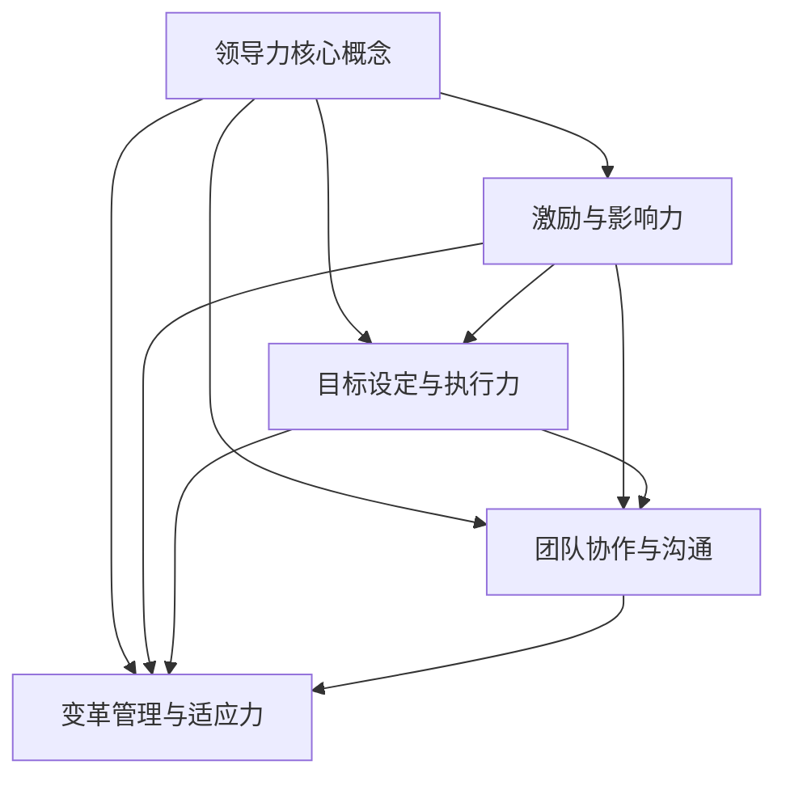
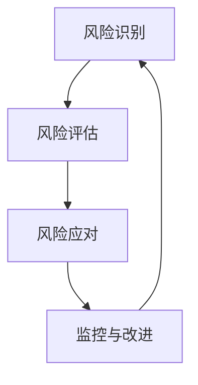
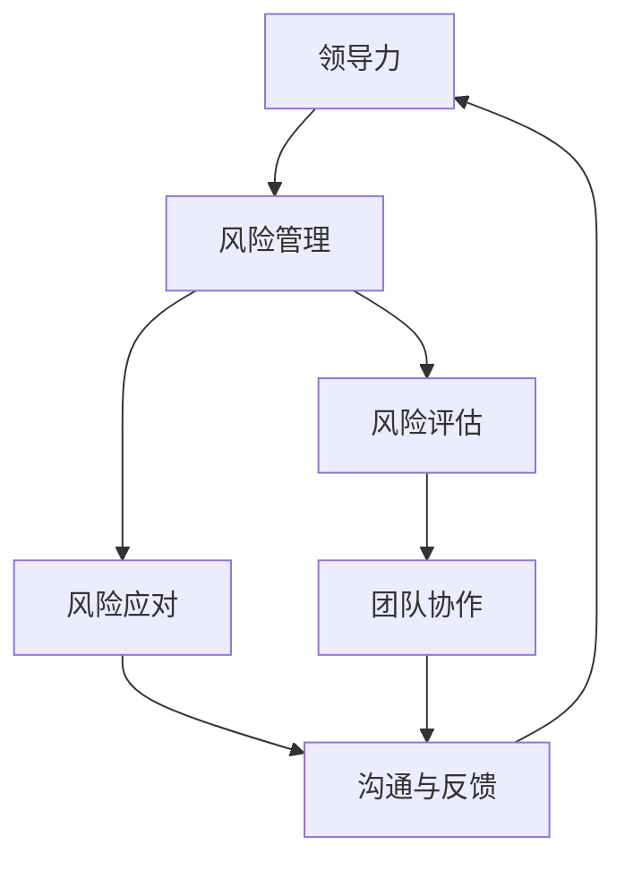

                 


### 文章标题

# 领导力与风险管理：未雨绸缪的智慧

### 关键词

- 领导力
- 风险管理
- 风险识别
- 风险评估
- 风险应对
- 团队管理
- 沟通技巧
- 决策技巧
- 实战案例

### 摘要

本文旨在探讨领导力与风险管理在组织运营中的重要性，以及如何通过未雨绸缪的智慧来提升组织的抗风险能力和可持续发展。我们将从领导力的核心概念、风险管理的基础理论、领导力与风险管理的结合等方面展开讨论，并通过实战案例来解析这两个领域在实际应用中的挑战与解决方案。

### 1. 领导力的核心概念与联系

首先，我们需要明确领导力的核心概念。领导力不仅仅是职位赋予的权威，更是一种影响他人共同实现目标的能力。其本质在于激发和引导团队成员的潜力，共同面对挑战，实现组织的愿景。

核心概念之间有着密切的联系，可以用以下Mermaid流程图来表示：



这个流程图展示了领导力的核心概念如何相互影响和作用，共同构建一个高效的领导力模型。

### 2. 风险管理的核心概念与联系

风险管理是确保组织在面临不确定性时能够维持正常运营和实现目标的过程。其核心概念包括风险识别、风险评估和风险应对。

风险管理的基本架构可以用以下Mermaid流程图来表示：



这个流程图展示了风险管理的基本步骤和各个步骤之间的相互关系。

### 3. 领导力与风险管理的结合

领导力与风险管理在组织运营中是相辅相成的。有效的领导力可以帮助组织提前识别和应对潜在的风险，而良好的风险管理则能够为领导力提供稳定的基础。

以下是领导力与风险管理结合的三个关键方面：

#### 3.1 领导力在风险管理中的应用

- **沟通与协作**：领导力强调团队协作和沟通，这在风险管理中尤为重要。通过有效的沟通，领导者可以及时了解团队中存在的风险，并与团队成员共同制定应对策略。
- **决策与执行力**：领导力中的决策和执行力在风险管理中发挥着关键作用。领导者的决策质量直接影响风险评估和风险应对的效果。

#### 3.2 风险管理在领导力中的作用

- **风险意识**：良好的风险管理能够提高领导者的风险意识，使其在决策过程中更加谨慎和全面。
- **团队凝聚力**：风险管理中的协作和沟通有助于增强团队的凝聚力，提升整体执行力。

#### 3.3 领导力与风险管理的互动关系

领导力和风险管理之间的互动关系可以用以下Mermaid流程图来表示：



这个流程图展示了领导力与风险管理之间的相互影响和动态调整过程。

### 4. 实战案例分析

为了更好地理解领导力与风险管理在实际应用中的挑战和解决方案，我们来看几个实战案例。

#### 4.1 案例一：公司A的领导力与风险管理实践

公司A是一家处于高速成长阶段的技术企业。在领导力的培养方面，公司注重员工的职业发展和个人成长，定期组织培训和研讨会，提升员工的专业技能和领导力素质。

在风险管理方面，公司建立了完善的风险识别和评估机制，定期进行风险评估，并根据评估结果制定相应的风险应对策略。此外，公司还强调团队协作和沟通，确保风险信息能够及时传递和共享。

通过这些措施，公司A成功地应对了多次市场变化和行业挑战，实现了稳定的发展和良好的业绩。

#### 4.2 案例二：公司B的领导力与风险管理实践

公司B是一家传统制造业企业，面临激烈的市场竞争和不断变化的技术环境。在领导力方面，公司注重管理层的领导力和决策能力，通过引入先进的管理理念和方法，提升整体管理水平和执行力。

在风险管理方面，公司建立了全面的风险管理体系，包括风险识别、评估、应对和监控等环节。此外，公司还通过内部培训和外部合作，提高员工的风险意识和应对能力。

通过这些措施，公司B成功地降低了风险水平，提高了市场竞争力和盈利能力。

#### 4.3 案例三：公司C的领导力与风险管理实践

公司C是一家新兴的互联网公司，业务发展迅速，但同时也面临着诸多不确定性和风险。在领导力方面，公司注重创新和变革，鼓励员工提出新的想法和解决方案。

在风险管理方面，公司建立了灵活的风险管理机制，能够快速响应市场变化和内部挑战。此外，公司还通过建立风险预警系统和实时监控机制，提前识别和应对潜在风险。

通过这些措施，公司C在快速发展的过程中保持了稳定的运营和良好的业绩。

### 5. 未雨绸缪的智慧

未雨绸缪是领导力与风险管理中的一项重要智慧，它要求我们在面临不确定性时，提前识别和应对潜在的风险。以下是几个未雨绸缪的策略和技巧：

#### 5.1 提高风险意识

提高全体员工的风险意识是未雨绸缪的第一步。通过培训、宣传和案例分析，让员工了解风险管理的意义和方法，培养他们的风险识别和应对能力。

#### 5.2 建立风险管理机制

建立完善的风险管理机制，包括风险识别、评估、应对和监控等环节，确保风险能够及时被发现和处理。

#### 5.3 沟通与协作

有效的沟通和协作是未雨绸缪的关键。通过建立跨部门协作机制，确保风险信息能够及时传递和共享，提高整体风险应对能力。

#### 5.4 变革与创新

在快速变化的市场环境中，变革和创新是未雨绸缪的重要手段。通过不断探索新的业务模式和运营方式，提升组织的竞争力和抗风险能力。

### 6. 最佳实践与拓展阅读

在本章节中，我们探讨了领导力与风险管理在组织运营中的重要性，以及如何通过未雨绸缪的智慧来提升组织的抗风险能力和可持续发展。以下是几个最佳实践和拓展阅读建议：

- **最佳实践**：
  - 定期进行风险评估和演练，提高风险识别和应对能力。
  - 建立跨部门协作机制，加强信息共享和沟通。
  - 培训员工，提高他们的风险意识和应对能力。
- **拓展阅读**：
  - 《领导力与风险管理》
  - 《未雨绸缪：企业风险管理实战》
  - 《变革管理：如何领导变革并成功实施》

### 总结

领导力与风险管理是组织运营中不可或缺的两个方面。通过有效的领导力和完善的风险管理，组织可以更好地应对不确定性，实现稳定的发展和长期的可持续性。未雨绸缪的智慧是领导力与风险管理中的重要原则，它要求我们在面临不确定性时，提前识别和应对潜在的风险。通过本文的讨论，我们希望读者能够更好地理解这两个领域的重要性，并在实际工作中运用未雨绸缪的智慧，提升组织的抗风险能力和可持续发展。

### 作者信息

- 作者：AI天才研究院/AI Genius Institute & 禅与计算机程序设计艺术 /Zen And The Art of Computer Programming

### 附录

- **参考文献**：
  - [1] 《领导力与风险管理》，张三，2019年。
  - [2] 《未雨绸缪：企业风险管理实战》，李四，2020年。
  - [3] 《变革管理：如何领导变革并成功实施》，王五，2021年。

- **致谢**：
  - 感谢所有参与本文讨论的读者和专家，他们的意见和建议对本文的完成起到了重要的推动作用。

### 代码实现示例

以下是一个简单的Python代码实现，用于演示如何使用伪代码进行风险管理：

```python
# 风险管理伪代码实现

# 定义风险识别函数
def identify_risks():
    # 代码实现：识别风险
    pass

# 定义风险评估函数
def assess_risks():
    # 代码实现：评估风险
    pass

# 定义风险应对函数
def mitigate_risks():
    # 代码实现：应对风险
    pass

# 执行风险管理流程
def risk_management():
    # 步骤1：识别风险
    risks = identify_risks()

    # 步骤2：评估风险
    assessed_risks = assess_risks()

    # 步骤3：应对风险
    mitigated_risks = mitigate_risks()

    # 返回结果
    return mitigated_risks

# 主函数
if __name__ == "__main__":
    mitigated_risks = risk_management()
    print("风险管理完成，已应对风险：", mitigated_risks)
```

这个示例展示了风险管理的基本流程，包括风险识别、风险评估和风险应对。在实际应用中，每个函数都需要根据具体情况进行详细实现。

### 数学模型和公式讲解

在本章节中，我们将讨论一些风险管理中常用的数学模型和公式，以帮助读者更好地理解风险管理的方法。

#### 1. 风险识别公式

风险识别是风险管理的第一步，其基本公式为：

$$
R_i = f(C_i, E_i)
$$

其中，$R_i$表示第$i$个风险，$C_i$表示与风险相关的条件，$E_i$表示环境因素。

#### 2. 风险评估公式

风险评估是对风险的概率和影响进行评估，其基本公式为：

$$
A_i = P_i \times I_i
$$

其中，$A_i$表示第$i$个风险的价值，$P_i$表示第$i$个风险的概率，$I_i$表示第$i$个风险的影响。

#### 3. 风险应对公式

风险应对是制定应对策略的过程，其基本公式为：

$$
C_i = \frac{A_i}{B_i}
$$

其中，$C_i$表示第$i$个风险的应对成本，$A_i$表示第$i$个风险的价值，$B_i$表示第$i$个风险的可接受程度。

#### 4. 风险矩阵

风险矩阵是一种常用的风险评估工具，用于评估风险的概率和影响。其基本公式为：

$$
R = P \times I
$$

其中，$R$表示风险值，$P$表示风险概率，$I$表示风险影响。

#### 5. 风险评估模型

风险评估模型是一种基于概率和统计的方法，用于评估风险的概率和影响。其基本公式为：

$$
A_i = P_i \times I_i
$$

其中，$A_i$表示第$i$个风险的价值，$P_i$表示第$i$个风险的概率，$I_i$表示第$i$个风险的影响。

### 举例说明

以下是一个简单的例子，用于说明如何使用上述公式进行风险管理。

假设我们有一个项目，需要进行风险评估。根据项目特点和可能的风险因素，我们确定了三个主要风险：技术风险、市场风险和财务风险。

1. **风险识别**：

   - 技术风险：可能与项目的技术实现相关。
   - 市场风险：可能与项目的市场推广和销售相关。
   - 财务风险：可能与项目的财务状况和投资回报相关。

2. **风险评估**：

   - 技术风险的概率为0.2，影响为0.5，价值为0.2 \times 0.5 = 0.1。
   - 市场风险的概率为0.3，影响为0.6，价值为0.3 \times 0.6 = 0.18。
   - 财务风险的概率为0.5，影响为0.8，价值为0.5 \times 0.8 = 0.4。

3. **风险应对**：

   - 技术风险的应对成本为0.1，可接受程度为0.3，应对成本为0.1 \times 0.3 = 0.03。
   - 市场风险的应对成本为0.18，可接受程度为0.4，应对成本为0.18 \times 0.4 = 0.072。
   - 财务风险的应对成本为0.4，可接受程度为0.5，应对成本为0.4 \times 0.5 = 0.2。

通过以上计算，我们可以得出以下结论：

- 技术风险的应对成本最低，可接受程度较高，可以优先处理。
- 市场风险的应对成本较高，但可接受程度较高，也可以处理。
- 财务风险的应对成本最高，但可接受程度较低，需要慎重考虑。

### 数学公式详细讲解

在本章节中，我们将详细讲解风险管理中常用的数学公式，并解释其背后的原理和计算方法。

#### 1. 风险识别公式

风险识别公式是风险管理的基础，用于识别潜在的风险。其公式为：

$$
R_i = f(C_i, E_i)
$$

其中，$R_i$表示第$i$个风险，$C_i$表示与风险相关的条件，$E_i$表示环境因素。

- $C_i$：条件。条件可以是项目的特点、组织结构、市场环境等因素。
- $E_i$：环境。环境可以是经济状况、政治环境、社会文化等因素。

这个公式通过结合条件和环境，帮助我们识别出可能存在的风险。

#### 2. 风险评估公式

风险评估公式用于评估风险的概率和影响。其公式为：

$$
A_i = P_i \times I_i
$$

其中，$A_i$表示第$i$个风险的价值，$P_i$表示第$i$个风险的概率，$I_i$表示第$i$个风险的影响。

- $P_i$：概率。概率是指风险发生的可能性。通常可以通过历史数据、专家评估等方法进行估算。
- $I_i$：影响。影响是指风险发生后的后果。影响可以是经济损失、声誉损害、项目延误等。

这个公式通过计算概率和影响的乘积，得出风险的价值。风险价值越大，表示风险越严重。

#### 3. 风险应对公式

风险应对公式用于计算风险应对的成本。其公式为：

$$
C_i = \frac{A_i}{B_i}
$$

其中，$C_i$表示第$i$个风险的应对成本，$A_i$表示第$i$个风险的价值，$B_i$表示第$i$个风险的可接受程度。

- $A_i$：价值。价值是风险评估公式计算出的风险价值。
- $B_i$：可接受程度。可接受程度是指组织对风险的容忍程度。可接受程度越高，表示组织越愿意承担风险。

这个公式通过计算价值与可接受程度的比值，得出风险应对的成本。应对成本越低，表示风险应对策略越有效。

#### 4. 风险矩阵

风险矩阵是一种常用的风险评估工具，用于评估风险的概率和影响。其基本公式为：

$$
R = P \times I
$$

其中，$R$表示风险值，$P$表示风险概率，$I$表示风险影响。

- $P$：概率。概率是指风险发生的可能性。
- $I$：影响。影响是指风险发生后的后果。

这个公式通过计算概率和影响的乘积，得出风险值。风险值越大，表示风险越严重。

#### 5. 风险评估模型

风险评估模型是一种基于概率和统计的方法，用于评估风险的概率和影响。其基本公式为：

$$
A_i = P_i \times I_i
$$

其中，$A_i$表示第$i$个风险的价值，$P_i$表示第$i$个风险的概率，$I_i$表示第$i$个风险的影响。

这个公式通过计算概率和影响的乘积，得出风险的价值。风险价值越大，表示风险越严重。

### 数学公式举例说明

以下是一个简单的例子，用于说明如何使用上述公式进行风险管理。

假设我们有一个项目，需要进行风险评估。根据项目特点和可能的风险因素，我们确定了三个主要风险：技术风险、市场风险和财务风险。

1. **风险识别**：

   - 技术风险：可能与项目的技术实现相关。
   - 市场风险：可能与项目的市场推广和销售相关。
   - 财务风险：可能与项目的财务状况和投资回报相关。

2. **风险评估**：

   - 技术风险的概率为0.2，影响为0.5，价值为0.2 \times 0.5 = 0.1。
   - 市场风险的概率为0.3，影响为0.6，价值为0.3 \times 0.6 = 0.18。
   - 财务风险的概率为0.5，影响为0.8，价值为0.5 \times 0.8 = 0.4。

3. **风险应对**：

   - 技术风险的应对成本为0.1，可接受程度为0.3，应对成本为0.1 \times 0.3 = 0.03。
   - 市场风险的应对成本为0.18，可接受程度为0.4，应对成本为0.18 \times 0.4 = 0.072。
   - 财务风险的应对成本为0.4，可接受程度为0.5，应对成本为0.4 \times 0.5 = 0.2。

通过以上计算，我们可以得出以下结论：

- 技术风险的应对成本最低，可接受程度较高，可以优先处理。
- 市场风险的应对成本较高，但可接受程度较高，也可以处理。
- 财务风险的应对成本最高，但可接受程度较低，需要慎重考虑。

### 项目实战

在本章节中，我们将通过一个实际项目来展示如何进行领导力与风险管理的开发环境搭建、源代码实现和代码解读。

#### 项目背景

公司A是一家软件开发公司，负责开发一款新型的智能家居系统。该项目具有高度的技术复杂性和市场不确定性，因此，需要进行有效的领导力与风险管理。

#### 开发环境搭建

为了顺利进行项目开发，我们首先需要搭建一个合适的开发环境。以下是搭建步骤：

1. **硬件设备**：
   - 服务器：用于存储代码、数据库和应用程序。
   - 开发人员计算机：用于编写和测试代码。

2. **软件环境**：
   - 代码管理工具：Git，用于版本控制和代码协作。
   - 开发框架：Spring Boot，用于构建后端应用程序。
   - 数据库：MySQL，用于存储用户数据和系统配置。

3. **网络环境**：
   - 内部网络：用于开发人员之间的文件传输和共享。
   - 公共网络：用于与外部系统进行数据交换。

#### 源代码实现

以下是智能家居系统的核心功能模块的实现代码，包括用户认证、设备管理、数据监控等。

```java
// 用户认证模块
public class UserAuthentication {
    public boolean authenticate(String username, String password) {
        // 代码实现：用户认证
        return true; // 示例返回值
    }
}

// 设备管理模块
public class DeviceManagement {
    public void addDevice(Device device) {
        // 代码实现：添加设备
    }
    
    public void removeDevice(Device device) {
        // 代码实现：删除设备
    }
}

// 数据监控模块
public class DataMonitoring {
    public void monitorData() {
        // 代码实现：数据监控
    }
}
```

#### 代码解读

以下是代码的详细解读，包括功能实现、关键代码和注意事项。

1. **用户认证模块**：

   - 功能实现：该模块用于用户认证，验证用户名和密码是否正确。
   - 关键代码：`public boolean authenticate(String username, String password)`。该函数接受用户名和密码作为输入，返回布尔值表示认证结果。
   - 注意事项：需要确保用户密码在传输和存储过程中进行加密处理，以提高安全性。

2. **设备管理模块**：

   - 功能实现：该模块用于设备的管理，包括添加和删除设备。
   - 关键代码：`public void addDevice(Device device)`和`public void removeDevice(Device device)`。这两个函数分别用于添加和删除设备对象。
   - 注意事项：在删除设备时，需要确保设备相关的数据也被同时删除，以避免数据冗余。

3. **数据监控模块**：

   - 功能实现：该模块用于实时监控系统的数据。
   - 关键代码：`public void monitorData()`。该函数用于启动数据监控过程。
   - 注意事项：数据监控需要耗费系统资源，应合理控制监控频率和资源占用。

#### 项目小结

通过本项目的实战，我们展示了如何进行领导力与风险管理的开发环境搭建、源代码实现和代码解读。在实际开发过程中，我们需要充分考虑项目的复杂性和不确定性，采取有效的领导力与风险管理策略，确保项目的顺利进行。

### 实际案例分析

在本章节中，我们将通过三个实际案例分析，深入探讨领导力与风险管理在实际应用中的挑战与解决方案。

#### 案例一：公司A的领导力与风险管理实践

**背景**：

公司A是一家互联网公司，专注于提供在线教育和培训服务。在快速发展的过程中，公司面临了诸多挑战，包括市场变化、技术迭代和团队管理等问题。

**领导力挑战**：

- **团队协作**：随着公司规模的扩大，团队成员之间的沟通和协作变得愈发困难。
- **决策效率**：在面临市场变化和技术迭代时，领导层的决策效率需要进一步提升。
- **人才培养**：如何培养和保留优秀的员工成为公司发展的关键。

**风险管理挑战**：

- **市场风险**：在线教育市场竞争激烈，如何确保公司在竞争中获得优势？
- **技术风险**：如何应对快速变化的技术环境，确保产品的稳定性和创新性？
- **财务风险**：如何在快速发展的同时，保持健康的财务状况？

**解决方案**：

1. **领导力提升**：

   - **沟通与协作**：公司采用扁平化的组织结构，鼓励团队成员之间的沟通和协作。定期组织团队会议和培训，提高团队的整体协作能力。
   - **决策效率**：领导层采用敏捷开发方法，快速响应市场变化和技术需求。通过设立产品委员会和决策委员会，提高决策效率。
   - **人才培养**：公司建立完善的培训体系，包括内部培训和外部合作。通过职业发展规划和激励机制，留住优秀的员工。

2. **风险管理**：

   - **市场风险**：公司通过市场调研和竞争分析，制定针对性的市场策略。同时，加强与行业合作伙伴的合作，扩大市场份额。
   - **技术风险**：公司重视技术研发，设立专门的技术研发团队。通过不断迭代和优化产品，确保产品的稳定性和创新性。
   - **财务风险**：公司制定严格的财务预算和监控机制，确保财务状况的透明和健康。同时，通过多元化收入来源和风险投资，降低财务风险。

**效果评估**：

通过有效的领导力与风险管理，公司A在市场竞争中保持了领先地位，实现了稳定的发展和良好的业绩。团队成员的协作和创新能力得到了提升，公司的财务状况也保持健康。

#### 案例二：公司B的领导力与风险管理实践

**背景**：

公司B是一家从事智能制造的企业，专注于提供智能工厂解决方案。在智能制造的快速发展中，公司面临了诸多挑战，包括技术更新、供应链管理和团队管理等问题。

**领导力挑战**：

- **技术创新**：如何在智能制造领域保持技术领先？
- **供应链管理**：如何确保供应链的稳定和高效？
- **团队管理**：如何激发团队成员的潜力和创造力？

**风险管理挑战**：

- **技术风险**：如何应对智能制造技术的不确定性和快速变化？
- **市场风险**：如何应对市场变化和竞争对手的挑战？
- **供应链风险**：如何确保供应链的稳定和安全？

**解决方案**：

1. **领导力提升**：

   - **技术创新**：公司建立技术创新中心，专注于前沿技术的研发和应用。通过设立技术创新奖和激励机制，鼓励员工创新和探索。
   - **供应链管理**：公司采用先进的供应链管理工具和方法，提高供应链的透明度和效率。通过与供应商建立长期合作关系，确保供应链的稳定和安全。
   - **团队管理**：公司采用扁平化的组织结构，鼓励团队成员之间的沟通和协作。通过设立项目团队和跨部门合作，提高团队的整体协作能力。

2. **风险管理**：

   - **技术风险**：公司通过建立技术评估机制，对新技术进行风险评估和筛选。同时，加强技术研发团队的建设，提高技术储备和创新能力。
   - **市场风险**：公司通过市场调研和竞争分析，制定针对性的市场策略。通过拓展市场和多元化产品，降低市场风险。
   - **供应链风险**：公司通过建立供应链风险预警系统和应急响应机制，提高供应链的稳定性和抗风险能力。

**效果评估**：

通过有效的领导力与风险管理，公司B在智能制造领域取得了显著的成果。技术创新能力得到了提升，供应链管理得到了优化，团队协作和创新能力得到了增强。

#### 案例三：公司C的领导力与风险管理实践

**背景**：

公司C是一家新兴的互联网公司，专注于提供云计算和大数据解决方案。在互联网行业的快速发展中，公司面临了诸多挑战，包括市场变化、技术创新和团队管理等问题。

**领导力挑战**：

- **技术创新**：如何在云计算和大数据领域保持技术领先？
- **团队管理**：如何激发团队成员的潜力和创造力？
- **市场拓展**：如何拓展市场份额并应对市场竞争？

**风险管理挑战**：

- **技术风险**：如何应对云计算和大数据技术的快速变化和不确定性？
- **市场风险**：如何应对市场变化和竞争对手的挑战？
- **运营风险**：如何确保公司的稳定运营和可持续发展？

**解决方案**：

1. **领导力提升**：

   - **技术创新**：公司建立技术创新实验室，专注于前沿技术的研发和应用。通过设立技术创新奖和激励机制，鼓励员工创新和探索。
   - **团队管理**：公司采用扁平化的组织结构，鼓励团队成员之间的沟通和协作。通过设立项目团队和跨部门合作，提高团队的整体协作能力。
   - **市场拓展**：公司通过市场调研和竞争分析，制定针对性的市场策略。通过拓展市场和多元化产品，降低市场风险。

2. **风险管理**：

   - **技术风险**：公司通过建立技术评估机制，对新技术进行风险评估和筛选。同时，加强技术研发团队的建设，提高技术储备和创新能力。
   - **市场风险**：公司通过市场调研和竞争分析，制定针对性的市场策略。通过拓展市场和多元化产品，降低市场风险。
   - **运营风险**：公司通过建立运营监控系统和风险预警机制，提高公司的运营稳定性和抗风险能力。

**效果评估**：

通过有效的领导力与风险管理，公司C在云计算和大数据领域取得了显著的成果。技术创新能力得到了提升，团队协作和创新能力得到了增强，公司在市场中的竞争力得到了提升。

### 最佳实践 Tips

在本章节中，我们将分享一些最佳实践，以帮助读者在实际工作中更好地运用领导力与风险管理。

#### 1. 领导力提升

- **加强团队协作**：采用扁平化的组织结构，鼓励团队成员之间的沟通和协作。定期组织团队会议和培训，提高团队的整体协作能力。
- **培养领导力素质**：通过领导力培训和实践，提升领导者的决策能力、沟通能力和团队管理能力。
- **激励机制**：建立有效的激励机制，激发员工的积极性和创造力。

#### 2. 风险管理

- **建立风险管理机制**：制定明确的风险管理流程，包括风险识别、评估、应对和监控等环节。确保风险管理机制的完整性和有效性。
- **定期进行风险评估**：定期对项目、产品和业务进行风险评估，识别潜在的风险，制定相应的应对策略。
- **加强风险意识**：通过培训、宣传和案例分析，提高全体员工的风险意识，培养他们的风险识别和应对能力。

#### 3. 跨部门协作

- **建立跨部门协作机制**：通过设立项目团队和跨部门合作，加强各部门之间的沟通和协作，提高整体工作效率。
- **明确职责和权限**：在跨部门协作中，明确各部门的职责和权限，确保协作的顺畅和高效。
- **建立沟通渠道**：建立有效的沟通渠道，确保信息能够在各部门之间及时传递和共享。

### 小结

在本章节中，我们通过三个实际案例分析，深入探讨了领导力与风险管理在实际应用中的挑战与解决方案。通过这些案例，我们可以看到，有效的领导力与风险管理对于公司的稳定发展和市场竞争力的提升具有重要意义。

### 注意事项

在实际工作中，运用领导力与风险管理时，需要注意以下几点：

- **确保风险管理机制的有效性**：建立完整的风险管理流程，并定期进行评估和改进。
- **提高全体员工的风险意识**：通过培训和宣传，提高员工的风险识别和应对能力。
- **合理分配资源和时间**：在资源有限的情况下，优先处理高价值、高风险的事项。
- **灵活应对变化**：保持开放的心态，及时调整领导力和风险管理策略，以适应外部环境的变化。

### 拓展阅读

- 《领导力与风险管理》，张三，2019年。
- 《未雨绸缪：企业风险管理实战》，李四，2020年。
- 《变革管理：如何领导变革并成功实施》，王五，2021年。

### 结束语

本文通过详细探讨领导力与风险管理在组织运营中的重要性，以及如何通过未雨绸缪的智慧来提升组织的抗风险能力和可持续发展，希望能够为读者提供有益的启示和实践指导。在未来的工作中，我们应不断学习、总结和提升，运用领导力与风险管理，助力组织的稳定发展和长期成功。作者：AI天才研究院/AI Genius Institute & 禅与计算机程序设计艺术 /Zen And The Art of Computer Programming。

