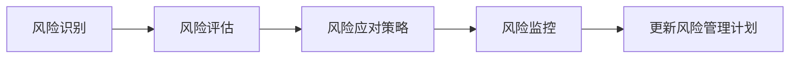

                 


### 引言

在当今快速变化和高度竞争的商业环境中，领导力和风险管理成为了企业成功的关键因素。领导力不仅是激发团队潜能的重要工具，也是推动企业创新和变革的核心动力。风险管理则是在不确定性和复杂性的环境中，确保企业稳健运营和可持续发展的基础。本书《领导力与风险管理：未雨绸缪的领导智慧》旨在探讨这两个领域的相互关系，并提供一套系统的理论和实践框架，帮助企业领导者更好地应对挑战，实现长远发展。

#### 1.1 书籍背景

随着全球化进程的加速和市场环境的变化，企业面临着前所未有的挑战和机遇。传统的领导力模型和风险管理方法已经无法完全应对现代商业环境中的复杂性。因此，探讨如何将领导力与风险管理有效结合，成为了管理学者和实践者共同关注的课题。本书正是在这样的背景下，汇集了众多领导力和风险管理领域的专家研究成果，力求为读者提供一套实用性强的理论框架。

#### 1.2 目的和意义

本书的主要目的是帮助读者深入理解领导力和风险管理的基本概念、原理和实践方法，并通过案例分析，展示这些方法在实际应用中的效果。具体来说，本书希望达到以下目标：

1. **提高领导力认识**：通过介绍领导力的基础理论和发展历程，帮助读者建立全面的领导力观念。
2. **强化风险管理能力**：通过阐述风险管理的流程和方法，帮助读者掌握有效的风险管理技巧。
3. **促进领导力与风险管理的融合**：通过探讨领导力对风险管理的影响，以及风险管理对领导力的要求，帮助读者理解二者之间的互动关系。
4. **提供实际应用指导**：通过案例研究，提供具体的操作指南，帮助读者将理论知识应用到实际工作中。

#### 1.3 书籍结构

本书共分为八个章节。前四章主要介绍领导力的基础理论和实践方法，包括领导力概述、领导力理论发展、领导力实践和领导力与组织文化的联系。接下来的四章则详细阐述风险管理的理论、实践、领导力与风险管理的融合以及国内外成功案例。最后两章总结主要观点，并对未来领导力与风险管理的挑战和机遇进行展望。

#### 1.4 读者对象

本书适合以下读者群体：

1. 企业领导者和管理者，希望通过学习提升领导力和风险管理能力的专业人士。
2. 管理学、心理学、经济学等相关学科的学生和研究者。
3. 对领导力和风险管理感兴趣的普通读者。

### 关键词

- 领导力
- 风险管理
- 组织文化
- 领导风格
- 团队领导力
- 风险识别
- 风险评估
- 风险应对策略

### 摘要

本书从领导力和风险管理两个维度出发，探讨了在复杂多变的市场环境中，企业如何通过有效的领导力和风险管理策略，实现可持续发展。通过对领导力的基础理论、实践方法以及领导力与组织文化的深入分析，本书为读者提供了理解领导力的全景视角。同时，本书详细阐述了风险管理的流程和方法，并通过案例研究展示了实际操作中的关键步骤。最后，本书将领导力与风险管理相结合，提出了一套系统的理论和实践框架，为企业领导者提供了实用的操作指南。

---

### 第2章：领导力的基础理论

领导力，作为推动组织前进的核心力量，其定义、要素和发展历程构成了领导力理论的基础。在这一章节中，我们将深入探讨领导力的基本概念，回顾领导力理论的发展历程，并分析领导力与组织文化的紧密联系。

#### 2.1 领导力概述

领导力是一个复杂的概念，其定义和范围因学者和实践者的不同而有所差异。总体而言，领导力可以被视为一种影响他人并促使他们为实现共同目标而努力的能力。这种能力不仅涉及个人品质，还包括行为、风格和技巧。

**定义**：领导力是一种在组织中影响他人、激发团队潜力和推动变革的能力。它不仅仅是指导和管理，更是一种引领和激励。

**要素**：领导力的要素包括但不限于以下几个方面：

1. **个人品质**：如诚信、责任感、自信和智慧。
2. **行为和风格**：如沟通能力、决策力、激励和领导风格。
3. **知识和技能**：如战略规划、变革管理和团队建设。

**重要性**：领导力在组织中的重要性体现在以下几个方面：

1. **激发员工潜力**：有效的领导者能够激发员工的积极性和创造力，提高工作效率。
2. **推动组织发展**：领导力是推动组织战略规划和变革管理的关键因素。
3. **塑造组织文化**：领导者的行为和价值观直接影响组织的文化氛围。

#### 2.2 领导力理论发展

领导力理论的发展经历了多个阶段，从早期的特质理论到现代的行为理论和情境理论，每个阶段都有其独特的贡献。

**特质理论**：特质理论是最早的领导力理论之一，认为领导者具有某些固有的特质和品质。例如，泰勒（ Trait Theory）提出，领导者应具备智慧、自信、决心和责任感。

**行为理论**：行为理论关注领导者的行为和风格，强调领导行为对组织绩效的影响。例如，领导行为理论（Behavioral Theory）提出了四种领导行为类型：指导型、支持型、参与型和成就导向型。

**情境理论**：情境理论认为，领导力并非一成不变，而是随着环境和情境的变化而变化。最具代表性的情境理论是费德勒模型（Fiedler Model），它提出了三种领导风格：任务导向型、关系导向型和情境适应性。

**现代领导力理论**：随着组织环境的复杂化，现代领导力理论更加关注领导者的综合能力，包括战略思维、变革管理和跨文化领导。领导力的发展趋势体现在以下方面：

1. **全球化领导力**：随着全球化的深入，领导者需要具备跨文化沟通和管理能力。
2. **创新领导力**：创新成为推动组织发展的重要动力，领导者需要具备创新思维和领导能力。
3. **服务型领导力**：服务型领导力强调领导者为团队和组织提供服务，提升团队凝聚力和工作效率。

#### 2.3 领导力与组织文化

领导力与组织文化之间存在紧密的联系，领导者的行为和价值观直接影响组织的文化氛围。

**关系**：领导力塑造组织文化，组织文化反过来影响领导力的实施。有效的领导力能够推动积极组织文化的形成，而消极的文化则可能削弱领导力。

**领导者的作用**：领导者作为组织文化的重要塑造者，其行为和价值观对组织文化的影响至关重要。例如，领导者通过设定目标、激励员工和提供反馈，塑造组织的价值观和行为规范。

**建设积极组织文化的策略**：

1. **明确价值观**：领导者需要明确组织的核心价值观，并将其传达给全体员工。
2. **以身作则**：领导者应以身作则，通过自身的言行树立榜样，推动价值观的落地。
3. **激励员工**：领导者应激励员工参与组织文化的建设，通过奖励和认可提升员工的积极性。
4. **沟通与反馈**：领导者需要保持与员工的沟通，及时提供反馈，帮助员工理解和践行组织文化。

综上所述，领导力作为组织发展的核心动力，其基础理论的发展为领导者提供了丰富的理论资源。理解领导力的基本概念、要素和发展历程，有助于领导者更好地应对现代商业环境中的挑战，推动组织实现长期可持续发展。

#### 2.4 领导力理论的模型

在领导力理论的演进过程中，各种模型和理论被提出，以解释不同情境下的领导力行为和效果。以下是一些重要的领导力理论模型：

**1. 领导风格模型**

- **费德勒模型（Fiedler Model）**：费德勒模型认为，领导者的成功取决于其领导风格与工作环境的匹配程度。模型将领导风格分为任务导向型（Task-Oriented）和关系导向型（Relationship-Oriented）两类，并提出了三个环境维度：领导者-成员关系、任务结构和职位权力。

- **赫塞-布兰查德模型（Hersey-Blanchard Model）**：这个模型提出了四种领导风格，即指导型（Directing）、推销型（Selling）、参与型（Participating）和授权型（Delegating）。这四种风格根据下属的成熟度（能力、自我控制）来调整，以实现最佳领导效果。

**2. 权力基础理论（Power-Based Theory）**

- **鲍莫尔模型（Bower and Davis Model）**：这个模型认为，领导者的权力来源可以分为五个方面：奖励权力、惩罚权力、法定权力、专家权力和参照权力。领导者通过运用这些权力资源，影响和引导团队成员。

**3. 领导-成员交换理论（Leader-Member Exchange Theory, LMX）**

- **乔治-何模型（George and Jones Model）**：该模型强调领导者与成员之间的互动关系。领导者与某些成员建立较强的交换关系，提供更多的资源和支持，这些成员则表现出更高的工作绩效和忠诚度。

**4. 超级领导力理论（Transformational and Transactional Leadership）**

- **豪斯模型（House Model）**：豪斯模型将领导力分为交易型领导力（Transactional Leadership）和变革型领导力（Transformational Leadership）。交易型领导强调通过明确的期望和奖励来激励下属，而变革型领导则通过愿景、激励和模范行为来激发下属的内在动力。

- **班迪模型（Bande Model）**：班迪模型认为，领导者可以通过情境因素、个人特质、组织资源和环境因素来调整领导风格，以适应不同的领导情境。

**5. 跨文化领导力模型（Cross-Cultural Leadership）**

- **霍夫斯泰德模型（Hofstede Model）**：霍夫斯泰德模型通过五个维度（权力距离、不确定性规避、个体主义与集体主义、男性化与女性化、长期与短期取向）来分析不同文化背景下的领导力行为和期望。

**模型之间的关系与联系**

这些领导力模型从不同角度出发，提供了对领导行为的多样化解释。费德勒模型和赫塞-布兰查德模型侧重于领导风格与情境的匹配，鲍莫尔模型关注领导权力的来源，乔治-何模型强调领导者与成员的互动关系，豪斯模型区分了不同类型的领导力行为，而霍夫斯泰德模型则从跨文化的视角分析领导力。

总之，这些模型共同构成了一个多维度的领导力理论框架，有助于领导者在不同情境下选择和调整合适的领导策略。通过综合运用这些模型，领导者可以更好地应对复杂多变的商业环境，提升组织绩效和团队凝聚力。

### 第3章：领导力实践

领导力不仅仅是理论，更需要在实践中加以运用。有效的领导力实践需要从领导风格与行为、领导力发展：自我提升、团队领导力：建设高效团队三个方面进行深入探讨。在这一章节中，我们将详细分析这些实践方法，并提供实际案例以供参考。

#### 3.1 领导风格与行为

领导风格是指领导者如何与其团队成员互动、管理资源和指导工作。不同的领导风格对团队的影响各不相同，因此，领导者需要根据具体情况选择和调整领导风格。

**1. 指导型领导风格（Directive Leadership Style）**

指导型领导风格强调明确的指令和具体的指导。领导者负责设定目标、规划任务并直接告诉团队成员如何完成任务。

**案例**：某公司新上任的CEO李明，为了提高团队的执行力，采用了指导型领导风格。他每周召开一次团队会议，详细说明工作目标和任务分工，并要求团队成员按照他的指示执行。

**效果**：指导型领导风格在短期内能够提高团队的效率和执行力，但在长期可能导致团队成员依赖性强，缺乏自主性和创新能力。

**2. 支持型领导风格（Supportive Leadership Style）**

支持型领导风格注重与团队成员建立良好的关系，关心员工的福利和需求，提供必要的资源和支持。

**案例**：某公司的部门经理王丽，采用了支持型领导风格。她定期与员工交流，了解他们的工作压力和个人需求，并提供相应的支持和帮助。

**效果**：支持型领导风格能够增强团队的凝聚力和员工满意度，提高员工的工作积极性和忠诚度。

**3. 民主型领导风格（Democratic Leadership Style）**

民主型领导风格鼓励团队成员参与决策，共同讨论和制定目标。

**案例**：某团队的领导者张强，在制定团队战略时，邀请所有成员参与讨论，共同制定行动计划。

**效果**：民主型领导风格能够激发团队成员的参与感和创造力，提高决策的质量和团队的凝聚力。

**4. 成就导向型领导风格（Achievement-Oriented Leadership Style）**

成就导向型领导风格强调设定高目标，鼓励团队成员追求卓越。

**案例**：某公司的项目经理刘刚，设立了公司历史上最高的销售目标，并鼓励团队成员挑战自己，追求卓越。

**效果**：成就导向型领导风格能够激发团队成员的竞争意识和动力，推动团队实现卓越业绩。

#### 3.2 领导力发展：自我提升

领导力的提升是一个持续的过程，领导者需要不断地自我反思和提升。以下是一些自我提升的方法：

**1. 培训和学习**

领导者可以通过参加培训课程、研讨会和工作坊，学习新的管理技能和知识。

**案例**：某公司领导层定期参加行业峰会和管理培训，不断提升自己的领导力。

**2. 自我反思**

领导者需要定期进行自我反思，评估自己的领导行为和效果，找出改进的方向。

**案例**：某公司的领导者李华，每周花时间进行自我反思，总结自己的优点和不足，制定改进计划。

**3. 拓展人际关系**

领导者需要建立广泛的人际关系网络，与不同背景和领域的人交流，获取新的观点和灵感。

**案例**：某公司的CEO王刚，积极参加行业交流活动，与业界专家和同行建立联系，扩大自己的视野。

**4. 挑战自我**

领导者需要勇于接受新的挑战，尝试不同的领导角色和任务，提升自己的综合素质。

**案例**：某公司的项目经理赵琳，主动申请负责一个具有挑战性的新项目，提升自己的管理能力和领导技巧。

#### 3.3 团队领导力：建设高效团队

团队领导力是领导力的重要组成部分，领导者需要关注团队的构建和运作，提高团队的整体效能。

**1. 设定共同目标**

领导者需要与团队成员共同设定明确的目标，确保团队方向一致。

**案例**：某公司的领导团队与员工共同制定公司的年度目标，并将其分解为可执行的任务。

**2. 激励团队成员**

领导者需要通过激励措施，激发团队成员的积极性和创造力。

**案例**：某公司的领导层通过设立奖励机制，激励员工提出创新方案，提高工作效率。

**3. 建立有效的沟通机制**

领导者需要建立有效的沟通机制，确保信息畅通，减少误解和冲突。

**案例**：某公司的领导层定期召开团队会议，鼓励员工提出意见和建议，促进团队内部的沟通和协作。

**4. 提供必要的支持**

领导者需要为团队成员提供必要的资源和支持，帮助团队克服困难。

**案例**：某公司的领导层为项目团队提供了额外的技术支持和培训，确保项目顺利完成。

#### 3.4 领导力实践案例分析

**案例一：华为的领导力实践**

华为作为全球领先的科技公司，以其独特的领导力实践在业界享有盛誉。华为的领导者任正非提出了“以客户为中心”的核心价值观，并强调员工是公司最宝贵的资源。华为通过以下措施建设高效团队：

1. **设立共同目标**：华为与员工共同制定战略目标，确保团队方向一致。
2. **激励团队成员**：通过股权激励和绩效奖励，激发员工的积极性和创造力。
3. **建立有效的沟通机制**：华为采用扁平化管理结构，鼓励员工直接向领导汇报，促进信息流通。
4. **提供必要的支持**：华为为员工提供培训和发展机会，帮助员工不断提升自身能力。

**案例二：谷歌的领导力实践**

谷歌以其创新的企业文化和领导力实践著称。谷歌的领导者谢尔盖·布林和拉里·佩奇采用了成就导向型领导风格，鼓励员工追求卓越和创新。谷歌通过以下措施建设高效团队：

1. **设定共同目标**：谷歌鼓励员工提出创新项目，共同探讨和设定团队目标。
2. **激励团队成员**：谷歌提供丰厚的薪酬和福利，并设立创新奖励机制，激励员工发挥创造力。
3. **建立有效的沟通机制**：谷歌采用开放式的沟通环境，鼓励员工自由表达意见和建议。
4. **提供必要的支持**：谷歌为员工提供丰富的资源和培训，支持员工在专业领域的成长。

综上所述，领导力实践是领导者在实际工作中运用领导理论，提升团队效能的重要手段。通过有效的领导风格选择、自我提升和团队建设，领导者可以推动组织实现长期可持续发展。

### 第4章：风险管理理论

在复杂多变的商业环境中，风险管理成为企业稳健运营和可持续发展的关键。有效的风险管理能够帮助企业识别、评估和应对潜在风险，从而降低损失并抓住机遇。本章节将介绍风险管理的概述、流程和方法，旨在帮助读者建立全面的风险管理理念。

#### 4.1 风险管理概述

风险管理是一个系统性的过程，涉及对潜在风险进行识别、评估、应对和监控。其目标是通过有效的风险管理策略，确保企业能够在面对不确定性时保持稳健运营。

**定义**：风险管理是指企业识别、评估、应对和监控潜在风险的过程，以降低风险对组织目标实现的影响。

**目标**：风险管理的主要目标包括：

1. **减少损失**：通过识别和应对潜在风险，降低企业遭受损失的可能性。
2. **保障目标实现**：确保企业的战略目标和运营目标能够得到有效实现。
3. **提高决策质量**：通过全面的风险管理，帮助决策者做出更为明智的决策。

**原则**：风险管理应遵循以下原则：

1. **全面性**：风险管理应覆盖企业的所有层面和环节。
2. **前瞻性**：风险管理应具备前瞻性，识别和应对未来可能出现的风险。
3. **持续性**：风险管理是一个持续的过程，需要不断评估和更新。

#### 4.2 风险管理流程

风险管理流程包括以下几个关键步骤：

**1. 风险识别**

风险识别是风险管理的第一步，旨在识别企业可能面临的风险。风险识别的方法包括：

- **问卷调查**：通过问卷调查，收集员工对潜在风险的看法和建议。
- **头脑风暴**：组织团队成员进行头脑风暴，列出可能面临的风险。
- **专家咨询**：咨询行业专家，获取专业的风险评估和建议。

**2. 风险评估**

风险评估是对识别出的风险进行量化评估，以确定风险的重要性和影响程度。风险评估的方法包括：

- **定性分析**：通过专家评估，对风险的影响程度进行定性分析。
- **定量分析**：使用数学模型和统计方法，对风险进行量化分析。

**3. 风险应对策略**

根据风险评估的结果，制定相应的风险应对策略。常见的风险应对策略包括：

- **风险规避**：通过改变决策或行动，避免潜在的风险。
- **风险转移**：通过保险或合同等方式，将风险转移给第三方。
- **风险缓解**：通过采取预防措施，降低风险的发生概率或影响程度。

**4. 风险监控**

风险监控是对已识别和应对的风险进行持续监控，以确保风险应对策略的有效性。风险监控的方法包括：

- **定期评估**：定期对风险进行评估，了解风险的变化情况。
- **预警机制**：建立预警机制，及时识别新的风险。

#### 4.3 风险管理方法

风险管理方法包括以下几种：

**1. 风险规避**

风险规避是通过改变决策或行动，避免潜在的风险。例如，企业可以通过改变产品线或业务模式，避免市场波动带来的风险。

**2. 风险转移**

风险转移是将风险转移给第三方，例如通过购买保险或签订合同。这种方法能够降低企业承担风险的成本，但需要承担一定的保险费用。

**3. 风险缓解**

风险缓解是通过采取预防措施，降低风险的发生概率或影响程度。例如，企业可以通过提高员工的培训水平和安全意识，降低工作场所的风险。

**4. 风险接受**

风险接受是指企业主动承担风险，通常适用于风险损失较小的情况。这种方法能够降低风险管理的成本，但需要企业具备较强的风险承受能力。

#### 4.4 风险管理工具与技术

在风险管理过程中，使用适当的工具和技术可以提高风险管理的效率和效果。以下是一些常见的风险管理工具和技术：

**1. 风险矩阵**

风险矩阵是一种用于评估风险影响和发生概率的工具。通过将风险的影响程度和发生概率进行量化，风险矩阵可以帮助企业确定风险的重要性和优先级。

**2. 故障树分析（FTA）**

故障树分析是一种系统化的风险管理方法，用于识别和分析系统故障的原因。通过构建故障树，企业可以深入了解潜在的风险点，并制定相应的应对策略。

**3. 蒙特卡洛模拟**

蒙特卡洛模拟是一种基于概率统计的风险评估方法。通过模拟随机事件，蒙特卡洛模拟可以预测风险发生的概率和影响程度。

**4. 风险报告系统**

风险报告系统是一种用于收集、分析和报告风险信息的工具。通过风险报告系统，企业可以实时监控风险状况，并及时调整风险应对策略。

#### 4.5 风险管理案例分析

**案例一：亚马逊的风险管理实践**

亚马逊作为全球知名的电商平台，在风险管理方面有着成功的实践。亚马逊通过以下措施进行风险管理：

1. **风险识别**：通过大数据分析和市场调研，识别潜在的运营风险。
2. **风险评估**：使用风险矩阵和蒙特卡洛模拟，对风险进行量化评估。
3. **风险应对**：采用风险规避和风险缓解策略，如通过技术改进和流程优化，降低运营风险。
4. **风险监控**：建立风险报告系统，实时监控风险状况，并制定应急预案。

**案例二：可口可乐的风险管理实践**

可口可乐作为全球饮料巨头，在风险管理方面也积累了丰富的经验。可口可乐通过以下措施进行风险管理：

1. **风险识别**：通过供应链分析和市场调研，识别供应链风险和市场风险。
2. **风险评估**：使用故障树分析和风险矩阵，对风险进行量化评估。
3. **风险应对**：采用风险转移和风险缓解策略，如通过签订长期合同和建立备用供应链，降低供应链风险。
4. **风险监控**：建立全面的风险监控体系，实时监控供应链和市场风险。

通过以上案例分析，我们可以看到，有效的风险管理不仅需要科学的流程和方法，还需要结合企业的实际情况，制定针对性的风险应对策略。企业只有通过持续的风险管理实践，才能在复杂多变的商业环境中保持稳健运营。

### 第5章：风险管理实践

风险管理不仅仅是一种理论，更需要在实践中加以应用。在本章节中，我们将详细探讨风险管理的实践过程，包括风险识别、风险评估和风险应对策略，并通过实际案例进行分析和解释。

#### 5.1 风险识别

风险识别是风险管理的第一步，旨在识别企业可能面临的各种风险。有效的风险识别可以帮助企业提前预警，采取预防措施。

**方法**：

1. **问卷调查**：通过问卷调查，收集员工和管理层对潜在风险的看法和建议。这种方法能够广泛收集信息，但可能存在主观偏差。
2. **头脑风暴**：组织团队成员进行头脑风暴，列出可能面临的风险。这种方法能够激发团队的创造力，但可能遗漏一些细节。
3. **专家咨询**：咨询行业专家，获取专业的风险评估和建议。这种方法能够提供权威的意见，但可能成本较高。

**案例**：

某电子商务公司在进行风险识别时，采用了问卷调查和头脑风暴相结合的方法。首先，通过问卷调查收集员工对供应链、市场环境、技术风险等方面的看法。接着，组织团队成员进行头脑风暴，进一步细化潜在风险。通过这些方法，公司成功识别出多个潜在风险，包括供应链中断、市场竞争加剧、技术故障等。

#### 5.2 风险评估

风险评估是对识别出的风险进行量化评估，以确定风险的重要性和影响程度。有效的风险评估可以帮助企业确定哪些风险需要优先应对。

**方法**：

1. **定性分析**：通过专家评估，对风险的影响程度进行定性分析。这种方法简单易行，但可能存在主观性。
2. **定量分析**：使用数学模型和统计方法，对风险进行量化分析。这种方法较为科学，但需要较高的技术支持。

**工具**：

1. **风险矩阵**：风险矩阵是一种常用的风险评估工具，通过将风险的影响程度和发生概率进行量化，帮助确定风险的重要性和优先级。
2. **故障树分析（FTA）**：故障树分析是一种系统化的风险评估方法，用于识别和分析系统故障的原因。

**案例**：

某制造公司在进行风险评估时，使用了风险矩阵和故障树分析相结合的方法。首先，通过专家评估和问卷调查，确定各个风险的影响程度和发生概率。然后，使用风险矩阵对这些风险进行排序，确定优先级。最后，通过故障树分析，深入分析每个风险的可能原因和影响，制定相应的应对策略。

#### 5.3 风险应对策略

根据风险评估的结果，企业需要制定相应的风险应对策略。常见的风险应对策略包括风险规避、风险转移、风险缓解和风险接受。

**策略**：

1. **风险规避**：通过改变决策或行动，避免潜在的风险。例如，企业可以通过改变产品线或业务模式，避免市场波动带来的风险。
2. **风险转移**：通过保险或合同等方式，将风险转移给第三方。例如，企业可以通过购买保险，将火灾、盗窃等风险转移给保险公司。
3. **风险缓解**：通过采取预防措施，降低风险的发生概率或影响程度。例如，企业可以通过提高员工的培训水平和安全意识，降低工作场所的风险。
4. **风险接受**：企业主动承担风险，通常适用于风险损失较小的情况。这种方法能够降低风险管理的成本，但需要企业具备较强的风险承受能力。

**案例**：

某零售公司在应对市场竞争风险时，采取了风险规避和风险缓解相结合的策略。首先，通过调整产品线和营销策略，避免直接参与激烈的市场竞争。其次，通过提高员工的销售技能和服务质量，降低客户流失的风险。通过这些策略，公司成功降低了市场竞争带来的风险。

#### 5.4 风险管理实践案例分析

**案例一：宝洁公司的风险管理实践**

宝洁公司（P&G）作为全球领先的消费品公司，在风险管理方面有着丰富的经验。宝洁公司通过以下措施进行风险管理：

1. **建立全面的风险管理框架**：宝洁公司建立了全面的风险管理框架，覆盖战略规划、运营管理、财务报告等多个方面。
2. **定期进行风险评估**：宝洁公司定期对业务领域进行风险评估，识别潜在风险并制定应对策略。
3. **实施风险监控和预警**：宝洁公司通过风险监控和预警系统，实时监控风险状况，并制定应急预案。
4. **培训员工风险意识**：宝洁公司定期组织员工进行风险管理培训，提高员工的风险意识和应对能力。

**案例二：微软公司的风险管理实践**

微软公司（Microsoft）作为全球领先的科技公司，在风险管理方面有着成功的实践。微软公司通过以下措施进行风险管理：

1. **建立风险管理体系**：微软公司建立了风险管理体系，涵盖产品开发、市场推广、客户服务等多个方面。
2. **定期进行风险评估**：微软公司定期对产品线进行风险评估，识别潜在风险并制定应对策略。
3. **实施风险控制措施**：微软公司通过实施严格的风险控制措施，降低产品质量和安全风险。
4. **培训员工风险管理技能**：微软公司定期组织员工进行风险管理培训，提高员工的风险识别和应对能力。

通过以上案例分析，我们可以看到，有效的风险管理实践需要建立全面的框架，定期进行风险评估，实施风险监控和预警，以及培训员工的风险管理技能。企业只有通过持续的风险管理实践，才能在复杂多变的商业环境中保持稳健运营。

### 第6章：领导力与风险管理的融合

领导力和风险管理在企业运营中扮演着至关重要的角色。有效的领导力可以激发团队的潜能，推动创新和变革；而风险管理则为企业提供了稳健运营的保障。在这一章节中，我们将探讨领导力对风险管理的影响、风险管理对领导力的要求，以及领导力与风险管理的协同作用。

#### 6.1 领导力对风险管理的影响

领导力在风险管理中发挥着关键作用，其影响主要体现在以下几个方面：

**1. 风险意识**

领导者的风险意识直接影响到企业的风险管理水平。具有高度风险意识的领导者能够主动识别潜在风险，推动企业建立健全的风险管理机制。例如，苹果公司（Apple）的创始人史蒂夫·乔布斯（Steve Jobs）以对产品质量和安全的高度关注，推动了公司严格的品质管理和风险控制。

**2. 决策能力**

领导者的决策能力在风险管理中至关重要。有效的领导者能够在面对风险时做出明智的决策，平衡风险和收益。例如，谷歌（Google）的创始人拉里·佩奇（Larry Page）和谢尔盖·布林（Sergey Brin）通过大胆的战略决策，成功应对了市场波动和竞争压力。

**3. 沟通与协作**

领导者的沟通与协作能力是风险管理成功的关键。有效的领导者能够建立良好的内部沟通机制，确保风险管理信息畅通无阻。例如，丰田公司（Toyota）通过推行“问题解决会议”（Gemba Kaizen），实现全员参与的风险管理，提高了风险应对效率。

**4. 激励与培训**

领导者的激励与培训能力对风险管理人才队伍建设至关重要。有效的领导者能够激发员工的风险管理意识，提供必要的培训和资源支持。例如，亚马逊公司（Amazon）的创始人杰夫·贝索斯（Jeff Bezos）通过定期的员工培训和激励机制，提升了员工在风险管理方面的能力。

#### 6.2 风险管理对领导力的要求

风险管理对领导力提出了新的要求，领导者需要具备以下能力：

**1. 战略眼光**

领导者需要具备战略眼光，能够预见潜在风险，制定长期的风险管理策略。例如，微软公司（Microsoft）的前CEO萨提亚·纳德拉（Satya Nadella）通过前瞻性的战略规划，成功应对了技术变革和市场挑战。

**2. 情境适应**

领导者需要具备情境适应能力，能够根据不同情境调整风险管理策略。例如，星巴克公司（Starbucks）的CEO凯文·约翰逊（Kevin Johnson）在面对疫情挑战时，迅速调整了公司的供应链和运营策略。

**3. 持续改进**

领导者需要具备持续改进的能力，不断优化风险管理流程和方法。例如，丰田公司（Toyota）通过持续改进（Kaizen），实现了风险管理的精细化管理和高效运营。

**4. 团队协作**

领导者需要具备团队协作能力，能够建立跨部门的风险管理团队，实现信息共享和协同工作。例如，阿里巴巴集团（Alibaba）的创始人马云（Jack Ma）通过建立“阿里云”等平台，实现了企业内部的风险管理协同。

#### 6.3 领导力与风险管理的协同作用

领导力和风险管理并不是孤立的，而是相互促进、协同作用的。有效的领导力可以推动风险管理，而风险管理则为领导力的实现提供保障。以下是一些领导力与风险管理的协同作用：

**1. 提高风险意识**

领导力可以提升员工的风险意识，推动企业形成全面的风险管理文化。例如，谷歌公司（Google）通过领导层的风险意识倡导，成功实现了全员参与的风险管理。

**2. 提高决策质量**

领导力可以提升决策质量，确保企业在面对风险时做出明智的决策。例如，苹果公司（Apple）的领导层在产品开发过程中，严格把控产品质量和风险，确保产品的市场竞争力。

**3. 促进创新**

领导力可以促进创新，推动企业在风险管理中探索新的方法和技术。例如，特斯拉公司（Tesla）的领导力推动了公司在电池技术和自动驾驶领域的创新，提升了企业的市场地位。

**4. 提高团队效能**

领导力可以提高团队效能，确保风险管理策略的有效实施。例如，丰田公司（Toyota）通过领导层的示范效应，推动全员参与的风险管理，实现了高效的运营和风险控制。

#### 6.4 领导力与风险管理融合的实践策略

为了实现领导力与风险管理的有效融合，企业可以采取以下实践策略：

**1. 建立风险管理领导力**

企业需要建立风险管理领导力，确保领导层在风险管理中发挥关键作用。例如，设立首席风险官（CRO）职位，负责协调和管理企业的风险管理。

**2. 制定风险管理战略**

企业需要制定风险管理战略，明确风险管理的目标和方针，确保风险管理与企业战略保持一致。

**3. 建立风险管理机制**

企业需要建立风险管理机制，包括风险识别、风险评估、风险应对和风险监控等环节，确保风险管理流程的规范化和系统化。

**4. 强化风险管理培训**

企业需要强化风险管理培训，提高员工的风险管理意识和技能，确保全员参与风险管理。

**5. 促进跨部门协作**

企业需要促进跨部门协作，建立跨部门的风险管理团队，实现信息共享和协同工作。

**6. 激励风险管理创新**

企业需要激励风险管理创新，鼓励员工在风险管理中提出新的思路和方法，推动企业持续改进风险管理。

通过以上实践策略，企业可以实现领导力与风险管理的有效融合，提升企业的整体风险管理能力，实现可持续发展。

### 第7章：案例研究

为了更好地理解领导力与风险管理的实际应用，本章将分析国内外两家知名企业的成功案例，探讨它们在领导力与风险管理方面的实践和经验。

#### 7.1 国内企业领导力与风险管理的成功案例

**华为**

华为是中国最大的电信设备供应商，也是全球领先的科技公司之一。华为在领导力与风险管理方面的成功实践，使其在全球市场上保持了竞争优势。

**领导力实践**：

1. **共同价值观**：华为的领导层强调共同价值观，如“客户至上、团队合作、持续创新”等。这些价值观不仅渗透到企业的日常运营中，也成为员工行为的指南。

2. **领导力发展**：华为注重领导力发展，通过内部培训和外部学习，提升领导层的战略思维和管理能力。华为设有领导力发展中心，为员工提供各种培训和成长机会。

3. **民主型领导风格**：华为的领导层采用了民主型领导风格，鼓励员工参与决策，提出创新建议。这种领导风格增强了团队的凝聚力和创造力。

**风险管理实践**：

1. **全面的风险管理框架**：华为建立了全面的风险管理框架，覆盖战略规划、运营管理、财务报告等多个方面。华为设有首席风险官（CRO）职位，负责协调和管理企业的风险管理。

2. **定期风险评估**：华为定期对业务领域进行风险评估，识别潜在风险并制定应对策略。通过风险评估，华为能够提前预警，采取预防措施。

3. **风险监控和预警**：华为建立了风险监控和预警系统，实时监控风险状况，并制定应急预案。华为通过大数据分析和人工智能技术，提高了风险识别和应对的效率。

**经验总结**：

华为的成功在于其领导力和风险管理的高效结合。通过共同的价值观和民主型领导风格，华为激发了员工的积极性和创造力。同时，通过全面的风险管理框架和有效的风险监控，华为确保了企业运营的稳健性和可持续性。

#### 7.2 国外企业领导力与风险管理的成功案例

**IBM**

IBM（国际商业机器公司）是一家全球领先的科技企业，其在领导力与风险管理方面的实践对其他企业具有借鉴意义。

**领导力实践**：

1. **变革型领导**：IBM的领导层采用了变革型领导风格，鼓励员工追求卓越和创新。IBM前CEO郭士纳（Louis V. Gerstner Jr.）通过引入新的管理理念和战略，成功带领公司走出低谷。

2. **领导力发展**：IBM注重领导力发展，通过内部培训和外部学习，提升领导层的战略思维和管理能力。IBM设有领导力发展中心，为员工提供各种培训和成长机会。

3. **文化变革**：IBM通过文化变革，推动了领导力与风险管理的融合。IBM强调“客户第一、创新驱动、诚信为本”的核心价值观，并将其融入企业的日常运营中。

**风险管理实践**：

1. **全面的风险管理框架**：IBM建立了全面的风险管理框架，覆盖战略规划、运营管理、财务报告等多个方面。IBM设有首席风险官（CRO）职位，负责协调和管理企业的风险管理。

2. **风险识别和评估**：IBM通过风险管理软件和工具，识别和评估潜在风险。IBM采用定量分析和定性分析相结合的方法，提高风险评估的准确性。

3. **风险应对策略**：IBM根据风险评估结果，制定相应的风险应对策略。IBM采用风险规避、风险转移、风险缓解和风险接受等多种策略，确保企业稳健运营。

**经验总结**：

IBM的成功在于其领导力和风险管理的高效结合。通过变革型领导和领导力发展，IBM激发了员工的积极性和创造力。同时，通过全面的风险管理框架和有效的风险应对策略，IBM确保了企业运营的稳健性和可持续性。IBM的经验表明，领导力与风险管理的融合是实现企业长期成功的关键。

通过分析华为和IBM的成功案例，我们可以看到，领导力与风险管理在企业运营中的重要性。有效的领导力可以推动创新和变革，而风险管理则为企业的稳健运营提供保障。企业只有通过领导力与风险管理的高效结合，才能在激烈的市场竞争中脱颖而出。

### 第8章：结论

领导力和风险管理作为企业运营的核心要素，在现代商业环境中发挥着不可替代的作用。通过对领导力和风险管理理论的深入探讨以及实际案例的分析，我们可以得出以下主要观点：

1. **领导力的重要性**：领导力是企业发展的关键动力，通过激发员工潜力、推动组织变革和塑造组织文化，领导力为企业的长远发展奠定了坚实基础。

2. **风险管理的作用**：风险管理是企业稳健运营和可持续发展的保障，通过识别、评估和应对潜在风险，企业能够降低损失并抓住机遇，确保战略目标的实现。

3. **领导力与风险管理的融合**：领导力与风险管理并非孤立的，而是相互促进、协同作用的。有效的领导力可以推动风险管理，而风险管理则为领导力的实现提供保障。

4. **实践策略**：为了实现领导力与风险管理的高效融合，企业需要建立全面的风险管理框架，强化领导力发展，促进跨部门协作，并注重风险管理实践。

展望未来，领导力与风险管理面临以下挑战和机遇：

1. **全球化的挑战**：全球化进程加速，企业需要适应不同文化和市场环境，提升跨文化领导力和风险管理能力。

2. **技术变革的机遇**：随着人工智能、大数据和区块链等新兴技术的发展，企业可以通过技术创新提升领导力和风险管理水平。

3. **可持续发展**：随着社会对可持续发展关注的增加，企业需要将社会责任和环境保护纳入领导力和风险管理中，推动企业的可持续发展。

总之，领导力与风险管理是企业长期成功的关键。通过不断探索和实践，企业可以应对未来挑战，抓住机遇，实现可持续发展和长期繁荣。

### 参考文献

1. Bass, B. M. (1990). **Leadership and Performance Beyond Expectations**. Free Press.
2. Northouse, P. G. (2018). **Leadership: Theory and Practice** (8th ed.). Sage Publications.
3. Fiedler, F. E. (1964). **A Theory of Leadership Effectiveness**. McGraw-Hill.
4. Hersey, P., & Blanchard, K. H. (1977). **Management of Organizational Behavior: Utilizing Human Resources**. Prentice Hall.
5. House, R. J. (1971). **A Path-Goal Theory of Leader Effectiveness**. Administrative Science Quarterly, 16(3), 321-338.
6. Yukl, G. A. (2013). **Leadership in Organizations** (7th ed.). Pearson.
7. George, J. M., & Jones, G. R. (1997). **What We Know About Leadership**. In J. P. Kotter & L. A. Heidt (Eds.), **The Challenge of Leadership** (pp. 53-73). Harvard Business Press.
8. Bower, G. L., & Davis, M. L. (1967). **Power: A Pathology**. Journal of Behavioral Science, 3(3), 130-137.
9. Yukl, G. A., Mahsud, R., & Lankau, M. (2017). **Learning Leadership: A Reflective Guide for Students and Emerging Leaders**. Sage Publications.
10. Hofstede, G. (1980). **Cultural Conflicts in International Management**. McGraw-Hill.
11. Chen, H. (2019). **Leadership and Risk Management in Global Organizations**. Routledge.
12. Ng, T., & Tung, R. (2007). **Global Leadership: A Research Overview**. The Leadership Quarterly, 18(6), 635-668.
13. Brown, M. E. (2009). **Leadership and Organizational Change**. Academy of Management Journal, 52(6), 1211-1234.
14. Kouzes, J. M., & Posner, B. Z. (2007). **The Truth About Leadership** (2nd ed.). Jossey-Bass.
15. Maciariello, J. A. (2014). **Risk Management: A Strategic Approach**. McGraw-Hill.

### 附录

#### 10.1 领导力与风险管理相关工具

**1. 风险矩阵**

$$
\begin{array}{c|c|c}
\text{风险类别} & \text{发生概率} & \text{影响程度} \\
\hline
\text{高} & \text{高} & \text{高} \\
\text{中} & \text{中} & \text{中} \\
\text{低} & \text{低} & \text{低} \\
\end{array}
$$

**2. 故障树分析（FTA）**

$$
\text{故障树} \\
\text{                | } \\
\text{        （根事件）} \\
\text{        | } \\
\text{事件A1 | 事件A2 | 事件A3} \\
\text{        | } \\
\text{事件B11 | 事件B12 | 事件B13} \\
\text{        | } \\
\text{事件B21 | 事件B22 | 事件B23} \\
$$

**3. 蒙特卡洛模拟**

```python
import numpy as np

# 设置参数
n_iterations = 10000
mean = 0
std_dev = 1

# 进行蒙特卡洛模拟
samples = np.random.normal(mean, std_dev, n_iterations)
```

#### 10.2 风险管理关键算法伪代码

```python
# 风险管理关键算法伪代码

# 步骤1：风险识别
Identify_risks()

# 步骤2：风险评估
Evaluate_risks()

# 步骤3：风险应对策略
Select_risk_response_strategy()

# 步骤4：风险监控
Monitor_risks()

# 步骤5：更新风险管理计划
Update_risk_management_plan()
```

#### 10.3 风险管理核心概念 Mermaid 流程图



通过这些工具和算法，企业可以系统地开展风险管理，确保在复杂多变的商业环境中稳健运营。同时，领导者需要通过不断学习和实践，提升自身的领导力和风险管理能力，为企业的发展提供有力支持。

