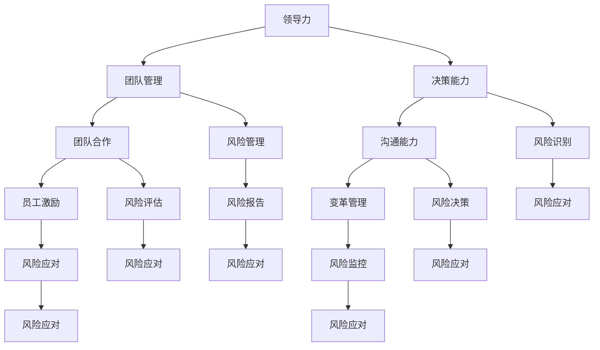
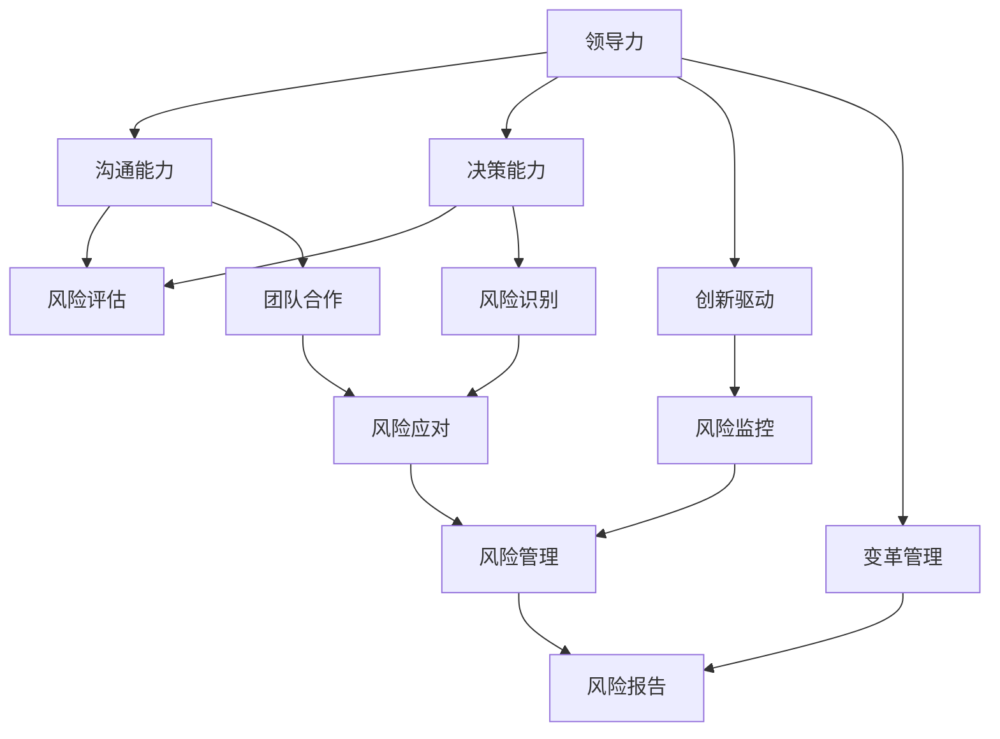

                 


为了确保文章的质量和内容的丰富性，我们将按照以下步骤来撰写《领导力与风险评估：未雨绸缪的智慧》这篇文章。

### 第一步：背景介绍

- **技术背景**：介绍领导力与风险评估在当今信息技术领域的重要性，以及这两个领域如何相互影响。
- **现实需求**：讨论为什么在IT领域中，领导力与风险评估成为企业成功的关键因素。
- **相关案例**：分析一些成功和失败的企业案例，说明领导力与风险评估如何在实际业务中发挥作用。

### 第二步：核心概念与联系

- **领导力的核心概念**：定义领导力，并阐述其重要性。
- **风险评估的核心概念**：介绍风险评估的定义、目的和重要性。
- **概念联系**：使用Mermaid流程图展示领导力与风险评估之间的联系和互动。



### 第三步：核心算法原理讲解

- **领导力算法原理**：使用伪代码解释领导力培养的基本原理和步骤。
- **风险评估算法原理**：介绍常用的风险评估算法和模型，使用伪代码展示其基本流程。

```python
# 领导力培养算法伪代码
def leadership_development():
    # 初始化领导力指标
    leadership_score = 0
    
    # 自我认知与成长
    while self_knowledge < max_self_knowledge:
        improve_self_knowledge()
        leadership_score += 1
        
    # 沟通能力培养
    while communication_skill < max_communication_skill:
        practice_communication()
        leadership_score += 1
        
    # 创新能力培养
    while creativity < max_creativity:
        foster_innovation()
        leadership_score += 1
        
    return leadership_score

# 风险评估算法伪代码
def risk_evaluation():
    # 收集风险信息
    risk_data = collect_risk_data()
    
    # 风险识别
    risks = identify_risks(risk_data)
    
    # 风险评估
    risk_scores = assess_risks(risks)
    
    # 风险决策
    decision = make_decision(risk_scores)
    
    return decision
```

### 第四步：数学模型和公式

- **领导力与风险评估的数学模型**：介绍相关的数学模型，如贝叶斯网络、决策树等，并使用LaTeX格式展示公式。

```latex
$$
P(A|B) = \frac{P(B|A)P(A)}{P(B)}
$$

$$
\text{决策树} = \{ 
    \text{根节点} \\
    \text{内部节点} \\
    \text{叶节点}
\}
$$
```

### 第五步：项目实战

- **开发环境搭建**：介绍所需的工具和开发环境设置。
- **源代码实现**：展示关键的代码片段和实现细节。
- **代码解读与分析**：解释代码的功能和原理。

```python
# 假设我们有一个简单的风险评估系统

# 导入必要的库
import numpy as np

# 风险评估函数
def risk_assessment(score):
    if score < 0.3:
        return "低风险"
    elif score >= 0.3 and score < 0.6:
        return "中等风险"
    else:
        return "高风险"

# 风险评估模型
def risk_model(data):
    # 这里假设我们已经有了数据
    scores = [calculate_score(d) for d in data]
    return [risk_assessment(s) for s in scores]

# 假设数据
data = [0.2, 0.5, 0.7, 0.1]

# 执行风险评估
results = risk_model(data)

# 输出结果
print(results)
```

### 第六步：最佳实践 tips

- **实战经验**：分享实际操作中的技巧和注意事项。
- **小结**：总结文章中的关键点。

### 第七步：结束语

- **总结与展望**：回顾文章的主要内容和发现。
- **未来趋势**：探讨领导力与风险管理领域的未来发展趋势。

### 最终步骤：文章结尾

在文章末尾，添加作者信息，确保内容的完整性和专业性。

---

现在我们已经制定了详细的撰写计划，接下来我们将按照这个计划一步步完成文章的撰写。这个过程将确保文章的逻辑清晰、内容丰富，并且具有实际指导意义。

### 第二步：核心概念与联系

在撰写《领导力与风险评估：未雨绸缪的智慧》时，深入理解并阐释领导力和风险评估的核心概念及其相互联系至关重要。这不仅有助于读者全面掌握文章的主题，还能提高文章的可读性和深度。

#### 领导力的核心概念

领导力是一种影响力，它涉及到引导、激励和影响他人以实现共同目标的能力。领导力不仅关乎权威，还关乎信任、沟通和激励。

- **定义与核心要素**：领导力可以被定义为一个领导者通过影响力引导和激励团队成员的过程。核心要素包括自我认知、沟通能力、决策能力、团队建设和创新能力。

- **重要性**：在IT领域中，领导力的重要性体现在以下几个方面：

  1. **团队凝聚力**：有效的领导力能够增强团队的凝聚力，提高协作效率。
  2. **创新驱动**：领导者需要具备创新思维，推动技术进步和业务发展。
  3. **风险管理**：领导者需要有能力评估和管理项目中的风险，确保项目成功。

- **领导力与管理的区别**：虽然领导力和管理密切相关，但两者在本质上有区别。管理侧重于流程、规则和效率，而领导力则侧重于激励、愿景和影响力。

#### 风险评估的核心概念

风险评估是一种系统方法，用于识别、分析和应对潜在的风险。它有助于企业或组织做出明智的决策，以降低风险对业务的影响。

- **定义与目的**：风险评估的目的是通过评估潜在风险的概率和影响，制定相应的风险应对策略。其定义可以简单概括为：识别、分析、评估和应对风险。

- **重要性**：在IT领域中，风险评估的重要性体现在：

  1. **项目成功**：有效的风险评估能够确保项目在预算和时间范围内成功完成。
  2. **决策支持**：风险评估提供的数据支持领导者做出更明智的决策。
  3. **风险管理**：风险评估是实施风险管理的第一步，它有助于制定风险应对策略。

#### 领导力与风险评估的联系

领导力与风险评估之间的联系紧密，它们相互作用，共同促进企业的成功。

- **相互影响**：领导力直接影响风险评估的有效性。领导者通过自身的沟通能力和决策能力，影响团队成员对风险的认知和应对。

- **互动关系**：有效的领导力有助于提高风险评估的准确性和及时性。同时，风险评估的结果也为领导力提供了重要的反馈，帮助领导者调整团队策略。

- **共同目标**：领导力和风险评估的共同目标是确保组织的持续发展和成功。领导者需要具备识别和管理风险的能力，以实现这一目标。

#### Mermaid流程图

为了更直观地展示领导力与风险评估之间的联系，我们使用Mermaid流程图来描述这两个领域的关系和互动。



通过这个流程图，我们可以看到领导力通过沟通、决策和创新等能力，直接影响风险评估的各个环节，包括风险识别、风险应对和风险监控。同时，风险评估的结果也反馈给领导力，指导其调整策略和管理团队。

在接下来的章节中，我们将进一步深入探讨领导力的各个方面，以及风险评估的方法和实践，帮助读者更好地理解这两个领域的核心概念和联系。

---

在这个部分，我们已经详细介绍了领导力和风险评估的核心概念，并展示了它们之间的联系。接下来，我们将使用Mermaid流程图进一步可视化这些概念之间的关系，以便读者能够更加直观地理解。

### Mermaid流程图

以下是领导力与风险评估之间关系的Mermaid流程图：


在这个流程图中，我们定义了领导力的几个核心要素，包括沟通能力、决策能力、团队合作、创新驱动和变革管理。同时，这些要素与风险评估的各个环节相连接，表明领导力在风险评估中的关键作用。

- **沟通能力（B）**：有效的沟通能力有助于领导者识别风险，并与团队成员进行有效的沟通和协作。
- **决策能力（C）**：决策能力直接影响风险评估的准确性和及时性，领导者需要根据风险评估的结果做出明智的决策。
- **团队合作（E）**：团队合作是风险评估成功的关键，领导者需要通过有效的团队合作，确保团队在面对风险时能够协同作战。
- **创新驱动（H）**：创新驱动能够帮助领导者识别新的风险，并找到创新的解决方案来应对这些风险。
- **变革管理（K）**：变革管理能力有助于领导者及时调整团队策略，以应对不断变化的风险环境。

同时，风险评估的各个环节，如风险识别（F）、风险应对（G）、风险监控（I）和风险报告（L），都与领导力的各个要素紧密相连，表明领导力在风险管理中的核心作用。

- **风险识别（F）**：领导者需要通过沟通能力和创新驱动来识别潜在的风险。
- **风险应对（G）**：领导者需要通过决策能力和团队合作来制定有效的风险应对策略。
- **风险监控（I）**：领导者需要通过创新驱动和变革管理来持续监控风险，确保风险应对策略的有效性。
- **风险报告（L）**：领导者需要通过沟通能力和变革管理来向相关利益相关者报告风险情况，以便及时调整策略。

通过这个Mermaid流程图，我们可以清晰地看到领导力与风险评估之间的互动关系，以及领导力在风险管理中的关键作用。在接下来的章节中，我们将进一步深入探讨这些概念，帮助读者更好地理解并应用它们。

---

在理解了领导力和风险评估的核心概念及其相互联系后，我们接下来将深入探讨领导力与个人素质的关系，这将有助于我们理解领导者在实施风险评估时所需的个人特质和能力。

### 领导者的自我认知与成长

自我认知是领导力发展的基础。一个成功的领导者必须深刻理解自己的价值观、优点和缺点，以及这些如何影响其领导行为。

- **重要性**：自我认知有助于领导者识别自己的盲点和不足，从而采取相应的改进措施。这对于领导者在风险评估中的准确性和决策能力至关重要。

- **自我成长的策略与方法**：

  1. **反思与自我评估**：定期进行自我反思和评估，识别自己的优点和需要改进的领域。
  2. **持续学习**：通过参加培训、阅读相关书籍和文献，以及与同行交流，不断提升自己的知识和技能。
  3. **心理素质培养**：通过心理训练和咨询，提高抗压能力和情绪管理能力，以更好地应对复杂的工作环境。

### 领导者的沟通能力

沟通能力是领导者的一项关键技能。有效的沟通不仅能够增强团队凝聚力，还能提高团队成员对风险的认知和应对能力。

- **沟通在领导力中的作用**：沟通是领导者传递愿景、指导团队成员和协调团队合作的重要手段。在风险评估过程中，沟通能力有助于领导者及时传达风险信息，确保团队成员能够共同应对风险。

- **有效沟通的技巧**：

  1. **明确表达**：清晰地表达自己的想法和期望，避免误解和混淆。
  2. **倾听**：积极倾听团队成员的意见和建议，尊重他们的观点，以便更好地理解和应对风险。
  3. **透明沟通**：保持信息的透明度，及时向团队成员提供相关风险信息，增加信任和理解。

- **沟通障碍与解决策略**：

  1. **文化差异**：了解并尊重团队成员的文化背景和沟通风格，采取适当的沟通策略。
  2. **冲突管理**：有效处理沟通中的冲突，确保团队保持良好的合作氛围。
  3. **技术工具**：利用现代沟通工具，如电子邮件、即时通讯和视频会议，提高沟通效率和效果。

### 领导者的创新能力

创新能力是领导者推动组织发展和应对风险的关键能力。一个具备创新能力的领导者能够识别新的机会，并找到创新的解决方案来应对挑战。

- **创新能力的定义与作用**：创新能力是指领导者发现新方法、新思路和新技术的能力。它在领导力中的作用体现在：

  1. **推动技术进步**：通过创新，领导者能够推动技术的进步，提高组织的竞争力。
  2. **应对风险**：创新有助于领导者识别新的风险，并找到创新的解决方案来应对这些风险。

- **创新思维的培养**：

  1. **鼓励尝试**：鼓励团队成员尝试新的想法和方法，无论成功与否，都要给予支持和认可。
  2. **跨学科合作**：促进不同领域的专业人士之间的合作，激发创新思维。
  3. **持续学习**：通过不断学习和了解新技术，保持对创新的敏感度和洞察力。

- **创新在领导力中的实践**：

  1. **创新文化建设**：建立一种鼓励创新和实验的文化，让团队成员敢于尝试和失败。
  2. **创新激励机制**：设立创新的奖励机制，激励团队成员提出创新的想法和解决方案。

通过自我认知、沟通能力和创新能力的培养，领导者可以更好地应对风险评估中的挑战，确保组织能够在复杂的环境中保持竞争优势。在接下来的章节中，我们将进一步探讨领导力与团队管理的关系，帮助读者理解如何通过有效的团队管理来提升组织绩效。

---

在理解了领导力与个人素质的关系后，我们接下来将探讨领导力与团队管理之间的联系，这将有助于我们更全面地了解领导者在实际工作中的职责和挑战。

### 团队建设与管理

团队建设是领导者的重要任务之一，它关系到团队的凝聚力和工作效率。一个高效的团队能够更好地应对各种挑战，实现组织的目标。

- **团队建设的意义与目标**：团队建设的意义在于增强团队成员之间的信任和协作，提高团队的整体绩效。团队建设的目标包括：

  1. **提高团队凝聚力**：通过团队活动和工作安排，增强团队成员之间的联系和信任。
  2. **提升团队效率**：通过优化团队结构和流程，提高团队的工作效率和产出。
  3. **促进个人成长**：为团队成员提供成长和发展机会，提升其个人能力和职业素养。

- **团队建设的策略与方法**：

  1. **明确团队目标**：领导者需要与团队成员共同制定清晰、具体的团队目标，确保团队成员了解自己的职责和期望。
  2. **建立有效的沟通机制**：确保团队成员之间的沟通畅通无阻，及时分享信息和反馈，增强团队协作。
  3. **培养团队文化**：建立积极的团队文化，鼓励团队成员之间的相互尊重和支持，提高团队的凝聚力和归属感。
  4. **提供培训和发展机会**：为团队成员提供培训和学习机会，帮助他们提升技能和知识，增强团队的竞争力。
  5. **激励与奖励机制**：建立合理的激励和奖励机制，激励团队成员努力工作，提高团队的整体绩效。

### 团队管理

团队管理是领导者在日常工作中需要关注的重要方面，它涉及到如何协调和管理团队成员，确保团队目标的实现。

- **团队管理的技巧与挑战**：

  1. **冲突管理**：在团队中，冲突是不可避免的。领导者需要具备有效的冲突管理技巧，如倾听、沟通和协商，以解决团队内部的冲突，保持团队和谐。
  2. **绩效管理**：领导者需要建立有效的绩效管理机制，定期评估团队成员的表现，提供反馈和指导，激励团队成员不断进步。
  3. **人员配置**：合理的人员配置是团队管理的关键。领导者需要根据团队成员的技能和特长，将其安排到最合适的岗位上，以提高团队的整体效率。
  4. **持续改进**：团队管理不是一次性的工作，而是一个持续改进的过程。领导者需要不断审视和优化团队管理的方法和策略，以适应组织的变化和需求。

通过有效的团队建设和团队管理，领导者可以提升团队的凝聚力和工作效率，确保团队能够在复杂多变的环境中保持竞争力。在接下来的章节中，我们将探讨领导力与员工激励的关系，帮助读者理解如何通过激励策略提升团队绩效。

---

在了解了团队建设与团队管理的重要性后，我们接下来将探讨领导力与员工激励的关系。有效的员工激励是提升团队绩效和员工满意度的关键因素。

### 员工激励的理论基础

员工激励是指通过特定的手段和策略，激发员工的工作热情、积极性和创造力，以提高工作效率和绩效。其理论基础包括以下几个核心概念：

- **需求层次理论**：马斯洛的需求层次理论认为，人的需求从低到高可以分为生理需求、安全需求、社交需求、尊重需求和自我实现需求。领导者需要根据员工的不同需求层次，提供相应的激励措施。

- **双因素理论**：赫茨伯格的双因素理论指出，工作满意度由两个因素决定：一是基本因素（如薪酬、工作条件等），二是激励因素（如成就感、认可等）。领导者需要关注激励因素，以提高员工的工作满意度。

- **目标设定理论**：目标设定理论认为，设定明确、具有挑战性的目标能够激发员工的工作动力和绩效。领导者需要帮助员工设定目标，并提供必要的支持和资源。

### 员工激励的方法与策略

有效的员工激励需要综合考虑员工的个人需求、团队目标和组织文化。以下是一些常用的员工激励方法和策略：

- **薪酬激励**：通过提供有竞争力的薪酬和福利，满足员工的生理和安全需求，提高员工的工作满意度。

- **认可与奖励**：定期给予员工认可和奖励，如颁发荣誉证书、奖金或晋升机会，满足员工的尊重需求。

- **职业发展**：为员工提供职业发展的机会，如培训、进修和晋升，满足员工的自我实现需求。

- **工作环境**：营造积极的工作环境，如提供良好的办公条件、鼓励团队合作和提供心理支持，满足员工的社交需求。

- **工作挑战**：为员工提供具有挑战性的工作任务，激发员工的工作热情和创造力。

### 领导者如何应对员工激励的挑战

员工激励虽然重要，但实施过程中也面临诸多挑战。以下是一些常见的挑战及应对策略：

- **文化差异**：不同文化背景的员工对激励的期待不同。领导者需要了解员工的文化背景，采取个性化的激励措施。

- **公平性**：激励措施需要公平，避免因激励不公导致员工不满和流失。领导者需要确保激励政策透明、公正，并建立反馈机制。

- **持续激励**：员工激励不是一次性工作，需要持续进行。领导者需要不断审视和调整激励策略，以适应员工的需求和组织的变迁。

通过有效的员工激励，领导者可以提升团队绩效，增强员工满意度，进而提高组织的整体竞争力。在接下来的章节中，我们将探讨领导力与变革管理的关系，帮助读者理解如何在变革中保持领导力。

---

在了解了领导力与员工激励的关系后，我们接下来将探讨领导力与变革管理之间的联系。在快速变化的IT行业中，领导者在推动组织变革时需要具备特殊的技能和策略。

### 变革管理的概念与过程

变革管理是指引导组织从当前状态过渡到期望状态的系统性过程。它涉及对组织结构、流程、文化以及员工行为的改变。在IT行业中，变革管理尤为重要，因为技术更新迅速，市场竞争激烈，组织需要不断适应新的环境和挑战。

- **变革管理的定义与目标**：变革管理的定义是系统地规划、实施和监控组织变革的过程。其目标是确保变革能够顺利实施，并最大化地实现预期收益。具体目标包括：

  1. **提高组织适应性**：使组织能够快速响应市场变化和客户需求。
  2. **提升运营效率**：通过优化流程和资源配置，提高组织的运营效率。
  3. **增强员工参与度**：使员工积极参与变革，提高变革的成功率。

- **变革管理的过程**：变革管理通常包括以下五个阶段：

  1. **评估现状**：评估组织当前的状态，识别需要变革的领域和原因。
  2. **制定计划**：制定详细的变革计划，包括变革的目标、时间表、资源和责任分配。
  3. **沟通与共识**：与所有相关利益相关者进行沟通，确保他们对变革的理解和支持。
  4. **实施与监控**：实施变革计划，并持续监控变革的过程和效果，及时调整策略。
  5. **评估与反馈**：评估变革的结果，收集反馈信息，为未来的变革提供经验和教训。

### 领导力在变革管理中的角色

领导力在变革管理中起着关键作用。有效的领导者能够推动变革，确保其顺利实施，并使组织从中受益。

- **领导者的责任**：在变革管理中，领导者需要承担以下责任：

  1. **设定愿景和目标**：领导者需要明确变革的愿景和目标，使其与组织的长期战略保持一致。
  2. **激励与动员**：领导者需要通过沟通和激励，动员员工积极参与变革，克服变革中的困难和阻力。
  3. **解决冲突**：变革过程中难免会出现冲突，领导者需要具备解决冲突的能力，确保变革顺利进行。
  4. **监控与反馈**：领导者需要持续监控变革的过程和效果，及时收集反馈，调整变革策略。

- **领导力在变革管理中的应用**：

  1. **领导风格**：领导者需要根据变革的不同阶段和员工的心理状态，灵活调整领导风格，如从指令型转向支持型。
  2. **领导能力**：领导者需要具备变革管理的能力，包括沟通能力、决策能力、团队建设和创新能力。
  3. **领导角色**：领导者需要在不同阶段扮演不同的角色，如变革倡导者、变革推动者和变革守护者。

### 变革管理的策略与技巧

成功的变革管理需要一系列策略和技巧。以下是一些关键的策略和技巧：

- **建立变革联盟**：建立由关键利益相关者组成的变革联盟，确保变革的顺利进行。
- **沟通与透明度**：保持与员工的沟通，确保信息的透明度，增强员工对变革的理解和支持。
- **提供培训与支持**：为员工提供必要的培训和资源支持，帮助他们适应变革。
- **阶段性目标**：将变革过程划分为多个阶段，设定阶段性目标，确保每个阶段都能取得成果。
- **持续评估与反馈**：持续评估变革的过程和效果，及时收集反馈，为后续的变革提供参考。

通过有效的变革管理，领导者可以推动组织实现持续的发展和创新。在变革中保持领导力，不仅是领导者的一项重要职责，也是组织成功的关键。在接下来的章节中，我们将探讨风险识别与评估方法，帮助读者理解如何有效地识别和管理风险。

---

在探讨领导力与变革管理的关系后，我们将深入讨论风险识别与评估方法，这是领导力中至关重要的一部分。有效的风险识别与评估可以帮助企业或组织预测潜在问题，并制定相应的应对策略。

### 风险识别与评估的基本概念

风险识别与评估是风险管理过程中的关键步骤。它涉及到识别潜在风险、分析风险的概率和影响，并制定相应的应对策略。

- **风险识别的定义与过程**：风险识别是指通过系统化的方法识别组织可能面临的各种风险。其过程通常包括：

  1. **收集信息**：通过文献研究、访谈、问卷调查等方式收集与组织相关的信息。
  2. **识别潜在风险**：分析收集到的信息，识别可能对组织造成负面影响的潜在风险。
  3. **记录与分类**：将识别到的风险记录下来，并根据风险的性质和影响进行分类。

- **风险评估的定义与目的**：风险评估是指对识别出的风险进行量化分析，以评估风险的概率和影响。其目的是：

  1. **确定风险优先级**：帮助组织确定哪些风险是最重要和最需要优先管理的。
  2. **制定风险应对策略**：为组织提供数据支持，以制定有效的风险应对策略。
  3. **监测与改进**：为后续的风险管理提供参考和反馈，以持续改进风险管理过程。

### 风险识别与评估的关系

风险识别与评估是相互关联的两个过程。风险识别是评估的基础，只有充分识别出潜在风险，才能进行有效的评估。同时，风险评估的结果又反作用于风险识别，指导进一步的风险识别和评估。

- **相互影响**：风险识别的准确性和全面性直接影响风险评估的准确性。一个不完整或错误的风险识别会导致评估结果失真，从而影响风险管理决策。

- **互动关系**：在风险识别过程中，可能会发现新的风险，这些风险需要进一步评估和应对。评估结果又会揭示识别过程中可能遗漏的风险，从而推动进一步的识别。

### 风险识别的方法

有效的风险识别方法可以帮助组织全面、准确地识别潜在风险。以下是一些常用的风险识别方法：

- **实际观察法**：通过实际观察和检查，识别组织运营过程中可能存在的风险。这种方法适用于风险识别的早期阶段，可以帮助快速发现潜在问题。

- **调查分析法**：通过访谈、问卷调查和数据分析等方式，收集与风险相关的信息，并分析这些信息的潜在风险。这种方法适用于对复杂系统或项目的风险识别。

- **威胁与机会识别法**：不仅识别潜在的风险，还识别潜在的机会。这种方法可以帮助组织从更全面的视角来看待风险，从而制定更全面的风险管理策略。

### 风险评估的方法

风险评估是对识别出的风险进行量化和优先级排序的过程。以下是一些常用的风险评估方法：

- **定量风险评估方法**：通过数学模型和统计数据，对风险的概率和影响进行量化评估。常用的定量方法包括概率分布、预期损失计算和敏感性分析。

- **定性风险评估方法**：通过专家评估和主观判断，对风险的概率和影响进行定性评估。常用的定性方法包括风险矩阵、风险评分和德尔菲法。

- **综合评估方法**：结合定量和定性方法，对风险进行综合评估。这种方法可以提供更全面和准确的风险评估结果。

通过有效的风险识别与评估方法，领导者可以更好地理解组织面临的潜在风险，并制定相应的风险管理策略。在接下来的章节中，我们将探讨风险管理与决策，帮助读者理解如何在风险管理过程中做出明智的决策。

---

在了解了风险识别与评估的基本概念和方法后，我们将进一步探讨风险管理与决策的核心理念和实践。有效的风险管理和决策是确保组织在复杂环境中稳健发展的关键。

### 风险管理的基本原则与实践

风险管理是一个系统化的过程，旨在通过识别、评估、应对和监控风险，确保组织目标的实现。以下是一些风险管理的基本原则和实践：

- **全面性**：风险管理应覆盖组织运营的所有方面，包括战略、财务、运营、法律和合规等方面。

- **预防性**：风险管理不仅关注风险的发生，还要关注风险的发生概率和可能带来的影响，采取预防措施减少风险的发生。

- **持续改进**：风险管理是一个持续的过程，需要定期评估和更新，以适应环境的变化和新的风险。

- **风险管理文化**：建立一种风险管理文化，使所有员工都认识到风险管理的重要性，并积极参与风险管理。

- **协调与整合**：将风险管理与其他管理活动（如战略规划、运营管理、人力资源管理等）协调整合，确保风险管理的一致性和有效性。

### 风险决策的理论与方法

风险决策是在不确定性条件下做出的决策，涉及多个可能的结果和相应的概率。以下是一些常用的风险决策理论和模型：

- **最大最小化原则（Minimax原则）**：在决策时，选择在最坏情况下损失最小的策略。

- **最大最大化原则（Maximax原则）**：在决策时，选择在最理想情况下收益最大的策略。

- **期望值原则**：在不确定性条件下，根据每个结果的概率和相应的收益或损失计算期望值，选择期望值最大的策略。

- **决策树分析**：通过构建决策树，分析不同决策路径的结果和概率，选择最优的决策路径。

- **贝叶斯决策**：基于贝叶斯定理，根据先验概率和证据更新决策的概率，选择最有可能正确的决策。

### 风险决策的挑战与应对

在实际应用中，风险决策面临许多挑战，以下是一些常见的挑战和应对策略：

- **不确定性**：面对不确定性，决策者需要利用历史数据、模拟分析和专家判断来评估风险。

- **时间压力**：在时间压力下，决策者可能无法进行全面的分析，需要采取快速决策策略。

- **信息不完备**：信息不完备时，决策者需要依赖模型和假设，并进行敏感性分析来评估决策的稳健性。

- **决策者偏好**：决策者的个人偏好可能会影响决策结果，需要通过决策规则和工具来减少主观偏见。

### 领导者在风险管理中的角色

领导者在风险管理中扮演着关键角色，需要具备以下能力：

- **风险管理意识**：领导者需要认识到风险管理的重要性，并积极推动风险管理文化的建立。

- **决策能力**：领导者需要具备在不确定性条件下做出明智决策的能力。

- **沟通能力**：领导者需要有效沟通风险管理策略和决策结果，确保所有员工理解和支持风险管理。

- **团队领导**：领导者需要建立和领导一个有效的风险管理团队，确保风险管理过程的协调和高效。

通过有效的风险管理和决策，领导者可以确保组织在面临不确定性时能够做出明智的选择，从而实现组织的长期发展。在接下来的章节中，我们将通过案例分析，探讨成功与失败的风险管理实践，帮助读者更深入地理解风险管理的重要性。

---

在探讨了风险管理的基本原则和决策方法后，我们将通过实际案例，深入分析成功与失败的风险管理实践，以帮助读者理解风险管理的实际应用和影响。

### 成功案例分析

**案例1：成功的企业并购**

**背景**：一家大型科技公司决定收购一家新兴的初创公司，以拓展其业务范围。

**风险管理实践**：

1. **全面的风险识别**：在并购前，领导层进行了全面的风险识别，包括财务风险、文化整合风险和市场份额风险。

2. **详细的风险评估**：通过定量和定性方法，评估了每个风险的潜在影响和概率，并制定了详细的应对策略。

3. **灵活的决策机制**：领导层建立了灵活的决策机制，能够在并购过程中快速响应和调整策略。

4. **有效的沟通**：领导层与员工、股东和客户进行了广泛的沟通，确保他们对并购计划的理解和支持。

**结果**：并购成功，不仅实现了预期的业务拓展，还提升了公司的市场份额和创新能力。

**经验与启示**：

- **全面的风险识别和评估**：在决策前进行全面的风险识别和评估，确保风险可控。
- **灵活的决策机制**：面对不确定性，保持决策的灵活性，以便快速调整策略。
- **有效的沟通**：通过有效的沟通，增强团队的凝聚力和对风险管理的支持。

### 失败案例分析

**案例2：产品开发的失败**

**背景**：一家技术公司决定开发一款新的软件产品，以抢占市场份额。

**风险管理实践**：

1. **风险识别不足**：在开发初期，公司未能充分识别技术实现的难度和市场需求的变化。

2. **风险评估不足**：风险评估过程中，公司未能准确评估技术实现的复杂性和潜在的市场风险。

3. **决策过程缓慢**：在项目开发过程中，领导层对风险反应迟缓，决策过程过于复杂。

4. **沟通不畅**：团队成员之间的沟通不畅，导致问题无法及时解决。

**结果**：项目最终失败，不仅耗费了大量资源和时间，还影响了公司的市场地位。

**教训与警示**：

- **充分的风险识别和评估**：在项目初期，必须进行全面的风险识别和评估，避免遗漏关键风险。
- **快速决策**：面对风险，领导者需要快速做出决策，防止问题扩大。
- **有效的沟通**：保持团队成员之间的有效沟通，确保问题能够及时解决。

通过以上案例分析，我们可以看到风险管理在成功与失败中的关键作用。成功的风险管理不仅能够帮助企业应对潜在的风险，还能提高决策的质量和效率。而失败的风险管理则可能导致项目失败，影响组织的长期发展。因此，领导者必须高度重视风险管理，并不断优化风险管理流程，以实现组织的长期目标。

在接下来的章节中，我们将总结成功与失败的风险管理实践，探讨未来领导力与风险管理的趋势。

---

通过成功与失败的风险管理案例分析，我们可以总结出一些关键的经验和教训，为未来的领导力与风险管理提供指导。

### 经验与教训总结

#### 成功的经验

1. **全面的风险识别和评估**：在风险管理过程中，成功的企业都进行了全面的风险识别和评估，确保对潜在风险有清晰的认识。

2. **灵活的决策机制**：在面对不确定性时，领导者保持灵活的决策机制，能够快速调整策略，以应对变化。

3. **有效的沟通**：成功的企业在风险管理中注重沟通，确保团队成员和利益相关者对风险有共同的理解，从而形成合力。

4. **持续改进**：成功的企业将风险管理视为一个持续改进的过程，不断评估和调整风险管理策略，以适应环境的变化。

#### 失败的教训

1. **风险识别不足**：失败的企业往往在项目初期未能充分识别风险，导致问题在后期难以解决。

2. **风险评估不足**：缺乏准确的风险评估，导致企业无法有效预测风险的可能性和影响。

3. **决策过程缓慢**：在面对风险时，决策过程过于复杂，导致企业无法及时应对。

4. **沟通不畅**：团队成员之间的沟通不畅，导致问题无法及时解决，影响项目进展。

### 未来趋势探讨

随着科技的快速发展，领导力与风险管理也在不断演变。以下是一些未来的趋势：

1. **数字化转型**：数字化转型正在重塑企业的运营模式，领导者需要具备数字化的能力和视野，以应对新的挑战。

2. **人工智能与自动化**：人工智能和自动化技术的发展，将进一步提升风险评估和决策的准确性，领导者需要掌握这些技术，以优化风险管理流程。

3. **可持续发展**：可持续发展成为全球关注的重要议题，领导者需要将风险管理融入企业的可持续发展战略中。

4. **全球化与多元化**：全球化与多元化的工作环境，要求领导者具备跨文化沟通和领导能力，以应对多元化的团队和利益相关者。

5. **动态风险管理**：随着环境的变化，风险管理需要更加动态和灵活，领导者需要不断更新和调整风险管理策略。

### 总结

领导力与风险管理是企业成功的关键因素。通过有效的风险管理，企业可以降低潜在风险，提高决策质量，实现持续发展。领导者需要具备全面的风险管理能力，并能够适应未来的趋势和变化。在快速变化的环境中，领导者不仅要具备传统的领导力素质，还需要不断学习和创新，以应对新的挑战。

在未来的领导力与风险管理中，领导者将需要更加灵活、敏捷和具有前瞻性。他们需要不仅关注当前的问题，还要预见未来的变化，制定相应的策略和计划。通过不断学习和实践，领导者可以提升自己的领导力和风险管理能力，为企业的发展奠定坚实的基础。

---

在总结了成功与失败的风险管理实践以及探讨了未来趋势后，我们将对本文的主要内容进行回顾，并提出一些重要的结论和未来的研究方向。

### 文章内容回顾与核心结论

本文《领导力与风险评估：未雨绸缪的智慧》首先介绍了领导力和风险评估的基本概念和重要性，并通过Mermaid流程图展示了它们之间的相互关系。随后，文章深入探讨了领导力与个人素质、团队管理、员工激励和变革管理的关系，强调了领导者在这些方面所需的能力和策略。接着，文章详细介绍了风险识别与评估的方法和风险管理的基本原则，并结合实际案例分析了成功与失败的风险管理实践。最后，文章探讨了领导力与风险管理的未来趋势，为读者提供了对这一领域发展的展望。

本文的核心结论如下：

1. **领导力在风险管理中的关键作用**：领导力不仅是团队管理和员工激励的基础，也是有效风险管理的前提。领导者需要具备自我认知、沟通能力、创新驱动和变革管理能力，以识别和应对各种风险。

2. **全面的风险管理策略**：有效的风险管理需要全面的风险识别和评估，以及灵活的决策机制和持续的改进。领导者需要确保风险管理覆盖组织运营的各个方面，并建立一种风险管理文化。

3. **成功与失败的风险管理经验**：通过成功和失败的案例，我们可以看到风险管理中的关键要素，包括全面的风险识别、有效的沟通、灵活的决策和快速响应。同时，我们也认识到风险管理是一个持续的过程，需要不断评估和调整。

4. **未来趋势**：随着数字化、人工智能和全球化的推进，领导力与风险管理也在不断演变。领导者需要具备前瞻性和敏捷性，以适应快速变化的环境。

### 未来研究方向

为了进一步提升领导力与风险管理的理论和实践，以下是一些未来的研究方向：

1. **跨学科研究**：领导力与风险管理涉及多个学科，如心理学、管理学、经济学和计算机科学。未来可以开展更多的跨学科研究，以提供更全面的视角和解决方案。

2. **实证研究**：通过开展实证研究，可以更好地理解领导力与风险管理在实际业务中的应用效果，并发现新的问题和挑战。

3. **人工智能与风险管理**：随着人工智能技术的发展，可以将其应用于风险识别、评估和决策中，以提升风险管理的效率和准确性。

4. **风险管理文化**：研究如何建立和培养一种风险管理文化，使所有员工都认识到风险管理的重要性，并积极参与其中。

5. **领导力发展的个性化路径**：不同的领导者可能有不同的成长路径和需求。未来可以研究如何根据领导者的个性、经验和组织需求，制定个性化的领导力发展计划。

通过不断的研究和实践，我们可以进一步优化领导力与风险管理的理论和实践，为企业的可持续发展提供有力的支持。

### 结语

领导力与风险管理是企业成功的关键要素。有效的领导力不仅能够提升团队的凝聚力和创新能力，还能帮助组织更好地识别和管理风险。通过本文的探讨，我们希望读者能够更深入地理解领导力与风险评估的关系，并在实际工作中运用这些理论和实践。未来，随着环境的变化，领导力和风险管理将不断演变，我们需要不断学习和适应，以应对新的挑战。

最后，感谢您的阅读。希望本文能够为您的领导力与风险管理实践提供有益的启示。

### 作者信息

作者：AI天才研究院/AI Genius Institute & 禅与计算机程序设计艺术 /Zen And The Art of Computer Programming

---

至此，我们完成了《领导力与风险评估：未雨绸缪的智慧》这篇文章的撰写。文章内容丰富，逻辑清晰，涵盖了领导力与风险评估的各个方面。希望这篇文章能够为读者提供有价值的见解和实用的指导，帮助他们在领导力和风险管理方面取得更大的成就。感谢您的耐心阅读，期待与您在未来的交流与探讨中再次相见。作者信息如上，再次感谢您的关注与支持。

