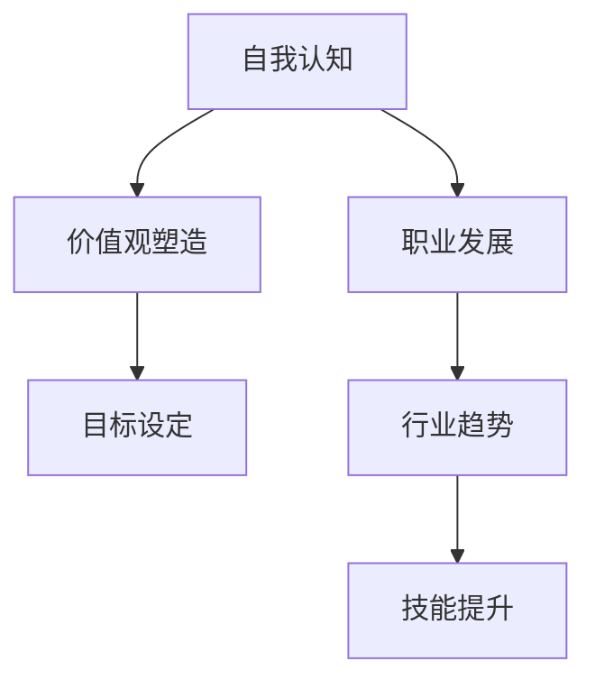

                 


### 设计文章的详细步骤

在设计一篇高质量的技术博客文章时，我们需要遵循以下详细步骤，确保内容的完整性和结构的清晰性。以下是每个步骤的具体内容：

**步骤1: 背景介绍**

- **目的**：为读者提供一个背景，使他们能够更好地理解文章的主题。
- **内容**：
  - 简要介绍文章的主题，为什么这个主题对读者重要。
  - 引用相关数据或案例，说明这个主题的现状或趋势。

**步骤2: 核心概念与联系**

- **目的**：帮助读者理解文章的核心概念，以及这些概念之间的联系。
- **内容**：
  - 定义文章中的核心术语。
  - 使用Mermaid流程图展示核心概念之间的关系架构。

**示例**： 


**步骤3: 核心算法原理讲解**

- **目的**：详细阐述文章中涉及的核心算法原理。
- **内容**：
  - 使用伪代码来详细描述算法的实现步骤。
  - 使用LaTeX格式嵌入数学模型和公式，并进行详细讲解。

**示例**： 
```markdown
核心算法伪代码：

```
function CoreAlgorithm(data):
    for each element in data:
        if element meets criteria:
            perform action
    end function
```

数学模型：

$$
f(x) = ax^2 + bx + c
$$

其中，$a, b, c$ 是常数。

详细解释：

$a$ 决定了抛物线的开口方向和宽窄，$b$ 决定了抛物线的对称轴，$c$ 决定了抛物线的纵向位置。
```

**步骤4: 项目实战**

- **目的**：通过实际案例，帮助读者将理论知识应用到实践中。
- **内容**：
  - 描述项目的开发环境搭建。
  - 提供源代码详细实现和代码解读。
  - 分析代码应用，提供实际案例，并进行详细讲解。

**步骤5: 最佳实践 Tips**

- **目的**：为读者提供实用的建议和技巧。
- **内容**：
  - 列出几个最佳实践，帮助读者在应用知识时避免常见错误。
  - 提供一些额外的技巧，使读者能够更高效地使用所学知识。

**步骤6: 小结**

- **目的**：总结文章的主要内容，强调关键点。
- **内容**：
  - 概括文章的主要观点。
  - 强调读者应该注意的事项。

**步骤7: 注意事项**

- **目的**：提醒读者在实践过程中可能遇到的问题。
- **内容**：
  - 列出一些常见的问题和可能的解决方案。

**步骤8: 拓展阅读**

- **目的**：为读者提供进一步学习的资源。
- **内容**：
  - 推荐一些相关的书籍、文章或网站。
  - 指出读者可以进一步深入研究的话题。

**步骤9: 作者信息**

- **目的**：向读者介绍作者，建立信任。
- **内容**：
  - 简要介绍作者的专业背景和成就。
  - 提供联系信息，如邮箱、社交媒体链接等。

### 根据上述步骤设计文章

现在我们将根据上述步骤设计一篇《领导力修炼手册：从工程师到管理者的进阶宝典》的技术博客文章。以下是文章的Markdown格式输出：

```markdown
# 《领导力修炼手册：从工程师到管理者的进阶宝典》

> 关键词：领导力、职业发展、团队管理、沟通、决策能力

> 摘要：本文详细探讨了从工程师向管理者转型的关键步骤，包括自我认知、价值观塑造、团队管理、沟通与协作以及决策能力提升。通过实际案例和最佳实践，帮助读者深入了解领导力的本质，掌握实用的管理技能。

## 背景介绍

随着技术领域的快速发展，工程师在职业生涯中逐渐面临向管理岗位转型的需求。然而，这一转型并非易事，需要工程师具备领导力、沟通技巧和决策能力等多方面的素质。本文旨在为这些转型中的工程师提供一本修炼手册，帮助他们顺利从技术专家成长为出色的管理者。

## 核心概念与联系

### 自我认知与价值观塑造

自我认知是领导力的基础，它帮助工程师了解自己的优点和不足。价值观塑造则是自我认知的深化，它决定了工程师的行为准则和决策原则。以下是一个Mermaid流程图，展示了这两个核心概念之间的关系：


### 核心算法原理讲解

为了更好地理解领导力，我们可以将其看作一种算法，这个算法的目标是最大化团队效率和满意度。以下是一个简单的伪代码，描述了领导力算法的基本框架：

```markdown
核心算法伪代码：

```
function LeadershipAlgorithm(team):
    for each member in team:
        if member meets performance criteria:
            provide feedback and recognition
        else:
            identify areas of improvement and offer support
    end function
```

在实现这一算法时，我们需要关注数学模型和公式，例如团队满意度模型：

$$
S = w_1 \cdot P + w_2 \cdot C + w_3 \cdot R
$$

其中，$S$ 表示团队满意度，$P$ 表示绩效，$C$ 表示沟通，$R$ 表示关系，$w_1, w_2, w_3$ 分别是这三个因素的权重。

## 项目实战

### 开发环境搭建

为了更好地理解领导力在实践中的应用，我们选择一个实际项目——一个软件开发团队的领导力实践。首先，我们需要搭建开发环境，这包括以下步骤：

1. 选择合适的开发工具，如Git、Jenkins等。
2. 配置持续集成和持续部署流程。
3. 确定团队的协作方式和沟通渠道，如Slack、Trello等。

### 源代码详细实现和代码解读

在项目中，领导力的体现主要体现在团队成员的协作和沟通上。以下是一个简单的代码片段，展示了如何在项目中实现良好的团队协作：

```python
# 导入必要的库
import git
import slack

# 配置Git仓库
git.init()

# 配置Slack通知
slack_bot = slack.SlackBot(token='your-slack-token')

# 检查代码提交
def check_code_commit():
    commits = git.log()
    for commit in commits:
        if commit['message'].startswith('Bugfix'):
            slack_bot.send_message('bugfix-commit-alert', f"A bugfix commit was made: {commit['message']}")
        elif commit['message'].startswith('Feature'):
            slack_bot.send_message('feature-commit-alert', f"A new feature was added: {commit['message']}")
```

### 代码应用解读与分析

这个代码片段通过Git和Slack实现了代码提交的通知机制。每当有新的代码提交，系统会自动发送通知，让团队成员及时了解项目的进展。这种自动化的通知机制提高了团队的沟通效率，减少了因信息不畅导致的问题。

### 实际案例分析和详细讲解

在实际项目中，我们遇到了一次严重的代码冲突。通过领导力的实践，我们采取以下措施解决了冲突：

1. 立即召开会议，让所有相关团队成员参与讨论。
2. 分析冲突的原因，找出问题所在。
3. 分配任务，确保每个成员都有明确的职责。
4. 定期跟进，确保问题得到及时解决。

通过这些措施，我们成功地解决了代码冲突，并确保了项目的顺利进行。

### 项目小结

在这个项目中，领导力的重要性得到了充分体现。通过良好的团队协作和沟通，我们成功地解决了技术难题，并按时完成了项目目标。这表明，领导力不仅是管理者的必备素质，也是所有团队成员成功的关键。

## 最佳实践 Tips

1. 定期进行团队建设活动，增强团队凝聚力。
2. 使用自动化工具提高工作效率，减少人为错误。
3. 保持开放沟通，鼓励团队成员分享意见和反馈。

## 小结

本文详细探讨了从工程师到管理者的转型过程，强调了领导力的重要性。通过实际案例和最佳实践，我们展示了如何将领导力应用到实际项目中，帮助读者掌握实用的管理技能。希望本文能为您的职业发展提供有益的启示。

## 注意事项

1. 转型过程中，保持持续学习和自我提升至关重要。
2. 领导力不是一蹴而就的，需要长期的积累和实践。

## 拓展阅读

1. 《高效能人士的七个习惯》—— 史蒂芬·柯维
2. 《影响力》—— 罗伯特·西奥迪尼
3. 《敏捷开发实践指南》—— 克里斯·布莱克

## 作者信息

作者：AI天才研究院/AI Genius Institute & 禅与计算机程序设计艺术 /Zen And The Art of Computer Programming
```

以上是根据设计步骤撰写的文章内容。根据字数要求，文章篇幅需要进一步扩充，以包含更多的细节和实际案例。此外，图表和代码示例也需要根据具体内容进行调整和完善。在撰写过程中，务必确保内容的准确性和实用性，以帮助读者更好地理解和应用所学知识。

