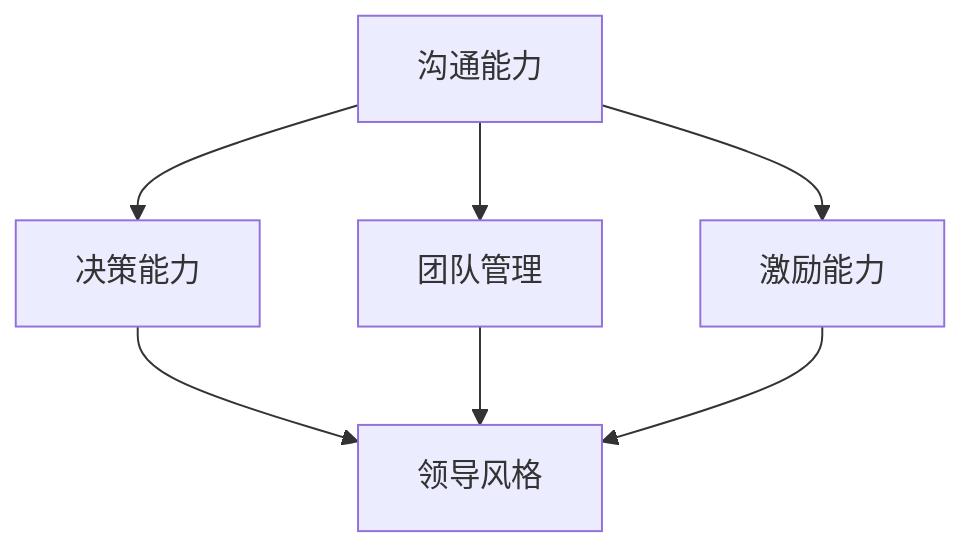

                 


# 领导力修炼手册：从工程师到管理者的进阶指南

关键词：领导力，工程师，管理者，转变，技能培养，案例分析，实战策略

摘要：本文旨在为从工程师角色转型到管理者的技术人员提供一份详尽的指南。文章首先概述了领导力的核心概念及其相互关系，接着探讨了工程师角色转变为管理者角色的必要性和挑战。随后，文章详细介绍了领导力不同方面的技能培养，并通过真实案例进行深入分析，最后提出了将领导力应用到实际工作中的策略和技巧。

## 1. 概述

作为一名工程师，经过多年的技术沉淀和经验积累，很多人都会面临一个职业发展的关键选择：是继续深耕技术领域，还是转而担任管理者，带领团队走向更高的成就？《领导力修炼手册：从工程师到管理者的进阶指南》正是为了帮助这些技术人员在职业转型的道路上迈出坚实的步伐而编写的。

本书旨在为读者提供一系列实用的方法和技巧，帮助他们理解领导力的本质，掌握管理技能，从而顺利实现从工程师到管理者的转型。本书的结构分为以下几个部分：

1. 领导力的核心概念与联系
2. 工程师到管理者的转变
3. 领导力技能培养
4. 案例分析
5. 实战与策略
6. 总结与展望

通过这六个部分，读者将能够系统地了解领导力的重要概念，掌握从技术专家到管理者的转变技巧，学会培养和提升领导力技能，并通过案例分析理解领导力的实际应用，最终学会如何将领导力有效地应用到实际工作中。

## 2. 核心概念与联系

领导力是一个多维度的概念，包含了许多关键要素。以下是领导力的几个核心概念及其相互关系：

### 2.1 沟通能力

沟通能力是领导力的基础。有效的沟通能够确保团队中的每个成员都能理解目标和期望，减少误解和冲突。沟通能力包括口头和书面沟通、倾听能力、以及非语言沟通等方面。

### 2.2 决策能力

决策能力是领导者的一项重要技能。一个好的决策需要综合考虑各种因素，包括风险、收益、时间成本等。决策能力还包括快速判断和灵活应对问题的能力。

### 2.3 团队管理

团队管理是领导力的核心。一个优秀的领导者需要能够建立高效的团队，激发团队成员的潜力，并确保团队目标的实现。团队管理涉及人员配置、任务分配、绩效评估等方面。

### 2.4 激励能力

激励能力是领导力的关键。领导者需要了解团队成员的动机和需求，提供合适的激励措施，以激发他们的工作热情和创造力。

### 2.5 领导风格

领导风格是领导力的重要组成部分。不同的领导风格适用于不同的情境和团队。常见的领导风格包括权威型、民主型、参与型等。

以下是这些核心概念的相互关系架构 Mermaid 流程图：



### 2.6 核心算法原理讲解

为了更好地理解这些领导力技能，我们可以借助一些核心算法原理来进行讲解。以下是几个典型的算法原理：

#### 2.6.1 决策树（Decision Tree）

决策树是一种常用的算法，用于分类和回归问题。它的核心思想是通过一系列的判断条件（特征），将数据进行分层，最终得到一个分类或回归的结果。

伪代码如下：

```plaintext
function decisionTree(data, features):
    if data is pure:
        return majorityClass(data)
    else:
        bestFeature = findBestFeature(data, features)
        decisionTreeRoot = {
            feature: bestFeature,
            left: decisionTree(data[leftSubgroup], features),
            right: decisionTree(data[rightSubgroup], features)
        }
        return decisionTreeRoot
```

#### 2.6.2 集成算法（Ensemble Methods）

集成算法是通过结合多个模型来提高预测准确性的方法。常见的集成算法包括随机森林（Random Forest）、梯度提升树（Gradient Boosting Tree）等。

伪代码如下：

```plaintext
function ensembleMethods(models, data):
    predictions = []
    for model in models:
        prediction = model.predict(data)
        predictions.append(prediction)
    ensemblePrediction = majorityVote(predictions)
    return ensemblePrediction
```

#### 2.6.3 贪心算法（Greedy Algorithm）

贪心算法是一种在每一步选择中都采取当前最好或最优的选择，以期达到全局最优解的算法。常见的贪心算法包括 Prim 算法、Dijkstra 算法等。

伪代码如下：

```plaintext
function greedyAlgorithm(data):
    bestChoice = None
    for each possible choice in data:
        if isBetter(currentChoice, bestChoice):
            bestChoice = currentChoice
    return bestChoice
```

### 2.7 数学模型和公式

在领导力培养中，数学模型和公式也起到了重要作用。以下是几个关键的数学模型和公式：

#### 2.7.1 成本效益分析（Cost-Benefit Analysis）

成本效益分析是一种用于评估项目或决策的成本和效益的方法。它的核心公式如下：

$$
\text{净收益} = \text{总收益} - \text{总成本}
$$

#### 2.7.2 决策树信息增益（Information Gain）

信息增益是决策树中用于选择最佳特征的重要指标。它的公式如下：

$$
\text{信息增益} = \text{熵}(\text{特征}) - \text{条件熵}(\text{特征}|\text{标签})
$$

#### 2.7.3 随机森林准确率（Random Forest Accuracy）

随机森林的准确率是评估模型性能的重要指标。它的公式如下：

$$
\text{准确率} = \frac{\text{正确预测的样本数}}{\text{总样本数}}
$$

### 2.8 举例说明

为了更好地理解这些概念和算法，我们可以通过一些具体的例子来进行说明。

#### 2.8.1 沟通能力的例子

假设一个团队正在开发一个新项目，项目经理需要与团队成员进行有效的沟通。以下是沟通能力在项目中的具体应用：

- **明确目标**：项目经理首先需要明确项目的目标和期望结果，并将这些信息传达给团队成员。
- **需求分析**：项目经理需要与产品经理、客户进行沟通，了解项目的具体需求，并将这些需求转化为可操作的任务。
- **进度汇报**：项目经理需要定期与团队成员沟通项目进度，确保每个人都知道项目的当前状态。
- **冲突解决**：在项目开发过程中，可能会出现各种冲突。项目经理需要通过有效的沟通来解决问题，确保项目顺利进行。

#### 2.8.2 决策能力的例子

假设一个团队在项目开发过程中遇到了一个关键决策点，是继续优化现有功能，还是开发新的功能。以下是决策能力在项目中的具体应用：

- **分析风险和收益**：项目经理需要分析继续优化现有功能和开发新功能的潜在风险和收益，并做出最佳决策。
- **快速决策**：在某些情况下，项目经理可能需要在短时间内做出决策，这时需要利用快速判断和灵活应对问题的能力。
- **团队沟通**：项目经理需要与团队成员进行沟通，确保他们理解决策的理由和影响。

#### 2.8.3 团队管理的例子

假设一个团队正在开发一个复杂的项目，以下是团队管理在项目中的具体应用：

- **人员配置**：项目经理需要根据团队成员的技能和经验进行合理的分配，确保每个成员都能发挥最大的作用。
- **任务分配**：项目经理需要将项目分解为多个任务，并将这些任务分配给合适的团队成员。
- **绩效评估**：项目经理需要定期对团队成员的工作进行评估，并提供反馈，以帮助他们改进。

#### 2.8.4 激励能力的例子

假设一个团队的工作积极性不高，以下是激励能力在项目中的具体应用：

- **了解团队成员的需求**：项目经理需要了解团队成员的动机和需求，并提供合适的激励措施。
- **提供反馈**：项目经理需要定期向团队成员提供工作反馈，以鼓励他们继续努力。
- **奖励制度**：项目经理可以设置奖励制度，对表现优秀的团队成员进行奖励，以激发他们的工作热情。

#### 2.8.5 领导风格的例子

假设一个团队需要快速解决问题，以下是不同领导风格在项目中的具体应用：

- **权威型领导风格**：项目经理可以直接做出决策，迅速解决问题。
- **民主型领导风格**：项目经理可以组织团队成员进行讨论，共同做出决策。
- **参与型领导风格**：项目经理可以鼓励团队成员参与决策过程，提高他们的参与感和责任感。

## 3. 工程师到管理者的转变

从工程师角色转变为管理者角色是一个重要的职业发展里程碑。这个转变不仅涉及到角色和职责的变化，还包括思维方式和行为方式的转变。

### 3.1 必要性

工程师在工作中专注于解决具体的技术问题，而管理者则需要关注整个团队的目标和进度。随着技术的发展和项目的复杂性增加，工程师需要具备更高的视野和更全面的技能，才能带领团队实现目标。因此，从工程师到管理者的转变成为一种必然。

### 3.2 挑战

然而，这个转变也带来了许多挑战。首先，工程师需要从技术专家的角色中跳脱出来，学会关注团队的整体表现。其次，管理者需要具备更强的沟通能力、决策能力和团队管理能力。此外，管理者还需要面对更多的压力和责任，需要更好地平衡工作和生活。

### 3.3 思维方式和行为方式的转变

为了顺利实现从工程师到管理者的转变，工程师需要做出以下思维方式和行为方式的转变：

- **从关注个体到关注整体**：工程师需要从关注自己的技术工作转向关注整个团队的目标和进度。
- **从解决问题到解决问题和分配问题**：工程师需要学会如何分配任务，以及如何帮助团队成员解决问题。
- **从技术视角到管理视角**：工程师需要学会从全局角度看待项目，关注项目中的风险和机遇。
- **从执行者到领导者**：工程师需要学会领导团队，激发团队成员的潜力，并确保团队目标的实现。

## 4. 领导力技能培养

领导力是一种可以通过学习和实践不断培养的技能。以下是几个关键方面的领导力技能培养：

### 4.1 沟通能力的培养

沟通能力是领导者的一项核心技能。以下是一些培养沟通能力的建议：

- **倾听**：倾听是有效沟通的关键。领导者需要学会倾听团队成员的想法和意见。
- **表达**：领导者需要学会清晰、简洁地表达自己的想法，确保团队成员理解。
- **反馈**：领导者需要学会给予团队成员及时的反馈，以帮助他们改进。

### 4.2 决策能力的培养

决策能力是领导者的重要素质。以下是一些培养决策能力的建议：

- **信息收集**：领导者需要收集充分的信息，以便做出明智的决策。
- **风险评估**：领导者需要评估决策可能带来的风险和收益。
- **快速决策**：领导者需要具备快速决策的能力，以应对紧急情况。

### 4.3 团队管理的培养

团队管理是领导者的一项关键职责。以下是一些培养团队管理的建议：

- **人员配置**：领导者需要根据团队成员的技能和经验进行合理的分配。
- **任务分配**：领导者需要将项目分解为多个任务，并分配给合适的团队成员。
- **绩效评估**：领导者需要定期对团队成员的工作进行评估，并提供反馈。

### 4.4 激励能力的培养

激励能力是领导者的重要素质。以下是一些培养激励能力的建议：

- **了解团队成员的需求**：领导者需要了解团队成员的动机和需求，并提供合适的激励措施。
- **提供反馈**：领导者需要定期向团队成员提供工作反馈，以鼓励他们继续努力。
- **奖励制度**：领导者可以设置奖励制度，对表现优秀的团队成员进行奖励。

### 4.5 领导风格的培养

领导风格是领导者的一种个人特质。以下是一些培养领导风格的建议：

- **了解自己的领导风格**：领导者需要了解自己的领导风格，并找到适合自己的领导方式。
- **适应不同情境**：领导者需要学会根据不同情境和团队的需求调整自己的领导风格。
- **持续学习**：领导者需要持续学习，不断改进自己的领导风格。

## 5. 案例分析

为了更好地理解领导力的实际应用，以下将分析几个真实的案例：

### 5.1 案例一：从工程师到项目经理

张华是一名资深的软件工程师，在公司的技术部门工作多年。随着项目的复杂性增加，公司决定让张华担任项目经理，负责带领团队完成一个大型项目。张华面临着从技术专家到管理者的转变。

#### 分析：

- **沟通能力**：张华需要学会与团队成员、客户和上级进行有效沟通，确保项目的顺利进行。
- **决策能力**：张华需要学会快速做出决策，特别是在项目遇到紧急情况时。
- **团队管理**：张华需要学会合理分配任务，确保每个团队成员都能发挥自己的优势。
- **激励能力**：张华需要了解团队成员的需求，并提供合适的激励措施，以激发他们的工作热情。

### 5.2 案例二：领导风格的转变

李明是一名经验丰富的项目经理，一直采用权威型领导风格。然而，在一次项目中，李明的团队遇到了严重的沟通问题，导致项目进度严重滞后。经过反思，李明决定改变自己的领导风格。

#### 分析：

- **权威型领导风格**：李明原来的领导风格过于强硬，导致团队成员缺乏参与感和责任感。
- **民主型领导风格**：李明开始采用民主型领导风格，鼓励团队成员参与决策过程，提高了团队的凝聚力和效率。
- **领导风格转变的挑战**：李明需要克服自己的心理障碍，学会接受团队成员的不同意见。

### 5.3 案例三：应对危机

王刚是一名技术团队的领导者，在一次项目中，团队成员突然遇到了一个无法解决的问题。王刚需要快速做出决策，确保项目进度不受影响。

#### 分析：

- **快速决策**：王刚需要迅速分析问题，找到解决方案。
- **团队协作**：王刚需要调动团队中的其他成员，共同解决问题。
- **沟通**：王刚需要与团队成员保持密切沟通，确保每个人都了解问题的严重性和解决方案。

## 6. 实战与策略

将领导力应用到实际工作中是一个复杂的过程。以下是一些实用的策略和技巧，帮助领导者更好地将领导力应用到实际工作中：

### 6.1 建立清晰的沟通机制

- **定期会议**：定期召开团队会议，确保团队成员了解项目的最新进展和问题。
- **反馈机制**：建立反馈机制，鼓励团队成员提出意见和建议。
- **透明度**：保持项目信息的透明度，确保团队成员了解项目的目标和进度。

### 6.2 培养团队协作精神

- **共同目标**：确保团队成员明确共同的目标和愿景。
- **任务分配**：根据团队成员的技能和兴趣进行任务分配，提高工作效率。
- **团队合作**：鼓励团队成员相互支持和合作，共同解决问题。

### 6.3 提高决策能力

- **信息收集**：在做出决策前，收集充分的信息，确保决策的准确性。
- **风险评估**：评估决策可能带来的风险和收益，做出明智的决策。
- **快速响应**：在紧急情况下，迅速做出决策，确保项目进度不受影响。

### 6.4 激励团队成员

- **了解需求**：了解团队成员的动机和需求，提供合适的激励措施。
- **反馈与奖励**：定期提供工作反馈，对表现优秀的团队成员进行奖励。
- **认可与表扬**：及时认可团队成员的贡献，提高他们的工作积极性。

### 6.5 持续学习与改进

- **自我反思**：定期进行自我反思，找出自己的不足并改进。
- **学习交流**：积极参加培训和交流活动，学习其他领导者的经验。
- **适应变化**：学会适应变化，不断调整自己的领导方式。

## 7. 总结与展望

领导力是技术人员在职业发展过程中必须掌握的重要技能。通过《领导力修炼手册：从工程师到管理者的进阶指南》，我们系统地了解了领导力的核心概念、技能培养方法和实际应用策略。从沟通能力、决策能力、团队管理到激励能力，每一个方面都是领导者成功的关键。

展望未来，领导力的发展将更加注重创新思维、跨文化沟通和团队合作。随着技术的发展和市场的变化，领导者需要不断学习新知识、新技能，以应对不断出现的新挑战。同时，领导者也需要关注团队成员的成长和发展，为他们提供更多的机会和支持。

总之，领导力是一个不断学习和改进的过程。只有不断努力，才能成为一名优秀的领导者，带领团队走向更高的成就。作者：AI天才研究院/AI Genius Institute & 禅与计算机程序设计艺术 /Zen And The Art of Computer Programming 

